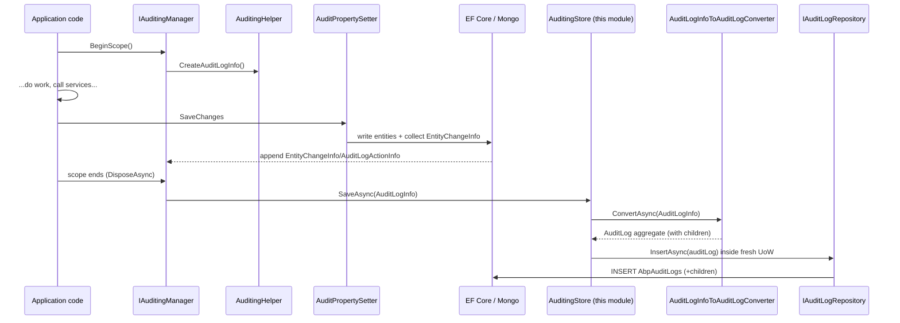
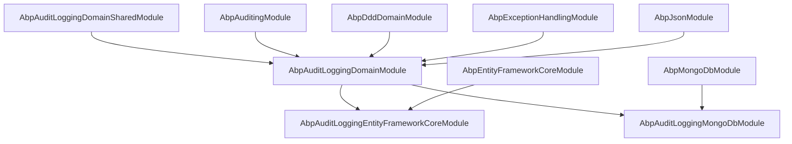

`Volo.Abp.AuditLogging` is the persistence half of ABP’s auditing pipeline. The [core auditing engine](/auditing/overview) collects an in-memory `AuditLogInfo` per request through `IAuditingManager`; this module receives that record at the end of the scope, converts it into a persistent aggregate (`AuditLog` with child collections of `AuditLogAction`, `EntityChange`, and `EntityPropertyChange`), and writes it via a repository against either Entity Framework Core or MongoDB. It also provides truncation constants, a module-extension surface for adding custom columns, and query helpers for the admin UI.

The module is intentionally write-heavy with paginated reads. The `AuditLog` table is the largest table in most ABP deployments — each request can land one row plus many child rows — so the schema uses fixed-width string truncation, dedicated indexes on `(TenantId, ExecutionTime)`, and explicit `IncludeDetails` toggles for queries that join children. This page maps the four packages that ship the module and shows how an `AuditLogInfo` becomes durable storage.

<Info>
The module ships as four NuGet packages: `Domain.Shared`, `Domain`, `EntityFrameworkCore`, and `MongoDB`. The Domain layer defines the aggregate; each provider layer adds a repository and a `DbContext`. There is no Application or HTTP API package — admin UIs talk to the repository through a separately-maintained admin module.
</Info>

## Package map

<CardGroup cols={2}>
  <Card title="Domain.Shared" icon="cube">
    Constants, localization, extension config. Pure POCOs, no DI.
  </Card>
  <Card title="Domain" icon="database">
    `AuditLog`, `EntityChange`, `EntityPropertyChange`, `AuditingStore`, `IAuditLogRepository`.
  </Card>
  <Card title="EntityFrameworkCore" icon="server">
    `AbpAuditLoggingDbContext`, model builder, `EfCoreAuditLogRepository`.
  </Card>
  <Card title="MongoDB" icon="leaf">
    `AuditLoggingMongoDbContext`, `MongoAuditLogRepository`.
  </Card>
</CardGroup>

## File inventory

### `Volo.Abp.AuditLogging.Domain.Shared`

| File | Purpose |
|---|---|
| `AbpAuditLoggingDomainSharedModule.cs` | Registers `AuditLoggingResource` and embedded JSON localizations. |
| `AuditLogConsts.cs` | Max-length constants for `AuditLog` columns. |
| `AuditLogActionConsts.cs` | Max-length constants for `AuditLogAction`. |
| `EntityChangeConsts.cs` | Max-length constants for `EntityChange`. |
| `EntityPropertyChangeConsts.cs` | Max-length constants for `EntityPropertyChange`. |
| `Localization/AuditLoggingResource.cs` + `Localization/*.json` | Localization keys and 26 culture JSON files. |
| `ObjectExtending/AuditLoggingModuleExtensionConsts.cs` | Module name + entity names for the extension system. |
| `ObjectExtending/AuditLoggingModuleExtensionConfiguration.cs` | Fluent `ConfigureAuditLog` / `ConfigureAuditLogAction` / `ConfigureEntityChange`. |
| `ObjectExtending/AuditLoggingModuleExtensionConfigurationDictionaryExtensions.cs` | `ConfigureAuditLogging(...)` entry point on `ModuleExtensionConfigurationDictionary`. |

### `Volo.Abp.AuditLogging.Domain`

| File | Purpose |
|---|---|
| `AbpAuditLoggingDbProperties.cs` | `DbTablePrefix`, `DbSchema`, `ConnectionStringName = "AbpAuditLogging"`. |
| `AbpAuditLoggingDomainModule.cs` | Wires extension configuration into the three aggregate types. |
| `AuditLog.cs` | `AggregateRoot<Guid>`, `IMultiTenant`, `[DisableAuditing]`. |
| `AuditLogAction.cs` | Child entity capturing a single method invocation. |
| `EntityChange.cs` | Child entity for one entity touched by the request. |
| `EntityPropertyChange.cs` | Grandchild entity for one property of an `EntityChange`. |
| `EntityChangeWithUsername.cs` | DTO pairing `EntityChange` with resolved `UserName`. |
| `AuditingStore.cs` | Default `IAuditingStore` implementation; opens UoW and inserts. |
| `IAuditLogInfoToAuditLogConverter.cs` + `AuditLogInfoToAuditLogConverter.cs` | Maps `AuditLogInfo` → `AuditLog` aggregate. |
| `IAuditLogRepository.cs` | Repository contract with paged queries and aggregate analytics. |

### `Volo.Abp.AuditLogging.EntityFrameworkCore`

| File | Purpose |
|---|---|
| `EntityFrameworkCore/IAuditLoggingDbContext.cs` | `DbSet<AuditLog>` projection. |
| `EntityFrameworkCore/AbpAuditLoggingDbContext.cs` | Concrete EF Core context. |
| `EntityFrameworkCore/AbpAuditLoggingDbContextModelBuilderExtensions.cs` | `ConfigureAuditLogging(ModelBuilder)`; tables, lengths, FKs, indexes. |
| `EntityFrameworkCore/EfCoreAuditLogRepository.cs` | LINQ + `System.Linq.Dynamic.Core` repository. |
| `EntityFrameworkCore/AbpAuditLoggingEntityFrameworkCoreModule.cs` | Registers `AbpAuditLoggingDbContext` and the repository. |
| `AbpAuditLoggingEfCoreQueryableExtensions.cs` | `IncludeDetails` for `AuditLog` and `EntityChange`. |

### `Volo.Abp.AuditLogging.MongoDB`

| File | Purpose |
|---|---|
| `MongoDB/IAuditLoggingMongoDbContext.cs` | `IMongoCollection<AuditLog>` projection. |
| `MongoDB/AuditLoggingMongoDbContext.cs` | Concrete Mongo context; calls `ConfigureAuditLogging`. |
| `MongoDB/AbpAuditLoggingMongoDbContextExtensions.cs` | Sets the collection name on the model builder. |
| `MongoDB/MongoAuditLogRepository.cs` | Mongo `IQueryable` implementation of `IAuditLogRepository`. |
| `MongoDB/AbpAuditLoggingMongoDbModule.cs` | Registers the Mongo context and repository. |

## The AuditLog aggregate

`AuditLog` is an `AggregateRoot<Guid>` (see [entities and aggregate roots](/ddd/entities-and-aggregates)) and an `IMultiTenant`. It is itself marked `[DisableAuditing]` (an attribute defined in the [auditing contracts](/auditing/auditing-contracts) package) so persisting one does not trigger another audit.

```csharp title="modules/audit-logging/src/Volo.Abp.AuditLogging.Domain/Volo/Abp/AuditLogging/AuditLog.cs"
[DisableAuditing]
public class AuditLog : AggregateRoot<Guid>, IMultiTenant
{
    public virtual string ApplicationName { get; set; }
    public virtual Guid? UserId { get; protected set; }
    public virtual string UserName { get; protected set; }
    public virtual Guid? TenantId { get; protected set; }
    public virtual string TenantName { get; protected set; }
    public virtual Guid? ImpersonatorUserId { get; protected set; }
    public virtual string ImpersonatorUserName { get; protected set; }
    public virtual Guid? ImpersonatorTenantId { get; protected set; }
    public virtual string ImpersonatorTenantName { get; protected set; }
    public virtual DateTime ExecutionTime { get; protected set; }
    public virtual int ExecutionDuration { get; protected set; }
    public virtual string ClientIpAddress { get; protected set; }
    public virtual string ClientName { get; protected set; }
    public virtual string ClientId { get; set; }
    public virtual string CorrelationId { get; set; }
    public virtual string BrowserInfo { get; protected set; }
    public virtual string HttpMethod { get; protected set; }
    public virtual string Url { get; protected set; }
    public virtual string Exceptions { get; protected set; }
    public virtual string Comments { get; protected set; }
    public virtual int? HttpStatusCode { get; set; }
    public virtual ICollection<EntityChange> EntityChanges { get; protected set; }
    public virtual ICollection<AuditLogAction> Actions { get; protected set; }
```

The constructor truncates every string column to the limit declared in `AuditLogConsts`, so a 200KB stack trace cannot corrupt a row:

```csharp title="modules/audit-logging/src/Volo.Abp.AuditLogging.Domain/Volo/Abp/AuditLogging/AuditLog.cs"
ApplicationName = applicationName.Truncate(AuditLogConsts.MaxApplicationNameLength);
TenantName      = tenantName.Truncate(AuditLogConsts.MaxTenantNameLength);
UserName        = userName.Truncate(AuditLogConsts.MaxUserNameLength);
ClientIpAddress = clientIpAddress.Truncate(AuditLogConsts.MaxClientIpAddressLength);
ClientName      = clientName.Truncate(AuditLogConsts.MaxClientNameLength);
ClientId        = clientId.Truncate(AuditLogConsts.MaxClientIdLength);
CorrelationId   = correlationId.Truncate(AuditLogConsts.MaxCorrelationIdLength);
BrowserInfo     = browserInfo.Truncate(AuditLogConsts.MaxBrowserInfoLength);
HttpMethod      = httpMethod.Truncate(AuditLogConsts.MaxHttpMethodLength);
Url             = url.Truncate(AuditLogConsts.MaxUrlLength);
Comments        = comments.Truncate(AuditLogConsts.MaxCommentsLength);
```

`Exceptions` (the only column without a `Max…Length` in the consts class) is JSON-serialised and stored without truncation — it is meant to be inspected.

### Column length defaults

| Field | Constant | Default |
|---|---|---|
| `ApplicationName` | `MaxApplicationNameLength` | 96 |
| `UserName`, `ImpersonatorUserName` | `MaxUserNameLength` | 256 |
| `TenantName`, `ImpersonatorTenantName` | `MaxTenantNameLength` | 64 |
| `ClientIpAddress` | `MaxClientIpAddressLength` | 64 |
| `ClientName` | `MaxClientNameLength` | 128 |
| `ClientId` | `MaxClientIdLength` | 64 |
| `CorrelationId` | `MaxCorrelationIdLength` | 64 |
| `BrowserInfo` | `MaxBrowserInfoLength` | 512 |
| `HttpMethod` | `MaxHttpMethodLength` | 16 |
| `Url` | `MaxUrlLength` | 256 |
| `Comments` | `MaxCommentsLength` | 256 |

All constants are `static int` setters so an app can change them at startup before the DbContext is built.

## AuditLogAction

One row per audited service / method call inside a request scope.

```csharp title="modules/audit-logging/src/Volo.Abp.AuditLogging.Domain/Volo/Abp/AuditLogging/AuditLogAction.cs"
[DisableAuditing]
public class AuditLogAction : Entity<Guid>, IMultiTenant, IHasExtraProperties
{
    public virtual Guid? TenantId { get; protected set; }
    public virtual Guid AuditLogId { get; protected set; }
    public virtual string ServiceName { get; protected set; }
    public virtual string MethodName { get; protected set; }
    public virtual string Parameters { get; protected set; }
    public virtual DateTime ExecutionTime { get; protected set; }
    public virtual int ExecutionDuration { get; protected set; }
    public virtual ExtraPropertyDictionary ExtraProperties { get; protected set; }
```

Notice the `Parameters` guard: if the serialised parameters exceed the limit the field is set to empty string rather than truncated mid-JSON, so deserialisation downstream does not throw:

```csharp title="modules/audit-logging/src/Volo.Abp.AuditLogging.Domain/Volo/Abp/AuditLogging/AuditLogAction.cs"
Parameters = actionInfo.Parameters.Length > AuditLogActionConsts.MaxParametersLength
    ? ""
    : actionInfo.Parameters;
```

`AuditLogActionConsts` defaults: `MaxServiceNameLength = 256`, `MaxMethodNameLength = 128`, `MaxParametersLength = 2000`.

## EntityChange and EntityPropertyChange

These two capture **what data changed**, complementing `AuditLogAction` which captures **what code ran**.

```csharp title="modules/audit-logging/src/Volo.Abp.AuditLogging.Domain/Volo/Abp/AuditLogging/EntityChange.cs"
[DisableAuditing]
public class EntityChange : Entity<Guid>, IMultiTenant, IHasExtraProperties
{
    public virtual Guid AuditLogId { get; protected set; }
    public virtual Guid? TenantId { get; protected set; }
    public virtual DateTime ChangeTime { get; protected set; }
    public virtual EntityChangeType ChangeType { get; protected set; }
    public virtual Guid? EntityTenantId { get; protected set; }
    public virtual string EntityId { get; protected set; }
    public virtual string EntityTypeFullName { get; protected set; }
    public virtual ICollection<EntityPropertyChange> PropertyChanges { get; protected set; }
    public virtual ExtraPropertyDictionary ExtraProperties { get; protected set; }
```

`ChangeType` uses the byte enum from the [auditing contracts](/auditing/auditing-contracts):

```csharp
public enum EntityChangeType : byte
{
    Created = 0,
    Updated = 1,
    Deleted = 2
}
```

```csharp title="modules/audit-logging/src/Volo.Abp.AuditLogging.Domain/Volo/Abp/AuditLogging/EntityPropertyChange.cs"
[DisableAuditing]
public class EntityPropertyChange : Entity<Guid>, IMultiTenant
{
    public virtual Guid? TenantId { get; protected set; }
    public virtual Guid EntityChangeId { get; protected set; }
    public virtual string NewValue { get; protected set; }
    public virtual string OriginalValue { get; protected set; }
    public virtual string PropertyName { get; protected set; }
    public virtual string PropertyTypeFullName { get; protected set; }
```

The lengths come from `EntityChangeConsts` (`MaxEntityTypeFullNameLength = 128`, `MaxEntityIdLength = 128`) and `EntityPropertyChangeConsts` (`MaxNewValueLength = 512`, `MaxOriginalValueLength = 512`, `MaxPropertyNameLength = 128`, `MaxPropertyTypeFullNameLength = 64`).

A read-side projection used by the admin UI ships alongside:

```csharp title="modules/audit-logging/src/Volo.Abp.AuditLogging.Domain/Volo/Abp/AuditLogging/EntityChangeWithUsername.cs"
public class EntityChangeWithUsername
{
    public EntityChange EntityChange { get; set; }

    public string UserName { get; set; }
}
```

## AuditLogInfo → AuditLog conversion

`AuditLogInfoToAuditLogConverter` is the bridge between the in-memory record built by `IAuditingManager` and the persistent aggregate.

```csharp title="modules/audit-logging/src/Volo.Abp.AuditLogging.Domain/Volo/Abp/AuditLogging/AuditLogInfoToAuditLogConverter.cs"
public virtual Task<AuditLog> ConvertAsync(AuditLogInfo auditLogInfo)
{
    var auditLogId = GuidGenerator.Create();

    var extraProperties = new ExtraPropertyDictionary();
    if (auditLogInfo.ExtraProperties != null)
    {
        foreach (var pair in auditLogInfo.ExtraProperties)
        {
            extraProperties.Add(pair.Key, pair.Value);
        }
    }

    var entityChanges = auditLogInfo
        .EntityChanges?
        .Select(entityChangeInfo => new EntityChange(GuidGenerator, auditLogId, entityChangeInfo, tenantId: auditLogInfo.TenantId))
        .ToList()
        ?? new List<EntityChange>();

    var actions = auditLogInfo
        .Actions?
        .Select(auditLogActionInfo => new AuditLogAction(GuidGenerator.Create(), auditLogId, auditLogActionInfo, tenantId: auditLogInfo.TenantId))
        .ToList()
        ?? new List<AuditLogAction>();
```

Exceptions are folded through `IExceptionToErrorInfoConverter` so client-visible details respect `AbpExceptionHandlingOptions.SendExceptionsDetailsToClients`, then JSON-serialised:

```csharp title="modules/audit-logging/src/Volo.Abp.AuditLogging.Domain/Volo/Abp/AuditLogging/AuditLogInfoToAuditLogConverter.cs"
var remoteServiceErrorInfos = auditLogInfo.Exceptions?.Select(exception => ExceptionToErrorInfoConverter.Convert(exception, options =>
                                  {
                                      options.SendExceptionsDetailsToClients = ExceptionHandlingOptions.SendExceptionsDetailsToClients;
                                      options.SendStackTraceToClients = ExceptionHandlingOptions.SendStackTraceToClients;
                                  }))
                              ?? new List<RemoteServiceErrorInfo>();

var exceptions = remoteServiceErrorInfos.Any()
    ? JsonSerializer.Serialize(remoteServiceErrorInfos, indented: true)
    : null;
```

The converter is registered as `ITransientDependency` and `IAuditLogInfoToAuditLogConverter`, so an app can override it in DI to inject custom fields without subclassing `AuditingStore`.

## AuditingStore

This is the implementation of `IAuditingStore` that the [core auditing engine](/auditing/overview) calls at the end of each audit scope. Replacing the default `SimpleLogAuditingStore` with this one is what causes audits to be persisted.

```csharp title="modules/audit-logging/src/Volo.Abp.AuditLogging.Domain/Volo/Abp/AuditLogging/AuditingStore.cs"
public class AuditingStore : IAuditingStore, ITransientDependency
{
    public ILogger<AuditingStore> Logger { get; set; }
    protected IAuditLogRepository AuditLogRepository { get; }
    protected IUnitOfWorkManager UnitOfWorkManager { get; }
    protected AbpAuditingOptions Options { get; }
    protected IAuditLogInfoToAuditLogConverter Converter { get; }

    public virtual async Task SaveAsync(AuditLogInfo auditInfo)
    {
        if (!Options.HideErrors)
        {
            await SaveLogAsync(auditInfo);
            return;
        }

        try
        {
            await SaveLogAsync(auditInfo);
        }
        catch (Exception ex)
        {
            Logger.LogWarning("Could not save the audit log object: " + Environment.NewLine + auditInfo.ToString());
            Logger.LogException(ex, LogLevel.Error);
        }
    }

    protected virtual async Task SaveLogAsync(AuditLogInfo auditInfo)
    {
        using (var uow = UnitOfWorkManager.Begin(true))
        {
            await AuditLogRepository.InsertAsync(await Converter.ConvertAsync(auditInfo));
            await uow.CompleteAsync();
        }
    }
}
```

Two design decisions are worth highlighting:

- `UnitOfWorkManager.Begin(true)` opens a **new** transactional UoW so persistence is not coupled to the business UoW that produced the data (which may already have been committed or rolled back). See [unit of work](/uow).
- When `AbpAuditingOptions.HideErrors` is `true`, save failures are logged at warning + error level but never propagated — auditing must not break the request.

## Persistence flow end-to-end



## IAuditLogRepository

The repository contract surface mixes paginated read APIs with a small analytics method.

```csharp title="modules/audit-logging/src/Volo.Abp.AuditLogging.Domain/Volo/Abp/AuditLogging/IAuditLogRepository.cs"
public interface IAuditLogRepository : IRepository<AuditLog, Guid>
{
    Task<List<AuditLog>> GetListAsync(
        string sorting = null,
        int maxResultCount = 50,
        int skipCount = 0,
        DateTime? startTime = null,
        DateTime? endTime = null,
        string httpMethod = null,
        string url = null,
        Guid? userId = null,
        string userName = null,
        string applicationName = null,
        string clientIpAddress = null,
        string correlationId = null,
        int? maxExecutionDuration = null,
        int? minExecutionDuration = null,
        bool? hasException = null,
        HttpStatusCode? httpStatusCode = null,
        bool includeDetails = false,
        CancellationToken cancellationToken = default);

    Task<long> GetCountAsync(/* same filter shape */);

    Task<Dictionary<DateTime, double>> GetAverageExecutionDurationPerDayAsync(
        DateTime startDate,
        DateTime endDate,
        CancellationToken cancellationToken = default);

    Task<EntityChange> GetEntityChange(Guid entityChangeId, CancellationToken cancellationToken = default);

    Task<List<EntityChange>> GetEntityChangeListAsync(/* sorting, paging, filters */);

    Task<long> GetEntityChangeCountAsync(/* filters */);

    Task<EntityChangeWithUsername> GetEntityChangeWithUsernameAsync(Guid entityChangeId, CancellationToken cancellationToken = default);

    Task<List<EntityChangeWithUsername>> GetEntityChangesWithUsernameAsync(string entityId, string entityTypeFullName, CancellationToken cancellationToken = default);
}
```

The repository is **the** public extension point: alternative provider implementations (e.g. ElasticSearch, Splunk) can replace it without touching the aggregate or `AuditingStore`.

## EF Core provider

The model builder is the canonical reference for the database schema. The tables follow the `Abp` prefix:

```csharp title="modules/audit-logging/src/Volo.Abp.AuditLogging.EntityFrameworkCore/Volo/Abp/AuditLogging/EntityFrameworkCore/AbpAuditLoggingDbContextModelBuilderExtensions.cs"
builder.Entity<AuditLog>(b =>
{
    b.ToTable(AbpAuditLoggingDbProperties.DbTablePrefix + "AuditLogs", AbpAuditLoggingDbProperties.DbSchema);
    b.ConfigureByConvention();

    b.Property(x => x.ApplicationName).HasMaxLength(AuditLogConsts.MaxApplicationNameLength).HasColumnName(nameof(AuditLog.ApplicationName));
    b.Property(x => x.ClientIpAddress).HasMaxLength(AuditLogConsts.MaxClientIpAddressLength).HasColumnName(nameof(AuditLog.ClientIpAddress));
    // ... (rest of property mappings)
    b.HasMany(a => a.Actions).WithOne().HasForeignKey(x => x.AuditLogId).IsRequired();
    b.HasMany(a => a.EntityChanges).WithOne().HasForeignKey(x => x.AuditLogId).IsRequired();

    b.HasIndex(x => new { x.TenantId, x.ExecutionTime });
    b.HasIndex(x => new { x.TenantId, x.UserId, x.ExecutionTime });

    b.ApplyObjectExtensionMappings();
});
```

The two indexes drive the common admin-UI queries: filter by tenant and date range, optionally narrowed by user. `ApplyObjectExtensionMappings()` honours columns added via `AuditLoggingModuleExtensionConfiguration`.

The `IncludeDetails` helpers make eager loading explicit at the call site so the default list query stays cheap:

```csharp title="modules/audit-logging/src/Volo.Abp.AuditLogging.EntityFrameworkCore/Volo/Abp/AuditLogging/AbpAuditLoggingEfCoreQueryableExtensions.cs"
public static IQueryable<AuditLog> IncludeDetails(
    this IQueryable<AuditLog> queryable,
    bool include = true)
{
    if (!include)
    {
        return queryable;
    }

    return queryable
        .Include(x => x.Actions)
        .Include(x => x.EntityChanges).ThenInclude(ec => ec.PropertyChanges);
}
```

The module registers itself and binds the repository in one line:

```csharp title="modules/audit-logging/src/Volo.Abp.AuditLogging.EntityFrameworkCore/Volo/Abp/AuditLogging/EntityFrameworkCore/AbpAuditLoggingEntityFrameworkCoreModule.cs"
context.Services.AddAbpDbContext<AbpAuditLoggingDbContext>(options =>
{
    options.AddRepository<AuditLog, EfCoreAuditLogRepository>();
});
```

## MongoDB provider

The Mongo model is simpler — one collection, no joins:

```csharp title="modules/audit-logging/src/Volo.Abp.AuditLogging.MongoDB/Volo/Abp/AuditLogging/MongoDB/AbpAuditLoggingMongoDbContextExtensions.cs"
public static void ConfigureAuditLogging(
    this IMongoModelBuilder builder)
{
    Check.NotNull(builder, nameof(builder));

    builder.Entity<AuditLog>(b =>
    {
        b.CollectionName = AbpAuditLoggingDbProperties.DbTablePrefix + "AuditLogs";
    });
}
```

`EntityChange`, `EntityPropertyChange`, and `AuditLogAction` are embedded as BSON sub-documents under their owning `AuditLog`. This trades the EF Core relational fanout for a single round-trip insert at the cost of denormalised query patterns.

```csharp title="modules/audit-logging/src/Volo.Abp.AuditLogging.MongoDB/Volo/Abp/AuditLogging/MongoDB/AbpAuditLoggingMongoDbModule.cs"
context.Services.AddMongoDbContext<AuditLoggingMongoDbContext>(options =>
{
    options.AddRepository<AuditLog, MongoAuditLogRepository>();
});
```

The `MongoAuditLogRepository` uses `MongoDB.Driver.Linq` to back the same `IAuditLogRepository` shape — same filter parameters, same paging contract — so applications can swap providers without changing call sites.

## Connection string and schema

```csharp title="modules/audit-logging/src/Volo.Abp.AuditLogging.Domain/Volo/Abp/AuditLogging/AbpAuditLoggingDbProperties.cs"
public static class AbpAuditLoggingDbProperties
{
    public static string DbTablePrefix { get; set; } = AbpCommonDbProperties.DbTablePrefix;

    public static string DbSchema { get; set; } = AbpCommonDbProperties.DbSchema;

    public const string ConnectionStringName = "AbpAuditLogging";
}
```

By setting `AbpAuditLoggingDbProperties.DbTablePrefix = ""` (or a custom value) before the host is built, an application can rebrand or relocate the three tables, and by adding an `"AbpAuditLogging"` connection string entry it can route them to a separate database — a common choice in high-volume deployments where audit storage uses cheaper, longer-retention disks than transactional data.

## Module extension surface

The Domain module wires the `ObjectExtending` configuration into the three aggregates so apps can add columns without subclassing:

```csharp title="modules/audit-logging/src/Volo.Abp.AuditLogging.Domain/Volo/Abp/AuditLogging/AbpAuditLoggingDomainModule.cs"
ModuleExtensionConfigurationHelper.ApplyEntityConfigurationToEntity(
    AuditLoggingModuleExtensionConsts.ModuleName,
    AuditLoggingModuleExtensionConsts.EntityNames.AuditLog,
    typeof(AuditLog)
);

ModuleExtensionConfigurationHelper.ApplyEntityConfigurationToEntity(
    AuditLoggingModuleExtensionConsts.ModuleName,
    AuditLoggingModuleExtensionConsts.EntityNames.AuditLogAction,
    typeof(AuditLogAction)
);

ModuleExtensionConfigurationHelper.ApplyEntityConfigurationToEntity(
    AuditLoggingModuleExtensionConsts.ModuleName,
    AuditLoggingModuleExtensionConsts.EntityNames.EntityChange,
    typeof(EntityChange)
);
```

The fluent entry point lives in `Domain.Shared`:

```csharp title="modules/audit-logging/src/Volo.Abp.AuditLogging.Domain.Shared/Volo/Abp/ObjectExtending/AuditLoggingModuleExtensionConfiguration.cs"
public AuditLoggingModuleExtensionConfiguration ConfigureAuditLog(
    Action<EntityExtensionConfiguration> configureAction)
{
    return this.ConfigureEntity(
        AuditLoggingModuleExtensionConsts.EntityNames.AuditLog,
        configureAction
    );
}
```

Combined with `ConfigureAuditLogging(...)` on `ModuleExtensionConfigurationDictionary`, an application can add a `CustomField` column to `AuditLog` at startup and have EF Core migrations + admin UI pick it up automatically.

## Module dependencies



The Domain layer depends on the [core auditing module](/auditing/overview) so the `AuditingStore` and `AuditLogInfoToAuditLogConverter` types can reference `AuditLogInfo`, `EntityChangeInfo`, and friends defined there.

## Operational notes

<AccordionGroup>
  <Accordion title="Why no Application or HttpApi packages?">
    The module is intentionally storage-only. Admin UIs (CMS-Kit, ABP Commercial) plug into `IAuditLogRepository` directly from their own application services so deployments without those UIs do not pay for unused contracts.
  </Accordion>
  <Accordion title="How big can an AuditLog row get?">
    Worst case is approximately `Σ(maxLength)` over the constants table — about 2KB for the `AuditLog` row itself. The dominant cost is `Exceptions` (JSON, untruncated) and the `EntityChanges` child collection on multi-aggregate transactions.
  </Accordion>
  <Accordion title="Can I route audit storage to a different database?">
    Yes. Configure a separate `"AbpAuditLogging"` connection string in `IConfiguration`, register `AbpAuditLoggingDbContext` against it, and the rest of the application is unaffected — `AuditingStore` opens its own UoW, which uses the connection string mapped to `AbpAuditLoggingDbProperties.ConnectionStringName`.
  </Accordion>
  <Accordion title="What about retention / archival?">
    The module does not ship a retention worker. Applications typically schedule a `BackgroundJob` that deletes `AbpAuditLogs` older than N days using the `(TenantId, ExecutionTime)` index. The Mongo collection supports TTL indexes for the same effect.
  </Accordion>
</AccordionGroup>

## Related pages

- [Auditing overview](/auditing/overview) — `IAuditingManager`, `AuditLogInfo`, and the request-scoped flow this module persists.
- [Auditing contracts](/auditing/auditing-contracts) — the interfaces and `EntityChangeType` enum referenced by `EntityChange`.
- [Audit log helper and contributors](/auditing/audit-log-helper-and-contributors) — how `EntityChangeInfo` is produced before it reaches `AuditLogInfoToAuditLogConverter`.
- [Unit of work](/uow) — the `IUnitOfWorkManager.Begin(true)` call inside `AuditingStore.SaveLogAsync`.
- [Entities and aggregate roots](/ddd/entities-and-aggregates) — base classes used by `AuditLog`, `AuditLogAction`, `EntityChange`, `EntityPropertyChange`.
