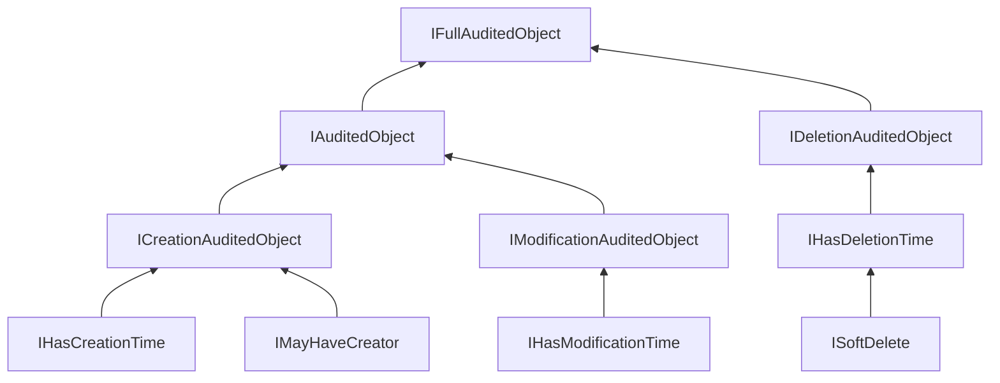
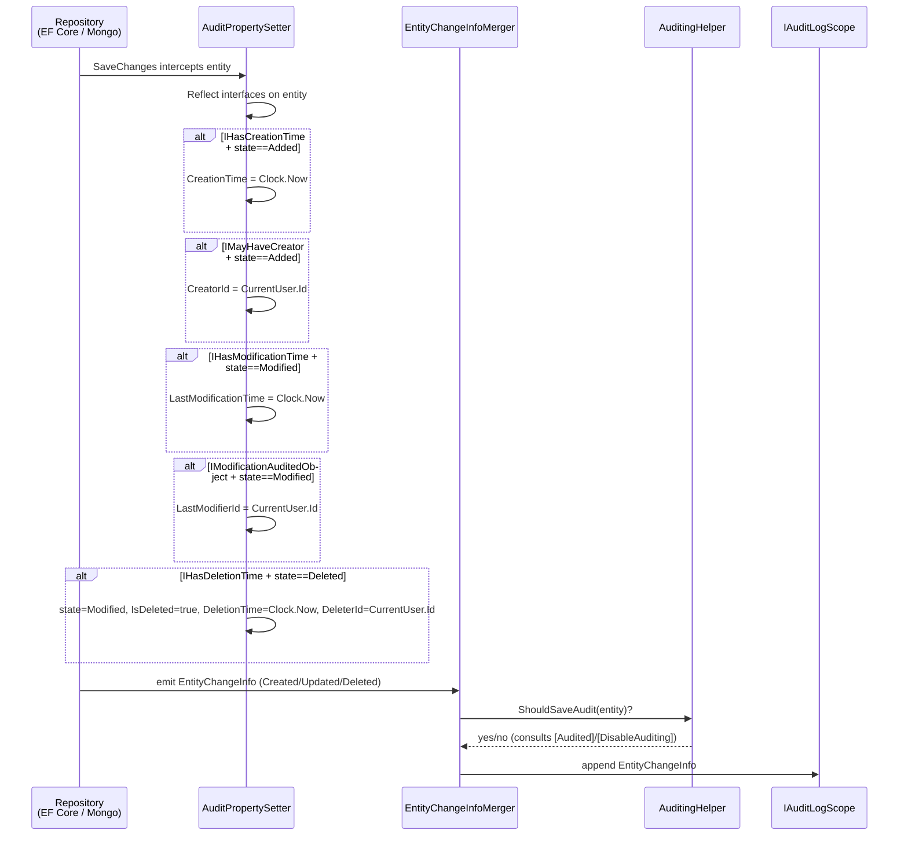

`Volo.Abp.Auditing.Contracts` is the smallest and most foundational of the auditing packages. It carries no executable services — no helpers, no managers, no stores — only the **interfaces, attributes, and one enum** that the rest of the framework keys off when it decides who created an entity, who last modified it, whether it has been soft-deleted, and whether a given method or class should appear in the audit log at all. Domain entities implement these contracts to opt into auditing of their property values; controllers and application services apply the attributes to opt into auditing of their method calls.

Because the package has no dependencies beyond `Volo.Abp.Data` (which provides `ISoftDelete`), it can be referenced from `Domain.Shared` projects without dragging in the auditing runtime. The `Volo.Abp.Auditing` package (covered in [Auditing overview](/auditing/overview) and [Audit log helper and contributors](/auditing/audit-log-helper-and-contributors)) consumes these contracts at runtime and produces `AuditLogInfo` instances; the [audit logging module](/auditing/audit-logging-module) then persists them.

<Info>
The contracts package ships exactly **one** non-attribute, non-interface type: the `EntityChangeType` byte enum. Everything else is either an empty marker interface, a single-property interface, or a composition of those.
</Info>

## Package at a glance

<CardGroup cols={2}>
  <Card title="Package" icon="cube">
    `Volo.Abp.Auditing.Contracts`
  </Card>
  <Card title="Root namespace" icon="code">
    `Volo.Abp.Auditing`
  </Card>
  <Card title="Module" icon="puzzle-piece">
    `AbpAuditingContractsModule` (empty)
  </Card>
  <Card title="External deps" icon="link">
    `Volo.Abp.Data` (for `ISoftDelete`)
  </Card>
</CardGroup>

## File inventory

| File | Kind | Purpose |
|---|---|---|
| `AbpAuditingContractsModule.cs` | Module | Empty `AbpModule` so the package can be `[DependsOn]`-ed. |
| `AuditedAttribute.cs` | Attribute | Marks a class/method/property as audited. |
| `DisableAuditingAttribute.cs` | Attribute | Opts a class/method/property out of auditing. |
| `EntityChangeType.cs` | Enum | `Created = 0`, `Updated = 1`, `Deleted = 2`. |
| `IAuditedObject.cs` | Interface | Creation + modification audit shape. |
| `IAuditingEnabled.cs` | Marker | Empty marker — “my methods are auditable.” |
| `ICreationAuditedObject.cs` | Interface | `IHasCreationTime` + `IMayHaveCreator`. |
| `IDeletionAuditedObject.cs` | Interface | Adds `DeleterId` over `IHasDeletionTime`. |
| `IFullAuditedObject.cs` | Interface | Creation + modification + deletion. |
| `IHasCreationTime.cs` | Interface | Single property: `DateTime CreationTime`. |
| `IHasDeletionTime.cs` | Interface | `DateTime? DeletionTime`; extends `ISoftDelete`. |
| `IHasEntityVersion.cs` | Interface | `int EntityVersion` for optimistic versioning. |
| `IHasModificationTime.cs` | Interface | `DateTime? LastModificationTime`. |
| `IMayHaveCreator.cs` | Interface | Nullable `CreatorId` / `Creator`. |
| `IModificationAuditedObject.cs` | Interface | `LastModifierId` + `LastModificationTime`. |
| `IMustHaveCreator.cs` | Interface | Non-null `CreatorId` / `Creator`. |

## The four base properties

The contracts hang off four atomic single-property interfaces. Every higher-level shape is a composition of these plus a creator/modifier/deleter id.

### IHasCreationTime

```csharp title="framework/src/Volo.Abp.Auditing.Contracts/Volo/Abp/Auditing/IHasCreationTime.cs"
public interface IHasCreationTime
{
    /// <summary>
    /// Creation time.
    /// </summary>
    DateTime CreationTime { get; }
}
```

### IHasModificationTime

```csharp title="framework/src/Volo.Abp.Auditing.Contracts/Volo/Abp/Auditing/IHasModificationTime.cs"
public interface IHasModificationTime
{
    /// <summary>
    /// The last modified time for this entity.
    /// </summary>
    DateTime? LastModificationTime { get; }
}
```

### IHasDeletionTime

`IHasDeletionTime` extends `ISoftDelete` — implementing it automatically opts the entity into the soft-delete filter from the [unit of work and data filters](/uow/overview) pipeline.

```csharp title="framework/src/Volo.Abp.Auditing.Contracts/Volo/Abp/Auditing/IHasDeletionTime.cs"
/// <summary>
/// A standard interface to add DeletionTime property to a class.
/// It also makes the class soft delete (see <see cref="ISoftDelete"/>).
/// </summary>
public interface IHasDeletionTime : ISoftDelete
{
    /// <summary>
    /// Deletion time.
    /// </summary>
    DateTime? DeletionTime { get; }
}
```

### IHasEntityVersion

A standalone optimistic-concurrency marker. Increment-on-change is performed by the EF Core / Mongo data layers, not by the auditing runtime, but the property is defined here so contracts users have one canonical name.

```csharp title="framework/src/Volo.Abp.Auditing.Contracts/Volo/Abp/Auditing/IHasEntityVersion.cs"
public interface IHasEntityVersion
{
    /// <summary>
    /// A version value that is increased whenever the entity is changed.
    /// </summary>
    int EntityVersion { get; }
}
```

## Creator interfaces — May vs. Must

Creator tracking comes in **two flavours** that differ only in nullability. The split lets entity authors say “an admin may have manually created this row outside of user context” (`IMayHaveCreator`) versus “every row of this aggregate must have an originating user” (`IMustHaveCreator`).

<Tabs>
  <Tab title="IMayHaveCreator">
```csharp title="framework/src/Volo.Abp.Auditing.Contracts/Volo/Abp/Auditing/IMayHaveCreator.cs"
public interface IMayHaveCreator<TCreator>
{
    /// <summary>
    /// Reference to the creator.
    /// </summary>
    TCreator? Creator { get; }
}

/// <summary>
/// Standard interface for an entity that MAY have a creator.
/// </summary>
public interface IMayHaveCreator
{
    /// <summary>
    /// Id of the creator.
    /// </summary>
    Guid? CreatorId { get; }
}
```
  </Tab>
  <Tab title="IMustHaveCreator">
```csharp title="framework/src/Volo.Abp.Auditing.Contracts/Volo/Abp/Auditing/IMustHaveCreator.cs"
public interface IMustHaveCreator<TCreator> : IMustHaveCreator
{
    /// <summary>
    /// Reference to the creator.
    /// </summary>
    [NotNull]
    TCreator Creator { get; }
}

public interface IMustHaveCreator
{
    /// <summary>
    /// Id of the creator.
    /// </summary>
    Guid CreatorId { get; }
}
```
  </Tab>
</Tabs>

The generic overloads add a `Creator` navigation property of any type — typically a tenant-scoped user entity — without forcing a hard reference between the auditing contracts package and an identity package.

## The composed audited-object shapes

The three high-level interfaces are pure unions. They do not declare new members.

### ICreationAuditedObject

```csharp title="framework/src/Volo.Abp.Auditing.Contracts/Volo/Abp/Auditing/ICreationAuditedObject.cs"
public interface ICreationAuditedObject : IHasCreationTime, IMayHaveCreator
{

}

public interface ICreationAuditedObject<TCreator> : ICreationAuditedObject, IMayHaveCreator<TCreator>
{

}
```

### IModificationAuditedObject

The non-generic shape declares `LastModifierId` directly; the generic overload then adds the navigation `LastModifier`.

```csharp title="framework/src/Volo.Abp.Auditing.Contracts/Volo/Abp/Auditing/IModificationAuditedObject.cs"
public interface IModificationAuditedObject : IHasModificationTime
{
    /// <summary>
    /// Last modifier user for this entity.
    /// </summary>
    Guid? LastModifierId { get; }
}

public interface IModificationAuditedObject<TUser> : IModificationAuditedObject
{
    /// <summary>
    /// Reference to the last modifier user of this entity.
    /// </summary>
    TUser? LastModifier { get; }
}
```

### IDeletionAuditedObject

```csharp title="framework/src/Volo.Abp.Auditing.Contracts/Volo/Abp/Auditing/IDeletionAuditedObject.cs"
public interface IDeletionAuditedObject : IHasDeletionTime
{
    /// <summary>
    /// Id of the deleter user.
    /// </summary>
    Guid? DeleterId { get; }
}

public interface IDeletionAuditedObject<TUser> : IDeletionAuditedObject
{
    /// <summary>
    /// Reference to the deleter user.
    /// </summary>
    TUser? Deleter { get; }
}
```

### IAuditedObject and IFullAuditedObject

`IAuditedObject` is creation + modification. `IFullAuditedObject` adds soft delete on top.

```csharp title="framework/src/Volo.Abp.Auditing.Contracts/Volo/Abp/Auditing/IAuditedObject.cs"
public interface IAuditedObject : ICreationAuditedObject, IModificationAuditedObject
{

}

public interface IAuditedObject<TUser> : IAuditedObject,
    ICreationAuditedObject<TUser>, IModificationAuditedObject<TUser>
{

}
```

```csharp title="framework/src/Volo.Abp.Auditing.Contracts/Volo/Abp/Auditing/IFullAuditedObject.cs"
public interface IFullAuditedObject : IAuditedObject, IDeletionAuditedObject
{

}

public interface IFullAuditedObject<TUser> : IAuditedObject<TUser>, IFullAuditedObject, IDeletionAuditedObject<TUser>
{

}
```

## Composition map



Read the diagram bottom-up: a class declaring `IFullAuditedObject` transitively implements **all** of `IHasCreationTime`, `IHasModificationTime`, `IHasDeletionTime`, `ISoftDelete`, `IMayHaveCreator`, plus `LastModifierId` and `DeleterId`. The DDD layer (see [entities and aggregate roots](/ddd/entities-and-aggregates)) provides ready-made base classes — `AuditedEntity`, `FullAuditedEntity`, `FullAuditedAggregateRoot` — that implement these contracts so domain authors usually pick a base class instead of wiring properties by hand.

## The audit attributes

### `[Audited]`

```csharp title="framework/src/Volo.Abp.Auditing.Contracts/Volo/Abp/Auditing/AuditedAttribute.cs"
[AttributeUsage(AttributeTargets.Class | AttributeTargets.Method | AttributeTargets.Property)]
public class AuditedAttribute : Attribute
{

}
```

Apply `[Audited]` to **force** auditing for a type that would otherwise be skipped. The `AuditingHelper.ShouldSaveAudit(...)` decision (covered in [Audit log helper and contributors](/auditing/audit-log-helper-and-contributors)) consults `[Audited]` first.

### `[DisableAuditing]`

```csharp title="framework/src/Volo.Abp.Auditing.Contracts/Volo/Abp/Auditing/DisableAuditingAttribute.cs"
[AttributeUsage(AttributeTargets.Class | AttributeTargets.Method | AttributeTargets.Property)]
public class DisableAuditingAttribute : Attribute
{

}
```

The complement: a class otherwise eligible for auditing (because it implements `IAuditingEnabled` or extends an audited base) is **excluded** when carrying `[DisableAuditing]`. The audit logging module itself uses this on every persisted entity:

```csharp title="modules/audit-logging/src/Volo.Abp.AuditLogging.Domain/Volo/Abp/AuditLogging/AuditLog.cs"
[DisableAuditing]
public class AuditLog : AggregateRoot<Guid>, IMultiTenant
{
    public virtual string ApplicationName { get; set; }
    // ...
}
```

If `AuditLog` were itself audited, every `InsertAsync(auditLog)` call by `AuditingStore` would generate a new `EntityChange` row pointing at the previous audit log — an infinite cascade. `[DisableAuditing]` short-circuits that.

At the property level, `[DisableAuditing]` is the recommended way to keep PII or secrets out of `EntityPropertyChange` rows: applying it to a `Password` or `Email` property tells the change tracker to skip the column when serialising original/new values.

### `IAuditingEnabled`

```csharp title="framework/src/Volo.Abp.Auditing.Contracts/Volo/Abp/Auditing/IAuditingEnabled.cs"
public interface IAuditingEnabled
{

}
```

An empty marker interface. Application services and controllers that should be audited by default — without `[Audited]` on every method — implement `IAuditingEnabled`. ABP’s `ApplicationService` base does this implicitly through its conventions.

## EntityChangeType

```csharp title="framework/src/Volo.Abp.Auditing.Contracts/Volo/Abp/Auditing/EntityChangeType.cs"
public enum EntityChangeType : byte
{
    Created = 0,

    Updated = 1,

    Deleted = 2
}
```

The same enum is referenced by `EntityChangeInfo` (the in-memory record produced during a request) and by the `EntityChange` aggregate-root member persisted by the [audit logging module](/auditing/audit-logging-module). It is a `byte` deliberately — a column type of `tinyint` keeps `AbpEntityChanges` rows compact when a tenant produces millions of them.

## How a domain entity flows through these contracts

The auditing runtime does not interrogate the contracts directly. Instead, three layers cooperate:



1. **Property assignment** is performed by `AuditPropertySetter` inside the data-layer hooks (`AbpDbContext.SaveChanges`, `AbpRepositoryBase` for Mongo). It uses **reflection over the contracts** to populate the right properties.
2. **Change tracking** synthesises `EntityChangeInfo` + `EntityPropertyChangeInfo` records that mirror the EF Core / Mongo dirty set. The `EntityChangeType` enum picks the row category.
3. **Filtering** is done by `AuditingHelper.ShouldSaveEntityHistory(...)`, which combines class-level `[Audited]` / `[DisableAuditing]` with module-wide configuration (`AbpAuditingOptions.EntityHistorySelectors`).

By the time the entity reaches the audit scope, the contracts have already shaped what is captured. The store (`SimpleLogAuditingStore` or the [AuditingStore from the audit logging module](/auditing/audit-logging-module)) serialises the final list.

## Practical guidance

<AccordionGroup>
  <Accordion title="Which interface should my entity implement?">
    - Pick `IFullAuditedObject` (or a `FullAudited*` base class) for soft-deleted aggregates that need full lineage — orders, tenants, users.
    - Pick `IAuditedObject` for read-mostly entities where deletion is hard (e.g. log lines).
    - Pick `ICreationAuditedObject` for immutable value-like records (events, transactions).
    - Pick `IMustHaveCreator` instead of `IMayHaveCreator` only when the entity is **never** created by background workers or system code.
  </Accordion>
  <Accordion title="When do I apply [Audited] vs [DisableAuditing]?">
    - Default behaviour: classes implementing `IAuditingEnabled` and methods on `ApplicationService` are audited; everything else is not.
    - Use `[Audited]` on a controller method or a POCO service that you want to opt in selectively.
    - Use `[DisableAuditing]` on the AuditLog aggregate (and similar persisted-log entities), on sensitive properties (`Password`, `ApiKey`), or on a noisy endpoint you do not want flooding the log.
  </Accordion>
  <Accordion title="What is the runtime cost of implementing IFullAuditedObject?">
    Per save: one reflection lookup per entity (cached by type) and a handful of property reads/writes. The cost is dominated by EF Core change tracking, not by the contracts. The byte enum and the lack of any virtual dispatch keep the abstraction free.
  </Accordion>
</AccordionGroup>

## Related pages

- [Auditing overview](/auditing/overview) — how the contracts are consumed at the scope and helper layer.
- [Audit log helper and contributors](/auditing/audit-log-helper-and-contributors) — `ShouldSaveAudit`, `AuditPropertySetter`, contributors.
- [Audit logging module](/auditing/audit-logging-module) — the `AuditLog`/`EntityChange`/`EntityPropertyChange` aggregate that persists what the contracts describe.
- [Entities and aggregate roots](/ddd/entities-and-aggregates) — the `AuditedEntity` / `FullAuditedAggregateRoot` base classes that implement these contracts out of the box.
- [Unit of work](/uow/overview) — how `ISoftDelete` (transitively brought in by `IHasDeletionTime`) participates in the data filter pipeline.
