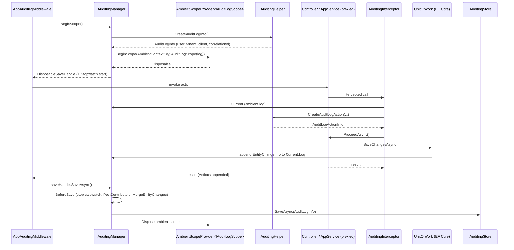

The `Volo.Abp.Auditing` package is the core auditing engine of the ABP Framework. It does not save anything to a database by itself — it defines the shapes (`AuditLogInfo`, `AuditLogActionInfo`, `EntityChangeInfo`, `EntityPropertyChangeInfo`), it opens and closes an ambient scope around each top-level operation (`IAuditingManager` + `IAuditLogScope`), and it decides whether a given method call or entity change should be recorded (`IAuditingHelper`). A separate store — `SimpleLogAuditingStore` by default, or the [audit-logging module](/modules/audit-logging) for persistence — receives the assembled `AuditLogInfo` at the end of the scope.

This page is the map. It shows how `AbpAuditingModule` wires the pieces, what an `IAuditLogScope` looks like across an HTTP request, and how `AuditingHelper.CreateAuditLogInfo()` snapshots the ambient user, tenant, client, and correlation id at the moment the scope opens. Deeper details on individual collaborators live in [Audit log helper and contributors](/auditing/audit-log-helper-and-contributors); the persistence side lives in [Audit logging module](/modules/audit-logging); the property-level interfaces (`IAuditedObject`, `IFullAuditedObject`) and the cross-cutting attributes (`[Audited]`, `[DisableAuditing]`) live in [Auditing contracts](/auditing/auditing-contracts).

## Package layout

The auditing core lives in two adjacent projects under `framework/src`:

| Project | Purpose |
| --- | --- |
| `Volo.Abp.Auditing.Contracts` | Pure interfaces and attributes: `IAuditedObject`, `IFullAuditedObject`, `[Audited]`, `[DisableAuditing]`, `EntityChangeType`. No runtime. |
| `Volo.Abp.Auditing` | The engine: `AbpAuditingModule`, `AbpAuditingOptions`, `AuditingManager`, `AuditingHelper`, `AuditPropertySetter`, `AuditingInterceptor`, `SimpleLogAuditingStore`. |

`AbpAuditingModule` depends on `AbpAuditingContractsModule`, so referencing the engine automatically pulls the interfaces. Persistence is layered on top by `Volo.Abp.AuditLogging.Domain`, which replaces `SimpleLogAuditingStore` with `AuditingStore` (see the [audit-logging module page](/modules/audit-logging)).

```csharp title="framework/src/Volo.Abp.Auditing/Volo/Abp/Auditing/AbpAuditingModule.cs"
[DependsOn(
    typeof(AbpDataModule),
    typeof(AbpJsonModule),
    typeof(AbpTimingModule),
    typeof(AbpSecurityModule),
    typeof(AbpThreadingModule),
    typeof(AbpMultiTenancyModule),
    typeof(AbpAuditingContractsModule)
    )]
public class AbpAuditingModule : AbpModule
{
    public override void PreConfigureServices(ServiceConfigurationContext context)
    {
        context.Services.OnRegistered(AuditingInterceptorRegistrar.RegisterIfNeeded);
    }

    public override void ConfigureServices(ServiceConfigurationContext context)
    {
        var applicationName = context.Services.GetApplicationName();

        if (!applicationName.IsNullOrEmpty())
        {
            Configure<AbpAuditingOptions>(options =>
            {
                options.ApplicationName = applicationName;
            });
        }
    }
}
```

Two things happen here:

1. `PreConfigureServices` hooks `AuditingInterceptorRegistrar.RegisterIfNeeded` into the DI container's `OnRegistered` callback. Every service that gets registered after this point is inspected; if it is marked with `[Audited]`, `[DisableAuditing]`, implements `IAuditingEnabled`, or contains an `[Audited]` method, an `AuditingInterceptor` is attached via dynamic proxy.
2. `ConfigureServices` copies the application name from `IServiceCollection` into `AbpAuditingOptions.ApplicationName` so every `AuditLogInfo` produced by this app carries the originating service name.

<Note>
The auditing engine is a *framework* module, not an application module. It has no DbContext, no entities, and no migrations. It does, however, register `SimpleLogAuditingStore` as the default `IAuditingStore`, which simply writes `auditInfo.ToString()` to the logger.
</Note>

## The two core abstractions

Everything else in this package is in service of two interfaces:

```csharp title="framework/src/Volo.Abp.Auditing/Volo/Abp/Auditing/IAuditingManager.cs"
public interface IAuditingManager
{
    IAuditLogScope? Current { get; }

    IAuditLogSaveHandle BeginScope();
}
```

```csharp title="framework/src/Volo.Abp.Auditing/Volo/Abp/Auditing/IAuditLogScope.cs"
public interface IAuditLogScope
{
    AuditLogInfo Log { get; }
}
```

`IAuditingManager` opens an ambient `IAuditLogScope`, which exposes a single mutable `AuditLogInfo` instance. Anything that runs inside the scope — interceptors, the EF Core change tracker, exception handlers, user code — appends to the same `AuditLogInfo`. When the top-level caller disposes (or `await SaveAsync()`s) the returned `IAuditLogSaveHandle`, the engine hands the populated `AuditLogInfo` to the registered `IAuditingStore`.

```csharp title="framework/src/Volo.Abp.Auditing/Volo/Abp/Auditing/IAuditLogSaveHandle.cs"
public interface IAuditLogSaveHandle : IDisposable
{
    Task SaveAsync();
}
```

This is the only public contract a host needs to remember:

```csharp
using (var saveHandle = _auditingManager.BeginScope())
{
    try
    {
        await DoWork(); // populates _auditingManager.Current!.Log
    }
    finally
    {
        await saveHandle.SaveAsync();
    }
}
```

In real ABP apps you almost never call this yourself — the ASP.NET Core middleware (`AbpAuditingMiddleware`) opens the scope for HTTP requests, and the [exception handling pipeline](/web/exception-handling) calls `SaveAsync` even on failure when `AlwaysLogOnException` is set.

## AuditingManager: the ambient scope

`AuditingManager` is the only implementation of `IAuditingManager` and stores the current scope under a fixed key inside an `IAmbientScopeProvider<IAuditLogScope>` (which is backed by `AsyncLocal<T>`, the same mechanism that flows the [unit of work](/uow)).

```csharp title="framework/src/Volo.Abp.Auditing/Volo/Abp/Auditing/AuditingManager.cs"
public class AuditingManager : IAuditingManager, ITransientDependency
{
    private const string AmbientContextKey = "Volo.Abp.Auditing.IAuditLogScope";

    public IAuditLogScope? Current => _ambientScopeProvider.GetValue(AmbientContextKey);

    public IAuditLogSaveHandle BeginScope()
    {
        var ambientScope = _ambientScopeProvider.BeginScope(
            AmbientContextKey,
            new AuditLogScope(_auditingHelper.CreateAuditLogInfo())
        );

        Debug.Assert(Current != null, "Current != null");

        return new DisposableSaveHandle(this, ambientScope, Current!.Log, Stopwatch.StartNew());
    }
}
```

The `DisposableSaveHandle` keeps:

- The `AuditLogInfo` (so `SaveAsync` knows what to persist).
- A `Stopwatch` started at `BeginScope` time and stopped in `BeforeSave` — this is how `AuditLogInfo.ExecutionDuration` gets populated.
- The `IDisposable` returned by the ambient scope provider, so disposing the handle pops the scope.

Before persisting, `BeforeSave` runs `ExecutePostContributors` (giving every registered `AuditLogContributor` a chance to add data) and `MergeEntityChanges`, which deduplicates `Updated` entries that share the same `EntityTypeFullName` + `EntityId` so EF's change tracker doesn't double-log the same row.

```csharp title="framework/src/Volo.Abp.Auditing/Volo/Abp/Auditing/AuditingManager.cs"
protected virtual void BeforeSave(DisposableSaveHandle saveHandle)
{
    saveHandle.StopWatch.Stop();
    saveHandle.AuditLog.ExecutionDuration =
        Convert.ToInt32(saveHandle.StopWatch.Elapsed.TotalMilliseconds);
    ExecutePostContributors(saveHandle.AuditLog);
    MergeEntityChanges(saveHandle.AuditLog);
}

protected virtual async Task SaveAsync(DisposableSaveHandle saveHandle)
{
    BeforeSave(saveHandle);
    await _auditingStore.SaveAsync(saveHandle.AuditLog);
}
```

## Audit scope lifecycle inside an HTTP request

The diagram below traces what happens between the moment ASP.NET Core hands a request to ABP and the moment the populated `AuditLogInfo` reaches the store.



The scope exists for the duration of one logical operation. Nested intercepted calls (e.g. one application service invoking another) do **not** open a new scope — `AuditingInterceptor.InterceptAsync` checks `auditingManager.Current != null` and, when true, just appends another `AuditLogActionInfo` to the existing `AuditLogInfo`. Only when there is no ambient scope (e.g. a background worker that called the service directly) does the interceptor open one itself via `ProcessWithNewAuditingScopeAsync`.

## AuditingHelper: snapshotting "now"

`AuditingHelper` (`IAuditingHelper`) is the factory the manager and the interceptor call. It pulls the ambient identity from the surrounding services and stamps it onto a new `AuditLogInfo`:

```csharp title="framework/src/Volo.Abp.Auditing/Volo/Abp/Auditing/AuditingHelper.cs"
public virtual AuditLogInfo CreateAuditLogInfo()
{
    var auditInfo = new AuditLogInfo
    {
        ApplicationName = Options.ApplicationName,
        TenantId = CurrentTenant.Id,
        TenantName = CurrentTenant.Name,
        UserId = CurrentUser.Id,
        UserName = CurrentUser.UserName,
        ClientId = CurrentClient.Id,
        CorrelationId = CorrelationIdProvider.Get(),
        ExecutionTime = Clock.Now,
        ImpersonatorUserId = CurrentUser.FindImpersonatorUserId(),
        ImpersonatorUserName = CurrentUser.FindImpersonatorUserName(),
        ImpersonatorTenantId = CurrentUser.FindImpersonatorTenantId(),
        ImpersonatorTenantName = CurrentUser.FindImpersonatorTenantName(),
    };

    ExecutePreContributors(auditInfo);

    return auditInfo;
}
```

Note the contributors run **twice**: once here (`PreContribute`) so contributors can enrich the empty record before any controller code runs — typically to copy ASP.NET Core's `HttpContext` fields like `Url`, `HttpMethod`, `BrowserInfo`, `ClientIpAddress`, and the route data — and again from `AuditingManager.BeforeSave` (`PostContribute`) so contributors can stamp the final `HttpStatusCode` after the response is produced.

`AuditingHelper` also exposes two decision methods:

- `ShouldSaveAudit(MethodInfo, defaultValue, ignoreIntegrationServiceAttribute)` — used by `AuditingInterceptor` to decide if it should record an `AuditLogActionInfo` for a given call.
- `IsEntityHistoryEnabled(Type, defaultValue)` — used by the EF Core integration to decide if changes to a given entity type should produce `EntityChangeInfo` records.

Both walk `[Audited]` / `[DisableAuditing]` on type and method, the `IgnoredTypes` list, and the `EntityHistorySelectors` list. They are covered in detail on the [helper page](/auditing/audit-log-helper-and-contributors).

## AuditLogInfo: the in-flight record

`AuditLogInfo` is the mutable bag that lives inside the scope. It carries identity (`UserId`, `TenantId`, `ClientId`, impersonation columns), timing (`ExecutionTime`, `ExecutionDuration`), request metadata (`HttpMethod`, `Url`, `HttpStatusCode`, `ClientIpAddress`, `BrowserInfo`, `CorrelationId`), and three child collections that grow during the scope.

```csharp title="framework/src/Volo.Abp.Auditing/Volo/Abp/Auditing/AuditLogInfo.cs"
[Serializable]
public class AuditLogInfo : IHasExtraProperties
{
    public string? ApplicationName { get; set; }
    public Guid? UserId { get; set; }
    public string? UserName { get; set; }
    public Guid? TenantId { get; set; }
    public string? TenantName { get; set; }
    public Guid? ImpersonatorUserId { get; set; }
    public Guid? ImpersonatorTenantId { get; set; }
    public string? ImpersonatorUserName { get; set; }
    public string? ImpersonatorTenantName { get; set; }
    public DateTime ExecutionTime { get; set; }
    public int ExecutionDuration { get; set; }
    public string? ClientId { get; set; }
    public string? CorrelationId { get; set; }
    public string? ClientIpAddress { get; set; }
    public string? ClientName { get; set; }
    public string? BrowserInfo { get; set; }
    public string? HttpMethod { get; set; }
    public int? HttpStatusCode { get; set; }
    public string? Url { get; set; }
    public List<AuditLogActionInfo> Actions { get; set; }
    public List<Exception> Exceptions { get; }
    public ExtraPropertyDictionary ExtraProperties { get; }
    public List<EntityChangeInfo> EntityChanges { get; }
    public List<string> Comments { get; set; }
    // ...
}
```

The three growing lists are filled by different producers:

| Collection | Producer | Item shape |
| --- | --- | --- |
| `Actions` | `AuditingInterceptor` — once per intercepted method call | `AuditLogActionInfo` (`ServiceName`, `MethodName`, `Parameters` JSON, `ExecutionTime`, `ExecutionDuration`) |
| `EntityChanges` | EF Core `AbpEfCoreNavigationHelper` / `AbpDbContext` on `SaveChangesAsync` | `EntityChangeInfo` (`ChangeType`, `EntityId`, `EntityTypeFullName`, `PropertyChanges[]`) |
| `Exceptions` | [exception handling middleware](/web/exception-handling) — when an unhandled exception bubbles up | `System.Exception` instances |

`AuditLogInfo.ToString()` produces a human-readable dump (used by `SimpleLogAuditingStore`) that lists each action, each entity change, and each exception. This is what you see in the console when the audit-logging module is not installed.

## EntityChangeInfo and EntityPropertyChangeInfo

Whenever EF Core's change tracker fires inside an active scope, ABP appends one `EntityChangeInfo` per modified aggregate root and one `EntityPropertyChangeInfo` per scalar property whose value differs from the original.

```csharp title="framework/src/Volo.Abp.Auditing/Volo/Abp/Auditing/EntityChangeInfo.cs"
[Serializable]
public class EntityChangeInfo : IHasExtraProperties
{
    public DateTime ChangeTime { get; set; }
    public EntityChangeType ChangeType { get; set; }
    public Guid? EntityTenantId { get; set; }
    public string? EntityId { get; set; }
    public string? EntityTypeFullName { get; set; }
    public List<EntityPropertyChangeInfo> PropertyChanges { get; set; } = default!;
    public ExtraPropertyDictionary ExtraProperties { get; }
    public virtual object EntityEntry { get; set; } = default!;

    public virtual void Merge(EntityChangeInfo changeInfo) { /* ... */ }
}
```

`EntityChangeType` is the small enum defined in the contracts assembly:

```csharp title="framework/src/Volo.Abp.Auditing.Contracts/Volo/Abp/Auditing/EntityChangeType.cs"
public enum EntityChangeType : byte
{
    Created = 0,
    Updated = 1,
    Deleted = 2
}
```

`EntityPropertyChangeInfo` holds the before/after snapshot for one scalar:

```csharp title="framework/src/Volo.Abp.Auditing/Volo/Abp/Auditing/EntityPropertyChangeInfo.cs"
[Serializable]
public class EntityPropertyChangeInfo
{
    public static int MaxPropertyNameLength = 96;
    public static int MaxValueLength = 512;
    public static int MaxPropertyTypeFullNameLength = 192;

    public virtual string? NewValue { get; set; }
    public virtual string? OriginalValue { get; set; }
    public virtual string PropertyName { get; set; } = default!;
    public virtual string PropertyTypeFullName { get; set; } = default!;
}
```

The static `Max*` fields are the *upstream* truncation guard used by the framework itself. The persistence layer applies an additional, stricter truncation when copying these into `EntityChange` / `EntityPropertyChange` rows — see the [audit-logging module page](/modules/audit-logging) for the column lengths.

The `Merge` method on `EntityChangeInfo` is called from `AuditingManager.MergeEntityChanges` when EF Core has produced multiple `Updated` rows for the same `(EntityTypeFullName, EntityId)` pair within one scope. Later property changes win for properties that appear in both groups; new properties are simply appended.

## AuditingOptions in one glance

The handful of options exposed by `AbpAuditingOptions` drive the engine's decisions. Defaults shown are the values set in the constructor.

| Option | Default | Effect |
| --- | --- | --- |
| `IsEnabled` | `true` | Master switch checked by `AuditingInterceptor.ShouldIntercept`. |
| `IsEnabledForAnonymousUsers` | `true` | Set to `false` to skip persistence when `CurrentUser.IsAuthenticated == false`. |
| `IsEnabledForGetRequests` | `false` | When `false`, GET requests do not produce an audit log (HTTP-side check). |
| `IsEnabledForIntegrationServices` | `false` | When `false`, `[IntegrationService]`-annotated app services do not produce audit logs by default. |
| `HideErrors` | `true` | When `true`, `SaveAsync` swallows store exceptions and logs them as warnings. |
| `AlwaysLogOnException` | `true` | Force-save the audit log even if the interceptor wouldn't have intercepted. |
| `DisableLogActionInfo` | `false` | Skip building `AuditLogActionInfo` even when the method is intercepted. |
| `SaveEntityHistoryWhenNavigationChanges` | `true` | Treat navigation-property changes as a reason to record an `EntityChangeInfo`. |
| `ApplicationName` | `null` | Set from the DI container's application name in `ConfigureServices`. |
| `IgnoredTypes` | `Stream`, `Expression`, `CancellationToken` | Argument types stripped from `Parameters` JSON and never serialized as entity history. |
| `Contributors` | empty | List of `AuditLogContributor` instances; runs `PreContribute` from `AuditingHelper` and `PostContribute` from `AuditingManager`. |
| `AlwaysLogSelectors` | empty | `Func<AuditLogInfo, Task<bool>>` predicates that can force a log even when normal rules would skip. |
| `EntityHistorySelectors` | empty | `NamedTypeSelector` list — a type that matches any selector is treated as `[Audited]` for entity history purposes. |

These are all set with the usual `Configure<AbpAuditingOptions>` pattern in a module's `ConfigureServices`:

```csharp
Configure<AbpAuditingOptions>(options =>
{
    options.IsEnabledForGetRequests = true;
    options.EntityHistorySelectors.AddAllEntities(); // common shortcut
    options.IgnoredTypes.Add(typeof(IFormFile));
});
```

The exact mechanics — what `AddAllEntities` does, how `IsEntityHistoryEnabled` walks the selectors, what `Contributors` see in their context — are covered on the next page.

## What this module does *not* do

<Warning>
The `Volo.Abp.Auditing` package does **not** persist audit logs by itself. The default `IAuditingStore` is `SimpleLogAuditingStore`, which writes `auditInfo.ToString()` to `ILogger<SimpleLogAuditingStore>`. To get database rows, you must reference `Volo.Abp.AuditLogging.Domain` (and either the EF Core or MongoDB implementation), which replaces `SimpleLogAuditingStore` with the [audit-logging module's `AuditingStore`](/modules/audit-logging).
</Warning>

```csharp title="framework/src/Volo.Abp.Auditing/Volo/Abp/Auditing/SimpleLogAuditingStore.cs"
[Dependency(TryRegister = true)]
public class SimpleLogAuditingStore : IAuditingStore, ISingletonDependency
{
    public ILogger<SimpleLogAuditingStore> Logger { get; set; }

    public Task SaveAsync(AuditLogInfo auditInfo)
    {
        Logger.LogInformation(auditInfo.ToString());
        return Task.FromResult(0);
    }
}
```

The `[Dependency(TryRegister = true)]` attribute is what lets the audit-logging module's `AuditingStore` cleanly take over: because `SimpleLogAuditingStore` only registers itself if no other `IAuditingStore` already exists, adding the persistence module replaces it transparently.

## Where to go next

<CardGroup cols={2}>
  <Card title="Helper, store, contributors" icon="screwdriver-wrench" href="/auditing/audit-log-helper-and-contributors">
    Full enumeration of `IAuditingHelper`, `IAuditingStore`, `IAuditLogScope`, `AmbientAuditingScope`, `IAuditLogContributor`, and every flag on `AbpAuditingOptions`.
  </Card>
  <Card title="Audit logging module" icon="database" href="/modules/audit-logging">
    Persistence: `AuditLog` aggregate, `AuditLogAction`, `EntityChange`, `EntityPropertyChange`, `IAuditLogRepository`, EF Core and MongoDB providers.
  </Card>
  <Card title="Auditing contracts" icon="file-signature" href="/auditing/auditing-contracts">
    `IAuditedObject`, `IFullAuditedObject`, `IHasCreationTime`, `[Audited]`, `[DisableAuditing]` — the entity contracts the engine reacts to.
  </Card>
  <Card title="Exception handling" icon="bug" href="/web/exception-handling">
    The pipeline that flushes the audit log on failure when `AlwaysLogOnException` is true.
  </Card>
</CardGroup>
