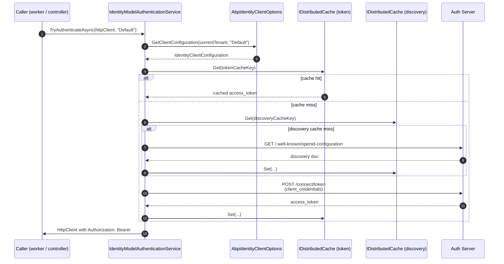

The `Volo.Abp.IdentityModel` package is ABP's *server-side* token client.
Where the JwtBearer and OpenIdConnect packages validate tokens that arrive
from the browser, this package is the one used by background workers,
console hosts, MVC controllers that need to call an API, and integration
tests &mdash; anywhere a server process needs to obtain an access token
from an OIDC token endpoint and attach it to outgoing requests. The
implementation wraps the third-party
[`IdentityModel`](https://www.nuget.org/packages/IdentityModel) library
(discovery + token endpoint helpers) with multi-tenant configuration
lookup and distributed token caching. Source lives under
`framework/src/Volo.Abp.IdentityModel/` in the
[abpframework/abp](https://github.com/abpframework/abp) repository.

## Package layout

| File | Type |
| --- | --- |
| `framework/src/Volo.Abp.IdentityModel/Volo/Abp/IdentityModel/AbpIdentityModelModule.cs` | `AbpIdentityModelModule` |
| `framework/src/Volo.Abp.IdentityModel/Volo/Abp/IdentityModel/AbpIdentityClientOptions.cs` | `AbpIdentityClientOptions` |
| `framework/src/Volo.Abp.IdentityModel/Volo/Abp/IdentityModel/IdentityClientConfiguration.cs` | `IdentityClientConfiguration` |
| `framework/src/Volo.Abp.IdentityModel/Volo/Abp/IdentityModel/IdentityClientConfigurationDictionary.cs` | `IdentityClientConfigurationDictionary` |
| `framework/src/Volo.Abp.IdentityModel/Volo/Abp/IdentityModel/IIdentityModelAuthenticationService.cs` | `IIdentityModelAuthenticationService` |
| `framework/src/Volo.Abp.IdentityModel/Volo/Abp/IdentityModel/IdentityModelAuthenticationService.cs` | `IdentityModelAuthenticationService` |
| `framework/src/Volo.Abp.IdentityModel/Volo/Abp/IdentityModel/IdentityModelTokenCacheItem.cs` | `IdentityModelTokenCacheItem` |
| `framework/src/Volo.Abp.IdentityModel/Volo/Abp/IdentityModel/IdentityModelDiscoveryDocumentCacheItem.cs` | `IdentityModelDiscoveryDocumentCacheItem` |
| `framework/src/Volo.Abp.IdentityModel/Volo/Abp/IdentityModel/IdentityModelHttpRequestMessageOptions.cs` | `IdentityModelHttpRequestMessageOptions` |

## The module

The module depends on `AbpThreadingModule` (for the cancellation token
provider), `AbpMultiTenancyModule` (for `ICurrentTenant`), and
`AbpCachingModule` (for the two distributed caches). It registers a single
named `HttpClient` that the service uses for both discovery and token
requests, and binds `AbpIdentityClientOptions` to the application
`IConfiguration` so it can be set from `appsettings.json`.

```csharp title="framework/src/Volo.Abp.IdentityModel/Volo/Abp/IdentityModel/AbpIdentityModelModule.cs"
[DependsOn(
    typeof(AbpThreadingModule),
    typeof(AbpMultiTenancyModule),
    typeof(AbpCachingModule)
    )]
public class AbpIdentityModelModule : AbpModule
{
    public override void ConfigureServices(ServiceConfigurationContext context)
    {
        var configuration = context.Services.GetConfiguration();

        context.Services.AddHttpClient(IdentityModelAuthenticationService.HttpClientName);

        Configure<AbpIdentityClientOptions>(configuration);
    }
}
```

The HTTP client name is exposed as a constant on the service:

```csharp
public const string HttpClientName = "IdentityModelAuthenticationServiceHttpClientName";
```

This is the name you pass to `IHttpClientFactory.CreateClient` if you want
to share the same client (and its handler chain) with another piece of
code &mdash; commonly for adding a Polly retry policy via
`services.AddHttpClient(IdentityModelAuthenticationService.HttpClientName).AddPolicyHandler(...)`.

## `AbpIdentityClientOptions`: the options root

`AbpIdentityClientOptions` holds the `IdentityClients` dictionary plus a
`GetClientConfiguration` helper that resolves a configuration by name and
current tenant.

```csharp title="framework/src/Volo.Abp.IdentityModel/Volo/Abp/IdentityModel/AbpIdentityClientOptions.cs"
public class AbpIdentityClientOptions
{
    public IdentityClientConfigurationDictionary IdentityClients { get; set; }

    public AbpIdentityClientOptions()
    {
        IdentityClients = new IdentityClientConfigurationDictionary();
    }

    public IdentityClientConfiguration? GetClientConfiguration(ICurrentTenant currentTenant, string? identityClientName = null)
    {
        if (identityClientName.IsNullOrWhiteSpace())
        {
            identityClientName = IdentityClientConfigurationDictionary.DefaultName;
        }

        if (currentTenant.Id.HasValue)
        {
            var tenantConfiguration = IdentityClients.FirstOrDefault(x => x.Key == $"{identityClientName}.{currentTenant.Id}");
            if (tenantConfiguration.Key == null && !currentTenant.Name.IsNullOrWhiteSpace())
            {
                tenantConfiguration = IdentityClients.FirstOrDefault(x => x.Key == $"{identityClientName}.{currentTenant.Name}");
            }

            if (tenantConfiguration.Key != null)
            {
                return tenantConfiguration.Value;
            }
        }

        return IdentityClients.GetOrDefault(identityClientName!) ??
               IdentityClients.Default;
    }
}
```

The lookup order is:

1. `"{name}.{TenantId}"` &mdash; explicit per-tenant override by GUID.
2. `"{name}.{TenantName}"` &mdash; explicit per-tenant override by name.
3. `"{name}"` &mdash; the global named configuration.
4. `"Default"` &mdash; the dictionary's `Default` slot.

This lets you ship a multi-tenant app where different tenants point at
different authorities or use different scopes.

## `IdentityClientConfigurationDictionary`

The dictionary type is a one-line wrapper that knows about the
`"Default"` key:

```csharp title="framework/src/Volo.Abp.IdentityModel/Volo/Abp/IdentityModel/IdentityClientConfigurationDictionary.cs"
public class IdentityClientConfigurationDictionary : Dictionary<string, IdentityClientConfiguration?>
{
    public const string DefaultName = "Default";

    public IdentityClientConfiguration? Default {
        get => this.GetOrDefault(DefaultName);
        set => this[DefaultName] = value;
    }
}
```

## `IdentityClientConfiguration`: per-client settings

`IdentityClientConfiguration` derives from `Dictionary<string, string?>`,
which gives you two equivalent ways to read or write the values: by
strongly-typed property or by raw key. The dictionary derivation also lets
the configuration round-trip cleanly through `appsettings.json` binding
because every property maps to a string slot. The relevant settings:

| Property | Default | Notes |
| --- | --- | --- |
| `GrantType` | `"client_credentials"` | Also accepts `"password"`, `"urn:ietf:params:oauth:grant-type:device_code"`. |
| `ClientId` | required | |
| `ClientSecret` | required | Plain text. |
| `UserName`, `UserPassword` | null | Only for `password` grant. |
| `Authority` | required | Used for discovery. |
| `Scope` | required | Space-separated. |
| `RequireHttps` | `true` | Disable for local dev only. |
| `CacheAbsoluteExpiration` | `1800` (30 min) | Token cache lifetime. |
| `ValidateIssuerName` | `true` | Disables the IdentityModel issuer check. |
| `ValidateEndpoints` | `true` | Disables the IdentityModel endpoint check. |

The constructor with parameters mirrors these:

```csharp title="framework/src/Volo.Abp.IdentityModel/Volo/Abp/IdentityModel/IdentityClientConfiguration.cs"
public IdentityClientConfiguration(
    string authority,
    string scope,
    string clientId,
    string clientSecret,
    string grantType = OidcConstants.GrantTypes.ClientCredentials,
    string? userName = null,
    string? userPassword = null,
    bool requireHttps = true,
    int cacheAbsoluteExpiration = 60 * 30,
    bool validateIssuerName = true,
    bool validateEndpoints = true)
{
    this[nameof(Authority)] = authority;
    this[nameof(Scope)] = scope;
    this[nameof(ClientId)] = clientId;
    this[nameof(ClientSecret)] = clientSecret;
    this[nameof(GrantType)] = grantType;
    this[nameof(UserName)] = userName;
    this[nameof(UserPassword)] = userPassword;
    this[nameof(RequireHttps)] = requireHttps.ToString().ToLowerInvariant();
    this[nameof(CacheAbsoluteExpiration)] = cacheAbsoluteExpiration.ToString(CultureInfo.InvariantCulture);
    this[nameof(ValidateIssuerName)] = validateIssuerName.ToString().ToLowerInvariant();
    this[nameof(ValidateEndpoints)] = validateEndpoints.ToString().ToLowerInvariant();
}
```

### Configuration from appsettings.json

```json title="appsettings.json"
{
  "IdentityClients": {
    "Default": {
      "GrantType":    "client_credentials",
      "ClientId":     "MyApp_Backend",
      "ClientSecret": "1q2w3e*",
      "Authority":    "https://auth.example.com",
      "Scope":        "MyApp"
    },
    "AdminConsole": {
      "GrantType":    "password",
      "ClientId":     "MyApp_Admin",
      "ClientSecret": "1q2w3e*",
      "Authority":    "https://auth.example.com",
      "Scope":        "MyApp.Admin",
      "UserName":     "admin",
      "UserPassword": "1q2w3E*"
    },
    "AdminConsole.tenant1": {
      "Authority": "https://auth-tenant1.example.com",
      "ClientId":  "MyApp_Admin_Tenant1",
      "ClientSecret": "...",
      "Scope": "MyApp.Admin"
    }
  }
}
```

The `IdentityClients` root maps to `AbpIdentityClientOptions.IdentityClients`
through the `Configure<AbpIdentityClientOptions>(configuration)` call in
the module's `ConfigureServices`.

## `IIdentityModelAuthenticationService`

The service interface exposes two methods:

```csharp title="framework/src/Volo.Abp.IdentityModel/Volo/Abp/IdentityModel/IIdentityModelAuthenticationService.cs"
public interface IIdentityModelAuthenticationService
{
    Task<bool> TryAuthenticateAsync(
        [NotNull] HttpClient client,
        string? identityClientName = null);

    Task<string> GetAccessTokenAsync(
        IdentityClientConfiguration configuration);
}
```

The high-level `TryAuthenticateAsync` is the one applications usually
call. The implementation resolves the configuration through
`AbpIdentityClientOptions.GetClientConfiguration`, retrieves an access
token, and attaches it as a bearer header to the supplied `HttpClient`.

```csharp title="framework/src/Volo.Abp.IdentityModel/Volo/Abp/IdentityModel/IdentityModelAuthenticationService.cs"
public async Task<bool> TryAuthenticateAsync(
    [NotNull] HttpClient client,
    string? identityClientName = null)
{
    var accessToken = await GetAccessTokenOrNullAsync(identityClientName);
    if (accessToken == null)
    {
        return false;
    }

    SetAccessToken(client, accessToken);
    return true;
}
```

`SetAccessToken` writes the header:

```csharp
protected virtual void SetAccessToken(HttpClient client, string accessToken)
{
    //TODO: "Bearer" should be configurable
    client.DefaultRequestHeaders.Authorization = new AuthenticationHeaderValue("Bearer", accessToken);
}
```

## Token caching

The lower-level `GetAccessTokenAsync` calls the token endpoint via
`IdentityModel`, but it wraps the call in a distributed cache so that
repeated calls inside the cache window do not hit the auth server.

```csharp title="framework/src/Volo.Abp.IdentityModel/Volo/Abp/IdentityModel/IdentityModelAuthenticationService.cs"
public virtual async Task<string> GetAccessTokenAsync(IdentityClientConfiguration configuration)
{
    var cacheKey = CalculateTokenCacheKey(configuration);
    var tokenCacheItem = await TokenCache.GetAsync(cacheKey);
    if (tokenCacheItem == null)
    {
        var tokenResponse = await GetTokenResponse(configuration);

        if (tokenResponse.IsError)
        {
            if (tokenResponse.ErrorDescription != null)
            {
                throw new AbpException($"Could not get token from the OpenId Connect server! ErrorType: {tokenResponse.ErrorType}. " +
                                       $"Error: {tokenResponse.Error}. ErrorDescription: {tokenResponse.ErrorDescription}. HttpStatusCode: {tokenResponse.HttpStatusCode}");
            }

            var rawError = tokenResponse.Raw!;
            var withoutInnerException = rawError.Split(new string[] { "<eof/>" }, StringSplitOptions.RemoveEmptyEntries);
            throw new AbpException(withoutInnerException[0]);
        }

        tokenCacheItem = new IdentityModelTokenCacheItem(tokenResponse.AccessToken!);
        await TokenCache.SetAsync(cacheKey, tokenCacheItem, new DistributedCacheEntryOptions
        {
            AbsoluteExpirationRelativeToNow = AbpHostEnvironment.IsDevelopment()
                ? TimeSpan.FromSeconds(5)
                : TimeSpan.FromSeconds(configuration.CacheAbsoluteExpiration)
        });
    }

    return tokenCacheItem.AccessToken;
}
```

Notes:

- **Development tokens cache for 5 seconds.** This is hard-coded so the
  cache does not get in the way while debugging.
- **Cache key is based on the full configuration.** The token cache item
  computes its key from every property of `IdentityClientConfiguration`,
  so changing any value (scope, client secret, tenant) automatically
  invalidates the cache.

```csharp title="framework/src/Volo.Abp.IdentityModel/Volo/Abp/IdentityModel/IdentityModelTokenCacheItem.cs"
public static string CalculateCacheKey(IdentityClientConfiguration configuration)
{
    return string.Join(",", configuration.Select(x => x.Key + ":" + x.Value)).ToMd5();
}
```

The discovery document is cached the same way, keyed only by the
authority URL:

```csharp title="framework/src/Volo.Abp.IdentityModel/Volo/Abp/IdentityModel/IdentityModelDiscoveryDocumentCacheItem.cs"
[Serializable]
[IgnoreMultiTenancy]
public class IdentityModelDiscoveryDocumentCacheItem
{
    public string TokenEndpoint { get; set; } = default!;
    public string DeviceAuthorizationEndpoint { get; set; } = default!;

    public static string CalculateCacheKey(IdentityClientConfiguration configuration)
    {
        return configuration.Authority.ToLower().ToMd5();
    }
}
```

## Grant types

`GetTokenResponse` switches on `configuration.GrantType` and dispatches to
one of three branches. The full body:

```csharp title="framework/src/Volo.Abp.IdentityModel/Volo/Abp/IdentityModel/IdentityModelAuthenticationService.cs"
protected virtual async Task<TokenResponse> GetTokenResponse(IdentityClientConfiguration configuration)
{
    using (var httpClient = HttpClientFactory.CreateClient(HttpClientName))
    {
        AddHeaders(httpClient);

        switch (configuration.GrantType)
        {
            case OidcConstants.GrantTypes.ClientCredentials:
                return await httpClient.RequestClientCredentialsTokenAsync(
                    await CreateClientCredentialsTokenRequestAsync(configuration),
                    CancellationTokenProvider.Token
                );
            case OidcConstants.GrantTypes.Password:
                return await httpClient.RequestPasswordTokenAsync(
                    await CreatePasswordTokenRequestAsync(configuration),
                    CancellationTokenProvider.Token
                );

            case OidcConstants.GrantTypes.DeviceCode:
                return await RequestDeviceAuthorizationAsync(httpClient, configuration);

            default:
                throw new AbpException("Grant type was not implemented: " + configuration.GrantType);
        }
    }
}
```

### `client_credentials`

The most common grant type for server-to-server calls. The token request
is built from `Authority`-derived endpoint, scope, client id, and client
secret.

```csharp title="framework/src/Volo.Abp.IdentityModel/Volo/Abp/IdentityModel/IdentityModelAuthenticationService.cs"
protected virtual async Task<ClientCredentialsTokenRequest> CreateClientCredentialsTokenRequestAsync(IdentityClientConfiguration configuration)
{
    var discoveryResponse = await GetDiscoveryResponse(configuration);
    var request = new ClientCredentialsTokenRequest
    {
        Address = discoveryResponse.TokenEndpoint,
        Scope = configuration.Scope,
        ClientId = configuration.ClientId,
        ClientSecret = configuration.ClientSecret
    };
    IdentityModelHttpRequestMessageOptions.ConfigureHttpRequestMessage?.Invoke(request);

    await AddParametersToRequestAsync(configuration, request);

    return request;
}
```

### `password`

Used by daemon/admin apps that act on behalf of a specific user.

```csharp
protected virtual async Task<PasswordTokenRequest> CreatePasswordTokenRequestAsync(IdentityClientConfiguration configuration)
{
    var discoveryResponse = await GetDiscoveryResponse(configuration);
    var request = new PasswordTokenRequest
    {
        Address = discoveryResponse.TokenEndpoint,
        Scope = configuration.Scope,
        ClientId = configuration.ClientId,
        ClientSecret = configuration.ClientSecret,
        UserName = configuration.UserName!,
        Password = configuration.UserPassword
    };

    IdentityModelHttpRequestMessageOptions.ConfigureHttpRequestMessage?.Invoke(request);

    await AddParametersToRequestAsync(configuration, request);

    return request;
}
```

### `device_code`

Used for terminal / CLI flows where the user authenticates in a separate
browser. The service polls the device endpoint until the user completes the
flow.

```csharp
Logger.LogInformation($"Open your browser, go to: \"{response.VerificationUri}\"");
Logger.LogInformation($"and enter the following one-time code:");
Logger.LogInformation(response.UserCode);

for (var i = 0; i < ((response.ExpiresIn ?? 300) / response.Interval + 1); i++)
{
    await Task.Delay(response.Interval * 1000);

    var tokenResponse = await httpClient.RequestDeviceTokenAsync(new DeviceTokenRequest
    {
        Address = discoveryResponse.TokenEndpoint,
        ClientId = configuration.ClientId,
        ClientSecret = configuration.ClientSecret,
        // ...
```

## Customizing the outbound HTTP request

`IdentityModelHttpRequestMessageOptions` exposes a single delegate that
runs on every outgoing token, discovery, or device request. Use it to add
proxies, certificates, or extra headers.

```csharp title="framework/src/Volo.Abp.IdentityModel/Volo/Abp/IdentityModel/IdentityModelHttpRequestMessageOptions.cs"
public class IdentityModelHttpRequestMessageOptions
{
    public Action<HttpRequestMessage>? ConfigureHttpRequestMessage { get; set; }
}
```

```csharp
Configure<IdentityModelHttpRequestMessageOptions>(options =>
{
    options.ConfigureHttpRequestMessage = request =>
    {
        request.Headers.Add("X-Caller", "MyApp.Backend");
    };
});
```

## End-to-end flow



## Typical usage

```csharp title="src/MyApp.Worker/MyJob.cs"
public class MyJob : IBackgroundJob<MyJobArgs>, ITransientDependency
{
    private readonly IHttpClientFactory _factory;
    private readonly IIdentityModelAuthenticationService _auth;

    public MyJob(IHttpClientFactory factory, IIdentityModelAuthenticationService auth)
    {
        _factory = factory;
        _auth = auth;
    }

    public async Task ExecuteAsync(MyJobArgs args)
    {
        var client = _factory.CreateClient();
        client.BaseAddress = new Uri("https://api.example.com");

        if (!await _auth.TryAuthenticateAsync(client, "Default"))
        {
            throw new AbpException("Could not acquire access token");
        }

        var response = await client.GetAsync("/api/app/my-resource");
        response.EnsureSuccessStatusCode();
    }
}
```

## Common pitfalls

<Warning>
  **Token cache TTL is shorter than the access token's `exp`.** ABP's
  default 30 minutes is a safety margin around OpenIddict's default
  60-minute access token lifetime. If you raise the cache TTL above the
  token lifetime, calls will start failing with 401 until the cache
  entry expires.
</Warning>

<Warning>
  **`RequireHttps = false` only affects discovery.** The token endpoint
  request itself still uses whatever scheme the discovery document
  returned. Use it only for local dev.
</Warning>

<Note>
  **The service replaces the framework's default implementation.** The
  attribute `[Dependency(ReplaceServices = true)]` on
  `IdentityModelAuthenticationService` ensures a single registration. You
  can override by deriving and re-registering with the same attribute.
</Note>

## Related pages

<CardGroup cols={2}>
  <Card title="JWT Bearer" icon="key" href="/auth/jwt-bearer">
    The receiving end of the bearer tokens this service produces.
  </Card>
  <Card title="OpenIddict server" icon="lock" href="/auth/openiddict-server">
    The token issuer this client typically talks to.
  </Card>
  <Card title="HTTP client integration" icon="globe" href="/http">
    Where ABP's dynamic HTTP client proxies plug
    `IIdentityModelAuthenticationService` in automatically.
  </Card>
  <Card title="OpenIddict module" icon="square-arrow-up-right" href="/modules/openiddict">
    Where to register the matching OpenIddict `Application` so this client
    is allowed to call `/connect/token`.
  </Card>
</CardGroup>
