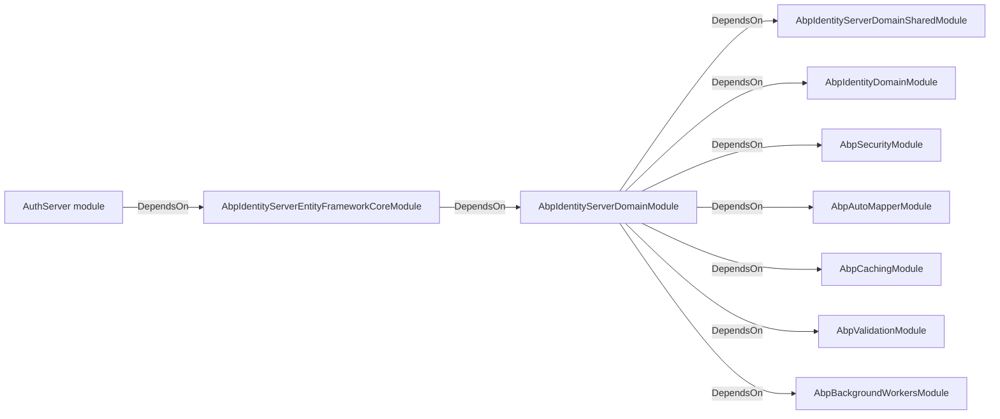
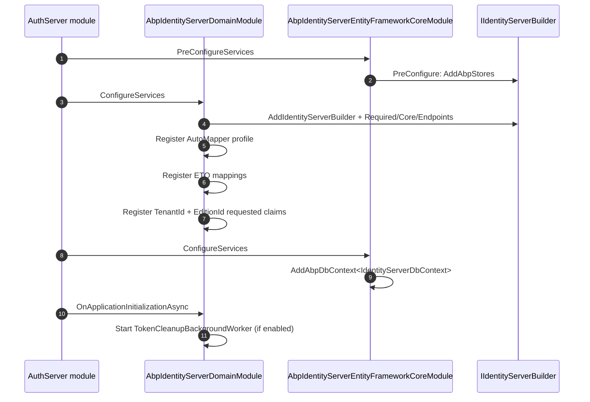

The IdentityServer module is ABP's legacy authorization-server integration.
Before the OpenIddict module replaced it, every ABP startup template used
IdentityServer4 as the token issuer. The packages still ship in the
repository and are still supported &mdash; you only stop using them when
you upgrade an older solution. This page describes the four packages and
how they compose: the Domain module that owns the entities and the
IdentityServer4 builder, the Domain.Shared module that owns localization,
and the EF Core and MongoDB modules that supply the persistence stores.
Source lives under `modules/identityserver/src/` in the
[abpframework/abp](https://github.com/abpframework/abp) repository, and
the application-facing module (CRUD, app services, UI) is documented at
[/modules/identityserver](/modules/identityserver).

<Warning>
  **IdentityServer4 reached end of free support in November 2022.** Duende
  IdentityServer is the commercial successor. ABP has migrated all new
  solution templates to OpenIddict. For new projects, read
  [OpenIddict server](/auth/openiddict-server) instead. This page exists to
  explain the legacy modules for teams maintaining an older solution.
</Warning>

## Package layout

| Package | Module class | Source root |
| --- | --- | --- |
| `Volo.Abp.IdentityServer.Domain.Shared` | `AbpIdentityServerDomainSharedModule` | `modules/identityserver/src/Volo.Abp.IdentityServer.Domain.Shared/` |
| `Volo.Abp.IdentityServer.Domain` | `AbpIdentityServerDomainModule` | `modules/identityserver/src/Volo.Abp.IdentityServer.Domain/` |
| `Volo.Abp.IdentityServer.EntityFrameworkCore` | `AbpIdentityServerEntityFrameworkCoreModule` | `modules/identityserver/src/Volo.Abp.IdentityServer.EntityFrameworkCore/` |
| `Volo.Abp.IdentityServer.MongoDB` | `AbpIdentityServerMongoDbModule` | `modules/identityserver/src/Volo.Abp.IdentityServer.MongoDB/` |
| `Volo.Abp.PermissionManagement.Domain.IdentityServer` | (permission integration) | `modules/identityserver/src/Volo.Abp.PermissionManagement.Domain.IdentityServer/` |

The Installer package
(`modules/identityserver/src/Volo.Abp.IdentityServer.Installer/`) is used
only by the ABP CLI for adding the module to an existing solution; it
contributes no runtime types.

## Module dependency graph



The MongoDB module replaces the EF Core module in MongoDB-backed
solutions; both depend on the same domain module.

## `AbpIdentityServerDomainSharedModule`

The shared module owns localization and the validation resource:

```csharp title="modules/identityserver/src/Volo.Abp.IdentityServer.Domain.Shared/Volo/Abp/IdentityServer/AbpIdentityServerDomainSharedModule.cs"
[DependsOn(
    typeof(AbpValidationModule)
    )]
public class AbpIdentityServerDomainSharedModule : AbpModule
{
    public override void ConfigureServices(ServiceConfigurationContext context)
    {
        Configure<AbpVirtualFileSystemOptions>(options =>
        {
            options.FileSets.AddEmbedded<AbpIdentityServerDomainSharedModule>();
        });

        Configure<AbpLocalizationOptions>(options =>
        {
            options.Resources.Add<AbpIdentityServerResource>("en")
                .AddBaseTypes(
                    typeof(AbpValidationResource)
                ).AddVirtualJson("/Volo/Abp/IdentityServer/Localization/Resources");
        });

        Configure<AbpExceptionLocalizationOptions>(options =>
        {
            options.MapCodeNamespace("Volo.IdentityServer", typeof(AbpIdentityServerResource));
        });
    }
}
```

Every Domain.Shared module across ABP follows the same pattern &mdash; it
contributes embedded JSON resources, registers the resource type, and
maps the exception code namespace.

## `AbpIdentityServerDomainModule`

The Domain module is where the real work happens. Its `ConfigureServices`
configures the AutoMapper profile, registers the four core ETO mappings
for distributed entity events, attaches `TenantId` and `EditionId` as
requested claims for IdentityServer's claims service, and then calls
`AddIdentityServer`:

```csharp title="modules/identityserver/src/Volo.Abp.IdentityServer.Domain/Volo/Abp/IdentityServer/AbpIdentityServerDomainModule.cs"
[DependsOn(
    typeof(AbpIdentityServerDomainSharedModule),
    typeof(AbpAutoMapperModule),
    typeof(AbpIdentityDomainModule),
    typeof(AbpSecurityModule),
    typeof(AbpCachingModule),
    typeof(AbpValidationModule),
    typeof(AbpBackgroundWorkersModule)
    )]
public class AbpIdentityServerDomainModule : AbpModule
{
    public override void ConfigureServices(ServiceConfigurationContext context)
    {
        context.Services.AddAutoMapperObjectMapper<AbpIdentityServerDomainModule>();

        Configure<AbpAutoMapperOptions>(options =>
        {
            options.AddProfile<IdentityServerAutoMapperProfile>(validate: true);
        });

        Configure<AbpDistributedEntityEventOptions>(options =>
        {
            options.EtoMappings.Add<ApiResource, ApiResourceEto>(typeof(AbpIdentityServerDomainModule));
            options.EtoMappings.Add<Client, ClientEto>(typeof(AbpIdentityServerDomainModule));
            options.EtoMappings.Add<DeviceFlowCodes, DeviceFlowCodesEto>(typeof(AbpIdentityServerDomainModule));
            options.EtoMappings.Add<IdentityResource, IdentityResourceEto>(typeof(AbpIdentityServerDomainModule));
        });

        Configure<AbpClaimsServiceOptions>(options =>
        {
            options.RequestedClaims.AddRange(new[]{
                    AbpClaimTypes.TenantId,
                    AbpClaimTypes.EditionId
            });
        });

        AddIdentityServer(context.Services);
    }
```

The static helper `AddIdentityServer` calls the IdentityServer4 builder:

```csharp title="modules/identityserver/src/Volo.Abp.IdentityServer.Domain/Volo/Abp/IdentityServer/AbpIdentityServerDomainModule.cs"
private static IIdentityServerBuilder AddIdentityServer(IServiceCollection services, AbpIdentityServerBuilderOptions abpIdentityServerBuilderOptions)
{
    services.Configure<IdentityServerOptions>(options =>
    {
        options.Events.RaiseErrorEvents = true;
        options.Events.RaiseInformationEvents = true;
        options.Events.RaiseFailureEvents = true;
        options.Events.RaiseSuccessEvents = true;
    });

    var identityServerBuilder = services.AddIdentityServerBuilder()
        .AddRequiredPlatformServices()
        .AddCoreServices()
        .AddDefaultEndpoints()
        .AddPluggableServices()
        .AddValidators()
        .AddResponseGenerators()
        .AddDefaultSecretParsers()
        .AddDefaultSecretValidators();

    if (abpIdentityServerBuilderOptions.AddIdentityServerCookieAuthentication)
    {
        identityServerBuilder.AddCookieAuthentication();
    }

    identityServerBuilder.AddInMemoryPersistedGrants();

    return identityServerBuilder;
}
```

ABP keeps the standard IdentityServer4 endpoints &mdash;
`/connect/authorize`, `/connect/token`, `/connect/userinfo`,
`/connect/introspect`, `/connect/revocation`, `/connect/endsession`,
`/.well-known/openid-configuration`, `/.well-known/openid-configuration/jwks`.

## In-memory fallbacks

`AddIdentityServer` then registers in-memory fallbacks for stores that have
not been configured yet, reading from the `IdentityServer:*` configuration
sections. EF Core and MongoDB modules pre-register repository-backed stores
before this code runs, so the in-memory fallbacks only apply when the
solution is run as a standalone console or a quick test host:

```csharp title="modules/identityserver/src/Volo.Abp.IdentityServer.Domain/Volo/Abp/IdentityServer/AbpIdentityServerDomainModule.cs"
if (!services.IsAdded<IPersistedGrantService>())
{
    services.TryAddSingleton<IPersistedGrantStore, InMemoryPersistedGrantStore>();
}

if (!services.IsAdded<IDeviceFlowStore>())
{
    services.TryAddSingleton<IDeviceFlowStore, InMemoryDeviceFlowStore>();
}

if (!services.IsAdded<IClientStore>())
{
    identityServerBuilder.AddInMemoryClients(configuration.GetSection("IdentityServer:Clients"));
}

if (!services.IsAdded<IResourceStore>())
{
    identityServerBuilder.AddInMemoryApiResources(configuration.GetSection("IdentityServer:ApiResources"));
    identityServerBuilder.AddInMemoryIdentityResources(configuration.GetSection("IdentityServer:IdentityResources"));
}
```

## `AbpIdentityServerBuilderOptions`

`AbpIdentityServerBuilderOptions` is the `PreConfigure<...>` object that
gates conditional branches inside `AddIdentityServer`. The most commonly
used switches:

| Property | Default | Effect |
| --- | --- | --- |
| `AddDeveloperSigningCredential` | `true` | Calls IdentityServer4's `AddDeveloperSigningCredential`; disable in production and supply a real certificate. |
| `AddIdentityServerCookieAuthentication` | `true` | Adds IdentityServer4 cookies; set to `false` if you wire `AddCookie` yourself. |
| `UpdateAbpClaimTypes` | (default) | Mirrors the OpenIddict module's switch &mdash; rewrites `AbpClaimTypes` to IdentityServer-compatible names. |

Set them inside `PreConfigureServices`:

```csharp title="src/MyApp.AuthServer/MyAppAuthServerModule.cs"
public override void PreConfigureServices(ServiceConfigurationContext context)
{
    PreConfigure<AbpIdentityServerBuilderOptions>(options =>
    {
        options.AddDeveloperSigningCredential = false;
    });
}
```

## Core entities

The Domain module owns the IdentityServer aggregates. Each lives under its
own folder so you can locate the entity and repository together.

| Aggregate | Folder | Repository |
| --- | --- | --- |
| `Client` | `modules/identityserver/src/Volo.Abp.IdentityServer.Domain/Volo/Abp/IdentityServer/Clients` | `IClientRepository` |
| `ApiResource` | `modules/identityserver/src/Volo.Abp.IdentityServer.Domain/Volo/Abp/IdentityServer/ApiResources` | `IApiResourceRepository` |
| `ApiScope` | `modules/identityserver/src/Volo.Abp.IdentityServer.Domain/Volo/Abp/IdentityServer/ApiScopes` | `IApiScopeRepository` |
| `IdentityResource` | `modules/identityserver/src/Volo.Abp.IdentityServer.Domain/Volo/Abp/IdentityServer/IdentityResources` | `IIdentityResourceRepository` |
| `PersistedGrant` | `modules/identityserver/src/Volo.Abp.IdentityServer.Domain/Volo/Abp/IdentityServer/Grants` | `IPersistentGrantRepository` |
| `DeviceFlowCodes` | `modules/identityserver/src/Volo.Abp.IdentityServer.Domain/Volo/Abp/IdentityServer/Devices` | `IDeviceFlowCodesRepository` |

The Domain module also registers a `TokenCleanupBackgroundWorker` that
periodically purges expired grants &mdash; the same pattern OpenIddict
uses. It runs only if `TokenCleanupOptions.IsCleanupEnabled` is true (the
default in shipped templates):

```csharp title="modules/identityserver/src/Volo.Abp.IdentityServer.Domain/Volo/Abp/IdentityServer/AbpIdentityServerDomainModule.cs"
public async override Task OnApplicationInitializationAsync(ApplicationInitializationContext context)
{
    var options = context.ServiceProvider.GetRequiredService<IOptions<TokenCleanupOptions>>().Value;
    if (options.IsCleanupEnabled)
    {
        await context.ServiceProvider
            .GetRequiredService<IBackgroundWorkerManager>()
            .AddAsync(
                context.ServiceProvider
                    .GetRequiredService<TokenCleanupBackgroundWorker>()
            );
    }
}
```

## `AbpIdentityServerEntityFrameworkCoreModule`

The EF Core module pre-configures the `IIdentityServerBuilder` to use ABP
stores, then registers the DbContext with one repository per aggregate.

```csharp title="modules/identityserver/src/Volo.Abp.IdentityServer.EntityFrameworkCore/Volo/Abp/IdentityServer/EntityFrameworkCore/AbpIdentityServerEntityFrameworkCoreModule.cs"
[DependsOn(
    typeof(AbpIdentityServerDomainModule),
    typeof(AbpEntityFrameworkCoreModule)
    )]
public class AbpIdentityServerEntityFrameworkCoreModule : AbpModule
{
    public override void PreConfigureServices(ServiceConfigurationContext context)
    {
        context.Services.PreConfigure<IIdentityServerBuilder>(
            builder =>
            {
                builder.AddAbpStores();
            }
        );
    }

    public override void ConfigureServices(ServiceConfigurationContext context)
    {
        context.Services.AddAbpDbContext<IdentityServerDbContext>(options =>
        {
            options.AddDefaultRepositories<IIdentityServerDbContext>();

            options.AddRepository<Client, ClientRepository>();
            options.AddRepository<ApiResource, ApiResourceRepository>();
            options.AddRepository<ApiScope, ApiScopeRepository>();
            options.AddRepository<IdentityResource, IdentityResourceRepository>();
            options.AddRepository<PersistedGrant, PersistentGrantRepository>();
            options.AddRepository<DeviceFlowCodes, DeviceFlowCodesRepository>();
```

The `IIdentityServerDbContext` interface is the abstraction repositories
use, so you can plug the IdentityServer tables into your own existing
`DbContext` if you do not want a dedicated schema.

## `AbpIdentityServerMongoDbModule`

The MongoDB module is the alternative persistence option. Its
configuration mirrors the EF Core one:

```csharp title="modules/identityserver/src/Volo.Abp.IdentityServer.MongoDB/Volo/Abp/IdentityServer/MongoDB/AbpIdentityServerMongoDbModule.cs"
[DependsOn(
    typeof(AbpIdentityServerDomainModule),
    typeof(AbpMongoDbModule)
)]
public class AbpIdentityServerMongoDbModule : AbpModule
{
    public override void PreConfigureServices(ServiceConfigurationContext context)
    {
        context.Services.PreConfigure<IIdentityServerBuilder>(
            builder =>
            {
                builder.AddAbpStores();
            }
        );
    }

    public override void ConfigureServices(ServiceConfigurationContext context)
    {
        context.Services.AddMongoDbContext<AbpIdentityServerMongoDbContext>(options =>
        {
            options.AddRepository<ApiResource, MongoApiResourceRepository>();
            options.AddRepository<ApiScope, MongoApiScopeRepository>();
            options.AddRepository<IdentityResource, MongoIdentityResourceRepository>();
            options.AddRepository<Client, MongoClientRepository>();
            options.AddRepository<PersistedGrant, MongoPersistentGrantRepository>();
            options.AddRepository<DeviceFlowCodes, MongoDeviceFlowCodesRepository>();
        });
    }
```

## Pluggable ABP services

The Domain module also replaces a handful of IdentityServer4 internals:

| ABP type | Replaces |
| --- | --- |
| `AbpClaimsService` (`modules/identityserver/src/Volo.Abp.IdentityServer.Domain/Volo/Abp/IdentityServer/AbpClaimsService.cs`) | `IClaimsService` |
| `AbpCorsPolicyService` / `AbpWildcardSubdomainCorsPolicyService` | `ICorsPolicyService` |
| `AbpClientConfigurationValidator` | `IClientConfigurationValidator` |
| `AbpStrictRedirectUriValidator` | `IRedirectUriValidator` |
| `IdentityServerAutoMapperProfile` | AutoMapper profile for client / resource DTOs |

The `AbpClaimsServiceOptions.RequestedClaims` collection (configured in
the module to include `TenantId` and `EditionId`) is the same mechanism
the OpenIddict module uses to push tenant context into tokens.

## Configuration cheat-sheet

| Setting | File / Type | Purpose |
| --- | --- | --- |
| `AbpIdentityServerBuilderOptions.AddDeveloperSigningCredential` | `PreConfigure<...>` | Use IdentityServer4 in-memory dev key |
| `AbpIdentityServerBuilderOptions.AddIdentityServerCookieAuthentication` | `PreConfigure<...>` | Add IdentityServer's cookie scheme |
| `TokenCleanupOptions.IsCleanupEnabled` | `Configure<...>` | Toggle the background grant cleanup |
| `IdentityServer:Clients` | `appsettings.json` | In-memory client fallback |
| `IdentityServer:ApiResources`, `IdentityServer:IdentityResources` | `appsettings.json` | In-memory resource fallback |

## Lifecycle diagram



## Migrating to OpenIddict

If you are starting a new solution, use the OpenIddict templates instead.
The two systems share concepts but their entities are different:

| IdentityServer4 | OpenIddict |
| --- | --- |
| `Client.ClientId` + `ClientSecrets` | `OpenIddictApplication.ClientId` + `ClientSecret` |
| `Client.AllowedGrantTypes` | `OpenIddictApplication.Permissions` (`gt:authorization_code`, ...) |
| `Client.AllowedScopes` | `OpenIddictApplication.Permissions` (`scp:openid`, ...) |
| `ApiResource` + `ApiScope` | `OpenIddictScope` |
| `IdentityResource` | (no entity; declared via `RegisterScopes`) |
| `PersistedGrant` | `OpenIddictAuthorization` + `OpenIddictToken` |
| `IClientRepository`, `IResourceStore`, ... | `IOpenIddictApplicationRepository`, `IOpenIddictScopeRepository`, ... |

There is no automatic data migration tool &mdash; you script the
conversion or rebuild client/scope records from configuration. Read the
[OpenIddict server](/auth/openiddict-server) page for the replacement
module's surface.

## Common pitfalls

<Warning>
  **The developer signing key changes every build.** Disable
  `AddDeveloperSigningCredential` for production and provide a stable
  certificate via your own `PreConfigure<IIdentityServerBuilder>` block.
</Warning>

<Warning>
  **In-memory stores silently override database stores when registration
  order is wrong.** The fallback branches only run when no concrete
  registration exists. If you add `AddAbpStores()` *after* the module's
  `PreConfigureServices`, the in-memory implementations win.
</Warning>

<Note>
  **The Domain module loads even if the EF Core module is absent.** The
  `Volo.Abp.IdentityServer.Domain.Shared` types are used by some Identity
  client code (CLI, UI). You generally want the EF Core or MongoDB module
  layered on top in the auth server host.
</Note>

## Related pages

<CardGroup cols={2}>
  <Card title="OpenIddict server" icon="key" href="/auth/openiddict-server">
    The recommended successor for new solutions.
  </Card>
  <Card title="JWT Bearer" icon="square-arrow-up-right" href="/auth/jwt-bearer">
    How API hosts validate the tokens this module produces (regardless of
    which server is the issuer).
  </Card>
  <Card title="OpenID Connect" icon="user-check" href="/auth/openid-connect">
    The MVC / Blazor client-side flow.
  </Card>
  <Card title="IdentityServer module" icon="id-card" href="/modules/identityserver">
    Application-level CRUD, management UI, EF Core / MongoDB repositories.
  </Card>
</CardGroup>
