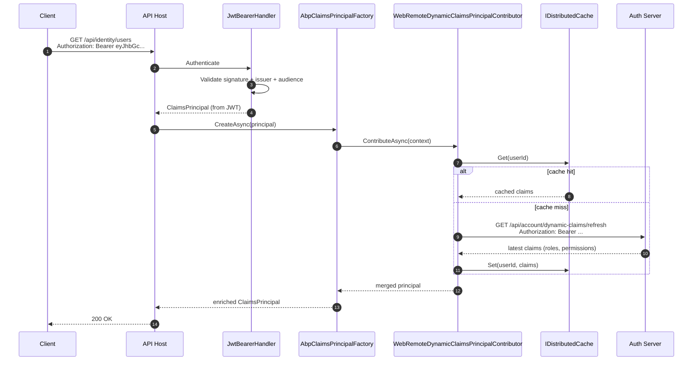

The `Volo.Abp.AspNetCore.Authentication.JwtBearer` package is the ABP
Framework's wrapper around the stock
`Microsoft.AspNetCore.Authentication.JwtBearer` handler. It is the
authentication module you add to an API host (`*.HttpApi.Host`,
`*.Blazor.Server`, a microservice) to validate access tokens issued by an
OpenIddict, IdentityServer, or any other OIDC-compliant authority. Source
lives under
`framework/src/Volo.Abp.AspNetCore.Authentication.JwtBearer/` in the
[abpframework/abp](https://github.com/abpframework/abp) repository and the
module itself is small &mdash; the real work happens in the four extension
hooks described on this page.

## Package layout

The whole package is a handful of files. Every public type is listed below
with its repo-relative path.

| File | Type |
| --- | --- |
| `framework/src/Volo.Abp.AspNetCore.Authentication.JwtBearer/Volo/Abp/AspNetCore/Authentication/JwtBearer/AbpAspNetCoreAuthenticationJwtBearerModule.cs` | `AbpAspNetCoreAuthenticationJwtBearerModule` |
| `framework/src/Volo.Abp.AspNetCore.Authentication.JwtBearer/Microsoft/Extensions/DependencyInjection/AbpJwtBearerExtensions.cs` | `AbpJwtBearerExtensions` static class |
| `framework/src/Volo.Abp.AspNetCore.Authentication.JwtBearer/Microsoft/AspNetCore/Builder/ApplicationBuilderAbpJwtTokenMiddlewareExtension.cs` | `UseJwtTokenMiddleware` extension |
| `framework/src/Volo.Abp.AspNetCore.Authentication.JwtBearer/Volo/Abp/AspNetCore/Authentication/JwtBearer/DynamicClaims/WebRemoteDynamicClaimsPrincipalContributor.cs` | `WebRemoteDynamicClaimsPrincipalContributor` |
| `framework/src/Volo.Abp.AspNetCore.Authentication.JwtBearer/Volo/Abp/AspNetCore/Authentication/JwtBearer/DynamicClaims/WebRemoteDynamicClaimsPrincipalContributorCache.cs` | `WebRemoteDynamicClaimsPrincipalContributorCache` |
| `framework/src/Volo.Abp.AspNetCore.Authentication.JwtBearer/Volo/Abp/AspNetCore/Authentication/JwtBearer/DynamicClaims/WebRemoteDynamicClaimsPrincipalContributorOptions.cs` | `WebRemoteDynamicClaimsPrincipalContributorOptions` |

## The module

The module itself is a straightforward `AbpModule`. It depends on
`AbpSecurityModule` (which owns `AbpClaimTypes` and the claims principal
factory) and `AbpCachingModule` (used by the dynamic claims cache). The
only conditional logic is the gate around the dynamic-claims contributor:
if both the contributor options *and* the remote refresh feature are
enabled at pre-configuration time, the contributor is registered.

```csharp title="framework/src/Volo.Abp.AspNetCore.Authentication.JwtBearer/Volo/Abp/AspNetCore/Authentication/JwtBearer/AbpAspNetCoreAuthenticationJwtBearerModule.cs"
[DependsOn(typeof(AbpSecurityModule), typeof(AbpCachingModule))]
public class AbpAspNetCoreAuthenticationJwtBearerModule : AbpModule
{
    public override void ConfigureServices(ServiceConfigurationContext context)
    {
        context.Services.AddHttpClient();
        context.Services.AddHttpContextAccessor();

        if (context.Services.ExecutePreConfiguredActions<WebRemoteDynamicClaimsPrincipalContributorOptions>().IsEnabled &&
            context.Services.ExecutePreConfiguredActions<AbpClaimsPrincipalFactoryOptions>().IsRemoteRefreshEnabled)
        {
            context.Services.AddTransient<WebRemoteDynamicClaimsPrincipalContributor>();
            context.Services.AddTransient<WebRemoteDynamicClaimsPrincipalContributorCache>();
        }
    }
}
```

<Note>
  `ExecutePreConfiguredActions` runs the pending `PreConfigure&lt;T&gt;` calls
  immediately so the module can branch on them at `ConfigureServices` time
  &mdash; see [/modularity/module-lifecycle](/modularity/module-lifecycle)
  for the lifecycle that makes this possible.
</Note>

## `AddAbpJwtBearer`: the extension you actually call

Applications do not interact with the module class directly. Instead,
startup code calls `AddAbpJwtBearer` on the standard ASP.NET Core
`AuthenticationBuilder`. There are four overloads, all delegating to a
single implementation:

```csharp title="framework/src/Volo.Abp.AspNetCore.Authentication.JwtBearer/Microsoft/Extensions/DependencyInjection/AbpJwtBearerExtensions.cs"
public static AuthenticationBuilder AddAbpJwtBearer(this AuthenticationBuilder builder)
    => builder.AddAbpJwtBearer(JwtBearerDefaults.AuthenticationScheme, _ => { });

public static AuthenticationBuilder AddAbpJwtBearer(this AuthenticationBuilder builder, Action<JwtBearerOptions> configureOptions)
    => builder.AddAbpJwtBearer(JwtBearerDefaults.AuthenticationScheme, configureOptions);

public static AuthenticationBuilder AddAbpJwtBearer(this AuthenticationBuilder builder, string authenticationScheme, Action<JwtBearerOptions> configureOptions)
    => builder.AddAbpJwtBearer(authenticationScheme, "Bearer", configureOptions);

public static AuthenticationBuilder AddAbpJwtBearer(this AuthenticationBuilder builder, string authenticationScheme, string displayName, Action<JwtBearerOptions> configureOptions)
{
    builder.Services.Configure<AbpClaimsPrincipalFactoryOptions>(options =>
    {
        var jwtBearerOption = new JwtBearerOptions();
        configureOptions?.Invoke(jwtBearerOption);
        if (!jwtBearerOption.Authority.IsNullOrEmpty())
        {
            options.RemoteRefreshUrl = jwtBearerOption.Authority.RemovePostFix("/") + options.RemoteRefreshUrl;
        }
    });

    return builder.AddJwtBearer(authenticationScheme, displayName, options =>
    {
        configureOptions?.Invoke(options);
    });
}
```

The method does two things that the stock `AddJwtBearer` does not:

1. It runs `configureOptions` *twice*. The first run is into a throw-away
   `JwtBearerOptions` so ABP can read the `Authority` and prepend it to
   `AbpClaimsPrincipalFactoryOptions.RemoteRefreshUrl`. The second run is
   the actual handler configuration.
2. It registers the dynamic-claims refresh URL on the claims principal
   factory so the remote contributor knows where to call back to.

### A minimal API host registration

```csharp title="src/MyApp.HttpApi.Host/MyAppHttpApiHostModule.cs"
context.Services.AddAuthentication(JwtBearerDefaults.AuthenticationScheme)
    .AddAbpJwtBearer(options =>
    {
        options.Authority = configuration["AuthServer:Authority"];
        options.RequireHttpsMetadata = configuration.GetValue<bool>("AuthServer:RequireHttpsMetadata");
        options.Audience = "MyApp";
    });
```

When the OpenIddict auth server signs an access token for client `MyApp`,
this handler validates the signature against the discovery document at
`{Authority}/.well-known/openid-configuration` and the JWKS endpoint. ABP
does not change any of that &mdash; it is pure
`Microsoft.AspNetCore.Authentication.JwtBearer`.

## Custom schemes and multiple authorities

The full overload accepts an authentication scheme name and display name,
so you can add the same handler twice for two different authorities (for
example, an internal STS and an external IdP):

```csharp
context.Services.AddAuthentication()
    .AddAbpJwtBearer("Internal", "Internal STS", options =>
    {
        options.Authority = "https://sts.internal";
        options.Audience  = "MyApp";
    })
    .AddAbpJwtBearer("External", "External IdP", options =>
    {
        options.Authority = "https://login.partner.example";
        options.Audience  = "MyApp.External";
    });
```

Both schemes share the same `AbpClaimsPrincipalFactoryOptions.RemoteRefreshUrl`
&mdash; you should not point them at incompatible authorities if dynamic
claims are enabled.

## `UseJwtTokenMiddleware`: optional fallback authentication

The package also ships a small middleware that runs `AuthenticateAsync` on
a fixed scheme and replaces `HttpContext.User` if the request was not
already authenticated. It is useful when the host pipeline has multiple
authentication schemes (cookie + JWT) and you want the JWT to win for API
sub-routes even if the cookie middleware has already populated
`HttpContext.User` anonymously.

```csharp title="framework/src/Volo.Abp.AspNetCore.Authentication.JwtBearer/Microsoft/AspNetCore/Builder/ApplicationBuilderAbpJwtTokenMiddlewareExtension.cs"
public static IApplicationBuilder UseJwtTokenMiddleware(this IApplicationBuilder app, string schema = JwtBearerDefaults.AuthenticationScheme)
{
    return app.Use(async (ctx, next) =>
    {
        if (ctx.User.Identity?.IsAuthenticated != true)
        {
            var result = await ctx.AuthenticateAsync(schema);
            if (result.Succeeded && result.Principal != null)
            {
                ctx.User = result.Principal;
            }
        }

        await next();
    });
}
```

Place it between `UseAuthentication` and `UseAuthorization` in
`OnApplicationInitialization`:

```csharp
app.UseAuthentication();
app.UseJwtTokenMiddleware();
app.UseAbpClaimsMap();
app.UseAuthorization();
```

<Warning>
  Do not enable `UseJwtTokenMiddleware` on a Blazor Server host that uses
  cookie authentication for SignalR &mdash; the cookie identity will be
  overwritten by a (possibly missing) bearer token on every request.
</Warning>

## `AbpClaimTypes` and JWT validation

ABP keeps the canonical claim type names in
`framework/src/Volo.Abp.Security/Volo/Abp/Security/Claims/AbpClaimTypes.cs`.
The properties are mutable so other modules (notably the OpenIddict
AspNetCore module when `UpdateAbpClaimTypes` is `true`) can rewrite them at
startup. The out-of-the-box defaults are the stock
`System.Security.Claims.ClaimTypes` URIs plus a small set of ABP-specific
short names:

| `AbpClaimTypes` property | Default value |
| --- | --- |
| `UserName` | `ClaimTypes.Name` |
| `Name` | `ClaimTypes.GivenName` |
| `SurName` | `ClaimTypes.Surname` |
| `UserId` | `ClaimTypes.NameIdentifier` |
| `Role` | `ClaimTypes.Role` |
| `Email` | `ClaimTypes.Email` |
| `EmailVerified` | `email_verified` |
| `PhoneNumber` | `phone_number` |
| `PhoneNumberVerified` | `phone_number_verified` |
| `TenantId` | `tenantid` |
| `EditionId` | `editionid` |
| `ClientId` | `client_id` |
| `ImpersonatorUserId` | `impersonator_userid` |
| `ImpersonatorTenantId` | `impersonator_tenantid` |

`AbpClaimsPrincipalFactoryOptions.ClaimsMap` also ships a default mapping
from short JWT names (`preferred_username`, `unique_name`, `given_name`,
`family_name`, `role`, `roles`, `email`) onto the `AbpClaimTypes` values
above. The `AbpClaimsMapMiddleware` in `Volo.Abp.AspNetCore`
(`UseAbpClaimsMap`) applies that map to the incoming principal so
downstream code can read `ICurrentUser.UserName`, `Roles`, etc.\ regardless
of which authority issued the token. When the OpenIddict AspNetCore module
is loaded the module rewrites the static `AbpClaimTypes` properties to
OpenIddict's standard names &mdash; see
[OpenIddict server](/auth/openiddict-server) for the full mapping.

## The dynamic claims contributor

JWT access tokens are immutable: a token issued five minutes ago will still
have the role list the user had five minutes ago, even if an admin has
since removed a role. ABP solves this with the *dynamic claims principal
contributor* pattern. The JwtBearer package ships the web-side contributor.

```csharp title="framework/src/Volo.Abp.AspNetCore.Authentication.JwtBearer/Volo/Abp/AspNetCore/Authentication/JwtBearer/DynamicClaims/WebRemoteDynamicClaimsPrincipalContributor.cs"
[DisableConventionalRegistration]
public class WebRemoteDynamicClaimsPrincipalContributor : RemoteDynamicClaimsPrincipalContributorBase<WebRemoteDynamicClaimsPrincipalContributor, WebRemoteDynamicClaimsPrincipalContributorCache>
{

}
```

The contributor itself is empty &mdash; everything happens in the base class
`RemoteDynamicClaimsPrincipalContributorBase` from
`Volo.Abp.Security`. It uses an `HttpClient` to call back to the auth
server's `Authority + AbpClaimsPrincipalFactoryOptions.RemoteRefreshUrl`
endpoint (default `/api/account/dynamic-claims/refresh`, stitched together
by `AbpJwtBearerExtensions`) and merges the returned claim list into the
current `ClaimsPrincipal`. The cache class
`WebRemoteDynamicClaimsPrincipalContributorCache` keeps results in
`IDistributedCache` so the HTTP call is only made once per cache window.

### Enabling dynamic claims

Both options must be turned on for the contributor to be registered:

```csharp title="src/MyApp.HttpApi.Host/MyAppHttpApiHostModule.cs (PreConfigureServices)"
PreConfigure<WebRemoteDynamicClaimsPrincipalContributorOptions>(options =>
{
    options.IsEnabled = true;
});

PreConfigure<AbpClaimsPrincipalFactoryOptions>(options =>
{
    options.IsRemoteRefreshEnabled = true;
});
```

The defaults for the contributor options:

```csharp title="framework/src/Volo.Abp.AspNetCore.Authentication.JwtBearer/Volo/Abp/AspNetCore/Authentication/JwtBearer/DynamicClaims/WebRemoteDynamicClaimsPrincipalContributorOptions.cs"
public class WebRemoteDynamicClaimsPrincipalContributorOptions
{
    public bool IsEnabled { get; set; }

    public string AuthenticationScheme { get; set; }

    public WebRemoteDynamicClaimsPrincipalContributorOptions()
    {
        IsEnabled = false;
        AuthenticationScheme = JwtBearerDefaults.AuthenticationScheme;
    }
}
```

The `AuthenticationScheme` decides which scheme the contributor reads the
access token from when proxying the remote call. Default is plain
`Bearer` (the value of `JwtBearerDefaults.AuthenticationScheme`).

## End-to-end picture

The diagram below shows the lifecycle of a request that hits an
`[Authorize]` action on an API host, including the dynamic-claims refresh.



## How JwtBearer interception is composed

The JwtBearer package never reaches into the handler's internal events
(`OnTokenValidated`, `OnAuthenticationFailed`, etc.) &mdash; it leaves
those for you. The interception happens after the handler returns through
`AbpClaimsPrincipalFactory`. The order, top-down, is:

<Steps>
  <Step title="Microsoft JwtBearerHandler runs">
    The stock handler validates the access token using the discovery
    document and the `TokenValidationParameters` from
    `JwtBearerOptions`.
  </Step>
  <Step title="ABP claims map middleware normalizes types">
    `AbpClaimsMapMiddleware` (from `Volo.Abp.AspNetCore`) rewrites well-
    known incoming claim names to `AbpClaimTypes` values.
  </Step>
  <Step title="AbpClaimsPrincipalFactory runs">
    When code resolves `ICurrentUser` or otherwise asks for the principal,
    the factory walks all `IAbpClaimsPrincipalContributor` services.
  </Step>
  <Step title="WebRemoteDynamicClaimsPrincipalContributor calls home">
    If enabled, the contributor calls the auth server's dynamic-claims
    endpoint and merges fresh roles/permissions in.
  </Step>
</Steps>

## Configuration cheat-sheet

| Setting | Type | Where to set | What it does |
| --- | --- | --- | --- |
| `JwtBearerOptions.Authority` | `string` | `AddAbpJwtBearer(opts => ...)` | Discovery doc URL. Also bridged into `AbpClaimsPrincipalFactoryOptions.RemoteRefreshUrl`. |
| `JwtBearerOptions.Audience` | `string` | `AddAbpJwtBearer(opts => ...)` | Audience claim the token must contain. |
| `JwtBearerOptions.RequireHttpsMetadata` | `bool` | same | Disable for local dev only. |
| `WebRemoteDynamicClaimsPrincipalContributorOptions.IsEnabled` | `bool` | `PreConfigure<...>` | Master switch for the dynamic claims contributor. |
| `WebRemoteDynamicClaimsPrincipalContributorOptions.AuthenticationScheme` | `string` | `PreConfigure<...>` | Scheme to read the bearer token from for the remote call. |
| `AbpClaimsPrincipalFactoryOptions.IsRemoteRefreshEnabled` | `bool` | `PreConfigure<...>` | Required gate from `AbpSecurityModule`. |
| `AbpClaimsPrincipalFactoryOptions.RemoteRefreshUrl` | `string` | bridged automatically | Path appended to the authority. |

## Common pitfalls

<Warning>
  **`Authority` must match the issuer claim of the token.** OpenIddict
  emits the `iss` claim using the exact base URL it was reached on. If
  your auth server is behind a reverse proxy, set
  `ForwardedHeadersOptions` and use the public URL as `Authority` on the
  API host.
</Warning>

<Warning>
  **The dynamic-claims contributor short-circuits when the auth server
  is unreachable.** Make sure the API host can resolve the auth server's
  Authority URL from inside the container or VM, otherwise the contributor
  will throw and the user will see a 500.
</Warning>

<Note>
  **Token replacement does not implicitly refresh.** `AddAbpJwtBearer` does
  not issue refresh tokens or rotate access tokens. That is the
  responsibility of the front-end client; see
  [IdentityModel client](/auth/identity-model-client) for the server-side
  variant.
</Note>

## Related pages

<CardGroup cols={2}>
  <Card title="OAuth wrapper" icon="square-arrow-up-right" href="/auth/oauth">
    Shared claim-mapping helpers used by both JwtBearer and OpenIdConnect.
  </Card>
  <Card title="OpenID Connect" icon="user-check" href="/auth/openid-connect">
    The browser-driven equivalent of this module, for MVC and Blazor
    Server hosts.
  </Card>
  <Card title="OpenIddict server" icon="key" href="/auth/openiddict-server">
    The token issuer this module typically validates tokens for.
  </Card>
  <Card title="Authorization" icon="lock" href="/authz">
    What runs after this module produces a `ClaimsPrincipal`.
  </Card>
</CardGroup>
