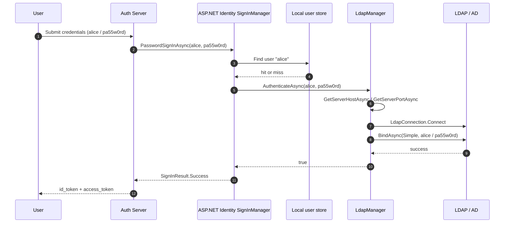

The `Volo.Abp.Ldap` package is the ABP Framework's small directory
authentication module. It does not implement its own protocol &mdash; it
wraps the
[`LdapForNet`](https://github.com/flamencist/ldap4net) cross-platform LDAP
client and exposes a single `ILdapManager.AuthenticateAsync(username,
password)` method. The module is typically plugged into an OpenIddict or
IdentityServer auth server as a secondary credential validator that runs
before the local ASP.NET Identity store, so users defined in an Active
Directory or OpenLDAP server can sign in without first being mirrored
into the local Identity database. Source for the runtime lives under
`framework/src/Volo.Abp.Ldap/` and the abstraction types live under
`framework/src/Volo.Abp.Ldap.Abstractions/` in the
[abpframework/abp](https://github.com/abpframework/abp) repository.

## Package layout

| File | Type |
| --- | --- |
| `framework/src/Volo.Abp.Ldap.Abstractions/Volo/Abp/Ldap/AbpLdapAbstractionsModule.cs` | `AbpLdapAbstractionsModule` |
| `framework/src/Volo.Abp.Ldap.Abstractions/Volo/Abp/Ldap/ILdapManager.cs` | `ILdapManager` |
| `framework/src/Volo.Abp.Ldap.Abstractions/Volo/Abp/Ldap/ILdapSettingProvider.cs` | `ILdapSettingProvider` |
| `framework/src/Volo.Abp.Ldap.Abstractions/Volo/Abp/Ldap/LdapSettingNames.cs` | `LdapSettingNames` |
| `framework/src/Volo.Abp.Ldap.Abstractions/Volo/Abp/Ldap/Localization/LdapResource.cs` | `LdapResource` |
| `framework/src/Volo.Abp.Ldap/Volo/Abp/Ldap/AbpLdapModule.cs` | `AbpLdapModule` |
| `framework/src/Volo.Abp.Ldap/Volo/Abp/Ldap/LdapManager.cs` | `LdapManager` |
| `framework/src/Volo.Abp.Ldap/Volo/Abp/Ldap/LdapSettingProvider.cs` | `LdapSettingProvider` |
| `framework/src/Volo.Abp.Ldap/Volo/Abp/Ldap/LdapSettingDefinitionProvider.cs` | `LdapSettingDefinitionProvider` |

The split between `Volo.Abp.Ldap` and `Volo.Abp.Ldap.Abstractions` follows
the standard ABP pattern: the abstractions package contains interfaces
that downstream code can reference without taking a dependency on the
`LdapForNet` native binding.

## The two modules

`AbpLdapAbstractionsModule` registers the localization resource and embeds
the JSON files that describe the LDAP setting names:

```csharp title="framework/src/Volo.Abp.Ldap.Abstractions/Volo/Abp/Ldap/AbpLdapAbstractionsModule.cs"
[DependsOn(
    typeof(AbpVirtualFileSystemModule),
    typeof(AbpLocalizationModule))]
public class AbpLdapAbstractionsModule : AbpModule
{
    public override void ConfigureServices(ServiceConfigurationContext context)
    {
        Configure<AbpVirtualFileSystemOptions>(options =>
        {
            options.FileSets.AddEmbedded<AbpLdapAbstractionsModule>();
        });

        Configure<AbpLocalizationOptions>(options =>
        {
            options.Resources
                .Add<LdapResource>("en")
                .AddVirtualJson("/Volo/Abp/Ldap/Localization");
        });
    }
}
```

The runtime module just declares its dependencies and brings in
`AbpSettingsModule`:

```csharp title="framework/src/Volo.Abp.Ldap/Volo/Abp/Ldap/AbpLdapModule.cs"
[DependsOn(
    typeof(AbpLdapAbstractionsModule),
    typeof(AbpSettingsModule))]
public class AbpLdapModule : AbpModule
{

}
```

There is no `ConfigureServices` override &mdash; everything is wired by
convention through `ITransientDependency` registrations on the manager
and the setting provider, plus the embedded `SettingDefinitionProvider`.

## `ILdapManager`: the public surface

The whole public surface of the module is two methods on two interfaces.
`ILdapManager` is what callers use:

```csharp title="framework/src/Volo.Abp.Ldap.Abstractions/Volo/Abp/Ldap/ILdapManager.cs"
public interface ILdapManager
{
    Task<bool> AuthenticateAsync(string username, string password);
}
```

`ILdapSettingProvider` is what `LdapManager` calls to discover where to
connect:

```csharp title="framework/src/Volo.Abp.Ldap.Abstractions/Volo/Abp/Ldap/ILdapSettingProvider.cs"
public interface ILdapSettingProvider
{
    public Task<bool> GetLdapOverSsl();

    public Task<string?> GetServerHostAsync();

    public Task<int> GetServerPortAsync();

    public Task<string?> GetBaseDcAsync();

    public Task<string?> GetDomainAsync();

    public Task<string?> GetUserNameAsync();

    public Task<string?> GetPasswordAsync();
}
```

## `LdapManager`: the implementation

`LdapManager` uses the `LdapForNet` types `LdapConnection` and
`LdapCredential` to attempt a simple bind. A successful bind returns
`true`; any exception is logged and the method returns `false`, so the
caller can treat LDAP as a best-effort secondary credential validator
without worrying about exception handling.

```csharp title="framework/src/Volo.Abp.Ldap/Volo/Abp/Ldap/LdapManager.cs"
public class LdapManager : ILdapManager, ITransientDependency
{
    public ILogger<LdapManager> Logger { get; set; }
    protected ILdapSettingProvider LdapSettingProvider { get; }

    public LdapManager(ILdapSettingProvider ldapSettingProvider)
    {
        LdapSettingProvider = ldapSettingProvider;
        Logger = NullLogger<LdapManager>.Instance;
    }

    public virtual async Task<bool> AuthenticateAsync(string username, string password)
    {
        try
        {
            using (var conn = await CreateLdapConnectionAsync())
            {
                await AuthenticateLdapConnectionAsync(conn, username, password);
                return true;
            }
        }
        catch (Exception ex)
        {
            Logger.LogException(ex);
            return false;
        }
    }
```

`CreateLdapConnectionAsync` and `ConnectAsync` use the setting provider to
discover host and port, then `AuthenticateLdapConnectionAsync` performs a
simple bind:

```csharp title="framework/src/Volo.Abp.Ldap/Volo/Abp/Ldap/LdapManager.cs"
protected virtual async Task<ILdapConnection> CreateLdapConnectionAsync()
{
    var ldapConnection = new LdapConnection();
    await ConfigureLdapConnectionAsync(ldapConnection);
    await ConnectAsync(ldapConnection);
    return ldapConnection;
}

protected virtual Task ConfigureLdapConnectionAsync(ILdapConnection ldapConnection)
{
    return Task.CompletedTask;
}

protected virtual async Task ConnectAsync(ILdapConnection ldapConnection)
{
    ldapConnection.Connect(await LdapSettingProvider.GetServerHostAsync(), await LdapSettingProvider.GetServerPortAsync());
}

protected virtual async Task AuthenticateLdapConnectionAsync(ILdapConnection connection, string username, string password)
{
    await connection.BindAsync(Native.LdapAuthType.Simple, new LdapCredential()
    {
        UserName = username,
        Password = password
    });
}
```

The methods are all `protected virtual`, which is ABP's standard pattern
for letting solutions override individual steps. Common overrides:

- `ConfigureLdapConnectionAsync` &mdash; set `LDAP_OPT_X_TLS_REQUIRE_CERT`
  to ignore self-signed certificates in dev.
- `ConnectAsync` &mdash; switch to `ConnectAsync(uri)` when you need to
  pass an `ldaps://` URI explicitly.
- `AuthenticateLdapConnectionAsync` &mdash; switch from
  `LdapAuthType.Simple` to `LdapAuthType.Negotiate` for Active Directory
  Kerberos integration.

## `LdapSettingNames` and the setting definitions

Setting names are exposed as constants so other modules (an auth server,
your custom credential validator) can read or write them through the
ABP settings system.

```csharp title="framework/src/Volo.Abp.Ldap.Abstractions/Volo/Abp/Ldap/LdapSettingNames.cs"
public static class LdapSettingNames
{
    public const string Ldaps = "Abp.Ldap.Ldaps";

    public const string ServerHost = "Abp.Ldap.ServerHost";

    public const string ServerPort = "Abp.Ldap.ServerPort";

    public const string BaseDc = "Abp.Ldap.BaseDc";

    public const string Domain = "Abp.Ldap.Domain";

    public const string UserName = "Abp.Ldap.UserName";

    public const string Password = "Abp.Ldap.Password";
}
```

The matching `SettingDefinitionProvider` registers each name with a
localized display name and a default value. The password setting is
flagged as encrypted:

```csharp title="framework/src/Volo.Abp.Ldap/Volo/Abp/Ldap/LdapSettingDefinitionProvider.cs"
public override void Define(ISettingDefinitionContext context)
{
    context.Add(
        new SettingDefinition(
            LdapSettingNames.Ldaps,
            "false",
            L("DisplayName:Abp.Ldap.Ldaps"),
            L("Description:Abp.Ldap.Ldaps")),

        new SettingDefinition(
            LdapSettingNames.ServerHost,
            "",
            L("DisplayName:Abp.Ldap.ServerHost"),
            L("Description:Abp.Ldap.ServerHost")),

        new SettingDefinition(
            LdapSettingNames.ServerPort,
            "389",
            L("DisplayName:Abp.Ldap.ServerPort"),
            L("Description:Abp.Ldap.ServerPort")),

        new SettingDefinition(
            LdapSettingNames.BaseDc,
            "",
            L("DisplayName:Abp.Ldap.BaseDc"),
            L("Description:Abp.Ldap.BaseDc")),

        new SettingDefinition(
            LdapSettingNames.Domain,
            "",
            L("DisplayName:Abp.Ldap.Domain"),
            L("Description:Abp.Ldap.Domain")),

        new SettingDefinition(
            LdapSettingNames.UserName,
            "",
            L("DisplayName:Abp.Ldap.UserName"),
            L("Description:Abp.Ldap.UserName")),

        new SettingDefinition(
            LdapSettingNames.Password,
            "",
            L("DisplayName:Abp.Ldap.Password"),
            L("Description:Abp.Ldap.Password"),
            isEncrypted: true)
    );
}
```

| Setting name | Default | Purpose |
| --- | --- | --- |
| `Abp.Ldap.Ldaps` | `"false"` | Whether to use LDAPS (port 636) |
| `Abp.Ldap.ServerHost` | empty | Host name or IP of the directory |
| `Abp.Ldap.ServerPort` | `"389"` | TCP port; set to 636 when `Ldaps=true` |
| `Abp.Ldap.BaseDc` | empty | Base DN, e.g. `dc=corp,dc=example,dc=com` |
| `Abp.Ldap.Domain` | empty | NT/Windows domain for AD setups |
| `Abp.Ldap.UserName` | empty | Service-account DN for initial bind |
| `Abp.Ldap.Password` | empty (encrypted) | Service-account password |

`LdapSettingProvider` reads the seven settings and converts the string
values to typed results. It is a thin wrapper over `ISettingProvider`:

```csharp title="framework/src/Volo.Abp.Ldap/Volo/Abp/Ldap/LdapSettingProvider.cs"
public class LdapSettingProvider : ILdapSettingProvider, ITransientDependency
{
    protected ISettingProvider SettingProvider { get; }

    public LdapSettingProvider(ISettingProvider settingProvider)
    {
        SettingProvider = settingProvider;
    }

    public virtual async Task<bool> GetLdapOverSsl()
    {
        return (await SettingProvider.GetOrNullAsync(LdapSettingNames.Ldaps))?.To<bool>() ?? default;
    }

    public virtual async Task<string?> GetServerHostAsync()
    {
        return await SettingProvider.GetOrNullAsync(LdapSettingNames.ServerHost);
    }

    public virtual async Task<int> GetServerPortAsync()
    {
        return (await SettingProvider.GetOrNullAsync(LdapSettingNames.ServerPort))?.To<int>() ?? default;
    }

    public virtual async Task<string?> GetBaseDcAsync()
    {
        return await SettingProvider.GetOrNullAsync(LdapSettingNames.BaseDc);
    }

    public virtual async Task<string?> GetDomainAsync()
    {
        return await SettingProvider.GetOrNullAsync(LdapSettingNames.Domain);
    }

    public virtual async Task<string?> GetUserNameAsync()
    {
        return await SettingProvider.GetOrNullAsync(LdapSettingNames.UserName);
    }

    public virtual async Task<string?> GetPasswordAsync()
    {
        return await SettingProvider.GetOrNullAsync(LdapSettingNames.Password);
    }
}
```

Because settings are stored in the database, an admin can change LDAP
endpoint and credentials at runtime through the standard ABP Settings
Management UI &mdash; no redeploy required.

## Plugging the module into an auth server

The package itself does not call into any authentication handler. You
plug it in by implementing your own external user provider on the auth
server and consulting `ILdapManager` from there. The pattern looks like:

```csharp title="src/MyApp.AuthServer/Identity/LdapExternalLoginProvider.cs"
public class LdapExternalLoginProvider : IExternalLoginProvider, ITransientDependency
{
    private readonly ILdapManager _ldap;

    public LdapExternalLoginProvider(ILdapManager ldap)
    {
        _ldap = ldap;
    }

    public Task<bool> TryAuthenticateAsync(string userName, string plainPassword)
        => _ldap.AuthenticateAsync(userName, plainPassword);

    // ... GetUserInfoAsync, CreateUserAsync (resolve via search after the bind succeeds)
}
```

`IExternalLoginProvider` is part of the ABP Identity module; once your
implementation is registered, the `SignInManager` will consult it after
the local password store rejects the credentials. The Identity Pro
module ships an `LdapExternalLoginProvider` that does exactly this.

## End-to-end picture



## Configuration via appsettings.json (initial seeding)

The module's settings live in the `AbpSettings` table, but you typically
seed them through `appsettings.json` and the Settings module's data seeder.
A typical seed entry looks like:

```json title="appsettings.json"
{
  "Settings": {
    "Abp.Ldap.Ldaps":     "false",
    "Abp.Ldap.ServerHost": "ldap.corp.example",
    "Abp.Ldap.ServerPort": "389",
    "Abp.Ldap.BaseDc":     "dc=corp,dc=example,dc=com",
    "Abp.Ldap.Domain":     "CORP",
    "Abp.Ldap.UserName":   "cn=svc_abp,ou=Service,dc=corp,dc=example,dc=com",
    "Abp.Ldap.Password":   "SUPERSECRET"
  }
}
```

The password is encrypted at rest because the setting is registered with
`isEncrypted: true` (see the settings definition snippet above).

## Behavioral notes

- **`LdapConnection.Connect` is synchronous in LdapForNet.** ABP's
  `ConnectAsync` wraps the call, but the underlying call blocks. Keep the
  manager off hot paths.
- **No search step is performed.** The default `LdapManager` only binds
  with the supplied credentials. To resolve the user's distinguished name
  or attributes, override `AuthenticateLdapConnectionAsync` to perform a
  `SearchAsync` after a service-account bind, then bind again with the
  found DN.
- **Returns `false` on any exception.** That includes network errors,
  invalid base DN, and disabled accounts. Inspect logs for the underlying
  reason.

## Common pitfalls

<Warning>
  **`Abp.Ldap.Ldaps = true` does not flip the port automatically.** You
  must also set `Abp.Ldap.ServerPort = 636` and override
  `ConfigureLdapConnectionAsync` to set
  `LdapOption.LDAP_OPT_X_TLS_REQUIRE_CERT` to your desired level.
</Warning>

<Warning>
  **Username format depends on the directory.** Active Directory accepts
  `DOMAIN\\alice` or `alice@corp.example`; OpenLDAP usually requires the
  full DN such as `cn=alice,ou=Users,dc=corp,dc=example,dc=com`. The
  package does not transform the input.
</Warning>

<Note>
  **The module does not depend on any auth server.** You can call
  `ILdapManager` from a Razor Page, a background job, or a custom MVC
  controller. The auth-server integration pattern shown above is only the
  typical use case.
</Note>

## Public surface

| Symbol | Notes |
| --- | --- |
| `AbpLdapModule` | Runtime module &mdash; DependsOn `AbpLdapAbstractionsModule`, `AbpSettingsModule` |
| `AbpLdapAbstractionsModule` | Abstractions module &mdash; DependsOn `AbpVirtualFileSystemModule`, `AbpLocalizationModule` |
| `ILdapManager` | `Task<bool> AuthenticateAsync(string, string)` |
| `LdapManager` | Default implementation, `ITransientDependency`, all members `virtual` |
| `ILdapSettingProvider` | Seven typed accessors over the settings system |
| `LdapSettingProvider` | Default implementation |
| `LdapSettingNames` | String constants for the seven setting keys |
| `LdapSettingDefinitionProvider` | Registers the seven settings with default values |
| `LdapResource` | Localization resource (`AbpLdap`) |

## Related pages

<CardGroup cols={2}>
  <Card title="OpenIddict server" icon="key" href="/auth/openiddict-server">
    The auth server that typically calls `ILdapManager` from an external
    login provider.
  </Card>
  <Card title="IdentityServer module" icon="square-arrow-up-right" href="/auth/identityserver-module">
    The legacy auth server with the same external-login extension point.
  </Card>
  <Card title="JWT Bearer" icon="user-check" href="/auth/jwt-bearer">
    What downstream API hosts use once LDAP-backed sign-in succeeds.
  </Card>
  <Card title="Authentication overview" icon="lock" href="/auth/overview">
    The full picture of how LDAP slots into the broader auth stack.
  </Card>
</CardGroup>
