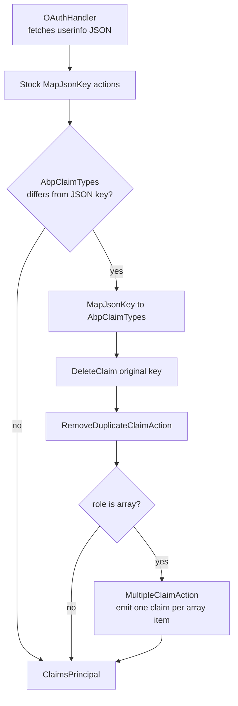

The `Volo.Abp.AspNetCore.Authentication.OAuth` package is the smallest of
ABP's authentication packages. It does not implement an OAuth handler
itself &mdash; ASP.NET Core's
`Microsoft.AspNetCore.Authentication.OAuth.OAuthHandler` already does that,
and individual providers (Google, Microsoft, GitHub, Twitter, Facebook,
generic) ship their own derived handlers. What this ABP package adds is
the *claim-mapping glue* used by every other ABP auth package: the
`MapAbpClaimTypes` extension and two reusable `ClaimAction` types
(`MultipleClaimAction`, `RemoveDuplicateClaimAction`). Source lives under
`framework/src/Volo.Abp.AspNetCore.Authentication.OAuth/` in the
[abpframework/abp](https://github.com/abpframework/abp) repository.

## Package layout

| File | Type |
| --- | --- |
| `framework/src/Volo.Abp.AspNetCore.Authentication.OAuth/Volo/Abp/AspNetCore/Authentication/OAuth/AbpAspNetCoreAuthenticationOAuthModule.cs` | `AbpAspNetCoreAuthenticationOAuthModule` |
| `framework/src/Volo.Abp.AspNetCore.Authentication.OAuth/Microsoft/AspNetCore/Authentication/OAuth/Claims/AbpClaimActionCollectionExtensions.cs` | `AbpClaimActionCollectionExtensions` (`MapAbpClaimTypes`, `MapJsonKeyMultiple`, `RemoveDuplicate`) |
| `framework/src/Volo.Abp.AspNetCore.Authentication.OAuth/Volo/Abp/AspNetCore/Authentication/OAuth/Claims/MultipleClaimAction.cs` | `MultipleClaimAction` |
| `framework/src/Volo.Abp.AspNetCore.Authentication.OAuth/Volo/Abp/AspNetCore/Authentication/OAuth/Claims/RemoveDuplicateClaimAction.cs` | `RemoveDuplicateClaimAction` |

## The module

The module class is intentionally empty. It only declares its dependency on
`AbpSecurityModule` so that downstream modules can declare a single
`[DependsOn]` and pick up both the OAuth helpers and the security
primitives. The `OpenIdConnect` module in turn depends on this one to
inherit the same claim mapping.

```csharp title="framework/src/Volo.Abp.AspNetCore.Authentication.OAuth/Volo/Abp/AspNetCore/Authentication/OAuth/AbpAspNetCoreAuthenticationOAuthModule.cs"
using Volo.Abp.Modularity;
using Volo.Abp.Security;

namespace Volo.Abp.AspNetCore.Authentication.OAuth;

[DependsOn(typeof(AbpSecurityModule))]
public class AbpAspNetCoreAuthenticationOAuthModule : AbpModule
{

}
```

There is no `ConfigureServices` override. Everything this package offers is
extension-method-shaped: it is opt-in from the caller, not auto-wired by
the module.

## `MapAbpClaimTypes`: the central helper

The headline API is `MapAbpClaimTypes`. It takes a
`ClaimActionCollection` (the property on `RemoteAuthenticationOptions`,
exposed by every Microsoft OAuth handler) and registers the OIDC userinfo
claim mappings into ABP's canonical claim type names. The conditions
(`if (AbpClaimTypes.UserName != "name")`) are there because the OpenIddict
AspNetCore module may have already rewritten `AbpClaimTypes` to the
OpenIddict-native names &mdash; in that case the mapping is a no-op.

```csharp title="framework/src/Volo.Abp.AspNetCore.Authentication.OAuth/Microsoft/AspNetCore/Authentication/OAuth/Claims/AbpClaimActionCollectionExtensions.cs"
public static void MapAbpClaimTypes(this ClaimActionCollection claimActions)
{
    if (AbpClaimTypes.UserName != "name")
    {
        claimActions.MapJsonKey(AbpClaimTypes.UserName, "name");
        claimActions.DeleteClaim("name");
        claimActions.RemoveDuplicate(AbpClaimTypes.UserName);
    }

    if (AbpClaimTypes.Name != "given_name")
    {
        claimActions.MapJsonKey(AbpClaimTypes.Name, "given_name");
        claimActions.DeleteClaim("given_name");
        claimActions.RemoveDuplicate(AbpClaimTypes.Name);
    }

    if (AbpClaimTypes.SurName != "family_name")
    {
        claimActions.MapJsonKey(AbpClaimTypes.SurName, "family_name");
        claimActions.DeleteClaim("family_name");
        claimActions.RemoveDuplicate(AbpClaimTypes.SurName);
    }

    if (AbpClaimTypes.Email != "email")
    {
        claimActions.MapJsonKey(AbpClaimTypes.Email, "email");
        claimActions.DeleteClaim("email");
        claimActions.RemoveDuplicate(AbpClaimTypes.Email);
    }

    if (AbpClaimTypes.EmailVerified != "email_verified")
    {
        claimActions.MapJsonKey(AbpClaimTypes.EmailVerified, "email_verified");
    }

    if (AbpClaimTypes.PhoneNumber != "phone_number")
    {
        claimActions.MapJsonKey(AbpClaimTypes.PhoneNumber, "phone_number");
    }

    if (AbpClaimTypes.PhoneNumberVerified != "phone_number_verified")
    {
        claimActions.MapJsonKey(AbpClaimTypes.PhoneNumberVerified, "phone_number_verified");
    }

    if (AbpClaimTypes.Role != "role")
    {
        claimActions.MapJsonKeyMultiple(AbpClaimTypes.Role, "role");
    }

    claimActions.RemoveDuplicate(AbpClaimTypes.Name);
}
```

The pattern for each block is the same three steps:

1. **Map** the JSON key from the userinfo / id_token payload to the ABP
   claim name &mdash; `MapJsonKey(target, sourceJsonKey)`.
2. **Delete** the original claim that the stock handler would have
   produced (so the principal does not end up with both `name` and
   `AbpClaimTypes.UserName`).
3. **De-duplicate** the resulting claim &mdash; some IdPs send the same
   value twice across `name` and `nickname`, or across `email` and
   `preferred_username`.

The `role` claim is special. Identity providers often return roles as a
JSON array, but Microsoft's stock `MapJsonKey` only handles scalar values.
ABP uses `MapJsonKeyMultiple` (powered by `MultipleClaimAction`) to add
one claim per array element.

## `MultipleClaimAction`: multi-valued JSON keys

This `ClaimAction` reads a JSON property and supports both string and array
values. For each element it emits one claim, skipping duplicates that are
already present on the identity.

```csharp title="framework/src/Volo.Abp.AspNetCore.Authentication.OAuth/Volo/Abp/AspNetCore/Authentication/OAuth/Claims/MultipleClaimAction.cs"
public class MultipleClaimAction : ClaimAction
{
    public MultipleClaimAction(string claimType, string jsonKey)
        : base(claimType, jsonKey)
    {

    }

    public override void Run(JsonElement userData, ClaimsIdentity identity, string issuer)
    {
        JsonElement prop;

        if (!userData.TryGetProperty(ValueType, out prop))
            return;

        if (prop.ValueKind == JsonValueKind.Null)
        {
            return;
        }

        Claim claim;
        switch (prop.ValueKind)
        {
            case JsonValueKind.String:
                claim = new Claim(ClaimType, prop.GetString()!, ValueType, issuer);
                if (!identity.Claims.Any(c => c.Type == claim.Type && c.Value == claim.Value))
                {
                    identity.AddClaim(claim);
                }
                break;
            case JsonValueKind.Array:
                foreach (var arramItem in prop.EnumerateArray())
                {
                    claim = new Claim(ClaimType, arramItem.GetString()!, ValueType, issuer);
                    if (!identity.Claims.Any(c => c.Type == claim.Type && c.Value == claim.Value))
                    {
                        identity.AddClaim(claim);
                    }
                }
                break;
            default:
                throw new AbpException("Unhandled JsonValueKind: " + prop.ValueKind);
        }
    }
}
```

<Note>
  The base `ClaimAction` reuses its second constructor parameter (the JSON
  key) as the `ValueType` property. That is why the implementation does
  `userData.TryGetProperty(ValueType, out prop)` &mdash; it is reading
  the JSON property name, not a claim value type.
</Note>

## `RemoveDuplicateClaimAction`: post-processing

The other helper runs *after* the JSON keys have been mapped. It walks the
identity and removes any duplicate claim of a given type, keeping the
first occurrence.

```csharp title="framework/src/Volo.Abp.AspNetCore.Authentication.OAuth/Volo/Abp/AspNetCore/Authentication/OAuth/Claims/RemoveDuplicateClaimAction.cs"
public class RemoveDuplicateClaimAction : ClaimAction
{
    public RemoveDuplicateClaimAction(string claimType)
        : base(claimType, ClaimValueTypes.String)
    {
    }

    /// <inheritdoc />
    public override void Run(JsonElement userData, ClaimsIdentity identity, string issuer)
    {
        var claims = identity.Claims.Where(c => c.Type == ClaimType).ToArray();
        if (claims.Length < 2)
        {
            return;
        }

        var previousValues = new List<string>();
        foreach (var claim in claims)
        {
            if (claim.Value.IsIn(previousValues))
            {
                identity.RemoveClaim(claim);
            }
            else
            {
                previousValues.Add(claim.Value);
            }
        }
    }
}
```

It is registered via the `RemoveDuplicate` extension method:

```csharp
public static void RemoveDuplicate(this ClaimActionCollection claimActions, string claimType)
{
    claimActions.Add(new RemoveDuplicateClaimAction(claimType));
}
```

This is most useful when the JWT carries the same claim under multiple keys
(for example a Microsoft identity provider that includes both `name` and
`unique_name` resolving to the user's display name).

## Where to call `MapAbpClaimTypes`

The ABP OpenID Connect extension calls it for you automatically &mdash;
see [OpenID Connect](/auth/openid-connect). For any other OAuth handler
you must call it from the handler's options:

```csharp title="src/MyApp.Web/MyAppWebModule.cs"
context.Services.AddAuthentication()
    .AddGoogle("Google", options =>
    {
        options.ClientId     = configuration["Google:ClientId"];
        options.ClientSecret = configuration["Google:ClientSecret"];

        options.ClaimActions.MapAbpClaimTypes();
    });
```

```csharp title="src/MyApp.Web/MyAppWebModule.cs (GitHub provider)"
context.Services.AddAuthentication()
    .AddOAuth("GitHub", options =>
    {
        options.ClientId     = configuration["GitHub:ClientId"];
        options.ClientSecret = configuration["GitHub:ClientSecret"];
        options.AuthorizationEndpoint = "https://github.com/login/oauth/authorize";
        options.TokenEndpoint         = "https://github.com/login/oauth/access_token";
        options.UserInformationEndpoint = "https://api.github.com/user";

        options.ClaimActions.MapJsonKey("urn:github:login", "login");
        options.ClaimActions.MapAbpClaimTypes();
    });
```

The order matters: call your provider-specific `MapJsonKey` first, then
`MapAbpClaimTypes` so that custom mappings are not overwritten by ABP's
default deletes.

## How the helpers compose at request time



## When is the OAuth module loaded?

The package is rarely loaded on its own. The dependency graph is:


You will end up with `AbpAspNetCoreAuthenticationOAuthModule` in your
dependency graph any time you reference
`AbpAspNetCoreAuthenticationOpenIdConnectModule`. The reverse is not true:
adding only the OAuth module gives you the claim helpers but no OIDC
handler.

## Public API surface

The full public surface of this package is small. The table below lists
everything an application code can call:

| Symbol | File | Purpose |
| --- | --- | --- |
| `AbpAspNetCoreAuthenticationOAuthModule` | `Volo/Abp/AspNetCore/Authentication/OAuth/AbpAspNetCoreAuthenticationOAuthModule.cs` | Module marker for `[DependsOn]`. |
| `MapAbpClaimTypes(this ClaimActionCollection)` | `Microsoft/AspNetCore/Authentication/OAuth/Claims/AbpClaimActionCollectionExtensions.cs` | Register the full ABP claim mapping. |
| `MapJsonKeyMultiple(this ClaimActionCollection, string, string)` | same | Map a multi-value JSON key (e.g. `role`). |
| `RemoveDuplicate(this ClaimActionCollection, string)` | same | Drop duplicate claims of a single type. |
| `MultipleClaimAction` | `Volo/Abp/AspNetCore/Authentication/OAuth/Claims/MultipleClaimAction.cs` | Used by `MapJsonKeyMultiple`. |
| `RemoveDuplicateClaimAction` | `Volo/Abp/AspNetCore/Authentication/OAuth/Claims/RemoveDuplicateClaimAction.cs` | Used by `RemoveDuplicate`. |

## Common patterns

### Adding a provider-specific claim then re-using ABP types

```csharp
options.ClaimActions.MapJsonKey("urn:google:picture", "picture");
options.ClaimActions.MapAbpClaimTypes();
```

The provider-specific claim is added once, then ABP's helper handles the
standard OIDC mapping. Both end up on the resulting `ClaimsPrincipal`.

### Forcing role array mapping for non-OIDC providers

Some social providers return roles under a non-standard key. Use
`MapJsonKeyMultiple` directly:

```csharp
options.ClaimActions.MapJsonKeyMultiple(AbpClaimTypes.Role, "groups");
```

### Removing built-in mappings before ABP's mapping

If a provider's stock handler maps a claim you do not want, call
`DeleteClaim` first:

```csharp
options.ClaimActions.DeleteClaim(ClaimTypes.NameIdentifier);
options.ClaimActions.MapAbpClaimTypes();
```

## Common pitfalls

<Warning>
  **`MapAbpClaimTypes` is a one-time call.** Calling it twice produces
  duplicate `MultipleClaimAction` instances. Each adds one claim per array
  element, so you can end up with each role twice on the identity.
</Warning>

<Warning>
  **The `else` branches assume `AbpClaimTypes` was rewritten by another
  module.** If you load both this module and OpenIddict but explicitly set
  `AbpOpenIddictAspNetCoreOptions.UpdateAbpClaimTypes = false`, the
  branches will *also* be no-ops &mdash; not because the values match the
  JSON keys, but because they have the namespaced
  `http://schemas.xmlsoap.org/...` defaults. Configure carefully.
</Warning>

<Note>
  **No tenant or permission claim handling.** This package is purely about
  identity claims (name, email, role). Permissions are layered in by
  [/authz](/authz) and tenant detection by
  `AbpAspNetCoreMultiTenancyModule`.
</Note>

## Related pages

<CardGroup cols={2}>
  <Card title="OpenID Connect" icon="user-check" href="/auth/openid-connect">
    Calls `MapAbpClaimTypes` automatically and adds tenant + local-user
    handling on top.
  </Card>
  <Card title="JWT Bearer" icon="key" href="/auth/jwt-bearer">
    Uses the same `AbpClaimTypes` names but does not run claim actions
    (JWTs are decoded, not fetched from userinfo).
  </Card>
  <Card title="OpenIddict server" icon="lock" href="/auth/openiddict-server">
    The server-side counterpart that rewrites `AbpClaimTypes` to
    OpenIddict-native names.
  </Card>
  <Card title="Web layer" icon="globe" href="/web">
    How `AbpClaimsMapMiddleware` consumes the claim names this package
    standardizes.
  </Card>
</CardGroup>
