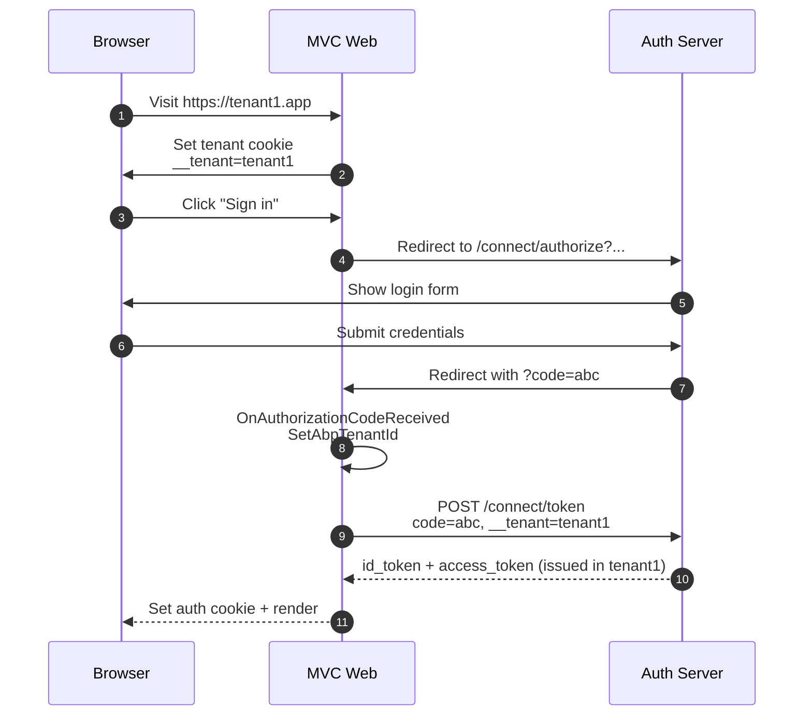
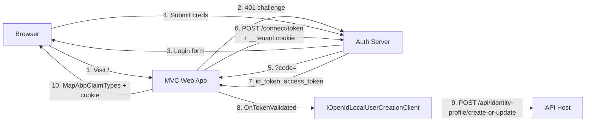

The `Volo.Abp.AspNetCore.Authentication.OpenIdConnect` package is the ABP
Framework's wrapper around the stock
`Microsoft.AspNetCore.Authentication.OpenIdConnect` handler. It is the
authentication module you add to an MVC, Razor Pages, or Blazor Server
host that signs users in interactively against an OpenIddict /
IdentityServer authority, then drops a cookie. ABP layers four things on
top of the stock handler: ABP claim type mapping, multi-tenant cookie
forwarding, dynamic claims, and an optional local user creation hook.
Source lives under
`framework/src/Volo.Abp.AspNetCore.Authentication.OpenIdConnect/` in the
[abpframework/abp](https://github.com/abpframework/abp) repository.

## Package layout

| File | Type |
| --- | --- |
| `framework/src/Volo.Abp.AspNetCore.Authentication.OpenIdConnect/Volo/Abp/AspNetCore/Authentication/OpenIdConnect/AbpAspNetCoreAuthenticationOpenIdConnectModule.cs` | `AbpAspNetCoreAuthenticationOpenIdConnectModule` |
| `framework/src/Volo.Abp.AspNetCore.Authentication.OpenIdConnect/Microsoft/Extensions/DependencyInjection/AbpOpenIdConnectExtensions.cs` | `AddAbpOpenIdConnect` extensions |
| `framework/src/Volo.Abp.AspNetCore.Authentication.OpenIdConnect/Volo/Abp/AspNetCore/Authentication/OpenIdConnect/IOpenIdLocalUserCreationClient.cs` | `IOpenIdLocalUserCreationClient` |
| `framework/src/Volo.Abp.AspNetCore.Authentication.OpenIdConnect/Volo/Abp/AspNetCore/Authentication/OpenIdConnect/OpenIdLocalUserCreationClient.cs` | `OpenIdLocalUserCreationClient` |
| `framework/src/Volo.Abp.AspNetCore.Authentication.OpenIdConnect/Volo/Abp/AspNetCore/Authentication/OpenIdConnect/OpenIdLocalUserCreationClientOptions.cs` | `OpenIdLocalUserCreationClientOptions` |

## The module

The module's dependency graph wires it into multi-tenancy, the OAuth claim
helpers, and the remote-services infrastructure (so the local-user client
can resolve the API base URL).

```csharp title="framework/src/Volo.Abp.AspNetCore.Authentication.OpenIdConnect/Volo/Abp/AspNetCore/Authentication/OpenIdConnect/AbpAspNetCoreAuthenticationOpenIdConnectModule.cs"
[DependsOn(
    typeof(AbpMultiTenancyModule),
    typeof(AbpAspNetCoreAuthenticationOAuthModule),
    typeof(AbpRemoteServicesModule)
    )]
public class AbpAspNetCoreAuthenticationOpenIdConnectModule : AbpModule
{
    public override void ConfigureServices(ServiceConfigurationContext context)
    {
        context.Services.AddHttpClient();
    }
}
```

By depending on
[`AbpAspNetCoreAuthenticationOAuthModule`](/auth/oauth), it transitively
inherits ABP's claim-action helpers including `MapAbpClaimTypes`,
`MultipleClaimAction`, and `RemoveDuplicateClaimAction`.

## `AddAbpOpenIdConnect`: the extension you call

Applications add OIDC by calling `AddAbpOpenIdConnect` on the
`AuthenticationBuilder`. The full overload signature mirrors
`AddAbpJwtBearer`:

```csharp
builder.AddAbpOpenIdConnect();
builder.AddAbpOpenIdConnect(configureOptions);
builder.AddAbpOpenIdConnect(authenticationScheme, configureOptions);
builder.AddAbpOpenIdConnect(authenticationScheme, displayName, configureOptions);
```

The full implementation is below. It is the most opinionated extension in
the ABP authentication stack &mdash; it patches three handler events,
remaps claim types, and forces `AccessDeniedPath` to root.

```csharp title="framework/src/Volo.Abp.AspNetCore.Authentication.OpenIdConnect/Microsoft/Extensions/DependencyInjection/AbpOpenIdConnectExtensions.cs"
public static AuthenticationBuilder AddAbpOpenIdConnect(this AuthenticationBuilder builder, string authenticationScheme, string displayName, Action<OpenIdConnectOptions> configureOptions)
{
    builder.Services.Configure<AbpClaimsPrincipalFactoryOptions>(options =>
    {
        var openIdConnectOptions = new OpenIdConnectOptions();
        configureOptions?.Invoke(openIdConnectOptions);
        if (!openIdConnectOptions.Authority.IsNullOrEmpty())
        {
            options.RemoteRefreshUrl = openIdConnectOptions.Authority.RemovePostFix("/") + options.RemoteRefreshUrl;
        }
    });

    return builder.AddOpenIdConnect(authenticationScheme, displayName, options =>
    {
        options.ClaimActions.MapAbpClaimTypes();

        options.Events ??= new OpenIdConnectEvents();
        var authorizationCodeReceived = options.Events.OnAuthorizationCodeReceived ?? (_ => Task.CompletedTask);

        options.Events.OnAuthorizationCodeReceived = receivedContext =>
        {
            SetAbpTenantId(receivedContext);
            return authorizationCodeReceived.Invoke(receivedContext);
        };

        options.AccessDeniedPath = "/";

        options.Events.OnTokenValidated = async (context) =>
        {
            var client = context.HttpContext.RequestServices.GetRequiredService<IOpenIdLocalUserCreationClient>();
            try
            {
                await client.CreateOrUpdateAsync(context);
            }
            catch (Exception ex)
            {
                var logger = context.HttpContext.RequestServices.GetService<ILogger<AbpAspNetCoreAuthenticationOpenIdConnectModule>>();
                logger?.LogException(ex);
            }
        };

        configureOptions?.Invoke(options);
    });
}
```

There are four ABP additions worth calling out:

1. **`ClaimActions.MapAbpClaimTypes()`** &mdash; reuses the OAuth helper
   to normalize claim names; see [OAuth](/auth/oauth) for the per-key
   logic.
2. **`OnAuthorizationCodeReceived` wraps the user callback** and prepends
   `SetAbpTenantId`. Any handler the caller adds in `configureOptions`
   still runs &mdash; the original delegate is captured into
   `authorizationCodeReceived` and invoked after the tenant key is set.
3. **`OnTokenValidated`** is overridden with the local-user creation
   call. Note: the caller's `configureOptions` runs *after* the ABP setup,
   so the caller's `OnTokenValidated` will overwrite ABP's. If you need
   both, wrap ABP's like the inner pattern uses for
   `OnAuthorizationCodeReceived`.
4. **`AccessDeniedPath = "/"`** is hard-coded so that when the user
   declines consent or fails authorization the app returns to its home
   page instead of `/Account/AccessDenied`.

## Multi-tenant tenant key forwarding

The most interesting piece is `SetAbpTenantId`. When the OIDC flow exchanges
the authorization code for tokens, ABP attaches the tenant key from the
incoming cookie to the token request:

```csharp title="framework/src/Volo.Abp.AspNetCore.Authentication.OpenIdConnect/Microsoft/Extensions/DependencyInjection/AbpOpenIdConnectExtensions.cs"
private static void SetAbpTenantId(AuthorizationCodeReceivedContext receivedContext)
{
    var tenantKey = receivedContext.HttpContext.RequestServices
        .GetRequiredService<IOptions<AbpAspNetCoreMultiTenancyOptions>>().Value.TenantKey;

    if (receivedContext.Request.Cookies.ContainsKey(tenantKey))
    {
        receivedContext.TokenEndpointRequest?.SetParameter(tenantKey, receivedContext.Request.Cookies[tenantKey]);
    }
}
```

The flow is:



This is what lets the auth server resolve the correct tenant when minting
the token, even though the user typed credentials into a global login UI.

## Local user creation

When an OIDC token validates against the API host, ABP can call back to
the auth server (or, more commonly, the API host itself) to create or
update the local user record. The interface is small:

```csharp title="framework/src/Volo.Abp.AspNetCore.Authentication.OpenIdConnect/Volo/Abp/AspNetCore/Authentication/OpenIdConnect/IOpenIdLocalUserCreationClient.cs"
public interface IOpenIdLocalUserCreationClient
{
    Task CreateOrUpdateAsync(TokenValidatedContext tokenValidatedContext);
}
```

The default implementation uses `IHttpClientFactory` and the ABP
`IRemoteServiceConfigurationProvider` to POST to a configurable endpoint
with the access token attached:

```csharp title="framework/src/Volo.Abp.AspNetCore.Authentication.OpenIdConnect/Volo/Abp/AspNetCore/Authentication/OpenIdConnect/OpenIdLocalUserCreationClient.cs"
public virtual async Task CreateOrUpdateAsync(TokenValidatedContext context)
{
    if (!Options.IsEnabled)
    {
        return;
    }

    using (var httpClient = HttpClientFactory.CreateClient(Options.HttpClientName))
    {
        if (!Options.RemoteServiceName.IsNullOrWhiteSpace())
        {
            var configuration = await RemoteServiceConfigurationProvider.GetConfigurationOrDefaultAsync(Options.RemoteServiceName);
            if (configuration.BaseUrl != null)
            {
                httpClient.BaseAddress = new Uri(configuration.BaseUrl);
            }
        }

        httpClient.DefaultRequestHeaders.Add(
            HeaderNames.Authorization,
            "Bearer " + context.SecurityToken.RawData
        );

        var response = await httpClient.PostAsync(
            Options.Url,
            new StringContent(string.Empty)
        );

        response.EnsureSuccessStatusCode();
    }
}
```

The defaults point at the `AbpIdentity` remote service's
`/api/identity-profile/create-or-update` endpoint:

```csharp title="framework/src/Volo.Abp.AspNetCore.Authentication.OpenIdConnect/Volo/Abp/AspNetCore/Authentication/OpenIdConnect/OpenIdLocalUserCreationClientOptions.cs"
public class OpenIdLocalUserCreationClientOptions
{
    /// <summary>
    /// Can be used to enable/disable request to the server to create/update local users.
    /// Default value: false
    /// </summary>
    public bool IsEnabled { get; set; }

    /// <summary>
    /// Default value: "AbpIdentity".
    /// Fallbacks to the "Default" remote service configuration, if "AbpIdentity" configuration is not available.
    /// Set to null if you don't want to use a remote service configuration. In this case, you can set an
    /// absolute URL in the <see cref="Url"/> option.
    /// </summary>
    public string RemoteServiceName { get; set; } = "AbpIdentity";

    /// <summary>
    /// URL to make a POST request after the current user successfully authenticated through an OpenIdConnect provider.
    /// </summary>
    public string Url { get; set; } = "/api/identity-profile/create-or-update";

    /// <summary>
    /// Can be set to a value if you want to use a named <see cref="HttpClient"/> instance
    /// while creating it from <see cref="IHttpClientFactory"/>.
    /// Default value: "" (<see cref="Microsoft.Extensions.Options.Options.DefaultName"/>).
    /// </summary>
    public string HttpClientName { get; } = Microsoft.Extensions.Options.Options.DefaultName;
}
```

<Note>
  `IsEnabled` is `false` by default. In a standard ABP solution where the
  auth server *is* the identity database, you do not need this hook.
  Enable it when you have a federation scenario where the local app keeps
  its own shadow user record.
</Note>

To turn it on:

```csharp title="src/MyApp.Web/MyAppWebModule.cs"
Configure<OpenIdLocalUserCreationClientOptions>(options =>
{
    options.IsEnabled = true;
    options.RemoteServiceName = "AbpIdentity";   // resolves via RemoteServices:AbpIdentity:BaseUrl
    options.Url = "/api/identity-profile/create-or-update";
});
```

## Dynamic claim mapping

`MapAbpClaimTypes()` is automatically called inside `AddAbpOpenIdConnect`,
so the cookie identity always uses ABP-canonical names. The mapping is
the one documented in [OAuth](/auth/oauth):

- `name` → `AbpClaimTypes.UserName` (with the original `name` deleted)
- `given_name` → `AbpClaimTypes.Name`
- `family_name` → `AbpClaimTypes.SurName`
- `email`, `email_verified`, `phone_number`, `phone_number_verified`
- `role` → `AbpClaimTypes.Role` via `MultipleClaimAction` (array safe)

After the cookie is signed, the same `WebRemoteDynamicClaimsPrincipalContributor`
described on the [JWT Bearer page](/auth/jwt-bearer#the-dynamic-claims-contributor)
can refresh the principal on each request, using the access token saved in
the cookie session as the bearer credential.

## A typical MVC startup

```csharp title="src/MyApp.Web/MyAppWebModule.cs"
context.Services.AddAuthentication(options =>
{
    options.DefaultScheme          = CookieAuthenticationDefaults.AuthenticationScheme;
    options.DefaultChallengeScheme = "oidc";
})
.AddCookie("Cookies", options =>
{
    options.ExpireTimeSpan = TimeSpan.FromDays(365);
})
.AddAbpOpenIdConnect("oidc", options =>
{
    options.Authority            = configuration["AuthServer:Authority"];
    options.RequireHttpsMetadata = configuration.GetValue<bool>("AuthServer:RequireHttpsMetadata");
    options.ResponseType         = OpenIdConnectResponseType.Code;
    options.UsePkce              = true;
    options.SaveTokens           = true;

    options.ClientId     = configuration["AuthServer:ClientId"];
    options.ClientSecret = configuration["AuthServer:ClientSecret"];

    options.Scope.Add("openid");
    options.Scope.Add("profile");
    options.Scope.Add("email");
    options.Scope.Add("phone");
    options.Scope.Add("role");
    options.Scope.Add("MyApp");
});
```

The handler will:

1. Redirect to `Authority/connect/authorize` on a 401 challenge.
2. Validate the returned `id_token` against the discovery document and
   JWKS.
3. POST to `Authority/connect/token` with the authorization code (and the
   forwarded tenant key cookie).
4. Run `OnTokenValidated` &mdash; calling `IOpenIdLocalUserCreationClient`
   if it is enabled.
5. Apply `MapAbpClaimTypes` so the cookie identity uses ABP names.
6. Issue the cookie.

## End-to-end picture



## Caveats: `OnTokenValidated` is overwritten

The implementation sets `OnTokenValidated` directly, then runs the
caller's `configureOptions` *after*. That means if your code does this:

```csharp
.AddAbpOpenIdConnect("oidc", options =>
{
    options.Events.OnTokenValidated = ctx =>
    {
        // log something
        return Task.CompletedTask;
    };
});
```

your delegate replaces the ABP local-user creation. To keep both, capture
and chain manually:

```csharp
.AddAbpOpenIdConnect("oidc", options =>
{
    var abpTokenValidated = options.Events.OnTokenValidated;
    options.Events.OnTokenValidated = async ctx =>
    {
        await abpTokenValidated(ctx);
        // your logic here
    };
});
```

The same pattern applies to `OnAuthorizationCodeReceived`, which ABP
internally chains correctly &mdash; if you need to layer in your own
handler, do the same chaining yourself.

## Public API surface

| Symbol | Purpose |
| --- | --- |
| `AbpAspNetCoreAuthenticationOpenIdConnectModule` | Module class |
| `AddAbpOpenIdConnect(builder, [scheme], [displayName], configure)` | Register the OIDC handler with ABP additions |
| `IOpenIdLocalUserCreationClient` | Strategy interface called from `OnTokenValidated` |
| `OpenIdLocalUserCreationClient` | Default HttpClient-based implementation |
| `OpenIdLocalUserCreationClientOptions` | Configuration |

## Common pitfalls

<Warning>
  **Multi-tenant cookies are forwarded only on the token request.** The
  authorization endpoint redirect does not forward `__tenant` because
  there is no opportunity to do so &mdash; the browser handles it. Make
  sure your auth server can also detect the tenant from the
  `redirect_uri` host (or the auth server is hosted at the same domain).
</Warning>

<Warning>
  **`AccessDeniedPath` is hard-coded to "/".** Override it after calling
  the extension if you want a different page:
  `options.AccessDeniedPath = "/Account/AccessDenied";`.
</Warning>

<Note>
  **`OpenIdLocalUserCreationClient` does not deserialize the response.** It
  only checks the HTTP status code. The remote endpoint should be
  idempotent and return 2xx on success.
</Note>

## Related pages

<CardGroup cols={2}>
  <Card title="OAuth helpers" icon="square-arrow-up-right" href="/auth/oauth">
    The claim-mapping helper this module reuses.
  </Card>
  <Card title="JWT Bearer" icon="key" href="/auth/jwt-bearer">
    The companion handler for API endpoints in the same solution.
  </Card>
  <Card title="OpenIddict server" icon="lock" href="/auth/openiddict-server">
    The default authority for this handler.
  </Card>
  <Card title="Web layer" icon="globe" href="/web">
    Where the cookie session is consumed by the rest of the ABP request
    pipeline.
  </Card>
</CardGroup>
