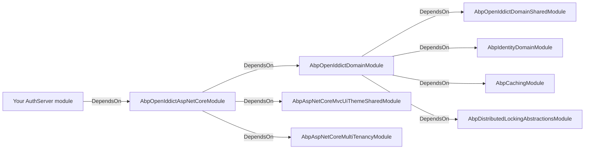
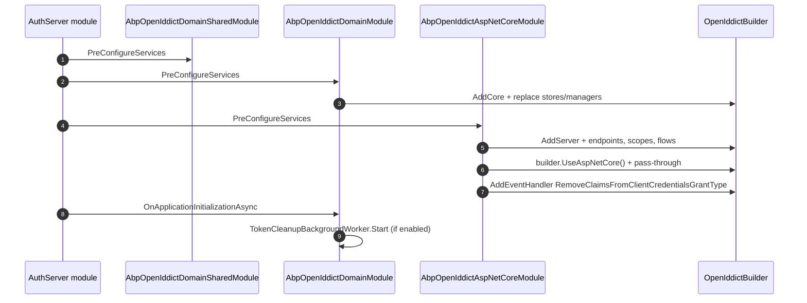

`Volo.Abp.OpenIddict.AspNetCore` is the ABP Framework's integration with
OpenIddict 4.x. It is the default authorization server module in modern
ABP application templates and replaces the older
[IdentityServer module](/auth/identityserver-module). The package wires
OpenIddict's server, validation, and ASP.NET Core integration into the
ABP module system, replaces OpenIddict's stores with ABP-backed ones,
optionally rewrites `AbpClaimTypes` to OpenIddict's native claim names,
and exposes the standard token endpoints under `/connect/*`. Source for
this page lives under
`modules/openiddict/src/Volo.Abp.OpenIddict.AspNetCore/` and
`modules/openiddict/src/Volo.Abp.OpenIddict.Domain/` in the
[abpframework/abp](https://github.com/abpframework/abp) repository.

## Package layout

| File | Type |
| --- | --- |
| `modules/openiddict/src/Volo.Abp.OpenIddict.AspNetCore/Volo/Abp/OpenIddict/AbpOpenIddictAspNetCoreModule.cs` | `AbpOpenIddictAspNetCoreModule` |
| `modules/openiddict/src/Volo.Abp.OpenIddict.AspNetCore/Volo/Abp/OpenIddict/AbpOpenIddictOptions.cs` | `AbpOpenIddictAspNetCoreOptions` |
| `modules/openiddict/src/Volo.Abp.OpenIddict.AspNetCore/Microsoft/AspNetCore/Builder/ApplicationBuilderAbpOpenIddictMiddlewareExtension.cs` | `UseAbpOpenIddictValidation` |
| `modules/openiddict/src/Volo.Abp.OpenIddict.AspNetCore/Microsoft/Extensions/DependencyInjection/OpenIddictServerBuilderExtensions.cs` | `AddProductionEncryptionAndSigningCertificate` |
| `modules/openiddict/src/Volo.Abp.OpenIddict.AspNetCore/Volo/Abp/OpenIddict/OpenIddictClaimsPrincipalContributor.cs` | `OpenIddictClaimsPrincipalContributor` |
| `modules/openiddict/src/Volo.Abp.OpenIddict.AspNetCore/Volo/Abp/OpenIddict/RemoveClaimsFromClientCredentialsGrantType.cs` | OpenIddict event handler |
| `modules/openiddict/src/Volo.Abp.OpenIddict.Domain/Volo/Abp/OpenIddict/AbpOpenIddictDomainModule.cs` | Core stores + managers |
| `modules/openiddict/src/Volo.Abp.OpenIddict.Domain.Shared/Volo/Abp/OpenIddict/AbpOpenIddictDomainSharedModule.cs` | Localization + validation |

## Module dependency graph



## `AbpOpenIddictAspNetCoreModule`: what it configures

The module's `ConfigureServices` does three things: it adds OpenIddict's
server, registers two `IAbpClaimsPrincipalContributor`-equivalent
handlers, and adds an MVC view path for the `Volo/Abp/OpenIddict/Views`
embedded views.

```csharp title="modules/openiddict/src/Volo.Abp.OpenIddict.AspNetCore/Volo/Abp/OpenIddict/AbpOpenIddictAspNetCoreModule.cs"
[DependsOn(
    typeof(AbpAspNetCoreMvcUiThemeSharedModule),
    typeof(AbpAspNetCoreMultiTenancyModule),
    typeof(AbpOpenIddictDomainModule)
)]
public class AbpOpenIddictAspNetCoreModule : AbpModule
{
    public override void ConfigureServices(ServiceConfigurationContext context)
    {
        AddOpenIddictServer(context.Services);

        Configure<AbpOpenIddictClaimsPrincipalOptions>(options =>
        {
            options.ClaimsPrincipalHandlers.Add<AbpDynamicClaimsOpenIddictClaimsPrincipalHandler>();
            options.ClaimsPrincipalHandlers.Add<AbpDefaultOpenIddictClaimsPrincipalHandler>();
        });

        Configure<RazorViewEngineOptions>(options =>
        {
            options.ViewLocationFormats.Add("/Volo/Abp/OpenIddict/Views/{1}/{0}.cshtml");
        });
    }
```

## `AbpOpenIddictAspNetCoreOptions`

This is the toggle object you `PreConfigure<...>` before the module runs.
There are only two switches but both have wide consequences.

```csharp title="modules/openiddict/src/Volo.Abp.OpenIddict.AspNetCore/Volo/Abp/OpenIddict/AbpOpenIddictOptions.cs"
public class AbpOpenIddictAspNetCoreOptions
{
    /// <summary>
    /// Updates <see cref="AbpClaimTypes"/> to be compatible with OpenIddict claims.
    /// Default: true.
    /// </summary>
    public bool UpdateAbpClaimTypes { get; set; } = true;

    /// <summary>
    /// Set false to suppress AddDeveloperSigningCredential() call on the OpenIddictBuilder.
    /// Default: true.
    /// </summary>
    public bool AddDevelopmentEncryptionAndSigningCertificate { get; set; } = true;
}
```

### `UpdateAbpClaimTypes`

When `true` (the default), the module rewrites the static
`AbpClaimTypes` properties to the OpenIddict-standard claim names. The
rewrite happens inside `AddOpenIddictServer`:

```csharp title="modules/openiddict/src/Volo.Abp.OpenIddict.AspNetCore/Volo/Abp/OpenIddict/AbpOpenIddictAspNetCoreModule.cs"
if (builderOptions.UpdateAbpClaimTypes)
{
    AbpClaimTypes.UserId = OpenIddictConstants.Claims.Subject;
    AbpClaimTypes.Role = OpenIddictConstants.Claims.Role;
    AbpClaimTypes.UserName = OpenIddictConstants.Claims.PreferredUsername;
    AbpClaimTypes.Name = OpenIddictConstants.Claims.GivenName;
    AbpClaimTypes.SurName = OpenIddictConstants.Claims.FamilyName;
    AbpClaimTypes.PhoneNumber = OpenIddictConstants.Claims.PhoneNumber;
    AbpClaimTypes.PhoneNumberVerified = OpenIddictConstants.Claims.PhoneNumberVerified;
    AbpClaimTypes.Email = OpenIddictConstants.Claims.Email;
    AbpClaimTypes.EmailVerified = OpenIddictConstants.Claims.EmailVerified;
    AbpClaimTypes.ClientId = OpenIddictConstants.Claims.ClientId;
}
```

| Property | Before (`AbpClaimTypes` default) | After (OpenIddict) |
| --- | --- | --- |
| `UserId` | `http://schemas.xmlsoap.org/.../nameidentifier` | `sub` |
| `UserName` | `http://schemas.xmlsoap.org/.../name` | `preferred_username` |
| `Name` | `name` | `given_name` |
| `SurName` | `family_name` | `family_name` |
| `Email` | `email` | `email` |
| `EmailVerified` | `email_verified` | `email_verified` |
| `Role` | `http://schemas.microsoft.com/.../role` | `role` |
| `ClientId` | `client_id` | `client_id` |

<Note>
  This is a process-wide static mutation. If the module is loaded into
  the auth server *and* into a downstream service in the same process
  (rare but possible in test hosts), the rewritten values apply to both.
</Note>

### `AddDevelopmentEncryptionAndSigningCertificate`

When `true`, the module installs OpenIddict's built-in
`AddDevelopmentEncryptionCertificate()` and
`AddDevelopmentSigningCertificate()`. Production deployments **must**
turn this off and use real certificates via
`OpenIddictServerBuilderExtensions.AddProductionEncryptionAndSigningCertificate`:

```csharp title="modules/openiddict/src/Volo.Abp.OpenIddict.AspNetCore/Microsoft/Extensions/DependencyInjection/OpenIddictServerBuilderExtensions.cs"
public static OpenIddictServerBuilder AddProductionEncryptionAndSigningCertificate(this OpenIddictServerBuilder builder, string fileName, string passPhrase)
{
    if (!File.Exists(fileName))
    {
        throw new FileNotFoundException($"Signing Certificate couldn't found: {fileName}");
    }

    var certificate = new X509Certificate2(fileName, passPhrase);
    builder.AddSigningCertificate(certificate);
    builder.AddEncryptionCertificate(certificate);
    return builder;
}
```

```csharp title="src/MyApp.AuthServer/MyAppAuthServerModule.cs"
PreConfigure<AbpOpenIddictAspNetCoreOptions>(options =>
{
    options.AddDevelopmentEncryptionAndSigningCertificate = false;
});

PreConfigure<OpenIddictServerBuilder>(builder =>
{
    builder.AddProductionEncryptionAndSigningCertificate(
        "openiddict.pfx",
        configuration["OpenIddict:CertificatePassword"]);
});
```

## Default endpoints

The module pins the OpenIddict server endpoints to a fixed set of paths so
ABP's MVC controllers and the client-side `oidc-client.js` libraries can
find them.

```csharp title="modules/openiddict/src/Volo.Abp.OpenIddict.AspNetCore/Volo/Abp/OpenIddict/AbpOpenIddictAspNetCoreModule.cs"
builder
    .SetAuthorizationEndpointUris("connect/authorize", "connect/authorize/callback")
    .SetDeviceEndpointUris("device")
    .SetIntrospectionEndpointUris("connect/introspect")
    .SetLogoutEndpointUris("connect/logout")
    .SetRevocationEndpointUris("connect/revocat")
    .SetTokenEndpointUris("connect/token")
    .SetUserinfoEndpointUris("connect/userinfo")
    .SetVerificationEndpointUris("connect/verify");
```

| Endpoint | Path |
| --- | --- |
| Authorization | `/connect/authorize`, `/connect/authorize/callback` |
| Device authorization | `/device` |
| Introspection | `/connect/introspect` |
| Logout (end session) | `/connect/logout` |
| Revocation | `/connect/revocat` |
| Token | `/connect/token` |
| Userinfo | `/connect/userinfo` |
| Verification | `/connect/verify` |

<Note>
  Discovery is served at the OpenIddict default
  `/.well-known/openid-configuration` &mdash; the module does not override
  `SetConfigurationEndpointUris` or `SetCryptographyEndpointUris`.
</Note>

## Default grant flows

The module enables every common grant flow:

```csharp title="modules/openiddict/src/Volo.Abp.OpenIddict.AspNetCore/Volo/Abp/OpenIddict/AbpOpenIddictAspNetCoreModule.cs"
builder
    .AllowAuthorizationCodeFlow()
    .AllowHybridFlow()
    .AllowImplicitFlow()
    .AllowPasswordFlow()
    .AllowClientCredentialsFlow()
    .AllowRefreshTokenFlow()
    .AllowDeviceCodeFlow()
    .AllowNoneFlow();
```

It also registers the standard OIDC scopes:

```csharp
builder.RegisterScopes(new[]
{
    OpenIddictConstants.Scopes.OpenId,
    OpenIddictConstants.Scopes.Email,
    OpenIddictConstants.Scopes.Profile,
    OpenIddictConstants.Scopes.Phone,
    OpenIddictConstants.Scopes.Roles,
    OpenIddictConstants.Scopes.Address,
    OpenIddictConstants.Scopes.OfflineAccess
});
```

| Grant flow | When to use |
| --- | --- |
| `authorization_code` (+ PKCE) | MVC, Blazor Server/WASM, SPA, mobile |
| `hybrid` | Legacy MVC apps that need front-channel tokens |
| `implicit` | Legacy SPA (avoid in new code) |
| `password` | Legacy desktop / first-party clients |
| `client_credentials` | Server-to-server, daemons, [`IdentityModel client`](/auth/identity-model-client) |
| `refresh_token` | Companion to `authorization_code` and `password` |
| `device_code` | TV / CLI / kiosk |
| `none` | OpenIddict-only; rarely useful in app code |

## ASP.NET Core integration and pass-through

The module enables endpoint pass-through for every interactive endpoint so
ABP's MVC controllers (under
`modules/openiddict/src/Volo.Abp.OpenIddict.Pro.Web` and the embedded
`Views`) can render the consent / verification / sign-in pages.

```csharp
builder.UseAspNetCore()
    .EnableAuthorizationEndpointPassthrough()
    .EnableTokenEndpointPassthrough()
    .EnableUserinfoEndpointPassthrough()
    .EnableLogoutEndpointPassthrough()
    .EnableVerificationEndpointPassthrough()
    .EnableStatusCodePagesIntegration();
```

The module also disables access-token encryption
(`builder.DisableAccessTokenEncryption()`). This means the tokens are
signed JWTs that downstream API hosts can validate with the JwtBearer
handler &mdash; not opaque reference tokens.

## Wildcard redirect URI support

If `AbpOpenIddictWildcardDomainOptions.EnableWildcardDomainSupport` is on,
the module replaces five of OpenIddict's built-in event handlers with ABP
variants that accept wildcard patterns:

```csharp
builder.RemoveEventHandler(OpenIddictServerHandlers.Authentication.ValidateClientRedirectUri.Descriptor);
builder.AddEventHandler(AbpValidateClientRedirectUri.Descriptor);

builder.RemoveEventHandler(OpenIddictServerHandlers.Authentication.ValidateRedirectUriParameter.Descriptor);
builder.AddEventHandler(AbpValidateRedirectUriParameter.Descriptor);

builder.RemoveEventHandler(OpenIddictServerHandlers.Session.ValidateClientPostLogoutRedirectUri.Descriptor);
builder.AddEventHandler(AbpValidateClientPostLogoutRedirectUri.Descriptor);

builder.RemoveEventHandler(OpenIddictServerHandlers.Session.ValidatePostLogoutRedirectUriParameter.Descriptor);
builder.AddEventHandler(AbpValidatePostLogoutRedirectUriParameter.Descriptor);

builder.RemoveEventHandler(OpenIddictServerHandlers.Session.ValidateAuthorizedParty.Descriptor);
builder.AddEventHandler(AbpValidateAuthorizedParty.Descriptor);
```

This is what lets multi-tenant apps register
`https://*.myapp.com/signin-oidc` as a redirect URI on a single client.

## The `client_credentials` claim cleanup handler

OpenIddict by default includes the calling principal's `sub` and
`preferred_username` claims in client-credentials tokens. ABP strips them
because there is no user behind the request:

```csharp title="modules/openiddict/src/Volo.Abp.OpenIddict.AspNetCore/Volo/Abp/OpenIddict/RemoveClaimsFromClientCredentialsGrantType.cs"
public class RemoveClaimsFromClientCredentialsGrantType : IOpenIddictServerHandler<OpenIddictServerEvents.ProcessSignInContext>
{
    public static OpenIddictServerHandlerDescriptor Descriptor { get; }
        = OpenIddictServerHandlerDescriptor.CreateBuilder<OpenIddictServerEvents.ProcessSignInContext>()
            .AddFilter<OpenIddictServerHandlerFilters.RequireAccessTokenGenerated>()
            .UseSingletonHandler<RemoveClaimsFromClientCredentialsGrantType>()
            .SetOrder(OpenIddictServerHandlers.PrepareAccessTokenPrincipal.Descriptor.Order - 1)
            .SetType(OpenIddictServerHandlerType.Custom)
            .Build();

    public virtual ValueTask HandleAsync(OpenIddictServerEvents.ProcessSignInContext context)
    {
        if (context.Request.IsClientCredentialsGrantType())
        {
            if (context.Principal != null)
            {
                context.Principal.RemoveClaims(OpenIddictConstants.Claims.Subject);
                context.Principal.RemoveClaims(OpenIddictConstants.Claims.PreferredUsername);
            }
        }

        return default;
    }
}
```

## The claims principal contributor

When a user signs in, ABP enriches the OpenIddict principal with claims
gathered from `IHttpContextAccessor` and `IdentityOptions`:

```csharp title="modules/openiddict/src/Volo.Abp.OpenIddict.AspNetCore/Volo/Abp/OpenIddict/OpenIddictClaimsPrincipalContributor.cs"
public class OpenIddictClaimsPrincipalContributor : IAbpClaimsPrincipalContributor, ITransientDependency
{
    public Task ContributeAsync(AbpClaimsPrincipalContributorContext context)
    {
        var identity = context.ClaimsPrincipal.Identities.FirstOrDefault();
        if (identity != null)
        {
            var options = context.ServiceProvider.GetRequiredService<IOptions<IdentityOptions>>().Value;
            var usernameClaim = identity.FindFirst(options.ClaimsIdentity.UserNameClaimType);
            if (usernameClaim != null)
            {
                identity.AddIfNotContains(new Claim(OpenIddictConstants.Claims.PreferredUsername, usernameClaim.Value));
                identity.AddIfNotContains(new Claim(JwtRegisteredClaimNames.UniqueName, usernameClaim.Value));
            }

            var httpContext = context.ServiceProvider.GetRequiredService<IHttpContextAccessor>().HttpContext;
            if (httpContext != null)
            {
                var clientId = httpContext.GetOpenIddictServerRequest()?.ClientId;
                if (clientId != null)
                {
                    identity.AddClaim(OpenIddictConstants.Claims.ClientId, clientId);
                }
            }
        }
        return Task.CompletedTask;
    }
}
```

The contributor copies the ASP.NET Identity username claim to
`preferred_username` and `unique_name`, and adds the
`OpenIddictConstants.Claims.ClientId` if the request comes through an
OpenIddict endpoint.

## The validation middleware

For the rare case where the auth server hosts API endpoints itself, the
package ships a small middleware that runs OpenIddict validation as a
fallback authentication step.

```csharp title="modules/openiddict/src/Volo.Abp.OpenIddict.AspNetCore/Microsoft/AspNetCore/Builder/ApplicationBuilderAbpOpenIddictMiddlewareExtension.cs"
public static IApplicationBuilder UseAbpOpenIddictValidation(this IApplicationBuilder app, string schema = OpenIddictValidationAspNetCoreDefaults.AuthenticationScheme)
{
    return app.Use(async (ctx, next) =>
    {
        if (ctx.User.Identity?.IsAuthenticated != true)
        {
            var result = await ctx.AuthenticateAsync(schema);
            if (result.Succeeded && result.Principal != null)
            {
                ctx.User = result.Principal;
            }
        }
        await next();
    });
}
```

## The Domain module: stores and managers

`AbpOpenIddictDomainModule` is where ABP replaces OpenIddict's stores and
managers with its own implementations backed by repositories.

```csharp title="modules/openiddict/src/Volo.Abp.OpenIddict.Domain/Volo/Abp/OpenIddict/AbpOpenIddictDomainModule.cs"
private void AddOpenIddictCore(IServiceCollection services)
{
    var openIddictBuilder = services.AddOpenIddict()
        .AddCore(builder =>
        {
            builder
                .SetDefaultApplicationEntity<OpenIddictApplicationModel>()
                .SetDefaultAuthorizationEntity<OpenIddictAuthorizationModel>()
                .SetDefaultScopeEntity<OpenIddictScopeModel>()
                .SetDefaultTokenEntity<OpenIddictTokenModel>();

            builder
                .AddApplicationStore<AbpOpenIddictApplicationStore>()
                .AddAuthorizationStore<AbpOpenIddictAuthorizationStore>()
                .AddScopeStore<AbpOpenIddictScopeStore>()
                .AddTokenStore<AbpOpenIddictTokenStore>();

            builder.ReplaceApplicationManager(typeof(AbpApplicationManager));
            builder.ReplaceAuthorizationManager(typeof(AbpAuthorizationManager));
            builder.ReplaceScopeManager(typeof(AbpScopeManager));
            builder.ReplaceTokenManager(typeof(AbpTokenManager));

            builder.Services.TryAddScoped(provider => (IAbpApplicationManager)provider.GetRequiredService<IOpenIddictApplicationManager>());

            services.ExecutePreConfiguredActions(builder);
        });

    services.ExecutePreConfiguredActions(openIddictBuilder);
}
```

| Entity | ABP entity | Store | Manager |
| --- | --- | --- | --- |
| Application (client) | `OpenIddictApplication` + `OpenIddictApplicationModel` | `AbpOpenIddictApplicationStore` | `AbpApplicationManager` |
| Authorization (consent) | `OpenIddictAuthorization` + `OpenIddictAuthorizationModel` | `AbpOpenIddictAuthorizationStore` | `AbpAuthorizationManager` |
| Scope | `OpenIddictScope` + `OpenIddictScopeModel` | `AbpOpenIddictScopeStore` | `AbpScopeManager` |
| Token | `OpenIddictToken` + `OpenIddictTokenModel` | `AbpOpenIddictTokenStore` | `AbpTokenManager` |

The module also wires the background `TokenCleanupBackgroundWorker` if
`TokenCleanupOptions.IsCleanupEnabled` is true, so expired authorizations
and tokens are periodically purged. EF Core and MongoDB store
implementations live in sibling packages of the
[OpenIddict module](/modules/openiddict).

## Pre / Post configure hooks

ABP's pattern for letting an application customize OpenIddict is to call
`PreConfigure<OpenIddictBuilder>` and `PreConfigure<OpenIddictServerBuilder>`
in your auth server module. The framework's
`services.ExecutePreConfiguredActions(builder)` at the end of
`AddOpenIddictServer` runs those delegates after the framework's own
configuration, so you can add custom event handlers, override scopes, or
disable flows.

```csharp title="src/MyApp.AuthServer/MyAppAuthServerModule.cs"
public override void PreConfigureServices(ServiceConfigurationContext context)
{
    PreConfigure<OpenIddictServerBuilder>(builder =>
    {
        builder.AllowCustomFlow("urn:ietf:params:oauth:grant-type:token-exchange");
        builder.RegisterScopes("custom-scope");
    });
}
```

For `PostConfigureServices`, the typical pattern is to disable transport
security in non-production environments:

```csharp
public override void PostConfigureServices(ServiceConfigurationContext context)
{
    if (HostEnvironment.IsDevelopment())
    {
        PreConfigure<OpenIddictServerBuilder>(builder =>
        {
            builder.UseAspNetCore().DisableTransportSecurityRequirement();
        });
    }
}
```

## Lifecycle diagram



## Common pitfalls

<Warning>
  **`UpdateAbpClaimTypes` is process-wide.** Any other ABP module loaded
  into the same process will see the OpenIddict-style claim names. If you
  load both this module and the IdentityServer module, the OpenIddict
  rewrites will overwrite IdentityServer's defaults.
</Warning>

<Warning>
  **Tokens are signed but not encrypted.**
  `builder.DisableAccessTokenEncryption()` is called unconditionally so
  downstream API hosts (which use `AddAbpJwtBearer`) can read the JWT. If
  you re-enable encryption, plain JwtBearer validation will fail; you
  must switch the API host to `AddOpenIddictValidation`.
</Warning>

<Note>
  **Development certificates rotate per build.** Tokens issued by one
  process instance will not validate against another instance unless you
  install a stable signing key via
  `AddProductionEncryptionAndSigningCertificate`.
</Note>

## Related pages

<CardGroup cols={2}>
  <Card title="JWT Bearer" icon="key" href="/auth/jwt-bearer">
    How API hosts validate the tokens this server emits.
  </Card>
  <Card title="OpenID Connect" icon="user-check" href="/auth/openid-connect">
    How MVC and Blazor Server hosts perform the authorization-code flow
    against this server.
  </Card>
  <Card title="IdentityModel client" icon="square-arrow-up-right" href="/auth/identity-model-client">
    The server-side client that calls `/connect/token` on this server.
  </Card>
  <Card title="OpenIddict module" icon="lock" href="/modules/openiddict">
    Application-level CRUD, management UI, EF Core / MongoDB stores.
  </Card>
</CardGroup>
