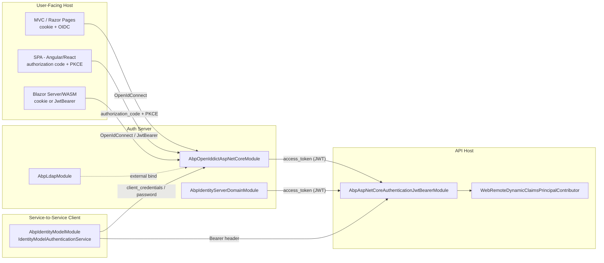
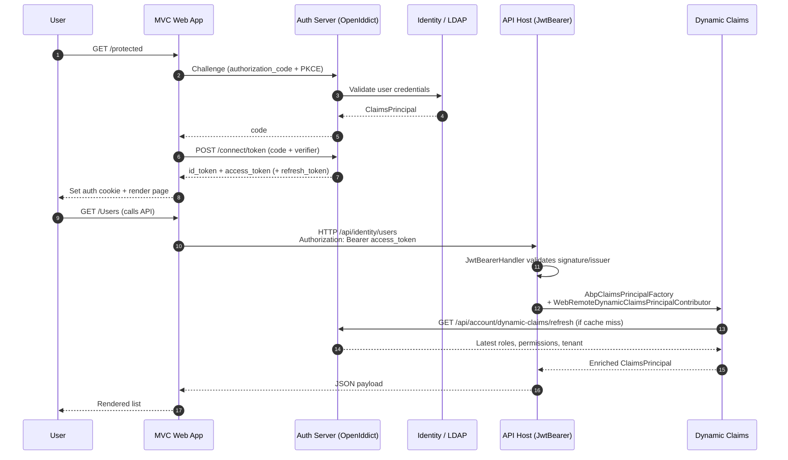

ABP Framework does not ship a single monolithic authentication package.
Instead it provides a small family of ASP.NET Core integration modules and
two server-side identity provider integrations (OpenIddict and the legacy
IdentityServer4 module) that compose together to cover MVC, SPA, Blazor,
mobile, and service-to-service scenarios. This page is the index for that
stack: the packages, what each one wraps, and which combination an
application picks for a given front-end. Source for everything described
here lives under `framework/src/Volo.Abp.AspNetCore.Authentication.*`,
`framework/src/Volo.Abp.IdentityModel`, `framework/src/Volo.Abp.Ldap*`, and
the `modules/openiddict` / `modules/identityserver` trees in the
[abpframework/abp](https://github.com/abpframework/abp) repository.

## Authentication packages at a glance

The framework's authentication packages are deliberately thin wrappers over
the stock `Microsoft.AspNetCore.Authentication.*` handlers. Each ABP module
adds DI registrations, the `AbpClaimTypes` mapping, multi-tenancy hooks,
and the dynamic-claims plumbing &mdash; but the on-the-wire protocol is
still the upstream Microsoft handler.

| Package | Module class | Wraps | Documented at |
| --- | --- | --- | --- |
| `Volo.Abp.AspNetCore.Authentication.JwtBearer` | `AbpAspNetCoreAuthenticationJwtBearerModule` | `Microsoft.AspNetCore.Authentication.JwtBearer` | [JWT Bearer](/auth/jwt-bearer) |
| `Volo.Abp.AspNetCore.Authentication.OAuth` | `AbpAspNetCoreAuthenticationOAuthModule` | `Microsoft.AspNetCore.Authentication.OAuth` | [OAuth](/auth/oauth) |
| `Volo.Abp.AspNetCore.Authentication.OpenIdConnect` | `AbpAspNetCoreAuthenticationOpenIdConnectModule` | `Microsoft.AspNetCore.Authentication.OpenIdConnect` | [OpenID Connect](/auth/openid-connect) |
| `Volo.Abp.IdentityModel` | `AbpIdentityModelModule` | `IdentityModel` discovery + token client | [IdentityModel client](/auth/identity-model-client) |
| `Volo.Abp.OpenIddict.AspNetCore` | `AbpOpenIddictAspNetCoreModule` | `OpenIddict.Server.AspNetCore` | [OpenIddict server](/auth/openiddict-server) |
| `Volo.Abp.IdentityServer.Domain` | `AbpIdentityServerDomainModule` | `IdentityServer4` (legacy) | [IdentityServer module](/auth/identityserver-module) |
| `Volo.Abp.Ldap` / `Volo.Abp.Ldap.Abstractions` | `AbpLdapModule`, `AbpLdapAbstractionsModule` | `LdapForNet` connection + bind | [LDAP](/auth/ldap) |

<Note>
  ABP's authentication packages only handle authentication &mdash; producing
  a `ClaimsPrincipal`. Authorization (permissions, policies, features,
  permission grants) is handled by separate modules described under
  [/authz](/authz).
</Note>

## How the pieces fit together

A typical ABP solution has two kinds of hosts:

- **Auth servers** &mdash; an `AuthServer` project that runs OpenIddict (new
  templates) or IdentityServer4 (legacy templates). It owns the user
  database via the Identity module and issues access tokens.
- **API hosts and clients** &mdash; the `HttpApi.Host`, MVC web app, Blazor
  Server/WASM app, or Angular SPA. They validate tokens with
  `AbpAspNetCoreAuthenticationJwtBearerModule` or
  `AbpAspNetCoreAuthenticationOpenIdConnectModule`, and use
  `IIdentityModelAuthenticationService` for any machine-to-machine call.



## Picking a flow

The ABP application templates ship preset combinations for each UI type. The
table below restates those defaults so you can pick the correct modules
when you assemble your own host.

| Front end | Auth server flow | API host flow | Modules to install |
| --- | --- | --- | --- |
| **MVC / Razor Pages** | Authorization Code + PKCE via cookie | Cookie or JwtBearer for API endpoints | `AbpAspNetCoreAuthenticationOpenIdConnectModule` on the web app, `AbpAspNetCoreAuthenticationJwtBearerModule` on the API |
| **Blazor Server** | Authorization Code + PKCE via cookie | Cookie inherited from server, `IdentityModel` for back-channel calls | `AbpAspNetCoreAuthenticationOpenIdConnectModule`, `AbpIdentityModelModule` |
| **Blazor WebAssembly** | Authorization Code + PKCE in browser (`oidc-client`) | JwtBearer | `AbpAspNetCoreAuthenticationJwtBearerModule` on the API |
| **Angular / React SPA** | Authorization Code + PKCE in browser | JwtBearer | `AbpAspNetCoreAuthenticationJwtBearerModule` on the API |
| **MAUI / mobile** | Authorization Code + PKCE (native browser) | JwtBearer | `AbpAspNetCoreAuthenticationJwtBearerModule` |
| **Daemon / worker** | Client Credentials | n/a | `AbpIdentityModelModule` |
| **Legacy desktop** | Resource Owner Password (discouraged) | JwtBearer | `AbpIdentityModelModule` (`GrantType = password`) |

<Warning>
  Resource Owner Password grant is still supported by both OpenIddict and
  `IdentityModelAuthenticationService` (see
  `OidcConstants.GrantTypes.Password` usage in
  `framework/src/Volo.Abp.IdentityModel/Volo/Abp/IdentityModel/IdentityModelAuthenticationService.cs`),
  but you should only use it for legacy clients that cannot drive a
  browser-based flow. Authorization Code + PKCE is the recommended flow for
  every interactive front end.
</Warning>

## Token issuance and validation flow

The diagram below traces a single request from sign-in to a downstream API
call when the auth server is OpenIddict and the API host validates JWTs.



The three takeaways from this diagram are:

1. **The auth server is always the source of truth for credentials.** Both
   OpenIddict and IdentityServer use the ABP Identity module's
   `SignInManager` for password validation, and may consult LDAP as a
   secondary provider through
   `framework/src/Volo.Abp.Ldap/Volo/Abp/Ldap/LdapManager.cs`.
2. **The API host never sees the user's password.** It only validates the
   signed access token using
   `framework/src/Volo.Abp.AspNetCore.Authentication.JwtBearer/Microsoft/Extensions/DependencyInjection/AbpJwtBearerExtensions.cs::AddAbpJwtBearer`.
3. **Claims can be refreshed without re-authentication.** When the
   `WebRemoteDynamicClaimsPrincipalContributorOptions.IsEnabled` flag is on,
   ABP's claims principal factory calls back to the auth server to pull
   the latest roles and permissions for the user. This is wired up in
   `framework/src/Volo.Abp.AspNetCore.Authentication.JwtBearer/Volo/Abp/AspNetCore/Authentication/JwtBearer/AbpAspNetCoreAuthenticationJwtBearerModule.cs`.

## The dynamic claims hook

Every ABP authentication module touches the same options object,
`AbpClaimsPrincipalFactoryOptions`. The JwtBearer extension stitches the
auth server's `Authority` onto the `RemoteRefreshUrl` so that the dynamic
claims contributor can call back without extra configuration.

```csharp title="framework/src/Volo.Abp.AspNetCore.Authentication.JwtBearer/Microsoft/Extensions/DependencyInjection/AbpJwtBearerExtensions.cs"
public static AuthenticationBuilder AddAbpJwtBearer(this AuthenticationBuilder builder, string authenticationScheme, string displayName, Action<JwtBearerOptions> configureOptions)
{
    builder.Services.Configure<AbpClaimsPrincipalFactoryOptions>(options =>
    {
        var jwtBearerOption = new JwtBearerOptions();
        configureOptions?.Invoke(jwtBearerOption);
        if (!jwtBearerOption.Authority.IsNullOrEmpty())
        {
            options.RemoteRefreshUrl = jwtBearerOption.Authority.RemovePostFix("/") + options.RemoteRefreshUrl;
        }
    });

    return builder.AddJwtBearer(authenticationScheme, displayName, options =>
    {
        configureOptions?.Invoke(options);
    });
}
```

The OpenID Connect extension does the same thing plus wires the
`OnTokenValidated` event to `IOpenIdLocalUserCreationClient`, which lets a
remote web app create a shadow user inside the API host's Identity database.
See [OpenID Connect](/auth/openid-connect) for the full event chain.

## Where each protocol message lands in code

The next table is a quick "where is the code" cheat-sheet for the four most
common protocol messages.

| Protocol step | File |
| --- | --- |
| Authorization endpoint configuration | `modules/openiddict/src/Volo.Abp.OpenIddict.AspNetCore/Volo/Abp/OpenIddict/AbpOpenIddictAspNetCoreModule.cs` |
| Token endpoint client credentials request | `framework/src/Volo.Abp.IdentityModel/Volo/Abp/IdentityModel/IdentityModelAuthenticationService.cs::CreateClientCredentialsTokenRequestAsync` |
| Token endpoint password request | `framework/src/Volo.Abp.IdentityModel/Volo/Abp/IdentityModel/IdentityModelAuthenticationService.cs::CreatePasswordTokenRequestAsync` |
| Bearer token validation in API host | `framework/src/Volo.Abp.AspNetCore.Authentication.JwtBearer/Microsoft/Extensions/DependencyInjection/AbpJwtBearerExtensions.cs::AddAbpJwtBearer` |
| Cookie + OIDC sign-in in MVC | `framework/src/Volo.Abp.AspNetCore.Authentication.OpenIdConnect/Microsoft/Extensions/DependencyInjection/AbpOpenIdConnectExtensions.cs::AddAbpOpenIdConnect` |
| Local shadow user creation | `framework/src/Volo.Abp.AspNetCore.Authentication.OpenIdConnect/Volo/Abp/AspNetCore/Authentication/OpenIdConnect/OpenIdLocalUserCreationClient.cs` |
| Dynamic claims refresh | `framework/src/Volo.Abp.AspNetCore.Authentication.JwtBearer/Volo/Abp/AspNetCore/Authentication/JwtBearer/DynamicClaims/WebRemoteDynamicClaimsPrincipalContributor.cs` |
| LDAP authentication | `framework/src/Volo.Abp.Ldap/Volo/Abp/Ldap/LdapManager.cs::AuthenticateAsync` |

## Choosing OpenIddict vs IdentityServer4

ABP previously shipped templates that used IdentityServer4. Because
IdentityServer4 reached end of free support, ABP introduced an OpenIddict
implementation that is now the default. Both still live in the repository,
but new projects should pick OpenIddict.

| Concern | OpenIddict (`modules/openiddict`) | IdentityServer4 (`modules/identityserver`) |
| --- | --- | --- |
| License | Apache 2.0 (free) | Dual: free for OSS, paid Duende license for commercial use |
| Status in ABP | Default for new templates | Legacy; still maintained for existing solutions |
| Token format | JWT, opaque, reference | JWT, reference |
| Entity model | `OpenIddictApplication`, `OpenIddictAuthorization`, `OpenIddictScope`, `OpenIddictToken` (`modules/openiddict/src/Volo.Abp.OpenIddict.Domain/Volo/Abp/OpenIddict/Applications`) | `Client`, `ApiResource`, `ApiScope`, `IdentityResource`, `PersistedGrant` (`modules/identityserver/src/Volo.Abp.IdentityServer.Domain`) |
| Dynamic claims | `OpenIddictClaimsPrincipalContributor`, `AbpDynamicClaimsOpenIddictClaimsPrincipalHandler` | `WebRemoteDynamicClaimsPrincipalContributor` via JwtBearer |
| Server module | `AbpOpenIddictAspNetCoreModule` | `AbpIdentityServerDomainModule` |
| Migration | Use the OpenIddict templates and migrate `Client` → `OpenIddictApplication` | Continue using existing module |

<CardGroup cols={2}>
  <Card title="OpenIddict server details" icon="key" href="/auth/openiddict-server">
    The recommended ABP authorization server: AbpOpenIddictAspNetCoreModule
    plus AbpOpenIddictDomainModule.
  </Card>
  <Card title="IdentityServer module" icon="shield-halved" href="/auth/identityserver-module">
    Legacy IdentityServer4 integration: Domain, EF Core, MongoDB packages
    and how to read the existing modules.
  </Card>
</CardGroup>

## What is *not* part of these packages

Several adjacent concerns are intentionally outside the authentication
packages and have their own pages:

- **`ClaimsPrincipal` extensions and `AbpClaimTypes`** &mdash; live in
  `framework/src/Volo.Abp.Security/Volo/Abp/Security/Claims`. The OpenIddict
  AspNetCore module rewrites `AbpClaimTypes` when
  `AbpOpenIddictAspNetCoreOptions.UpdateAbpClaimTypes` is `true`. See
  [JWT Bearer](/auth/jwt-bearer) for the actual values.
- **Permissions / authorization handlers** &mdash; documented under
  [/authz](/authz).
- **HTTP API proxies and remote service clients** &mdash; documented under
  [/web](/web) and the HTTP client packages. They use
  `IIdentityModelAuthenticationService` from this section to attach access
  tokens.
- **Auto API controllers and dynamic client proxies** &mdash; consumers of
  the access token, not producers; see [/web/auto-api-controllers](/web/auto-api-controllers).

## Reading order for this section

If you are coming from a stock ASP.NET Core background and want to learn the
ABP additions, read the pages in this order:

<Steps>
  <Step title="Start with the JWT Bearer wrapper">
    [JWT Bearer](/auth/jwt-bearer) shows the minimal addition: ABP only adds
    a dynamic-claims hook and the auth-server URL bridging.
  </Step>
  <Step title="Then OAuth and OpenID Connect">
    [OAuth](/auth/oauth) explains how ABP normalizes claim mapping for any
    OAuth handler. [OpenID Connect](/auth/openid-connect) layers the OIDC
    middleware and the optional local-user shadow creation.
  </Step>
  <Step title="Move to the identity-model client">
    [IdentityModel client](/auth/identity-model-client) is how server-side
    code (background jobs, MVC controllers proxying to an API, integration
    tests) obtains access tokens.
  </Step>
  <Step title="Finish with the server-side integrations">
    [OpenIddict server](/auth/openiddict-server) and
    [IdentityServer module](/auth/identityserver-module) are the
    "token producer" modules. [LDAP](/auth/ldap) covers external directory
    authentication that you can plug into either server.
  </Step>
</Steps>

## Related sections

<CardGroup cols={2}>
  <Card title="Authorization" icon="lock" href="/authz">
    Permission management, policy providers, feature checking. The natural
    follow-on once authentication is in place.
  </Card>
  <Card title="Web / ASP.NET Core integration" icon="globe" href="/web">
    Where the `AbpAspNetCoreModule` middleware pipeline (auditing,
    exception handling, unit of work, request localization) plugs in.
  </Card>
  <Card title="OpenIddict module" icon="key" href="/modules/openiddict">
    Application-level features: management UI, application/scope CRUD,
    OpenIddict EF Core and MongoDB stores.
  </Card>
  <Card title="IdentityServer module" icon="id-card" href="/modules/identityserver">
    Application-level features for IdentityServer4 hosts: clients, API
    resources, identity resources management.
  </Card>
</CardGroup>
