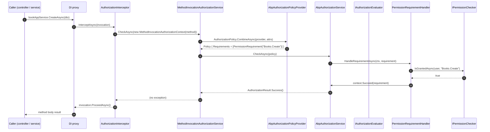

Every authorization check in an ABP application — whether it comes from `[Authorize]` on a controller, an `IAuthorizationService.AuthorizeAsync(...)` call, or a dynamic-proxy interception of an application service — ultimately lands on an `IAuthorizationHandler`. This page documents the four types that connect ASP.NET Core's `IAuthorizationService` to ABP's permission system: `AbpAuthorizationService`, `MethodInvocationAuthorizationService`, `AuthorizationInterceptor`, and the requirement handlers `PermissionRequirementHandler` / `PermissionsRequirementHandler`. It also covers `AbpPermissionOptions` and the always-allow replacements used by tests and data-migration hosts.

For the higher-level view of how a check propagates from request to grant, start with [Authorization stack overview](/authz/overview).

## The pieces

| Type | File | Lifetime | Replaces |
| --- | --- | --- | --- |
| `AbpAuthorizationService` | `framework/src/Volo.Abp.Authorization/Volo/Abp/Authorization/AbpAuthorizationService.cs` | Transient (via `ITransientDependency`) | `DefaultAuthorizationService` |
| `MethodInvocationAuthorizationService` | `framework/src/Volo.Abp.Authorization/Volo/Abp/Authorization/MethodInvocationAuthorizationService.cs` | Transient | — |
| `AuthorizationInterceptor` | `framework/src/Volo.Abp.Authorization/Volo/Abp/Authorization/AuthorizationInterceptor.cs` | Transient | — |
| `AuthorizationInterceptorRegistrar` | `framework/src/Volo.Abp.Authorization/Volo/Abp/Authorization/AuthorizationInterceptorRegistrar.cs` | Static helper | — |
| `PermissionRequirementHandler` | `framework/src/Volo.Abp.Authorization.Abstractions/Volo/Abp/Authorization/PermissionRequirementHandler.cs` | Singleton | — |
| `PermissionsRequirementHandler` | `framework/src/Volo.Abp.Authorization.Abstractions/Volo/Abp/Authorization/PermissionsRequirementHandler.cs` | Singleton | — |
| `AlwaysAllowAuthorizationService` | `framework/src/Volo.Abp.Authorization.Abstractions/Volo/Abp/Authorization/AlwaysAllowAuthorizationService.cs` | Singleton (opt-in) | `IAbpAuthorizationService` |
| `AlwaysAllowMethodInvocationAuthorizationService` | `framework/src/Volo.Abp.Authorization.Abstractions/Volo/Abp/Authorization/AlwaysAllowMethodInvocationAuthorizationService.cs` | Singleton (opt-in) | `IMethodInvocationAuthorizationService` |

The module that wires them is `AbpAuthorizationModule`:

```csharp framework/src/Volo.Abp.Authorization/Volo/Abp/Authorization/AbpAuthorizationModule.cs
public override void ConfigureServices(ServiceConfigurationContext context)
{
    context.Services.AddAuthorizationCore();

    context.Services.AddSingleton<IAuthorizationHandler, PermissionRequirementHandler>();
    context.Services.AddSingleton<IAuthorizationHandler, PermissionsRequirementHandler>();

    context.Services.TryAddTransient<DefaultAuthorizationPolicyProvider>();

    Configure<AbpPermissionOptions>(options =>
    {
        options.ValueProviders.Add<UserPermissionValueProvider>();
        options.ValueProviders.Add<RolePermissionValueProvider>();
        options.ValueProviders.Add<ClientPermissionValueProvider>();
    });
    // …
}
```

## `IAbpAuthorizationService`

`IAbpAuthorizationService` extends `IAuthorizationService` with two things ABP needs everywhere: the current `ClaimsPrincipal` and an `IServiceProvider`.

```csharp framework/src/Volo.Abp.Authorization.Abstractions/Volo/Abp/Authorization/IAbpAuthorizationService.cs
public interface IAbpAuthorizationService : IAuthorizationService, IServiceProviderAccessor
{
    ClaimsPrincipal CurrentPrincipal { get; }
}
```

The implementation simply wraps `DefaultAuthorizationService` and resolves the principal from `ICurrentPrincipalAccessor`:

```csharp framework/src/Volo.Abp.Authorization/Volo/Abp/Authorization/AbpAuthorizationService.cs
[Dependency(ReplaceServices = true)]
public class AbpAuthorizationService : DefaultAuthorizationService,
                                       IAbpAuthorizationService,
                                       ITransientDependency
{
    public IServiceProvider ServiceProvider { get; }
    public ClaimsPrincipal CurrentPrincipal => _currentPrincipalAccessor.Principal;

    private readonly ICurrentPrincipalAccessor _currentPrincipalAccessor;
    // …ctor copies dependencies into the base class…
}
```

Why is this important? Because of the extension method bouquet in `Microsoft/AspNetCore/Authorization/AbpAuthorizationServiceExtensions.cs`. Those overloads call into `CurrentPrincipal` so that callers don't have to thread a `ClaimsPrincipal` through application code:

```csharp framework/src/Volo.Abp.Authorization/Microsoft/AspNetCore/Authorization/AbpAuthorizationServiceExtensions.cs
public static async Task<AuthorizationResult> AuthorizeAsync(
    this IAuthorizationService authorizationService, string policyName)
{
    return await AuthorizeAsync(authorizationService, null, policyName);
}

public static async Task<bool> IsGrantedAsync(
    this IAuthorizationService authorizationService, string policyName)
{
    return (await authorizationService.AuthorizeAsync(policyName)).Succeeded;
}

public static async Task CheckAsync(
    this IAuthorizationService authorizationService, string policyName)
{
    if (!await authorizationService.IsGrantedAsync(policyName))
    {
        throw new AbpAuthorizationException(
                code: AbpAuthorizationErrorCodes.GivenPolicyHasNotGrantedWithPolicyName)
            .WithData("PolicyName", policyName);
    }
}
```

`AsAbpAuthorizationService()` (private) does the safety cast and throws if a custom replacement broke the contract.

### Error codes

The `AbpAuthorizationException`s thrown by `CheckAsync(...)` are localized via codes declared once and re-used everywhere:

```csharp framework/src/Volo.Abp.Authorization/Volo/Abp/Authorization/AbpAuthorizationErrorCodes.cs
public const string GivenPolicyHasNotGranted                       = "Volo.Authorization:010001";
public const string GivenPolicyHasNotGrantedWithPolicyName         = "Volo.Authorization:010002";
public const string GivenPolicyHasNotGrantedForGivenResource       = "Volo.Authorization:010003";
public const string GivenRequirementHasNotGrantedForGivenResource  = "Volo.Authorization:010004";
public const string GivenRequirementsHasNotGrantedForGivenResource = "Volo.Authorization:010005";
```

Resource keys are mapped through `AbpExceptionLocalizationOptions.MapCodeNamespace("Volo.Authorization", typeof(AbpAuthorizationResource))` (see `AbpAuthorizationModule`).

## The `AuthorizationInterceptor`

Application services in ABP are exposed as DI proxies. When such a service is invoked **anywhere** — including from another service, a domain service, or a hosted job — the proxy fires `AuthorizationInterceptor.InterceptAsync` before the method body runs:

```csharp framework/src/Volo.Abp.Authorization/Volo/Abp/Authorization/AuthorizationInterceptor.cs
public class AuthorizationInterceptor : AbpInterceptor, ITransientDependency
{
    private readonly IMethodInvocationAuthorizationService _methodInvocationAuthorizationService;

    public AuthorizationInterceptor(IMethodInvocationAuthorizationService svc)
        => _methodInvocationAuthorizationService = svc;

    public override async Task InterceptAsync(IAbpMethodInvocation invocation)
    {
        await AuthorizeAsync(invocation);
        await invocation.ProceedAsync();
    }

    protected virtual async Task AuthorizeAsync(IAbpMethodInvocation invocation)
    {
        await _methodInvocationAuthorizationService.CheckAsync(
            new MethodInvocationAuthorizationContext(invocation.Method));
    }
}
```

### Who gets intercepted?

`AuthorizationInterceptorRegistrar` is invoked from `PreConfigureServices` via `services.OnRegistered(AuthorizationInterceptorRegistrar.RegisterIfNeeded)`. It selects types based on the presence of `AuthorizeAttribute` somewhere on the type or any method, and skips types in the dynamic-proxy ignore list:

```csharp framework/src/Volo.Abp.Authorization/Volo/Abp/Authorization/AuthorizationInterceptorRegistrar.cs
public static void RegisterIfNeeded(IOnServiceRegistredContext context)
{
    if (ShouldIntercept(context.ImplementationType))
    {
        context.Interceptors.TryAdd<AuthorizationInterceptor>();
    }
}

private static bool ShouldIntercept(Type type)
{
    return !DynamicProxyIgnoreTypes.Contains(type) &&
           (type.IsDefined(typeof(AuthorizeAttribute), true) ||
            AnyMethodHasAuthorizeAttribute(type));
}
```

The takeaway: if a class — or any of its methods — carries `[Authorize]`, ABP attaches the interceptor at DI registration time. There is no MVC requirement: `[Authorize]` on a domain service or background worker still works.

### Gathering attributes

`MethodInvocationAuthorizationService` figures out which policies to enforce for a given call. It honours `[AllowAnonymous]`, then unions method-level and class-level `IAuthorizeData` attributes:

```csharp framework/src/Volo.Abp.Authorization/Volo/Abp/Authorization/MethodInvocationAuthorizationService.cs
public async Task CheckAsync(MethodInvocationAuthorizationContext context)
{
    if (AllowAnonymous(context)) { return; }

    var authorizationPolicy = await AuthorizationPolicy.CombineAsync(
        _abpAuthorizationPolicyProvider,
        GetAuthorizationDataAttributes(context.Method));

    if (authorizationPolicy == null) { return; }

    await _abpAuthorizationService.CheckAsync(authorizationPolicy);
}

protected virtual bool AllowAnonymous(MethodInvocationAuthorizationContext context)
    => context.Method.GetCustomAttributes(true).OfType<IAllowAnonymous>().Any();

protected virtual IEnumerable<IAuthorizeData> GetAuthorizationDataAttributes(MethodInfo methodInfo)
{
    var attributes = methodInfo.GetCustomAttributes(true).OfType<IAuthorizeData>();

    if (methodInfo.IsPublic && methodInfo.DeclaringType != null)
    {
        attributes = attributes.Union(
            methodInfo.DeclaringType.GetCustomAttributes(true).OfType<IAuthorizeData>());
    }
    return attributes;
}
```

Note that `AuthorizationPolicy.CombineAsync` is what funnels the call back into `AbpAuthorizationPolicyProvider`, which translates permission names into `PermissionRequirement`s. See [Policies and attributes](/authz/policies-and-attributes) for the wider story of how this looks at the call-site.

## Built-in `IAuthorizationHandler` implementations

ABP registers two handlers as singletons. They are intentionally thin — they just unwrap the requirement and call `IPermissionChecker`.

### `PermissionRequirementHandler`

`PermissionRequirement` carries a single permission name:

```csharp framework/src/Volo.Abp.Authorization.Abstractions/Volo/Abp/Authorization/PermissionRequirement.cs
public class PermissionRequirement : IAuthorizationRequirement
{
    public string PermissionName { get; }

    public PermissionRequirement([NotNull] string permissionName)
    {
        Check.NotNull(permissionName, nameof(permissionName));
        PermissionName = permissionName;
    }

    public override string ToString() => $"PermissionRequirement: {PermissionName}";
}
```

The handler delegates:

```csharp framework/src/Volo.Abp.Authorization.Abstractions/Volo/Abp/Authorization/PermissionRequirementHandler.cs
public class PermissionRequirementHandler : AuthorizationHandler<PermissionRequirement>
{
    private readonly IPermissionChecker _permissionChecker;

    public PermissionRequirementHandler(IPermissionChecker permissionChecker)
        => _permissionChecker = permissionChecker;

    protected override async Task HandleRequirementAsync(
        AuthorizationHandlerContext context, PermissionRequirement requirement)
    {
        if (await _permissionChecker.IsGrantedAsync(context.User, requirement.PermissionName))
        {
            context.Succeed(requirement);
        }
    }
}
```

If `IsGrantedAsync` returns `false`, the handler does **not** mark a failure — it simply leaves the requirement unsatisfied. ASP.NET Core's evaluator then returns `Succeeded = false` if no other handler succeeded. This behaviour matches the rest of the policy framework, so existing fallbacks (such as challenge schemes) still kick in.

### `PermissionsRequirementHandler`

For "any of" / "all of" semantics, ABP ships `PermissionsRequirement`:

```csharp framework/src/Volo.Abp.Authorization.Abstractions/Volo/Abp/Authorization/PermissionsRequirement.cs
public class PermissionsRequirement : IAuthorizationRequirement
{
    public string[] PermissionNames { get; }
    public bool     RequiresAll    { get; }

    public PermissionsRequirement([NotNull] string[] permissionNames, bool requiresAll)
    {
        Check.NotNull(permissionNames, nameof(permissionNames));
        PermissionNames = permissionNames;
        RequiresAll     = requiresAll;
    }
}
```

The handler issues a single batch call and inspects the `MultiplePermissionGrantResult`:

```csharp framework/src/Volo.Abp.Authorization.Abstractions/Volo/Abp/Authorization/PermissionsRequirementHandler.cs
protected override async Task HandleRequirementAsync(
    AuthorizationHandlerContext context, PermissionsRequirement requirement)
{
    var multi = await _permissionChecker.IsGrantedAsync(context.User, requirement.PermissionNames);

    if (requirement.RequiresAll
            ? multi.AllGranted
            : multi.Result.Any(x => x.Value == PermissionGrantResult.Granted))
    {
        context.Succeed(requirement);
    }
}
```

The batch path matters: `PermissionChecker.IsGrantedAsync(string[])` calls each `IPermissionValueProvider.CheckAsync(PermissionValuesCheckContext)` only once for the whole set, instead of one round trip per permission. See [Permission system](/authz/permission-system) for how providers honour that contract.

## `AbpPermissionOptions`

The orchestration knob is `AbpPermissionOptions`. It is configured by every module that wants to add a definition provider or a value provider:

```csharp framework/src/Volo.Abp.Authorization.Abstractions/Volo/Abp/Authorization/Permissions/AbpPermissionOptions.cs
public class AbpPermissionOptions
{
    public ITypeList<IPermissionDefinitionProvider> DefinitionProviders { get; }
    public ITypeList<IPermissionValueProvider>      ValueProviders      { get; }
    public HashSet<string>                          DeletedPermissions  { get; }
    public HashSet<string>                          DeletedPermissionGroups { get; }

    public AbpPermissionOptions()
    {
        DefinitionProviders = new TypeList<IPermissionDefinitionProvider>();
        ValueProviders      = new TypeList<IPermissionValueProvider>();
        DeletedPermissions       = new HashSet<string>();
        DeletedPermissionGroups  = new HashSet<string>();
    }
}
```

| Property | Used by |
| --- | --- |
| `DefinitionProviders` | `StaticPermissionDefinitionStore.CreatePermissionGroupDefinitions` to drive `PreDefine` → `Define` → `PostDefine`. |
| `ValueProviders` | `PermissionValueProviderManager` (lazy resolves via `IServiceProvider.GetRequiredService`). |
| `DeletedPermissions` / `DeletedPermissionGroups` | Used by the [Permission Management module](/authz/permission-management-module) when reconciling renames in `StaticPermissionSaver`. |

The auto-collection in `AbpAuthorizationModule.PreConfigureServices` means that you typically **never write `options.DefinitionProviders.Add<...>()` by hand** — registering a class that inherits from `PermissionDefinitionProvider` is enough.

## How a check propagates

The diagram below traces a `[Authorize("Books.Create")]` call into the requirement handler.



If the result had been `Succeeded = false`, the `CheckAsync` extension would have thrown `AbpAuthorizationException(code: Volo.Authorization:010001)` and the body would never have run.

## Always-allow replacements

For tests and the data-migration host, ABP ships replacements that short-circuit every check:

```csharp framework/src/Volo.Abp.Authorization/Microsoft/Extensions/DependencyInjection/AbpAuthorizationServiceCollectionExtensions.cs
public static IServiceCollection AddAlwaysAllowAuthorization(this IServiceCollection services)
{
    services.Replace(ServiceDescriptor.Singleton<IAuthorizationService, AlwaysAllowAuthorizationService>());
    services.Replace(ServiceDescriptor.Singleton<IAbpAuthorizationService, AlwaysAllowAuthorizationService>());
    services.Replace(ServiceDescriptor.Singleton<IMethodInvocationAuthorizationService, AlwaysAllowMethodInvocationAuthorizationService>());
    return services.Replace(ServiceDescriptor.Singleton<IPermissionChecker, AlwaysAllowPermissionChecker>());
}
```

```csharp framework/src/Volo.Abp.Authorization.Abstractions/Volo/Abp/Authorization/AlwaysAllowAuthorizationService.cs
public class AlwaysAllowAuthorizationService : IAbpAuthorizationService
{
    public Task<AuthorizationResult> AuthorizeAsync(
        ClaimsPrincipal user, object? resource, IEnumerable<IAuthorizationRequirement> requirements)
        => Task.FromResult(AuthorizationResult.Success());

    public Task<AuthorizationResult> AuthorizeAsync(
        ClaimsPrincipal user, object? resource, string policyName)
        => Task.FromResult(AuthorizationResult.Success());
}
```

<Warning>
`AddAlwaysAllowAuthorization()` is an integration-test convenience. Do not call it from a production host — it disables the entire stack including tenant boundaries and prohibitions.
</Warning>

## `IAbpAuthorizationServiceFactory` clarification

ABP does **not** expose an `IAbpAuthorizationServiceFactory` interface in this repository. `IAbpAuthorizationService` is resolved directly from the container; the `AsAbpAuthorizationService()` helper in `AbpAuthorizationServiceExtensions` performs the safe cast required by the extension methods. If you need a scoped instance from outside DI (for example in a hosted service), resolve it through an `IServiceScope`:

```csharp
using var scope = serviceProvider.CreateScope();
var auth = scope.ServiceProvider.GetRequiredService<IAbpAuthorizationService>();
await auth.CheckAsync("Books.Create");
```

## Writing a custom `IAuthorizationHandler`

Because `PermissionRequirementHandler` is a normal ASP.NET Core `AuthorizationHandler<TRequirement>`, you can layer additional handlers on the same requirement. Two patterns:

<AccordionGroup>
  <Accordion title="Augment an existing permission with a custom handler">
    Register an extra `AuthorizationHandler<PermissionRequirement>` alongside the built-in one. ASP.NET Core invokes **all** handlers; succeeding from any of them satisfies the requirement.

    ```csharp Application/MyHandler.cs
    public class WeekendOnlyPermissionHandler : AuthorizationHandler<PermissionRequirement>
    {
        protected override Task HandleRequirementAsync(
            AuthorizationHandlerContext context, PermissionRequirement requirement)
        {
            if (requirement.PermissionName == "Books.Publish" &&
                DateTime.UtcNow.DayOfWeek is DayOfWeek.Saturday or DayOfWeek.Sunday)
            {
                context.Succeed(requirement);
            }
            return Task.CompletedTask;
        }
    }
    ```

    Register it as `Singleton<IAuthorizationHandler, WeekendOnlyPermissionHandler>()` in your module.
  </Accordion>
  <Accordion title="Introduce a new requirement type">
    Define a new `IAuthorizationRequirement` plus matching `AuthorizationHandler<T>` and emit it from a custom `IAuthorizationPolicyProvider` (or a static policy registration). The pattern is identical to how `PermissionRequirement` was built.
  </Accordion>
</AccordionGroup>

<Tip>
Need to gate behaviour by a setting or a feature instead of (or in addition to) a permission? Use the `RequirePermissions(...)` / `RequireAuthenticated()` extension methods on the `PermissionDefinition` or wire a custom `ISimpleStateChecker<T>` — see [Simple State Checking](/authz/simple-state-checking).
</Tip>

## Related reading

<CardGroup cols={2}>
  <Card title="Stack overview" icon="diagram-project" href="/authz/overview">
    The end-to-end map and the sequence diagram for a permission check.
  </Card>
  <Card title="Permission system" icon="key" href="/authz/permission-system">
    How `PermissionChecker` resolves grants from value providers.
  </Card>
  <Card title="Policies & attributes" icon="lock" href="/authz/policies-and-attributes">
    `[Authorize]`, `IAuthorizeData`, and the policy-name convention.
  </Card>
  <Card title="Authentication" icon="user-shield" href="/auth/overview">
    Where the `ClaimsPrincipal` consumed by these handlers comes from.
  </Card>
</CardGroup>
