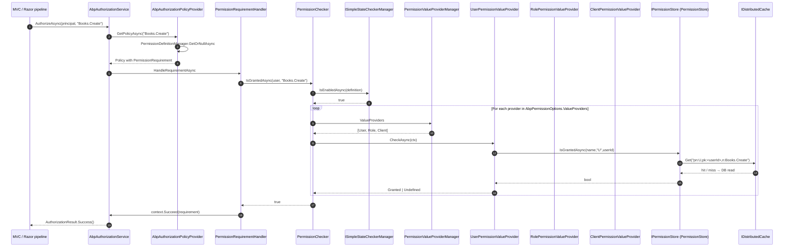

ABP's authorization stack sits on top of ASP.NET Core's `Microsoft.AspNetCore.Authorization` primitives and extends them with a first-class **permission system**, definition providers, multi-source value providers (user / role / client), distributed caching, and a tenant‑aware `IPermissionChecker`. The integration is built so that any `[Authorize(Policy = "MyPermission")]` attribute, any imperative `IAuthorizationService.AuthorizeAsync(...)` call, and any dynamic-proxy interception on application services all flow through the same code paths defined in `framework/src/Volo.Abp.Authorization`.

This page is the entry point for the **`/authz`** section. It maps the moving parts, names every file you'll meet on the deeper pages, and walks through what happens when a permission check runs end-to-end.

<Info>
The framework module is `Volo.Abp.Authorization`; abstractions live in `Volo.Abp.Authorization.Abstractions`. The optional persistence + management UI is delivered by the [Permission Management module](/modules/permission-management/overview).
</Info>

## Where the code lives

<CardGroup cols={2}>
  <Card title="Volo.Abp.Authorization.Abstractions" icon="cube">
    Contracts: `IAbpAuthorizationService`, `IPermissionChecker`, `IPermissionValueProvider`, `PermissionDefinition`, `PermissionRequirement`, `IPermissionStore`.
  </Card>
  <Card title="Volo.Abp.Authorization" icon="shield-halved">
    Implementations: `AbpAuthorizationService`, `AbpAuthorizationPolicyProvider`, `PermissionChecker`, value providers, `AuthorizationInterceptor`.
  </Card>
  <Card title="Volo.Abp.PermissionManagement.*" icon="database">
    `PermissionGrant` aggregate, `PermissionManager`, `PermissionStore`, dynamic store, management providers. See [Permission Management module](/modules/permission-management/overview).
  </Card>
  <Card title="Volo.Abp.Core / SimpleStateChecking" icon="circle-check">
    `ISimpleStateCheckerManager<T>` — the generic gate used by `PermissionDefinition`, features, and settings. See [Simple State Checking](/authz/simple-state-checking).
  </Card>
</CardGroup>

## File inventory — `Volo.Abp.Authorization`

| File | Role |
| --- | --- |
| `framework/src/Volo.Abp.Authorization/Volo/Abp/Authorization/AbpAuthorizationModule.cs` | Module: registers handlers, value providers, definition providers, interception. |
| `framework/src/Volo.Abp.Authorization/Volo/Abp/Authorization/AbpAuthorizationService.cs` | `DefaultAuthorizationService` subclass with `ICurrentPrincipalAccessor`. |
| `framework/src/Volo.Abp.Authorization/Volo/Abp/Authorization/AbpAuthorizationPolicyProvider.cs` | Translates permission names → `AuthorizationPolicy`. |
| `framework/src/Volo.Abp.Authorization/Volo/Abp/Authorization/AuthorizationInterceptor.cs` | Dynamic-proxy interceptor for `[Authorize]` on services. |
| `framework/src/Volo.Abp.Authorization/Volo/Abp/Authorization/AuthorizationInterceptorRegistrar.cs` | Decides which DI registrations get intercepted. |
| `framework/src/Volo.Abp.Authorization/Volo/Abp/Authorization/MethodInvocationAuthorizationService.cs` | Aggregates `[Authorize]` attributes on a `MethodInfo`. |
| `framework/src/Volo.Abp.Authorization/Volo/Abp/Authorization/AbpAuthorizationErrorCodes.cs` | Localized error codes (`Volo.Authorization:010001` …). |
| `framework/src/Volo.Abp.Authorization/Volo/Abp/Authorization/Permissions/PermissionChecker.cs` | The `IPermissionChecker` implementation. |
| `framework/src/Volo.Abp.Authorization/Volo/Abp/Authorization/Permissions/PermissionDefinitionManager.cs` | Merges static + dynamic stores. |
| `framework/src/Volo.Abp.Authorization/Volo/Abp/Authorization/Permissions/PermissionValueProviderManager.cs` | Resolves the ordered list of `IPermissionValueProvider`. |
| `framework/src/Volo.Abp.Authorization/Volo/Abp/Authorization/Permissions/UserPermissionValueProvider.cs` | `"U"` provider, keyed by `AbpClaimTypes.UserId`. |
| `framework/src/Volo.Abp.Authorization/Volo/Abp/Authorization/Permissions/RolePermissionValueProvider.cs` | `"R"` provider, keyed by each `AbpClaimTypes.Role` claim. |
| `framework/src/Volo.Abp.Authorization/Volo/Abp/Authorization/Permissions/ClientPermissionValueProvider.cs` | `"C"` provider, keyed by `AbpClaimTypes.ClientId`, with tenant cleared. |
| `framework/src/Volo.Abp.Authorization/Volo/Abp/Authorization/Permissions/StaticPermissionDefinitionStore.cs` | In-memory store built from `IPermissionDefinitionProvider`s. |
| `framework/src/Volo.Abp.Authorization/Volo/Abp/Authorization/Permissions/NullDynamicPermissionDefinitionStore.cs` | Default no-op dynamic store. |
| `framework/src/Volo.Abp.Authorization/Volo/Abp/Authorization/Permissions/RequirePermissionsSimpleStateChecker.cs` | Simple state checker that gates a state on permissions. |
| `framework/src/Volo.Abp.Authorization/Volo/Abp/Authorization/Permissions/RequireAuthenticatedSimpleStateChecker.cs` | Simple state checker for authentication. |
| `framework/src/Volo.Abp.Authorization/Volo/Abp/Authorization/Permissions/PermissionSimpleStateCheckerExtensions.cs` | `RequirePermissions(...)`, `RequireAuthenticated()` extensions. |

## File inventory — `Volo.Abp.Authorization.Abstractions`

| File | Role |
| --- | --- |
| `…/Volo/Abp/Authorization/IAbpAuthorizationService.cs` | Adds `CurrentPrincipal` and `IServiceProviderAccessor`. |
| `…/Volo/Abp/Authorization/IAbpAuthorizationPolicyProvider.cs` | Adds `GetPoliciesNamesAsync()`. |
| `…/Volo/Abp/Authorization/IMethodInvocationAuthorizationService.cs` | Interface used by `AuthorizationInterceptor`. |
| `…/Volo/Abp/Authorization/MethodInvocationAuthorizationContext.cs` | Wraps a `MethodInfo`. |
| `…/Volo/Abp/Authorization/PermissionRequirement.cs` | `IAuthorizationRequirement` carrying a permission name. |
| `…/Volo/Abp/Authorization/PermissionRequirementHandler.cs` | Bridges `PermissionRequirement` → `IPermissionChecker`. |
| `…/Volo/Abp/Authorization/PermissionsRequirement.cs` | Multi-permission requirement with `RequiresAll`. |
| `…/Volo/Abp/Authorization/PermissionsRequirementHandler.cs` | Multi-permission bridge to `IPermissionChecker`. |
| `…/Volo/Abp/Authorization/AlwaysAllowAuthorizationService.cs` | Replacement service used for tests / data migration. |
| `…/Volo/Abp/Authorization/Permissions/IPermissionChecker.cs` | The core `IsGrantedAsync` interface. |
| `…/Volo/Abp/Authorization/Permissions/AlwaysAllowPermissionChecker.cs` | Always returns `Granted`. |
| `…/Volo/Abp/Authorization/Permissions/IPermissionDefinitionContext.cs` | Surface for defining groups and permissions. |
| `…/Volo/Abp/Authorization/Permissions/PermissionDefinitionContext.cs` | Default implementation, holds `Dictionary<string, PermissionGroupDefinition>`. |
| `…/Volo/Abp/Authorization/Permissions/IPermissionDefinitionProvider.cs` | `PreDefine` / `Define` / `PostDefine`. |
| `…/Volo/Abp/Authorization/Permissions/PermissionDefinitionProvider.cs` | Abstract base — registered as `ITransientDependency`. |
| `…/Volo/Abp/Authorization/Permissions/PermissionDefinition.cs` | Group child: name, parent, multi-tenancy side, providers, state checkers. |
| `…/Volo/Abp/Authorization/Permissions/PermissionGroupDefinition.cs` | Logical group of related permissions. |
| `…/Volo/Abp/Authorization/Permissions/IPermissionValueProvider.cs` | `CheckAsync(PermissionValueCheckContext)`. |
| `…/Volo/Abp/Authorization/Permissions/PermissionValueProvider.cs` | Abstract base used by `User`/`Role`/`Client` providers. |
| `…/Volo/Abp/Authorization/Permissions/PermissionValueCheckContext.cs` | Carries `PermissionDefinition` + `ClaimsPrincipal`. |
| `…/Volo/Abp/Authorization/Permissions/PermissionValuesCheckContext.cs` | Batch version (multiple permissions). |
| `…/Volo/Abp/Authorization/Permissions/IPermissionStore.cs` | `IsGrantedAsync(name, providerName, providerKey)`. |
| `…/Volo/Abp/Authorization/Permissions/NullPermissionStore.cs` | Fallback when no persistence module is present. |
| `…/Volo/Abp/Authorization/Permissions/PermissionGrantInfo.cs` | DTO for a single grant. |
| `…/Volo/Abp/Authorization/Permissions/PermissionGrantResult.cs` | `Undefined` / `Granted` / `Prohibited`. |
| `…/Volo/Abp/Authorization/Permissions/MultiplePermissionGrantResult.cs` | Dictionary of per-name results. |
| `…/Volo/Abp/Authorization/Permissions/AbpPermissionOptions.cs` | `DefinitionProviders`, `ValueProviders`, `DeletedPermissions`. |

## The permission check flow



The walk-through above is taken straight from `PermissionChecker.IsGrantedAsync` and `AbpAuthorizationPolicyProvider.GetPolicyAsync`. The next sections detail each station.

## How ASP.NET Core integration is wired

`AbpAuthorizationModule` configures the host:

```csharp framework/src/Volo.Abp.Authorization/Volo/Abp/Authorization/AbpAuthorizationModule.cs
public override void ConfigureServices(ServiceConfigurationContext context)
{
    context.Services.AddAuthorizationCore();

    context.Services.AddSingleton<IAuthorizationHandler, PermissionRequirementHandler>();
    context.Services.AddSingleton<IAuthorizationHandler, PermissionsRequirementHandler>();

    context.Services.TryAddTransient<DefaultAuthorizationPolicyProvider>();

    Configure<AbpPermissionOptions>(options =>
    {
        options.ValueProviders.Add<UserPermissionValueProvider>();
        options.ValueProviders.Add<RolePermissionValueProvider>();
        options.ValueProviders.Add<ClientPermissionValueProvider>();
    });
    // …
}
```

A few important consequences:

- `AddAuthorizationCore()` brings ASP.NET Core's `IAuthorizationService` machinery; `AbpAuthorizationService` replaces the default implementation via `[Dependency(ReplaceServices = true)]`.
- The two requirement handlers (`PermissionRequirementHandler`, `PermissionsRequirementHandler`) are registered as **singletons** — they are stateless and just delegate to `IPermissionChecker`.
- `PreConfigureServices` calls `AuthorizationInterceptorRegistrar.RegisterIfNeeded` and auto-collects every `IPermissionDefinitionProvider` discovered during DI registration into `AbpPermissionOptions.DefinitionProviders`.

```csharp framework/src/Volo.Abp.Authorization/Volo/Abp/Authorization/AbpAuthorizationModule.cs
public override void PreConfigureServices(ServiceConfigurationContext context)
{
    context.Services.OnRegistered(AuthorizationInterceptorRegistrar.RegisterIfNeeded);
    AutoAddDefinitionProviders(context.Services);
}
```

The interceptor (`AuthorizationInterceptor`) is what makes `[Authorize]` work even when an application service is invoked **without** going through MVC routing — for example, when called by another service or by a background job. See [Policies and attributes](/authz/policies-and-attributes) for the full attribute → interceptor → policy story.

## Policy translation

`AbpAuthorizationPolicyProvider` is the bridge between an opaque policy name and a permission definition:

```csharp framework/src/Volo.Abp.Authorization/Volo/Abp/Authorization/AbpAuthorizationPolicyProvider.cs
public override async Task<AuthorizationPolicy?> GetPolicyAsync(string policyName)
{
    var policy = await base.GetPolicyAsync(policyName);
    if (policy != null) { return policy; }

    var permission = await _permissionDefinitionManager.GetOrNullAsync(policyName);
    if (permission != null)
    {
        var policyBuilder = new AuthorizationPolicyBuilder(Array.Empty<string>());
        policyBuilder.Requirements.Add(new PermissionRequirement(policyName));
        return policyBuilder.Build();
    }

    return null;
}
```

This is the rule that lets you write `[Authorize("Books.Create")]` instead of registering a policy by hand. If the policy name matches a registered ASP.NET Core policy, that wins; otherwise the policy provider asks `IPermissionDefinitionManager` whether the name is a known permission and synthesises a policy whose only requirement is a `PermissionRequirement`.

`GetPoliciesNamesAsync()` unions the policies already registered in `AuthorizationOptions` with every permission name returned by `IPermissionDefinitionManager.GetPermissionsAsync()` — that's the list the [Permission Management UI](/modules/permission-management/blazor-and-web) iterates over.

## Defining permissions

Permissions are declared by `IPermissionDefinitionProvider` implementations. They are picked up automatically:

```csharp framework/src/Volo.Abp.Authorization/Volo/Abp/Authorization/AbpAuthorizationModule.cs
private static void AutoAddDefinitionProviders(IServiceCollection services)
{
    var definitionProviders = new List<Type>();

    services.OnRegistered(context =>
    {
        if (typeof(IPermissionDefinitionProvider).IsAssignableFrom(context.ImplementationType))
        {
            definitionProviders.Add(context.ImplementationType);
        }
    });

    services.Configure<AbpPermissionOptions>(options =>
    {
        options.DefinitionProviders.AddIfNotContains(definitionProviders);
    });
}
```

The actual collection happens lazily inside `StaticPermissionDefinitionStore.CreatePermissionGroupDefinitions`, which calls `PreDefine` → `Define` → `PostDefine` on each provider in turn. Read [Permission system](/authz/permission-system) for the full surface of `IPermissionDefinitionContext`, `PermissionGroupDefinition`, and `PermissionDefinition`.

<Tip>
`PermissionDefinitionManager` merges results from `IStaticPermissionDefinitionStore` (code-defined) and `IDynamicPermissionDefinitionStore` (DB-loaded), preferring static entries. The dynamic store ships in the [Permission Management module](/modules/permission-management/domain).
</Tip>

## Granting permissions: value providers

`PermissionChecker` does not itself know who has what — it asks the **value providers** in order. Three are registered by default, each backed by a different claim:

| Provider | `Name` | Claim used | File |
| --- | --- | --- | --- |
| `UserPermissionValueProvider` | `"U"` | `AbpClaimTypes.UserId` | `…/Permissions/UserPermissionValueProvider.cs` |
| `RolePermissionValueProvider` | `"R"` | `AbpClaimTypes.Role` (per role) | `…/Permissions/RolePermissionValueProvider.cs` |
| `ClientPermissionValueProvider` | `"C"` | `AbpClaimTypes.ClientId` (tenant cleared) | `…/Permissions/ClientPermissionValueProvider.cs` |

Each one calls `IPermissionStore.IsGrantedAsync(name, providerName, providerKey)`. When the [Permission Management module](/modules/permission-management/overview) is in the dependency tree, the store is `PermissionStore` backed by `PermissionGrant` rows and a `IDistributedCache<PermissionGrantCacheItem>`. Without it, the framework falls back to `NullPermissionStore`.

The check terminates early in three cases (from `PermissionChecker.IsGrantedAsync`):

- `permission.IsEnabled == false` → `false`.
- `StateCheckerManager.IsEnabledAsync(permission)` returns `false` (see [Simple State Checking](/authz/simple-state-checking)).
- The tenant side of the call doesn't match `permission.MultiTenancySide`.

Otherwise it iterates `PermissionValueProviderManager.ValueProviders`, treating `PermissionGrantResult.Prohibited` as a hard veto and `Granted` as a positive vote.

## Multi-tenancy interplay

`PermissionDefinition.MultiTenancySide` is checked against the caller's side derived from `ICurrentTenant.GetMultiTenancySide()` or the `claimsPrincipal`'s claims. `ClientPermissionValueProvider` further calls `CurrentTenant.Change(null)` while resolving grants — because a client's grants are stored at the host level, never per tenant.

If you need a refresher on how `ICurrentTenant` is populated, see the multi-tenancy section of the [authentication overview](/auth/overview).

## Lifecycle: from module load to first grant check

Putting all the moving parts on a timeline helps when debugging registration order:

<Steps>
  <Step title="Module load — `AbpAuthorizationModule.PreConfigureServices`">
    `services.OnRegistered(AuthorizationInterceptorRegistrar.RegisterIfNeeded)` is attached, and the same `OnRegistered` hook starts collecting every `IPermissionDefinitionProvider` it sees into `AbpPermissionOptions.DefinitionProviders`.
  </Step>
  <Step title="`AbpAuthorizationModule.ConfigureServices`">
    Adds the two `IAuthorizationHandler` singletons (`PermissionRequirementHandler`, `PermissionsRequirementHandler`), registers `User`/`Role`/`Client` value providers, and configures localization. `AbpAuthorizationService` is registered via attribute as the replacement for `DefaultAuthorizationService`.
  </Step>
  <Step title="Application initialization">
    If the [Permission Management module](/authz/permission-management-module) is included, `AbpPermissionManagementDomainModule.OnApplicationInitializationAsync` spawns a background task that (a) persists static definitions to the database and (b) pre-warms the dynamic store.
  </Step>
  <Step title="First request — policy resolution">
    The MVC pipeline calls `AbpAuthorizationPolicyProvider.GetPolicyAsync(policyName)`. Built-in policies win first; otherwise `IPermissionDefinitionManager.GetOrNullAsync` is consulted, and a `PermissionRequirement` is wrapped in a fresh `AuthorizationPolicy`.
  </Step>
  <Step title="First request — requirement evaluation">
    `PermissionRequirementHandler.HandleRequirementAsync` calls `IPermissionChecker.IsGrantedAsync(user, name)`. `PermissionChecker` consults `ISimpleStateCheckerManager<PermissionDefinition>`, then loops over `PermissionValueProviderManager.ValueProviders`.
  </Step>
  <Step title="First request — store hit">
    Each provider calls `IPermissionStore.IsGrantedAsync(name, providerName, providerKey)`. With the Permission Management module loaded, that's `PermissionStore` reading from `IDistributedCache<PermissionGrantCacheItem>` and falling back to `IPermissionGrantRepository`.
  </Step>
</Steps>

## What ships out of the box

<CardGroup cols={2}>
  <Card title="Abstractions" icon="cube">
    Two `IAuthorizationRequirement`s (`PermissionRequirement`, `PermissionsRequirement`) and their handlers; `IPermissionChecker`; the `PermissionDefinition` / `PermissionGroupDefinition` model; `IPermissionValueProvider`; and a `NullPermissionStore` fallback.
  </Card>
  <Card title="Framework" icon="shield-halved">
    `AbpAuthorizationService` (replacement), `AbpAuthorizationPolicyProvider`, `PermissionChecker`, `PermissionDefinitionManager`, `StaticPermissionDefinitionStore`, the three default value providers, the dynamic-proxy `AuthorizationInterceptor`, and localized error codes.
  </Card>
  <Card title="Simple state checking" icon="circle-check">
    `ISimpleStateCheckerManager<T>`, `RequireAuthenticatedSimpleStateChecker`, `RequirePermissionsSimpleStateChecker`, two JSON serializer contributors — all under `Volo.Abp.Core/Volo/Abp/SimpleStateChecking`.
  </Card>
  <Card title="Always-allow" icon="wand-magic-sparkles">
    `services.AddAlwaysAllowAuthorization()` replaces `IAbpAuthorizationService`, `IAuthorizationService`, `IMethodInvocationAuthorizationService`, and `IPermissionChecker` with success-returning singletons. For tests and the data-migration host only.
  </Card>
</CardGroup>

## What requires the Permission Management module

| Capability | Provided by |
| --- | --- |
| Persisted `PermissionGrant` rows | `Volo.Abp.PermissionManagement.Domain` (+ an EF Core / MongoDB implementation). |
| `IPermissionStore` over a DB + cache | `PermissionStore` in `Volo.Abp.PermissionManagement.Domain`. |
| Per-subject writes (`SetAsync`, `DeleteAsync`) | `IPermissionManager` + `IPermissionManagementProvider`s in `Volo.Abp.PermissionManagement.Domain`. |
| Permission Management UI / HTTP API | `Volo.Abp.PermissionManagement.Application` and `Volo.Abp.PermissionManagement.HttpApi`. |
| Dynamic permission definitions (cross-service) | `DynamicPermissionDefinitionStore` (toggled by `PermissionManagementOptions.IsDynamicPermissionStoreEnabled`). |

Without the module, the framework still serves `[Authorize]` and `IPermissionChecker.IsGrantedAsync(...)` — it just can't say "yes" to any value-provider lookup, because `NullPermissionStore` answers `false` to everything. That's why almost every solution depends on `AbpPermissionManagementDomainModule`.

## Where to read next

<CardGroup cols={2}>
  <Card title="Authorization handlers" icon="gear" href="/authz/authorization-handlers">
    The `AbpAuthorizationService`, the dynamic-proxy interceptor, and the built-in `IAuthorizationHandler`s.
  </Card>
  <Card title="Permission system" icon="key" href="/authz/permission-system">
    `PermissionDefinition`, providers, value providers, and the static/dynamic stores.
  </Card>
  <Card title="Policies & attributes" icon="lock" href="/authz/policies-and-attributes">
    `[Authorize(...)]`, `IAuthorizeData`, and how attribute checks translate into requirement handlers.
  </Card>
  <Card title="Simple state checking" icon="circle-check" href="/authz/simple-state-checking">
    The generic gate shared by permissions, features, and settings.
  </Card>
  <Card title="Permission Management module" icon="database" href="/authz/permission-management-module">
    `PermissionGrant`, `PermissionManager`, the management provider, and dynamic definitions.
  </Card>
  <Card title="Authentication" icon="user-shield" href="/auth/overview">
    How `ClaimsPrincipal` and `ICurrentPrincipalAccessor` are produced upstream.
  </Card>
</CardGroup>
