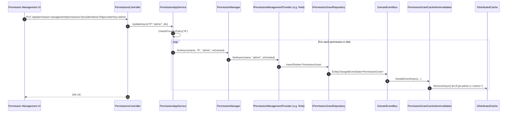

`Volo.Abp.PermissionManagement.Domain` turns the framework's pluggable `IPermissionStore` slot into a real, cached, multi-tenant, event-aware persistence layer. It adds the `PermissionGrant` aggregate, an `IPermissionManager` for writing grants, an abstract `PermissionManagementProvider` for new "kinds of subject" (user, role, client, …), and a dynamic `IDynamicPermissionDefinitionStore` so that permissions defined by other applications can be discovered at runtime. This page covers the domain layer in detail and points at the application + HTTP API layers for the management UI.

For the framework-side abstractions these types fill in, see [Permission system](/authz/permission-system) and the broader [Authorization stack overview](/authz/overview).

## Module shape

The module is declared by `AbpPermissionManagementDomainModule` and depends on the framework's `AbpAuthorizationModule`:

```csharp modules/permission-management/src/Volo.Abp.PermissionManagement.Domain/Volo/Abp/PermissionManagement/AbpPermissionManagementDomainModule.cs
[DependsOn(typeof(AbpAuthorizationModule))]
[DependsOn(typeof(AbpDddDomainModule))]
[DependsOn(typeof(AbpPermissionManagementDomainSharedModule))]
[DependsOn(typeof(AbpCachingModule))]
[DependsOn(typeof(AbpJsonModule))]
public class AbpPermissionManagementDomainModule : AbpModule
{
    public override void ConfigureServices(ServiceConfigurationContext context)
    {
        if (context.Services.IsDataMigrationEnvironment())
        {
            Configure<PermissionManagementOptions>(options =>
            {
                options.SaveStaticPermissionsToDatabase = false;
                options.IsDynamicPermissionStoreEnabled = false;
            });
        }
    }

    public override Task OnApplicationInitializationAsync(ApplicationInitializationContext context)
    {
        InitializeDynamicPermissions(context);
        return Task.CompletedTask;
    }
}
```

`InitializeDynamicPermissions` runs a background `Task.Run` that (a) persists static definitions to the database via `IStaticPermissionSaver` and (b) pre-warms the dynamic store. Both behaviours can be toggled through `PermissionManagementOptions`.

## File inventory — `Volo.Abp.PermissionManagement.Domain`

| File | Role |
| --- | --- |
| `Volo/Abp/PermissionManagement/AbpPermissionManagementDbProperties.cs` | Constants for table/connection naming. |
| `Volo/Abp/PermissionManagement/AbpPermissionManagementDomainModule.cs` | Module class (see above). |
| `Volo/Abp/PermissionManagement/DynamicPermissionDefinitionStore.cs` | DB-backed `IDynamicPermissionDefinitionStore`. Replaces `NullDynamicPermissionDefinitionStore`. |
| `Volo/Abp/PermissionManagement/DynamicPermissionDefinitionStoreInMemoryCache.cs` | In-process cache for dynamic definitions. |
| `Volo/Abp/PermissionManagement/IDynamicPermissionDefinitionStoreInMemoryCache.cs` | Cache contract. |
| `Volo/Abp/PermissionManagement/IPermissionDataSeeder.cs` | Contract for seeding grants. |
| `Volo/Abp/PermissionManagement/IPermissionDefinitionRecordRepository.cs` | Read/write `PermissionDefinitionRecord`. |
| `Volo/Abp/PermissionManagement/IPermissionDefinitionSerializer.cs` | Serializes `PermissionGroupDefinition` ↔ `PermissionDefinitionRecord`. |
| `Volo/Abp/PermissionManagement/IPermissionGrantRepository.cs` | Read/write `PermissionGrant`. |
| `Volo/Abp/PermissionManagement/IPermissionGroupDefinitionRecordRepository.cs` | Read/write `PermissionGroupDefinitionRecord`. |
| `Volo/Abp/PermissionManagement/IPermissionManagementProvider.cs` | Per-subject grant accessor (user, role, client). |
| `Volo/Abp/PermissionManagement/IPermissionManager.cs` | Public write API. |
| `Volo/Abp/PermissionManagement/IStaticPermissionSaver.cs` | Saves static definitions to DB on startup. |
| `Volo/Abp/PermissionManagement/MultiplePermissionValueProviderGrantInfo.cs` | Batch grant info per name. |
| `Volo/Abp/PermissionManagement/MultiplePermissionWithGrantedProviders.cs` | Returned by `PermissionManager.GetAsync(string[]…)`. |
| `Volo/Abp/PermissionManagement/PermissionDataSeedContributor.cs` | Seeds `admin` role grants. |
| `Volo/Abp/PermissionManagement/PermissionDataSeeder.cs` | Default `IPermissionDataSeeder`. |
| `Volo/Abp/PermissionManagement/PermissionDefinitionRecord.cs` | Aggregate for dynamic permission rows. |
| `Volo/Abp/PermissionManagement/PermissionDefinitionSerializer.cs` | Implementation of the serializer. |
| `Volo/Abp/PermissionManagement/PermissionFinder.cs` | Convenience for cross-service grant checks. |
| `Volo/Abp/PermissionManagement/PermissionGrant.cs` | Aggregate root (one granted permission). |
| `Volo/Abp/PermissionManagement/PermissionGrantCacheItem.cs` | Serializable cache item for `IDistributedCache`. |
| `Volo/Abp/PermissionManagement/PermissionGrantCacheItemInvalidator.cs` | Local event handler that evicts on `EntityChangedEventData<PermissionGrant>`. |
| `Volo/Abp/PermissionManagement/PermissionGroupDefinitionRecord.cs` | Aggregate for dynamic group rows. |
| `Volo/Abp/PermissionManagement/PermissionManagementOptions.cs` | Static/dynamic toggles + provider policy map. |
| `Volo/Abp/PermissionManagement/PermissionManagementProvider.cs` | Abstract base for management providers. |
| `Volo/Abp/PermissionManagement/PermissionManager.cs` | The `IPermissionManager`. |
| `Volo/Abp/PermissionManagement/PermissionStore.cs` | `IPermissionStore` backed by repo + cache. |
| `Volo/Abp/PermissionManagement/PermissionValueProviderGrantInfo.cs` | One-permission grant info for `IPermissionManagementProvider`. |
| `Volo/Abp/PermissionManagement/PermissionValueProviderInfo.cs` | DTO surfaced to the UI for a granted provider. |
| `Volo/Abp/PermissionManagement/PermissionWithGrantedProviders.cs` | Single-name version of `MultiplePermissionWithGrantedProviders`. |
| `Volo/Abp/PermissionManagement/StaticPermissionSaver.cs` | Writes the static definitions into `PermissionDefinitionRecord` rows. |

<Tip>
The application layer (`Volo.Abp.PermissionManagement.Application`) and HTTP API (`Volo.Abp.PermissionManagement.HttpApi`) sit on top of these types. The DTOs and the `IPermissionAppService` contract live in `Volo.Abp.PermissionManagement.Application.Contracts`. See [Permission Management — application & HTTP](/modules/permission-management/application).
</Tip>

## The `PermissionGrant` aggregate

```csharp modules/permission-management/src/Volo.Abp.PermissionManagement.Domain/Volo/Abp/PermissionManagement/PermissionGrant.cs
public class PermissionGrant : Entity<Guid>, IMultiTenant
{
    public virtual Guid?  TenantId     { get; protected set; }
    [NotNull] public virtual string Name         { get; protected set; }
    [NotNull] public virtual string ProviderName { get; protected set; }
    [CanBeNull] public virtual string ProviderKey { get; protected internal set; }

    public PermissionGrant(Guid id, string name, string providerName,
                           string providerKey, Guid? tenantId = null)
    {
        Id           = id;
        Name         = Check.NotNullOrWhiteSpace(name, nameof(name));
        ProviderName = Check.NotNullOrWhiteSpace(providerName, nameof(providerName));
        ProviderKey  = providerKey;
        TenantId     = tenantId;
    }
}
```

One row = one "this subject has this permission". The composite identity is `(Name, ProviderName, ProviderKey, TenantId)`; `(ProviderName, ProviderKey)` selects the subject (`"U"` + userId, `"R"` + roleName, `"C"` + clientId, …) and `Name` is the permission name from `PermissionDefinitionManager`.

The repository contract reflects what the rest of the module needs:

```csharp modules/permission-management/src/Volo.Abp.PermissionManagement.Domain/Volo/Abp/PermissionManagement/IPermissionGrantRepository.cs
public interface IPermissionGrantRepository : IBasicRepository<PermissionGrant, Guid>
{
    Task<PermissionGrant> FindAsync(string name, string providerName, string providerKey,
                                    CancellationToken cancellationToken = default);

    Task<List<PermissionGrant>> GetListAsync(string providerName, string providerKey,
                                             CancellationToken cancellationToken = default);

    Task<List<PermissionGrant>> GetListAsync(string[] names, string providerName, string providerKey,
                                             CancellationToken cancellationToken = default);
}
```

EF Core, MongoDB, and the in-memory test repository each provide their own implementation in `Volo.Abp.PermissionManagement.EntityFrameworkCore` and `Volo.Abp.PermissionManagement.MongoDB`.

## `PermissionGrantCacheItem`

`PermissionStore` reads grants through an `IDistributedCache<PermissionGrantCacheItem>`. The key format is fixed so the invalidator can recover it later:

```csharp modules/permission-management/src/Volo.Abp.PermissionManagement.Domain/Volo/Abp/PermissionManagement/PermissionGrantCacheItem.cs
[Serializable]
public class PermissionGrantCacheItem
{
    private const string CacheKeyFormat = "pn:{0},pk:{1},n:{2}";

    public bool IsGranted { get; set; }

    public PermissionGrantCacheItem() {}
    public PermissionGrantCacheItem(bool isGranted) => IsGranted = isGranted;

    public static string CalculateCacheKey(string name, string providerName, string providerKey)
        => string.Format(CacheKeyFormat, providerName, providerKey, name);

    public static string GetPermissionNameFormCacheKeyOrNull(string cacheKey) { /* … */ }
}
```

The full key is `pn:{providerName},pk:{providerKey},n:{name}`. Both granted and **non-granted** results are cached as `IsGranted = true|false` so the store doesn't keep hitting the database to re-confirm a "no".

## `PermissionStore`

`PermissionStore` is the `IPermissionStore` implementation that takes over from `NullPermissionStore` as soon as the domain module is loaded:

```csharp modules/permission-management/src/Volo.Abp.PermissionManagement.Domain/Volo/Abp/PermissionManagement/PermissionStore.cs
public virtual async Task<bool> IsGrantedAsync(string name, string providerName, string providerKey)
{
    return (await GetCacheItemAsync(name, providerName, providerKey)).IsGranted;
}

protected virtual async Task<PermissionGrantCacheItem> GetCacheItemAsync(
    string name, string providerName, string providerKey)
{
    var cacheKey = CalculateCacheKey(name, providerName, providerKey);
    var cacheItem = await Cache.GetAsync(cacheKey);
    if (cacheItem != null) return cacheItem;

    cacheItem = new PermissionGrantCacheItem(false);
    await SetCacheItemsAsync(providerName, providerKey, name, cacheItem);
    return cacheItem;
}
```

On cache miss, the store **loads every permission definition** matching `providerName` and **batches them all into one repository call**, so subsequent reads against the same subject are warm. The batch overload of `IsGrantedAsync(string[], …)` does the same for multiple names.

### Cache invalidation

When a `PermissionGrant` is inserted, updated, or deleted, the domain event handler clears the matching cache entry:

```csharp modules/permission-management/src/Volo.Abp.PermissionManagement.Domain/Volo/Abp/PermissionManagement/PermissionGrantCacheItemInvalidator.cs
public class PermissionGrantCacheItemInvalidator :
    ILocalEventHandler<EntityChangedEventData<PermissionGrant>>,
    ITransientDependency
{
    public virtual async Task HandleEventAsync(EntityChangedEventData<PermissionGrant> eventData)
    {
        var cacheKey = CalculateCacheKey(
            eventData.Entity.Name,
            eventData.Entity.ProviderName,
            eventData.Entity.ProviderKey);

        using (CurrentTenant.Change(eventData.Entity.TenantId))
        {
            await Cache.RemoveAsync(cacheKey);
        }
    }
}
```

Because it changes the current tenant to the grant's tenant **before** calling `RemoveAsync`, the eviction targets the correct tenant slot of the distributed cache.

## `IPermissionManagementProvider` and `PermissionManagementProvider`

A management provider is the **write counterpart** of an `IPermissionValueProvider`. Where `UserPermissionValueProvider` answers "is this granted?", `UserPermissionManagementProvider` (shipped in `Volo.Abp.PermissionManagement.Identity`) answers "make it granted/revoked".

```csharp modules/permission-management/src/Volo.Abp.PermissionManagement.Domain/Volo/Abp/PermissionManagement/IPermissionManagementProvider.cs
public interface IPermissionManagementProvider : ISingletonDependency
{
    string Name { get; }

    Task<PermissionValueProviderGrantInfo>          CheckAsync(string name,    string providerName, string providerKey);
    Task<MultiplePermissionValueProviderGrantInfo> CheckAsync(string[] names, string providerName, string providerKey);
    Task SetAsync(string name, string providerKey, bool isGranted);
}
```

The abstract base ships a default implementation that talks to `IPermissionGrantRepository`:

```csharp modules/permission-management/src/Volo.Abp.PermissionManagement.Domain/Volo/Abp/PermissionManagement/PermissionManagementProvider.cs
public virtual async Task<MultiplePermissionValueProviderGrantInfo> CheckAsync(
    string[] names, string providerName, string providerKey)
{
    var multi = new MultiplePermissionValueProviderGrantInfo(names);
    if (providerName != Name) return multi;

    var grants = await PermissionGrantRepository.GetListAsync(names, providerName, providerKey);
    foreach (var permissionName in names)
    {
        var isGrant = grants.Any(x => x.Name == permissionName);
        multi.Result[permissionName] = new PermissionValueProviderGrantInfo(isGrant, providerKey);
    }
    return multi;
}

public virtual Task SetAsync(string name, string providerKey, bool isGranted)
    => isGranted ? GrantAsync(name, providerKey) : RevokeAsync(name, providerKey);
```

The `Name` matches a value provider's `Name` — `"U"`, `"R"`, `"C"`, etc. — so that a UI choosing "edit permissions for user X" lands on `UserPermissionManagementProvider`.

## `IPermissionManager`

`IPermissionManager` is the high-level write API consumed by `PermissionAppService` and any custom code that wants to manipulate grants:

```csharp modules/permission-management/src/Volo.Abp.PermissionManagement.Domain/Volo/Abp/PermissionManagement/IPermissionManager.cs
public interface IPermissionManager
{
    Task<PermissionWithGrantedProviders>          GetAsync(string permissionName,    string providerName, string providerKey);
    Task<MultiplePermissionWithGrantedProviders>  GetAsync(string[] permissionNames, string providerName, string providerKey);

    Task<List<PermissionWithGrantedProviders>>    GetAllAsync([NotNull] string providerName, [NotNull] string providerKey);

    Task SetAsync(string permissionName, string providerName, string providerKey, bool isGranted);

    Task<PermissionGrant> UpdateProviderKeyAsync(PermissionGrant permissionGrant, string providerKey);

    Task DeleteAsync(string providerName, string providerKey);
}
```

The default implementation is `PermissionManager`:

```csharp modules/permission-management/src/Volo.Abp.PermissionManagement.Domain/Volo/Abp/PermissionManagement/PermissionManager.cs
public class PermissionManager : IPermissionManager, ISingletonDependency
{
    protected IPermissionGrantRepository PermissionGrantRepository { get; }
    protected IPermissionDefinitionManager PermissionDefinitionManager { get; }
    protected ISimpleStateCheckerManager<PermissionDefinition> SimpleStateCheckerManager { get; }
    protected IGuidGenerator GuidGenerator { get; }
    protected ICurrentTenant CurrentTenant { get; }
    protected IReadOnlyList<IPermissionManagementProvider> ManagementProviders => _lazyProviders.Value;
    protected PermissionManagementOptions Options { get; }
    protected IDistributedCache<PermissionGrantCacheItem> Cache { get; }
    // …
}
```

A few behaviours follow from the constructor:

- The list of `IPermissionManagementProvider` is resolved lazily from `PermissionManagementOptions.ManagementProviders` — modules add their provider type to that list.
- Read APIs (`GetAsync`) consult **every** registered provider and surface which ones granted the permission via `PermissionWithGrantedProviders.Providers`.
- Write APIs (`SetAsync`) route the call to the provider whose `Name` matches `providerName`.

## `PermissionManagementOptions`

```csharp modules/permission-management/src/Volo.Abp.PermissionManagement.Domain/Volo/Abp/PermissionManagement/PermissionManagementOptions.cs
public class PermissionManagementOptions
{
    public ITypeList<IPermissionManagementProvider> ManagementProviders { get; }
    public Dictionary<string, string> ProviderPolicies { get; }

    public bool SaveStaticPermissionsToDatabase { get; set; } = true;
    public bool IsDynamicPermissionStoreEnabled { get; set; }

    public PermissionManagementOptions()
    {
        ManagementProviders = new TypeList<IPermissionManagementProvider>();
        ProviderPolicies    = new Dictionary<string, string>();
    }
}
```

| Property | Used where |
| --- | --- |
| `ManagementProviders` | `PermissionManager` resolves the list lazily. |
| `ProviderPolicies` | `PermissionAppService.CheckProviderPolicy` — the policy a caller needs to manage grants for a given provider (for example, `"R"` → `AbpIdentityPermissions.Roles.ManagePermissions`). |
| `SaveStaticPermissionsToDatabase` | `StaticPermissionSaver` skips the write if `false`. Default `true`. |
| `IsDynamicPermissionStoreEnabled` | `DynamicPermissionDefinitionStore` returns empty when `false`. Default `false`. |

Both booleans are forced to `false` in data-migration environments (see the module above).

## Dynamic definitions

When `IsDynamicPermissionStoreEnabled` is on, `DynamicPermissionDefinitionStore` replaces `NullDynamicPermissionDefinitionStore` and lets a microservice load permissions persisted by another service. It's distributed-lock aware so that the in-memory cache rebuilds safely under contention:

```csharp modules/permission-management/src/Volo.Abp.PermissionManagement.Domain/Volo/Abp/PermissionManagement/DynamicPermissionDefinitionStore.cs
[Dependency(ReplaceServices = true)]
public class DynamicPermissionDefinitionStore : IDynamicPermissionDefinitionStore, ITransientDependency
{
    protected IPermissionGroupDefinitionRecordRepository PermissionGroupRepository { get; }
    protected IPermissionDefinitionRecordRepository      PermissionRepository      { get; }
    protected IPermissionDefinitionSerializer            PermissionDefinitionSerializer { get; }
    protected IDynamicPermissionDefinitionStoreInMemoryCache StoreCache { get; }
    protected IDistributedCache  DistributedCache  { get; }
    protected IAbpDistributedLock DistributedLock { get; }
    public PermissionManagementOptions PermissionManagementOptions { get; }
    protected AbpDistributedCacheOptions CacheOptions { get; }

    public virtual async Task<PermissionDefinition> GetOrNullAsync(string name)
    {
        if (!PermissionManagementOptions.IsDynamicPermissionStoreEnabled) return null;
        using (await StoreCache.SyncSemaphore.LockAsync())
        {
            await EnsureCacheIsUptoDateAsync();
            return StoreCache.GetPermissionOrNull(name);
        }
    }
}
```

The records — `PermissionGroupDefinitionRecord` and `PermissionDefinitionRecord` — are aggregates with rich shape that mirrors the in-memory definitions:

```csharp modules/permission-management/src/Volo.Abp.PermissionManagement.Domain/Volo/Abp/PermissionManagement/PermissionDefinitionRecord.cs
public class PermissionDefinitionRecord : BasicAggregateRoot<Guid>, IHasExtraProperties
{
    public string GroupName     { get; set; }
    public string Name          { get; set; }
    public string ParentName    { get; set; }
    public string DisplayName   { get; set; }
    public bool   IsEnabled     { get; set; }
    public MultiTenancySides MultiTenancySide { get; set; }

    /// <summary>Comma separated list of provider names.</summary>
    public string Providers     { get; set; }

    /// <summary>Serialized string to store info about the state checkers.</summary>
    public string StateCheckers { get; set; }

    public ExtraPropertyDictionary ExtraProperties { get; protected set; }
}
```

The `StateCheckers` column holds the JSON emitted by `PermissionsSimpleStateCheckerSerializerContributor` / `AuthenticatedSimpleStateCheckerSerializerContributor` — see [Simple State Checking](/authz/simple-state-checking).

### Saving static definitions to the database

On startup, `AbpPermissionManagementDomainModule` spawns a Polly-backed retry loop that calls `IStaticPermissionSaver.SaveAsync()`. The saver projects every in-memory `PermissionGroupDefinition` into `PermissionGroupDefinitionRecord` / `PermissionDefinitionRecord`, then upserts them under a distributed lock so multiple replicas don't fight:

```csharp modules/permission-management/src/Volo.Abp.PermissionManagement.Domain/Volo/Abp/PermissionManagement/StaticPermissionSaver.cs
public class StaticPermissionSaver : IStaticPermissionSaver, ITransientDependency
{
    protected IStaticPermissionDefinitionStore             StaticStore               { get; }
    protected IPermissionGroupDefinitionRecordRepository   PermissionGroupRepository { get; }
    protected IPermissionDefinitionRecordRepository        PermissionRepository      { get; }
    protected IPermissionDefinitionSerializer              PermissionSerializer      { get; }
    protected IDistributedCache                            Cache                     { get; }
    protected IApplicationInfoAccessor                     ApplicationInfoAccessor   { get; }
    protected IAbpDistributedLock                          DistributedLock           { get; }
    protected AbpPermissionOptions                         PermissionOptions         { get; }
    // …
}
```

`AbpPermissionOptions.DeletedPermissions` / `DeletedPermissionGroups` give modules a way to rename a permission without leaving an orphan row — the saver removes everything that's listed there.

The serializer:

```csharp modules/permission-management/src/Volo.Abp.PermissionManagement.Domain/Volo/Abp/PermissionManagement/PermissionDefinitionSerializer.cs
public Task<PermissionGroupDefinitionRecord> SerializeAsync(PermissionGroupDefinition permissionGroup)
{
    using (CultureHelper.Use(CultureInfo.InvariantCulture))
    {
        var permissionGroupRecord = new PermissionGroupDefinitionRecord(
            GuidGenerator.Create(),
            permissionGroup.Name,
            LocalizableStringSerializer.Serialize(permissionGroup.DisplayName));
        // …copy properties…
        return Task.FromResult(permissionGroupRecord);
    }
}
```

## Data seeding

ABP can plant initial grants — typically "the `admin` role gets everything". Two collaborating pieces:

```csharp modules/permission-management/src/Volo.Abp.PermissionManagement.Domain/Volo/Abp/PermissionManagement/PermissionDataSeeder.cs
public class PermissionDataSeeder : IPermissionDataSeeder, ITransientDependency
{
    public virtual async Task SeedAsync(
        string providerName, string providerKey,
        IEnumerable<string> grantedPermissions, Guid? tenantId = null)
    {
        using (CurrentTenant.Change(tenantId))
        {
            var names = grantedPermissions.ToArray();
            var existing = (await PermissionGrantRepository.GetListAsync(names, providerName, providerKey))
                            .Select(x => x.Name).ToList();

            foreach (var permissionName in names.Except(existing))
            {
                await PermissionGrantRepository.InsertAsync(new PermissionGrant(
                    GuidGenerator.Create(), permissionName, providerName, providerKey, tenantId));
            }
        }
    }
}
```

```csharp modules/permission-management/src/Volo.Abp.PermissionManagement.Domain/Volo/Abp/PermissionManagement/PermissionDataSeedContributor.cs
public virtual async Task SeedAsync(DataSeedContext context)
{
    var multiTenancySide = CurrentTenant.GetMultiTenancySide();
    var permissionNames = (await PermissionDefinitionManager.GetPermissionsAsync())
        .Where(p => p.MultiTenancySide.HasFlag(multiTenancySide))
        .Where(p => !p.Providers.Any() || p.Providers.Contains(RolePermissionValueProvider.ProviderName))
        .Select(p => p.Name)
        .ToArray();

    await PermissionDataSeeder.SeedAsync(
        RolePermissionValueProvider.ProviderName, "admin", permissionNames, context?.TenantId);
}
```

The contributor grants every applicable permission to the `admin` role in the current tenant. Multi-tenancy side filtering means a host-only permission isn't seeded for tenants and vice versa.

## `PermissionFinder`

A small helper for inter-service grant lookups:

```csharp modules/permission-management/src/Volo.Abp.PermissionManagement.Domain/Volo/Abp/PermissionManagement/PermissionFinder.cs
public virtual async Task<List<IsGrantedResponse>> IsGrantedAsync(List<IsGrantedRequest> requests)
{
    var result = new List<IsGrantedResponse>();
    foreach (var item in requests)
    {
        result.Add(new IsGrantedResponse
        {
            UserId = item.UserId,
            Permissions = (await PermissionManager.GetAsync(item.PermissionNames,
                              UserPermissionValueProvider.ProviderName,
                              item.UserId.ToString())).Result
                          .ToDictionary(x => x.Name, x => x.IsGranted)
        });
    }
    return result;
}
```

This is invoked by the integration controller in the HTTP API layer (`Volo.Abp.PermissionManagement.HttpApi`) — useful when another microservice needs to batch-check user permissions across the wire.

## Application and HTTP API

The application module ships a single app service:

```csharp modules/permission-management/src/Volo.Abp.PermissionManagement.Application/Volo/Abp/PermissionManagement/PermissionAppService.cs
[Authorize]
public class PermissionAppService : ApplicationService, IPermissionAppService
{
    protected PermissionManagementOptions Options { get; }
    protected IPermissionManager PermissionManager { get; }
    protected IPermissionDefinitionManager PermissionDefinitionManager { get; }
    protected ISimpleStateCheckerManager<PermissionDefinition> SimpleStateCheckerManager { get; }

    public virtual async Task<GetPermissionListResultDto> GetAsync(string providerName, string providerKey)
    {
        await CheckProviderPolicy(providerName);
        // …iterate groups / permissions, honouring IsEnabled,
        // MultiTenancySide, allowed providers, and state checkers…
    }
}
```

`CheckProviderPolicy(providerName)` looks at `PermissionManagementOptions.ProviderPolicies` and calls `AuthorizationService.CheckAsync(policyName)` — that's how the identity module ensures only callers with the right manage-permission policy can edit role/user grants.

The HTTP controller is a thin wrapper:

```csharp modules/permission-management/src/Volo.Abp.PermissionManagement.HttpApi/Volo/Abp/PermissionManagement/PermissionsController.cs
[RemoteService(Name = PermissionManagementRemoteServiceConsts.RemoteServiceName)]
[Area(PermissionManagementRemoteServiceConsts.ModuleName)]
[Route("api/permission-management/permissions")]
public class PermissionsController : AbpControllerBase, IPermissionAppService
{
    [HttpGet] public virtual Task<GetPermissionListResultDto> GetAsync(string providerName, string providerKey)
        => PermissionAppService.GetAsync(providerName, providerKey);

    [HttpPut] public virtual Task UpdateAsync(string providerName, string providerKey, UpdatePermissionsDto input)
        => PermissionAppService.UpdateAsync(providerName, providerKey, input);
}
```

This is the endpoint the [Angular](/ng/permission-management-ui) and Blazor UIs call when an administrator opens the "Permissions" dialog on a user or role.

## End-to-end write flow



When the next read arrives (for example a `[Authorize("Books.Create")]` check), `PermissionStore` sees the cache miss, falls back to the repository, and re-warms the cache item.

## Configuring the module

A typical app's `DependsOn` chain looks like:

```csharp Application/MyAppModule.cs
[DependsOn(
    typeof(AbpPermissionManagementDomainModule),
    typeof(AbpPermissionManagementDomainIdentityModule),  // user/role management providers
    typeof(AbpPermissionManagementApplicationModule),
    typeof(AbpPermissionManagementHttpApiModule),
    typeof(AbpPermissionManagementEntityFrameworkCoreModule)
)]
public class MyAppModule : AbpModule
{
    public override void ConfigureServices(ServiceConfigurationContext context)
    {
        Configure<PermissionManagementOptions>(options =>
        {
            options.IsDynamicPermissionStoreEnabled = true;          // for microservices
            options.ProviderPolicies["R"] = "AbpIdentity.Roles.ManagePermissions";
            options.ProviderPolicies["U"] = "AbpIdentity.Users.ManagePermissions";
            options.ProviderPolicies["C"] = "AbpOpenIddict.Applications.ManagePermissions";
        });
    }
}
```

The Identity module adds `RolePermissionManagementProvider` and `UserPermissionManagementProvider`; the OpenIddict module adds `ClientPermissionManagementProvider`. Together they cover the `"R"`, `"U"`, and `"C"` value providers registered at the framework level.

## Related reading

<CardGroup cols={2}>
  <Card title="Overview" icon="diagram-project" href="/authz/overview">
    Where this module fits in the broader authorization stack.
  </Card>
  <Card title="Permission system" icon="key" href="/authz/permission-system">
    The framework-side value-provider/checker pipeline.
  </Card>
  <Card title="Authorization handlers" icon="gear" href="/authz/authorization-handlers">
    How `IPermissionChecker` is invoked by `IAuthorizationService`.
  </Card>
  <Card title="Simple state checking" icon="circle-check" href="/authz/simple-state-checking">
    The shared gate used by `PermissionDefinition.StateCheckers`.
  </Card>
  <Card title="Permission Management — application" icon="window" href="/modules/permission-management/application">
    DTOs, `IPermissionAppService`, and integration controllers.
  </Card>
  <Card title="Permission Management — persistence" icon="database" href="/modules/permission-management/persistence">
    EF Core / MongoDB implementations of the repositories.
  </Card>
</CardGroup>
