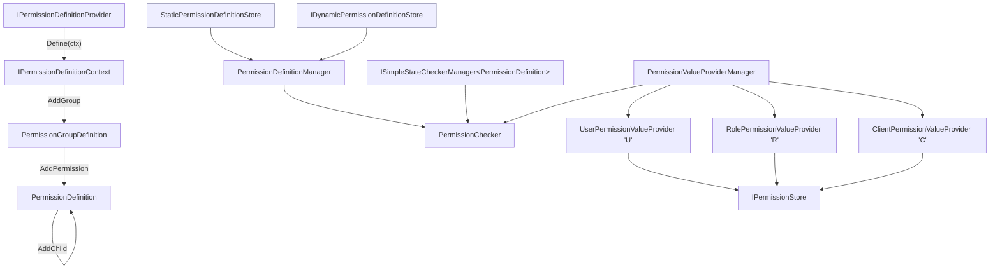
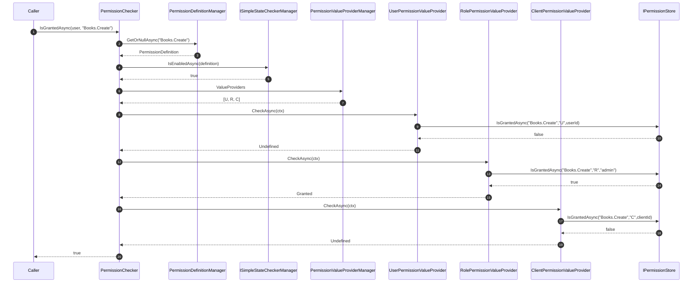

ABP's permission system is built on a small, composable set of abstractions: **definitions** describe the permissions an application offers; **stores** hold them in memory or in a database; **value providers** translate a `ClaimsPrincipal` into a `PermissionGrantResult`; and the **checker** orchestrates the whole thing. This page documents each piece, with file paths and the real signatures from `framework/src/Volo.Abp.Authorization` and its abstractions assembly.

For the cross-stack tour, start at the [Authorization stack overview](/authz/overview). For the persistence side of grants, jump to the [Permission Management module](/authz/permission-management-module).

## Type map



## File inventory

Everything described below ships either in `Volo.Abp.Authorization.Abstractions` (interfaces, value objects) or in `Volo.Abp.Authorization` (implementations + the three default providers).

### Abstractions (`framework/src/Volo.Abp.Authorization.Abstractions/Volo/Abp/Authorization/Permissions/`)

| File | Purpose |
| --- | --- |
| `PermissionDefinition.cs` | Permission node. Holds `Name`, `Parent`, `Children`, `Providers`, `StateCheckers`, `MultiTenancySide`, `IsEnabled`, `Properties`. |
| `PermissionGroupDefinition.cs` | Container of related permissions. |
| `IPermissionDefinitionContext.cs` / `PermissionDefinitionContext.cs` | `AddGroup`/`GetGroup`/`GetGroupOrNull`/`RemoveGroup`/`GetPermissionOrNull`. |
| `IPermissionDefinitionProvider.cs` / `PermissionDefinitionProvider.cs` | `PreDefine` / `Define` / `PostDefine` triplet. |
| `PermissionDefinitionContextExtensions.cs` | Small convenience helpers on the context. |
| `IPermissionDefinitionManager.cs` | Merge interface (`GetAsync`, `GetOrNullAsync`, `GetPermissionsAsync`, `GetGroupsAsync`). |
| `IPermissionChecker.cs` | Single + batch `IsGrantedAsync` overloads. |
| `AlwaysAllowPermissionChecker.cs` | Test-only replacement. |
| `IPermissionValueProvider.cs` / `PermissionValueProvider.cs` | Provider contract + abstract base. |
| `PermissionValueCheckContext.cs` / `PermissionValuesCheckContext.cs` | Per-call contexts (single / batch). |
| `IPermissionStore.cs` / `NullPermissionStore.cs` | Storage contract + no-op fallback. |
| `PermissionStateContext.cs` | State carried for the per-permission `ISimpleStateChecker` evaluation. |
| `PermissionGrantInfo.cs` | DTO returned by stores. |
| `PermissionGrantResult.cs` | `Undefined` / `Granted` / `Prohibited`. |
| `MultiplePermissionGrantResult.cs` | Per-name dictionary plus `AllGranted` / `AllProhibited`. |
| `AbpPermissionOptions.cs` | `DefinitionProviders`, `ValueProviders`, deletion sets. |
| `ICanAddChildPermission.cs` | Shared `AddPermission(...)` API. |

### Framework (`framework/src/Volo.Abp.Authorization/Volo/Abp/Authorization/Permissions/`)

| File | Purpose |
| --- | --- |
| `PermissionDefinitionManager.cs` | Reads from static then dynamic stores. |
| `StaticPermissionDefinitionStore.cs` | Lazy in-memory store driven by `AbpPermissionOptions.DefinitionProviders`. |
| `IStaticPermissionDefinitionStore.cs` / `IDynamicPermissionDefinitionStore.cs` | Store contracts. |
| `NullDynamicPermissionDefinitionStore.cs` | No-op when no DB-backed store is registered. |
| `PermissionValueProviderManager.cs` | Lazy resolver of `IPermissionValueProvider`s. |
| `PermissionChecker.cs` | The actual checker logic. |
| `UserPermissionValueProvider.cs` | `"U"` — user-keyed grants. |
| `RolePermissionValueProvider.cs` | `"R"` — role-keyed grants. |
| `ClientPermissionValueProvider.cs` | `"C"` — client-id-keyed grants, host tenant. |
| `RequirePermissionsSimpleStateChecker.cs` | `ISimpleStateChecker<TState>` that asks `IPermissionChecker`. |
| `RequirePermissionsSimpleBatchStateChecker.cs` | Batch variant used at definition time. |
| `RequireAuthenticatedSimpleStateChecker.cs` | Gates a state on `ICurrentUser.IsAuthenticated`. |
| `PermissionSimpleStateCheckerExtensions.cs` | `RequirePermissions(...)` / `RequireAuthenticated()` API. |
| `PermissionsSimpleStateCheckerSerializerContributor.cs` | Serializes `RequirePermissionsSimpleStateChecker`. |
| `AuthenticatedSimpleStateCheckerSerializerContributor.cs` | Serializes `RequireAuthenticatedSimpleStateChecker`. |

## Defining permissions

A definition provider is a normal class with `ITransientDependency` (inherited from `PermissionDefinitionProvider`):

```csharp framework/src/Volo.Abp.Authorization.Abstractions/Volo/Abp/Authorization/Permissions/PermissionDefinitionProvider.cs
public abstract class PermissionDefinitionProvider : IPermissionDefinitionProvider, ITransientDependency
{
    public virtual void PreDefine(IPermissionDefinitionContext context)  { }
    public abstract void Define(IPermissionDefinitionContext context);
    public virtual void PostDefine(IPermissionDefinitionContext context) { }
}
```

`AbpAuthorizationModule.PreConfigureServices` auto-collects every concrete subclass into `AbpPermissionOptions.DefinitionProviders` — no manual `Add<...>` call needed (see [authorization handlers](/authz/authorization-handlers#abppermissionoptions) for the options structure).

### `IPermissionDefinitionContext`

```csharp framework/src/Volo.Abp.Authorization.Abstractions/Volo/Abp/Authorization/Permissions/IPermissionDefinitionContext.cs
public interface IPermissionDefinitionContext
{
    IServiceProvider ServiceProvider { get; }

    PermissionGroupDefinition  GetGroup([NotNull] string name);
    PermissionGroupDefinition? GetGroupOrNull(string name);

    PermissionGroupDefinition AddGroup(
        [NotNull] string name,
        ILocalizableString? displayName = null);

    void RemoveGroup(string name);

    PermissionDefinition? GetPermissionOrNull([NotNull] string name);
}
```

`PermissionDefinitionContext` is a thin dictionary wrapper that throws `AbpException` if a group is registered twice. Critically, the context is **created per evaluation** by `StaticPermissionDefinitionStore.CreatePermissionGroupDefinitions`:

```csharp framework/src/Volo.Abp.Authorization/Volo/Abp/Authorization/Permissions/StaticPermissionDefinitionStore.cs
protected virtual Dictionary<string, PermissionGroupDefinition> CreatePermissionGroupDefinitions()
{
    using (var scope = _serviceProvider.CreateScope())
    {
        var context = new PermissionDefinitionContext(scope.ServiceProvider);

        var providers = Options.DefinitionProviders
            .Select(p => (scope.ServiceProvider.GetRequiredService(p) as IPermissionDefinitionProvider)!)
            .ToList();

        foreach (var provider in providers) provider.PreDefine(context);
        foreach (var provider in providers) provider.Define(context);
        foreach (var provider in providers) provider.PostDefine(context);

        return context.Groups;
    }
}
```

The `PreDefine` → `Define` → `PostDefine` triplet lets modules **register** groups in `Define` and **augment** other modules' groups in `PostDefine`, regardless of provider order.

### `PermissionGroupDefinition`

```csharp framework/src/Volo.Abp.Authorization.Abstractions/Volo/Abp/Authorization/Permissions/PermissionGroupDefinition.cs
public class PermissionGroupDefinition : ICanAddChildPermission
{
    public string Name { get; }
    public ILocalizableString DisplayName { get; set; }
    public Dictionary<string, object?> Properties { get; }
    public IReadOnlyList<PermissionDefinition> Permissions { get; }

    public PermissionDefinition AddPermission(
        [NotNull] string name,
        ILocalizableString? displayName = null,
        MultiTenancySides  multiTenancySide = MultiTenancySides.Both,
        bool               isEnabled = true);

    public List<PermissionDefinition> GetPermissionsWithChildren();
    public PermissionDefinition? GetPermissionOrNull([NotNull] string name);
}
```

### `PermissionDefinition`

This is the richest type in the system:

```csharp framework/src/Volo.Abp.Authorization.Abstractions/Volo/Abp/Authorization/Permissions/PermissionDefinition.cs
public class PermissionDefinition :
    IHasSimpleStateCheckers<PermissionDefinition>,
    ICanAddChildPermission
{
    public string                    Name              { get; }
    public PermissionDefinition?     Parent            { get; private set; }
    public MultiTenancySides         MultiTenancySide  { get; set; }
    public List<string>              Providers         { get; }            // allowed value providers
    public List<ISimpleStateChecker<PermissionDefinition>> StateCheckers { get; }
    public ILocalizableString        DisplayName       { get; set; }
    public IReadOnlyList<PermissionDefinition> Children { get; }
    public Dictionary<string, object?> Properties      { get; }
    public bool                      IsEnabled         { get; set; }

    public virtual PermissionDefinition AddChild(
        [NotNull] string name,
        ILocalizableString? displayName = null,
        MultiTenancySides multiTenancySide = MultiTenancySides.Both,
        bool isEnabled = true);

    public virtual PermissionDefinition WithProperty(string key, object value);
    public virtual PermissionDefinition WithProviders(params string[] providers);
}
```

A few subtleties worth knowing:

- An empty `Providers` list means **all** value providers may grant this permission; otherwise only the providers whose `Name` is in the list are consulted.
- `IsEnabled = false` makes the permission **silently fail** any check while remaining visible to the management UI (used to temporarily hide functionality).
- `MultiTenancySide` is matched against the caller's tenancy side in `PermissionChecker`.
- `StateCheckers` is the hook for [Simple State Checking](/authz/simple-state-checking). Use `RequirePermissions(...)`, `RequireAuthenticated()`, or your own checker to gate a permission on richer conditions.

Example shape of a provider:

```csharp Application.Contracts/Permissions/MyPermissionDefinitionProvider.cs
public class MyPermissionDefinitionProvider : PermissionDefinitionProvider
{
    public override void Define(IPermissionDefinitionContext context)
    {
        var group = context.AddGroup("Books", L("Permission:Books"));

        var books = group.AddPermission("Books", L("Permission:Books"));
        books.AddChild("Books.Create",   L("Permission:Books.Create"));
        books.AddChild("Books.Edit",     L("Permission:Books.Edit"));
        books.AddChild("Books.Delete",   L("Permission:Books.Delete"))
             .RequireAuthenticated();
    }

    private static LocalizableString L(string name)
        => LocalizableString.Create<MyResource>(name);
}
```

## The definition manager

`PermissionDefinitionManager` is a thin merger:

```csharp framework/src/Volo.Abp.Authorization/Volo/Abp/Authorization/Permissions/PermissionDefinitionManager.cs
public virtual async Task<PermissionDefinition?> GetOrNullAsync(string name)
{
    Check.NotNull(name, nameof(name));
    return await _staticStore.GetOrNullAsync(name)
        ?? await _dynamicStore.GetOrNullAsync(name);
}

public virtual async Task<IReadOnlyList<PermissionDefinition>> GetPermissionsAsync()
{
    var staticPermissions = await _staticStore.GetPermissionsAsync();
    var staticNames = staticPermissions.Select(p => p.Name).ToImmutableHashSet();
    var dynamic = await _dynamicStore.GetPermissionsAsync();

    // We prefer static permissions over dynamics
    return staticPermissions.Concat(dynamic.Where(d => !staticNames.Contains(d.Name)))
                            .ToImmutableList();
}
```

The comment in source is intentional: when a name is declared both in code and in the dynamic store, the code-defined version wins. This protects code-shipped guarantees (state checkers, providers, multi-tenancy side) against drift.

`StaticPermissionDefinitionStore` lazily builds two dictionaries:

```csharp framework/src/Volo.Abp.Authorization/Volo/Abp/Authorization/Permissions/StaticPermissionDefinitionStore.cs
protected virtual void AddPermissionToDictionaryRecursively(
    Dictionary<string, PermissionDefinition> permissions,
    PermissionDefinition permission)
{
    if (permissions.ContainsKey(permission.Name))
    {
        throw new AbpException("Duplicate permission name: " + permission.Name);
    }
    permissions[permission.Name] = permission;
    foreach (var child in permission.Children)
    {
        AddPermissionToDictionaryRecursively(permissions, child);
    }
}
```

Duplicate names — whether siblings or cousins across groups — throw at startup time. That's by design: every permission name must be globally unique.

The dynamic counterpart, `NullDynamicPermissionDefinitionStore`, returns empty/`null` until the [Permission Management module](/authz/permission-management-module) replaces it with `DynamicPermissionDefinitionStore`.

## Value providers

The provider chain is fixed by `AbpPermissionOptions.ValueProviders`, populated by the module:

```csharp framework/src/Volo.Abp.Authorization/Volo/Abp/Authorization/AbpAuthorizationModule.cs
Configure<AbpPermissionOptions>(options =>
{
    options.ValueProviders.Add<UserPermissionValueProvider>();
    options.ValueProviders.Add<RolePermissionValueProvider>();
    options.ValueProviders.Add<ClientPermissionValueProvider>();
});
```

`PermissionValueProviderManager` resolves them lazily through `IServiceProvider.GetRequiredService`, preserving registration order.

### `UserPermissionValueProvider`

```csharp framework/src/Volo.Abp.Authorization/Volo/Abp/Authorization/Permissions/UserPermissionValueProvider.cs
public class UserPermissionValueProvider : PermissionValueProvider
{
    public const string ProviderName = "U";
    public override string Name => ProviderName;

    public override async Task<PermissionGrantResult> CheckAsync(PermissionValueCheckContext context)
    {
        var userId = context.Principal?.FindFirst(AbpClaimTypes.UserId)?.Value;
        if (userId == null) return PermissionGrantResult.Undefined;

        return await PermissionStore.IsGrantedAsync(context.Permission.Name, Name, userId)
            ? PermissionGrantResult.Granted
            : PermissionGrantResult.Undefined;
    }
}
```

If the principal has no `userId` claim (unauthenticated request, client-only token, …), the provider returns `Undefined` and lets the next provider try. It **never** returns `Prohibited`.

### `RolePermissionValueProvider`

Roles produce one lookup per role; the first `Granted` short-circuits:

```csharp framework/src/Volo.Abp.Authorization/Volo/Abp/Authorization/Permissions/RolePermissionValueProvider.cs
public override async Task<PermissionGrantResult> CheckAsync(PermissionValueCheckContext context)
{
    var roles = context.Principal?.FindAll(AbpClaimTypes.Role).Select(c => c.Value).ToArray();
    if (roles == null || !roles.Any()) return PermissionGrantResult.Undefined;

    foreach (var role in roles.Distinct())
    {
        if (await PermissionStore.IsGrantedAsync(context.Permission.Name, Name, role))
            return PermissionGrantResult.Granted;
    }
    return PermissionGrantResult.Undefined;
}
```

The batch overload uses `MultiplePermissionGrantResult.AllGranted` / `AllProhibited` to break out early.

### `ClientPermissionValueProvider`

Client grants are stored at the **host** — so the provider temporarily nulls out the current tenant:

```csharp framework/src/Volo.Abp.Authorization/Volo/Abp/Authorization/Permissions/ClientPermissionValueProvider.cs
public override async Task<PermissionGrantResult> CheckAsync(PermissionValueCheckContext context)
{
    var clientId = context.Principal?.FindFirst(AbpClaimTypes.ClientId)?.Value;
    if (clientId == null) return PermissionGrantResult.Undefined;

    using (CurrentTenant.Change(null))
    {
        return await PermissionStore.IsGrantedAsync(context.Permission.Name, Name, clientId)
            ? PermissionGrantResult.Granted
            : PermissionGrantResult.Undefined;
    }
}
```

This means a permission granted to an OAuth client is honoured regardless of which tenant the request lives in.

### Writing a custom value provider

Inherit from `PermissionValueProvider`, pick a short single-letter `Name`, and add the type to `AbpPermissionOptions.ValueProviders` from your module's `ConfigureServices`:

```csharp Application/Permissions/DepartmentPermissionValueProvider.cs
public class DepartmentPermissionValueProvider : PermissionValueProvider
{
    public const string ProviderName = "D";
    public override string Name => ProviderName;

    public DepartmentPermissionValueProvider(IPermissionStore store) : base(store) { }

    public override async Task<PermissionGrantResult> CheckAsync(PermissionValueCheckContext c)
    {
        var dept = c.Principal?.FindFirst("dept_id")?.Value;
        if (dept is null) return PermissionGrantResult.Undefined;
        return await PermissionStore.IsGrantedAsync(c.Permission.Name, Name, dept)
            ? PermissionGrantResult.Granted : PermissionGrantResult.Undefined;
    }

    public override async Task<MultiplePermissionGrantResult> CheckAsync(PermissionValuesCheckContext c)
    {
        var dept = c.Principal?.FindFirst("dept_id")?.Value;
        var names = c.Permissions.Select(p => p.Name).Distinct().ToArray();
        if (dept is null) return new MultiplePermissionGrantResult(names);
        return await PermissionStore.IsGrantedAsync(names, Name, dept);
    }
}
```

Then in a module:

```csharp Application/MyModule.cs
Configure<AbpPermissionOptions>(options =>
{
    options.ValueProviders.Add<DepartmentPermissionValueProvider>();
});
```

## The checker

`PermissionChecker` ties everything together. The single-permission overload is the canonical reference for how a check evaluates:

```csharp framework/src/Volo.Abp.Authorization/Volo/Abp/Authorization/Permissions/PermissionChecker.cs
public virtual async Task<bool> IsGrantedAsync(ClaimsPrincipal? claimsPrincipal, string name)
{
    Check.NotNull(name, nameof(name));

    var permission = await PermissionDefinitionManager.GetOrNullAsync(name);
    if (permission == null)        return false;
    if (!permission.IsEnabled)     return false;

    if (!await StateCheckerManager.IsEnabledAsync(permission)) return false;

    var multiTenancySide = claimsPrincipal?.GetMultiTenancySide()
                          ?? CurrentTenant.GetMultiTenancySide();

    if (!permission.MultiTenancySide.HasFlag(multiTenancySide)) return false;

    var isGranted = false;
    var context = new PermissionValueCheckContext(permission, claimsPrincipal);
    foreach (var provider in PermissionValueProviderManager.ValueProviders)
    {
        if (context.Permission.Providers.Any() &&
            !context.Permission.Providers.Contains(provider.Name))
        {
            continue;
        }

        var result = await provider.CheckAsync(context);

        if (result == PermissionGrantResult.Granted)    isGranted = true;
        else if (result == PermissionGrantResult.Prohibited) return false;
    }

    return isGranted;
}
```

Three rules to remember:

1. **`Prohibited` always wins.** Even after a `Granted` from an earlier provider, a `Prohibited` from a later one shuts the door.
2. **`Granted` is "sticky".** It will be returned unless a subsequent `Prohibited` overturns it.
3. **`Undefined` is neutral.** It neither grants nor revokes.

### Batch checks

```csharp framework/src/Volo.Abp.Authorization/Volo/Abp/Authorization/Permissions/PermissionChecker.cs
public async Task<MultiplePermissionGrantResult> IsGrantedAsync(
    ClaimsPrincipal? claimsPrincipal, string[] names)
{
    // Build permissionDefinitions list, seeding the result with Undefined or Prohibited
    // for unknown names …
    foreach (var provider in PermissionValueProviderManager.ValueProviders)
    {
        var permissions = permissionDefinitions
            .Where(x => !x.Providers.Any() || x.Providers.Contains(provider.Name))
            .ToList();
        if (permissions.IsNullOrEmpty()) continue;

        var context = new PermissionValuesCheckContext(permissions, claimsPrincipal);
        var multipleResult = await provider.CheckAsync(context);

        // Promote Undefined entries to whatever the provider returned, and stop
        // re-checking names that are now resolved
        foreach (var grantResult in multipleResult.Result.Where(grantResult =>
            result.Result.ContainsKey(grantResult.Key) &&
            result.Result[grantResult.Key] == PermissionGrantResult.Undefined &&
            grantResult.Value != PermissionGrantResult.Undefined))
        {
            result.Result[grantResult.Key] = grantResult.Value;
            permissionDefinitions.RemoveAll(x => x.Name == grantResult.Key);
        }

        if (result.AllGranted || result.AllProhibited) break;
    }

    return result;
}
```

Two features stand out:

- Names that don't correspond to any definition are immediately flagged `Prohibited` — i.e. an unknown permission is **denied**, not undefined.
- After every provider, the loop drops names that are no longer `Undefined`, so subsequent providers only do the work that's still needed.

## The store contract

```csharp framework/src/Volo.Abp.Authorization.Abstractions/Volo/Abp/Authorization/Permissions/IPermissionStore.cs
public interface IPermissionStore
{
    Task<bool> IsGrantedAsync([NotNull] string name,
                              [CanBeNull] string providerName,
                              [CanBeNull] string providerKey);

    Task<MultiplePermissionGrantResult> IsGrantedAsync([NotNull] string[] names,
                                                       [CanBeNull] string providerName,
                                                       [CanBeNull] string providerKey);
}
```

Out-of-the-box `NullPermissionStore` answers `false` to everything. Once `Volo.Abp.PermissionManagement.Domain` is loaded, `PermissionStore` takes over and adds distributed caching, change-tracking via `PermissionGrantCacheItemInvalidator`, and read-through to `IPermissionGrantRepository`. See [Permission Management module](/authz/permission-management-module) for details.

## State checkers on permissions

Because `PermissionDefinition` implements `IHasSimpleStateCheckers<PermissionDefinition>`, a permission can carry additional gates that fire **before** value providers are even consulted:

```csharp framework/src/Volo.Abp.Authorization/Volo/Abp/Authorization/Permissions/PermissionSimpleStateCheckerExtensions.cs
public static TState RequireAuthenticated<TState>([NotNull] this TState state)
    where TState : IHasSimpleStateCheckers<TState>
{
    state.StateCheckers.Add(new RequireAuthenticatedSimpleStateChecker<TState>());
    return state;
}

public static TState RequirePermissions<TState>(
    [NotNull] this TState state,
    params string[] permissions)
    where TState : IHasSimpleStateCheckers<TState>
{
    state.RequirePermissions(requiresAll: true, batchCheck: true, permissions);
    return state;
}
```

Common patterns:

- **Require login**: `permission.RequireAuthenticated()`.
- **Compose permissions**: `permission.RequirePermissions("Books.Manage", "Library.Open")` (with `requiresAll: true`).
- **Plug in feature/setting checks**: register a custom `ISimpleStateChecker<PermissionDefinition>` (see [Simple State Checking](/authz/simple-state-checking)).

The serialization contributors (`PermissionsSimpleStateCheckerSerializerContributor`, `AuthenticatedSimpleStateCheckerSerializerContributor`) round-trip these checkers when permissions are persisted by the dynamic store — they emit the compact `{"T":"P","A":true,"N":[...]}` / `{"T":"A"}` shapes seen in the `StateCheckers` column of `PermissionDefinitionRecord`.

## Tenancy and the multi-tenancy side

Every permission has a `MultiTenancySide`, defaulting to `Both`. `PermissionChecker` filters out permissions whose side doesn't include the current tenancy side **before** any provider is consulted. Combined with `ClientPermissionValueProvider`'s `CurrentTenant.Change(null)` (which makes client grants host-level), the design lets you express:

- **Tenant-only** permissions — `MultiTenancySides.Tenant`.
- **Host-only** permissions — `MultiTenancySides.Host`.
- **Universal** permissions — `MultiTenancySides.Both` (default).

## End-to-end sequence



## Related reading

<CardGroup cols={2}>
  <Card title="Overview" icon="diagram-project" href="/authz/overview">
    The map of the whole authorization stack.
  </Card>
  <Card title="Authorization handlers" icon="gear" href="/authz/authorization-handlers">
    How `IPermissionChecker` is invoked from `IAuthorizationService`.
  </Card>
  <Card title="Permission Management module" icon="database" href="/authz/permission-management-module">
    `PermissionGrant`, `PermissionManager`, `PermissionStore`, dynamic definitions.
  </Card>
  <Card title="Simple state checking" icon="circle-check" href="/authz/simple-state-checking">
    The mechanism behind `RequirePermissions(...)` and `RequireAuthenticated()`.
  </Card>
  <Card title="Policies and attributes" icon="lock" href="/authz/policies-and-attributes">
    Authoring `[Authorize]` against permission names.
  </Card>
  <Card title="Features and settings" icon="sliders" href="/settings-features/features-overview">
    Other consumers of `ISimpleStateCheckerManager<T>`.
  </Card>
</CardGroup>
