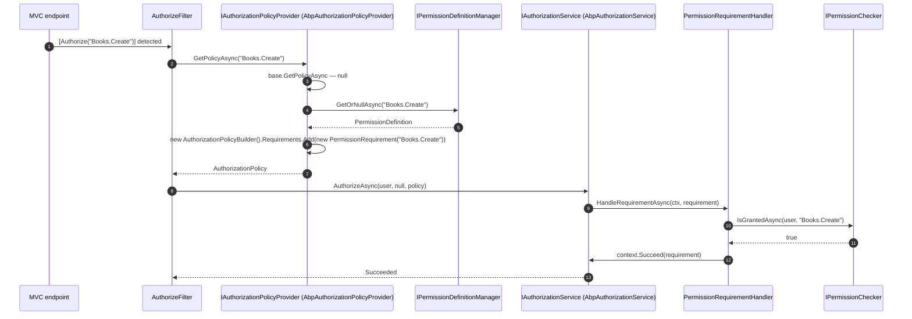

ABP treats every **permission name** as if it were a registered ASP.NET Core policy. That single convention — implemented in `AbpAuthorizationPolicyProvider` — is what lets you write `[Authorize("Books.Create")]` on a controller, a Razor page, or an application service without ever calling `AddPolicy(...)`. This page explains the convention, the attribute classes ABP relies on, the dynamic-proxy interceptor that re-evaluates them outside MVC, and the requirement handlers that turn the result back into an `IPermissionChecker` call.

For the surrounding pieces, see [Authorization stack overview](/authz/overview), [Authorization handlers](/authz/authorization-handlers), and [Permission system](/authz/permission-system).

## The convention in one paragraph

`AbpAuthorizationPolicyProvider` extends ASP.NET Core's `DefaultAuthorizationPolicyProvider`. When asked for a policy, it first looks at policies explicitly registered with `AuthorizationOptions.AddPolicy(...)`. If none matches, it asks `IPermissionDefinitionManager` whether the policy name is a known permission. If yes, it synthesises a policy whose only requirement is `PermissionRequirement(policyName)` — and from there everything routes into `PermissionRequirementHandler` and finally `IPermissionChecker.IsGrantedAsync`.

```csharp framework/src/Volo.Abp.Authorization/Volo/Abp/Authorization/AbpAuthorizationPolicyProvider.cs
public override async Task<AuthorizationPolicy?> GetPolicyAsync(string policyName)
{
    var policy = await base.GetPolicyAsync(policyName);
    if (policy != null) { return policy; }

    var permission = await _permissionDefinitionManager.GetOrNullAsync(policyName);
    if (permission != null)
    {
        var policyBuilder = new AuthorizationPolicyBuilder(Array.Empty<string>());
        policyBuilder.Requirements.Add(new PermissionRequirement(policyName));
        return policyBuilder.Build();
    }

    return null;
}
```

That's the entire integration. Permission names **are** policy names; no double registration.

## Attribute landscape

| Attribute | Origin | What it does |
| --- | --- | --- |
| `[Authorize]` | `Microsoft.AspNetCore.Authorization` | Marks a type/method as requiring authentication. With a `Policy = "X"`, also requires that policy to succeed. |
| `[Authorize("PermissionName")]` | ASP.NET Core (same attribute, positional `Policy`) | The idiomatic ABP form: the policy name **is** a permission name. |
| `[AllowAnonymous]` | `Microsoft.AspNetCore.Authorization` | Short-circuits both the MVC pipeline and `MethodInvocationAuthorizationService.AllowAnonymous`. |
| `[RemoteService]` | `Volo.Abp.AspNetCore.Mvc` | Marks a controller as an auto-generated remote service. Combined with `[Authorize]` it gates HTTP API endpoints. |
| `[DisableAuditing]`, `[UnitOfWork]`, etc. | ABP framework | Unrelated to authorization, but commonly seen on the same method — they don't influence the policy provider. |

`IAuthorizeData` is the interface ASP.NET Core uses to describe authorization metadata. Both `[Authorize]` and any custom attribute can implement it; ABP's interceptor collects every `IAuthorizeData` on the target method **and** its declaring type and unions them through `AuthorizationPolicy.CombineAsync`.

<Info>
ABP does **not** expose a separate `[RequirePermissions]` attribute in this repository. The framework relies on `[Authorize(policyName)]` with the policy-name-as-permission-name convention plus `PermissionsRequirement` / `PermissionsRequirementHandler` for batch checks initiated from code. The dynamic-proxy interceptor handles attribute discovery exactly the way MVC does.
</Info>

## Where `[Authorize]` can be placed

ABP enforces `[Authorize]` in **two** independent paths:

1. **MVC / Razor / SignalR**: the standard ASP.NET Core pipeline reads the attribute via the `IAuthorizeData` collection on the endpoint, asks `IAuthorizationPolicyProvider` (which is `AbpAuthorizationPolicyProvider`) for a policy, and runs `IAuthorizationService`.
2. **Dynamic proxy interception**: when an application service method (or its class) carries `[Authorize]`, `AuthorizationInterceptorRegistrar` attaches `AuthorizationInterceptor` at DI registration time. The interceptor re-runs the check every time the service is invoked — even from another service, a background job, or a domain event handler.

The interceptor selection rule:

```csharp framework/src/Volo.Abp.Authorization/Volo/Abp/Authorization/AuthorizationInterceptorRegistrar.cs
private static bool ShouldIntercept(Type type)
{
    return !DynamicProxyIgnoreTypes.Contains(type) &&
           (type.IsDefined(typeof(AuthorizeAttribute), true) ||
            AnyMethodHasAuthorizeAttribute(type));
}
```

The implication: if your application service or domain service carries `[Authorize]` anywhere (class- or method-level), every call is checked. There is no need to "switch on" authorization for services beyond placing the attribute.

## Combining attribute and policy

Because ASP.NET Core honours `IAuthorizeData` (any attribute implementing it), the interceptor only needs `IAuthorizeData` plumbing — no special-cased ABP attribute is required. The code below from `MethodInvocationAuthorizationService` is the canonical reference:

```csharp framework/src/Volo.Abp.Authorization/Volo/Abp/Authorization/MethodInvocationAuthorizationService.cs
public async Task CheckAsync(MethodInvocationAuthorizationContext context)
{
    if (AllowAnonymous(context)) return;

    var authorizationPolicy = await AuthorizationPolicy.CombineAsync(
        _abpAuthorizationPolicyProvider,
        GetAuthorizationDataAttributes(context.Method));

    if (authorizationPolicy == null) return;

    await _abpAuthorizationService.CheckAsync(authorizationPolicy);
}

protected virtual IEnumerable<IAuthorizeData> GetAuthorizationDataAttributes(MethodInfo methodInfo)
{
    var attributes = methodInfo.GetCustomAttributes(true).OfType<IAuthorizeData>();

    if (methodInfo.IsPublic && methodInfo.DeclaringType != null)
    {
        attributes = attributes.Union(
            methodInfo.DeclaringType.GetCustomAttributes(true).OfType<IAuthorizeData>());
    }
    return attributes;
}
```

`AuthorizationPolicy.CombineAsync` calls `IAuthorizationPolicyProvider.GetPolicyAsync(policyName)` for each `IAuthorizeData.Policy` — and that is precisely where `AbpAuthorizationPolicyProvider.GetPolicyAsync` synthesises a `PermissionRequirement` if the name is a known permission.

## How a policy becomes a requirement



The same diagram applies to the interceptor path; just replace "MVC endpoint / AuthorizeFilter" with "DI proxy / AuthorizationInterceptor / MethodInvocationAuthorizationService".

## Calling the API imperatively

When you can't or don't want to put `[Authorize]` on a method, call `IAuthorizationService` directly. The extension methods in `framework/src/Volo.Abp.Authorization/Microsoft/AspNetCore/Authorization/AbpAuthorizationServiceExtensions.cs` hide the `ClaimsPrincipal` plumbing:

```csharp Application/MyAppService.cs
public class BookAppService : ApplicationService
{
    public async Task PublishAsync(Guid bookId)
    {
        // throw AbpAuthorizationException if the policy fails
        await AuthorizationService.CheckAsync("Books.Publish");

        // boolean form
        if (await AuthorizationService.IsGrantedAsync("Books.Edit"))
        {
            // …
        }

        // "any of"
        if (await AuthorizationService.IsGrantedAnyAsync("Books.Edit", "Books.Publish"))
        {
            // …
        }
    }
}
```

Under the hood:

```csharp framework/src/Volo.Abp.Authorization/Microsoft/AspNetCore/Authorization/AbpAuthorizationServiceExtensions.cs
public static async Task<bool> IsGrantedAnyAsync(
    this IAuthorizationService authorizationService, params string[] policyNames)
{
    Check.NotNullOrEmpty(policyNames, nameof(policyNames));
    foreach (var policyName in policyNames)
    {
        if ((await authorizationService.AuthorizeAsync(policyName)).Succeeded) return true;
    }
    return false;
}

public static async Task CheckAsync(this IAuthorizationService authorizationService, string policyName)
{
    if (!await authorizationService.IsGrantedAsync(policyName))
    {
        throw new AbpAuthorizationException(
                code: AbpAuthorizationErrorCodes.GivenPolicyHasNotGrantedWithPolicyName)
            .WithData("PolicyName", policyName);
    }
}
```

`AbpAuthorizationException` is localized via `Volo.Authorization:010002` (see `AbpAuthorizationErrorCodes`).

### Bypassing checks deliberately

There are two clean ways to bypass checks for an `Authorize`-decorated service:

- `using (CurrentPrincipalAccessor.Change(...))` — temporarily set a different principal (for example, a system identity).
- For test hosts and the data-migration host, call `services.AddAlwaysAllowAuthorization()`:

```csharp framework/src/Volo.Abp.Authorization/Microsoft/Extensions/DependencyInjection/AbpAuthorizationServiceCollectionExtensions.cs
public static IServiceCollection AddAlwaysAllowAuthorization(this IServiceCollection services)
{
    services.Replace(ServiceDescriptor.Singleton<IAuthorizationService, AlwaysAllowAuthorizationService>());
    services.Replace(ServiceDescriptor.Singleton<IAbpAuthorizationService, AlwaysAllowAuthorizationService>());
    services.Replace(ServiceDescriptor.Singleton<IMethodInvocationAuthorizationService, AlwaysAllowMethodInvocationAuthorizationService>());
    return services.Replace(ServiceDescriptor.Singleton<IPermissionChecker, AlwaysAllowPermissionChecker>());
}
```

<Warning>
`AddAlwaysAllowAuthorization()` short-circuits **every** check, including prohibitions and tenant boundaries. Never call it from a production host.
</Warning>

## Defining the permission you want to `[Authorize]` against

`[Authorize("Books.Create")]` works only if `"Books.Create"` is registered as a `PermissionDefinition`. Define one with a `PermissionDefinitionProvider`:

```csharp Application.Contracts/Permissions/BooksPermissionDefinitionProvider.cs
public class BooksPermissionDefinitionProvider : PermissionDefinitionProvider
{
    public override void Define(IPermissionDefinitionContext context)
    {
        var booksGroup = context.AddGroup("Books", L("Permission:Books"));

        var books = booksGroup.AddPermission("Books", L("Permission:Books"));
        books.AddChild("Books.Create",  L("Permission:Books.Create"));
        books.AddChild("Books.Edit",    L("Permission:Books.Edit"));
        books.AddChild("Books.Delete",  L("Permission:Books.Delete"));
        books.AddChild("Books.Publish", L("Permission:Books.Publish"))
             .RequireAuthenticated();   // also needs authentication
    }

    private static LocalizableString L(string name)
        => LocalizableString.Create<MyResource>(name);
}
```

The provider is auto-discovered via the `OnRegistered` callback in `AbpAuthorizationModule.PreConfigureServices`, so you do not need to add it to any options list yourself (see [Permission system](/authz/permission-system) for the auto-collection details).

## Working with `PermissionsRequirement`

`PermissionRequirement` carries one name; `PermissionsRequirement` carries many, with `RequiresAll` deciding "all" vs. "any":

```csharp framework/src/Volo.Abp.Authorization.Abstractions/Volo/Abp/Authorization/PermissionsRequirement.cs
public class PermissionsRequirement : IAuthorizationRequirement
{
    public string[] PermissionNames { get; }
    public bool     RequiresAll    { get; }
    // …
}
```

`PermissionsRequirementHandler` dispatches the batch check:

```csharp framework/src/Volo.Abp.Authorization.Abstractions/Volo/Abp/Authorization/PermissionsRequirementHandler.cs
protected override async Task HandleRequirementAsync(
    AuthorizationHandlerContext context, PermissionsRequirement requirement)
{
    var multi = await _permissionChecker.IsGrantedAsync(context.User, requirement.PermissionNames);

    if (requirement.RequiresAll
            ? multi.AllGranted
            : multi.Result.Any(x => x.Value == PermissionGrantResult.Granted))
    {
        context.Succeed(requirement);
    }
}
```

You can plug this into a custom policy from an `AbpModule`:

```csharp Application/MyModule.cs
public override void ConfigureServices(ServiceConfigurationContext context)
{
    context.Services.AddAuthorization(options =>
    {
        options.AddPolicy("Books.ReadOrWrite", policy =>
            policy.Requirements.Add(new PermissionsRequirement(
                new[] { "Books.View", "Books.Edit" }, requiresAll: false)));
    });
}
```

Then `[Authorize("Books.ReadOrWrite")]` succeeds for anyone who has either `"Books.View"` **or** `"Books.Edit"`.

## Using `[Authorize]` outside controllers

Three common scenarios where the interceptor takes the wheel:

<Tabs>
  <Tab title="Application service">
    ```csharp Application/BookAppService.cs
    [Authorize("Books.Default")]
    public class BookAppService : ApplicationService
    {
        [Authorize("Books.Create")]
        public virtual Task<BookDto> CreateAsync(CreateBookDto input) { /* … */ }

        [AllowAnonymous]
        public virtual Task<List<BookDto>> ListPublicAsync() { /* … */ }
    }
    ```
    The class-level attribute applies to every method; `[Authorize("Books.Create")]` adds an extra requirement for the `Create` method; `[AllowAnonymous]` opts `ListPublicAsync` out entirely (`MethodInvocationAuthorizationService.AllowAnonymous`).
  </Tab>
  <Tab title="Domain service">
    ```csharp Domain/Books/BookManager.cs
    [Authorize("Books.Manage")]
    public class BookManager : DomainService
    {
        public virtual Task PublishAsync(Book book) { /* … */ }
    }
    ```
    The dynamic-proxy interceptor still applies. If the caller doesn't carry `"Books.Manage"`, the method throws before its body runs.
  </Tab>
  <Tab title="Background job / event handler">
    ```csharp Application/Books/BookExportJob.cs
    public class BookExportJob : IBackgroundJob<ExportArgs>, ITransientDependency
    {
        private readonly IAbpAuthorizationService _auth;
        public BookExportJob(IAbpAuthorizationService auth) => _auth = auth;

        public async Task ExecuteAsync(ExportArgs args)
        {
            // Background jobs don't carry a request principal — set one explicitly.
            await _auth.CheckAsync("Books.Export");
        }
    }
    ```
    For workers that run with a synthetic identity, change the current principal with `ICurrentPrincipalAccessor.Change(...)` before calling `CheckAsync`.
  </Tab>
</Tabs>

## Razor pages

ABP integrates with Razor pages and MVC views through ASP.NET Core's `IAuthorizationService`. Two idiomatic uses:

```cshtml
@inject Microsoft.AspNetCore.Authorization.IAuthorizationService Authorization

@if ((await Authorization.AuthorizeAsync("Books.Create")).Succeeded)
{
    <a asp-page="./Create">Create book</a>
}
```

The familiar `[Authorize("Books.Create")]` works on `PageModel` classes too — same convention, same policy provider, same requirement handler.

## Enumerating policies

The policy provider exposes a useful surface for the Permission Management UI:

```csharp framework/src/Volo.Abp.Authorization.Abstractions/Volo/Abp/Authorization/IAbpAuthorizationPolicyProvider.cs
public interface IAbpAuthorizationPolicyProvider : IAuthorizationPolicyProvider
{
    Task<List<string>> GetPoliciesNamesAsync();
}
```

The implementation unions explicit policies with every permission name:

```csharp framework/src/Volo.Abp.Authorization/Volo/Abp/Authorization/AbpAuthorizationPolicyProvider.cs
public async Task<List<string>> GetPoliciesNamesAsync()
{
    return _options.GetPoliciesNames()
        .Union((await _permissionDefinitionManager.GetPermissionsAsync()).Select(p => p.Name))
        .ToList();
}
```

`AuthorizationOptions.GetPoliciesNames()` itself uses reflection against `AuthorizationOptions.PolicyMap` — see `Microsoft/AspNetCore/Authorization/AuthorizationOptionsExtensions.cs` for the helper:

```csharp framework/src/Volo.Abp.Authorization/Microsoft/AspNetCore/Authorization/AuthorizationOptionsExtensions.cs
private static readonly PropertyInfo PolicyMapProperty = typeof(AuthorizationOptions)
    .GetProperty("PolicyMap", BindingFlags.Instance | BindingFlags.NonPublic)!;

public static List<string> GetPoliciesNames(this AuthorizationOptions options)
{
    return ((IDictionary<string, Task<AuthorizationPolicy>>)PolicyMapProperty.GetValue(options)!).Keys.ToList();
}
```

(That `// IMPORTANT NOTE` comment in the source explains the reflection caveat.)

## Common patterns and pitfalls

<AccordionGroup>
  <Accordion title="Combining class-level and method-level attributes">
    `MethodInvocationAuthorizationService.GetAuthorizationDataAttributes` unions both **for public methods**. If you want a method-level override to *replace* the class-level rule, mark the method `[AllowAnonymous]` or split the methods across two services.
  </Accordion>
  <Accordion title="`[Authorize]` with no policy name">
    Acts exactly like ASP.NET Core: requires authentication. There is no permission requirement attached. Useful for "authenticated users only" surfaces.
  </Accordion>
  <Accordion title="Why my custom policy isn't being used by ABP">
    `AbpAuthorizationPolicyProvider` always calls `base.GetPolicyAsync(policyName)` first. So `AddPolicy("X", …)` wins over the permission convention if both exist. Order of registration **does not** matter.
  </Accordion>
  <Accordion title="My interceptor doesn't fire">
    Check the registration: ABP intercepts only types resolved by ABP's DI conventions. Manually `new`-ing a service bypasses the proxy; ensure the consumer resolves the interface through DI. Also confirm that the type is not in `DynamicProxyIgnoreTypes`.
  </Accordion>
  <Accordion title="Permission name not found at runtime">
    `AbpAuthorizationPolicyProvider.GetPolicyAsync` returns `null` if the name isn't a registered permission, which then bubbles up as ASP.NET Core's `InvalidOperationException("The AuthorizationPolicy named: 'X' was not found.")`. Make sure your `PermissionDefinitionProvider` is being discovered (a class that derives from `PermissionDefinitionProvider` and lives in a referenced module is enough).
  </Accordion>
</AccordionGroup>

## What ships *vs.* what you build

| Concept | Ships in framework? | File |
| --- | --- | --- |
| `[Authorize]` | Yes (ASP.NET Core) | — |
| Policy name = permission name | Yes | `AbpAuthorizationPolicyProvider.cs` |
| Interceptor for non-MVC paths | Yes | `AuthorizationInterceptor.cs` |
| Attribute discovery (`IAuthorizeData`) | Yes | `MethodInvocationAuthorizationService.cs` |
| `PermissionRequirement` / `PermissionRequirementHandler` | Yes | `PermissionRequirement.cs`, `PermissionRequirementHandler.cs` |
| `PermissionsRequirement` / `PermissionsRequirementHandler` | Yes | `PermissionsRequirement.cs`, `PermissionsRequirementHandler.cs` |
| Custom requirement type | You build | n/a |
| Custom `IAuthorizationHandler<PermissionRequirement>` | You build | n/a |

## Related reading

<CardGroup cols={2}>
  <Card title="Stack overview" icon="diagram-project" href="/authz/overview">
    Where the policy provider sits in the wider picture.
  </Card>
  <Card title="Authorization handlers" icon="gear" href="/authz/authorization-handlers">
    `IAbpAuthorizationService`, the interceptor, and requirement handlers.
  </Card>
  <Card title="Permission system" icon="key" href="/authz/permission-system">
    How a permission name resolves to a grant decision.
  </Card>
  <Card title="Permission Management module" icon="database" href="/authz/permission-management-module">
    Where the grants behind the policy decision live.
  </Card>
  <Card title="Simple state checking" icon="circle-check" href="/authz/simple-state-checking">
    Per-permission gates such as `RequireAuthenticated()` and `RequirePermissions(...)`.
  </Card>
  <Card title="Authentication" icon="user-shield" href="/auth/overview">
    Where the `ClaimsPrincipal` evaluated by these policies comes from.
  </Card>
</CardGroup>
