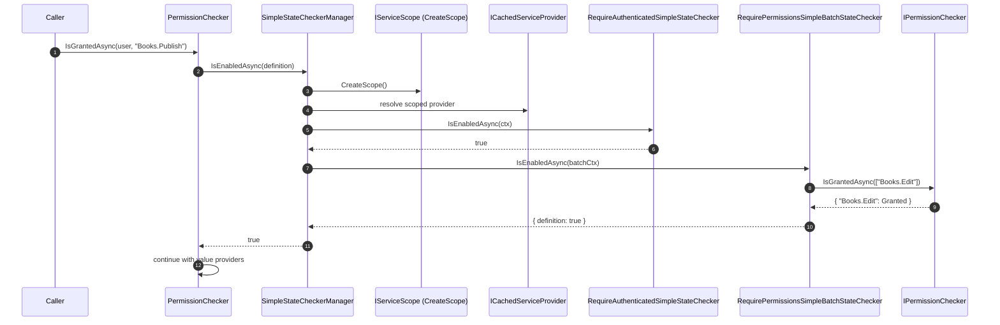

`Volo.Abp.SimpleStateChecking` is one of the smallest yet most reused abstractions in ABP. It defines a generic `IsEnabledAsync(state)` evaluator that operates on any state object implementing `IHasSimpleStateCheckers<T>`. The same mechanism gates a `PermissionDefinition` ("only available when the user is authenticated and has X"), a feature ("only available when this other feature is on"), and — through analogous infrastructure — settings and global features. This page documents every file in `framework/src/Volo.Abp.Core/Volo/Abp/SimpleStateChecking` and shows how the [Permission system](/authz/permission-system) plugs into it.

## File inventory

| File | Role |
| --- | --- |
| `IHasSimpleStateCheckers.cs` | Marker interface — states expose `List<ISimpleStateChecker<TState>> StateCheckers`. |
| `ISimpleStateChecker.cs` | Per-state checker contract (`IsEnabledAsync(SimpleStateCheckerContext<TState>)`). |
| `ISimpleBatchStateChecker.cs` | Batch variant (`IsEnabledAsync(SimpleBatchStateCheckerContext<TState>)`). |
| `SimpleBatchStateCheckerBase.cs` | Abstract base that downgrades a batch check to a single-state check. |
| `ISimpleStateCheckerManager.cs` | Orchestrator interface — single and batch overloads. |
| `SimpleStateCheckerManager.cs` | Default implementation, scope-aware. |
| `SimpleStateCheckerContext.cs` | Carries `IServiceProvider` + the single `TState`. |
| `SimpleBatchStateCheckerContext.cs` | Carries `IServiceProvider` + the `TState[]`. |
| `SimpleStateCheckerResult.cs` | `Dictionary<TState, bool>` returned by batch evaluation. |
| `AbpSimpleStateCheckerOptions.cs` | Holds **global** checkers per state type. |
| `ISimpleStateCheckerSerializer.cs` | Serializer abstraction (used when state checkers need to be persisted). |
| `SimpleStateCheckerSerializer.cs` | Default implementation — fan-out over `ISimpleStateCheckerSerializerContributor`. |
| `ISimpleStateCheckerSerializerContributor.cs` | Plug-in per checker type. |
| `SimpleStateCheckerSerializerExtensions.cs` | Convenience overloads. |

The supporting types — `RequirePermissionsSimpleStateChecker`, `RequirePermissionsSimpleBatchStateChecker`, `RequireAuthenticatedSimpleStateChecker`, the JSON serializer contributors — live alongside the permission system in `framework/src/Volo.Abp.Authorization/Volo/Abp/Authorization/Permissions/`.

## The state contract

A state is anything that holds a `List<ISimpleStateChecker<T>>`:

```csharp framework/src/Volo.Abp.Core/Volo/Abp/SimpleStateChecking/IHasSimpleStateCheckers.cs
public interface IHasSimpleStateCheckers<TState>
    where TState : IHasSimpleStateCheckers<TState>
{
    List<ISimpleStateChecker<TState>> StateCheckers { get; }
}
```

The generic CRTP (`TState : IHasSimpleStateCheckers<TState>`) keeps the manager strongly typed: a `PermissionDefinition` checker can never accidentally see a `FeatureDefinition`.

`PermissionDefinition` is the canonical example:

```csharp framework/src/Volo.Abp.Authorization.Abstractions/Volo/Abp/Authorization/Permissions/PermissionDefinition.cs
public class PermissionDefinition :
    IHasSimpleStateCheckers<PermissionDefinition>,
    ICanAddChildPermission
{
    public List<ISimpleStateChecker<PermissionDefinition>> StateCheckers { get; }
    // …
    protected internal PermissionDefinition(/* … */)
    {
        // …
        StateCheckers = new List<ISimpleStateChecker<PermissionDefinition>>();
    }
}
```

The setting and feature systems mirror the pattern with `SettingDefinition` and `FeatureDefinition`. See [Features overview](/settings-features/features-overview) and [Settings overview](/settings-features/settings-overview).

## The checker contracts

```csharp framework/src/Volo.Abp.Core/Volo/Abp/SimpleStateChecking/ISimpleStateChecker.cs
public interface ISimpleStateChecker<TState>
    where TState : IHasSimpleStateCheckers<TState>
{
    Task<bool> IsEnabledAsync(SimpleStateCheckerContext<TState> context);
}
```

```csharp framework/src/Volo.Abp.Core/Volo/Abp/SimpleStateChecking/ISimpleBatchStateChecker.cs
public interface ISimpleBatchStateChecker<TState> : ISimpleStateChecker<TState>
    where TState : IHasSimpleStateCheckers<TState>
{
    Task<SimpleStateCheckerResult<TState>> IsEnabledAsync(SimpleBatchStateCheckerContext<TState> context);
}
```

The batch variant exists so a checker that wants to evaluate `N` states can do it with one round trip (one cache call, one repository read). `SimpleBatchStateCheckerBase` provides a degenerate implementation of the single-state overload that just wraps the state into a one-element array:

```csharp framework/src/Volo.Abp.Core/Volo/Abp/SimpleStateChecking/SimpleBatchStateCheckerBase.cs
public abstract class SimpleBatchStateCheckerBase<TState> : ISimpleBatchStateChecker<TState>
    where TState : IHasSimpleStateCheckers<TState>
{
    public async Task<bool> IsEnabledAsync(SimpleStateCheckerContext<TState> context)
    {
        return (await IsEnabledAsync(
            new SimpleBatchStateCheckerContext<TState>(
                context.ServiceProvider, new[] { context.State })))
            .Values.All(x => x);
    }

    public abstract Task<SimpleStateCheckerResult<TState>> IsEnabledAsync(
        SimpleBatchStateCheckerContext<TState> context);
}
```

## The contexts

`SimpleStateCheckerContext` and `SimpleBatchStateCheckerContext` are dirt-simple immutable records:

```csharp framework/src/Volo.Abp.Core/Volo/Abp/SimpleStateChecking/SimpleStateCheckerContext.cs
public class SimpleStateCheckerContext<TState>
    where TState : IHasSimpleStateCheckers<TState>
{
    public IServiceProvider ServiceProvider { get; }
    public TState State { get; }

    public SimpleStateCheckerContext(IServiceProvider serviceProvider, TState state)
    {
        ServiceProvider = serviceProvider;
        State = state;
    }
}
```

```csharp framework/src/Volo.Abp.Core/Volo/Abp/SimpleStateChecking/SimpleBatchStateCheckerContext.cs
public class SimpleBatchStateCheckerContext<TState>
    where TState : IHasSimpleStateCheckers<TState>
{
    public IServiceProvider ServiceProvider { get; }
    public TState[] States { get; }
    // …
}
```

The `ServiceProvider` is the **scoped** provider created by the manager (see below), so checkers can resolve scoped services like `ICurrentUser`, `ICurrentTenant`, or `ISettingProvider` without leaking lifetimes.

## The result

```csharp framework/src/Volo.Abp.Core/Volo/Abp/SimpleStateChecking/SimpleStateCheckerResult.cs
public class SimpleStateCheckerResult<TState> : Dictionary<TState, bool>
    where TState : IHasSimpleStateCheckers<TState>
{
    public SimpleStateCheckerResult() {}

    public SimpleStateCheckerResult(IEnumerable<TState> states, bool initValue = true)
    {
        foreach (var state in states) { Add(state, initValue); }
    }
}
```

A `SimpleStateCheckerResult<TState>` is a per-state `bool` map. The default `initValue = true` matches the semantics of "every state is enabled until proven otherwise" used by `SimpleStateCheckerManager`.

## The options

```csharp framework/src/Volo.Abp.Core/Volo/Abp/SimpleStateChecking/AbpSimpleStateCheckerOptions.cs
public class AbpSimpleStateCheckerOptions<TState>
    where TState : IHasSimpleStateCheckers<TState>
{
    public ITypeList<ISimpleStateChecker<TState>> GlobalStateCheckers { get; }
    public AbpSimpleStateCheckerOptions()
        => GlobalStateCheckers = new TypeList<ISimpleStateChecker<TState>>();
}
```

`GlobalStateCheckers` is the **per-state-type** list that the manager applies on top of whatever a state declares for itself. The framework registers `AbpSimpleStateCheckerOptions<PermissionDefinition>`, `AbpSimpleStateCheckerOptions<FeatureDefinition>`, etc. as separate options instances.

To add a checker that should run for **every** permission, add the type to `GlobalStateCheckers` in your module:

```csharp Application/MyModule.cs
Configure<AbpSimpleStateCheckerOptions<PermissionDefinition>>(options =>
{
    options.GlobalStateCheckers.Add<TenantIsActiveSimpleStateChecker>();
});
```

## The manager

```csharp framework/src/Volo.Abp.Core/Volo/Abp/SimpleStateChecking/ISimpleStateCheckerManager.cs
public interface ISimpleStateCheckerManager<TState>
    where TState : IHasSimpleStateCheckers<TState>
{
    Task<bool> IsEnabledAsync(TState state);
    Task<SimpleStateCheckerResult<TState>> IsEnabledAsync(TState[] states);
}
```

`SimpleStateCheckerManager<TState>` is the workhorse. The single-state overload is the simplest to read first:

```csharp framework/src/Volo.Abp.Core/Volo/Abp/SimpleStateChecking/SimpleStateCheckerManager.cs
public virtual async Task<bool> IsEnabledAsync(TState state)
{
    return await InternalIsEnabledAsync(state, true);
}

protected virtual async Task<bool> InternalIsEnabledAsync(TState state, bool useBatchChecker)
{
    using (var scope = ServiceProvider.CreateScope())
    {
        var context = new SimpleStateCheckerContext<TState>(
            scope.ServiceProvider.GetRequiredService<ICachedServiceProvider>(), state);

        foreach (var provider in state.StateCheckers
            .WhereIf(!useBatchChecker, x => x is not ISimpleBatchStateChecker<TState>))
        {
            if (!await provider.IsEnabledAsync(context)) return false;
        }

        foreach (ISimpleStateChecker<TState> provider in Options.GlobalStateCheckers
            .WhereIf(!useBatchChecker,
                     x => !typeof(ISimpleBatchStateChecker<TState>).IsAssignableFrom(x))
            .Select(x => ServiceProvider.GetRequiredService(x)))
        {
            if (!await provider.IsEnabledAsync(context)) return false;
        }

        return true;
    }
}
```

Two important details:

- The context uses `ICachedServiceProvider`, which **caches** resolutions inside the scope. A checker that calls `context.ServiceProvider.GetRequiredService<ICurrentTenant>()` twice doesn't pay twice.
- The first `false` short-circuits the whole evaluation — "any checker says no" wins.

### Batch evaluation

The batch overload is more interesting because it has to honour the distinction between batch checkers (which group identical instances) and non-batch checkers:

```csharp framework/src/Volo.Abp.Core/Volo/Abp/SimpleStateChecking/SimpleStateCheckerManager.cs
public virtual async Task<SimpleStateCheckerResult<TState>> IsEnabledAsync(TState[] states)
{
    var result = new SimpleStateCheckerResult<TState>(states);

    using (var scope = ServiceProvider.CreateScope())
    {
        // 1) group batch checkers across all states
        var batchStateCheckers = states.SelectMany(x => x.StateCheckers)
            .Where(x => x is ISimpleBatchStateChecker<TState>)
            .Cast<ISimpleBatchStateChecker<TState>>()
            .GroupBy(x => x)
            .Select(x => x.Key);

        foreach (var stateChecker in batchStateCheckers)
        {
            var context = new SimpleBatchStateCheckerContext<TState>(
                scope.ServiceProvider.GetRequiredService<ICachedServiceProvider>(),
                states.Where(x => x.StateCheckers.Contains(stateChecker)).ToArray());

            foreach (var x in await stateChecker.IsEnabledAsync(context))
                result[x.Key] = x.Value;

            if (result.Values.All(x => !x)) return result;     // everyone disabled — bail
        }

        // 2) apply global batch checkers — but only over states still enabled
        foreach (ISimpleBatchStateChecker<TState> globalStateChecker in Options.GlobalStateCheckers
            .Where(x => typeof(ISimpleBatchStateChecker<TState>).IsAssignableFrom(x))
            .Select(x => ServiceProvider.GetRequiredService(x)))
        {
            var context = new SimpleBatchStateCheckerContext<TState>(
                scope.ServiceProvider.GetRequiredService<ICachedServiceProvider>(),
                states.Where(x => result.Any(y => y.Key.Equals(x) && y.Value)).ToArray());

            foreach (var x in await globalStateChecker.IsEnabledAsync(context))
                result[x.Key] = x.Value;
        }

        // 3) finally, evaluate non-batch checkers per-state for whoever is still enabled
        foreach (var state in states)
        {
            if (result[state])
                result[state] = await InternalIsEnabledAsync(state, false);
        }

        return result;
    }
}
```

In short: batch checkers run **first** and in bulk; then global batch checkers; then any per-state non-batch checker fills in the gaps. This is what lets `PermissionAppService.GetAsync(...)` evaluate every visible permission for a subject without making one DB hit per permission.

## Permission-side adapters

The Authorization assembly contributes three checkers that show how to use the manager from real code.

### `RequireAuthenticatedSimpleStateChecker`

```csharp framework/src/Volo.Abp.Authorization/Volo/Abp/Authorization/Permissions/RequireAuthenticatedSimpleStateChecker.cs
public class RequireAuthenticatedSimpleStateChecker<TState> : ISimpleStateChecker<TState>
    where TState : IHasSimpleStateCheckers<TState>
{
    public Task<bool> IsEnabledAsync(SimpleStateCheckerContext<TState> context)
    {
        return Task.FromResult(
            context.ServiceProvider.GetRequiredService<ICurrentUser>().IsAuthenticated);
    }
}
```

Add it to a permission via `permission.RequireAuthenticated()`.

### `RequirePermissionsSimpleStateChecker` / `RequirePermissionsSimpleBatchStateChecker`

The first is a per-state checker; the second batches the check across many states using the same `IPermissionChecker`. The non-batch variant:

```csharp framework/src/Volo.Abp.Authorization/Volo/Abp/Authorization/Permissions/RequirePermissionsSimpleStateChecker.cs
public class RequirePermissionsSimpleStateChecker<TState> : ISimpleStateChecker<TState>
    where TState : IHasSimpleStateCheckers<TState>
{
    public bool   RequiresAll      => _model.RequiresAll;
    public string[] PermissionNames => _model.Permissions;

    public async Task<bool> IsEnabledAsync(SimpleStateCheckerContext<TState> context)
    {
        var permissionChecker = context.ServiceProvider.GetRequiredService<IPermissionChecker>();

        if (_model.Permissions.Length == 1)
            return await permissionChecker.IsGrantedAsync(_model.Permissions.First());

        var grantResult = await permissionChecker.IsGrantedAsync(_model.Permissions);
        return _model.RequiresAll
            ? grantResult.AllGranted
            : grantResult.Result.Any(x => _model.Permissions.Contains(x.Key) &&
                                          x.Value == PermissionGrantResult.Granted);
    }
}
```

### Fluent extensions

The `PermissionSimpleStateCheckerExtensions` static class provides the call-site sugar:

```csharp framework/src/Volo.Abp.Authorization/Volo/Abp/Authorization/Permissions/PermissionSimpleStateCheckerExtensions.cs
public static TState RequireAuthenticated<TState>([NotNull] this TState state)
    where TState : IHasSimpleStateCheckers<TState>
{
    state.StateCheckers.Add(new RequireAuthenticatedSimpleStateChecker<TState>());
    return state;
}

public static TState RequirePermissions<TState>(
    [NotNull] this TState state,
    params string[] permissions)
    where TState : IHasSimpleStateCheckers<TState>
{
    state.RequirePermissions(requiresAll: true, batchCheck: true, permissions);
    return state;
}

public static TState RequirePermissions<TState>(
    [NotNull] this TState state, bool requiresAll, bool batchCheck, params string[] permissions)
    where TState : IHasSimpleStateCheckers<TState>
{
    Check.NotNull(state, nameof(state));
    Check.NotNullOrEmpty(permissions, nameof(permissions));

    if (batchCheck)
    {
        RequirePermissionsSimpleBatchStateChecker<TState>.Current
            .AddCheckModels(new RequirePermissionsSimpleBatchStateCheckerModel<TState>(state, permissions, requiresAll));
        state.StateCheckers.Add(RequirePermissionsSimpleBatchStateChecker<TState>.Current);
    }
    else
    {
        // non-batch path — add a fresh per-state checker
    }
}
```

The clever bit is that the batch checker is a singleton-per-async-flow (`AsyncLocal`), so multiple `RequirePermissions(...)` calls on different definitions all funnel into one batch request — `SimpleStateCheckerManager` then de-duplicates by checker instance using `GroupBy(x => x)` and issues exactly one bulk check per provider per evaluation.

## Where the framework consumes the manager

<CardGroup cols={2}>
  <Card title="Permissions" icon="key">
    `PermissionChecker.IsGrantedAsync` calls `ISimpleStateCheckerManager<PermissionDefinition>.IsEnabledAsync(definition)` **before** consulting any value provider. A failing checker means the permission is invisible to that caller.
  </Card>
  <Card title="Features" icon="toggle-on">
    `FeatureChecker` uses `ISimpleStateCheckerManager<FeatureDefinition>` so features can depend on each other. See [Features overview](/settings-features/features-overview).
  </Card>
  <Card title="Settings" icon="sliders">
    Settings re-use the pattern via `ISimpleStateCheckerManager<SettingDefinition>` to hide settings whose prerequisites aren't met. See [Settings overview](/settings-features/settings-overview).
  </Card>
  <Card title="Global features" icon="globe">
    The global feature gate that disables whole modules at build time. See [Global features](/settings-features/global-features).
  </Card>
</CardGroup>

## A worked example — gating a permission

Suppose you want `"Books.Publish"` to require authentication **and** that the principal already holds `"Books.Edit"`:

```csharp Application.Contracts/Permissions/BooksPermissionDefinitionProvider.cs
public class BooksPermissionDefinitionProvider : PermissionDefinitionProvider
{
    public override void Define(IPermissionDefinitionContext context)
    {
        var group = context.AddGroup("Books");
        group.AddPermission("Books.Edit");
        group.AddPermission("Books.Publish")
             .RequireAuthenticated()
             .RequirePermissions("Books.Edit");
    }
}
```

At check time, `PermissionChecker.IsGrantedAsync("Books.Publish")` calls `StateCheckerManager.IsEnabledAsync(definition)`. The checker list is evaluated in order; if `ICurrentUser.IsAuthenticated` is false or `Books.Edit` is not granted, the permission appears as **not granted** — no value provider is even consulted.

## Serialization

When a permission is persisted (via the dynamic store in the [Permission Management module](/authz/permission-management-module#dynamic-definitions)), its `StateCheckers` list must be written to a column. ABP delegates to `ISimpleStateCheckerSerializer`:

```csharp framework/src/Volo.Abp.Core/Volo/Abp/SimpleStateChecking/ISimpleStateCheckerSerializer.cs
public interface ISimpleStateCheckerSerializer
{
    public string? Serialize<TState>(ISimpleStateChecker<TState> checker)
        where TState : IHasSimpleStateCheckers<TState>;

    public ISimpleStateChecker<TState>? Deserialize<TState>(JsonObject jsonObject, TState state)
        where TState : IHasSimpleStateCheckers<TState>;
}
```

```csharp framework/src/Volo.Abp.Core/Volo/Abp/SimpleStateChecking/SimpleStateCheckerSerializer.cs
public class SimpleStateCheckerSerializer : ISimpleStateCheckerSerializer, ISingletonDependency
{
    private readonly IEnumerable<ISimpleStateCheckerSerializerContributor> _contributors;

    public string? Serialize<TState>(ISimpleStateChecker<TState> checker)
        where TState : IHasSimpleStateCheckers<TState>
    {
        foreach (var contributor in _contributors)
        {
            var result = contributor.SerializeToJson(checker);
            if (result != null) return result;
        }
        return null;
    }

    public ISimpleStateChecker<TState>? Deserialize<TState>(JsonObject jsonObject, TState state)
        where TState : IHasSimpleStateCheckers<TState>
    {
        foreach (var contributor in _contributors)
        {
            var result = contributor.Deserialize(jsonObject, state);
            if (result != null) return result;
        }
        return null;
    }
}
```

The Authorization assembly ships two contributors — for `RequirePermissionsSimpleStateChecker` and `RequireAuthenticatedSimpleStateChecker`:

```csharp framework/src/Volo.Abp.Authorization/Volo/Abp/Authorization/Permissions/AuthenticatedSimpleStateCheckerSerializerContributor.cs
public const string CheckerShortName = "A";

public string? SerializeToJson<TState>(ISimpleStateChecker<TState> checker)
    where TState : IHasSimpleStateCheckers<TState>
{
    if (checker is not RequireAuthenticatedSimpleStateChecker<TState>) return null;
    return new JsonObject { ["T"] = CheckerShortName }.ToJsonString();
}
```

```csharp framework/src/Volo.Abp.Authorization/Volo/Abp/Authorization/Permissions/PermissionsSimpleStateCheckerSerializerContributor.cs
public const string CheckerShortName = "P";

public string? SerializeToJson<TState>(ISimpleStateChecker<TState> checker)
    where TState : IHasSimpleStateCheckers<TState>
{
    if (checker is not RequirePermissionsSimpleStateChecker<TState> permissionsSimpleStateChecker)
        return null;

    var jsonObject = new JsonObject {
        ["T"] = CheckerShortName,
        ["A"] = permissionsSimpleStateChecker.RequiresAll
    };
    var nameArray = new JsonArray();
    foreach (var permissionName in permissionsSimpleStateChecker.PermissionNames)
        nameArray.Add(permissionName);
    jsonObject["N"] = nameArray;
    return jsonObject.ToJsonString();
}
```

The compact `{"T":"P","A":true,"N":["..."]}` and `{"T":"A"}` shapes are exactly what end up in `PermissionDefinitionRecord.StateCheckers` — see the [Permission Management module](/authz/permission-management-module#dynamic-definitions) for the storage side.

## Writing your own state checker

Three steps:

<Steps>
  <Step title="Implement ISimpleStateChecker<TState>">
    ```csharp Application/Permissions/SubscriptionActiveSimpleStateChecker.cs
    public class SubscriptionActiveSimpleStateChecker
        : ISimpleStateChecker<PermissionDefinition>
    {
        public async Task<bool> IsEnabledAsync(
            SimpleStateCheckerContext<PermissionDefinition> context)
        {
            var subs = context.ServiceProvider.GetRequiredService<ISubscriptionInfoAccessor>();
            return await subs.IsActiveAsync();
        }
    }
    ```
  </Step>
  <Step title="Plug it into a permission">
    ```csharp Application.Contracts/Permissions/MyPermissionDefinitionProvider.cs
    public override void Define(IPermissionDefinitionContext context)
    {
        var group = context.AddGroup("Billing");
        var permission = group.AddPermission("Billing.View");
        permission.StateCheckers.Add(new SubscriptionActiveSimpleStateChecker());
    }
    ```
  </Step>
  <Step title="Or register globally">
    ```csharp Application/MyModule.cs
    Configure<AbpSimpleStateCheckerOptions<PermissionDefinition>>(options =>
    {
        options.GlobalStateCheckers.Add<SubscriptionActiveSimpleStateChecker>();
    });
    ```
    The global form runs the checker for **every** permission. Use sparingly.
  </Step>
</Steps>

For checkers that need to inspect many states in one round trip, inherit from `SimpleBatchStateCheckerBase<TState>` and implement only the batch overload:

```csharp Application/Permissions/TenantActiveSimpleBatchStateChecker.cs
public class TenantActiveSimpleBatchStateChecker
    : SimpleBatchStateCheckerBase<PermissionDefinition>
{
    public override async Task<SimpleStateCheckerResult<PermissionDefinition>> IsEnabledAsync(
        SimpleBatchStateCheckerContext<PermissionDefinition> context)
    {
        var tenantSvc = context.ServiceProvider.GetRequiredService<ITenantStatusService>();
        var isActive  = await tenantSvc.IsCurrentTenantActiveAsync();

        var result = new SimpleStateCheckerResult<PermissionDefinition>(context.States);
        foreach (var state in context.States) result[state] = isActive;
        return result;
    }
}
```

## Cross-stack sequence



The take-away: state checking happens **before** the value providers from [Permission system](/authz/permission-system) — and any checker that returns `false` makes the permission disappear entirely for that caller, regardless of what grants are in the database.

## Related reading

<CardGroup cols={2}>
  <Card title="Permission system" icon="key" href="/authz/permission-system">
    How `PermissionChecker` calls the state manager before consulting value providers.
  </Card>
  <Card title="Authorization handlers" icon="gear" href="/authz/authorization-handlers">
    Where `IPermissionChecker` is invoked from ASP.NET Core's `IAuthorizationService`.
  </Card>
  <Card title="Policies & attributes" icon="lock" href="/authz/policies-and-attributes">
    How `[Authorize("X")]` becomes a `PermissionRequirement` that triggers state checking.
  </Card>
  <Card title="Features overview" icon="toggle-on" href="/settings-features/features-overview">
    Same manager, different state — `FeatureDefinition`.
  </Card>
  <Card title="Settings overview" icon="sliders" href="/settings-features/settings-overview">
    Settings also implement `IHasSimpleStateCheckers<SettingDefinition>`.
  </Card>
  <Card title="Permission Management module" icon="database" href="/authz/permission-management-module">
    Where `StateCheckers` are persisted (column `PermissionDefinitionRecord.StateCheckers`).
  </Card>
</CardGroup>
