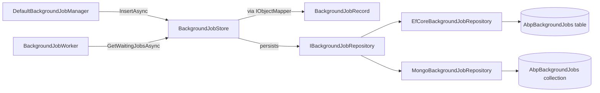

The framework's [default background-job provider](/background/default-job-manager) ships with an in-memory store that is lost on restart. For production you almost always want durable persistence. ABP provides this as a standalone **module** under `modules/background-jobs/src/` — a small, self-contained piece of DDD (an aggregate root, a repository, AutoMapper) plus EF Core and MongoDB adapter modules.

This page documents what's in that module, how it plugs into `IBackgroundJobStore`, and where the wiring sits. For the full "background-jobs application module" (UI, permissions, settings) that ABP Commercial builds on top, see the module catalog page [modules/background-jobs/overview](/modules/background-jobs/overview).

## Source layout

```text
modules/background-jobs/src/
├── Volo.Abp.BackgroundJobs.Domain.Shared/
│   ├── AbpBackgroundJobsDomainSharedModule.cs
│   └── BackgroundJobRecordConsts.cs
├── Volo.Abp.BackgroundJobs.Domain/
│   ├── AbpBackgroundJobsDomainModule.cs
│   ├── AbpBackgroundJobsDbProperties.cs
│   ├── BackgroundJobRecord.cs
│   ├── BackgroundJobStore.cs
│   ├── BackgroundJobsDomainAutoMapperProfile.cs
│   └── IBackgroundJobRepository.cs
├── Volo.Abp.BackgroundJobs.EntityFrameworkCore/
│   ├── AbpBackgroundJobsEntityFrameworkCoreModule.cs
│   ├── BackgroundJobsDbContext.cs
│   ├── BackgroundJobsDbContextModelCreatingExtensions.cs
│   ├── EfCoreBackgroundJobRepository.cs
│   └── IBackgroundJobsDbContext.cs
├── Volo.Abp.BackgroundJobs.MongoDB/
│   ├── AbpBackgroundJobsMongoDbModule.cs
│   ├── BackgroundJobsMongoDbContext.cs
│   ├── BackgroundJobsMongoDbContextExtensions.cs
│   ├── IBackgroundJobsMongoDbContext.cs
│   └── MongoBackgroundJobRepository.cs
└── Volo.Abp.BackgroundJobs.Installer/
    └── AbpBackgroundJobsInstallerModule.cs
```

Three layers, mirroring the standard ABP module template — *Domain.Shared* for constants, *Domain* for the aggregate + repository contract + store implementation, then per-provider integration modules.

## What it gives you

It bolts a real `IBackgroundJobStore` over EF Core / MongoDB, replacing the [`InMemoryBackgroundJobStore`](/background/default-job-manager) from the core `Volo.Abp.BackgroundJobs` package. The producer/worker pipeline is unchanged — your job code does not need to know which store is wired.



The default provider's worker keeps doing its polling/backoff job; only the bottom of the stack changes.

## The aggregate: BackgroundJobRecord

```csharp title="modules/background-jobs/src/Volo.Abp.BackgroundJobs.Domain/Volo/Abp/BackgroundJobs/BackgroundJobRecord.cs"
public class BackgroundJobRecord : AggregateRoot<Guid>, IHasCreationTime
{
    public virtual string JobName { get; set; }
    public virtual string JobArgs { get; set; }
    public virtual short TryCount { get; set; }
    public virtual DateTime CreationTime { get; set; }
    public virtual DateTime NextTryTime { get; set; }
    public virtual DateTime? LastTryTime { get; set; }
    public virtual bool IsAbandoned { get; set; }
    public virtual BackgroundJobPriority Priority { get; set; }

    protected BackgroundJobRecord() { }
    public BackgroundJobRecord(Guid id) : base(id) { }
}
```

It is a one-to-one mirror of `BackgroundJobInfo` from the core package — same property names, same shapes. The only differences are inheritance from `AggregateRoot<Guid>` (giving it `ConcurrencyStamp`, `ExtraProperties`, and DDD lifecycle hooks — see [Entities and aggregates](/ddd/entities-and-aggregates)) and the implementation of `IHasCreationTime` (so [auditing](/ddd/entities-and-aggregates) can populate `CreationTime`).

### Constants

```csharp title="modules/background-jobs/src/Volo.Abp.BackgroundJobs.Domain.Shared/Volo/Abp/BackgroundJobs/BackgroundJobRecordConsts.cs"
public static class BackgroundJobRecordConsts
{
    public static int MaxJobNameLength { get; set; } = 128;
    public static int MaxJobArgsLength { get; set; } = 1024 * 1024; // 1 MiB
}
```

Both are mutable statics — bump them before EF Core builds the model if your jobs exceed the defaults. After a model has been built it is too late.

## IBackgroundJobRepository

The persistence-shaped contract:

```csharp title="modules/background-jobs/src/Volo.Abp.BackgroundJobs.Domain/Volo/Abp/BackgroundJobs/IBackgroundJobRepository.cs"
public interface IBackgroundJobRepository : IBasicRepository<BackgroundJobRecord, Guid>
{
    Task<List<BackgroundJobRecord>> GetWaitingListAsync(int maxResultCount, CancellationToken cancellationToken = default);
}
```

It is `IBasicRepository<,>` — not the full `IRepository<,>` — because the worker only ever needs `FindAsync`, `InsertAsync`, `UpdateAsync`, `DeleteAsync` and the specialised waiting-list query. See [Repositories](/ddd/repositories).

## BackgroundJobStore: bridging IBackgroundJobInfo ↔ BackgroundJobRecord

This is where the `Volo.Abp.BackgroundJobs` (info-shaped) world meets the persistence (record-shaped) world. It is a `[Dependency]` replacement of `InMemoryBackgroundJobStore`.

```csharp title="modules/background-jobs/src/Volo.Abp.BackgroundJobs.Domain/Volo/Abp/BackgroundJobs/BackgroundJobStore.cs"
public class BackgroundJobStore : IBackgroundJobStore, ITransientDependency
{
    protected IBackgroundJobRepository BackgroundJobRepository { get; }
    protected IObjectMapper<AbpBackgroundJobsDomainModule> ObjectMapper { get; }

    public virtual async Task<BackgroundJobInfo> FindAsync(Guid jobId)
        => ObjectMapper.Map<BackgroundJobRecord, BackgroundJobInfo>(
            await BackgroundJobRepository.FindAsync(jobId));

    public virtual async Task InsertAsync(BackgroundJobInfo jobInfo)
        => await BackgroundJobRepository.InsertAsync(
            ObjectMapper.Map<BackgroundJobInfo, BackgroundJobRecord>(jobInfo));

    public virtual async Task<List<BackgroundJobInfo>> GetWaitingJobsAsync(int maxResultCount)
        => ObjectMapper.Map<List<BackgroundJobRecord>, List<BackgroundJobInfo>>(
            await BackgroundJobRepository.GetWaitingListAsync(maxResultCount));

    public virtual async Task DeleteAsync(Guid jobId)
        => await BackgroundJobRepository.DeleteAsync(jobId);

    public virtual async Task UpdateAsync(BackgroundJobInfo jobInfo)
    {
        var backgroundJobRecord = await BackgroundJobRepository.FindAsync(jobInfo.Id);
        if (backgroundJobRecord == null) return;
        ObjectMapper.Map(jobInfo, backgroundJobRecord);
        await BackgroundJobRepository.UpdateAsync(backgroundJobRecord);
    }
}
```

Two important details:

- `UpdateAsync` **re-reads** the record before applying the mutation. This is critical because the in-memory shape (`BackgroundJobInfo`) doesn't carry concurrency stamps; loading the persisted entity first picks up its current stamp.
- AutoMapper is scoped to the module via `IObjectMapper<AbpBackgroundJobsDomainModule>` (see [Object mapping](/ddd/object-mapping)).

### AutoMapper profile

```csharp title="modules/background-jobs/src/Volo.Abp.BackgroundJobs.Domain/Volo/Abp/BackgroundJobs/BackgroundJobsDomainAutoMapperProfile.cs"
public class BackgroundJobsDomainAutoMapperProfile : Profile
{
    public BackgroundJobsDomainAutoMapperProfile()
    {
        CreateMap<BackgroundJobInfo, BackgroundJobRecord>()
            .ConstructUsing(x => new BackgroundJobRecord(x.Id))
            .Ignore(record => record.ConcurrencyStamp)
            .Ignore(record => record.ExtraProperties);

        CreateMap<BackgroundJobRecord, BackgroundJobInfo>();
    }
}
```

`ConcurrencyStamp` is ignored because the framework manages it via EF Core; `ExtraProperties` is ignored because the in-memory info type doesn't carry one. The mapping is otherwise property-for-property.

## Domain module wiring

```csharp title="modules/background-jobs/src/Volo.Abp.BackgroundJobs.Domain/Volo/Abp/BackgroundJobs/AbpBackgroundJobsDomainModule.cs"
[DependsOn(
    typeof(AbpBackgroundJobsDomainSharedModule),
    typeof(AbpBackgroundJobsModule),
    typeof(AbpAutoMapperModule)
)]
public class AbpBackgroundJobsDomainModule : AbpModule
{
    public override void ConfigureServices(ServiceConfigurationContext context)
    {
        context.Services.AddAutoMapperObjectMapper<AbpBackgroundJobsDomainModule>();
        Configure<AbpAutoMapperOptions>(options =>
        {
            options.AddProfile<BackgroundJobsDomainAutoMapperProfile>(validate: true);
        });
    }
}
```

It depends on `AbpBackgroundJobsModule` (the core, which brings `IBackgroundJobStore`, the manager, the worker), then registers AutoMapper. The `[Dependency(ReplaceServices = true)]`-style swap is implicit through DI: because `BackgroundJobStore : IBackgroundJobStore, ITransientDependency` is registered later (transient) and the in-memory one is `ISingletonDependency`, the conventional registrar resolves the transient — but for clarity look at the EF Core / Mongo registrations below: they pull in the domain module, which is what actually puts `BackgroundJobStore` in DI.

### Database properties

```csharp title="modules/background-jobs/src/Volo.Abp.BackgroundJobs.Domain/Volo/Abp/BackgroundJobs/AbpBackgroundJobsDbProperties.cs"
public static class AbpBackgroundJobsDbProperties
{
    public static string DbTablePrefix { get; set; } = AbpCommonDbProperties.DbTablePrefix;
    public static string DbSchema { get; set; } = AbpCommonDbProperties.DbSchema;
    public const string ConnectionStringName = "AbpBackgroundJobs";
}
```

The default prefix is `Abp` — so the table/collection is `AbpBackgroundJobs` — and there is a dedicated connection-string name (`"AbpBackgroundJobs"`) you can wire to a separate database. See [Data access overview](/data/overview) for connection-string mapping.

## EF Core integration

The EF Core module registers the DbContext and repository:

```csharp title="modules/background-jobs/src/Volo.Abp.BackgroundJobs.EntityFrameworkCore/.../AbpBackgroundJobsEntityFrameworkCoreModule.cs"
[DependsOn(
    typeof(AbpBackgroundJobsDomainModule),
    typeof(AbpEntityFrameworkCoreModule)
)]
public class AbpBackgroundJobsEntityFrameworkCoreModule : AbpModule
{
    public override void ConfigureServices(ServiceConfigurationContext context)
    {
        context.Services.AddAbpDbContext<BackgroundJobsDbContext>(options =>
        {
            options.AddRepository<BackgroundJobRecord, EfCoreBackgroundJobRepository>();
        });
    }
}
```

### Model-building

The fluent mapping lives in a model-creating extension you call from your own DbContext when you embed it via a "tenant DB" scenario:

```csharp title="modules/background-jobs/src/Volo.Abp.BackgroundJobs.EntityFrameworkCore/.../BackgroundJobsDbContextModelCreatingExtensions.cs"
public static void ConfigureBackgroundJobs(this ModelBuilder builder)
{
    Check.NotNull(builder, nameof(builder));

    if (builder.IsTenantOnlyDatabase()) return;

    builder.Entity<BackgroundJobRecord>(b =>
    {
        b.ToTable(AbpBackgroundJobsDbProperties.DbTablePrefix + "BackgroundJobs",
                  AbpBackgroundJobsDbProperties.DbSchema);
        b.ConfigureByConvention();

        b.Property(x => x.JobName).IsRequired().HasMaxLength(BackgroundJobRecordConsts.MaxJobNameLength);
        b.Property(x => x.JobArgs).IsRequired().HasMaxLength(BackgroundJobRecordConsts.MaxJobArgsLength);
        b.Property(x => x.TryCount).HasDefaultValue(0);
        b.Property(x => x.NextTryTime);
        b.Property(x => x.LastTryTime);
        b.Property(x => x.IsAbandoned).HasDefaultValue(false);
        b.Property(x => x.Priority)
            .HasDefaultValue(BackgroundJobPriority.Normal)
            .HasSentinel(BackgroundJobPriority.Normal);

        b.HasIndex(x => new { x.IsAbandoned, x.NextTryTime });

        b.ApplyObjectExtensionMappings();
    });

    builder.TryConfigureObjectExtensions<BackgroundJobsDbContext>();
}
```

A few notes:

- The skip-when-tenant-only check makes the host-only nature explicit: jobs live in the host database, not per-tenant databases. (Multi-tenancy is still honoured at execution time through `IMultiTenant` args — see [jobs overview](/background/jobs-overview).)
- The `(IsAbandoned, NextTryTime)` composite index matches the worker's `Where(t => !t.IsAbandoned && t.NextTryTime <= now)` predicate, so the polling query is index-covered.
- `Priority` is configured with a sentinel of `Normal` — when the value is `Normal` EF Core doesn't write it on insert and lets the column default win, keeping migrations friendlier.

### Repository

```csharp title="modules/background-jobs/src/Volo.Abp.BackgroundJobs.EntityFrameworkCore/.../EfCoreBackgroundJobRepository.cs"
public class EfCoreBackgroundJobRepository
    : EfCoreRepository<IBackgroundJobsDbContext, BackgroundJobRecord, Guid>, IBackgroundJobRepository
{
    protected IClock Clock { get; }

    public EfCoreBackgroundJobRepository(
        IDbContextProvider<IBackgroundJobsDbContext> dbContextProvider, IClock clock)
        : base(dbContextProvider)
    {
        Clock = clock;
    }

    public virtual async Task<List<BackgroundJobRecord>> GetWaitingListAsync(
        int maxResultCount, CancellationToken cancellationToken = default)
        => await (await GetWaitingListQueryAsync(maxResultCount))
            .ToListAsync(GetCancellationToken(cancellationToken));

    protected virtual async Task<IQueryable<BackgroundJobRecord>> GetWaitingListQueryAsync(int maxResultCount)
    {
        var now = Clock.Now;
        return (await GetDbSetAsync())
            .Where(t => !t.IsAbandoned && t.NextTryTime <= now)
            .OrderByDescending(t => t.Priority)
            .ThenBy(t => t.TryCount)
            .ThenBy(t => t.NextTryTime)
            .Take(maxResultCount);
    }
}
```

The ordering matches the in-memory store contract exactly: priority descending, then try-count ascending, then next-try-time ascending.

## MongoDB integration

```csharp title="modules/background-jobs/src/Volo.Abp.BackgroundJobs.MongoDB/.../AbpBackgroundJobsMongoDbModule.cs"
[DependsOn(
    typeof(AbpBackgroundJobsDomainModule),
    typeof(AbpMongoDbModule)
)]
public class AbpBackgroundJobsMongoDbModule : AbpModule
{
    public override void ConfigureServices(ServiceConfigurationContext context)
    {
        context.Services.AddMongoDbContext<BackgroundJobsMongoDbContext>(options =>
        {
            options.AddRepository<BackgroundJobRecord, MongoBackgroundJobRepository>();
        });
    }
}
```

```csharp title="modules/background-jobs/src/Volo.Abp.BackgroundJobs.MongoDB/.../BackgroundJobsMongoDbContextExtensions.cs"
public static void ConfigureBackgroundJobs(this IMongoModelBuilder builder)
{
    Check.NotNull(builder, nameof(builder));

    builder.Entity<BackgroundJobRecord>(b =>
    {
        b.CollectionName = AbpBackgroundJobsDbProperties.DbTablePrefix + "BackgroundJobs";
    });
}
```

```csharp title="modules/background-jobs/src/Volo.Abp.BackgroundJobs.MongoDB/.../MongoBackgroundJobRepository.cs"
public class MongoBackgroundJobRepository
    : MongoDbRepository<IBackgroundJobsMongoDbContext, BackgroundJobRecord, Guid>, IBackgroundJobRepository
{
    protected IClock Clock { get; }

    public virtual async Task<List<BackgroundJobRecord>> GetWaitingListAsync(
        int maxResultCount, CancellationToken cancellationToken = default)
        => await (await GetWaitingListQuery(maxResultCount))
            .ToListAsync(GetCancellationToken(cancellationToken));

    protected virtual async Task<IMongoQueryable<BackgroundJobRecord>> GetWaitingListQuery(
        int maxResultCount, CancellationToken cancellationToken = default)
    {
        var now = Clock.Now;
        return (await GetMongoQueryableAsync(cancellationToken))
            .Where(t => !t.IsAbandoned && t.NextTryTime <= now)
            .OrderByDescending(t => t.Priority)
            .ThenBy(t => t.TryCount)
            .ThenBy(t => t.NextTryTime)
            .Take(maxResultCount);
    }
}
```

Identical query semantics to the EF Core path; only the driver changes.

## Wiring it into your application

Add a `DependsOn` to your `*EntityFrameworkCoreModule` (or Mongo equivalent), reference the package, and call the model-building extension:

```csharp title="MyAppEntityFrameworkCoreModule.cs"
[DependsOn(
    typeof(AbpBackgroundJobsEntityFrameworkCoreModule),
    // ... your other dependencies
)]
public class MyAppEntityFrameworkCoreModule : AbpModule
{
    public override void ConfigureServices(ServiceConfigurationContext context)
    {
        context.Services.AddAbpDbContext<MyAppDbContext>(options =>
        {
            options.AddDefaultRepositories(includeAllEntities: true);
        });
    }
}

public class MyAppDbContext : AbpDbContext<MyAppDbContext>
{
    protected override void OnModelCreating(ModelBuilder builder)
    {
        base.OnModelCreating(builder);
        builder.ConfigureBackgroundJobs();
        // … other modules' Configure* calls
    }
}
```

Once the EF Core module is in your dependency chain, `BackgroundJobStore` replaces `InMemoryBackgroundJobStore` and `DefaultBackgroundJobManager` writes into the database. No code in your producer or handler needs to change.

## File inventory

| File | Layer | What it provides |
| --- | --- | --- |
| `BackgroundJobRecordConsts.cs` | Domain.Shared | `MaxJobNameLength` (128), `MaxJobArgsLength` (1 MiB). |
| `AbpBackgroundJobsDomainSharedModule.cs` | Domain.Shared | Module shell for the constants. |
| `BackgroundJobRecord.cs` | Domain | `AggregateRoot<Guid>` mirroring `BackgroundJobInfo`. |
| `IBackgroundJobRepository.cs` | Domain | `IBasicRepository<BackgroundJobRecord, Guid>` + `GetWaitingListAsync`. |
| `BackgroundJobStore.cs` | Domain | `IBackgroundJobStore` over the repository. |
| `BackgroundJobsDomainAutoMapperProfile.cs` | Domain | `BackgroundJobInfo` ↔ `BackgroundJobRecord` map. |
| `AbpBackgroundJobsDbProperties.cs` | Domain | Table prefix, schema, connection-string name. |
| `AbpBackgroundJobsDomainModule.cs` | Domain | Wires AutoMapper. |
| `IBackgroundJobsDbContext.cs` / `BackgroundJobsDbContext.cs` | EF Core | DbContext + `DbSet<BackgroundJobRecord>`. |
| `BackgroundJobsDbContextModelCreatingExtensions.cs` | EF Core | `ConfigureBackgroundJobs(ModelBuilder)`. |
| `EfCoreBackgroundJobRepository.cs` | EF Core | EF Core implementation of `IBackgroundJobRepository`. |
| `AbpBackgroundJobsEntityFrameworkCoreModule.cs` | EF Core | DbContext registration. |
| `IBackgroundJobsMongoDbContext.cs` / `BackgroundJobsMongoDbContext.cs` | MongoDB | Mongo context + collection. |
| `BackgroundJobsMongoDbContextExtensions.cs` | MongoDB | `ConfigureBackgroundJobs(IMongoModelBuilder)`. |
| `MongoBackgroundJobRepository.cs` | MongoDB | Mongo implementation of `IBackgroundJobRepository`. |
| `AbpBackgroundJobsMongoDbModule.cs` | MongoDB | Mongo context registration. |

## Operational notes

<AccordionGroup>
  <Accordion title="Host vs tenant database">
    The model-building extension returns early when `builder.IsTenantOnlyDatabase()` is true: background jobs are a host concern. Multi-tenant payloads still execute under the right tenant because `BackgroundJobExecuter` reads `IMultiTenant.TenantId` off the args (see [jobs overview](/background/jobs-overview)).
  </Accordion>
  <Accordion title="Index design">
    The single `(IsAbandoned, NextTryTime)` composite index covers the worker's polling predicate. The ordering columns (`Priority`, `TryCount`, `NextTryTime`) are not indexed by default because the candidate set returned by the predicate index is already small (`MaxJobFetchCount` defaults to 1000).
  </Accordion>
  <Accordion title="Connection string">
    `AbpBackgroundJobsDbProperties.ConnectionStringName = "AbpBackgroundJobs"` lets you point background jobs to a different database than your main app. If that connection string is not configured, ABP falls back to the `"Default"` connection string per the standard [connection-string resolution](/data/abp-data).
  </Accordion>
  <Accordion title="Distributed lock requirement">
    `BackgroundJobWorker` uses `IAbpDistributedLock` to serialise job dispatch across nodes — see the [default manager](/background/default-job-manager). For multi-host deployments, configure a real lock provider (Redis, file, SQL) instead of the in-process default; otherwise multiple hosts will race over the same waiting jobs.
  </Accordion>
</AccordionGroup>

## Related pages

<CardGroup cols={3}>
  <Card title="Default job manager" icon="database" href="/background/default-job-manager">
    Manager, worker, and the in-memory store this module replaces.
  </Card>
  <Card title="Jobs overview" icon="briefcase" href="/background/jobs-overview">
    `IBackgroundJobManager`, args registration, executer.
  </Card>
  <Card title="Background-jobs module catalog" icon="layer-group" href="/modules/background-jobs/overview">
    The application module page in the modules catalog.
  </Card>
  <Card title="Repositories" icon="floppy-disk" href="/ddd/repositories">
    `IBasicRepository<TEntity, TKey>` and EF Core / Mongo implementations.
  </Card>
  <Card title="Object mapping" icon="shuffle" href="/ddd/object-mapping">
    `IObjectMapper<TModule>` and AutoMapper profile registration.
  </Card>
  <Card title="Unit of work" icon="arrows-rotate" href="/uow/overview">
    How job inserts participate in the producer's UoW transaction.
  </Card>
</CardGroup>
