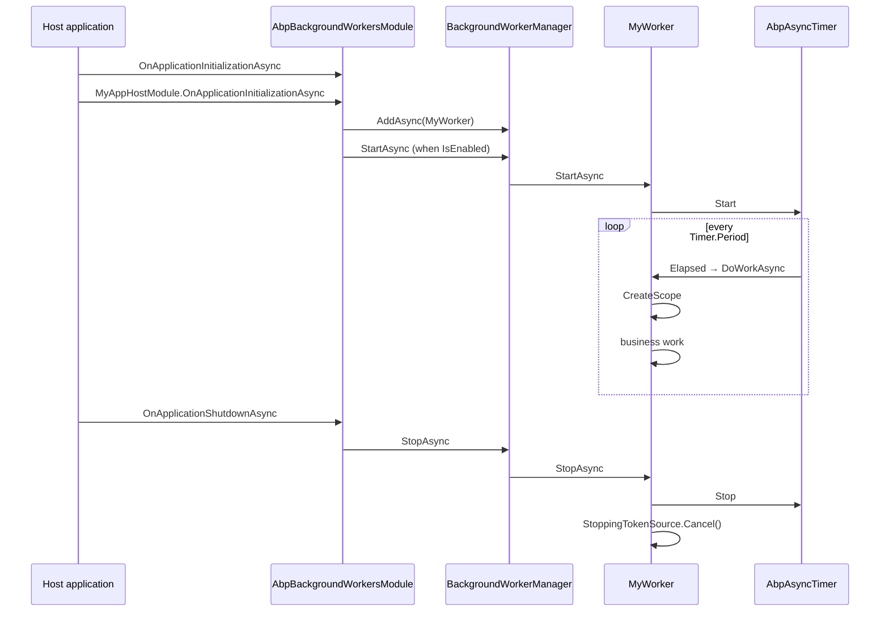

Background **workers** are the other half of ABP's background story. Where a [job](/background/jobs-overview) is a discrete fire-and-forget unit triggered by an `EnqueueAsync` call, a worker is a **long-lived singleton** that runs for the lifetime of the host process — typically a periodic timer that polls something or a daemon that consumes a queue.

The default in-process job system itself is built on a worker: `BackgroundJobWorker` (see [Default job manager](/background/default-job-manager)) is an `AsyncPeriodicBackgroundWorkerBase` registered with the worker manager. So everything in this page applies recursively.

## Package & dependencies

```csharp title="framework/src/Volo.Abp.BackgroundWorkers/Volo/Abp/BackgroundWorkers/AbpBackgroundWorkersModule.cs"
[DependsOn(typeof(AbpThreadingModule))]
public class AbpBackgroundWorkersModule : AbpModule
{
    public async override Task OnApplicationInitializationAsync(ApplicationInitializationContext context)
    {
        var options = context.ServiceProvider.GetRequiredService<IOptions<AbpBackgroundWorkerOptions>>().Value;
        if (options.IsEnabled)
        {
            await context.ServiceProvider
                .GetRequiredService<IBackgroundWorkerManager>()
                .StartAsync();
        }
    }

    public async override Task OnApplicationShutdownAsync(ApplicationShutdownContext context)
    {
        var options = context.ServiceProvider.GetRequiredService<IOptions<AbpBackgroundWorkerOptions>>().Value;
        if (options.IsEnabled)
        {
            await context.ServiceProvider
                .GetRequiredService<IBackgroundWorkerManager>()
                .StopAsync();
        }
    }
}
```

Three responsibilities:

- Owns the workers lifecycle: `StartAsync` on app initialization, `StopAsync` on shutdown.
- Reads a single global kill switch — `AbpBackgroundWorkerOptions.IsEnabled` — that the host may flip to false (e.g. in a producer-only tier).
- Depends only on `AbpThreadingModule` for `AbpTimer` / `AbpAsyncTimer`.

## File inventory

```text
framework/src/Volo.Abp.BackgroundWorkers/Volo/Abp/BackgroundWorkers/
├── AbpBackgroundWorkerOptions.cs                                     ← IsEnabled flag
├── AbpBackgroundWorkersModule.cs                                      ← module wiring
├── AsyncPeriodicBackgroundWorkerBase.cs                               ← async periodic base
├── BackgroundWorkerBase.cs                                            ← shared base (logger, stopping token)
├── BackgroundWorkerManager.cs                                         ← IBackgroundWorkerManager (default impl)
├── BackgroundWorkersApplicationInitializationContextExtensions.cs     ← AddBackgroundWorkerAsync<TWorker>()
├── IBackgroundWorker.cs                                               ← : IRunnable, ISingletonDependency
├── IBackgroundWorkerManager.cs                                        ← AddAsync, StartAsync, StopAsync
├── PeriodicBackgroundWorkerBase.cs                                    ← sync periodic base
└── PeriodicBackgroundWorkerContext.cs                                 ← (ServiceProvider, CancellationToken)
```

## AbpBackgroundWorkerOptions

```csharp title="framework/src/Volo.Abp.BackgroundWorkers/Volo/Abp/BackgroundWorkers/AbpBackgroundWorkerOptions.cs"
public class AbpBackgroundWorkerOptions
{
    /// <summary>Default: true.</summary>
    public bool IsEnabled { get; set; } = true;
}
```

A single boolean. Useful to gate workers per tier:

| Host tier | Setting | Effect |
| --- | --- | --- |
| Web tier (HTTP only) | `IsEnabled = false` | No workers start; pure producer. |
| Worker tier (Hangfire/Quartz consumer) | `IsEnabled = true` (default) | All registered workers start. |

Note this only governs the framework's worker manager — Hangfire's own `BackgroundJobServer` is controlled separately via `AbpBackgroundJobOptions.IsJobExecutionEnabled` (see [Hangfire jobs](/background/hangfire-jobs)).

## IBackgroundWorker

The marker interface every worker implements:

```csharp title="framework/src/Volo.Abp.BackgroundWorkers/Volo/Abp/BackgroundWorkers/IBackgroundWorker.cs"
public interface IBackgroundWorker : IRunnable, ISingletonDependency
{
}
```

`IRunnable` (in `Volo.Abp.Threading`) gives it `Task StartAsync(CancellationToken)` and `Task StopAsync(CancellationToken)`. The `ISingletonDependency` constraint means every worker is registered as a singleton automatically — see [Conventional registration](/di/conventional-registration).

<Tip>
Workers are singletons, so any state you hold on them is process-global. Resolve scoped collaborators (DbContexts, application services, UoW-bound services) inside `DoWork(workerContext)` via `workerContext.ServiceProvider`, never as constructor dependencies.
</Tip>

## BackgroundWorkerBase

The shared base every worker class inherits from:

```csharp title="framework/src/Volo.Abp.BackgroundWorkers/Volo/Abp/BackgroundWorkers/BackgroundWorkerBase.cs"
public abstract class BackgroundWorkerBase : IBackgroundWorker
{
    public IAbpLazyServiceProvider LazyServiceProvider { get; set; } = default!;
    public IServiceProvider ServiceProvider { get; set; } = default!;

    protected ILoggerFactory LoggerFactory
        => LazyServiceProvider.LazyGetRequiredService<ILoggerFactory>();

    protected ILogger Logger
        => LazyServiceProvider.LazyGetService<ILogger>(provider
            => LoggerFactory?.CreateLogger(GetType().FullName!) ?? NullLogger.Instance);

    protected CancellationTokenSource StoppingTokenSource { get; }
    protected CancellationToken StoppingToken { get; }

    public BackgroundWorkerBase()
    {
        StoppingTokenSource = new CancellationTokenSource();
        StoppingToken = StoppingTokenSource.Token;
    }

    public virtual Task StartAsync(CancellationToken cancellationToken = default)
    {
        Logger.LogDebug("Started background worker: " + ToString());
        return Task.CompletedTask;
    }

    public virtual Task StopAsync(CancellationToken cancellationToken = default)
    {
        Logger.LogDebug("Stopped background worker: " + ToString());
        StoppingTokenSource.Cancel();
        StoppingTokenSource.Dispose();
        return Task.CompletedTask;
    }

    public override string ToString() => GetType().FullName!;
}
```

Three things to hold on to:

- `LazyServiceProvider` and `ServiceProvider` are **property-injected** (see [Lazy service provider](/di/lazy-service-provider)). They are populated by the conventional registrar.
- `Logger` is lazily resolved via a category equal to the worker's fully qualified type name.
- `StoppingToken` is cancelled in `StopAsync`. Pass it to any long-running async operation inside your worker.

## PeriodicBackgroundWorkerBase

The synchronous periodic worker — for `DoWork(...)` callbacks that don't need to await anything:

```csharp title="framework/src/Volo.Abp.BackgroundWorkers/Volo/Abp/BackgroundWorkers/PeriodicBackgroundWorkerBase.cs"
public abstract class PeriodicBackgroundWorkerBase : BackgroundWorkerBase
{
    protected IServiceScopeFactory ServiceScopeFactory { get; }
    protected AbpTimer Timer { get; }

    protected PeriodicBackgroundWorkerBase(AbpTimer timer, IServiceScopeFactory serviceScopeFactory)
    {
        ServiceScopeFactory = serviceScopeFactory;
        Timer = timer;
        Timer.Elapsed += Timer_Elapsed;
    }

    public override async Task StartAsync(CancellationToken cancellationToken = default)
    {
        await base.StartAsync(cancellationToken);
        Timer.Start(cancellationToken);
    }

    public override async Task StopAsync(CancellationToken cancellationToken = default)
    {
        Timer.Stop(cancellationToken);
        await base.StopAsync(cancellationToken);
    }

    private void Timer_Elapsed(object? sender, System.EventArgs e)
    {
        using (var scope = ServiceScopeFactory.CreateScope())
        {
            try { DoWork(new PeriodicBackgroundWorkerContext(scope.ServiceProvider)); }
            catch (Exception ex)
            {
                var exceptionNotifier = scope.ServiceProvider.GetRequiredService<IExceptionNotifier>();
                AsyncHelper.RunSync(() => exceptionNotifier.NotifyAsync(new ExceptionNotificationContext(ex)));
                Logger.LogException(ex);
            }
        }
    }

    protected abstract void DoWork(PeriodicBackgroundWorkerContext workerContext);
}
```

What you get for free:

- **`Timer.Period` (ms)** — set in your constructor before `StartAsync` is called.
- **Per-tick service scope** — every tick gets a fresh `IServiceProvider` you can resolve scoped services from.
- **Exception handling** — uncaught exceptions are pushed through `IExceptionNotifier` and logged; the worker is *not* taken down.

## AsyncPeriodicBackgroundWorkerBase

The preferred base for any work that does I/O — use this one:

```csharp title="framework/src/Volo.Abp.BackgroundWorkers/Volo/Abp/BackgroundWorkers/AsyncPeriodicBackgroundWorkerBase.cs"
public abstract class AsyncPeriodicBackgroundWorkerBase : BackgroundWorkerBase
{
    protected IServiceScopeFactory ServiceScopeFactory { get; }
    protected AbpAsyncTimer Timer { get; }
    protected CancellationToken StartCancellationToken { get; set; }

    protected AsyncPeriodicBackgroundWorkerBase(AbpAsyncTimer timer, IServiceScopeFactory serviceScopeFactory)
    {
        ServiceScopeFactory = serviceScopeFactory;
        Timer = timer;
        Timer.Elapsed = Timer_Elapsed;
    }

    public async override Task StartAsync(CancellationToken cancellationToken = default)
    {
        StartCancellationToken = cancellationToken;
        await base.StartAsync(cancellationToken);
        Timer.Start(cancellationToken);
    }

    public async override Task StopAsync(CancellationToken cancellationToken = default)
    {
        Timer.Stop(cancellationToken);
        await base.StopAsync(cancellationToken);
    }

    private async Task Timer_Elapsed(AbpAsyncTimer timer)
        => await DoWorkAsync(StartCancellationToken);

    private async Task DoWorkAsync(CancellationToken cancellationToken = default)
    {
        using (var scope = ServiceScopeFactory.CreateScope())
        {
            try { await DoWorkAsync(new PeriodicBackgroundWorkerContext(scope.ServiceProvider, cancellationToken)); }
            catch (Exception ex)
            {
                await scope.ServiceProvider
                    .GetRequiredService<IExceptionNotifier>()
                    .NotifyAsync(new ExceptionNotificationContext(ex));
                Logger.LogException(ex);
            }
        }
    }

    protected abstract Task DoWorkAsync(PeriodicBackgroundWorkerContext workerContext);
}
```

Differences from the sync base:

- Uses `AbpAsyncTimer` — `Elapsed` is a `Func<AbpAsyncTimer, Task>` (a single subscriber field, not an event).
- Hands the **start cancellation token** to your override, so awaiting work inside the body can be cancelled at host shutdown.
- The body is fully async; there's no `RunSync`.

### PeriodicBackgroundWorkerContext

```csharp title="framework/src/Volo.Abp.BackgroundWorkers/Volo/Abp/BackgroundWorkers/PeriodicBackgroundWorkerContext.cs"
public class PeriodicBackgroundWorkerContext
{
    public IServiceProvider ServiceProvider { get; }
    public CancellationToken CancellationToken { get; }
    public PeriodicBackgroundWorkerContext(IServiceProvider serviceProvider) { /* CT = default */ }
    public PeriodicBackgroundWorkerContext(IServiceProvider serviceProvider, CancellationToken cancellationToken) { /* ... */ }
}
```

Two things: a scoped service provider (you can resolve a UoW manager, a DbContext, repositories), and a cancellation token threaded from `StartAsync`.

## BackgroundWorkerManager

```csharp title="framework/src/Volo.Abp.BackgroundWorkers/Volo/Abp/BackgroundWorkers/BackgroundWorkerManager.cs"
public class BackgroundWorkerManager : IBackgroundWorkerManager, ISingletonDependency, IDisposable
{
    protected bool IsRunning { get; private set; }
    private bool _isDisposed;
    private readonly List<IBackgroundWorker> _backgroundWorkers;

    public BackgroundWorkerManager() => _backgroundWorkers = new List<IBackgroundWorker>();

    public virtual async Task AddAsync(IBackgroundWorker worker, CancellationToken cancellationToken = default)
    {
        _backgroundWorkers.Add(worker);
        if (IsRunning) await worker.StartAsync(cancellationToken);
    }

    public virtual async Task StartAsync(CancellationToken cancellationToken = default)
    {
        IsRunning = true;
        foreach (var worker in _backgroundWorkers)
            await worker.StartAsync(cancellationToken);
    }

    public virtual async Task StopAsync(CancellationToken cancellationToken = default)
    {
        IsRunning = false;
        foreach (var worker in _backgroundWorkers)
            await worker.StopAsync(cancellationToken);
    }
}
```

The default implementation is intentionally simple — just a list. The Hangfire and Quartz integrations subclass it (`[Dependency(ReplaceServices = true)]`) to ride those schedulers instead. See [Hangfire workers](/background/hangfire-workers) and [Quartz workers](/background/quartz-workers).

### Adding workers in OnApplicationInitialization

The idiomatic way to register a worker is via the application initialization context extension:

```csharp title="framework/src/Volo.Abp.BackgroundWorkers/Volo/Abp/BackgroundWorkers/BackgroundWorkersApplicationInitializationContextExtensions.cs"
public async static Task<ApplicationInitializationContext> AddBackgroundWorkerAsync<TWorker>(
    [NotNull] this ApplicationInitializationContext context, CancellationToken cancellationToken = default)
    where TWorker : IBackgroundWorker
{
    Check.NotNull(context, nameof(context));
    await context.AddBackgroundWorkerAsync(typeof(TWorker), cancellationToken: cancellationToken);
    return context;
}

public async static Task<ApplicationInitializationContext> AddBackgroundWorkerAsync(
    [NotNull] this ApplicationInitializationContext context,
    [NotNull] Type workerType, CancellationToken cancellationToken = default)
{
    Check.NotNull(context, nameof(context));
    Check.NotNull(workerType, nameof(workerType));

    if (!workerType.IsAssignableTo<IBackgroundWorker>())
        throw new AbpException($"Given type ({workerType.AssemblyQualifiedName}) must implement the {typeof(IBackgroundWorker).AssemblyQualifiedName} interface, but it doesn't!");

    await context.ServiceProvider
        .GetRequiredService<IBackgroundWorkerManager>()
        .AddAsync((IBackgroundWorker)context.ServiceProvider.GetRequiredService(workerType), cancellationToken);

    return context;
}
```

So inside your module:

```csharp title="MyAppHostModule.cs"
public override async Task OnApplicationInitializationAsync(ApplicationInitializationContext context)
{
    await context.AddBackgroundWorkerAsync<MyDailyCleanupWorker>();
    await context.AddBackgroundWorkerAsync<MyHeartbeatWorker>();
}
```

Workers added here are added **before** the worker manager's `StartAsync` is invoked (the `AbpBackgroundWorkersModule.OnApplicationInitializationAsync` runs after dependent modules), so they're started in the same pass.

## Sequence diagram



## A complete example

```csharp title="MyDailyCleanupWorker.cs"
public class MyDailyCleanupWorker : AsyncPeriodicBackgroundWorkerBase
{
    public MyDailyCleanupWorker(AbpAsyncTimer timer, IServiceScopeFactory serviceScopeFactory)
        : base(timer, serviceScopeFactory)
    {
        Timer.Period = (int)TimeSpan.FromHours(1).TotalMilliseconds;
    }

    protected override async Task DoWorkAsync(PeriodicBackgroundWorkerContext workerContext)
    {
        Logger.LogInformation("Running cleanup at {Now}", DateTime.UtcNow);

        var uowManager = workerContext.ServiceProvider.GetRequiredService<IUnitOfWorkManager>();
        using (var uow = uowManager.Begin(requiresNew: true))
        {
            var repo = workerContext.ServiceProvider.GetRequiredService<IRepository<AuditLog, Guid>>();
            // ... housekeeping work
            await uow.CompleteAsync(workerContext.CancellationToken);
        }
    }
}
```

```csharp title="MyAppHostModule.cs"
public override async Task OnApplicationInitializationAsync(ApplicationInitializationContext context)
{
    await context.AddBackgroundWorkerAsync<MyDailyCleanupWorker>();
}
```

Salient points:

- The worker's class is auto-registered as a singleton (`IBackgroundWorker : ISingletonDependency`).
- `AddBackgroundWorkerAsync<TWorker>()` resolves the singleton from DI and hands it to the manager.
- Each tick gets its own DI scope + its own Unit of Work — see [Unit of Work](/uow/overview).

## Worker manager replacement

Two integrations replace the default manager to delegate to an external scheduler:

| Replacement | Module | Behaviour |
| --- | --- | --- |
| `HangfireBackgroundWorkerManager` | `Volo.Abp.BackgroundWorkers.Hangfire` | Registers each worker as a Hangfire recurring job. |
| `QuartzBackgroundWorkerManager` | `Volo.Abp.BackgroundWorkers.Quartz` | Registers each worker as a Quartz job with a trigger. |

Both inherit `BackgroundWorkerManager` and override `AddAsync` to translate the worker into the underlying scheduler's primitive. Periodic workers (yours) and provider-native workers (`IHangfireBackgroundWorker`, `IQuartzBackgroundWorker`) both work.

## When to use what

<AccordionGroup>
  <Accordion title="A scheduled clean-up task running every hour in a single host">
    `AsyncPeriodicBackgroundWorkerBase` with `Timer.Period = 3_600_000`. No external dependencies. Process restart re-runs at the next interval — there's no persisted "last run".
  </Accordion>
  <Accordion title="The same task across a horizontally-scaled cluster">
    Either (a) gate the body with `IAbpDistributedLock` so only one node runs at a time (the pattern `BackgroundJobWorker` uses — see [Default job manager](/background/default-job-manager)), or (b) switch to `Volo.Abp.BackgroundWorkers.Hangfire`/`.Quartz` and let Hangfire/Quartz handle clustering.
  </Accordion>
  <Accordion title="A cron expression (e.g. every Monday at 02:00)">
    `IHangfireBackgroundWorker` with a `CronExpression`, or `IQuartzBackgroundWorker` with a `CronTrigger`. The plain periodic bases only do interval-based scheduling.
  </Accordion>
  <Accordion title="A daemon that consumes a queue forever (no timer)">
    Inherit `BackgroundWorkerBase` directly and override `StartAsync` to spin up your consumer loop. The `JobQueue<TArgs>` in [RabbitMQ jobs](/background/rabbitmq-jobs) is exactly this pattern.
  </Accordion>
</AccordionGroup>

## Pitfalls

<Warning>
**Don't inject scoped services into a worker's constructor.** Workers are singletons. If you capture a DbContext at construction time it lives forever and is shared across ticks — a classic source of "context disposed" errors. Resolve scoped services from `workerContext.ServiceProvider` instead.
</Warning>

<Warning>
**Don't block the timer thread for too long.** A periodic worker whose `DoWorkAsync` takes longer than its `Period` will queue ticks. `AbpAsyncTimer` does not skip overlapping ticks unless you handle that yourself.
</Warning>

## Reference

<CardGroup cols={3}>
  <Card title="Jobs overview" icon="briefcase" href="/background/jobs-overview">
    Producer-side: `IBackgroundJobManager`, args, executer.
  </Card>
  <Card title="Default job manager" icon="database" href="/background/default-job-manager">
    `BackgroundJobWorker` is exactly an `AsyncPeriodicBackgroundWorkerBase`.
  </Card>
  <Card title="Hangfire workers" icon="bolt" href="/background/hangfire-workers">
    `HangfireBackgroundWorkerManager` and recurring-job adaptation.
  </Card>
  <Card title="Quartz workers" icon="repeat" href="/background/quartz-workers">
    `QuartzBackgroundWorkerManager` and cron-based scheduling.
  </Card>
  <Card title="Module lifecycle" icon="gear" href="/modularity/module-lifecycle">
    Where `OnApplicationInitializationAsync` sits — the right place to add workers.
  </Card>
  <Card title="Unit of work" icon="arrows-rotate" href="/uow/overview">
    How to participate in transactions inside `DoWorkAsync`.
  </Card>
</CardGroup>
