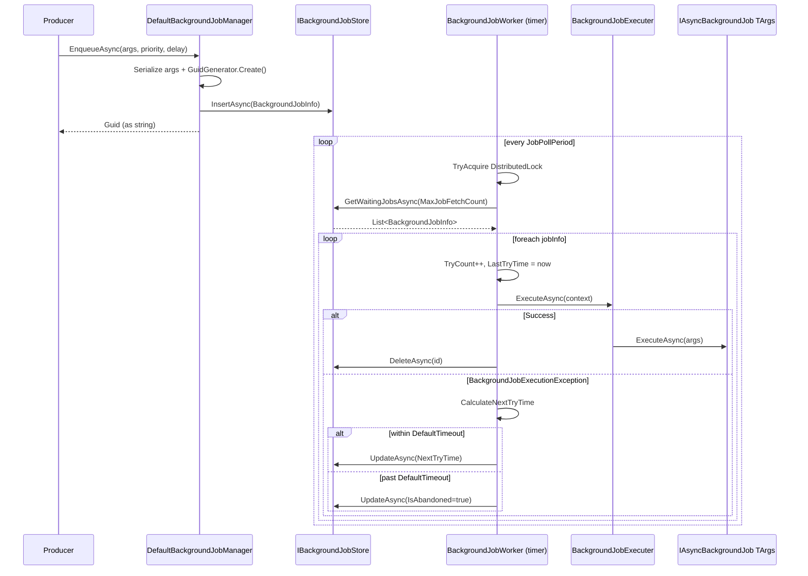

The default ABP background-job provider lives entirely in the `Volo.Abp.BackgroundJobs` package and needs **no external dependency** — not Hangfire, not Quartz, not RabbitMQ. It is built from three cooperating pieces: a thin **manager** (`DefaultBackgroundJobManager`) that serialises and persists jobs, a **store** (`IBackgroundJobStore`) that survives them, and a polling **worker** (`BackgroundJobWorker`) that drains them with exponential backoff.

This is the implementation that wins by default when you reference `Volo.Abp.BackgroundJobs` and *don't* reference a competing provider — its `DefaultBackgroundJobManager` is marked `[Dependency(ReplaceServices = true)]` so it ousts the `NullBackgroundJobManager` from the abstractions module.

## Package & dependencies

```csharp title="framework/src/Volo.Abp.BackgroundJobs/Volo/Abp/BackgroundJobs/AbpBackgroundJobsModule.cs"
[DependsOn(
    typeof(AbpBackgroundJobsAbstractionsModule),
    typeof(AbpBackgroundWorkersModule),
    typeof(AbpTimingModule),
    typeof(AbpGuidsModule),
    typeof(AbpDistributedLockingAbstractionsModule),
    typeof(AbpMultiTenancyModule)
)]
public class AbpBackgroundJobsModule : AbpModule
{
    public override void ConfigureServices(ServiceConfigurationContext context)
    {
        if (context.Services.IsDataMigrationEnvironment())
        {
            Configure<AbpBackgroundJobOptions>(options =>
            {
                options.IsJobExecutionEnabled = false;
            });
        }
    }

    public override async Task OnApplicationInitializationAsync(ApplicationInitializationContext context)
    {
        if (context.ServiceProvider.GetRequiredService<IOptions<AbpBackgroundJobOptions>>().Value.IsJobExecutionEnabled)
        {
            await context.AddBackgroundWorkerAsync<IBackgroundJobWorker>();
        }
    }
}
```

Three things to notice:

- It auto-disables execution in data-migration mode (so EF Core migration apps don't process jobs while they're upgrading the schema).
- It pulls in `AbpBackgroundWorkersModule` so it can run a worker (see [Background workers overview](/background/background-workers)).
- It registers `IBackgroundJobWorker` with the worker manager — that's how the polling loop actually starts.

## File inventory

| File | Type | Purpose |
| --- | --- | --- |
| `AbpBackgroundJobsModule.cs` | `AbpModule` | Wires worker + reads `IsJobExecutionEnabled`. |
| `AbpBackgroundJobWorkerOptions.cs` | options | `JobPollPeriod`, `MaxJobFetchCount`, retry math. |
| `DefaultBackgroundJobManager.cs` | `IBackgroundJobManager` | Serialises args and inserts into the store. |
| `IBackgroundJobStore.cs` | interface | Persistence contract (insert, get-waiting, update, delete). |
| `InMemoryBackgroundJobStore.cs` | `IBackgroundJobStore` | `ConcurrentDictionary<Guid, BackgroundJobInfo>` fallback. |
| `BackgroundJobInfo.cs` | record | Serialised representation: name, args, try count, timestamps, priority. |
| `IBackgroundJobSerializer.cs` | interface | `Serialize(object) → string`, `Deserialize(string, type)`. |
| `JsonBackgroundJobSerializer.cs` | `IBackgroundJobSerializer` | Delegates to `IJsonSerializer`. |
| `IBackgroundJobWorker.cs` | marker | `: IBackgroundWorker` — what the worker manager picks up. |
| `BackgroundJobWorker.cs` | `AsyncPeriodicBackgroundWorkerBase` | The polling/retry loop. |

## DefaultBackgroundJobManager

The producer side is tiny. It builds a `BackgroundJobInfo`, serialises args, and pushes to the store.

```csharp title="framework/src/Volo.Abp.BackgroundJobs/Volo/Abp/BackgroundJobs/DefaultBackgroundJobManager.cs"
[Dependency(ReplaceServices = true)]
public class DefaultBackgroundJobManager : IBackgroundJobManager, ITransientDependency
{
    protected IClock Clock { get; }
    protected IBackgroundJobSerializer Serializer { get; }
    protected IGuidGenerator GuidGenerator { get; }
    protected IBackgroundJobStore Store { get; }

    public DefaultBackgroundJobManager(
        IClock clock, IBackgroundJobSerializer serializer,
        IBackgroundJobStore store, IGuidGenerator guidGenerator)
    {
        Clock = clock; Serializer = serializer;
        GuidGenerator = guidGenerator; Store = store;
    }

    public virtual async Task<string> EnqueueAsync<TArgs>(
        TArgs args,
        BackgroundJobPriority priority = BackgroundJobPriority.Normal,
        TimeSpan? delay = null)
    {
        var jobName = BackgroundJobNameAttribute.GetName<TArgs>();
        var jobId = await EnqueueAsync(jobName, args!, priority, delay);
        return jobId.ToString();
    }

    protected virtual async Task<Guid> EnqueueAsync(
        string jobName, object args,
        BackgroundJobPriority priority = BackgroundJobPriority.Normal,
        TimeSpan? delay = null)
    {
        var jobInfo = new BackgroundJobInfo
        {
            Id           = GuidGenerator.Create(),
            JobName      = jobName,
            JobArgs      = Serializer.Serialize(args),
            Priority     = priority,
            CreationTime = Clock.Now,
            NextTryTime  = Clock.Now
        };

        if (delay.HasValue)
            jobInfo.NextTryTime = Clock.Now.Add(delay.Value);

        await Store.InsertAsync(jobInfo);
        return jobInfo.Id;
    }
}
```

A few things to keep in mind:

- The returned id is the `Guid.ToString()` — the same value as `BackgroundJobInfo.Id`.
- `Clock.Now` is the ABP-managed clock (`Volo.Abp.Timing`), which respects the configured `Kind` (UTC or local).
- `delay` is implemented by setting `NextTryTime` in the future. The worker simply doesn't return jobs whose `NextTryTime > Clock.Now`.
- No transactional guarantee around the producer side. If your handler must enqueue **after** a DB commit, schedule the enqueue from a UoW completion handler — see [Unit of Work overview](/uow/overview).

## BackgroundJobInfo

The serialised on-the-wire/at-rest shape:

```csharp title="framework/src/Volo.Abp.BackgroundJobs/Volo/Abp/BackgroundJobs/BackgroundJobInfo.cs"
public class BackgroundJobInfo
{
    public Guid Id { get; set; }
    public virtual string JobName { get; set; } = default!;
    public virtual string JobArgs { get; set; } = default!;
    public virtual short TryCount { get; set; }
    public virtual DateTime CreationTime { get; set; }
    public virtual DateTime NextTryTime { get; set; }
    public virtual DateTime? LastTryTime { get; set; }
    public virtual bool IsAbandoned { get; set; }
    public virtual BackgroundJobPriority Priority { get; set; }

    public BackgroundJobInfo()
    {
        Priority = BackgroundJobPriority.Normal;
    }
}
```

Semantics:

- `JobName` — looked up against `AbpBackgroundJobOptions` to find the `JobType` and `ArgsType`.
- `JobArgs` — JSON. The shape must round-trip through `IJsonSerializer`.
- `TryCount` — how many times the worker has attempted this job (incremented before each attempt).
- `LastTryTime` / `NextTryTime` — drive the exponential backoff (see below).
- `IsAbandoned` — terminal state; the worker stops scheduling it.

## IBackgroundJobStore

The store is the only thing the manager and worker talk to — swap it for persistence.

```csharp title="framework/src/Volo.Abp.BackgroundJobs/Volo/Abp/BackgroundJobs/IBackgroundJobStore.cs"
public interface IBackgroundJobStore
{
    Task<BackgroundJobInfo> FindAsync(Guid jobId);
    Task InsertAsync(BackgroundJobInfo jobInfo);

    /// Conditions: !IsAbandoned And NextTryTime <= Clock.Now.
    /// Order by: Priority DESC, TryCount ASC, NextTryTime ASC.
    Task<List<BackgroundJobInfo>> GetWaitingJobsAsync(int maxResultCount);

    Task DeleteAsync(Guid jobId);
    Task UpdateAsync(BackgroundJobInfo jobInfo);
}
```

The contract on `GetWaitingJobsAsync` is **load-bearing**: any implementation must honour the priority ordering and the `NextTryTime` gate or the worker will not behave as expected.

### InMemoryBackgroundJobStore

The default registration is in-memory — a `ConcurrentDictionary<Guid, BackgroundJobInfo>`. Lost on process restart. Good for samples, single-host scenarios, and tests.

```csharp title="framework/src/Volo.Abp.BackgroundJobs/Volo/Abp/BackgroundJobs/InMemoryBackgroundJobStore.cs"
public class InMemoryBackgroundJobStore : IBackgroundJobStore, ISingletonDependency
{
    private readonly ConcurrentDictionary<Guid, BackgroundJobInfo> _jobs;
    protected IClock Clock { get; }

    public InMemoryBackgroundJobStore(IClock clock)
    {
        Clock = clock;
        _jobs = new ConcurrentDictionary<Guid, BackgroundJobInfo>();
    }

    public virtual Task<List<BackgroundJobInfo>> GetWaitingJobsAsync(int maxResultCount)
    {
        var waitingJobs = _jobs.Values
            .Where(t => !t.IsAbandoned && t.NextTryTime <= Clock.Now)
            .OrderByDescending(t => t.Priority)
            .ThenBy(t => t.TryCount)
            .ThenBy(t => t.NextTryTime)
            .Take(maxResultCount)
            .ToList();
        return Task.FromResult(waitingJobs);
    }

    public virtual Task UpdateAsync(BackgroundJobInfo jobInfo)
    {
        if (jobInfo.IsAbandoned)
            return DeleteAsync(jobInfo.Id);
        return Task.CompletedTask;
    }

    // FindAsync / InsertAsync / DeleteAsync are dictionary ops.
}
```

Curiously, `UpdateAsync` is a near-no-op for non-abandoned jobs: because the dictionary already holds a reference to the same `BackgroundJobInfo` object, mutating `TryCount` / `NextTryTime` in the worker is immediately visible without a re-insert. The persisted store (next section) has real semantics here.

### Persisted store

The persisted alternative lives in `modules/background-jobs/src/Volo.Abp.BackgroundJobs.Domain` and ships with EF Core and MongoDB providers. It implements `IBackgroundJobStore` on top of `IBackgroundJobRepository<BackgroundJobRecord, Guid>`. The repository's `GetWaitingListAsync` mirrors the in-memory query verbatim:

```csharp title="modules/background-jobs/src/Volo.Abp.BackgroundJobs.EntityFrameworkCore/.../EfCoreBackgroundJobRepository.cs"
protected virtual async Task<IQueryable<BackgroundJobRecord>> GetWaitingListQueryAsync(int maxResultCount)
{
    var now = Clock.Now;
    return (await GetDbSetAsync())
        .Where(t => !t.IsAbandoned && t.NextTryTime <= now)
        .OrderByDescending(t => t.Priority)
        .ThenBy(t => t.TryCount)
        .ThenBy(t => t.NextTryTime)
        .Take(maxResultCount);
}
```

See [Background jobs module](/background/background-jobs-module) for the full picture (records, repositories, migrations).

## JsonBackgroundJobSerializer

The serializer is a thin adapter over `IJsonSerializer`:

```csharp title="framework/src/Volo.Abp.BackgroundJobs/Volo/Abp/BackgroundJobs/JsonBackgroundJobSerializer.cs"
public class JsonBackgroundJobSerializer : IBackgroundJobSerializer, ITransientDependency
{
    private readonly IJsonSerializer _jsonSerializer;
    public JsonBackgroundJobSerializer(IJsonSerializer jsonSerializer)
        => _jsonSerializer = jsonSerializer;

    public string Serialize(object obj) => _jsonSerializer.Serialize(obj);
    public object Deserialize(string value, Type type) => _jsonSerializer.Deserialize(type, value);
    public T Deserialize<T>(string value) => _jsonSerializer.Deserialize<T>(value);
}
```

Implications:

- Your args type must round-trip through the system's `IJsonSerializer` (System.Text.Json by default; Newtonsoft if `AbpNewtonsoftJsonModule` is loaded).
- Polymorphism, private setters, constructor injection — all subject to the same caveats as any JSON contract.
- You can replace `IBackgroundJobSerializer` to use a different format (MessagePack, Protobuf) without touching the manager/worker.

## AbpBackgroundJobWorkerOptions

The numbers that govern polling and backoff:

```csharp title="framework/src/Volo.Abp.BackgroundJobs/Volo/Abp/BackgroundJobs/AbpBackgroundJobWorkerOptions.cs"
public class AbpBackgroundJobWorkerOptions
{
    public int JobPollPeriod { get; set; }           // default 5000 ms
    public int MaxJobFetchCount { get; set; }        // default 1000
    public int DefaultFirstWaitDuration { get; set; }// default 60 s
    public int DefaultTimeout { get; set; }          // default 172_800 s (2 days)
    public double DefaultWaitFactor { get; set; }    // default 2.0

    public AbpBackgroundJobWorkerOptions()
    {
        MaxJobFetchCount         = 1000;
        JobPollPeriod            = 5000;
        DefaultFirstWaitDuration = 60;
        DefaultTimeout           = 172800;
        DefaultWaitFactor        = 2.0;
    }
}
```

These plug into the worker loop below. Tune `JobPollPeriod` down for latency-sensitive systems; tune `DefaultTimeout` up if your jobs are allowed to retry for longer than two days.

## BackgroundJobWorker

The worker is an `AsyncPeriodicBackgroundWorkerBase` (see [Background workers overview](/background/background-workers)) — it ticks on the timer and processes a batch.

```csharp title="framework/src/Volo.Abp.BackgroundJobs/Volo/Abp/BackgroundJobs/BackgroundJobWorker.cs"
public class BackgroundJobWorker : AsyncPeriodicBackgroundWorkerBase, IBackgroundJobWorker
{
    protected const string DistributedLockName = "AbpBackgroundJobWorker";

    protected AbpBackgroundJobOptions JobOptions { get; }
    protected AbpBackgroundJobWorkerOptions WorkerOptions { get; }
    protected IAbpDistributedLock DistributedLock { get; }

    public BackgroundJobWorker(
        AbpAsyncTimer timer,
        IOptions<AbpBackgroundJobOptions> jobOptions,
        IOptions<AbpBackgroundJobWorkerOptions> workerOptions,
        IServiceScopeFactory serviceScopeFactory,
        IAbpDistributedLock distributedLock)
        : base(timer, serviceScopeFactory)
    {
        DistributedLock = distributedLock;
        WorkerOptions   = workerOptions.Value;
        JobOptions      = jobOptions.Value;
        Timer.Period    = WorkerOptions.JobPollPeriod;
    }

    protected override async Task DoWorkAsync(PeriodicBackgroundWorkerContext workerContext)
    {
        await using (var handler = await DistributedLock.TryAcquireAsync(
            DistributedLockName, cancellationToken: StoppingToken))
        {
            if (handler != null)
            {
                var store = workerContext.ServiceProvider.GetRequiredService<IBackgroundJobStore>();
                var waitingJobs = await store.GetWaitingJobsAsync(WorkerOptions.MaxJobFetchCount);
                if (!waitingJobs.Any()) return;

                var jobExecuter = workerContext.ServiceProvider.GetRequiredService<IBackgroundJobExecuter>();
                var clock       = workerContext.ServiceProvider.GetRequiredService<IClock>();
                var serializer  = workerContext.ServiceProvider.GetRequiredService<IBackgroundJobSerializer>();

                foreach (var jobInfo in waitingJobs)
                {
                    jobInfo.TryCount++;
                    jobInfo.LastTryTime = clock.Now;
                    // ... execute, delete on success, reschedule on retryable failure
                }
            }
            else
            {
                // Another node holds the lock — back off ~12x the poll period.
                try { await Task.Delay(WorkerOptions.JobPollPeriod * 12, StoppingToken); }
                catch (TaskCanceledException) { }
            }
        }
    }
}
```

### Distributed lock

The worker acquires `AbpBackgroundJobWorker` via `IAbpDistributedLock` before each batch. Multiple app instances pointing at the same store will see exactly one of them processing jobs at a time. The default `IAbpDistributedLock` is in-process; configure a real one (Redis, file system, SQL) if you run multiple hosts.

A node that *fails* to acquire the lock waits roughly 12 polling periods before trying again (one minute by default) instead of busy-looping every 5 seconds.

### The execute-or-retry block

The per-job body:

```csharp title="framework/src/Volo.Abp.BackgroundJobs/Volo/Abp/BackgroundJobs/BackgroundJobWorker.cs"
try
{
    var jobConfiguration = JobOptions.GetJob(jobInfo.JobName);
    var jobArgs = serializer.Deserialize(jobInfo.JobArgs, jobConfiguration.ArgsType);
    var context = new JobExecutionContext(
        workerContext.ServiceProvider,
        jobConfiguration.JobType,
        jobArgs,
        workerContext.CancellationToken);

    try
    {
        await jobExecuter.ExecuteAsync(context);
        await store.DeleteAsync(jobInfo.Id);
    }
    catch (BackgroundJobExecutionException)
    {
        var nextTryTime = CalculateNextTryTime(jobInfo, clock);
        if (nextTryTime.HasValue) jobInfo.NextTryTime = nextTryTime.Value;
        else                      jobInfo.IsAbandoned = true;
        await TryUpdateAsync(store, jobInfo);
    }
}
catch (Exception ex)
{
    Logger.LogException(ex);
    jobInfo.IsAbandoned = true;
    await TryUpdateAsync(store, jobInfo);
}
```

Three failure modes:

| Failure | Reaction |
| --- | --- |
| Handler throws (wrapped as `BackgroundJobExecutionException` by the executer) | Compute next try time; reschedule or abandon. |
| Lookup/deserialise fails (e.g. unknown `JobName`, malformed JSON) | Abandon immediately (outer catch). |
| Store update fails | Logged via `TryUpdateAsync`; not rethrown. |

### Exponential backoff

```csharp title="framework/src/Volo.Abp.BackgroundJobs/Volo/Abp/BackgroundJobs/BackgroundJobWorker.cs"
protected virtual DateTime? CalculateNextTryTime(BackgroundJobInfo jobInfo, IClock clock)
{
    var nextWaitDuration = WorkerOptions.DefaultFirstWaitDuration *
                           (Math.Pow(WorkerOptions.DefaultWaitFactor, jobInfo.TryCount - 1));
    var nextTryDate = jobInfo.LastTryTime?.AddSeconds(nextWaitDuration) ??
                      clock.Now.AddSeconds(nextWaitDuration);

    if (nextTryDate.Subtract(jobInfo.CreationTime).TotalSeconds > WorkerOptions.DefaultTimeout)
        return null;

    return nextTryDate;
}
```

With the defaults (`60 s`, factor `2.0`) the wait sequence after each failure is **60 s, 120 s, 240 s, 480 s, …** until two days have elapsed since `CreationTime`, at which point the next computed time exceeds `DefaultTimeout` and the job is abandoned (`return null`).

Quick math for the defaults:

| Try # | Wait before try (s) | Cumulative time since creation (s, ≈) |
| ----- | -------------------:| -------------------------------------:|
| 1 | (immediate) | 0 |
| 2 | 60 | 60 |
| 3 | 120 | 180 |
| 4 | 240 | 420 |
| 5 | 480 | 900 |
| 6 | 960 | 1 860 |
| … | … | … |
| 12 | 61 440 | 124 860 |
| 13 | 122 880 | 247 740 *(> 172 800 → abandoned)* |

So a single job gets roughly **12 attempts** over a 2-day window with the default settings.

## Lifecycle diagram



## Things that surprise people

<AccordionGroup>
  <Accordion title="Enqueue returns before persistence is durable on the in-memory store.">
    The in-memory store is just a `ConcurrentDictionary` — a process crash between `EnqueueAsync` returning and the worker picking the job up loses the job. Use the [persisted store module](/background/background-jobs-module) for durability.
  </Accordion>
  <Accordion title="Multi-tenancy follows the args, not the producer.">
    The `BackgroundJobExecuter` switches `ICurrentTenant` based on `args is IMultiTenant`. If your args don't implement `IMultiTenant`, jobs execute under whatever tenant the worker process is running as — which is typically the host. Make sure tenant-scoped jobs carry a `TenantId` property.
  </Accordion>
  <Accordion title="Update is a no-op on the in-memory store (except for abandonment).">
    `InMemoryBackgroundJobStore.UpdateAsync` deletes when `IsAbandoned == true` and otherwise does nothing — it relies on the in-place mutation of `BackgroundJobInfo` to persist `TryCount` / `NextTryTime`. Custom stores must actually persist the update.
  </Accordion>
  <Accordion title="Disabling job execution still allows enqueue.">
    `AbpBackgroundJobOptions.IsJobExecutionEnabled = false` keeps the manager working but the module skips registering `IBackgroundJobWorker`. This lets you split producers from consumers across host tiers.
  </Accordion>
</AccordionGroup>

## Replacing pieces

| Replace | How |
| --- | --- |
| The serializer | Implement `IBackgroundJobSerializer` and register with `[Dependency(ReplaceServices = true)]`. |
| The store | Implement `IBackgroundJobStore` (replace `InMemoryBackgroundJobStore`). |
| The worker's retry strategy | Inherit `BackgroundJobWorker` and override `CalculateNextTryTime`. |
| The manager | Either reference a provider module (Hangfire/Quartz/RabbitMQ) or replace `IBackgroundJobManager` directly. |

For Hangfire-, Quartz-, and RabbitMQ-backed managers, see:

<CardGroup cols={3}>
  <Card title="Hangfire jobs" icon="bolt" href="/background/hangfire-jobs">
    `HangfireBackgroundJobManager` and the Hangfire dashboard.
  </Card>
  <Card title="Quartz jobs" icon="clock" href="/background/quartz-jobs">
    `QuartzBackgroundJobManager` and Quartz's retry strategy.
  </Card>
  <Card title="RabbitMQ jobs" icon="rabbit" href="/background/rabbitmq-jobs">
    `RabbitMqBackgroundJobManager` and per-args queues.
  </Card>
</CardGroup>

For event-driven side-effects of job completion, see [Local event bus](/events/local-event-bus); for transactional enqueuing patterns, see [Unit of Work transactions](/uow/transactions-and-savechanges).
