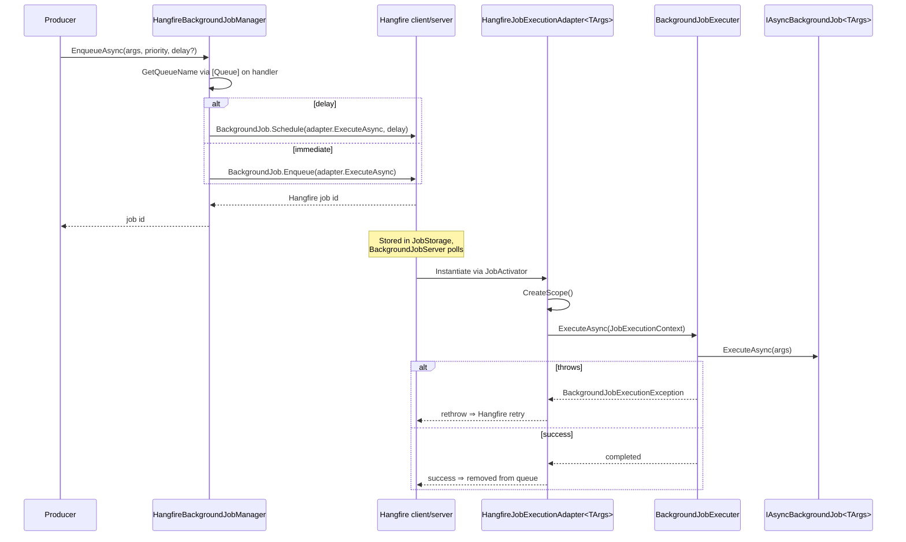

The Hangfire integration replaces ABP's [default in-process job manager](/background/default-job-manager) with one that delegates to Hangfire. Instead of a polling worker over `IBackgroundJobStore`, you get Hangfire's `BackgroundJobServer` (with whatever storage you've configured: SQL Server, Redis, Mongo, etc.), its dashboard, and its job recurrence model — while preserving ABP's `IBackgroundJobManager` producer contract and the `[BackgroundJobName]` / `IAsyncBackgroundJob<TArgs>` shape.

The package is `Volo.Abp.BackgroundJobs.HangFire`. It depends on `AbpBackgroundJobsAbstractionsModule` (for `IBackgroundJobManager`, `IBackgroundJobExecuter`, `AbpBackgroundJobOptions`) and `AbpHangfireModule` (for `BackgroundJobServer` and `JobStorage`).

## File inventory

```text
framework/src/Volo.Abp.BackgroundJobs.HangFire/
├── Microsoft/AspNetCore/Builder/
│   └── AbpHangfireApplicationBuilderExtensions.cs   ← UseAbpHangfireDashboard
└── Volo/Abp/BackgroundJobs/Hangfire/
    ├── AbpBackgroundJobsHangfireModule.cs           ← module wiring
    ├── AbpDashboardOptionsProvider.cs               ← dashboard display names
    ├── HangfireBackgroundJobManager.cs              ← IBackgroundJobManager
    └── HangfireJobExecutionAdapter.cs               ← bridge to BackgroundJobExecuter
```

Plus, from `Volo.Abp.HangFire` (the host-level Hangfire module this depends on):

| File | Role |
| --- | --- |
| `AbpHangfireModule.cs` | Calls `services.AddHangfire(...)`, owns the `BackgroundJobServer` singleton. |
| `AbpHangfireOptions.cs` | `BackgroundJobServerFactory`, `ServerOptions`, `Storage`, `AdditionalProcesses`. |
| `AbpHangfireBackgroundJobServer.cs` | Thin wrapper around the optional `BackgroundJobServer` instance. |
| `AbpHangfireAuthorizationFilter.cs` | `IDashboardAsyncAuthorizationFilter` using `ICurrentUser` + `IPermissionChecker`. |

## Module wiring

```csharp title="framework/src/Volo.Abp.BackgroundJobs.HangFire/Volo/Abp/BackgroundJobs/Hangfire/AbpBackgroundJobsHangfireModule.cs"
[DependsOn(
    typeof(AbpBackgroundJobsAbstractionsModule),
    typeof(AbpHangfireModule)
)]
public class AbpBackgroundJobsHangfireModule : AbpModule
{
    public override void ConfigureServices(ServiceConfigurationContext context)
    {
        context.Services.AddTransient(serviceProvider =>
            serviceProvider.GetRequiredService<AbpDashboardOptionsProvider>().Get());
    }

    public override void OnPreApplicationInitialization(ApplicationInitializationContext context)
    {
        var options = context.ServiceProvider.GetRequiredService<IOptions<AbpBackgroundJobOptions>>().Value;
        if (!options.IsJobExecutionEnabled)
        {
            var hangfireOptions = context.ServiceProvider.GetRequiredService<IOptions<AbpHangfireOptions>>().Value;
            hangfireOptions.BackgroundJobServerFactory = CreateOnlyEnqueueJobServer;
        }
    }

    private BackgroundJobServer? CreateOnlyEnqueueJobServer(IServiceProvider serviceProvider)
    {
        serviceProvider.GetRequiredService<JobStorage>();
        return null;
    }
}
```

Two notable behaviours:

- If `AbpBackgroundJobOptions.IsJobExecutionEnabled == false`, the module rewires `AbpHangfireOptions.BackgroundJobServerFactory` to **return `null`** — Hangfire's `BackgroundJobServer` is not constructed, so the process can only enqueue. This is the standard "split producer/consumer" pattern: a web tier that only enqueues sets the flag false; a worker tier leaves it true.
- A `DashboardOptions` instance is registered transiently, sourced from `AbpDashboardOptionsProvider`. That's what the dashboard endpoint will pick up.

## HangfireBackgroundJobManager

```csharp title="framework/src/Volo.Abp.BackgroundJobs.HangFire/Volo/Abp/BackgroundJobs/Hangfire/HangfireBackgroundJobManager.cs"
[Dependency(ReplaceServices = true)]
public class HangfireBackgroundJobManager : IBackgroundJobManager, ITransientDependency
{
    protected AbpBackgroundJobOptions Options { get; }

    public HangfireBackgroundJobManager(IOptions<AbpBackgroundJobOptions> options)
        => Options = options.Value;

    public virtual Task<string> EnqueueAsync<TArgs>(TArgs args,
        BackgroundJobPriority priority = BackgroundJobPriority.Normal,
        TimeSpan? delay = null)
    {
        return Task.FromResult(delay.HasValue
            ? BackgroundJob.Schedule<HangfireJobExecutionAdapter<TArgs>>(
                adapter => adapter.ExecuteAsync(GetQueueName(typeof(TArgs)), args, default),
                delay.Value)
            : BackgroundJob.Enqueue<HangfireJobExecutionAdapter<TArgs>>(
                adapter => adapter.ExecuteAsync(GetQueueName(typeof(TArgs)), args, default)));
    }

    protected virtual string GetQueueName(Type argsType)
    {
        var queueName = EnqueuedState.DefaultQueue;
        var queueAttribute = Options.GetJob(argsType).JobType.GetCustomAttribute<QueueAttribute>();
        if (queueAttribute != null) queueName = queueAttribute.Queue;
        return queueName;
    }
}
```

The mechanics:

- It's a `[Dependency(ReplaceServices = true)]` — it ousts whatever `IBackgroundJobManager` was registered (the null one, or the default one if both packages happened to be referenced).
- It does **not** touch `IBackgroundJobStore`. The persistence is Hangfire's responsibility (`JobStorage`).
- Both branches enqueue *the adapter* (`HangfireJobExecutionAdapter<TArgs>`), not the user's handler. Hangfire stores the call expression as a serialised tuple of `(adapter, queueName, args, defaultCancellationToken)`.
- Hangfire's own `priority` doesn't map 1:1 to ABP's `BackgroundJobPriority` — the parameter is preserved but Hangfire schedules by queue, not by ABP priority.
- The returned id is **Hangfire's** job id (the storage's auto-generated string).

### Queue routing via [Queue]

`GetQueueName` looks for Hangfire's own `[Queue("…")]` attribute **on the handler type** (not the args type). So if you want a particular job to land on the `"emailing"` queue:

```csharp title="EmailSendingJob.cs"
[Queue("emailing")]
public class EmailSendingJob : AsyncBackgroundJob<EmailingJobArgs>, ITransientDependency
{
    public override Task ExecuteAsync(EmailingJobArgs args) => /* ... */;
}
```

Without the attribute, jobs go to Hangfire's `EnqueuedState.DefaultQueue` (typically `"default"`). The queue name is then sent through to the adapter's `[Queue("{0}")]` placeholder so Hangfire knows where this serialised invocation belongs.

## HangfireJobExecutionAdapter

The adapter is the bridge between Hangfire's runtime and ABP's `IBackgroundJobExecuter`:

```csharp title="framework/src/Volo.Abp.BackgroundJobs.HangFire/Volo/Abp/BackgroundJobs/Hangfire/HangfireJobExecutionAdapter.cs"
public class HangfireJobExecutionAdapter<TArgs>
{
    protected AbpBackgroundJobOptions Options { get; }
    protected IServiceScopeFactory ServiceScopeFactory { get; }
    protected IBackgroundJobExecuter JobExecuter { get; }

    public HangfireJobExecutionAdapter(
        IOptions<AbpBackgroundJobOptions> options,
        IBackgroundJobExecuter jobExecuter,
        IServiceScopeFactory serviceScopeFactory)
    {
        JobExecuter = jobExecuter;
        ServiceScopeFactory = serviceScopeFactory;
        Options = options.Value;
    }

    [Queue("{0}")]
    public async Task ExecuteAsync(string queue, TArgs args, CancellationToken cancellationToken = default)
    {
        if (!Options.IsJobExecutionEnabled)
        {
            throw new AbpException(
                "Background job execution is disabled. ...");
        }

        using (var scope = ServiceScopeFactory.CreateScope())
        {
            var jobType = Options.GetJob(typeof(TArgs)).JobType;
            var context = new JobExecutionContext(scope.ServiceProvider, jobType, args!,
                                                  cancellationToken: cancellationToken);
            await JobExecuter.ExecuteAsync(context);
        }
    }
}
```

What happens on the consumer side:

1. Hangfire dequeues the job and resolves a `HangfireJobExecutionAdapter<TArgs>` from the DI container.
2. The adapter checks the `IsJobExecutionEnabled` flag. (Belt-and-braces: the module also disables the server when the flag is false, so this throw should never fire — but it's a safety net for runtime reconfigurations.)
3. A **fresh DI scope** is opened (matches the default provider's behaviour — see [Background workers overview](/background/background-workers)).
4. `BackgroundJobExecuter.ExecuteAsync` runs, which:
   - Resolves the handler from the scope.
   - Picks `ExecuteAsync` vs `Execute`.
   - Switches `ICurrentTenant` if the args implement `IMultiTenant`.
   - Wraps failures in `BackgroundJobExecutionException`, which Hangfire treats like any other thrown exception (its retry policy applies).

The `[Queue("{0}")]` attribute is a Hangfire feature: the queue name passed as the first argument *is* the queue Hangfire will read from. That's how queue routing flows end-to-end without ABP having to expose Hangfire-specific configuration.

## Sequence: enqueue and execute



## The dashboard

ABP customises Hangfire's dashboard in two small but useful ways: it relabels jobs with the friendly ABP `JobName`, and it adds an authorisation filter.

### Friendly display names

```csharp title="framework/src/Volo.Abp.BackgroundJobs.HangFire/Volo/Abp/BackgroundJobs/Hangfire/AbpDashboardOptionsProvider.cs"
public class AbpDashboardOptionsProvider : ITransientDependency
{
    protected AbpBackgroundJobOptions AbpBackgroundJobOptions { get; }

    public virtual DashboardOptions Get()
    {
        return new DashboardOptions
        {
            DisplayNameFunc = (_, job) =>
            {
                var jobName = job.ToString();
                if (job.Args.Count == 3 && job.Args.Last() is CancellationToken)
                {
                    jobName = AbpBackgroundJobOptions.GetJob(job.Args[1].GetType()).JobName;
                }
                return jobName;
            }
        };
    }
}
```

If a job's `Args` come from the adapter (three of them, with a trailing `CancellationToken`), the display name in the dashboard is replaced with the `BackgroundJobName` registered in `AbpBackgroundJobOptions`. That converts an opaque `HangfireJobExecutionAdapter<EmailingJobArgs>.ExecuteAsync` into the friendly string `"Emailing"`.

### Wiring up the dashboard endpoint

```csharp title="framework/src/Volo.Abp.BackgroundJobs.HangFire/Microsoft/AspNetCore/Builder/AbpHangfireApplicationBuilderExtensions.cs"
public static IApplicationBuilder UseAbpHangfireDashboard(
    this IApplicationBuilder app,
    string pathMatch = "/hangfire",
    Action<DashboardOptions>? configure = null,
    JobStorage? storage = null)
{
    var options = app.ApplicationServices.GetRequiredService<AbpDashboardOptionsProvider>().Get();
    configure?.Invoke(options);
    return app.UseHangfireDashboard(pathMatch, options, storage);
}
```

Use it as you would `UseHangfireDashboard`, and you get the ABP display names for free:

```csharp title="Program.cs / Startup"
app.UseAbpHangfireDashboard("/hangfire", options =>
{
    options.Authorization = new[]
    {
        new AbpHangfireAuthorizationFilter(
            enableTenant: false,
            requiredPermissionName: "MyApp.HangfireDashboard")
    };
});
```

### Authorisation filter

```csharp title="framework/src/Volo.Abp.HangFire/Volo/Abp/Hangfire/AbpHangfireAuthorizationFilter.cs"
public class AbpHangfireAuthorizationFilter : IDashboardAsyncAuthorizationFilter
{
    public AbpHangfireAuthorizationFilter(bool enableTenant = false, string? requiredPermissionName = null) { /* ... */ }

    public async Task<bool> AuthorizeAsync(DashboardContext context)
    {
        if (!IsLoggedIn(context, _enableTenant)) return false;
        if (_requiredPermissionName.IsNullOrEmpty()) return true;
        return await IsPermissionGrantedAsync(context, _requiredPermissionName!);
    }

    private static bool IsLoggedIn(DashboardContext context, bool enableTenant)
    {
        var currentUser = context.GetHttpContext().RequestServices.GetRequiredService<ICurrentUser>();
        if (!enableTenant) return currentUser.IsAuthenticated && !currentUser.TenantId.HasValue;
        return currentUser.IsAuthenticated;
    }
}
```

The filter integrates with ABP's `ICurrentUser` and `IPermissionChecker`. Two knobs:

- `enableTenant: false` (default) means only **host** users may view the dashboard. Setting it to `true` allows tenant users in.
- `requiredPermissionName`, if set, gates the dashboard behind a granted permission.

## AbpHangfireOptions

The host-level Hangfire module surfaces a few knobs you'll commonly set:

```csharp title="framework/src/Volo.Abp.HangFire/Volo/Abp/Hangfire/AbpHangfireOptions.cs"
public class AbpHangfireOptions
{
    public BackgroundJobServerOptions? ServerOptions { get; set; }
    public IEnumerable<IBackgroundProcess>? AdditionalProcesses { get; set; }
    public JobStorage? Storage { get; set; }
    public Func<IServiceProvider, BackgroundJobServer?> BackgroundJobServerFactory { get; set; }
}
```

The `ConfigureServices` of `AbpHangfireModule` calls `services.AddHangfire(...)` and then registers a singleton `AbpHangfireBackgroundJobServer` whose internal `BackgroundJobServer` is created by `BackgroundJobServerFactory(serviceProvider)`. The default factory wires `Storage` (from DI if you didn't pre-set it), `ServerOptions`, `AdditionalProcesses`, and the necessary Hangfire collaborators. As noted above, the BackgroundJobs.Hangfire module overrides this factory with one that returns `null` when execution is disabled — that's how "enqueue-only" hosts work.

## What Hangfire gives you that the default provider doesn't

- A **production-grade persistent queue** with a dashboard. Storage providers exist for SQL Server, PostgreSQL, MySQL, Redis, Mongo, Memory.
- **Per-queue concurrency control** via `BackgroundJobServerOptions` (the `Queues` array) and `[Queue]` attributes — you can pin certain jobs to a dedicated queue with its own server.
- **Built-in retry/state transitions** with a UI for re-queueing failed jobs.
- **Recurring jobs** (used by the [Hangfire workers](/background/hangfire-workers) integration for periodic work).

## What you give up vs the default provider

- ABP's exponential-backoff retry math (`AbpBackgroundJobWorkerOptions`) is replaced by Hangfire's own retry policy.
- `BackgroundJobPriority` is accepted but **not enforced** — Hangfire schedules by queue, not by ABP priority.
- The returned job id is Hangfire's, not a `Guid`, and is opaque to ABP.

<Warning>
The Hangfire module needs a real Hangfire storage provider configured — this is **not** wired by the ABP module. Set `services.AddHangfire(cfg => cfg.UseSqlServerStorage(...))` (or your provider of choice) in your own startup, or set `AbpHangfireOptions.Storage` before initialisation.
</Warning>

## Reference

<CardGroup cols={3}>
  <Card title="Jobs overview" icon="briefcase" href="/background/jobs-overview">
    `IBackgroundJobManager`, args registration, executer.
  </Card>
  <Card title="Default job manager" icon="database" href="/background/default-job-manager">
    Compare with ABP's polling worker + store.
  </Card>
  <Card title="Hangfire workers" icon="bolt" href="/background/hangfire-workers">
    `HangfireBackgroundWorkerManager` for periodic jobs.
  </Card>
  <Card title="Quartz jobs" icon="clock" href="/background/quartz-jobs">
    Alternative scheduler-based provider.
  </Card>
  <Card title="RabbitMQ jobs" icon="rabbit" href="/background/rabbitmq-jobs">
    Alternative queue-based provider.
  </Card>
  <Card title="Permissions" icon="lock" href="/web/exception-handling">
    `ICurrentUser` + `IPermissionChecker`, used by the dashboard filter.
  </Card>
</CardGroup>
