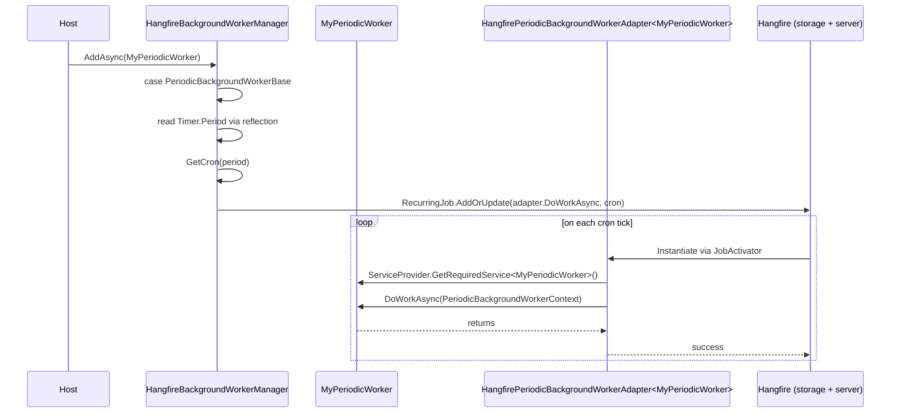

The Hangfire-backed worker manager lets you run ABP's [background workers](/background/background-workers) as Hangfire **recurring jobs** instead of in-process timers. That moves scheduling state from your process memory into Hangfire's storage, gives you the Hangfire dashboard, and makes the cluster the source of truth — only one node fires each tick because Hangfire's storage de-duplicates.

Two flavours of worker are supported:

- **Native Hangfire workers** that implement `IHangfireBackgroundWorker` and declare a cron expression directly.
- **Standard periodic workers** (`PeriodicBackgroundWorkerBase` / `AsyncPeriodicBackgroundWorkerBase`) whose `Timer.Period` is translated to a cron expression and wrapped in an adapter.

The package is `Volo.Abp.BackgroundWorkers.Hangfire`. It depends on `AbpBackgroundWorkersModule` (so it can subclass `BackgroundWorkerManager`) and `AbpHangfireModule` (for the `BackgroundJobServer` and storage).

## File inventory

```text
framework/src/Volo.Abp.BackgroundWorkers.Hangfire/Volo/Abp/BackgroundWorkers/Hangfire/
├── AbpBackgroundWorkersHangfireModule.cs        ← module wiring (manager init, enqueue-only mode)
├── HangfireBackgroundWorkerBase.cs              ← base class with cron + queue + time zone
├── HangfireBackgroundWorkerManager.cs           ← [Dependency(ReplaceServices=true)] manager
├── HangfirePeriodicBackgroundWorkerAdapter.cs   ← wraps a periodic worker as IHangfireBackgroundWorker
└── IHangfireBackgroundWorker.cs                 ← cron, queue, recurring-job id, DoWorkAsync
```

## Module wiring

```csharp title="framework/src/Volo.Abp.BackgroundWorkers.Hangfire/Volo/Abp/BackgroundWorkers/Hangfire/AbpBackgroundWorkersHangfireModule.cs"
[DependsOn(
    typeof(AbpBackgroundWorkersModule),
    typeof(AbpHangfireModule))]
public class AbpBackgroundWorkersHangfireModule : AbpModule
{
    public override void ConfigureServices(ServiceConfigurationContext context)
    {
        context.Services.AddSingleton(typeof(HangfirePeriodicBackgroundWorkerAdapter<>));
    }

    public override void OnPreApplicationInitialization(ApplicationInitializationContext context)
    {
        var options = context.ServiceProvider.GetRequiredService<IOptions<AbpBackgroundWorkerOptions>>().Value;
        if (!options.IsEnabled)
        {
            var hangfireOptions = context.ServiceProvider.GetRequiredService<IOptions<AbpHangfireOptions>>().Value;
            hangfireOptions.BackgroundJobServerFactory = CreateOnlyEnqueueJobServer;
        }

        context.ServiceProvider
            .GetRequiredService<HangfireBackgroundWorkerManager>()
            .Initialize();
    }

    private BackgroundJobServer? CreateOnlyEnqueueJobServer(IServiceProvider serviceProvider)
    {
        serviceProvider.GetRequiredService<JobStorage>();
        return null;
    }
}
```

Three things happen:

- `HangfirePeriodicBackgroundWorkerAdapter<>` is registered as a singleton open generic so the manager can construct closed `HangfirePeriodicBackgroundWorkerAdapter<MyWorker>` instances.
- If `AbpBackgroundWorkerOptions.IsEnabled == false` the Hangfire `BackgroundJobServer` is replaced with one that returns `null` — the host can enqueue/declare recurring jobs but won't fire them. (Same pattern as the [Hangfire jobs](/background/hangfire-jobs) module.)
- `HangfireBackgroundWorkerManager.Initialize()` is called in `OnPreApplicationInitialization` to make sure the `BackgroundJobServer` is resolved before any worker registers a recurring job.

## IHangfireBackgroundWorker

The worker contract that Hangfire understands natively:

```csharp title="framework/src/Volo.Abp.BackgroundWorkers.Hangfire/Volo/Abp/BackgroundWorkers/Hangfire/IHangfireBackgroundWorker.cs"
public interface IHangfireBackgroundWorker : IBackgroundWorker
{
    string? RecurringJobId { get; set; }
    string CronExpression { get; set; }
    TimeZoneInfo? TimeZone { get; set; }
    string Queue { get; set; }

    Task DoWorkAsync(CancellationToken cancellationToken = default);
}
```

It still implements `IBackgroundWorker` (the marker from the core workers module), so it's still picked up by conventional registration. The four extra properties are what get fed into Hangfire's `RecurringJob.AddOrUpdate(...)`.

### HangfireBackgroundWorkerBase

A starter base class — most projects will inherit from this:

```csharp title="framework/src/Volo.Abp.BackgroundWorkers.Hangfire/Volo/Abp/BackgroundWorkers/Hangfire/HangfireBackgroundWorkerBase.cs"
public abstract class HangfireBackgroundWorkerBase : BackgroundWorkerBase, IHangfireBackgroundWorker
{
    public string? RecurringJobId { get; set; }
    public string CronExpression { get; set; } = default!;
    public TimeZoneInfo? TimeZone { get; set; }
    public string Queue { get; set; }

    public abstract Task DoWorkAsync(CancellationToken cancellationToken = default);

    protected HangfireBackgroundWorkerBase()
    {
        TimeZone = null;
        Queue = "default";
    }
}
```

You override `DoWorkAsync` and set `CronExpression` (and optionally `RecurringJobId`, `Queue`, `TimeZone`) in your constructor. The class inherits `BackgroundWorkerBase` so it gets the same `Logger`, `LazyServiceProvider`, and `StoppingTokenSource` as a plain background worker.

## HangfireBackgroundWorkerManager

The replacement manager intercepts `AddAsync` and dispatches on the worker shape:

```csharp title="framework/src/Volo.Abp.BackgroundWorkers.Hangfire/Volo/Abp/BackgroundWorkers/Hangfire/HangfireBackgroundWorkerManager.cs"
[Dependency(ReplaceServices = true)]
[ExposeServices(typeof(IBackgroundWorkerManager), typeof(HangfireBackgroundWorkerManager))]
public class HangfireBackgroundWorkerManager : BackgroundWorkerManager, ISingletonDependency
{
    protected AbpHangfireBackgroundJobServer BackgroundJobServer { get; set; } = default!;
    protected IServiceProvider ServiceProvider { get; }

    public HangfireBackgroundWorkerManager(IServiceProvider serviceProvider) => ServiceProvider = serviceProvider;

    public void Initialize()
        => BackgroundJobServer = ServiceProvider.GetRequiredService<AbpHangfireBackgroundJobServer>();

    public async override Task AddAsync(IBackgroundWorker worker, CancellationToken cancellationToken = default)
    {
        switch (worker)
        {
            case IHangfireBackgroundWorker hangfireBackgroundWorker:
            {
                var unProxyWorker = ProxyHelper.UnProxy(hangfireBackgroundWorker);
                if (hangfireBackgroundWorker.RecurringJobId.IsNullOrWhiteSpace())
                {
                    RecurringJob.AddOrUpdate(
                        () => ((IHangfireBackgroundWorker)unProxyWorker).DoWorkAsync(cancellationToken),
                        hangfireBackgroundWorker.CronExpression, hangfireBackgroundWorker.TimeZone,
                        hangfireBackgroundWorker.Queue);
                }
                else
                {
                    RecurringJob.AddOrUpdate(hangfireBackgroundWorker.RecurringJobId,
                        () => ((IHangfireBackgroundWorker)unProxyWorker).DoWorkAsync(cancellationToken),
                        hangfireBackgroundWorker.CronExpression, hangfireBackgroundWorker.TimeZone,
                        hangfireBackgroundWorker.Queue);
                }
                break;
            }

            case AsyncPeriodicBackgroundWorkerBase or PeriodicBackgroundWorkerBase:
            {
                var timer = worker.GetType()
                    .GetProperty("Timer", BindingFlags.Instance | BindingFlags.NonPublic)?.GetValue(worker);
                var period = worker is AsyncPeriodicBackgroundWorkerBase
                    ? ((AbpAsyncTimer?)timer)?.Period
                    : ((AbpTimer?)timer)?.Period;
                if (period == null) return;

                var adapterType = typeof(HangfirePeriodicBackgroundWorkerAdapter<>)
                    .MakeGenericType(ProxyHelper.GetUnProxiedType(worker));
                var workerAdapter = (Activator.CreateInstance(adapterType) as IHangfireBackgroundWorker)!;

                RecurringJob.AddOrUpdate(() => workerAdapter.DoWorkAsync(cancellationToken),
                    GetCron(period.Value), workerAdapter.TimeZone, workerAdapter.Queue);
                break;
            }

            default:
                await base.AddAsync(worker, cancellationToken);
                break;
        }
    }
    // ...
}
```

Three code paths:

| Worker type | Action |
| --- | --- |
| `IHangfireBackgroundWorker` | Register directly as a recurring job using its `CronExpression`, `Queue`, `TimeZone`, optional `RecurringJobId`. |
| `AsyncPeriodicBackgroundWorkerBase` / `PeriodicBackgroundWorkerBase` | Read the worker's `Timer.Period`, build a cron from it, and register a `HangfirePeriodicBackgroundWorkerAdapter<TWorker>` that calls back into the real worker. |
| Anything else (custom `BackgroundWorkerBase`) | Fall back to the default manager — added to the list, started in-process. |

`ProxyHelper.UnProxy(...)` strips Castle dynamic-proxy decoration before passing the worker reference to Hangfire's expression-building API; otherwise Hangfire would serialise the proxy type into the recurring-job descriptor.

### Period → cron translation

```csharp title="framework/src/Volo.Abp.BackgroundWorkers.Hangfire/Volo/Abp/BackgroundWorkers/Hangfire/HangfireBackgroundWorkerManager.cs"
protected virtual string GetCron(int period)
{
    var time = TimeSpan.FromMilliseconds(period);
    string cron;

    if (time.TotalSeconds <= 59)
        cron = $"*/{time.TotalSeconds} * * * * *";   // 6-field cron with seconds
    else if (time.TotalMinutes <= 59)
        cron = $"*/{time.TotalMinutes} * * * *";
    else if (time.TotalHours <= 23)
        cron = $"0 */{time.TotalHours} * * *";
    else
        throw new AbpException(
            $"Cannot convert period: {period} to cron expression, use HangfireBackgroundWorkerBase to define worker");

    return cron;
}
```

The translation has hard ceilings:

| Range | Cron output |
| --- | --- |
| `period ≤ 59 s` | `*/N * * * * *` (every N seconds) |
| `60 s ≤ period ≤ 59 min` | `*/N * * * *` |
| `60 min ≤ period ≤ 23 h` | `0 */N * * *` |
| `period ≥ 24 h` | throws — switch to `HangfireBackgroundWorkerBase` and write the cron yourself |

That last row is important: a periodic worker with `Timer.Period = 86_400_000` (one day) **fails to register** under the Hangfire manager. Use `IHangfireBackgroundWorker` directly:

```csharp title="DailyCleanupHangfireWorker.cs"
public class DailyCleanupHangfireWorker : HangfireBackgroundWorkerBase, ITransientDependency
{
    public DailyCleanupHangfireWorker()
    {
        RecurringJobId = "daily-cleanup";
        CronExpression = "0 2 * * *";          // every day at 02:00
        TimeZone       = TimeZoneInfo.Utc;
        Queue          = "default";
    }

    public override async Task DoWorkAsync(CancellationToken cancellationToken = default)
    {
        // your cleanup ...
    }
}
```

<Note>
The 6-field cron form (`*/N * * * * *`) requires Hangfire's seconds support. Register your `IRecurringJobManager` with `WithDailyTimezone(...)` and a storage that accepts second-precision crons (in-memory and most SQL stores do).
</Note>

## HangfirePeriodicBackgroundWorkerAdapter

The adapter is what makes "an existing `AsyncPeriodicBackgroundWorkerBase` works under Hangfire too" possible:

```csharp title="framework/src/Volo.Abp.BackgroundWorkers.Hangfire/Volo/Abp/BackgroundWorkers/Hangfire/HangfirePeriodicBackgroundWorkerAdapter.cs"
public class HangfirePeriodicBackgroundWorkerAdapter<TWorker> : HangfireBackgroundWorkerBase
    where TWorker : IBackgroundWorker
{
    private readonly MethodInfo _doWorkAsyncMethod;
    private readonly MethodInfo _doWorkMethod;

    public HangfirePeriodicBackgroundWorkerAdapter()
    {
        _doWorkAsyncMethod = typeof(TWorker).GetMethod("DoWorkAsync", BindingFlags.Instance | BindingFlags.NonPublic)!;
        _doWorkMethod      = typeof(TWorker).GetMethod("DoWork",      BindingFlags.Instance | BindingFlags.NonPublic)!;
    }

    public async override Task DoWorkAsync(CancellationToken cancellationToken = default)
    {
        var workerContext = new PeriodicBackgroundWorkerContext(ServiceProvider, cancellationToken);
        var worker = ServiceProvider.GetRequiredService<TWorker>();

        switch (worker)
        {
            case AsyncPeriodicBackgroundWorkerBase asyncPeriodicBackgroundWorker:
                await (Task)(_doWorkAsyncMethod.Invoke(asyncPeriodicBackgroundWorker, new object[] { workerContext })!);
                break;
            case PeriodicBackgroundWorkerBase periodicBackgroundWorker:
                _doWorkMethod.Invoke(periodicBackgroundWorker, new object[] { workerContext });
                break;
        }
    }
}
```

How it works:

- Each tick, Hangfire resolves the adapter via its `JobActivator` (so DI works).
- The adapter resolves the **real** worker from the same DI container, builds a `PeriodicBackgroundWorkerContext`, and reflectively invokes the protected `DoWork` / `DoWorkAsync`.
- The protected access is the whole reason for `BindingFlags.NonPublic` — the worker's `DoWork` is `protected abstract`.

Note that the adapter **bypasses** the periodic worker's own `Timer`/`ServiceScopeFactory` plumbing. The worker's timer never fires; Hangfire drives the cron. The adapter does however supply a `PeriodicBackgroundWorkerContext` so the user code is unchanged.

## Sequence: periodic worker under Hangfire



## Sample: pure ABP worker, runs under Hangfire transparently

```csharp title="MyHeartbeatWorker.cs"
public class MyHeartbeatWorker : AsyncPeriodicBackgroundWorkerBase
{
    public MyHeartbeatWorker(AbpAsyncTimer timer, IServiceScopeFactory serviceScopeFactory)
        : base(timer, serviceScopeFactory)
    {
        Timer.Period = (int)TimeSpan.FromMinutes(5).TotalMilliseconds;
    }

    protected override Task DoWorkAsync(PeriodicBackgroundWorkerContext workerContext)
    {
        Logger.LogInformation("heartbeat at {Now}", DateTime.UtcNow);
        return Task.CompletedTask;
    }
}
```

```csharp title="MyAppHostModule.cs"
[DependsOn(typeof(AbpBackgroundWorkersHangfireModule))]
public class MyAppHostModule : AbpModule
{
    public override async Task OnApplicationInitializationAsync(ApplicationInitializationContext context)
    {
        await context.AddBackgroundWorkerAsync<MyHeartbeatWorker>();
    }
}
```

Without changing the worker code, switching the module dependency from `AbpBackgroundWorkersModule` (default) to `AbpBackgroundWorkersHangfireModule` moves scheduling from an in-process `AbpAsyncTimer` into Hangfire's storage and dashboard.

## What Hangfire gives you that the default manager doesn't

- A **persistent recurring-job catalogue** with last-execution / next-execution metadata.
- **Cluster de-duplication**: only one node in the cluster fires each tick.
- The Hangfire **dashboard** (under `UseAbpHangfireDashboard` — see [Hangfire jobs](/background/hangfire-jobs)).
- **`RecurringJobId`** so you can refer to / overwrite a recurring job from elsewhere.
- Hangfire's misfire / retry behaviour.

## What you give up vs the default manager

- Periodic workers with periods ≥ 24 h fail the translation and need a cron expression.
- Hangfire's storage and server must be wired and reachable — there's no fallback if the storage is unavailable.
- The worker's own `Timer` is ignored; the cron drives the cadence.

## Reference

<CardGroup cols={3}>
  <Card title="Workers overview" icon="repeat" href="/background/background-workers">
    Base classes, manager, and lifecycle.
  </Card>
  <Card title="Hangfire jobs" icon="bolt" href="/background/hangfire-jobs">
    The companion `IBackgroundJobManager` implementation.
  </Card>
  <Card title="Quartz workers" icon="clock" href="/background/quartz-workers">
    The Quartz-backed alternative.
  </Card>
  <Card title="Default job manager" icon="database" href="/background/default-job-manager">
    `BackgroundJobWorker`, the canonical periodic worker.
  </Card>
  <Card title="Module lifecycle" icon="gear" href="/modularity/module-lifecycle">
    Where `OnPreApplicationInitialization` sits and why this module uses it.
  </Card>
  <Card title="DI conventional registration" icon="boxes-stacked" href="/di/conventional-registration">
    How `ISingletonDependency` workers get picked up.
  </Card>
</CardGroup>
