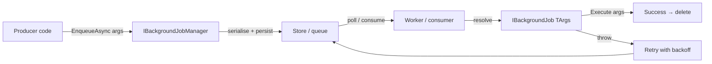

ABP draws a sharp line between two kinds of "things that run in the background": **background jobs** and **background workers**. A background **job** is a discrete, fire-and-forget unit of work — produced by some user-facing call, persisted with a payload, and executed once (with retries) by an asynchronous executor. A background **worker** is a long-running singleton — a daemon thread that ticks on a timer or cron schedule and is owned by the host process. They share infrastructure but are very different shapes.

This page covers the job side: the abstractions in `framework/src/Volo.Abp.BackgroundJobs.Abstractions/` and the conventions every job implementation (default, Hangfire, Quartz, RabbitMQ) plugs into. The companion page [Background workers overview](/background/background-workers) covers the worker side.

## The two halves of the API

A job has two halves that get registered independently in DI:

1. A **job args** class — a POCO holding the payload (e.g. `EmailingJobArgs { To, Subject, Body }`).
2. A **job handler** — a class implementing `IBackgroundJob<TArgs>` or `IAsyncBackgroundJob<TArgs>` that consumes those args.

Producers only see `IBackgroundJobManager.EnqueueAsync(args)`. The manager looks up the configured handler for that args type, serialises the args, and persists/dispatches the job. A worker (the `BackgroundJobWorker` for the default provider, the Hangfire server for Hangfire, the Quartz scheduler for Quartz, a RabbitMQ consumer for RabbitMQ) eventually deserialises the args, resolves the handler, and invokes it.



## IBackgroundJobManager

The producer-facing interface is tiny: one method, three knobs.

```csharp title="framework/src/Volo.Abp.BackgroundJobs.Abstractions/Volo/Abp/BackgroundJobs/IBackgroundJobManager.cs"
public interface IBackgroundJobManager
{
    Task<string> EnqueueAsync<TArgs>(
        TArgs args,
        BackgroundJobPriority priority = BackgroundJobPriority.Normal,
        TimeSpan? delay = null
    );
}
```

- `args` — the payload. Must be a type registered in `AbpBackgroundJobOptions` (see below).
- `priority` — one of `Low | BelowNormal | Normal | AboveNormal | High`.
- `delay` — optional wait before the first attempt.
- Returns a provider-specific job id (string). For the default provider it is the GUID; for Hangfire it is Hangfire's job id; for Quartz it is `JobKey.ToString()`; for RabbitMQ it is `null`.

### IsAvailable extension

Because the abstractions module ships a `NullBackgroundJobManager` that throws on every enqueue, libraries that *optionally* use jobs should guard their calls:

```csharp title="framework/src/Volo.Abp.BackgroundJobs.Abstractions/Volo/Abp/BackgroundJobs/BackgroundJobManagerExtensions.cs"
public static bool IsAvailable(this IBackgroundJobManager backgroundJobManager)
{
    return !(ProxyHelper.UnProxy(backgroundJobManager) is NullBackgroundJobManager);
}
```

If no provider module (default, Hangfire, Quartz, RabbitMQ) is loaded the null implementation stays in place and `IsAvailable()` returns `false`. The null manager itself:

```csharp title="framework/src/Volo.Abp.BackgroundJobs.Abstractions/Volo/Abp/BackgroundJobs/NullBackgroundJobManager.cs"
[Dependency(TryRegister = true)]
public class NullBackgroundJobManager : IBackgroundJobManager, ISingletonDependency
{
    public virtual Task<string> EnqueueAsync<TArgs>(
        TArgs args, BackgroundJobPriority priority = BackgroundJobPriority.Normal,
        TimeSpan? delay = null)
    {
        throw new AbpException("Background job system has not a real implementation. ...");
    }
}
```

The `[Dependency(TryRegister = true)]` is what lets a real provider win when one is registered.

## IBackgroundJob and IAsyncBackgroundJob

A job handler implements one of two single-method interfaces:

```csharp title="framework/src/Volo.Abp.BackgroundJobs.Abstractions/Volo/Abp/BackgroundJobs/IBackgroundJob.cs"
public interface IBackgroundJob<in TArgs>
{
    void Execute(TArgs args);
}
```

```csharp title="framework/src/Volo.Abp.BackgroundJobs.Abstractions/Volo/Abp/BackgroundJobs/IAsyncBackgroundJob.cs"
public interface IAsyncBackgroundJob<in TArgs>
{
    Task ExecuteAsync(TArgs args);
}
```

Two convenience base classes hand you a logger:

```csharp title="framework/src/Volo.Abp.BackgroundJobs.Abstractions/Volo/Abp/BackgroundJobs/BackgroundJob.cs"
public abstract class BackgroundJob<TArgs> : IBackgroundJob<TArgs>
{
    public ILogger<BackgroundJob<TArgs>> Logger { get; set; }
    protected BackgroundJob() { Logger = NullLogger<BackgroundJob<TArgs>>.Instance; }
    public abstract void Execute(TArgs args);
}
```

```csharp title="framework/src/Volo.Abp.BackgroundJobs.Abstractions/Volo/Abp/BackgroundJobs/AsyncBackgroundJob.cs"
public abstract class AsyncBackgroundJob<TArgs> : IAsyncBackgroundJob<TArgs>
{
    public ILogger<AsyncBackgroundJob<TArgs>> Logger { get; set; }
    protected AsyncBackgroundJob() { Logger = NullLogger<AsyncBackgroundJob<TArgs>>.Instance; }
    public abstract Task ExecuteAsync(TArgs args);
}
```

<Tip>
Use `AsyncBackgroundJob<TArgs>` for all new handlers — the synchronous `IBackgroundJob<TArgs>` path is mostly there for legacy reasons. The [BackgroundJobExecuter](#how-jobs-are-executed) prefers `ExecuteAsync` when both happen to be defined.
</Tip>

## BackgroundJobNameAttribute

Persisted providers (the default store, RabbitMQ) record jobs by **name**, not by .NET type — so renaming or moving the args class doesn't strand pending jobs. The name resolution is in:

```csharp title="framework/src/Volo.Abp.BackgroundJobs.Abstractions/Volo/Abp/BackgroundJobs/BackgroundJobNameAttribute.cs"
public class BackgroundJobNameAttribute : Attribute, IBackgroundJobNameProvider
{
    public string Name { get; }
    public BackgroundJobNameAttribute([NotNull] string name)
        => Name = Check.NotNullOrWhiteSpace(name, nameof(name));

    public static string GetName<TJobArgs>() => GetName(typeof(TJobArgs));

    public static string GetName([NotNull] Type jobArgsType)
    {
        Check.NotNull(jobArgsType, nameof(jobArgsType));
        return (jobArgsType
                    .GetCustomAttributes(true)
                    .OfType<IBackgroundJobNameProvider>()
                    .FirstOrDefault()
                    ?.Name
                ?? jobArgsType.FullName)!;
    }
}
```

The lookup order is:

1. Any custom attribute on the **args type** that implements `IBackgroundJobNameProvider` (the built-in `[BackgroundJobName("…")]` qualifies).
2. Otherwise, `jobArgsType.FullName`.

The `IBackgroundJobNameProvider` interface is intentionally open so you can declare custom attributes that also act as names:

```csharp title="framework/src/Volo.Abp.BackgroundJobs.Abstractions/Volo/Abp/BackgroundJobs/IBackgroundJobNameProvider.cs"
public interface IBackgroundJobNameProvider
{
    string Name { get; }
}
```

<Warning>
Once a job name is in production, **do not change it** without a migration plan — persisted jobs in `AbpBackgroundJobs` (default) or in RabbitMQ queues are looked up by name when they are dequeued.
</Warning>

## BackgroundJobPriority

A simple byte-backed enum used to order waiting jobs (highest first):

```csharp title="framework/src/Volo.Abp.BackgroundJobs.Abstractions/Volo/Abp/BackgroundJobs/BackgroundJobPriority.cs"
public enum BackgroundJobPriority : byte
{
    Low         = 5,
    BelowNormal = 10,
    Normal      = 15,
    AboveNormal = 20,
    High        = 25
}
```

The default provider's worker uses this priority directly in its `ORDER BY` (see `InMemoryBackgroundJobStore.GetWaitingJobsAsync` and `EfCoreBackgroundJobRepository.GetWaitingListQueryAsync`). Hangfire and Quartz do **not** honour ABP priority natively — they have their own queue/priority models.

## AbpBackgroundJobOptions

Every job handler ABP discovers in DI is registered in `AbpBackgroundJobOptions`. That registration is what lets the worker map a stored `JobName` back to a `JobType` / `ArgsType` at execution time.

```csharp title="framework/src/Volo.Abp.BackgroundJobs.Abstractions/Volo/Abp/BackgroundJobs/AbpBackgroundJobOptions.cs"
public class AbpBackgroundJobOptions
{
    public bool IsJobExecutionEnabled { get; set; } = true;

    public BackgroundJobConfiguration GetJob<TArgs>();
    public BackgroundJobConfiguration GetJob(Type argsType);
    public BackgroundJobConfiguration GetJob(string name);
    public IReadOnlyList<BackgroundJobConfiguration> GetJobs();

    public void AddJob<TJob>();
    public void AddJob(Type jobType);
    public void AddJob(BackgroundJobConfiguration jobConfiguration);
}
```

`IsJobExecutionEnabled` is a global kill switch — when set to `false`, **enqueue still works** but no worker will pick the job up. The framework toggles this automatically in two scenarios:

- When the app is launched in a data-migration context (`AbpBackgroundJobsModule.ConfigureServices` checks `IsDataMigrationEnvironment()`).
- When you set it manually, e.g. in a worker tier that should only enqueue.

The Hangfire and Quartz modules even refuse to spin up their servers if execution is disabled — see [Hangfire jobs](/background/hangfire-jobs) and [Quartz jobs](/background/quartz-jobs).

### BackgroundJobConfiguration

Each entry in the options is a `BackgroundJobConfiguration`:

```csharp title="framework/src/Volo.Abp.BackgroundJobs.Abstractions/Volo/Abp/BackgroundJobs/BackgroundJobConfiguration.cs"
public class BackgroundJobConfiguration
{
    public Type ArgsType { get; }
    public Type JobType { get; }
    public string JobName { get; }

    public BackgroundJobConfiguration(Type jobType)
    {
        JobType = jobType;
        ArgsType = BackgroundJobArgsHelper.GetJobArgsType(jobType);
        JobName = BackgroundJobNameAttribute.GetName(ArgsType);
    }
}
```

`BackgroundJobArgsHelper.GetJobArgsType` walks `jobType.GetInterfaces()`, looking for the closed `IBackgroundJob<>` or `IAsyncBackgroundJob<>` and returning its generic argument. If neither is found it throws.

### Auto-registration

You normally never call `AddJob` yourself. The `AbpBackgroundJobsAbstractionsModule` hooks every DI registration and registers anything that implements the job interfaces:

```csharp title="framework/src/Volo.Abp.BackgroundJobs.Abstractions/Volo/Abp/BackgroundJobs/AbpBackgroundJobsAbstractionsModule.cs"
public override void PreConfigureServices(ServiceConfigurationContext context)
{
    RegisterJobs(context.Services);
}

private static void RegisterJobs(IServiceCollection services)
{
    var jobTypes = new List<Type>();
    services.OnRegistered(context =>
    {
        if (ReflectionHelper.IsAssignableToGenericType(context.ImplementationType, typeof(IBackgroundJob<>)) ||
            ReflectionHelper.IsAssignableToGenericType(context.ImplementationType, typeof(IAsyncBackgroundJob<>)))
        {
            jobTypes.Add(context.ImplementationType);
        }
    });

    services.Configure<AbpBackgroundJobOptions>(options =>
    {
        foreach (var jobType in jobTypes)
        {
            options.AddJob(jobType);
        }
    });
}
```

So any class you write that implements `IAsyncBackgroundJob<TArgs>` becomes enqueueable as long as the conventional registrar picked it up. See [Conventional registration](/di/conventional-registration).

## How jobs are executed

All four providers share one terminal piece: `BackgroundJobExecuter`. The worker (default), the Hangfire adapter, the Quartz `IJob` adapter, and the RabbitMQ consumer all build a `JobExecutionContext` and hand it to:

```csharp title="framework/src/Volo.Abp.BackgroundJobs.Abstractions/Volo/Abp/BackgroundJobs/IBackgroundJobExecuter.cs"
public interface IBackgroundJobExecuter
{
    Task ExecuteAsync(JobExecutionContext context);
}
```

The context carries the per-call essentials:

```csharp title="framework/src/Volo.Abp.BackgroundJobs.Abstractions/Volo/Abp/BackgroundJobs/JobExecutionContext.cs"
public class JobExecutionContext : IServiceProviderAccessor
{
    public IServiceProvider ServiceProvider { get; }
    public Type JobType { get; }
    public object JobArgs { get; }
    public CancellationToken CancellationToken { get; }
    // ctor takes all four
}
```

`BackgroundJobExecuter` resolves the handler, picks `ExecuteAsync` (preferring async over sync), wires multi-tenancy and cancellation, and rethrows failures wrapped in `BackgroundJobExecutionException`:

```csharp title="framework/src/Volo.Abp.BackgroundJobs.Abstractions/Volo/Abp/BackgroundJobs/BackgroundJobExecuter.cs"
public virtual async Task ExecuteAsync(JobExecutionContext context)
{
    var job = context.ServiceProvider.GetService(context.JobType);
    if (job == null)
        throw new AbpException("The job type is not registered to DI: " + context.JobType);

    var jobExecuteMethod = context.JobType.GetMethod(nameof(IBackgroundJob<object>.Execute)) ??
                           context.JobType.GetMethod(nameof(IAsyncBackgroundJob<object>.ExecuteAsync));
    if (jobExecuteMethod == null)
        throw new AbpException(...);

    try
    {
        using(CurrentTenant.Change(GetJobArgsTenantId(context.JobArgs)))
        {
            var cancellationTokenProvider =
                context.ServiceProvider.GetRequiredService<ICancellationTokenProvider>();

            using (cancellationTokenProvider.Use(context.CancellationToken))
            {
                if (jobExecuteMethod.Name == nameof(IAsyncBackgroundJob<object>.ExecuteAsync))
                    await ((Task)jobExecuteMethod.Invoke(job, new[] { context.JobArgs })!);
                else
                    jobExecuteMethod.Invoke(job, new[] { context.JobArgs });
            }
        }
    }
    catch (Exception ex)
    {
        Logger.LogException(ex);
        await context.ServiceProvider
            .GetRequiredService<IExceptionNotifier>()
            .NotifyAsync(new ExceptionNotificationContext(ex));

        throw new BackgroundJobExecutionException(...)
        {
            JobType = context.JobType.AssemblyQualifiedName!,
            JobArgs = context.JobArgs
        };
    }
}

protected virtual Guid? GetJobArgsTenantId(object jobArgs)
{
    return jobArgs switch
    {
        IMultiTenant multiTenantJobArgs => multiTenantJobArgs.TenantId,
        _ => CurrentTenant.Id
    };
}
```

Two behaviours worth pinning down:

- **Multi-tenancy.** If your args class implements `IMultiTenant`, the tenant on the args wins — the executor switches `ICurrentTenant` to that tenant for the duration. Otherwise it stays in whatever tenant the worker is running in. See [Multi-tenancy](/overview/glossary).
- **Exception notification.** Failed executions are pushed through `IExceptionNotifier` so subscribers see them, *and* rethrown as `BackgroundJobExecutionException` so the provider's retry layer (default worker's backoff, Quartz's retry strategy, RabbitMQ's `BasicReject(requeue:true)`) kicks in.

## Module map

| Module | csproj | Role |
| --- | --- | --- |
| Abstractions | `Volo.Abp.BackgroundJobs.Abstractions` | `IBackgroundJobManager`, args helpers, executer, options, null impl |
| Default core | `Volo.Abp.BackgroundJobs` | `DefaultBackgroundJobManager`, `BackgroundJobWorker`, `InMemoryBackgroundJobStore` |
| Persisted store | `Volo.Abp.BackgroundJobs.Domain` + EF/Mongo | `BackgroundJobRecord`, `IBackgroundJobRepository`, `BackgroundJobStore` |
| Hangfire | `Volo.Abp.BackgroundJobs.HangFire` | `HangfireBackgroundJobManager`, `HangfireJobExecutionAdapter<TArgs>` |
| Quartz | `Volo.Abp.BackgroundJobs.Quartz` | `QuartzBackgroundJobManager`, `QuartzJobExecutionAdapter<TArgs>` |
| RabbitMQ | `Volo.Abp.BackgroundJobs.RabbitMQ` | `RabbitMqBackgroundJobManager`, `IJobQueue<TArgs>`, `JobQueueManager` |

Pick a provider by referencing exactly one of the last four. They each replace `NullBackgroundJobManager` via `[Dependency(ReplaceServices = true)]`.

## File inventory — abstractions

| File | Purpose |
| --- | --- |
| `IBackgroundJobManager.cs` | Producer interface (`EnqueueAsync<TArgs>`). |
| `IBackgroundJob.cs` / `BackgroundJob.cs` | Sync handler interface + base class. |
| `IAsyncBackgroundJob.cs` / `AsyncBackgroundJob.cs` | Async handler interface + base class. |
| `BackgroundJobNameAttribute.cs` | `[BackgroundJobName("…")]` + name resolution. |
| `IBackgroundJobNameProvider.cs` | Marker interface for custom name attributes. |
| `BackgroundJobPriority.cs` | Five-level priority enum. |
| `AbpBackgroundJobOptions.cs` | Registry of `BackgroundJobConfiguration` + `IsJobExecutionEnabled`. |
| `BackgroundJobConfiguration.cs` | Triple of (ArgsType, JobType, JobName). |
| `BackgroundJobArgsHelper.cs` | Reflects job interfaces to find `TArgs`. |
| `BackgroundJobManagerExtensions.cs` | `IsAvailable()` proxy-aware check. |
| `NullBackgroundJobManager.cs` | Throwing fallback when no provider is loaded. |
| `IBackgroundJobExecuter.cs` / `BackgroundJobExecuter.cs` | The executer used by every provider. |
| `JobExecutionContext.cs` | Per-execution bag (SP, JobType, JobArgs, CT). |
| `JobExecutionResult.cs` | `enum { Success, Failed }`. |
| `BackgroundJobExecutionException.cs` | Wraps handler failures with `JobType` + `JobArgs`. |
| `AbpBackgroundJobsAbstractionsModule.cs` | Auto-registers handlers via `OnRegistered`. |

## Minimal end-to-end example

```csharp title="EmailingJobArgs.cs"
[BackgroundJobName("Emailing")]
public class EmailingJobArgs
{
    public string To { get; set; }
    public string Subject { get; set; }
    public string Body { get; set; }
}
```

```csharp title="EmailSendingJob.cs"
public class EmailSendingJob : AsyncBackgroundJob<EmailingJobArgs>, ITransientDependency
{
    private readonly IEmailSender _emailSender;
    public EmailSendingJob(IEmailSender emailSender) => _emailSender = emailSender;

    public override async Task ExecuteAsync(EmailingJobArgs args)
        => await _emailSender.SendAsync(args.To, args.Subject, args.Body);
}
```

```csharp title="MyService.cs"
public class MyService : ITransientDependency
{
    private readonly IBackgroundJobManager _jobs;
    public MyService(IBackgroundJobManager jobs) => _jobs = jobs;

    public Task QueueWelcomeAsync(string to)
        => _jobs.EnqueueAsync(new EmailingJobArgs
        {
            To = to, Subject = "Welcome!", Body = "..."
        }, priority: BackgroundJobPriority.High);
}
```

The args class advertises the job under the stable name `"Emailing"`. `EmailSendingJob` is picked up by conventional registration and added to `AbpBackgroundJobOptions` because it implements `IAsyncBackgroundJob<EmailingJobArgs>`. The `EnqueueAsync` call hands off to whichever provider is active.

## Where to next

<CardGroup cols={2}>
  <Card title="Default job manager" icon="database" href="/background/default-job-manager">
    `DefaultBackgroundJobManager`, `BackgroundJobWorker`, `IBackgroundJobStore`, retry/backoff math.
  </Card>
  <Card title="Persisted store module" icon="layer-group" href="/background/background-jobs-module">
    `BackgroundJobRecord`, `IBackgroundJobRepository`, EF Core + MongoDB implementations.
  </Card>
  <Card title="Hangfire provider" icon="bolt" href="/background/hangfire-jobs">
    `HangfireBackgroundJobManager` + adapter, dashboard auth, queue routing.
  </Card>
  <Card title="Quartz provider" icon="clock" href="/background/quartz-jobs">
    `QuartzBackgroundJobManager`, retry strategy, scheduler integration.
  </Card>
  <Card title="RabbitMQ provider" icon="rabbit" href="/background/rabbitmq-jobs">
    `RabbitMqBackgroundJobManager`, `IJobQueue<TArgs>`, delayed queues.
  </Card>
  <Card title="Background workers" icon="repeat" href="/background/background-workers">
    Periodic/async base classes, `BackgroundWorkerManager`, host integration.
  </Card>
</CardGroup>

Jobs commonly interact with [Unit of Work](/uow/overview) (each execution starts a fresh DI scope, and your handler can request a UoW like any other component) and with the [event bus](/events/overview) for downstream propagation.
