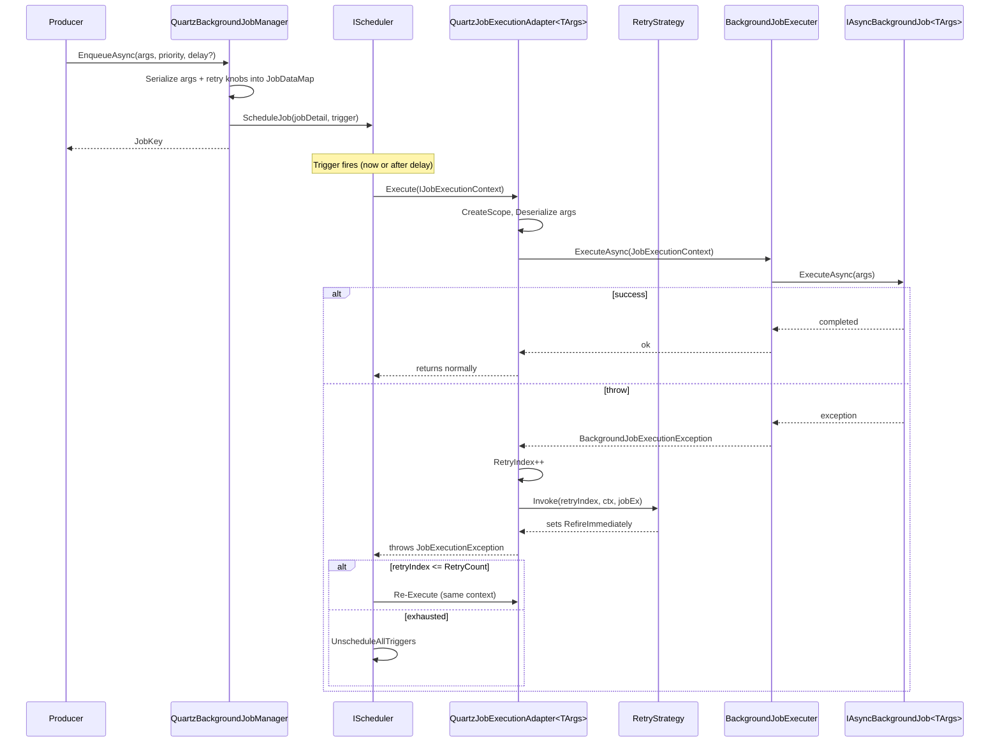

The Quartz integration plugs ABP's `IBackgroundJobManager` into Quartz.NET. Enqueued jobs become **one-shot Quartz triggers** that fire either immediately (`StartNow`) or at a future time (`StartAt`). Retries are not handled by ABP polling but by Quartz's `RefireImmediately` / `UnscheduleAllTriggers` mechanism, configurable via a strategy delegate.

The package is `Volo.Abp.BackgroundJobs.Quartz`. It depends on `AbpBackgroundJobsAbstractionsModule` (for the producer contract and `IBackgroundJobExecuter`) and `AbpQuartzModule` (for `IScheduler` and `AbpQuartzOptions`).

## File inventory

```text
framework/src/Volo.Abp.BackgroundJobs.Quartz/Volo/Abp/BackgroundJobs/Quartz/
├── AbpBackgroundJobsQuartzModule.cs           ← module wiring
├── AbpBackgroundJobQuartzOptions.cs           ← RetryCount, RetryIntervalMillisecond, RetryStrategy
├── QuartzBackgroundJobManager.cs              ← IBackgroundJobManager
├── QuartzBackgroundJobManageExtensions.cs     ← per-call retry override
└── QuartzJobExecutionAdapter.cs               ← IJob bridge to BackgroundJobExecuter
```

Plus, from `Volo.Abp.Quartz` (the host-level Quartz module):

| File | Role |
| --- | --- |
| `AbpQuartzModule.cs` | Calls `services.AddQuartz(...)`, exposes `IScheduler` via `ISchedulerFactory`. |
| `AbpQuartzOptions.cs` | `Properties`, `Configurator`, `StartDelay`, `StartSchedulerFactory`. |

## Module wiring

```csharp title="framework/src/Volo.Abp.BackgroundJobs.Quartz/Volo/Abp/BackgroundJobs/Quartz/AbpBackgroundJobsQuartzModule.cs"
[DependsOn(
    typeof(AbpBackgroundJobsAbstractionsModule),
    typeof(AbpQuartzModule)
)]
public class AbpBackgroundJobsQuartzModule : AbpModule
{
    public override void ConfigureServices(ServiceConfigurationContext context)
    {
        context.Services.AddTransient(typeof(QuartzJobExecutionAdapter<>));
    }

    public override void OnPreApplicationInitialization(ApplicationInitializationContext context)
    {
        var options = context.ServiceProvider.GetRequiredService<IOptions<AbpBackgroundJobOptions>>().Value;
        if (!options.IsJobExecutionEnabled)
        {
            var quartzOptions = context.ServiceProvider.GetRequiredService<IOptions<AbpQuartzOptions>>().Value;
            quartzOptions.StartSchedulerFactory = scheduler => Task.CompletedTask;
        }
    }
}
```

Two important behaviours:

- The generic adapter `QuartzJobExecutionAdapter<>` is registered as transient — Quartz resolves it through the DI-aware job factory configured by `AbpQuartzModule`.
- When `AbpBackgroundJobOptions.IsJobExecutionEnabled == false`, the module rewires `AbpQuartzOptions.StartSchedulerFactory` to a no-op. The scheduler is built but never `Start()`-ed, so the process can enqueue (the scheduler is still functional) but never fires jobs. This mirrors the [Hangfire enqueue-only pattern](/background/hangfire-jobs).

## QuartzBackgroundJobManager

```csharp title="framework/src/Volo.Abp.BackgroundJobs.Quartz/Volo/Abp/BackgroundJobs/Quartz/QuartzBackgroundJobManager.cs"
[Dependency(ReplaceServices = true)]
public class QuartzBackgroundJobManager : IBackgroundJobManager, ITransientDependency
{
    public const string JobDataPrefix = "Abp";
    public const string RetryIndex = "RetryIndex";

    protected IScheduler Scheduler { get; }
    protected AbpBackgroundJobQuartzOptions Options { get; }
    protected IJsonSerializer JsonSerializer { get; }

    public QuartzBackgroundJobManager(
        IScheduler scheduler,
        IOptions<AbpBackgroundJobQuartzOptions> options,
        IJsonSerializer jsonSerializer)
    {
        Scheduler = scheduler;
        JsonSerializer = jsonSerializer;
        Options = options.Value;
    }

    public virtual async Task<string> EnqueueAsync<TArgs>(TArgs args,
        BackgroundJobPriority priority = BackgroundJobPriority.Normal,
        TimeSpan? delay = null)
        => await ReEnqueueAsync(args, Options.RetryCount, Options.RetryIntervalMillisecond, priority, delay);

    public virtual async Task<string> ReEnqueueAsync<TArgs>(TArgs args,
        int retryCount, int retryIntervalMillisecond,
        BackgroundJobPriority priority = BackgroundJobPriority.Normal,
        TimeSpan? delay = null)
    {
        var jobDataMap = new JobDataMap
        {
            {nameof(TArgs), JsonSerializer.Serialize(args!)},
            {JobDataPrefix + nameof(Options.RetryCount), retryCount.ToString()},
            {JobDataPrefix + nameof(Options.RetryIntervalMillisecond), retryIntervalMillisecond.ToString()},
            {JobDataPrefix + RetryIndex, "0"}
        };

        var jobDetail = JobBuilder.Create<QuartzJobExecutionAdapter<TArgs>>()
                                  .RequestRecovery()
                                  .SetJobData(jobDataMap)
                                  .Build();

        var trigger = !delay.HasValue
            ? TriggerBuilder.Create().StartNow().Build()
            : TriggerBuilder.Create().StartAt(new DateTimeOffset(DateTime.Now.Add(delay.Value))).Build();

        await Scheduler.ScheduleJob(jobDetail, trigger);
        return jobDetail.Key.ToString();
    }
}
```

Things worth highlighting:

- `[Dependency(ReplaceServices = true)]` — it replaces whatever `IBackgroundJobManager` was registered before (typically the null one).
- The closed generic `QuartzJobExecutionAdapter<TArgs>` is the actual Quartz `IJob` that will run. Each `TArgs` produces a different concrete type Quartz sees.
- Args are serialised as JSON into Quartz's `JobDataMap`. Keys:
  - `TArgs` — the serialised payload.
  - `Abp` + `RetryCount`, `Abp` + `RetryIntervalMillisecond` — per-enqueue retry tuning (defaulted from `AbpBackgroundJobQuartzOptions`).
  - `Abp` + `RetryIndex` — the live counter incremented on each refire.
- `RequestRecovery()` asks Quartz to re-execute the job after a scheduler crash (where the storage type supports it — see `AbpQuartzOptions.Properties`).
- For delayed enqueue, `DateTime.Now` is used (machine local time) and converted to `DateTimeOffset`.
- `BackgroundJobPriority` is **accepted but ignored** — Quartz has its own trigger-priority concept that this integration does not surface.
- The returned id is `jobDetail.Key.ToString()` — an auto-generated `JobKey` (a `name.group` pair).

### Per-call retry override

```csharp title="framework/src/Volo.Abp.BackgroundJobs.Quartz/Volo/Abp/BackgroundJobs/Quartz/QuartzBackgroundJobManageExtensions.cs"
public static class QuartzBackgroundJobManageExtensions
{
    public static async Task<string?> EnqueueAsync<TArgs>(this IBackgroundJobManager backgroundJobManager,
        TArgs args, int retryCount, int retryIntervalMillisecond,
        BackgroundJobPriority priority = BackgroundJobPriority.Normal, TimeSpan? delay = null)
    {
        if (backgroundJobManager is QuartzBackgroundJobManager quartzBackgroundJobManager)
        {
            return await quartzBackgroundJobManager.ReEnqueueAsync(
                args, retryCount, retryIntervalMillisecond, priority, delay);
        }
        return null;
    }
}
```

A type-checked extension method — if the active manager isn't Quartz, it returns `null` so callers can fall back gracefully. Use it when one particular job needs more (or fewer) retries than the default.

## AbpBackgroundJobQuartzOptions

```csharp title="framework/src/Volo.Abp.BackgroundJobs.Quartz/Volo/Abp/BackgroundJobs/Quartz/AbpBackgroundJobQuartzOptions.cs"
public class AbpBackgroundJobQuartzOptions
{
    public int RetryCount { get; set; }                    // default 3
    public int RetryIntervalMillisecond { get; set; }      // default 3000

    [NotNull]
    public Func<int, IJobExecutionContext, JobExecutionException, Task> RetryStrategy { get; set; }

    public AbpBackgroundJobQuartzOptions()
    {
        RetryCount = 3;
        RetryIntervalMillisecond = 3000;
        _retryStrategy = DefaultRetryStrategy;
    }

    private async Task DefaultRetryStrategy(
        int retryIndex, IJobExecutionContext executionContext, JobExecutionException exception)
    {
        exception.RefireImmediately = true;

        var retryCount = executionContext.JobDetail.JobDataMap
            .GetString(QuartzBackgroundJobManager.JobDataPrefix + nameof(RetryCount))!.To<int>();
        if (retryIndex > retryCount)
        {
            exception.RefireImmediately = false;
            exception.UnscheduleAllTriggers = true;
            return;
        }

        var retryInterval = executionContext.JobDetail.JobDataMap
            .GetString(QuartzBackgroundJobManager.JobDataPrefix + nameof(RetryIntervalMillisecond))!.To<int>();
        await Task.Delay(retryInterval);
    }
}
```

The default strategy is straightforward:

1. On failure, set `RefireImmediately = true` and wait `RetryInterval` (3 s by default).
2. If the current `retryIndex` has exceeded `RetryCount`, flip `RefireImmediately = false`, set `UnscheduleAllTriggers = true`, and let the job die.

Override `RetryStrategy` to change the policy (exponential backoff, max delay caps, dead-letter writes, etc.). It receives the live retry index, Quartz's `IJobExecutionContext`, and the `JobExecutionException` you can mutate.

<Warning>
`Task.Delay(retryInterval)` blocks the Quartz worker thread for the wait duration. With a small thread pool and a flood of failing jobs you can starve healthy work. Consider raising `quartz.threadPool.threadCount` or replacing the strategy with one that reschedules on a future trigger instead of refiring.
</Warning>

## QuartzJobExecutionAdapter

```csharp title="framework/src/Volo.Abp.BackgroundJobs.Quartz/Volo/Abp/BackgroundJobs/Quartz/QuartzJobExecutionAdapter.cs"
public class QuartzJobExecutionAdapter<TArgs> : IJob
{
    protected AbpBackgroundJobOptions Options { get; }
    protected AbpBackgroundJobQuartzOptions BackgroundJobQuartzOptions { get; }
    protected IServiceScopeFactory ServiceScopeFactory { get; }
    protected IBackgroundJobExecuter JobExecuter { get; }
    protected IJsonSerializer JsonSerializer { get; }

    public async Task Execute(IJobExecutionContext context)
    {
        using (var scope = ServiceScopeFactory.CreateScope())
        {
            var args = JsonSerializer.Deserialize<TArgs>(
                context.JobDetail.JobDataMap.GetString(nameof(TArgs))!);

            var jobType = Options.GetJob(typeof(TArgs)).JobType;
            var jobContext = new JobExecutionContext(scope.ServiceProvider, jobType, args!,
                                                    cancellationToken: context.CancellationToken);
            try
            {
                await JobExecuter.ExecuteAsync(jobContext);
            }
            catch (Exception exception)
            {
                var jobExecutionException = new JobExecutionException(exception);

                var retryIndex = context.JobDetail.JobDataMap
                    .GetString(QuartzBackgroundJobManager.JobDataPrefix + QuartzBackgroundJobManager.RetryIndex)!
                    .To<int>();
                retryIndex++;
                context.JobDetail.JobDataMap.Put(
                    QuartzBackgroundJobManager.JobDataPrefix + QuartzBackgroundJobManager.RetryIndex,
                    retryIndex.ToString());

                await BackgroundJobQuartzOptions.RetryStrategy
                    .Invoke(retryIndex, context, jobExecutionException);

                throw jobExecutionException;
            }
        }
    }
}
```

The flow per execution:

1. Quartz instantiates `QuartzJobExecutionAdapter<TArgs>` via the DI-aware job factory.
2. A fresh service scope is created; the args are deserialised from the `JobDataMap`.
3. `BackgroundJobExecuter.ExecuteAsync` resolves the user handler and runs it (same multi-tenancy, same exception-notifier integration as every other provider — see [jobs overview](/background/jobs-overview)).
4. On failure, the adapter increments `RetryIndex` in the data map, invokes the strategy, and rethrows the `JobExecutionException`. The strategy sets `RefireImmediately` so Quartz re-executes the same job instance, with the updated data map preserved.

## Sequence: enqueue, execute, retry



## AbpQuartzModule and the host

```csharp title="framework/src/Volo.Abp.Quartz/Volo/Abp/Quartz/AbpQuartzModule.cs"
public override void ConfigureServices(ServiceConfigurationContext context)
{
    var options = context.Services.ExecutePreConfiguredActions<AbpQuartzOptions>();

    context.Services.AddQuartz(options.Properties, build =>
    {
        if (options.Properties[StdSchedulerFactory.PropertySchedulerTypeLoadHelperType] == null)
            build.UseSimpleTypeLoader();

        if (options.Properties[StdSchedulerFactory.PropertyJobStoreType] == null)
            build.UseInMemoryStore();

        if (options.Properties[StdSchedulerFactory.PropertyThreadPoolType] == null)
            build.UseDefaultThreadPool(tp => { tp.MaxConcurrency = 10; });

        if (options.Properties["quartz.plugin.timeZoneConverter.type"] == null)
            build.UseTimeZoneConverter();

        options.Configurator?.Invoke(build);
    });

    context.Services.AddSingleton(serviceProvider
        => AsyncHelper.RunSync(() => serviceProvider.GetRequiredService<ISchedulerFactory>().GetScheduler()));
}
```

Defaults: simple type loader, **in-memory store**, 10-thread thread pool, time-zone converter plugin. Use `Configure<AbpQuartzOptions>(o => o.Configurator = build => …)` to layer on `UsePersistentStore(...)` or pin the thread count for production.

```csharp title="framework/src/Volo.Abp.Quartz/Volo/Abp/Quartz/AbpQuartzOptions.cs"
public class AbpQuartzOptions
{
    public NameValueCollection Properties { get; set; }
    public Action<IServiceCollectionQuartzConfigurator>? Configurator { get; set; }
    public TimeSpan StartDelay { get; set; }                      // default 0
    public Func<IScheduler, Task> StartSchedulerFactory { get; set; }
}
```

The `StartSchedulerFactory` delegate is what `AbpQuartzModule.OnApplicationInitializationAsync` invokes — and what the BackgroundJobs.Quartz module overrides to a no-op when execution is disabled.

## Sample usage

```csharp title="EmailSendingJob.cs"
public class EmailSendingJob : AsyncBackgroundJob<EmailingJobArgs>, ITransientDependency
{
    public override Task ExecuteAsync(EmailingJobArgs args)
        => /* ... */;
}
```

```csharp title="Producer.cs"
public class MyService : ITransientDependency
{
    private readonly IBackgroundJobManager _jobs;
    public MyService(IBackgroundJobManager jobs) => _jobs = jobs;

    public Task SendDefaultAsync(EmailingJobArgs args)
        => _jobs.EnqueueAsync(args);

    // Override retries just for this enqueue:
    public Task SendCriticalAsync(EmailingJobArgs args)
        => _jobs.EnqueueAsync(args, retryCount: 10, retryIntervalMillisecond: 1000);
}
```

The second call uses `QuartzBackgroundJobManageExtensions.EnqueueAsync` — it succeeds on Quartz and falls through to `null` on other providers.

## What Quartz gives you that the default provider doesn't

- A first-class **scheduler** with persistent (ADO.NET) or clustered job stores via Quartz configuration.
- **Misfire policies** for jobs whose fire time was missed during downtime.
- Compatibility with [Quartz workers](/background/quartz-workers) — periodic and cron-based — sharing the same scheduler.

## What you give up vs the default provider

- ABP's `BackgroundJobPriority` is **ignored**.
- ABP's exponential-backoff math is replaced by a refire-immediately strategy with sleep — the default isn't a proper backoff.
- The returned id is a `JobKey` string, not a `Guid`.
- No dashboard out of the box.

## Reference

<CardGroup cols={3}>
  <Card title="Jobs overview" icon="briefcase" href="/background/jobs-overview">
    Producer contract, `[BackgroundJobName]`, executer.
  </Card>
  <Card title="Default job manager" icon="database" href="/background/default-job-manager">
    Compare with ABP's in-process worker + store.
  </Card>
  <Card title="Quartz workers" icon="repeat" href="/background/quartz-workers">
    `QuartzBackgroundWorkerManager` and `IQuartzBackgroundWorker` for cron/periodic work.
  </Card>
  <Card title="Hangfire jobs" icon="bolt" href="/background/hangfire-jobs">
    Alternative provider with a dashboard.
  </Card>
  <Card title="RabbitMQ jobs" icon="rabbit" href="/background/rabbitmq-jobs">
    Alternative queue-based provider.
  </Card>
  <Card title="Unit of work" icon="arrows-rotate" href="/uow/overview">
    Pattern for enqueuing after a transaction commits.
  </Card>
</CardGroup>
