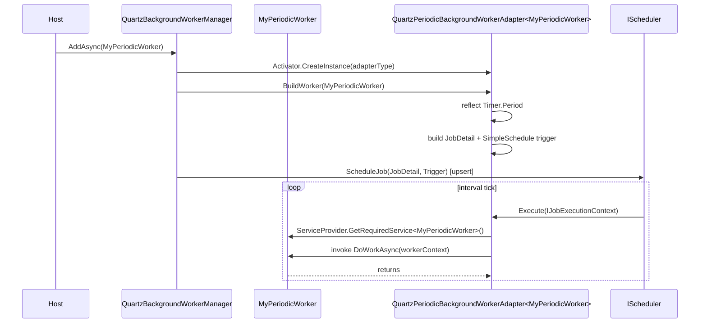

The Quartz-backed worker manager runs ABP's [background workers](/background/background-workers) as Quartz jobs on a shared `IScheduler`. That gives you Quartz's scheduling features — cron triggers, calendars, misfire policies, persistent stores, clustering — and integrates the same way the [Quartz jobs](/background/quartz-jobs) provider does, sharing the same `AbpQuartzModule` underneath.

Two kinds of worker are supported:

- **Native Quartz workers** that implement `IQuartzBackgroundWorker` and bring their own `IJobDetail` + `ITrigger`.
- **Standard periodic workers** (`PeriodicBackgroundWorkerBase` / `AsyncPeriodicBackgroundWorkerBase`) whose `Timer.Period` is wrapped in an adapter that schedules a simple-interval Quartz trigger.

The package is `Volo.Abp.BackgroundWorkers.Quartz`. It depends on `AbpBackgroundWorkersModule` and `AbpQuartzModule`.

## File inventory

```text
framework/src/Volo.Abp.BackgroundWorkers.Quartz/Volo/Abp/BackgroundWorkers/Quartz/
├── AbpBackgroundWorkerQuartzOptions.cs          ← IsAutoRegisterEnabled
├── AbpBackgroundWorkersQuartzModule.cs          ← module wiring
├── AbpQuartzConventionalRegistrar.cs            ← exposes IQuartzBackgroundWorker for DI
├── IQuartzBackgroundWorker.cs                   ← Trigger, JobDetail, AutoRegister, ScheduleJob
├── IQuartzBackgroundWorkerAdapter.cs            ← BuildWorker(IBackgroundWorker)
├── QuartzBackgroundWorkerBase.cs                ← starter base implementing IQuartzBackgroundWorker
├── QuartzBackgroundWorkerManager.cs             ← replaces BackgroundWorkerManager
└── QuartzPeriodicBackgroundWorkerAdapter.cs     ← wraps a periodic worker as IQuartzBackgroundWorker
```

## Module wiring

```csharp title="framework/src/Volo.Abp.BackgroundWorkers.Quartz/Volo/Abp/BackgroundWorkers/Quartz/AbpBackgroundWorkersQuartzModule.cs"
[DependsOn(
    typeof(AbpBackgroundWorkersModule),
    typeof(AbpQuartzModule))]
public class AbpBackgroundWorkersQuartzModule : AbpModule
{
    public override void PreConfigureServices(ServiceConfigurationContext context)
        => context.Services.AddConventionalRegistrar(new AbpQuartzConventionalRegistrar());

    public override void ConfigureServices(ServiceConfigurationContext context)
        => context.Services.AddSingleton(typeof(QuartzPeriodicBackgroundWorkerAdapter<>));

    public override void OnPreApplicationInitialization(ApplicationInitializationContext context)
    {
        var options = context.ServiceProvider.GetRequiredService<IOptions<AbpBackgroundWorkerOptions>>().Value;
        if (!options.IsEnabled)
        {
            var quartzOptions = context.ServiceProvider.GetRequiredService<IOptions<AbpQuartzOptions>>().Value;
            quartzOptions.StartSchedulerFactory = _ => Task.CompletedTask;
        }
    }

    public async override Task OnApplicationInitializationAsync(ApplicationInitializationContext context)
    {
        var quartzBackgroundWorkerOptions = context.ServiceProvider
            .GetRequiredService<IOptions<AbpBackgroundWorkerQuartzOptions>>().Value;

        if (quartzBackgroundWorkerOptions.IsAutoRegisterEnabled)
        {
            var backgroundWorkerManager = context.ServiceProvider.GetRequiredService<IBackgroundWorkerManager>();
            var works = context.ServiceProvider.GetServices<IQuartzBackgroundWorker>().Where(x => x.AutoRegister);
            foreach (var work in works)
                await backgroundWorkerManager.AddAsync(work);
        }
    }
}
```

Four behaviours:

- **Custom conventional registrar.** `AbpQuartzConventionalRegistrar` makes sure any class implementing `IQuartzBackgroundWorker` is registered with `IQuartzBackgroundWorker` as its only exposed service. This is what lets `context.ServiceProvider.GetServices<IQuartzBackgroundWorker>()` return them all.
- **Adapter registration.** `QuartzPeriodicBackgroundWorkerAdapter<>` is a singleton open generic.
- **Enqueue-only mode.** If `AbpBackgroundWorkerOptions.IsEnabled == false`, the module rewires Quartz's `StartSchedulerFactory` to a no-op (matching the [Quartz jobs](/background/quartz-jobs) module's pattern).
- **Auto-register.** When `IsAutoRegisterEnabled` (default `true`), every `IQuartzBackgroundWorker` whose `AutoRegister == true` is added to the worker manager at startup. The adapter for periodic workers sets `AutoRegister = false` for itself — they're added explicitly by the manager.

## AbpQuartzConventionalRegistrar

```csharp title="framework/src/Volo.Abp.BackgroundWorkers.Quartz/Volo/Abp/BackgroundWorkers/Quartz/AbpQuartzConventionalRegistrar.cs"
public class AbpQuartzConventionalRegistrar : DefaultConventionalRegistrar
{
    protected override bool IsConventionalRegistrationDisabled(Type type)
        => !typeof(IQuartzBackgroundWorker).IsAssignableFrom(type) || base.IsConventionalRegistrationDisabled(type);

    protected override List<Type> GetExposedServiceTypes(Type type)
        => new List<Type>() { typeof(IQuartzBackgroundWorker) };
}
```

This registrar is **additive** — it doesn't replace the framework's `DefaultConventionalRegistrar`. It just opts-in `IQuartzBackgroundWorker` types and exposes them under that single service type. Without it, a Quartz worker would still be registered (because it transitively implements `IBackgroundWorker : ISingletonDependency`) but it wouldn't be reachable via `GetServices<IQuartzBackgroundWorker>()`.

## IQuartzBackgroundWorker

```csharp title="framework/src/Volo.Abp.BackgroundWorkers.Quartz/Volo/Abp/BackgroundWorkers/Quartz/IQuartzBackgroundWorker.cs"
public interface IQuartzBackgroundWorker : IBackgroundWorker, IJob
{
    ITrigger Trigger { get; set; }
    IJobDetail JobDetail { get; set; }
    bool AutoRegister { get; set; }
    Func<IScheduler, Task>? ScheduleJob { get; set; }
}
```

Three knobs:

- `Trigger` / `JobDetail` — required (the default manager `Check.NotNull`s them). Quartz primitives the manager will schedule.
- `AutoRegister` — defaults to `true`. Set `false` if you want to enqueue the worker manually (e.g. dynamic scheduling driven by configuration).
- `ScheduleJob` — optional delegate. If set, the manager **delegates** scheduling to your function (handy when you want bespoke `Scheduler.ScheduleJob(...)` semantics: calendars, dependencies, conditional skip). When `null`, the manager calls the default scheduling routine.

### QuartzBackgroundWorkerBase

The starter base most projects use:

```csharp title="framework/src/Volo.Abp.BackgroundWorkers.Quartz/Volo/Abp/BackgroundWorkers/Quartz/QuartzBackgroundWorkerBase.cs"
public abstract class QuartzBackgroundWorkerBase : BackgroundWorkerBase, IQuartzBackgroundWorker
{
    public ITrigger Trigger { get; set; } = default!;
    public IJobDetail JobDetail { get; set; } = default!;
    public bool AutoRegister { get; set; } = true;
    public Func<IScheduler, Task>? ScheduleJob { get; set; } = null;

    public abstract Task Execute(IJobExecutionContext context);
}
```

`Execute(IJobExecutionContext)` is Quartz's `IJob.Execute`. You write your logic there.

## QuartzBackgroundWorkerManager

The replacement manager subclasses the default one and overrides `AddAsync` and the start/stop methods to drive `IScheduler`:

```csharp title="framework/src/Volo.Abp.BackgroundWorkers.Quartz/Volo/Abp/BackgroundWorkers/Quartz/QuartzBackgroundWorkerManager.cs"
[Dependency(ReplaceServices = true)]
public class QuartzBackgroundWorkerManager : BackgroundWorkerManager, ISingletonDependency
{
    protected IScheduler Scheduler { get; }

    public QuartzBackgroundWorkerManager(IScheduler scheduler) => Scheduler = scheduler;

    public async override Task StartAsync(CancellationToken cancellationToken = default)
    {
        if (Scheduler.IsStarted && Scheduler.InStandbyMode)
            await Scheduler.Start(cancellationToken);
        await base.StartAsync(cancellationToken);
    }

    public async override Task StopAsync(CancellationToken cancellationToken = default)
    {
        if (Scheduler.IsStarted && !Scheduler.InStandbyMode)
            await Scheduler.Standby(cancellationToken);
        await base.StopAsync(cancellationToken);
    }

    public async override Task AddAsync(IBackgroundWorker worker, CancellationToken cancellationToken = default)
        => await ReScheduleJobAsync(worker, cancellationToken);

    protected virtual async Task ReScheduleJobAsync(IBackgroundWorker worker, CancellationToken cancellationToken = default)
    {
        switch (worker)
        {
            case IQuartzBackgroundWorker quartzWork:
            {
                Check.NotNull(quartzWork.Trigger, nameof(quartzWork.Trigger));
                Check.NotNull(quartzWork.JobDetail, nameof(quartzWork.JobDetail));

                if (quartzWork.ScheduleJob != null)
                    await quartzWork.ScheduleJob.Invoke(Scheduler);
                else
                    await DefaultScheduleJobAsync(quartzWork, cancellationToken);
                break;
            }

            case AsyncPeriodicBackgroundWorkerBase or PeriodicBackgroundWorkerBase:
            {
                var adapterType = typeof(QuartzPeriodicBackgroundWorkerAdapter<>)
                    .MakeGenericType(ProxyHelper.GetUnProxiedType(worker));
                var workerAdapter = Activator.CreateInstance(adapterType) as IQuartzBackgroundWorkerAdapter;
                workerAdapter?.BuildWorker(worker);
                if (workerAdapter?.Trigger != null)
                    await DefaultScheduleJobAsync(workerAdapter, cancellationToken);
                break;
            }

            default:
                await base.AddAsync(worker, cancellationToken);
                break;
        }
    }

    protected virtual async Task DefaultScheduleJobAsync(IQuartzBackgroundWorker quartzWork, CancellationToken cancellationToken = default)
    {
        if (await Scheduler.CheckExists(quartzWork.JobDetail.Key, cancellationToken))
        {
            await Scheduler.AddJob(quartzWork.JobDetail, true, true, cancellationToken);
            await Scheduler.ResumeJob(quartzWork.JobDetail.Key, cancellationToken);
            await Scheduler.RescheduleJob(quartzWork.Trigger.Key, quartzWork.Trigger, cancellationToken);
        }
        else
        {
            await Scheduler.ScheduleJob(quartzWork.JobDetail, quartzWork.Trigger, cancellationToken);
        }
    }
}
```

Three code paths:

| Worker | Action |
| --- | --- |
| `IQuartzBackgroundWorker` | Use `ScheduleJob` if set; otherwise `DefaultScheduleJobAsync`, which **upserts** (re-schedules if the job already exists in the scheduler's store). |
| `AsyncPeriodicBackgroundWorkerBase` / `PeriodicBackgroundWorkerBase` | Wrap in a `QuartzPeriodicBackgroundWorkerAdapter<TWorker>` and schedule that. |
| Anything else | Fall back to the in-process default manager. |

The upsert path is what makes restarts safe against a persistent Quartz store: a job whose `JobKey` already exists is re-scheduled with the latest trigger, not duplicated.

`StartAsync` / `StopAsync` move the scheduler in and out of standby instead of starting/shutting down — leaves the scheduler reusable across host phases.

## QuartzPeriodicBackgroundWorkerAdapter

```csharp title="framework/src/Volo.Abp.BackgroundWorkers.Quartz/Volo/Abp/BackgroundWorkers/Quartz/QuartzPeriodicBackgroundWorkerAdapter.cs"
[DisallowConcurrentExecution]
public class QuartzPeriodicBackgroundWorkerAdapter<TWorker>
    : QuartzBackgroundWorkerBase, IQuartzBackgroundWorkerAdapter
    where TWorker : IBackgroundWorker
{
    private readonly MethodInfo? _doWorkAsyncMethod;
    private readonly MethodInfo? _doWorkMethod;

    public QuartzPeriodicBackgroundWorkerAdapter()
    {
        AutoRegister = false;
        _doWorkAsyncMethod = typeof(TWorker).GetMethod("DoWorkAsync", BindingFlags.Instance | BindingFlags.NonPublic);
        _doWorkMethod      = typeof(TWorker).GetMethod("DoWork",      BindingFlags.Instance | BindingFlags.NonPublic);
    }

    public void BuildWorker(IBackgroundWorker worker)
    {
        int? period;
        var workerType = ProxyHelper.GetUnProxiedType(worker);

        if (worker is AsyncPeriodicBackgroundWorkerBase or PeriodicBackgroundWorkerBase)
        {
            if (typeof(TWorker) != workerType)
                throw new ArgumentException($"{nameof(worker)} type is different from the generic type");

            var timer = workerType.GetProperty("Timer", BindingFlags.Instance | BindingFlags.NonPublic)?.GetValue(worker);
            period = worker is AsyncPeriodicBackgroundWorkerBase
                ? ((AbpAsyncTimer?)timer)?.Period
                : ((AbpTimer?)timer)?.Period;
        }
        else return;

        if (period == null) return;

        JobDetail = JobBuilder
            .Create<QuartzPeriodicBackgroundWorkerAdapter<TWorker>>()
            .WithIdentity(workerType.FullName!)
            .Build();
        Trigger = TriggerBuilder.Create()
            .WithIdentity(workerType.FullName!)
            .WithSimpleSchedule(builder => builder
                .WithInterval(TimeSpan.FromMilliseconds(period.Value))
                .RepeatForever())
            .Build();
    }

    public async override Task Execute(IJobExecutionContext context)
    {
        var worker = (IBackgroundWorker) ServiceProvider.GetRequiredService(typeof(TWorker));
        var workerContext = new PeriodicBackgroundWorkerContext(ServiceProvider, context.CancellationToken);

        switch (worker)
        {
            case AsyncPeriodicBackgroundWorkerBase asyncWorker:
                if (_doWorkAsyncMethod != null)
                    await (Task) (_doWorkAsyncMethod.Invoke(asyncWorker, new object[] { workerContext })!);
                break;
            case PeriodicBackgroundWorkerBase syncWorker:
                _doWorkMethod?.Invoke(syncWorker, new object[] { workerContext });
                break;
        }
    }
}
```

What this does:

- `[DisallowConcurrentExecution]` — Quartz will not run two instances of this adapter concurrently for the same `JobKey`. That matches the semantics of an in-process periodic worker, where `Timer` won't fire if a tick is already in flight (depending on implementation).
- `BuildWorker(IBackgroundWorker)` extracts `Timer.Period` from the wrapped worker by reflection and builds a Quartz `SimpleSchedule` that ticks at that interval forever.
- The `JobKey` identity is set to the worker's full type name, so re-scheduling on restart is idempotent.
- `Execute(IJobExecutionContext)` resolves the actual `TWorker` from DI each tick and reflectively invokes the protected `DoWorkAsync` (preferred) or `DoWork` with a `PeriodicBackgroundWorkerContext` carrying Quartz's cancellation token.

### IQuartzBackgroundWorkerAdapter

```csharp title="framework/src/Volo.Abp.BackgroundWorkers.Quartz/Volo/Abp/BackgroundWorkers/Quartz/IQuartzBackgroundWorkerAdapter.cs"
public interface IQuartzBackgroundWorkerAdapter : IQuartzBackgroundWorker
{
    void BuildWorker(IBackgroundWorker worker);
}
```

The interface separates "I'm a Quartz worker" from "I know how to build myself from another worker". It exists so that the manager can call `BuildWorker(...)` after `Activator.CreateInstance(adapterType)`.

## Sequence: periodic worker under Quartz



## Sample: native Quartz worker

```csharp title="MyCronWorker.cs"
public class MyCronWorker : QuartzBackgroundWorkerBase, ITransientDependency
{
    public MyCronWorker()
    {
        JobDetail = JobBuilder.Create<MyCronWorker>()
            .WithIdentity(nameof(MyCronWorker))
            .Build();
        Trigger = TriggerBuilder.Create()
            .WithIdentity(nameof(MyCronWorker) + "Trigger")
            .WithCronSchedule("0 0 2 * * ?")   // every day at 02:00
            .Build();
    }

    public override Task Execute(IJobExecutionContext context)
    {
        Logger.LogInformation("Nightly maintenance kicked off at {Now}", DateTime.UtcNow);
        return Task.CompletedTask;
    }
}
```

Because the `IsAutoRegisterEnabled` flag defaults to `true`, this worker is added at startup automatically and re-scheduled idempotently on every restart.

## Sample: periodic worker, unchanged

```csharp title="MyHeartbeatWorker.cs"
public class MyHeartbeatWorker : AsyncPeriodicBackgroundWorkerBase
{
    public MyHeartbeatWorker(AbpAsyncTimer timer, IServiceScopeFactory serviceScopeFactory)
        : base(timer, serviceScopeFactory)
    {
        Timer.Period = (int)TimeSpan.FromMinutes(5).TotalMilliseconds;
    }

    protected override Task DoWorkAsync(PeriodicBackgroundWorkerContext workerContext)
    {
        Logger.LogInformation("heartbeat");
        return Task.CompletedTask;
    }
}
```

```csharp title="MyAppHostModule.cs"
[DependsOn(typeof(AbpBackgroundWorkersQuartzModule))]
public class MyAppHostModule : AbpModule
{
    public override async Task OnApplicationInitializationAsync(ApplicationInitializationContext context)
    {
        await context.AddBackgroundWorkerAsync<MyHeartbeatWorker>();
    }
}
```

Nothing in the worker class changes — the adapter takes care of running it on Quartz.

## AbpBackgroundWorkerQuartzOptions

```csharp title="framework/src/Volo.Abp.BackgroundWorkers.Quartz/Volo/Abp/BackgroundWorkers/Quartz/AbpBackgroundWorkerQuartzOptions.cs"
public class AbpBackgroundWorkerQuartzOptions
{
    /// <summary>Default: true.</summary>
    public bool IsAutoRegisterEnabled { get; set; } = true;
}
```

One knob. Turn it off if you want to register `IQuartzBackgroundWorker`s manually (e.g. when the schedule comes from configuration that isn't ready at `OnApplicationInitializationAsync` time):

```csharp title="MyAppHostModule.cs"
Configure<AbpBackgroundWorkerQuartzOptions>(options => options.IsAutoRegisterEnabled = false);
```

Then in your own initialization step:

```csharp
var manager = ctx.ServiceProvider.GetRequiredService<IBackgroundWorkerManager>();
var workers = ctx.ServiceProvider.GetServices<IQuartzBackgroundWorker>();
foreach (var w in workers.Where(ShouldStart))
    await manager.AddAsync(w);
```

## What Quartz gives you that the default manager doesn't

- **Cron expressions** with full Quartz semantics (seconds, day-of-week, day-of-month).
- **Calendars, misfire policies, time zones** out of the box.
- **Persistent stores** (`UsePersistentStore(...)`) with clustering, so only one node in a cluster fires each tick.
- A common scheduler shared with the [Quartz jobs](/background/quartz-jobs) provider.

## What you give up vs the default manager

- Quartz must be configured (`AbpQuartzOptions.Configurator`) — see [Quartz jobs](/background/quartz-jobs) for the host wiring.
- The periodic adapter only knows about `SimpleSchedule` with a millisecond interval. Anything more sophisticated should use `IQuartzBackgroundWorker` directly.
- `[DisallowConcurrentExecution]` on the adapter means a long tick blocks the next one — this matches in-process semantics but may surprise teams expecting overlapping ticks.

## Reference

<CardGroup cols={3}>
  <Card title="Workers overview" icon="repeat" href="/background/background-workers">
    Base classes, manager, and lifecycle.
  </Card>
  <Card title="Quartz jobs" icon="clock" href="/background/quartz-jobs">
    The companion `IBackgroundJobManager` implementation.
  </Card>
  <Card title="Hangfire workers" icon="bolt" href="/background/hangfire-workers">
    The Hangfire-backed alternative.
  </Card>
  <Card title="Default job manager" icon="database" href="/background/default-job-manager">
    `BackgroundJobWorker`, the canonical in-process periodic worker.
  </Card>
  <Card title="DI conventional registration" icon="boxes-stacked" href="/di/conventional-registration">
    Custom registrars and the `AbpQuartzConventionalRegistrar` pattern.
  </Card>
  <Card title="Unit of work" icon="arrows-rotate" href="/uow/overview">
    Pattern for transactional work inside `Execute(IJobExecutionContext)`.
  </Card>
</CardGroup>
