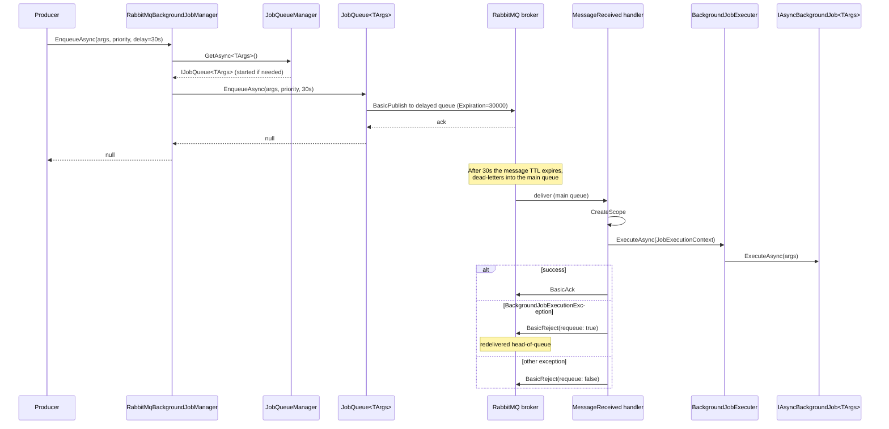

The RabbitMQ provider sends each `EnqueueAsync` call into AMQP as a single message and consumes it back on the same or another process. Each job-args type maps to its **own queue** (and a paired **delayed queue**, for `delay` support). There is no central store, no polling — Hangfire-style dashboards or Quartz-style scheduling are not in scope. Just a durable, distributed message bus.

The package is `Volo.Abp.BackgroundJobs.RabbitMQ`. It depends on `AbpBackgroundJobsAbstractionsModule`, `AbpRabbitMqModule` (channel pool, serializer), and `AbpThreadingModule` (for `IRunnable`).

## File inventory

```text
framework/src/Volo.Abp.BackgroundJobs.RabbitMQ/Volo/Abp/BackgroundJobs/RabbitMQ/
├── AbpBackgroundJobsRabbitMqModule.cs    ← module wiring (starts/stops the manager)
├── AbpRabbitMqBackgroundJobOptions.cs    ← queue-name prefixes, PrefetchCount, per-type overrides
├── IJobQueue.cs                          ← per-TArgs queue facade
├── IJobQueueManager.cs                   ← lookup/lifecycle
├── JobQueue.cs                           ← IJobQueue<TArgs> implementation
├── JobQueueConfiguration.cs              ← queue + delayed-queue declaration
├── JobQueueManager.cs                    ← starts a queue per registered job
└── RabbitMqBackgroundJobManager.cs       ← IBackgroundJobManager façade
```

## Module wiring

```csharp title="framework/src/Volo.Abp.BackgroundJobs.RabbitMQ/Volo/Abp/BackgroundJobs/RabbitMQ/AbpBackgroundJobsRabbitMqModule.cs"
[DependsOn(
    typeof(AbpBackgroundJobsAbstractionsModule),
    typeof(AbpRabbitMqModule),
    typeof(AbpThreadingModule)
)]
public class AbpBackgroundJobsRabbitMqModule : AbpModule
{
    public override void ConfigureServices(ServiceConfigurationContext context)
    {
        context.Services.AddSingleton(typeof(IJobQueue<>), typeof(JobQueue<>));
    }

    public async override Task OnApplicationInitializationAsync(ApplicationInitializationContext context)
        => await context.ServiceProvider.GetRequiredService<IJobQueueManager>().StartAsync();

    public async override Task OnApplicationShutdownAsync(ApplicationShutdownContext context)
        => await context.ServiceProvider.GetRequiredService<IJobQueueManager>().StopAsync();
}
```

Two notable points:

- `IJobQueue<>` is registered as a singleton open generic. Each closed `IJobQueue<TArgs>` is one long-lived AMQP channel.
- The manager is started in `OnApplicationInitializationAsync` and stopped in `OnApplicationShutdownAsync` — see [Module lifecycle](/modularity/module-lifecycle).

## RabbitMqBackgroundJobManager

The producer-facing manager is a thin façade over the queue manager:

```csharp title="framework/src/Volo.Abp.BackgroundJobs.RabbitMQ/Volo/Abp/BackgroundJobs/RabbitMQ/RabbitMqBackgroundJobManager.cs"
[Dependency(ReplaceServices = true)]
public class RabbitMqBackgroundJobManager : IBackgroundJobManager, ITransientDependency
{
    private readonly IJobQueueManager _jobQueueManager;

    public RabbitMqBackgroundJobManager(IJobQueueManager jobQueueManager)
        => _jobQueueManager = jobQueueManager;

    public async Task<string> EnqueueAsync<TArgs>(
        TArgs args,
        BackgroundJobPriority priority = BackgroundJobPriority.Normal,
        TimeSpan? delay = null)
    {
        var jobQueue = await _jobQueueManager.GetAsync<TArgs>();
        return (await jobQueue.EnqueueAsync(args, priority, delay))!;
    }
}
```

Two things worth flagging:

- `BackgroundJobPriority` is **accepted but not honoured** — the source even contains a `//TODO: How to handle priority` note in `JobQueue.PublishAsync`. AMQP supports priorities via queue arguments, but this integration doesn't wire them.
- The returned id is always `null`. RabbitMQ's "id" model (correlation id, delivery tag) is not a stable job identifier and is intentionally not exposed.

## IJobQueueManager and IJobQueue&lt;TArgs&gt;

```csharp title="framework/src/Volo.Abp.BackgroundJobs.RabbitMQ/Volo/Abp/BackgroundJobs/RabbitMQ/IJobQueueManager.cs"
public interface IJobQueueManager : IRunnable
{
    Task<IJobQueue<TArgs>> GetAsync<TArgs>();
}
```

```csharp title="framework/src/Volo.Abp.BackgroundJobs.RabbitMQ/Volo/Abp/BackgroundJobs/RabbitMQ/IJobQueue.cs"
public interface IJobQueue<in TArgs> : IRunnable, IDisposable
{
    Task<string?> EnqueueAsync(
        TArgs args,
        BackgroundJobPriority priority = BackgroundJobPriority.Normal,
        TimeSpan? delay = null);
}
```

`IRunnable` is the same ABP base that powers [Background workers](/background/background-workers) — it gives the queue a `StartAsync`/`StopAsync` lifecycle that the application's `IBackgroundWorkerManager` (and the queue manager) drives.

## JobQueueManager

```csharp title="framework/src/Volo.Abp.BackgroundJobs.RabbitMQ/Volo/Abp/BackgroundJobs/RabbitMQ/JobQueueManager.cs"
public class JobQueueManager : IJobQueueManager, ISingletonDependency
{
    public async Task StartAsync(CancellationToken cancellationToken = default)
    {
        if (!Options.IsJobExecutionEnabled) return;

        foreach (var jobConfiguration in Options.GetJobs())
        {
            var jobQueue = (IRunnable)ServiceProvider.GetRequiredService(
                typeof(IJobQueue<>).MakeGenericType(jobConfiguration.ArgsType));

            await jobQueue.StartAsync(cancellationToken);
            JobQueues[jobConfiguration.JobName] = jobQueue;
        }
    }

    public async Task<IJobQueue<TArgs>> GetAsync<TArgs>()
    {
        var jobConfiguration = Options.GetJob(typeof(TArgs));
        if (JobQueues.TryGetValue(jobConfiguration.JobName, out var jobQueue))
            return (IJobQueue<TArgs>)jobQueue;

        using (await SyncSemaphore.LockAsync())
        {
            if (JobQueues.TryGetValue(jobConfiguration.JobName, out jobQueue))
                return (IJobQueue<TArgs>)jobQueue;

            jobQueue = (IJobQueue<TArgs>)ServiceProvider
                .GetRequiredService(typeof(IJobQueue<>).MakeGenericType(typeof(TArgs)));
            await jobQueue.StartAsync();
            JobQueues.TryAdd(jobConfiguration.JobName, jobQueue);
            return (IJobQueue<TArgs>)jobQueue;
        }
    }
}
```

The manager does two jobs:

- **At startup**, when `IsJobExecutionEnabled == true`, it iterates every job registered in `AbpBackgroundJobOptions` and starts an `IJobQueue<TArgs>` for it. This is what attaches the **consumer** to RabbitMQ.
- **At enqueue time**, it lazily creates and starts an `IJobQueue<TArgs>` on first use — so producers don't need every job to be registered at startup.

The double-checked locking with `SyncSemaphore.LockAsync()` keeps the lazy init thread-safe.

## JobQueue&lt;TArgs&gt;

The heavy lifting lives in `JobQueue<TArgs>`. It owns an AMQP channel, declares the main + delayed queues, publishes outbound messages, and consumes inbound ones.

### Queue configuration

```csharp title="framework/src/Volo.Abp.BackgroundJobs.RabbitMQ/Volo/Abp/BackgroundJobs/RabbitMQ/JobQueue.cs"
protected virtual JobQueueConfiguration GetOrCreateJobQueueConfiguration()
{
    return AbpRabbitMqBackgroundJobOptions.JobQueues.GetOrDefault(typeof(TArgs)) ??
           new JobQueueConfiguration(
               typeof(TArgs),
               AbpRabbitMqBackgroundJobOptions.DefaultQueueNamePrefix + JobConfiguration.JobName,
               AbpRabbitMqBackgroundJobOptions.DefaultDelayedQueueNamePrefix + JobConfiguration.JobName,
               prefetchCount: AbpRabbitMqBackgroundJobOptions.PrefetchCount);
}
```

With the defaults that becomes:

| Args type | Main queue | Delayed queue |
| --- | --- | --- |
| `EmailingJobArgs` (named `Emailing`) | `AbpBackgroundJobs.Emailing` | `AbpBackgroundJobsDelayed.Emailing` |

You can override per type via `AbpRabbitMqBackgroundJobOptions.JobQueues[typeof(EmailingJobArgs)] = new JobQueueConfiguration(...)`.

### Declaring the queues

```csharp title="framework/src/Volo.Abp.BackgroundJobs.RabbitMQ/Volo/Abp/BackgroundJobs/RabbitMQ/JobQueue.cs"
protected virtual Task EnsureInitializedAsync()
{
    if (ChannelAccessor != null) return Task.CompletedTask;

    ChannelAccessor = ChannelPool.Acquire(
        ChannelPrefix + QueueConfiguration.QueueName,
        QueueConfiguration.ConnectionName);

    var result = QueueConfiguration.Declare(ChannelAccessor.Channel);
    QueueConfiguration.DeclareDelayed(ChannelAccessor.Channel);

    if (AbpBackgroundJobOptions.IsJobExecutionEnabled)
    {
        if (QueueConfiguration.PrefetchCount.HasValue)
            ChannelAccessor.Channel.BasicQos(0, QueueConfiguration.PrefetchCount.Value, false);

        Consumer = new AsyncEventingBasicConsumer(ChannelAccessor.Channel);
        Consumer.Received += MessageReceived;

        ChannelAccessor.Channel.BasicConsume(
            queue: QueueConfiguration.QueueName,
            autoAck: false,
            consumer: Consumer);
    }
    return Task.CompletedTask;
}
```

Two key behaviours:

- A channel is acquired from `IChannelPool` (provided by `Volo.Abp.RabbitMQ`) keyed by `JobQueue.<queueName>` and, optionally, a named connection.
- The consumer is only attached if `IsJobExecutionEnabled == true`. The same code path can be used in producer-only hosts: queues are declared, but nothing consumes.
- `autoAck: false` means each message is **explicitly** acknowledged after the handler returns (see below).

### Delayed-queue mechanics

```csharp title="framework/src/Volo.Abp.BackgroundJobs.RabbitMQ/Volo/Abp/BackgroundJobs/RabbitMQ/JobQueueConfiguration.cs"
public virtual QueueDeclareOk DeclareDelayed(IModel channel)
{
    var delayedArguments = new Dictionary<string, object>(Arguments)
    {
        ["x-dead-letter-routing-key"] = QueueName,
        ["x-dead-letter-exchange"]    = string.Empty
    };

    return channel.QueueDeclare(
        queue: DelayedQueueName,
        durable: Durable,
        exclusive: Exclusive,
        autoDelete: AutoDelete,
        arguments: delayedArguments);
}
```

The trick: the delayed queue declares itself with `x-dead-letter-exchange = ""` (the default exchange) and `x-dead-letter-routing-key = <main-queue>`. Messages published to the delayed queue with `BasicProperties.Expiration` set will, when their TTL elapses, be **dead-lettered into the main queue** and consumed normally. This is RabbitMQ's standard idiom for scheduled delivery without the delayed-message plugin.

The publish side:

```csharp title="framework/src/Volo.Abp.BackgroundJobs.RabbitMQ/Volo/Abp/BackgroundJobs/RabbitMQ/JobQueue.cs"
protected virtual Task PublishAsync(
    TArgs args,
    BackgroundJobPriority priority = BackgroundJobPriority.Normal,
    TimeSpan? delay = null)
{
    var routingKey = QueueConfiguration.QueueName;
    var basicProperties = CreateBasicPropertiesToPublish();

    if (delay.HasValue)
    {
        routingKey = QueueConfiguration.DelayedQueueName;
        basicProperties.Expiration = delay.Value.TotalMilliseconds.ToString();
    }

    ChannelAccessor!.Channel.BasicPublish(
        exchange: "",
        routingKey: routingKey,
        basicProperties: basicProperties,
        body: Serializer.Serialize(args!));

    return Task.CompletedTask;
}

protected virtual IBasicProperties CreateBasicPropertiesToPublish()
{
    var properties = ChannelAccessor!.Channel.CreateBasicProperties();
    properties.Persistent = true;
    return properties;
}
```

- Messages are **persistent** (`Persistent = true`) so they survive a broker restart, given the queue is durable.
- Delay is implemented purely with the message-TTL + DLX pattern.
- The body is whatever `IRabbitMqSerializer` produces — by default a UTF-8 JSON byte array.

### Consume + ack/reject

```csharp title="framework/src/Volo.Abp.BackgroundJobs.RabbitMQ/Volo/Abp/BackgroundJobs/RabbitMQ/JobQueue.cs"
protected virtual async Task MessageReceived(object sender, BasicDeliverEventArgs ea)
{
    using (var scope = ServiceScopeFactory.CreateScope())
    {
        var context = new JobExecutionContext(
            scope.ServiceProvider,
            JobConfiguration.JobType,
            Serializer.Deserialize(ea.Body.ToArray(), typeof(TArgs)));

        try
        {
            await JobExecuter.ExecuteAsync(context);
            ChannelAccessor!.Channel.BasicAck(deliveryTag: ea.DeliveryTag, multiple: false);
        }
        catch (BackgroundJobExecutionException)
        {
            ChannelAccessor!.Channel.BasicReject(deliveryTag: ea.DeliveryTag, requeue: true);
        }
        catch (Exception)
        {
            ChannelAccessor!.Channel.BasicReject(deliveryTag: ea.DeliveryTag, requeue: false);
        }
    }
}
```

The retry policy is simple and aggressive:

| Outcome | Channel action | Net effect |
| --- | --- | --- |
| Handler succeeds | `BasicAck(deliveryTag, multiple: false)` | Message removed. |
| Handler throws `BackgroundJobExecutionException` (the wrapper from `BackgroundJobExecuter`) | `BasicReject(requeue: true)` | Goes back to the head of the same queue. |
| Anything else (e.g. lookup/deserialise fails) | `BasicReject(requeue: false)` | Dropped (or sent to DLX if configured). |

<Warning>
Because `BasicReject(requeue: true)` puts the message back at the head of the queue, a permanently failing handler will **busy-loop** the broker. There is no built-in retry count. For long-tail retry behaviour, deploy a [Quartz](/background/quartz-jobs) or default-store retry strategy in front, configure RabbitMQ's per-queue limits / DLX policies, or replace `IJobQueue<TArgs>` with a custom one that counts retries.
</Warning>

## AbpRabbitMqBackgroundJobOptions

```csharp title="framework/src/Volo.Abp.BackgroundJobs.RabbitMQ/Volo/Abp/BackgroundJobs/RabbitMQ/AbpRabbitMqBackgroundJobOptions.cs"
public class AbpRabbitMqBackgroundJobOptions
{
    public Dictionary<Type, JobQueueConfiguration> JobQueues { get; }
    public string DefaultQueueNamePrefix { get; set; }          // "AbpBackgroundJobs."
    public string DefaultDelayedQueueNamePrefix { get; set; }   // "AbpBackgroundJobsDelayed."
    public ushort? PrefetchCount { get; set; }

    public AbpRabbitMqBackgroundJobOptions()
    {
        JobQueues = new Dictionary<Type, JobQueueConfiguration>();
        DefaultQueueNamePrefix = "AbpBackgroundJobs.";
        DefaultDelayedQueueNamePrefix = "AbpBackgroundJobsDelayed.";
    }
}
```

| Knob | What it does |
| --- | --- |
| `JobQueues[typeof(TArgs)]` | Per-type override. Use this to set a non-default queue name, a named connection, an explicit prefetch, or non-durable semantics. |
| `DefaultQueueNamePrefix` | Prepended to `JobName` to compute the queue name when no override is given. |
| `DefaultDelayedQueueNamePrefix` | Same idea for the delayed queue. |
| `PrefetchCount` | If set, calls `BasicQos(prefetchSize: 0, prefetchCount, global: false)` on every consumer. |

### Per-type configuration example

```csharp title="MyAppModule.cs"
Configure<AbpRabbitMqBackgroundJobOptions>(options =>
{
    options.PrefetchCount = 16;

    options.JobQueues[typeof(EmailingJobArgs)] = new JobQueueConfiguration(
        jobArgsType: typeof(EmailingJobArgs),
        queueName: "MyApp.Emailing",
        delayedQueueName: "MyApp.EmailingDelayed",
        connectionName: "Default",
        durable: true,
        exclusive: false,
        autoDelete: false,
        prefetchCount: 32);
});
```

`JobQueueConfiguration` derives from `QueueDeclareConfiguration` in `Volo.Abp.RabbitMQ`, so all the standard `QueueDeclare` knobs are exposed.

## Sequence: enqueue with delay, consume, retry



## What RabbitMQ gives you that the default provider doesn't

- A genuinely **distributed** queue: producers and consumers can be in different processes, on different hosts.
- Strong **broker durability** semantics (persistent messages + durable queues survive broker restarts).
- Backpressure via `PrefetchCount`.

## What you give up vs the default provider

- No first-class **priority** (`BackgroundJobPriority` is ignored).
- No **retry count** — failed jobs requeue forever unless you put broker-side limits in place.
- No persisted **try counters or timestamps** like `BackgroundJobInfo`.
- No dashboard.

## Reference

<CardGroup cols={3}>
  <Card title="Jobs overview" icon="briefcase" href="/background/jobs-overview">
    Producer contract, `[BackgroundJobName]`, executer.
  </Card>
  <Card title="Default job manager" icon="database" href="/background/default-job-manager">
    Compare with ABP's polling worker + store.
  </Card>
  <Card title="Hangfire jobs" icon="bolt" href="/background/hangfire-jobs">
    Alternative provider with retries + dashboard.
  </Card>
  <Card title="Quartz jobs" icon="clock" href="/background/quartz-jobs">
    Alternative scheduler-based provider.
  </Card>
  <Card title="Distributed event bus" icon="cloud" href="/events/distributed-event-bus">
    Related concept — the distributed event bus also ships a RabbitMQ provider.
  </Card>
  <Card title="Unit of work" icon="arrows-rotate" href="/uow/overview">
    Patterns for enqueuing after a transaction commits.
  </Card>
</CardGroup>
