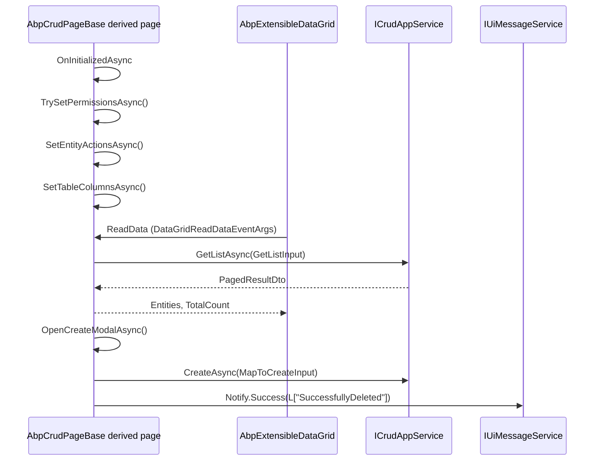

`Volo.Abp.BlazoriseUI` is the default UI toolkit ABP ships for its Blazor
stack. It depends on Blazorise + Blazorise.DataGrid + Blazorise.Snackbar and
provides three things: concrete implementations of the
`IUiMessageService` / `IUiNotificationService` / `IUiPageProgressService` /
`IAlertManager` contracts that are wired through `[Dependency(ReplaceServices = true)]`,
a comprehensive `AbpCrudPageBase<…>` family that turns an
`ICrudAppService<…>` into a fully-functional CRUD screen, and a set of
reusable Razor components — modal helpers, extensible data grid, page header,
submit button — that the LeptonX and Basic themes consume. This page enumerates
the module's surface against the source.

## Project + package

```xml title="framework/src/Volo.Abp.BlazoriseUI/Volo.Abp.BlazoriseUI.csproj"
<Project Sdk="Microsoft.NET.Sdk.Razor">
  <ItemGroup>
    <ProjectReference Include="..\Volo.Abp.AspNetCore.Components.Web\..." />
    <ProjectReference Include="..\Volo.Abp.Authorization\..." />
    <ProjectReference Include="..\Volo.Abp.Ddd.Application.Contracts\..." />
  </ItemGroup>
  <ItemGroup>
    <PackageReference Include="Blazorise" />
    <PackageReference Include="Blazorise.DataGrid" />
    <PackageReference Include="Blazorise.Snackbar" />
    <PackageReference Include="Blazorise.Components" />
  </ItemGroup>
</Project>
```

```razor title="framework/src/Volo.Abp.BlazoriseUI/_Imports.razor"
@using Microsoft.AspNetCore.Components.Web
@using Blazorise
@using Blazorise.Snackbar
```

## Module

```csharp title="framework/src/Volo.Abp.BlazoriseUI/AbpBlazoriseUIModule.cs"
[DependsOn(
    typeof(AbpAspNetCoreComponentsWebModule),
    typeof(AbpDddApplicationContractsModule),
    typeof(AbpAuthorizationModule)
)]
public class AbpBlazoriseUIModule : AbpModule
{
    public override void ConfigureServices(ServiceConfigurationContext context)
    {
        ConfigureBlazorise(context);
    }

    private void ConfigureBlazorise(ServiceConfigurationContext context)
    {
        context.Services.AddBlazorise(options =>
        {
            options.Debounce = true;
            options.DebounceInterval = 800;
        });

        context.Services.Replace(ServiceDescriptor.Scoped<IComponentActivator, ComponentActivator>());
        context.Services.AddSingleton(typeof(AbpBlazorMessageLocalizerHelper<>));
    }
}
```

| Step                                                          | Effect                                                                                                  |
| ------------------------------------------------------------- | ------------------------------------------------------------------------------------------------------- |
| `AddBlazorise(options => { Debounce = true; DebounceInterval = 800; })` | Wires Blazorise + sets the default text-input debounce so keystrokes settle before search calls.|
| `Replace(IComponentActivator, ComponentActivator)`            | Blazorise's *own* activator wins over the ABP one — Blazorise needs to intercept component creation for its theming hooks. The Web module's `ServiceProviderComponentActivator` had already been set; this replaces it. |
| `AddSingleton(typeof(AbpBlazorMessageLocalizerHelper<>))`     | Registers the open generic so screens can ask for `AbpBlazorMessageLocalizerHelper<TResource>`.        |

<Info>
This module declares `[DependsOn(AbpDddApplicationContractsModule, AbpAuthorizationModule)]`
because the CRUD page base talks to `ICrudAppService<…>` and runs permission
checks against `IAuthorizationService`. That is also why Blazorise UI cannot
be used without the DDD application contracts package.
</Info>

## UI service implementations

All three implementations are scoped and registered with `[Dependency(ReplaceServices = true)]`
so they take over from the no-op defaults shipped by the core Components
package.

### `BlazoriseUiMessageService`

```csharp title="framework/src/Volo.Abp.BlazoriseUI/BlazoriseUiMessageService.cs"
[Dependency(ReplaceServices = true)]
public class BlazoriseUiMessageService : IUiMessageService, IScopedDependency
{
    public event EventHandler<UiMessageEventArgs>? MessageReceived;

    public Task Info(string message, string? title = null, Action<UiMessageOptions>? options = null) { /* raises event */ }
    public Task Success(string message, string? title = null, Action<UiMessageOptions>? options = null) { /* raises event */ }
    public Task Warn(string message, string? title = null, Action<UiMessageOptions>? options = null) { /* raises event */ }
    public Task Error(string message, string? title = null, Action<UiMessageOptions>? options = null) { /* raises event */ }
    public Task<bool> Confirm(string message, string? title = null, Action<UiMessageOptions>? options = null)
    {
        var uiMessageOptions = CreateDefaultOptions();
        options?.Invoke(uiMessageOptions);

        var callback = new TaskCompletionSource<bool>();

        MessageReceived?.Invoke(this, new UiMessageEventArgs(
            UiMessageType.Confirmation, message, title, uiMessageOptions, callback));

        return callback.Task;
    }

    protected virtual UiMessageOptions CreateDefaultOptions()
    {
        return new UiMessageOptions
        {
            CenterMessage = true,
            ShowMessageIcon = true,
            OkButtonText = localizer["Ok"],
            CancelButtonText = localizer["Cancel"],
            ConfirmButtonText = localizer["Yes"],
        };
    }
}
```

The service is a pure event publisher — the actual UI is the `UiMessageAlert`
Razor component that the layout instantiates once:

```csharp title="framework/src/Volo.Abp.BlazoriseUI/Components/UiMessageAlert.razor.cs"
public partial class UiMessageAlert : ComponentBase, IDisposable
{
    [Inject] protected BlazoriseUiMessageService? UiMessageService { get; set; }

    protected override void OnInitialized()
    {
        if (UiMessageService != null)
        {
            UiMessageService.MessageReceived += OnMessageReceived;
        }
    }

    private async void OnMessageReceived(object? sender, UiMessageEventArgs e)
    {
        MessageType = e.MessageType;
        Message = e.Message;
        Title = e.Title;
        Options = e.Options;
        Callback = e.Callback;
        await ShowMessageAlert();
    }
}
```

The Confirmation path completes the `TaskCompletionSource` from the service
when the user clicks Confirm or Cancel — that is how `await Message.Confirm(...)`
becomes `bool`.

### `BlazoriseUiNotificationService`

```csharp title="framework/src/Volo.Abp.BlazoriseUI/BlazoriseUiNotificationService.cs"
[Dependency(ReplaceServices = true)]
public class BlazoriseUiNotificationService : IUiNotificationService, IScopedDependency
{
    public event EventHandler<UiNotificationEventArgs>? NotificationReceived;

    public Task Info(string message, string? title = null, Action<UiNotificationOptions>? options = null)
    {
        NotificationReceived?.Invoke(this,
            new UiNotificationEventArgs(UiNotificationType.Info, message, title, ...));
        return Task.CompletedTask;
    }
    // Success / Warn / Error are symmetric
}
```

Listened to by `UiNotificationAlert.razor` which renders a Blazorise.Snackbar
stack.

### `BlazoriseUiPageProgressService`

```csharp title="framework/src/Volo.Abp.BlazoriseUI/BlazoriseUiPageProgressService.cs"
[Dependency(ReplaceServices = true)]
public class BlazoriseUiPageProgressService : IUiPageProgressService, IScopedDependency
{
    public event EventHandler<UiPageProgressEventArgs>? ProgressChanged;

    public Task Go(int? percentage, Action<UiPageProgressOptions>? options = null)
    {
        var uiPageProgressOptions = CreateDefaultOptions();
        options?.Invoke(uiPageProgressOptions);
        ProgressChanged?.Invoke(this, new UiPageProgressEventArgs(percentage, uiPageProgressOptions));
        return Task.CompletedTask;
    }
}
```

`UiPageProgress.razor` subscribes and animates a top-of-page progress bar.
`AbpBlazorClientHttpMessageHandler` calls `Go(null)` at the start of every
request and `Go(-1)` in `finally`, which is what drives the progress bar
automatically.

### `PageAlert.razor`

`AbpComponentBase.AlertManager` exposes the same `AlertList` instance
`PageAlert` subscribes to. It clears alerts on every navigation so they don't
leak across routes:

```csharp title="framework/src/Volo.Abp.BlazoriseUI/Components/PageAlert.razor.cs"
//Since Blazor WASM doesn't support scoped dependency, we need to clear alerts on each location changed event.
private void NavigationManager_LocationChanged(object? sender, LocationChangedEventArgs e)
{
    AlertManager.Alerts.Clear();
    Alerts.Clear();
}
```

## Component inventory

`framework/src/Volo.Abp.BlazoriseUI/Components/` ships these reusable building
blocks.

| Component                               | Files                                                       | Role                                                                        |
| --------------------------------------- | ----------------------------------------------------------- | --------------------------------------------------------------------------- |
| `AbpExtensibleDataGrid<TItem>`          | `AbpExtensibleDataGrid.razor[.cs]`                          | DataGrid that renders both fixed and extension-property columns.            |
| `DataGridEntityActionsColumn<TItem>`    | `DataGridEntityActionsColumn.razor[.cs]`                    | The "..." dropdown column for entity actions.                                |
| `EntityAction` / `EntityActions`        | `EntityAction.razor[.cs]`, `EntityActions.razor[.cs]`       | Renders a single / multiple entity actions with permission checks.           |
| `PageAlert`                             | `PageAlert.razor[.cs]`                                      | Alert area driven by `IAlertManager`.                                       |
| `UiMessageAlert`                        | `UiMessageAlert.razor[.cs]`                                 | Modal for info/success/warn/error/confirm dialogs.                           |
| `UiNotificationAlert`                   | `UiNotificationAlert.razor[.cs]`                            | Toasts from `IUiNotificationService`.                                       |
| `UiPageProgress`                        | `UiPageProgress.razor[.cs]`                                 | Top-of-page progress bar.                                                   |
| `SubmitButton`                          | `SubmitButton.razor[.cs]`                                   | Save button that disables itself while a submit is in flight.               |
| `ToolbarButton`                         | `ToolbarButton.razor[.cs]`                                  | Toolbar action button (used by the page header).                            |
| `RadarSpinner`                          | `RadarSpinner.razor`                                        | Lightweight loading indicator.                                              |
| `AlertWrapper`                          | `AlertWrapper.cs`                                           | View-model wrapper that adds `IsVisible` to an `AlertMessage`.              |
| `ActionType`                            | `ActionType.cs`                                             | Enum used by `EntityAction`.                                                |
| `ObjectExtending/*`                     | `CheckExtensionProperty.razor` …                            | Inputs for extension properties: bool, datetime, time, lookup, select, text.|

### `AbpExtensibleDataGrid<TItem>`

```csharp title="framework/src/Volo.Abp.BlazoriseUI/Components/AbpExtensibleDataGrid.razor.cs"
public partial class AbpExtensibleDataGrid<TItem> : ComponentBase
{
    protected const string DataFieldAttributeName = "Data";

    protected Dictionary<string, DataGridEntityActionsColumn<TItem>> ActionColumns = new();
    protected Regex ExtensionPropertiesRegex = new Regex(@"ExtraProperties\[(.*?)\]");

    [Parameter] public IEnumerable<TItem> Data { get; set; } = default!;
    [Parameter] public EventCallback<DataGridReadDataEventArgs<TItem>> ReadData { get; set; }
    [Parameter] public int? TotalItems { get; set; }
    [Parameter] public bool ShowPager { get; set; }
    [Parameter] public int PageSize { get; set; }
    [Parameter] public IEnumerable<TableColumn> Columns { get; set; } = default!;
    [Parameter] public int CurrentPage { get; set; } = 1;
    [Parameter] public string? Class { get; set; }
    [Parameter] public bool Responsive { get; set; }

    [Inject] public IStringLocalizerFactory StringLocalizerFactory { get; set; } = default!;
}
```

It reads `TableColumn` instances from the `.Web` extensibility package and
binds `ExtraProperties[Name]` keys against the entity DTO's
`ExtensibleObject`. That is how extension properties added by a module appear
on the grid without changing the DTO.

## `AbpCrudPageBase<…>` — the CRUD page family

This is the most prominent class in the package. It is a chain of progressively
more specific base classes that all funnel into a single fully-typed implementation.
The chain accommodates every overload of `ICrudAppService<…>`:

| Variant                                                                                       | When to use                                                                |
| --------------------------------------------------------------------------------------------- | -------------------------------------------------------------------------- |
| `AbpCrudPageBase<TAppService, TEntityDto, TKey>`                                              | App service exposes only `GetAsync` + `GetListAsync(PagedAndSortedResultRequestDto)`. |
| `…, TGetListInput`                                                                            | Custom filter DTO.                                                         |
| `…, TGetListInput, TCreateInput`                                                              | Create input differs from entity DTO.                                      |
| `…, TGetListInput, TCreateInput, TUpdateInput`                                                | Create + update inputs differ.                                             |
| `…, TGetOutputDto, TGetListOutputDto, TKey, TGetListInput, TCreateInput, TUpdateInput`        | Different DTOs for `Get` vs `GetList`.                                     |
| `…, TGetOutputDto, TGetListOutputDto, TKey, TGetListInput, TCreateInput, TUpdateInput, TListViewModel, TCreateViewModel, TUpdateViewModel` | All ten generic parameters. This is the implementation; the others all forward to it. |

### Members exposed by the implementation

```csharp title="framework/src/Volo.Abp.BlazoriseUI/AbpCrudPageBase.cs"
[Inject] protected TAppService AppService { get; set; } = default!;
[Inject] protected IStringLocalizer<AbpUiResource> UiLocalizer { get; set; } = default!;
[Inject] public IAbpEnumLocalizer AbpEnumLocalizer { get; set; } = default!;

protected virtual int PageSize { get; } = LimitedResultRequestDto.DefaultMaxResultCount;

protected int CurrentPage = 1;
protected string CurrentSorting = default!;
protected int? TotalCount;
protected TGetListInput GetListInput = new TGetListInput();
protected IReadOnlyList<TListViewModel> Entities = Array.Empty<TListViewModel>();
protected TCreateViewModel NewEntity;
protected TKey EditingEntityId = default!;
protected TUpdateViewModel EditingEntity;
protected Modal? CreateModal;
protected Modal? EditModal;
protected Validations? CreateValidationsRef;
protected Validations? EditValidationsRef;
protected List<BreadcrumbItem> BreadcrumbItems = new(2);
protected DataGridEntityActionsColumn<TListViewModel> EntityActionsColumn = default!;
protected EntityActionDictionary EntityActions { get; set; }
protected TableColumnDictionary TableColumns { get; set; }

protected string? CreatePolicyName { get; set; }
protected string? UpdatePolicyName { get; set; }
protected string? DeletePolicyName { get; set; }

public bool HasCreatePermission { get; set; }
public bool HasUpdatePermission { get; set; }
public bool HasDeletePermission { get; set; }
```

### Permission checks

```csharp
protected virtual async Task SetPermissionsAsync()
{
    if (CreatePolicyName != null)
        HasCreatePermission = await AuthorizationService.IsGrantedAsync(CreatePolicyName);
    if (UpdatePolicyName != null)
        HasUpdatePermission = await AuthorizationService.IsGrantedAsync(UpdatePolicyName);
    if (DeletePolicyName != null)
        HasDeletePermission = await AuthorizationService.IsGrantedAsync(DeletePolicyName);
}
```

You set `CreatePolicyName`, `UpdatePolicyName`, `DeletePolicyName` in your
page's constructor; the base class will set `HasXxxPermission` for use in
your `.razor` markup.

### Pagination + sorting

```csharp
protected virtual Task UpdateGetListInputAsync()
{
    if (GetListInput is ISortedResultRequest sortedResultRequestInput)
        sortedResultRequestInput.Sorting = CurrentSorting;
    if (GetListInput is IPagedResultRequest pagedResultRequestInput)
        pagedResultRequestInput.SkipCount = (CurrentPage - 1) * PageSize;
    if (GetListInput is ILimitedResultRequest limitedResultRequestInput)
        limitedResultRequestInput.MaxResultCount = PageSize;
    return Task.CompletedTask;
}

protected virtual async Task OnDataGridReadAsync(DataGridReadDataEventArgs<TListViewModel> e)
{
    CurrentSorting = e.Columns
        .Where(c => c.SortDirection != SortDirection.Default)
        .Select(c => c.SortField + (c.SortDirection == SortDirection.Descending ? " DESC" : ""))
        .JoinAsString(",");
    CurrentPage = e.Page;

    await GetEntitiesAsync();
    await InvokeAsync(StateHasChanged);
}
```

Wire `OnDataGridReadAsync` to `<AbpExtensibleDataGrid ReadData="…">` and you
get keyset sorting + paging for free.

### Create / Update / Delete pipeline

The base class exposes virtual `OnCreatingEntityAsync` / `OnCreatedEntityAsync`
(and the symmetric Update/Delete pairs) so derived pages can hook either side
of the persistence call. The framework already:

1. Validates the modal's `Validations` ref.
2. Calls `CheckCreatePolicyAsync()` (which throws `AbpAuthorizationException`
   if denied).
3. Maps the view model to the input DTO via `IObjectMapper` (defaulting to
   identity if the types match).
4. Calls `AppService.CreateAsync/UpdateAsync/DeleteAsync`.
5. Refreshes the list and closes the modal.

### Modal helpers

The dedicated extension keeps modals from closing when users click outside the
modal box:

```csharp title="framework/src/Volo.Abp.BlazoriseUI/AbpBlazoriseUiModalExtensions.cs"
public static Task CancelClosingModalWhenFocusLost(this Modal modal, ModalClosingEventArgs eventArgs)
{
    eventArgs.Cancel = eventArgs.CloseReason == CloseReason.FocusLostClosing;
    return Task.CompletedTask;
}
```

### Extension table columns

The base class understands ABP's object-extension system. For each
`ModuleExtensionConfigurationHelper.GetPropertyConfigurations(...)` entry that
is visible on the table, it produces a `TableColumn`:

```csharp
protected virtual IEnumerable<TableColumn> GetExtensionTableColumns(string moduleName, string entityType)
{
    var properties = ModuleExtensionConfigurationHelper
        .GetPropertyConfigurations(moduleName, entityType);
    foreach (var propertyInfo in properties)
    {
        if (propertyInfo.IsAvailableToClients && propertyInfo.UI.OnTable.IsVisible)
        {
            if (propertyInfo.Name.EndsWith("_Text"))
            {
                var lookupPropertyName = propertyInfo.Name.RemovePostFix("_Text");
                var lookupPropertyDefinition = properties.Single(t => t.Name == lookupPropertyName);
                yield return new TableColumn
                {
                    Title = lookupPropertyDefinition.GetLocalizedDisplayName(StringLocalizerFactory),
                    Data = $"ExtraProperties[{propertyInfo.Name}]",
                    PropertyName = propertyInfo.Name
                };
            }
            else
            {
                var column = new TableColumn
                {
                    Title = propertyInfo.GetLocalizedDisplayName(StringLocalizerFactory),
                    Data = $"ExtraProperties[{propertyInfo.Name}]",
                    PropertyName = propertyInfo.Name
                };

                if (propertyInfo.IsDate() || propertyInfo.IsDateTime())
                    column.DisplayFormat = propertyInfo.GetDateEditInputFormatOrNull();

                if (propertyInfo.Type.IsEnum)
                {
                    column.ValueConverter = (val) =>
                        AbpEnumLocalizer.GetString(propertyInfo.Type,
                            val.As<ExtensibleObject>().ExtraProperties[propertyInfo.Name]!,
                            new IStringLocalizer?[] { StringLocalizerFactory.CreateDefaultOrNull() });
                }

                yield return column;
            }
        }
    }
}
```

This pairs with `Components/ObjectExtending/*` to render *editors* for the
same extension properties inside the create/edit modals.

### `BreadcrumbItem`

```csharp title="framework/src/Volo.Abp.BlazoriseUI/BreadcrumbItem.cs"
public class BreadcrumbItem
{
    public string Text { get; set; }
    public object? Icon { get; set; }
    public string? Url { get; set; }

    public BreadcrumbItem(string text, string? url = null, object? icon = null)
    {
        Text = text;
        Url = url;
        Icon = icon;
    }
}
```

You populate `BreadcrumbItems` inside `SetBreadcrumbItemsAsync` and the
template renders them.

## CRUD page lifecycle



## Theming integration

`AbpAspNetCoreComponentsWebThemingModule` declares
`[DependsOn(typeof(AbpBlazoriseUIModule), typeof(AbpUiNavigationModule))]` so
the Blazorise UI module is part of every theming chain — Blazor Server, WASM,
and MAUI. The Server theming module additionally adds Blazorise CSS to the
global style bundle:

```csharp title="framework/src/Volo.Abp.AspNetCore.Components.Server.Theming/Bundling/BlazorGlobalStyleContributor.cs"
public override void ConfigureBundle(BundleConfigurationContext context)
{
    context.Files.AddIfNotContains("/_content/Blazorise/blazorise.css");
    context.Files.AddIfNotContains("/_content/Blazorise.Bootstrap5/blazorise.bootstrap5.css");
    context.Files.AddIfNotContains("/_content/Blazorise.Snackbar/blazorise.snackbar.css");
    context.Files.AddIfNotContains("/_content/Volo.Abp.BlazoriseUI/volo.abp.blazoriseui.css");
}
```

See [theming pipeline](/blazor/theming-pipeline) for the full bundle story.

## Cross-references

- [Components core](/blazor/components-web) — the contracts Blazorise UI
  implements.
- [Theming pipeline](/blazor/theming-pipeline) — Blazorise CSS bundle wiring.
- [UI MVC overview](/ui-mvc/overview) — the MVC equivalent (Razor Pages) of
  the CRUD page family.
- [HTTP integration](/http/overview) — the HTTP proxies the CRUD page calls
  through `TAppService`.
- [Authorization](/authz/overview) — the policy checks
  `CheckCreate/Update/DeletePolicyAsync` defer to.
