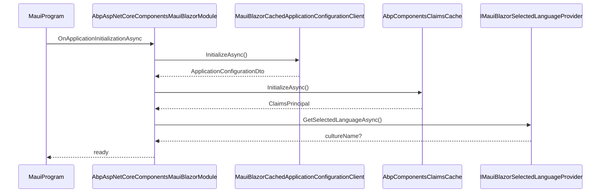

`Volo.Abp.AspNetCore.Components.MauiBlazor` is the host-specific package for
.NET MAUI Blazor Hybrid applications. The module mirrors the WebAssembly
module — it registers an ABP HTTP message handler, loads the application
configuration, and bootstraps the claims cache during initialization — but
swaps the browser-specific bits for MAUI equivalents: persistent storage for
the selected language, a `DistributedCache`-backed remote tenant store, and
an HTTP handler that skips the cookie-based XSRF round-trip because hybrid
apps don't share cookies with a browser session. This page enumerates every
type in the package against the source.

## Project layout

```
framework/src/Volo.Abp.AspNetCore.Components.MauiBlazor/
├── Volo/Abp/AspNetCore/Components/MauiBlazor/
│   ├── AbpAspNetCoreComponentsMauiBlazorModule.cs
│   ├── AbpMauiBlazorClientHttpMessageHandler.cs
│   ├── ApplicationConfigurationCache.cs
│   ├── IMauiBlazorSelectedLanguageProvider.cs
│   ├── MauiBlazorCachedApplicationConfigurationClient.cs
│   ├── MauiBlazorCurrentPrincipalAccessor.cs
│   ├── MauiBlazorCurrentTenantAccessor.cs
│   ├── MauiBlazorRemoteTenantStore.cs
│   ├── MauiBlazorServerUrlProvider.cs
│   └── NullMauiBlazorSelectedLanguageProvider.cs
└── Volo.Abp.AspNetCore.Components.MauiBlazor.csproj
```

```xml title="framework/src/Volo.Abp.AspNetCore.Components.MauiBlazor/Volo.Abp.AspNetCore.Components.MauiBlazor.csproj"
<Project Sdk="Microsoft.NET.Sdk.Razor">
    <ItemGroup>
        <ProjectReference Include="..\Volo.Abp.AspNetCore.Components.Web\..." />
        <ProjectReference Include="..\Volo.Abp.AspNetCore.Mvc.Client.Common\..." />
        <ProjectReference Include="..\Volo.Abp.UI\..." />
    </ItemGroup>
</Project>
```

Notice that this package does **not** reference the MAUI workload. It ships as
a plain Razor library so it can be consumed from any MAUI host project the
solution author wires up. The MAUI host itself remains under the application
solution — see [MAUI client overview](/clients/maui) for the host
scaffolding.

## The module class

```csharp title="framework/src/Volo.Abp.AspNetCore.Components.MauiBlazor/Volo/Abp/AspNetCore/Components/MauiBlazor/AbpAspNetCoreComponentsMauiBlazorModule.cs"
[DependsOn(
    typeof(AbpAspNetCoreMvcClientCommonModule),
    typeof(AbpUiModule),
    typeof(AbpAspNetCoreComponentsWebModule)
)]
public class AbpAspNetCoreComponentsMauiBlazorModule : AbpModule
{
    public override void PreConfigureServices(ServiceConfigurationContext context)
    {
        PreConfigure<AbpHttpClientBuilderOptions>(options =>
        {
            options.ProxyClientBuildActions.Add((_, builder) =>
            {
                builder.AddHttpMessageHandler<AbpMauiBlazorClientHttpMessageHandler>();
            });
        });
    }

    public override void OnApplicationInitialization(ApplicationInitializationContext context)
    {
        AsyncHelper.RunSync(() => OnApplicationInitializationAsync(context));
    }

    public async override Task OnApplicationInitializationAsync(ApplicationInitializationContext context)
    {
        await context.ServiceProvider.GetRequiredService<IClientScopeServiceProviderAccessor>()
            .ServiceProvider.GetRequiredService<MauiBlazorCachedApplicationConfigurationClient>()
            .InitializeAsync();
        await context.ServiceProvider.GetRequiredService<IClientScopeServiceProviderAccessor>()
            .ServiceProvider.GetRequiredService<AbpComponentsClaimsCache>()
            .InitializeAsync();
        await SetCurrentLanguageAsync(context.ServiceProvider);
    }

    private async static Task SetCurrentLanguageAsync(IServiceProvider serviceProvider)
    {
        var configurationClient = serviceProvider.GetRequiredService<ICachedApplicationConfigurationClient>();
        var utilsService = serviceProvider.GetRequiredService<IAbpUtilsService>();
        var configuration = await configurationClient.GetAsync();
        var cultureName = configuration.Localization?.CurrentCulture?.CultureName;
        if (!cultureName.IsNullOrEmpty())
        {
            var culture = new CultureInfo(cultureName!);
            CultureInfo.DefaultThreadCurrentCulture = culture;
            CultureInfo.DefaultThreadCurrentUICulture = culture;
        }
        if (CultureInfo.CurrentUICulture.TextInfo.IsRightToLeft)
        {
            await utilsService.AddClassToTagAsync("body", "rtl");
        }
    }
}
```

The shape is intentionally the same as the WebAssembly module — same
`[DependsOn]`, same initialization phases, same culture/RTL setup — so a Razor
component that works in WASM ports to MAUI without surface changes. The two
differences are in which HTTP handler is registered and which cached client is
used.

### What the module does

| Phase                       | Action                                                                                     |
| --------------------------- | ------------------------------------------------------------------------------------------ |
| `PreConfigureServices`      | Adds `AbpMauiBlazorClientHttpMessageHandler` to every typed proxy client.                  |
| `OnApplicationInitializationAsync` | Calls `MauiBlazorCachedApplicationConfigurationClient.InitializeAsync()`            |
|                             | Calls `AbpComponentsClaimsCache.InitializeAsync()`                                          |
|                             | Sets thread culture / RTL based on the loaded configuration.                                |

## `AbpMauiBlazorClientHttpMessageHandler`

The MAUI HTTP handler trims the WASM handler down to two responsibilities:
language header and page progress.

```csharp title="framework/src/Volo.Abp.AspNetCore.Components.MauiBlazor/Volo/Abp/AspNetCore/Components/MauiBlazor/AbpMauiBlazorClientHttpMessageHandler.cs"
public class AbpMauiBlazorClientHttpMessageHandler : DelegatingHandler, ITransientDependency
{
    private readonly IUiPageProgressService _uiPageProgressService;
    private readonly IMauiBlazorSelectedLanguageProvider _mauiBlazorSelectedLanguageProvider;

    public AbpMauiBlazorClientHttpMessageHandler(
        IClientScopeServiceProviderAccessor clientScopeServiceProviderAccessor,
        IMauiBlazorSelectedLanguageProvider mauiBlazorSelectedLanguageProvider)
    {
        _mauiBlazorSelectedLanguageProvider = mauiBlazorSelectedLanguageProvider;
        _uiPageProgressService = clientScopeServiceProviderAccessor.ServiceProvider
            .GetRequiredService<IUiPageProgressService>();
    }

    protected async override Task<HttpResponseMessage> SendAsync(
        HttpRequestMessage request, CancellationToken cancellationToken)
    {
        try
        {
            await _uiPageProgressService.Go(null, options =>
            {
                options.Type = UiPageProgressType.Info;
            });

            await SetLanguageAsync(request);

            return await base.SendAsync(request, cancellationToken);
        }
        finally
        {
            await _uiPageProgressService.Go(-1);
        }
    }

    private async Task SetLanguageAsync(HttpRequestMessage request)
    {
        var selectedLanguage = await _mauiBlazorSelectedLanguageProvider.GetSelectedLanguageAsync();
        if (!selectedLanguage.IsNullOrWhiteSpace())
        {
            request.Headers.AcceptLanguage.Clear();
            request.Headers.AcceptLanguage.Add(
                new StringWithQualityHeaderValue(selectedLanguage!));
        }
    }
}
```

### Why no XSRF?

The WASM handler reads `XSRF-TOKEN` from `document.cookie` because a SPA loaded
inside a browser shares cookies with the API host. A MAUI Blazor Hybrid app is
a native shell; it talks to its API over `HttpClient` with its own credential
store. The anti-forgery token concept does not apply — APIs that need CSRF
protection in MAUI use bearer tokens instead.

## `IMauiBlazorSelectedLanguageProvider`

The provider abstracts MAUI's persistent storage (`Preferences`,
`SecureStorage`, etc.) so the framework can read the selected UI language
without taking a hard dependency on the MAUI workload.

```csharp title="framework/src/Volo.Abp.AspNetCore.Components.MauiBlazor/Volo/Abp/AspNetCore/Components/MauiBlazor/IMauiBlazorSelectedLanguageProvider.cs"
public interface IMauiBlazorSelectedLanguageProvider
{
    Task<string?> GetSelectedLanguageAsync();
}
```

`NullMauiBlazorSelectedLanguageProvider` is the default — it returns `null`,
which causes the handler to skip setting `Accept-Language`. Application
authors register a MAUI-specific implementation in their host module:

```csharp
public class MauiSelectedLanguageProvider : IMauiBlazorSelectedLanguageProvider, ITransientDependency
{
    public Task<string?> GetSelectedLanguageAsync()
        => Task.FromResult(Microsoft.Maui.Storage.Preferences.Get("SelectedLanguage", default(string?)));
}
```

## `MauiBlazorRemoteTenantStore`

MAUI hosts cannot resolve tenants from request hostnames — there is no
incoming HTTP request. Instead the package replaces `ITenantStore` with one
that calls the backend `AbpTenantClientProxy` and caches the result in
`IDistributedCache<TenantConfiguration>`.

```csharp title="framework/src/Volo.Abp.AspNetCore.Components.MauiBlazor/Volo/Abp/AspNetCore/Components/MauiBlazor/MauiBlazorRemoteTenantStore.cs"
[Dependency(ReplaceServices = true)]
public class MauiBlazorRemoteTenantStore : ITenantStore, ITransientDependency
{
    protected AbpTenantClientProxy TenantAppService { get; }
    protected IDistributedCache<TenantConfiguration> Cache { get; }

    public async Task<TenantConfiguration?> FindAsync(string name)
    {
        var cacheKey = CreateCacheKey(name);
        var tenantConfiguration = await Cache.GetOrAddAsync(
            cacheKey,
            async () => CreateTenantConfiguration(
                await TenantAppService.FindTenantByNameAsync(name))!,
            () => new DistributedCacheEntryOptions
            {
                AbsoluteExpirationRelativeToNow = TimeSpan.FromMinutes(5)
            });
        return tenantConfiguration;
    }

    public async Task<TenantConfiguration?> FindAsync(Guid id)        { /* same shape, by id */ }
    public TenantConfiguration? Find(string name)                     { /* sync, AsyncHelper.RunSync */ }
    public TenantConfiguration? Find(Guid id)                         { /* sync, AsyncHelper.RunSync */ }

    protected virtual TenantConfiguration? CreateTenantConfiguration(FindTenantResultDto tenantResultDto)
    {
        if (!tenantResultDto.Success || tenantResultDto.TenantId == null)
        {
            return null;
        }
        return new TenantConfiguration(tenantResultDto.TenantId.Value, tenantResultDto.Name!);
    }
}
```

The store hard-codes a 5-minute cache expiration — change it in your own
module if needed by adding a higher-priority `[Dependency(ReplaceServices = true)]`
class.

## `MauiBlazorServerUrlProvider`

```csharp title="framework/src/Volo.Abp.AspNetCore.Components.MauiBlazor/Volo/Abp/AspNetCore/Components/MauiBlazor/MauiBlazorServerUrlProvider.cs"
[Dependency(ReplaceServices = true)]
public class MauiBlazorServerUrlProvider : IServerUrlProvider, ITransientDependency
{
    public async Task<string> GetBaseUrlAsync(string? remoteServiceName = null)
    {
        var remoteServiceConfiguration = await RemoteServiceConfigurationProvider
            .GetConfigurationOrDefaultAsync(
                remoteServiceName ?? RemoteServiceConfigurationDictionary.DefaultName);
        return remoteServiceConfiguration.BaseUrl.EnsureEndsWith('/');
    }
}
```

Same body as the WASM implementation — the URL discovery pattern is identical
because both hosts treat the backend as a remote HTTP service.

## Replaced services summary

| Service                                | MAUI implementation                                         | Notes                                                                       |
| -------------------------------------- | ----------------------------------------------------------- | --------------------------------------------------------------------------- |
| `ITenantStore`                         | `MauiBlazorRemoteTenantStore`                               | 5-minute distributed cache.                                                  |
| `IServerUrlProvider`                   | `MauiBlazorServerUrlProvider`                               | Reads `RemoteServiceConfigurationDictionary`.                                |
| `ICurrentTenantAccessor`               | `MauiBlazorCurrentTenantAccessor` (singleton)               | Set after configuration load.                                                |
| `ICurrentPrincipalAccessor`            | `MauiBlazorCurrentPrincipalAccessor`                        | Reads `AbpComponentsClaimsCache`.                                            |
| `ICachedApplicationConfigurationClient`| `MauiBlazorCachedApplicationConfigurationClient`            | Bootstraps current tenant, localization resources.                           |
| `IMauiBlazorSelectedLanguageProvider`  | `NullMauiBlazorSelectedLanguageProvider` (default)          | Application supplies a MAUI-aware implementation.                            |
| HTTP handler                            | `AbpMauiBlazorClientHttpMessageHandler`                      | Language + page progress only (no XSRF).                                     |

## Initialization sequence



## MAUI host wiring (application code)

Application authors typically have a `MauiProgram.cs` plus a Blazor
WebView/`Components` registration. The ABP host module is added next to the
domain/application modules, and `InitializeApplicationAsync` is called once
the MAUI service provider is built. The full project structure is documented
on the [MAUI client page](/clients/maui).

```csharp title="src/MyApp.MauiBlazor/MauiProgram.cs (sketch)"
public static MauiApp CreateMauiApp()
{
    var builder = MauiApp.CreateBuilder();
    builder.UseMauiApp<App>().Services.AddMauiBlazorWebView();

    var application = builder.Services.AddApplication<MyAppMauiBlazorModule>(options =>
    {
        // domain / application module composition
    });

    var mauiApp = builder.Build();
    AsyncHelper.RunSync(() => application.InitializeApplicationAsync(mauiApp.Services));
    return mauiApp;
}
```

The `MyAppMauiBlazorModule` declares
`[DependsOn(typeof(AbpAspNetCoreComponentsMauiBlazorThemingModule), …)]` so
the theming pipeline (which transitively brings this module) is in scope.

## Cross-references

- [Components core](/blazor/components-web) — shared component base,
  `IClientScopeServiceProviderAccessor`, message/notification contracts.
- [Components.WebAssembly](/blazor/components-webassembly) — sister module
  with the same initialization shape.
- [Theming pipeline](/blazor/theming-pipeline) — MAUI theming module +
  bundle contributor.
- [MAUI client overview](/clients/maui) — the wider MAUI client story and
  how the Blazor hybrid host fits in.
- [HTTP integration](/http/overview) — proxy clients,
  `AbpHttpClientBuilderOptions`, distributed cache for tenants.
- [Multi-tenancy overview](/multitenancy/overview) — for
  `ITenantStore`, `ICurrentTenantAccessor`, and the tenant resolution flow.
