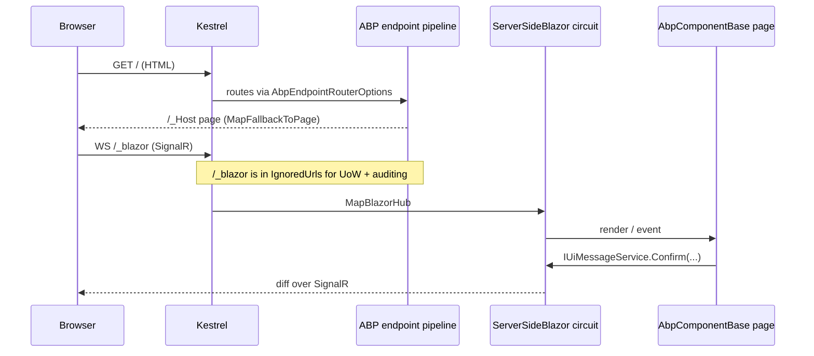

`Volo.Abp.AspNetCore.Components.Server` is the host-specific package for Blazor
Server. It depends on `Volo.Abp.AspNetCore.Components.Web` for the shared
component activator and HTTP message handler, then layers on the server-only
plumbing: `AddServerSideBlazor`, `MapBlazorHub`, a `/_Host` fallback page,
static-web-asset loading, and special-cased URL ignores for the `_blazor`
SignalR endpoint inside auditing and unit-of-work middleware. This page walks
the module class line-by-line and lists every type the package ships.

## Project layout

```
framework/src/Volo.Abp.AspNetCore.Components.Server/
├── Microsoft/AspNetCore/Authentication/Cookies/
│   └── CookieAuthenticationOptionsExtensions.cs   (IntrospectAccessToken)
├── Volo/Abp/AspNetCore/Components/Server/
│   ├── AbpAspNetCoreComponentsServerModule.cs
│   ├── Configuration/
│   │   └── BlazorServerCurrentApplicationConfigurationCacheResetService.cs
│   └── Extensibility/
│       └── BlazorServerLookupApiRequestService.cs
└── Volo.Abp.AspNetCore.Components.Server.csproj
```

The csproj uses `Microsoft.NET.Sdk.Web` (rather than `Razor`) because the
package owns endpoint mapping:

```xml title="framework/src/Volo.Abp.AspNetCore.Components.Server/Volo.Abp.AspNetCore.Components.Server.csproj"
<Project Sdk="Microsoft.NET.Sdk.Web">
    <PropertyGroup>
        <TargetFramework>net8.0</TargetFramework>
        <Nullable>enable</Nullable>
        <WarningsAsErrors>Nullable</WarningsAsErrors>
        <IsPackable>true</IsPackable>
        <OutputType>Library</OutputType>
        <NoDefaultLaunchSettingsFile>true</NoDefaultLaunchSettingsFile>
    </PropertyGroup>
    <ItemGroup>
        <ProjectReference Include="..\Volo.Abp.AspNetCore.Components.Web\..." />
        <ProjectReference Include="..\Volo.Abp.AspNetCore.Mvc.Contracts\..." />
        <ProjectReference Include="..\Volo.Abp.EventBus\..." />
        <ProjectReference Include="..\Volo.Abp.Http.Client\..." />
        <ProjectReference Include="..\Volo.Abp.AspNetCore.SignalR\..." />
        <PackageReference Include="Microsoft.AspNetCore.Authentication.OpenIdConnect" />
        <PackageReference Include="IdentityModel" />
    </ItemGroup>
</Project>
```

The `IdentityModel` and `OpenIdConnect` references exist for the cookie
introspection helper; everything else is plain ABP/SignalR/HTTP plumbing.

## `AbpAspNetCoreComponentsServerModule`

The full module class:

```csharp title="framework/src/Volo.Abp.AspNetCore.Components.Server/Volo/Abp/AspNetCore/Components/Server/AbpAspNetCoreComponentsServerModule.cs"
[DependsOn(
    typeof(AbpHttpClientModule),
    typeof(AbpAspNetCoreComponentsWebModule),
    typeof(AbpAspNetCoreSignalRModule),
    typeof(AbpEventBusModule),
    typeof(AbpAspNetCoreMvcContractsModule)
    )]
public class AbpAspNetCoreComponentsServerModule : AbpModule
{
    public override void ConfigureServices(ServiceConfigurationContext context)
    {
        StaticWebAssetsLoader.UseStaticWebAssets(
            context.Services.GetHostingEnvironment(),
            context.Services.GetConfiguration());
        context.Services.AddHttpClient();
        var serverSideBlazorBuilder = context.Services.AddServerSideBlazor(options =>
        {
            if (context.Services.GetHostingEnvironment().IsDevelopment())
            {
                options.DetailedErrors = true;
            }
        });
        context.Services.ExecutePreConfiguredActions(serverSideBlazorBuilder);

        Configure<AbpAspNetCoreUnitOfWorkOptions>(options =>
        {
            options.IgnoredUrls.AddIfNotContains("/_blazor");
        });

        Configure<AbpAspNetCoreAuditingOptions>(options =>
        {
            options.IgnoredUrls.AddIfNotContains("/_blazor");
        });

        var preConfigureActions =
            context.Services.GetPreConfigureActions<HttpConnectionDispatcherOptions>();
        Configure<AbpEndpointRouterOptions>(options =>
        {
            options.EndpointConfigureActions.Add(endpointContext =>
            {
                endpointContext.Endpoints.MapBlazorHub(httpConnectionDispatcherOptions =>
                {
                    preConfigureActions.Configure(httpConnectionDispatcherOptions);
                });
                endpointContext.Endpoints.MapFallbackToPage("/_Host");
            });
        });
    }

    public override void OnApplicationInitialization(ApplicationInitializationContext context)
    {
        context.GetEnvironment().WebRootFileProvider =
            new CompositeFileProvider(
                new ManifestEmbeddedFileProvider(typeof(IServerSideBlazorBuilder).Assembly),
                context.GetEnvironment().WebRootFileProvider
            );
    }
}
```

### Dependency chain

| `[DependsOn]` entry                  | Why it's needed                                                                                  |
| ------------------------------------ | ------------------------------------------------------------------------------------------------ |
| `AbpHttpClientModule`                | Lets server-side components call remote services through `IHttpClientFactory` + ABP proxies.     |
| `AbpAspNetCoreComponentsWebModule`   | Brings in the activator, claims cache, message/notification contracts.                           |
| `AbpAspNetCoreSignalRModule`         | Required because `MapBlazorHub` mounts a SignalR endpoint and we want ABP's SignalR conventions. |
| `AbpEventBusModule`                  | The configuration-cache reset service publishes events when the application configuration changes.|
| `AbpAspNetCoreMvcContractsModule`    | The host serves the auto-API proxies declared by other modules.                                  |

### `ConfigureServices` step-by-step

<Steps>
  <Step title="Load static web assets">
    `StaticWebAssetsLoader.UseStaticWebAssets(...)` mirrors what
    `WebApplication.CreateBuilder` does for non-MVC hosts: it makes referenced
    `wwwroot/` content (Blazorise CSS, ABP JS, embedded `_content/...` paths)
    discoverable in `Development`.
  </Step>
  <Step title="Add HTTP client + Blazor Server">
    `AddHttpClient()` registers the default factory; `AddServerSideBlazor` adds
    the circuit handler, the JS interop runtime, the renderer, and the
    component activation pipeline. `DetailedErrors = true` is forced in
    `Development` to surface circuit exceptions.
  </Step>
  <Step title="Run pre-configured actions">
    `ExecutePreConfiguredActions(serverSideBlazorBuilder)` lets other modules
    pre-configure `IServerSideBlazorBuilder` (e.g. add additional auth or root
    components) via the ABP `PreConfigure<...>` mechanism.
  </Step>
  <Step title="Ignore /_blazor in UoW & auditing">
    The SignalR endpoint at `/_blazor` runs on every component message — it
    must not open a unit of work or write audit logs. The module adds it to
    both `AbpAspNetCoreUnitOfWorkOptions.IgnoredUrls` and
    `AbpAspNetCoreAuditingOptions.IgnoredUrls`.
  </Step>
  <Step title="Map endpoints">
    `MapBlazorHub` is wrapped in an `AbpEndpointRouterOptions.EndpointConfigureActions`
    so it participates in ABP's endpoint composition. `MapFallbackToPage("/_Host")`
    points every unmatched route at the project-supplied `_Host.cshtml` Razor
    page (the bootstrap document that loads `blazor.server.js`).
  </Step>
</Steps>

### `OnApplicationInitialization`

```csharp
context.GetEnvironment().WebRootFileProvider =
    new CompositeFileProvider(
        new ManifestEmbeddedFileProvider(typeof(IServerSideBlazorBuilder).Assembly),
        context.GetEnvironment().WebRootFileProvider
    );
```

The composite file provider lets the host serve embedded `_content/...` files
from `Microsoft.AspNetCore.Components.Server` (for example
`/_framework/blazor.server.js`) alongside the application's `wwwroot/`. The
order matters — the embedded provider sits *first* so Blazor's framework
assets always win over accidental name collisions in user assets.

## Configuration cache reset (server variant)

Blazor Server keeps the `ApplicationConfigurationDto` in memory per circuit.
When some module mutates settings, features, permissions, or tenant data, the
circuits need to invalidate that cache. The server module ships a transient
service that publishes a *local* event so every circuit in the same process
hears about it:

```csharp title="framework/src/Volo.Abp.AspNetCore.Components.Server/Volo/Abp/AspNetCore/Components/Server/Configuration/BlazorServerCurrentApplicationConfigurationCacheResetService.cs"
[Dependency(ReplaceServices = true)]
public class BlazorServerCurrentApplicationConfigurationCacheResetService :
    ICurrentApplicationConfigurationCacheResetService,
    ITransientDependency
{
    private readonly ILocalEventBus _localEventBus;

    public BlazorServerCurrentApplicationConfigurationCacheResetService(ILocalEventBus localEventBus)
    {
        _localEventBus = localEventBus;
    }

    public async Task ResetAsync()
    {
        await _localEventBus.PublishAsync(
            new CurrentApplicationConfigurationCacheResetEventData()
        );
    }
}
```

This is the server-side counterpart of the WebAssembly module's reset path,
which simply re-fetches the configuration over HTTP.

## OIDC + cookie introspection helper

Blazor Server apps typically use `cookie + oidc` authentication. ABP ships a
helper extension that wires the cookie middleware to *re-introspect* the OIDC
access token on every `ValidatePrincipal`. That detects revoked tokens between
renewals (otherwise the user stays signed in until the cookie expires).

```csharp title="framework/src/Volo.Abp.AspNetCore.Components.Server/Microsoft/AspNetCore/Authentication/Cookies/CookieAuthenticationOptionsExtensions.cs"
public static CookieAuthenticationOptions IntrospectAccessToken(
    this CookieAuthenticationOptions options,
    string oidcAuthenticationScheme = "oidc")
{
    options.Events.OnValidatePrincipal = async principalContext =>
    {
        if (principalContext.Principal == null ||
            principalContext.Principal.Identity == null ||
            !principalContext.Principal.Identity.IsAuthenticated)
        {
            return;
        }

        var logger = principalContext.HttpContext.RequestServices
            .GetRequiredService<ILogger<CookieAuthenticationOptions>>();

        var accessToken = principalContext.Properties.GetTokenValue("access_token");
        if (!accessToken.IsNullOrWhiteSpace())
        {
            var openIdConnectOptions = await GetOpenIdConnectOptions(principalContext, oidcAuthenticationScheme);
            var response = await openIdConnectOptions.Backchannel
                .IntrospectTokenAsync(new TokenIntrospectionRequest
                {
                    Address = openIdConnectOptions.Configuration?.IntrospectionEndpoint
                              ?? openIdConnectOptions.Authority!.EnsureEndsWith('/') + "connect/introspect",
                    ClientId = openIdConnectOptions.ClientId!,
                    ClientSecret = openIdConnectOptions.ClientSecret,
                    Token = accessToken
                });

            if (response.IsError) { /* SignOutAsync */ return; }
            if (!response.IsActive) { /* SignOutAsync */ return; }
        }
        else
        {
            logger.LogError("The access_token is not found in the cookie properties, " +
                            "Please make sure SaveTokens of OpenIdConnectOptions is set as true.");
            await SignOutAsync(principalContext);
        }
    };
    return options;
}
```

Usage in your `Program.cs`:

```csharp
builder.Services
    .AddAuthentication(options =>
    {
        options.DefaultScheme = CookieAuthenticationDefaults.AuthenticationScheme;
        options.DefaultChallengeScheme = "oidc";
    })
    .AddCookie("Cookies", options =>
    {
        options.ExpireTimeSpan = TimeSpan.FromDays(365);
        options.IntrospectAccessToken();      // <-- ABP helper
    })
    .AddAbpOpenIdConnect("oidc", options =>
    {
        options.SaveTokens = true;            // required by IntrospectAccessToken
        // ...
    });
```

<Warning>
`IntrospectAccessToken` requires `OpenIdConnectOptions.SaveTokens = true` —
the helper deliberately signs the user out (and logs an error) if it can't
find an access token in the cookie properties.
</Warning>

## Extensibility hooks

| File                                              | Type                                | Purpose                                                                                       |
| ------------------------------------------------- | ----------------------------------- | --------------------------------------------------------------------------------------------- |
| `Extensibility/BlazorServerLookupApiRequestService.cs` | `BlazorServerLookupApiRequestService` | Server-side implementation of `ILookupApiRequestService` (used by the data grid lookup cells).|

The lookup service contract is declared in the `.Web` package
(`Extensibility/ILookupApiRequestService.cs`); the server implementation runs
in-process while the WASM and MAUI implementations issue HTTP calls.

## End-to-end request flow



The two `IgnoredUrls.AddIfNotContains("/_blazor")` lines from the module are
what stops every interactive click from spinning up a unit of work or writing
an audit entry.

## Module composition pattern

Server hosts typically depend on the **theming** module (which in turn pulls in
this one):

```csharp
[DependsOn(
    typeof(AbpAspNetCoreComponentsServerThemingModule), // ← brings in the host
    typeof(MyDomainModule),
    typeof(MyApplicationModule))]
public class MyBlazorHostModule : AbpModule
{
}
```

The full theming chain is documented on the
[theming pipeline page](/blazor/theming-pipeline). The server-theming module
adds Blazorise CSS bundles and the `blazor.server.js` script through
`BlazorGlobalStyleContributor` / `BlazorGlobalScriptContributor`.

## See also

- [Components core](/blazor/components-web) — the contracts that this module
  builds on.
- [Components.WebAssembly](/blazor/components-webassembly) — the WASM peer of
  this module.
- [Theming pipeline](/blazor/theming-pipeline) — how the server-theming module
  registers script and style bundles via the MVC `Bundling` infrastructure.
- [HTTP integration](/http/overview) — the HTTP client stack the server-side
  proxies use to call other ABP services.
- [UI MVC overview](/ui-mvc/overview) — the MVC equivalent host package.
