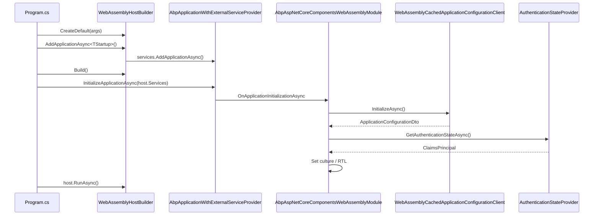

`Volo.Abp.AspNetCore.Components.WebAssembly` is the host-specific package for
Blazor WebAssembly. It wires the ABP application model into the
`WebAssemblyHostBuilder` lifecycle, registers the
`AbpBlazorClientHttpMessageHandler` on every typed proxy client, replaces the
default principal / tenant / server-URL accessors with WASM-friendly ones, and
exposes `AddApplicationAsync<T>` / `InitializeApplicationAsync` extension
methods that mirror the server-side ABP startup pattern. This page documents
each of those pieces against the source.

## Project layout

```
framework/src/Volo.Abp.AspNetCore.Components.WebAssembly/
├── Microsoft/AspNetCore/Components/WebAssembly/Hosting/
│   └── AbpWebAssemblyHostBuilderExtensions.cs   (AddApplication[Async] + Initialize)
├── Microsoft/Extensions/DependencyInjection/
│   ├── AbpWebAssemblyServiceCollectionExtensions.cs   (GetHostBuilder, GetWebAssemblyHostEnvironment)
│   └── EmptyWebAssemblyHostEnvironment.cs
└── Volo/Abp/AspNetCore/Components/WebAssembly/
    ├── AbpAspNetCoreComponentsWebAssemblyModule.cs
    ├── AbpWebAssemblyApplicationCreationOptions.cs
    ├── ApplicationConfigurationCache.cs
    ├── ClientProxyExceptionEventHandler.cs
    ├── Configuration/
    │   └── BlazorWebAssemblyCurrentApplicationConfigurationCacheResetService.cs
    ├── Extensibility/
    │   └── WebAssemblyLookupApiRequestService.cs
    ├── WebAssemblyCachedApplicationConfigurationClient.cs
    ├── WebAssemblyCurrentPrincipalAccessor.cs
    ├── WebAssemblyCurrentTenantAccessor.cs
    └── WebAssemblyServerUrlProvider.cs
```

The csproj brings in `Microsoft.AspNetCore.Components.WebAssembly[.Authentication]`
and `WebUtilities`:

```xml title="framework/src/Volo.Abp.AspNetCore.Components.WebAssembly/Volo.Abp.AspNetCore.Components.WebAssembly.csproj"
<PackageReference Include="Microsoft.AspNetCore.Components.WebAssembly" />
<PackageReference Include="Microsoft.AspNetCore.Components.Authorization" />
<PackageReference Include="Microsoft.AspNetCore.Components.WebAssembly.Authentication" />
<PackageReference Include="Microsoft.AspNetCore.WebUtilities" />
```

## The module class

```csharp title="framework/src/Volo.Abp.AspNetCore.Components.WebAssembly/Volo/Abp/AspNetCore/Components/WebAssembly/AbpAspNetCoreComponentsWebAssemblyModule.cs"
[DependsOn(
    typeof(AbpAspNetCoreMvcClientCommonModule),
    typeof(AbpUiModule),
    typeof(AbpAspNetCoreComponentsWebModule)
)]
public class AbpAspNetCoreComponentsWebAssemblyModule : AbpModule
{
    public override void PreConfigureServices(ServiceConfigurationContext context)
    {
        var abpHostEnvironment = context.Services.GetSingletonInstance<IAbpHostEnvironment>();
        if (abpHostEnvironment.EnvironmentName.IsNullOrWhiteSpace())
        {
            abpHostEnvironment.EnvironmentName =
                context.Services.GetWebAssemblyHostEnvironment().Environment;
        }

        PreConfigure<AbpHttpClientBuilderOptions>(options =>
        {
            options.ProxyClientBuildActions.Add((_, builder) =>
            {
                builder.AddHttpMessageHandler<AbpBlazorClientHttpMessageHandler>();
            });
        });
    }

    public override void ConfigureServices(ServiceConfigurationContext context)
    {
        context.Services.AddHttpClient();
        context.Services
            .GetHostBuilder().Logging
            .AddProvider(new AbpExceptionHandlingLoggerProvider(context.Services));
    }

    public override void OnApplicationInitialization(ApplicationInitializationContext context)
    {
        AsyncHelper.RunSync(() => OnApplicationInitializationAsync(context));
    }

    public async override Task OnApplicationInitializationAsync(ApplicationInitializationContext context)
    {
        await context.ServiceProvider.GetRequiredService<IClientScopeServiceProviderAccessor>()
            .ServiceProvider.GetRequiredService<WebAssemblyCachedApplicationConfigurationClient>()
            .InitializeAsync();
        await context.ServiceProvider.GetRequiredService<IClientScopeServiceProviderAccessor>()
            .ServiceProvider.GetRequiredService<AbpComponentsClaimsCache>()
            .InitializeAsync();
        await SetCurrentLanguageAsync(context.ServiceProvider);
    }

    private async static Task SetCurrentLanguageAsync(IServiceProvider serviceProvider)
    {
        var configurationClient = serviceProvider.GetRequiredService<ICachedApplicationConfigurationClient>();
        var utilsService = serviceProvider.GetRequiredService<IAbpUtilsService>();
        var configuration = await configurationClient.GetAsync();
        var cultureName = configuration.Localization?.CurrentCulture?.CultureName;
        if (!cultureName.IsNullOrEmpty())
        {
            var culture = new CultureInfo(cultureName!);
            CultureInfo.DefaultThreadCurrentCulture = culture;
            CultureInfo.DefaultThreadCurrentUICulture = culture;
        }

        if (CultureInfo.CurrentUICulture.TextInfo.IsRightToLeft)
        {
            await utilsService.AddClassToTagAsync("body", "rtl");
        }
    }
}
```

### `PreConfigureServices` — host environment + HTTP handler

`IAbpHostEnvironment.EnvironmentName` is populated from the WASM host
environment so framework code that reads it (feature flags, localization,
caching) gets the right value before any module runs `ConfigureServices`.

The `AbpHttpClientBuilderOptions` pre-configure inserts
`AbpBlazorClientHttpMessageHandler` (covered on
[components-web](/blazor/components-web)) into every typed HTTP client that
ABP creates for a dynamic C# proxy. That's how every remote call automatically
attaches the language header, the anti-forgery token, and drives the page
progress bar.

### `ConfigureServices` — http factory + logger provider

`AddHttpClient()` materialises the typed-client builder; then the module hooks
the WASM host's `ILoggingBuilder` with `AbpExceptionHandlingLoggerProvider`.
That logger provider lifts logged exceptions into the `IUserExceptionInformer`
contract so unhandled background errors reach the UI.

### `OnApplicationInitializationAsync` — three-phase boot

| Phase                              | What runs                                                                          | Why it happens here                                                   |
| ---------------------------------- | ---------------------------------------------------------------------------------- | --------------------------------------------------------------------- |
| Configuration fetch                | `WebAssemblyCachedApplicationConfigurationClient.InitializeAsync()`                | Loads tenant info, localization resources, permissions, current user. |
| Claims cache                       | `AbpComponentsClaimsCache.InitializeAsync()`                                       | Synchronises `ClaimsPrincipal` from `AuthenticationStateProvider`.    |
| Culture + RTL                      | Set `CultureInfo.DefaultThreadCurrentCulture[/UICulture]`, add `rtl` class to body | Must happen before the first component renders.                       |

Both initializers are resolved through `IClientScopeServiceProviderAccessor`,
which is set by `InitializeApplicationAsync` (next section).

## `WebAssemblyHostBuilder` extension methods

ABP exposes two startup verbs that mirror its server-side `AddApplication[Async]`
pattern. Use them in your `Program.cs`.

```csharp title="framework/src/Volo.Abp.AspNetCore.Components.WebAssembly/Microsoft/AspNetCore/Components/WebAssembly/Hosting/AbpWebAssemblyHostBuilderExtensions.cs"
public static class AbpWebAssemblyHostBuilderExtensions
{
    public async static Task<IAbpApplicationWithExternalServiceProvider>
        AddApplicationAsync<TStartupModule>(
            [NotNull] this WebAssemblyHostBuilder builder,
            Action<AbpWebAssemblyApplicationCreationOptions> options)
        where TStartupModule : IAbpModule
    {
        Check.NotNull(builder, nameof(builder));

        Castle.DynamicProxy.Generators.AttributesToAvoidReplicating
            .Add<AsyncStateMachineAttribute>();

        builder.Services.AddSingleton<IConfiguration>(builder.Configuration);
        builder.Services.AddSingleton(builder);

        var application = await builder.Services.AddApplicationAsync<TStartupModule>(opts =>
        {
            options?.Invoke(new AbpWebAssemblyApplicationCreationOptions(builder, opts));
            if (opts.Environment.IsNullOrWhiteSpace())
            {
                opts.Environment = builder.HostEnvironment.Environment;
            }
        });

        return application;
    }

    public static IAbpApplicationWithExternalServiceProvider
        AddApplication<TStartupModule>(
            [NotNull] this WebAssemblyHostBuilder builder,
            Action<AbpWebAssemblyApplicationCreationOptions> options)
        where TStartupModule : IAbpModule { /* synchronous variant */ }

    public async static Task InitializeApplicationAsync(
        [NotNull] this IAbpApplicationWithExternalServiceProvider application,
        [NotNull] IServiceProvider serviceProvider)
    {
        Check.NotNull(application, nameof(application));
        Check.NotNull(serviceProvider, nameof(serviceProvider));

        ((ComponentsClientScopeServiceProviderAccessor)serviceProvider
            .GetRequiredService<IClientScopeServiceProviderAccessor>())
            .ServiceProvider = serviceProvider;

        await application.InitializeAsync(serviceProvider);
    }
}
```

The `AddApplication[Async]` overloads do three things:

1. Whitelist `AsyncStateMachineAttribute` so Castle's dynamic proxy does *not*
   try to copy it (a long-standing gap since the removal of
   `Microsoft.AspNetCore.Blazor.BuildTools`).
2. Register `IConfiguration` and the `WebAssemblyHostBuilder` itself as
   singletons so other modules (and the
   `AbpWebAssemblyApplicationCreationOptions` wrapper) can reach them later.
3. Defer to ABP's `AddApplicationAsync<T>` extension on `IServiceCollection`,
   propagating the environment name when the user didn't override it.

`InitializeApplicationAsync` stores the root `IServiceProvider` on the
`ComponentsClientScopeServiceProviderAccessor` and runs the module
initialization (which calls `OnApplicationInitializationAsync`).

### Program.cs pattern

```csharp title="src/MyApp.Blazor.WebAssembly/Program.cs"
var builder = WebAssemblyHostBuilder.CreateDefault(args);
builder.RootComponents.Add<App>("#ApplicationContainer");

var application = await builder.AddApplicationAsync<MyAppBlazorWebAssemblyModule>(
    options =>
    {
        // Optional Autofac:
        options.UseAutofac();
    });

var host = builder.Build();
await application.InitializeApplicationAsync(host.Services);
await host.RunAsync();
```

### Service-collection helpers

```csharp title="framework/src/Volo.Abp.AspNetCore.Components.WebAssembly/Microsoft/Extensions/DependencyInjection/AbpWebAssemblyServiceCollectionExtensions.cs"
public static class AbpWebAssemblyServiceCollectionExtensions
{
    public static WebAssemblyHostBuilder GetHostBuilder(this IServiceCollection services)
        => services.GetSingletonInstance<WebAssemblyHostBuilder>();

    public static IWebAssemblyHostEnvironment GetWebAssemblyHostEnvironment(
        this IServiceCollection services)
    {
        var env = services.GetSingletonInstanceOrNull<IWebAssemblyHostEnvironment>();
        if (env == null)
        {
            return new EmptyWebAssemblyHostEnvironment
            {
                Environment = Environments.Development
            };
        }
        return env;
    }
}
```

`GetHostBuilder()` reaches the singleton registered by `AddApplication`;
`GetWebAssemblyHostEnvironment()` returns a stand-in environment in scenarios
(unit tests) where no real WASM host exists.

## `AbpWebAssemblyApplicationCreationOptions`

The wrapper the `AddApplication` callback receives. It exposes both the WASM
host builder and the underlying `AbpApplicationCreationOptions`:

```csharp title="framework/src/Volo.Abp.AspNetCore.Components.WebAssembly/Volo/Abp/AspNetCore/Components/WebAssembly/AbpWebAssemblyApplicationCreationOptions.cs"
public class AbpWebAssemblyApplicationCreationOptions
{
    public WebAssemblyHostBuilder HostBuilder { get; }
    public AbpApplicationCreationOptions ApplicationCreationOptions { get; }

    public AbpWebAssemblyApplicationCreationOptions(
        WebAssemblyHostBuilder hostBuilder,
        AbpApplicationCreationOptions applicationCreationOptions)
    {
        HostBuilder = hostBuilder;
        ApplicationCreationOptions = applicationCreationOptions;
    }
}
```

A typical use is to forward calls to plugins or to switch the DI container.

## `Volo.Abp.Autofac.WebAssembly`

ABP's Autofac integration is opt-in for WASM the same way it is on the server.
You install `Volo.Abp.Autofac.WebAssembly` and call `options.UseAutofac()` on
the `AbpWebAssemblyApplicationCreationOptions`. The Autofac WebAssembly module
swaps the conventional `IServiceProviderFactory` so property-injected
components keep working under Castle's interception model.

```csharp
await builder.AddApplicationAsync<MyAppBlazorWebAssemblyModule>(options =>
{
    options.UseAutofac();
});
```

After `UseAutofac()` the rest of `AddApplicationAsync` proceeds against the
Autofac-backed `IAbpApplicationWithExternalServiceProvider`.

## Configuration cache + reset (WASM variant)

```csharp title="framework/src/Volo.Abp.AspNetCore.Components.WebAssembly/Volo/Abp/AspNetCore/Components/WebAssembly/WebAssemblyCachedApplicationConfigurationClient.cs"
public class WebAssemblyCachedApplicationConfigurationClient
    : ICachedApplicationConfigurationClient, ITransientDependency
{
    public virtual async Task InitializeAsync()
    {
        var configurationDto = await ApplicationConfigurationClientProxy.GetAsync(
            new ApplicationConfigurationRequestOptions
            {
                IncludeLocalizationResources = false
            });

        var localizationDto = await ApplicationLocalizationClientProxy.GetAsync(
            new ApplicationLocalizationRequestDto
            {
                CultureName = configurationDto.Localization.CurrentCulture.Name,
                OnlyDynamics = true
            });

        configurationDto.Localization.Resources = localizationDto.Resources;
        Cache.Set(configurationDto);
        ApplicationConfigurationChangedService.NotifyChanged();

        CurrentTenantAccessor.Current = new BasicTenantInfo(
            configurationDto.CurrentTenant.Id,
            configurationDto.CurrentTenant.Name);
    }

    public virtual Task<ApplicationConfigurationDto> GetAsync()
        => Task.FromResult(GetConfigurationByChecking());
}
```

The client splits the configuration fetch into two calls so the (typically
larger) localization resources can be retrieved independently — this lets the
reset path on settings/permission changes skip re-downloading localization
data unless the culture changed.

The reset adapter, used by other modules that mutate configuration:

```csharp title="framework/src/Volo.Abp.AspNetCore.Components.WebAssembly/Volo/Abp/AspNetCore/Components/WebAssembly/Configuration/BlazorWebAssemblyCurrentApplicationConfigurationCacheResetService.cs"
// Re-runs InitializeAsync() on the cached configuration client.
```

## Replaced accessors

| Service                                  | WASM implementation                                  | Effect                                                                                  |
| ---------------------------------------- | ---------------------------------------------------- | --------------------------------------------------------------------------------------- |
| `ICurrentPrincipalAccessor`              | `WebAssemblyCurrentPrincipalAccessor`                | Reads from `AbpComponentsClaimsCache` (which mirrors `AuthenticationStateProvider`).    |
| `ICurrentTenantAccessor`                 | `WebAssemblyCurrentTenantAccessor` (singleton)        | `BasicTenantInfo? Current { get; set; }` — populated by the cached config client.       |
| `IServerUrlProvider`                     | `WebAssemblyServerUrlProvider`                       | Resolves `BaseUrl` from `RemoteServiceConfigurationDictionary`.                         |
| `ICurrentApplicationConfigurationCacheResetService` | `BlazorWebAssemblyCurrentApplicationConfigurationCacheResetService` | Re-fetches the configuration.                                                          |
| `ILookupApiRequestService`               | `WebAssemblyLookupApiRequestService`                 | HTTP-based lookup for data-grid columns.                                                |

```csharp title="framework/src/Volo.Abp.AspNetCore.Components.WebAssembly/Volo/Abp/AspNetCore/Components/WebAssembly/WebAssemblyServerUrlProvider.cs"
[Dependency(ReplaceServices = true)]
public class WebAssemblyServerUrlProvider : IServerUrlProvider, ITransientDependency
{
    public async Task<string> GetBaseUrlAsync(string? remoteServiceName = null)
    {
        var remoteServiceConfiguration = await RemoteServiceConfigurationProvider
            .GetConfigurationOrDefaultAsync(
                remoteServiceName ?? RemoteServiceConfigurationDictionary.DefaultName);

        return remoteServiceConfiguration.BaseUrl.EnsureEndsWith('/');
    }
}
```

```csharp title="framework/src/Volo.Abp.AspNetCore.Components.WebAssembly/Volo/Abp/AspNetCore/Components/WebAssembly/WebAssemblyCurrentTenantAccessor.cs"
[Dependency(ReplaceServices = true)]
public class WebAssemblyCurrentTenantAccessor : ICurrentTenantAccessor, ISingletonDependency
{
    public BasicTenantInfo? Current { get; set; }
}
```

## Exception event handler

`ClientProxyExceptionEventHandler` is registered as part of this module to
route exceptions raised by the dynamic C# proxies into the
`IUserExceptionInformer` pipeline (so 401s from the backend show a UI dialog
rather than crashing the circuit). See [HTTP client](/http/http-client) for
how proxies raise these events.

## Boot sequence



## Cross-references

- [Components core](/blazor/components-web) — `IAbpUtilsService`,
  `AbpComponentsClaimsCache`, `AbpBlazorClientHttpMessageHandler`.
- [Components.Server](/blazor/components-server) — the server peer of this
  module.
- [Components.MauiBlazor](/blazor/components-maui-blazor) — the MAUI hybrid
  peer (uses an identical initialization shape).
- [HTTP client](/http/http-client) — proxy clients and the
  `AbpHttpClientBuilderOptions.ProxyClientBuildActions` extension point used
  in `PreConfigureServices`.
- [Theming pipeline](/blazor/theming-pipeline) — the `Theming` module that
  pairs with this host and adds the WASM bundle contributor.
- [UI MVC overview](/ui-mvc/overview) — for sibling MVC hosts.
