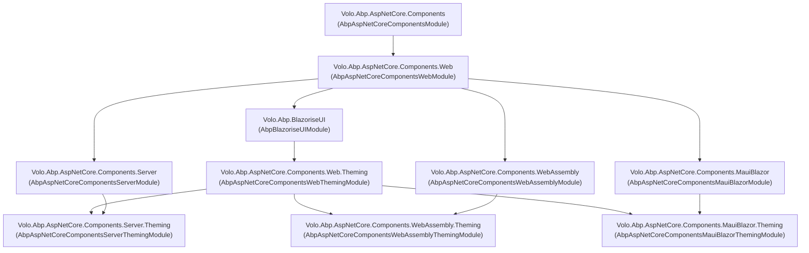

The ABP Framework integrates Microsoft's Blazor stack at three host levels —
Blazor Server, Blazor WebAssembly, and .NET MAUI Blazor Hybrid — on top of a
common `Microsoft.AspNetCore.Components` foundation. The Blazor packages are
intentionally split so that the same component types, `IUiMessageService` /
`IUiNotificationService` / `IUiPageProgressService` contracts, and theming
abstractions are reused across hosts while each host gets only the wiring it
needs (cookie handling, SignalR hub mapping, HTTP message handlers, persistent
language storage). Theming is layered on top of those host packages and feeds
the Blazorise-based default UI through ABP's bundling and module systems.

This page is the entry point for the Blazor area of the wiki. It enumerates the
packages, draws the dependency graph, and links to the per-package pages where
each module class, options object, and contract is documented against the real
sources under `framework/src/Volo.Abp.AspNetCore.Components*` and
`framework/src/Volo.Abp.BlazoriseUI`.

## Package inventory

The Blazor area ships ten NuGet packages. Each one corresponds to a
`framework/src/<name>` project in the [`abpframework/abp`](https://github.com/abpframework/abp)
repository.

| Package                                                  | Project SDK              | Role                                                                                           |
| -------------------------------------------------------- | ------------------------ | ---------------------------------------------------------------------------------------------- |
| `Volo.Abp.AspNetCore.Components`                         | `Microsoft.NET.Sdk.Razor`| Host-agnostic foundation: `AbpComponentBase`, UI service contracts, alert/message/progress DTOs.|
| `Volo.Abp.AspNetCore.Components.Web`                     | `Microsoft.NET.Sdk.Razor`| Browser primitives shared by Server / WASM / MAUI: cookies, server URL provider, claims cache. |
| `Volo.Abp.AspNetCore.Components.Web.Theming`             | `Microsoft.NET.Sdk.Razor`| Theme manager, layout dictionary, page toolbar / page header, dynamic layout component.        |
| `Volo.Abp.AspNetCore.Components.Server`                  | `Microsoft.NET.Sdk.Web`  | Blazor Server host wiring: `AddServerSideBlazor`, `MapBlazorHub`, `MapFallbackToPage("/_Host")`.|
| `Volo.Abp.AspNetCore.Components.Server.Theming`          | `Microsoft.NET.Sdk.Razor`| Server-side bundling contributors for `blazor.server.js`, Blazorise CSS, Bootstrap, FA.        |
| `Volo.Abp.AspNetCore.Components.WebAssembly`             | `Microsoft.NET.Sdk.Razor`| WASM host extensions: `AddApplicationAsync<T>`, claims cache init, RTL setup.                  |
| `Volo.Abp.AspNetCore.Components.WebAssembly.Theming`     | `Microsoft.NET.Sdk.Razor`| Client-side bundle contributor that emits `_content/...` URLs the WASM index needs.            |
| `Volo.Abp.AspNetCore.Components.MauiBlazor`              | `Microsoft.NET.Sdk.Razor`| MAUI hybrid wiring: `AbpMauiBlazorClientHttpMessageHandler`, remote tenant store, language.    |
| `Volo.Abp.AspNetCore.Components.MauiBlazor.Theming`      | `Microsoft.NET.Sdk.Razor`| MAUI bundle contributor — mirrors the WASM contributor for hybrid hosts.                       |
| `Volo.Abp.BlazoriseUI`                                   | `Microsoft.NET.Sdk.Razor`| Blazorise-based default UI: CRUD page base, modal helpers, extensible data grid, alerts.       |

`Microsoft.NET.Sdk.Razor` is used for libraries that embed `.razor` files;
`Microsoft.NET.Sdk.Web` is used by the Server package because it must register
HTTP endpoints. All projects target `net8.0` and enable nullable annotations as
warnings-as-errors.

<Info>
The base `Volo.Abp.AspNetCore.Components` package depends only on
`Microsoft.AspNetCore.Components` — not on `.Web` or `.WebAssembly`. That is
what allows the `AbpComponentBase` class and the UI service contracts to be
shared across every Blazor host without dragging server-only dependencies.
</Info>

## Dependency graph



The `[DependsOn]` attributes that produce this graph are declared on each
module class. For example, `AbpAspNetCoreComponentsWebAssemblyModule` declares:

```csharp title="framework/src/Volo.Abp.AspNetCore.Components.WebAssembly/Volo/Abp/AspNetCore/Components/WebAssembly/AbpAspNetCoreComponentsWebAssemblyModule.cs"
[DependsOn(
    typeof(AbpAspNetCoreMvcClientCommonModule),
    typeof(AbpUiModule),
    typeof(AbpAspNetCoreComponentsWebModule)
)]
public class AbpAspNetCoreComponentsWebAssemblyModule : AbpModule
```

…and the corresponding theming module sits on top:

```csharp title="framework/src/Volo.Abp.AspNetCore.Components.WebAssembly.Theming/AbpAspNetCoreComponentsWebAssemblyThemingModule.cs"
[DependsOn(
    typeof(AbpAspNetCoreComponentsWebThemingModule),
    typeof(AbpAspNetCoreComponentsWebAssemblyModule)
)]
public class AbpAspNetCoreComponentsWebAssemblyThemingModule : AbpModule
{
}
```

## Choosing a host

Pick the smallest set of packages that satisfies your scenario. The other
Blazor docs in this section describe each module in detail.

<CardGroup cols={2}>
  <Card title="Components core" href="/blazor/components-web">
    `AbpComponentBase`, alert / message / notification / progress contracts,
    cookie service, server URL provider, claims cache, exception informer.
  </Card>
  <Card title="Blazor Server host" href="/blazor/components-server">
    `AddServerSideBlazor`, `MapBlazorHub`, `MapFallbackToPage("/_Host")`,
    SignalR pre-configuration, cookie OIDC introspection helper.
  </Card>
  <Card title="Blazor WebAssembly host" href="/blazor/components-webassembly">
    `WebAssemblyHostBuilder.AddApplicationAsync<T>()`,
    `WebAssemblyCachedApplicationConfigurationClient`, claims cache init,
    `AbpBlazorClientHttpMessageHandler` for XSRF + language.
  </Card>
  <Card title="MAUI Blazor host" href="/blazor/components-maui-blazor">
    Maui hybrid wiring, remote tenant store, persistent language provider,
    `AbpMauiBlazorClientHttpMessageHandler`.
  </Card>
  <Card title="Blazorise UI" href="/blazor/blazorise-ui">
    `AbpCrudPageBase<>` family, `AbpExtensibleDataGrid`, page toolbar,
    Blazorise-backed message / notification / progress services.
  </Card>
  <Card title="Theming pipeline" href="/blazor/theming-pipeline">
    `IThemeManager`, `IThemeSelector`, `ThemeInfo`, `AbpThemingOptions`,
    server bundling vs. WASM/MAUI client bundling.
  </Card>
</CardGroup>

## Cross-cutting concerns

Several ABP subsystems are reused identically inside the Blazor stack — the
Blazor packages only adapt them to the component lifecycle.

| Concern              | Blazor surface                                                | Where the contract lives                                                                                  |
| -------------------- | ------------------------------------------------------------- | --------------------------------------------------------------------------------------------------------- |
| HTTP client proxies  | `AbpBlazorClientHttpMessageHandler` (WASM) / MAUI variant     | [HTTP integration overview](/http/overview), [HTTP client](/http/http-client)                             |
| Server URL discovery | `IServerUrlProvider` + `RemoteServiceConfigurationDictionary` | [Remote services](/http/remote-services)                                                                  |
| Multi-tenancy        | `WebAssemblyCurrentTenantAccessor`, `MauiBlazorRemoteTenantStore` | [Multi-tenancy](/multitenancy/overview)                                                                |
| Localization         | `AbpBlazorMessageLocalizerHelper<T>`, `_jsRuntime` lang cookie | [Localization](/localization/overview)                                                                    |
| Bundling             | `BlazorStandardBundles`, `ComponentsComponentsBundleContributor` | [Bundling abstractions](/ui-mvc/bundling-abstractions), [MVC bundling](/ui-mvc/bundling)                |
| Auth & claims        | `AbpComponentsClaimsCache`, `AuthenticationStateProvider`     | [Authorization](/authz/overview)                                                                          |
| MAUI host wiring     | `AbpAspNetCoreComponentsMauiBlazorModule`                     | [MAUI client overview](/clients/maui)                                                                     |

## Shared component activation model

Every host replaces Blazor's default `IComponentActivator` with one that resolves
through the ABP DI container, so components are conventionally registered as
`Transient` and can take constructor / `[Inject]` dependencies. The
registration happens in two places.

```csharp title="framework/src/Volo.Abp.AspNetCore.Components/Volo/Abp/AspNetCore/Components/DependencyInjection/AbpWebAssemblyConventionalRegistrar.cs"
public class AbpWebAssemblyConventionalRegistrar : DefaultConventionalRegistrar
{
    protected override bool IsConventionalRegistrationDisabled(Type type)
    {
        return !IsComponent(type) || base.IsConventionalRegistrationDisabled(type);
    }

    private static bool IsComponent(Type type)
    {
        return typeof(ComponentBase).IsAssignableFrom(type);
    }

    protected override ServiceLifetime? GetDefaultLifeTimeOrNull(Type type)
    {
        return ServiceLifetime.Transient;
    }
}
```

```csharp title="framework/src/Volo.Abp.AspNetCore.Components.Web/Volo/Abp/AspNetCore/Components/Web/AbpAspNetCoreComponentsWebModule.cs"
public override void ConfigureServices(ServiceConfigurationContext context)
{
    context.Services.Replace(
        ServiceDescriptor.Transient<IComponentActivator,
                                    ServiceProviderComponentActivator>());
}
```

The activator delegates to the container and falls back to
`Activator.CreateInstance` only if the type is not registered:

```csharp title="framework/src/Volo.Abp.AspNetCore.Components/Volo/Abp/AspNetCore/Components/DependencyInjection/ServiceProviderComponentActivator.cs"
public IComponent CreateInstance(Type componentType)
{
    var instance = ServiceProvider.GetService(componentType);

    if (instance == null)
    {
        instance = Activator.CreateInstance(componentType);
    }

    if (!(instance is IComponent component))
    {
        throw new ArgumentException(
            $"The type {componentType.FullName} does not implement {nameof(IComponent)}.",
            nameof(componentType));
    }

    return component;
}
```

Blazorise replaces this activator again inside its module so that Blazorise's
own activator participates — see [Blazorise UI](/blazor/blazorise-ui) for the
details.

## Module entry points by host

When you write your own Blazor module you depend on **one** of the host modules
below. Tooling (`abp new`) does this automatically; this table is the
authoritative cheat sheet.

| Host                     | Top-level dependency you add to your module                                       |
| ------------------------ | -------------------------------------------------------------------------------- |
| Blazor Server            | `AbpAspNetCoreComponentsServerThemingModule`                                     |
| Blazor WebAssembly       | `AbpAspNetCoreComponentsWebAssemblyThemingModule`                                |
| MAUI Blazor Hybrid       | `AbpAspNetCoreComponentsMauiBlazorThemingModule`                                 |
| Headless shared library  | `AbpAspNetCoreComponentsWebThemingModule` (no host)                              |

Each of those theming modules transitively depends on `AbpBlazoriseUIModule`,
so you get the entire default UI for free.

## Where to go next

<Steps>
  <Step title="Read the components-web page">
    Start with [components-web](/blazor/components-web). It documents
    `AbpComponentBase`, the message/notification/progress contracts, and the
    `IServerUrlProvider` / `ICookieService` abstractions that the host packages
    all depend on.
  </Step>
  <Step title="Pick your host page">
    Pick one of [components-server](/blazor/components-server),
    [components-webassembly](/blazor/components-webassembly), or
    [components-maui-blazor](/blazor/components-maui-blazor) to learn the
    host-specific wiring.
  </Step>
  <Step title="Layer the theming pipeline">
    The [theming pipeline](/blazor/theming-pipeline) page explains how
    `IThemeManager` and the bundling contributors plug into the host you chose.
  </Step>
  <Step title="Adopt Blazorise UI for screens">
    The [Blazorise UI page](/blazor/blazorise-ui) covers the `AbpCrudPageBase`
    family and the data grid that the LeptonX / Basic themes render with.
  </Step>
</Steps>

<Tip>
If you are coming from MVC, the [UI MVC overview](/ui-mvc/overview) describes
the equivalent stack for Razor Pages — the bundling and theming contracts are
deliberately symmetric so a Razor module and a Blazor module can share a
solution.
</Tip>

## Service replacements at a glance

The table below is useful when you are diagnosing "why is my message handler /
URL provider / tenant store not the one I expect" issues. Each row reflects an
explicit `[Dependency(ReplaceServices = true)]` or a `services.Replace(...)`
call in source.

| Service                                              | `.Web` default                                                       | Server replacement                                                                  | WebAssembly replacement                              | MAUI replacement                              |
| ---------------------------------------------------- | -------------------------------------------------------------------- | ----------------------------------------------------------------------------------- | ---------------------------------------------------- | --------------------------------------------- |
| `IComponentActivator`                                | `ServiceProviderComponentActivator`                                  | inherits                                                                            | inherits (then Blazorise replaces with `ComponentActivator`) | same as WASM                                  |
| `IServerUrlProvider`                                 | `DefaultServerUrlProvider` (returns `/`)                             | inherits                                                                            | `WebAssemblyServerUrlProvider`                       | `MauiBlazorServerUrlProvider`                  |
| `ICurrentPrincipalAccessor`                          | (from `Volo.Abp.Security`)                                           | inherits                                                                            | `WebAssemblyCurrentPrincipalAccessor`                | `MauiBlazorCurrentPrincipalAccessor`           |
| `ICurrentTenantAccessor`                             | (from `Volo.Abp.MultiTenancy`)                                       | inherits                                                                            | `WebAssemblyCurrentTenantAccessor`                   | `MauiBlazorCurrentTenantAccessor`              |
| `ITenantStore`                                       | (from MVC)                                                           | inherits                                                                            | inherits                                             | `MauiBlazorRemoteTenantStore`                  |
| `ICachedApplicationConfigurationClient`              | (from `AbpAspNetCoreMvcClientCommon`)                                | inherits                                                                            | `WebAssemblyCachedApplicationConfigurationClient`    | `MauiBlazorCachedApplicationConfigurationClient`|
| `ICurrentApplicationConfigurationCacheResetService`  | `NullCurrentApplicationConfigurationCacheResetService`               | `BlazorServerCurrentApplicationConfigurationCacheResetService` (local event)        | `BlazorWebAssemblyCurrentApplicationConfigurationCacheResetService` (re-fetch) | same as WASM                                  |
| `ILookupApiRequestService`                           | (contract only)                                                      | `BlazorServerLookupApiRequestService` (in-process)                                  | `WebAssemblyLookupApiRequestService` (HTTP)          | same as WASM                                  |
| HTTP delegating handler on proxies                   | —                                                                    | (server runs in-process)                                                            | `AbpBlazorClientHttpMessageHandler`                  | `AbpMauiBlazorClientHttpMessageHandler`        |

Each replacement is documented in detail on its host page.

## File-system layout cheat sheet

```
framework/src/
├── Volo.Abp.AspNetCore.Components/
│   └── Volo/Abp/AspNetCore/Components/
│       ├── AbpAspNetCoreComponentsModule.cs
│       ├── AbpComponentBase.cs
│       ├── Alerts/ Messages/ Notifications/ Progression/ ExceptionHandling/
│       └── DependencyInjection/
├── Volo.Abp.AspNetCore.Components.Web/
│   └── Volo/Abp/AspNetCore/Components/Web/
│       ├── AbpAspNetCoreComponentsWebModule.cs
│       ├── AbpBlazorClientHttpMessageHandler.cs
│       ├── CookieService.cs DefaultServerUrlProvider.cs
│       └── Security/ Configuration/ Extensibility/ DependencyInjection/
├── Volo.Abp.AspNetCore.Components.Web.Theming/
│   ├── AbpAspNetCoreComponentsWebThemingModule.cs
│   ├── Theming/ Layout/ PageToolbars/ Toolbars/ Routing/ Components/
├── Volo.Abp.AspNetCore.Components.Server/
│   ├── AbpAspNetCoreComponentsServerModule.cs
│   ├── Configuration/ Extensibility/
│   └── Microsoft/AspNetCore/Authentication/Cookies/CookieAuthenticationOptionsExtensions.cs
├── Volo.Abp.AspNetCore.Components.Server.Theming/
│   └── Bundling/ (BlazorGlobalStyleContributor, BlazorGlobalScriptContributor)
├── Volo.Abp.AspNetCore.Components.WebAssembly/
│   ├── AbpAspNetCoreComponentsWebAssemblyModule.cs
│   ├── WebAssemblyCachedApplicationConfigurationClient.cs
│   ├── WebAssemblyServerUrlProvider.cs / *PrincipalAccessor / *TenantAccessor
│   └── Microsoft/AspNetCore/Components/WebAssembly/Hosting/AbpWebAssemblyHostBuilderExtensions.cs
├── Volo.Abp.AspNetCore.Components.WebAssembly.Theming/
│   └── ComponentsComponentsBundleContributor.cs
├── Volo.Abp.AspNetCore.Components.MauiBlazor/
│   ├── AbpAspNetCoreComponentsMauiBlazorModule.cs
│   ├── AbpMauiBlazorClientHttpMessageHandler.cs
│   ├── MauiBlazorRemoteTenantStore.cs / *ServerUrlProvider / *PrincipalAccessor
│   └── IMauiBlazorSelectedLanguageProvider.cs
├── Volo.Abp.AspNetCore.Components.MauiBlazor.Theming/
│   └── ComponentsComponentsBundleContributor.cs
└── Volo.Abp.BlazoriseUI/
    ├── AbpBlazoriseUIModule.cs
    ├── AbpCrudPageBase.cs
    └── Components/ (PageAlert, UiMessageAlert, AbpExtensibleDataGrid, ...)
```

Use this map together with each per-package page to locate the exact source
file behind any code snippet in this section.
