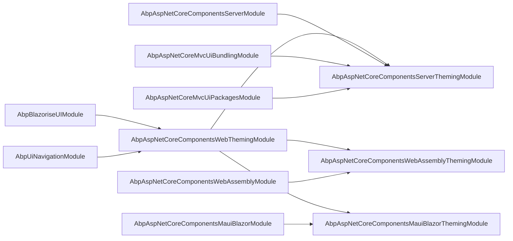
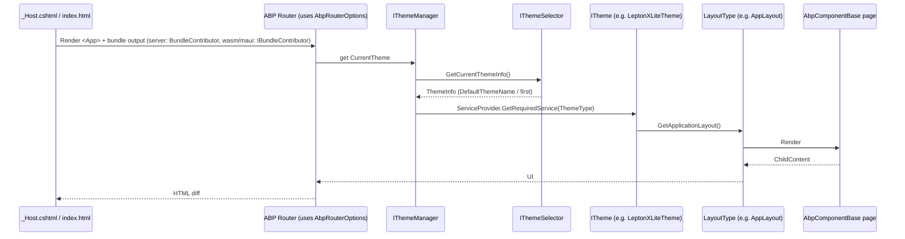

The four `Theming` packages under `framework/src/Volo.Abp.AspNetCore.Components.*.Theming`
implement ABP's pluggable theming model on top of the host modules. The shared
`Volo.Abp.AspNetCore.Components.Web.Theming` package owns the theme contracts
(`IThemeManager`, `ITheme`, `IThemeSelector`, `ThemeInfo`, `AbpThemingOptions`),
the layout dictionary (`StandardLayouts`), the page toolbar / page header /
dynamic layout components, and the router options. Each host theming package
then adds bundling on top: server-side uses ABP's MVC bundling infrastructure
(`BundleContributor`) to compose `_Host.cshtml` scripts and styles; WebAssembly
and MAUI use the lighter `Volo.Abp.Bundling` `IBundleContributor` model that
emits a `BundleDefinition` list the client renders directly. This page maps
every type to source and shows the four package shapes side-by-side.

## Package summary

| Package                                             | Module                                                | What it adds                                                                          |
| --------------------------------------------------- | ----------------------------------------------------- | ------------------------------------------------------------------------------------- |
| `Volo.Abp.AspNetCore.Components.Web.Theming`        | `AbpAspNetCoreComponentsWebThemingModule`             | Theme contracts, layout dictionary, page header/toolbar, dynamic layout component.    |
| `Volo.Abp.AspNetCore.Components.Server.Theming`     | `AbpAspNetCoreComponentsServerThemingModule`          | `BlazorGlobalStyleContributor`, `BlazorGlobalScriptContributor`, MVC bundle wiring.   |
| `Volo.Abp.AspNetCore.Components.WebAssembly.Theming`| `AbpAspNetCoreComponentsWebAssemblyThemingModule`     | `ComponentsComponentsBundleContributor` (WASM bundling).                              |
| `Volo.Abp.AspNetCore.Components.MauiBlazor.Theming` | `AbpAspNetCoreComponentsMauiBlazorThemingModule`      | `ComponentsComponentsBundleContributor` (MAUI-hybrid bundling).                       |

## Dependency layout



The base theming module's dependencies, verbatim:

```csharp title="framework/src/Volo.Abp.AspNetCore.Components.Web.Theming/AbpAspNetCoreComponentsWebThemingModule.cs"
[DependsOn(
    typeof(AbpBlazoriseUIModule),
    typeof(AbpUiNavigationModule)
    )]
public class AbpAspNetCoreComponentsWebThemingModule : AbpModule
{
}
```

## Theme contracts

```csharp title="framework/src/Volo.Abp.AspNetCore.Components.Web.Theming/Theming/IThemeManager.cs"
public interface IThemeManager
{
    ITheme CurrentTheme { get; }
}
```

```csharp title="framework/src/Volo.Abp.AspNetCore.Components.Web.Theming/Theming/ITheme.cs"
public interface ITheme
{
    Type GetLayout(string name, bool fallbackToDefault = true);
}
```

```csharp title="framework/src/Volo.Abp.AspNetCore.Components.Web.Theming/Theming/IThemeSelector.cs"
public interface IThemeSelector
{
    ThemeInfo GetCurrentThemeInfo();
}
```

The contracts split intentionally:

| Role             | Contract            | Default impl                | Lifetime                                                          |
| ---------------- | ------------------- | --------------------------- | ----------------------------------------------------------------- |
| Choose a theme   | `IThemeSelector`    | `DefaultThemeSelector`      | Transient — reads `AbpThemingOptions` and applies fallback rules. |
| Resolve a theme  | `IThemeManager`     | `DefaultThemeManager`       | Scoped — caches the resolved theme per component scope.            |
| Provide layouts  | `ITheme`            | (user-defined per theme)    | One transient class per theme, registered in `AbpThemingOptions`.   |

### `DefaultThemeSelector`

```csharp title="framework/src/Volo.Abp.AspNetCore.Components.Web.Theming/Theming/DefaultThemeSelector.cs"
public class DefaultThemeSelector : IThemeSelector, ITransientDependency
{
    protected AbpThemingOptions Options { get; }

    public DefaultThemeSelector(IOptions<AbpThemingOptions> options) => Options = options.Value;

    public virtual ThemeInfo GetCurrentThemeInfo()
    {
        if (!Options.Themes.Any())
        {
            throw new AbpException($"No theme registered! Use {nameof(AbpThemingOptions)} to register themes.");
        }

        if (Options.DefaultThemeName == null)
        {
            return Options.Themes.Values.First();
        }

        var themeInfo = Options.Themes.Values
            .FirstOrDefault(t => t.Name == Options.DefaultThemeName);
        if (themeInfo == null)
        {
            throw new AbpException("Default theme is configured but it's not found in the registered themes: "
                                   + Options.DefaultThemeName);
        }
        return themeInfo;
    }
}
```

### `DefaultThemeManager`

```csharp title="framework/src/Volo.Abp.AspNetCore.Components.Web.Theming/Theming/DefaultThemeManager.cs"
public class DefaultThemeManager : IThemeManager, IScopedDependency, IServiceProviderAccessor
{
    public IServiceProvider ServiceProvider { get; }
    public ITheme CurrentTheme => GetCurrentTheme();

    private ITheme? _currentTheme;
    protected IThemeSelector ThemeSelector { get; }

    public DefaultThemeManager(IServiceProvider serviceProvider, IThemeSelector themeSelector)
    {
        ServiceProvider = serviceProvider;
        ThemeSelector = themeSelector;
    }

    protected virtual ITheme GetCurrentTheme()
    {
        if (_currentTheme != null) return _currentTheme;
        _currentTheme = (ITheme)ServiceProvider
            .GetRequiredService(ThemeSelector.GetCurrentThemeInfo().ThemeType);
        return CurrentTheme;
    }
}
```

### `AbpThemingOptions` + `ThemeDictionary`

```csharp title="framework/src/Volo.Abp.AspNetCore.Components.Web.Theming/Theming/AbpThemingOptions.cs"
public class AbpThemingOptions
{
    public ThemeDictionary Themes { get; }
    public string? DefaultThemeName { get; set; }

    public AbpThemingOptions()
    {
        Themes = new ThemeDictionary();
    }
}
```

```csharp title="framework/src/Volo.Abp.AspNetCore.Components.Web.Theming/Theming/ThemeDictionary.cs"
public class ThemeDictionary : Dictionary<Type, ThemeInfo>
{
    public ThemeInfo Add<TTheme>() where TTheme : ITheme => Add(typeof(TTheme));

    public ThemeInfo Add(Type themeType)
    {
        if (ContainsKey(themeType))
        {
            throw new AbpException("This theme is already added before: " + themeType.AssemblyQualifiedName);
        }
        return this[themeType] = new ThemeInfo(themeType);
    }
}
```

### `ThemeInfo` + `ThemeNameAttribute`

```csharp title="framework/src/Volo.Abp.AspNetCore.Components.Web.Theming/Theming/ThemeInfo.cs"
public class ThemeInfo
{
    public Type ThemeType { get; }
    public string Name { get; }

    public ThemeInfo([NotNull] Type themeType)
    {
        if (!typeof(ITheme).IsAssignableFrom(themeType))
        {
            throw new AbpException(
                $"Given {nameof(themeType)} ({themeType.AssemblyQualifiedName}) should be type of {typeof(ITheme).AssemblyQualifiedName}");
        }
        ThemeType = themeType;
        Name = ThemeNameAttribute.GetName(themeType);
    }
}
```

```csharp title="framework/src/Volo.Abp.AspNetCore.Components.Web.Theming/Theming/ThemeNameAttribute.cs"
[AttributeUsage(AttributeTargets.Class)]
public class ThemeNameAttribute : Attribute
{
    public string Name { get; set; }
    public ThemeNameAttribute(string name) => Name = name;

    public static string GetName(Type themeType) =>
        themeType.GetCustomAttributes(true).OfType<ThemeNameAttribute>()
            .FirstOrDefault()?.Name ?? themeType.Name;
}
```

## Layouts

Themes return a layout type per slot. The slot names live in `StandardLayouts`:

```csharp title="framework/src/Volo.Abp.AspNetCore.Components.Web.Theming/Layout/StandardLayouts.cs"
public static class StandardLayouts
{
    public const string Application = "Application";
    public const string Account = "Account";
    public const string Public = "Public";
    public const string Empty = "Empty";
}
```

`ThemeExtensions` exposes a strongly-typed reader for each slot:

```csharp title="framework/src/Volo.Abp.AspNetCore.Components.Web.Theming/Theming/ThemeExtensions.cs"
public static class ThemeExtensions
{
    public static Type GetApplicationLayout(this ITheme theme, bool fallbackToDefault = true)
        => theme.GetLayout(StandardLayouts.Application, fallbackToDefault);

    public static Type GetAccountLayout(this ITheme theme, bool fallbackToDefault = true)
        => theme.GetLayout(StandardLayouts.Account, fallbackToDefault);

    public static Type GetPublicLayout(this ITheme theme, bool fallbackToDefault = true)
        => theme.GetLayout(StandardLayouts.Public, fallbackToDefault);

    public static Type GetEmptyLayout(this ITheme theme, bool fallbackToDefault = true)
        => theme.GetLayout(StandardLayouts.Empty, fallbackToDefault);
}
```

### Writing your own theme

```csharp
[ThemeName("MyTheme")]
public class MyTheme : ITheme, ITransientDependency
{
    public Type GetLayout(string name, bool fallbackToDefault = true) =>
        name switch
        {
            StandardLayouts.Application => typeof(Layouts.AppLayout),
            StandardLayouts.Account     => typeof(Layouts.AccountLayout),
            StandardLayouts.Public      => typeof(Layouts.PublicLayout),
            StandardLayouts.Empty       => typeof(Layouts.EmptyLayout),
            _ => fallbackToDefault ? typeof(Layouts.AppLayout) : null!
        };
}

// In your module:
Configure<AbpThemingOptions>(options =>
{
    options.Themes.Add<MyTheme>();
    options.DefaultThemeName = "MyTheme";
});
```

`ThemeDictionary.Add<T>` returns the `ThemeInfo` it created so you can keep a
reference if you need it.

## Page layout, toolbar, header

The `Layout/` folder ships an ambient `PageLayout` scoped service that
controllers/pages mutate. The default Blazorise layouts in LeptonX and Basic
read from it:

```csharp title="framework/src/Volo.Abp.AspNetCore.Components.Web.Theming/Layout/PageLayout.cs"
public class PageLayout : IScopedDependency, INotifyPropertyChanged
{
    public virtual string? Title { get; set; }
    public string? MenuItemName { get; set; }
    public virtual ObservableCollection<BreadcrumbItem> BreadcrumbItems { get; } = new();
    public virtual ObservableCollection<PageToolbarItem> ToolbarItems { get; } = new();

    public event PropertyChangedEventHandler? PropertyChanged;
}
```

`PageHeader.razor` reads from `PageLayout` and respects `PageHeaderOptions`:

```csharp title="framework/src/Volo.Abp.AspNetCore.Components.Web.Theming/Layout/PageHeaderOptions.cs"
public class PageHeaderOptions
{
    public bool RenderPageTitle { get; set; } = true;
    public bool RenderBreadcrumbs { get; set; } = true;
    public bool RenderToolbar { get; set; } = true;
}
```

### Page toolbar contributors

Modules add buttons / dropdowns to a page's toolbar through
`IPageToolbarContributor` registrations.

```csharp title="framework/src/Volo.Abp.AspNetCore.Components.Web.Theming/PageToolbars/IPageToolbarManager.cs"
public interface IPageToolbarManager
{
    Task<PageToolbarItem[]> GetItemsAsync(PageToolbar toolbar);
}
```

The implementation runs every contributor inside a fresh service scope and
orders the resulting items:

```csharp title="framework/src/Volo.Abp.AspNetCore.Components.Web.Theming/PageToolbars/PageToolbarManager.cs"
public virtual async Task<PageToolbarItem[]> GetItemsAsync(PageToolbar toolbar)
{
    if (toolbar == null || !toolbar.Contributors.Any())
    {
        return Array.Empty<PageToolbarItem>();
    }

    using (var scope = ServiceScopeFactory.CreateScope())
    {
        var context = new PageToolbarContributionContext(scope.ServiceProvider);
        foreach (var contributor in toolbar.Contributors)
        {
            await contributor.ContributeAsync(context);
        }
        return context.Items.OrderBy(i => i.Order).ToArray();
    }
}
```

### Application-level toolbars

The same package exposes a *separate* application toolbar contract for the
global navbar toolbar (the gear/user dropdown area):

```csharp title="framework/src/Volo.Abp.AspNetCore.Components.Web.Theming/Toolbars/IToolbarManager.cs"
public interface IToolbarManager
{
    Task<Toolbar> GetAsync(string name);
}
```

```csharp title="framework/src/Volo.Abp.AspNetCore.Components.Web.Theming/Toolbars/StandardToolbars.cs"
public static class StandardToolbars
{
    public const string Main = "Main";
}
```

```csharp title="framework/src/Volo.Abp.AspNetCore.Components.Web.Theming/Toolbars/AbpToolbarOptions.cs"
public class AbpToolbarOptions
{
    [NotNull] public List<IToolbarContributor> Contributors { get; }
    public AbpToolbarOptions() => Contributors = new List<IToolbarContributor>();
}
```

A module appends to `AbpToolbarOptions.Contributors` to inject items into the
named toolbar; `ToolbarManager` runs them through `IToolbarConfigurationContext`.

## Dynamic layout components + router

The theming package supplies a component that lets modules inject extra
components into the layout without forking the host's `.razor`:

```razor title="framework/src/Volo.Abp.AspNetCore.Components.Web.Theming/Components/DynamicLayoutComponent.razor"
@if (AbpDynamicLayoutComponentOptions.Value.Components.Any())
{
    foreach (var (componentType, parameters) in AbpDynamicLayoutComponentOptions.Value.Components)
    {
        <DynamicComponent Type="@componentType" Parameters="@parameters" />
    }
}
```

```csharp title="framework/src/Volo.Abp.AspNetCore.Components.Web.Theming/AbpDynamicLayoutComponentOptions.cs"
public class AbpDynamicLayoutComponentOptions
{
    [NotNull]
    public Dictionary<Type, IDictionary<string, object>?> Components { get; set; }
    public AbpDynamicLayoutComponentOptions() => Components = new Dictionary<Type, IDictionary<string, object>?>();
}
```

`AbpRouterOptions` is what each module uses to make its own pages discoverable
to the router:

```csharp title="framework/src/Volo.Abp.AspNetCore.Components.Web.Theming/Routing/AbpRouterOptions.cs"
public class AbpRouterOptions
{
    public Assembly AppAssembly { get; set; } = default!;
    public RouterAssemblyList AdditionalAssemblies { get; }
    public AbpRouterOptions() => AdditionalAssemblies = new RouterAssemblyList();
}
```

Usage in a module:

```csharp
Configure<AbpRouterOptions>(options =>
{
    options.AdditionalAssemblies.Add(typeof(MyBlazorModule).Assembly);
});
```

## Bundling — three flavours

The fundamental difference between hosts is how static assets are served:

| Host       | Bundling stack                                 | Contributor type             |
| ---------- | ---------------------------------------------- | ---------------------------- |
| Server     | `Volo.Abp.AspNetCore.Mvc.UI.Bundling`          | `BundleContributor`          |
| WebAssembly| `Volo.Abp.Bundling`                            | `IBundleContributor`         |
| MAUI       | `Volo.Abp.Bundling`                            | `IBundleContributor`         |

See [Bundling abstractions](/ui-mvc/bundling-abstractions) for the underlying
contracts shared with the MVC stack.

### Server theming bundling

The server theming module registers two named bundles using ABP's MVC
bundling pipeline (which `_Host.cshtml` references through tag helpers):

```csharp title="framework/src/Volo.Abp.AspNetCore.Components.Server.Theming/Bundling/BlazorGlobalBundles.cs"
public class BlazorStandardBundles
{
    public static class Styles  { public static string Global = "Blazor.Global"; }
    public static class Scripts { public static string Global = "Blazor.Global"; }
}
```

```csharp title="framework/src/Volo.Abp.AspNetCore.Components.Server.Theming/AbpAspNetCoreComponentsServerThemingModule.cs"
[DependsOn(
    typeof(AbpAspNetCoreComponentsServerModule),
    typeof(AbpAspNetCoreMvcUiPackagesModule),
    typeof(AbpAspNetCoreComponentsWebThemingModule),
    typeof(AbpAspNetCoreMvcUiBundlingModule)
    )]
public class AbpAspNetCoreComponentsServerThemingModule : AbpModule
{
    public override void ConfigureServices(ServiceConfigurationContext context)
    {
        Configure<AbpBundlingOptions>(options =>
        {
            options.StyleBundles.Add(BlazorStandardBundles.Styles.Global, bundle =>
            {
                bundle.AddContributors(typeof(BlazorGlobalStyleContributor));
            });

            options.ScriptBundles.Add(BlazorStandardBundles.Scripts.Global, bundle =>
            {
                bundle.AddContributors(typeof(BlazorGlobalScriptContributor));
            });
        });
    }
}
```

The two contributors add the actual file paths:

```csharp title="framework/src/Volo.Abp.AspNetCore.Components.Server.Theming/Bundling/BlazorGlobalScriptContributor.cs"
public class BlazorGlobalScriptContributor : BundleContributor
{
    public override void ConfigureBundle(BundleConfigurationContext context)
    {
        context.Files.AddIfNotContains("/_framework/blazor.server.js");
        context.Files.AddIfNotContains("/_content/Volo.Abp.AspNetCore.Components.Web/libs/abp/js/abp.js");
    }
}
```

```csharp title="framework/src/Volo.Abp.AspNetCore.Components.Server.Theming/Bundling/BlazorGlobalStyleContributor.cs"
[DependsOn(
    typeof(BootstrapStyleContributor),
    typeof(FontAwesomeStyleContributor)
)]
public class BlazorGlobalStyleContributor : BundleContributor
{
    public override void ConfigureBundle(BundleConfigurationContext context)
    {
        context.Files.AddIfNotContains("/_content/Blazorise/blazorise.css");
        context.Files.AddIfNotContains("/_content/Blazorise.Bootstrap5/blazorise.bootstrap5.css");
        context.Files.AddIfNotContains("/_content/Blazorise.Snackbar/blazorise.snackbar.css");
        context.Files.AddIfNotContains("/_content/Volo.Abp.BlazoriseUI/volo.abp.blazoriseui.css");
    }
}
```

The `[DependsOn]` on `BlazorGlobalStyleContributor` pulls in Bootstrap and
FontAwesome from the MVC packages module so themes that build on Bootstrap
work without extra wiring. See [MVC bundling](/ui-mvc/bundling) for how
`_Host.cshtml` references `BlazorStandardBundles.Styles.Global` via tag
helpers.

### WebAssembly + MAUI bundling

The WASM and MAUI theming modules use ABP's lighter
`Volo.Abp.Bundling.IBundleContributor` instead of the MVC bundle pipeline —
there is no Razor host on the client to emit tag helpers.

```csharp title="framework/src/Volo.Abp.AspNetCore.Components.WebAssembly.Theming/ComponentsComponentsBundleContributor.cs"
public class ComponentsComponentsBundleContributor : IBundleContributor
{
    public void AddScripts(BundleContext context)
    {
        context.Add("_content/Microsoft.AspNetCore.Components.WebAssembly.Authentication/AuthenticationService.js");
        context.Add("_content/Volo.Abp.AspNetCore.Components.Web/libs/abp/js/abp.js");
        context.Add("_content/Volo.Abp.AspNetCore.Components.Web/libs/abp/js/lang-utils.js");
    }

    public void AddStyles(BundleContext context)
    {
        context.BundleDefinitions.Insert(0, new BundleDefinition
        {
            Source = "_content/Volo.Abp.AspNetCore.Components.WebAssembly.Theming/libs/bootstrap/css/bootstrap.min.css"
        });
        context.BundleDefinitions.Insert(1, new BundleDefinition
        {
            Source = "_content/Volo.Abp.AspNetCore.Components.WebAssembly.Theming/libs/fontawesome/css/all.css"
        });

        context.Add("_content/Volo.Abp.AspNetCore.Components.WebAssembly.Theming/libs/flag-icon/css/flag-icon.css");
        context.Add("_content/Blazorise/blazorise.css");
        context.Add("_content/Blazorise.Bootstrap5/blazorise.bootstrap5.css");
        context.Add("_content/Blazorise.Snackbar/blazorise.snackbar.css");
        context.Add("_content/Volo.Abp.BlazoriseUI/volo.abp.blazoriseui.css");
    }
}
```

The MAUI theming module ships the same contributor type name with the same
script and style list — that is why a Razor library can target both clients
without code changes.

```csharp title="framework/src/Volo.Abp.AspNetCore.Components.WebAssembly.Theming/AbpAspNetCoreComponentsWebAssemblyThemingModule.cs"
[DependsOn(
    typeof(AbpAspNetCoreComponentsWebThemingModule),
    typeof(AbpAspNetCoreComponentsWebAssemblyModule)
)]
public class AbpAspNetCoreComponentsWebAssemblyThemingModule : AbpModule { }
```

```csharp title="framework/src/Volo.Abp.AspNetCore.Components.MauiBlazor.Theming/AbpAspNetCoreComponentsMauiBlazorThemingModule.cs"
[DependsOn(
    typeof(AbpAspNetCoreComponentsWebThemingModule),
    typeof(AbpAspNetCoreComponentsMauiBlazorModule)
)]
public class AbpAspNetCoreComponentsMauiBlazorThemingModule : AbpModule { }
```

<Note>
Both WASM and MAUI theming packages embed the static files
(`bootstrap.min.css`, `all.css`, `flag-icon.css`) so client hosts don't have
to manage them. They land under `_content/Volo.Abp.AspNetCore.Components.WebAssembly.Theming/libs/...`
and `_content/Volo.Abp.AspNetCore.Components.MauiBlazor.Theming/libs/...`.
</Note>

## End-to-end: from a request to a rendered theme



## Configuring a custom theme — checklist

<Steps>
  <Step title="Implement ITheme">
    Create a class implementing `ITheme`. Mark it with
    `[ThemeName("YourThemeId")]` if you want to refer to it by name in
    `AbpThemingOptions.DefaultThemeName`.
  </Step>
  <Step title="Register in AbpThemingOptions">
    From your module: `Configure<AbpThemingOptions>(options => { options.Themes.Add<YourTheme>(); options.DefaultThemeName = "YourThemeId"; });`
  </Step>
  <Step title="Register layouts">
    The layout types you return from `GetLayout` are normal Blazor components.
    They need to be conventionally registered (they will be by ABP's
    `AbpWebAssemblyConventionalRegistrar`).
  </Step>
  <Step title="Add bundle contributors per host">
    Server: `Configure<AbpBundlingOptions>(...)` adding to `BlazorStandardBundles.Styles.Global` or your own bundle name.
    WASM/MAUI: ship an `IBundleContributor` that appends your CSS/JS.
  </Step>
  <Step title="Add your assembly to the router">
    `Configure<AbpRouterOptions>(o => o.AdditionalAssemblies.Add(typeof(...).Assembly));`
  </Step>
</Steps>

## Cross-references

- [Components.Server](/blazor/components-server) and
  [components-webassembly](/blazor/components-webassembly) /
  [components-maui-blazor](/blazor/components-maui-blazor) — the host modules
  the theming modules sit on.
- [Blazorise UI](/blazor/blazorise-ui) — the base UI toolkit every theme
  depends on through `AbpAspNetCoreComponentsWebThemingModule`.
- [Bundling abstractions](/ui-mvc/bundling-abstractions) and
  [MVC bundling](/ui-mvc/bundling) — server-side bundle infrastructure used by
  `BlazorGlobalScriptContributor` / `BlazorGlobalStyleContributor`.
- [UI MVC overview](/ui-mvc/overview) — symmetric MVC theming story for
  comparison.
- [MAUI client](/clients/maui) — host wiring for the MAUI theming module.
- [HTTP integration](/http/overview) — used by the configuration cache that
  populates the localization the page header reads.
