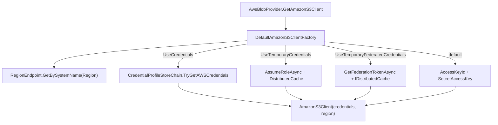

The AWS provider stores blobs in Amazon S3 (or any S3-compatible bucket) via the official `AWSSDK.S3` client. It is shipped by `Volo.Abp.BlobStoring.Aws` and, beyond the usual access-key path, also supports profile-based credentials, STS temporary credentials, and federated tokens — all cached in `IDistributedCache` and decrypted on each use. Application code never sees any of this; it injects `IBlobContainer<TContainer>` exactly as for the [Azure](/blobs/azure-provider) or [File system](/blobs/file-system-provider) providers.

This page walks the package: `AbpBlobStoringAwsModule`, the `AwsBlobProvider` implementation against `AmazonS3Client`, the `AwsBlobContainerConfigurationExtensions.UseAws(...)` extension, the `AwsBlobProviderConfiguration` strongly-typed view with its multiple credentials flags, and the `DefaultAmazonS3ClientFactory` that owns the credential plumbing. The shared abstractions are documented in the [BLOB Storing overview](/blobs/overview).

## Package layout

| File | Type | Role |
| --- | --- | --- |
| `AbpBlobStoringAwsModule.cs` | `AbpModule` | Depends on `AbpBlobStoringModule`. |
| `AwsBlobProvider.cs` | `BlobProviderBase` | Implements `Save/Delete/Exists/GetOrNull` over `AmazonS3Client`. |
| `AwsBlobContainerConfigurationExtensions.cs` | Static class | `UseAws(...)` + `GetAwsConfiguration()`. |
| `AwsBlobProviderConfiguration.cs` | Strongly typed view | All credentials + bucket properties. |
| `AwsBlobProviderConfigurationNames.cs` | Constants | String keys used in the property bag. |
| `IAwsBlobNameCalculator.cs` / `DefaultAwsBlobNameCalculator.cs` | Service | Prefixes `host/` or `tenants/{tenantId}/` to the blob key. |
| `IAmazonS3ClientFactory.cs` / `DefaultAmazonS3ClientFactory.cs` | Service | Builds an `AmazonS3Client` from the configuration, including STS flows. |
| `AwsBlobNamingNormalizer.cs` | `IBlobNamingNormalizer` | Enforces S3 bucket-name rules. |
| `AwsTemporaryCredentialsCacheItem.cs` | DTO | Cache item used for STS / federated credentials. |

## Wiring — `UseAws(...)`

```csharp Volo.Abp.BlobStoring.Aws/AwsBlobContainerConfigurationExtensions.cs
public static class AwsBlobContainerConfigurationExtensions
{
    public static AwsBlobProviderConfiguration GetAwsConfiguration(
        this BlobContainerConfiguration containerConfiguration)
    {
        return new AwsBlobProviderConfiguration(containerConfiguration);
    }

    public static BlobContainerConfiguration UseAws(
        this BlobContainerConfiguration containerConfiguration,
        Action<AwsBlobProviderConfiguration> awsConfigureAction)
    {
        containerConfiguration.ProviderType = typeof(AwsBlobProvider);
        containerConfiguration.NamingNormalizers.TryAdd<AwsBlobNamingNormalizer>();

        awsConfigureAction(new AwsBlobProviderConfiguration(containerConfiguration));

        return containerConfiguration;
    }
}
```

Minimal wiring with static access keys:

```csharp
Configure<AbpBlobStoringOptions>(options =>
{
    options.Containers.ConfigureDefault(container =>
    {
        container.UseAws(aws =>
        {
            aws.AccessKeyId    = configuration["Aws:AccessKeyId"]!;
            aws.SecretAccessKey = configuration["Aws:SecretAccessKey"]!;
            aws.Region         = "eu-central-1";
            aws.ContainerName  = "myapp-default";
            aws.CreateContainerIfNotExists = true;
        });
    });
});
```

## `AwsBlobProviderConfiguration`

The provider stores a long list of property-bag keys:

```csharp Volo.Abp.BlobStoring.Aws/AwsBlobProviderConfigurationNames.cs
public static class AwsBlobProviderConfigurationNames
{
    public const string AccessKeyId = "Aws.AccessKeyId";
    public const string SecretAccessKey = "Aws.SecretAccessKey";
    public const string UseCredentials = "Aws.UseCredentials";
    public const string UseTemporaryCredentials = "Aws.UseTemporaryCredentials";
    public const string UseTemporaryFederatedCredentials = "Aws.UseTemporaryFederatedCredentials";
    public const string ProfileName = "Aws.ProfileName";
    public const string ProfilesLocation = "Aws.ProfilesLocation";
    public const string DurationSeconds = "Aws.DurationSeconds";
    public const string TemporaryCredentialsCacheKey = "Aws.TemporaryCredentialsCacheKey";
    public const string Name = "Aws.Name";
    public const string Policy = "Aws.Policy";
    public const string Region = "Aws.Region";
    public const string ContainerName = "Aws.ContainerName";
    public const string CreateContainerIfNotExists = "Aws.CreateContainerIfNotExists";
}
```

The strongly-typed wrapper surfaces them as properties:

| Property | Default | Effect |
| --- | --- | --- |
| `AccessKeyId` / `SecretAccessKey` | `null` | Static credentials path. Required when no other flag is set. |
| `UseCredentials` | `false` | Use a credential profile resolved by `CredentialProfileStoreChain` (typically `~/.aws/credentials`). |
| `UseTemporaryCredentials` | `false` | Use STS `AssumeRole` to mint short-lived session credentials. |
| `UseTemporaryFederatedCredentials` | `false` | Use STS `GetFederationToken` for federated identities. |
| `ProfileName` / `ProfilesLocation` | `null` | Profile name and override location used when `UseCredentials = true`. |
| `Name` | required for STS/federation | Session / federated user name passed to STS. |
| `Policy` | `null` | Optional inline IAM policy that further restricts the temporary credentials. |
| `DurationSeconds` | `0` | Validity period of STS credentials (minimum 900). |
| `Region` | required | AWS region; resolved via `RegionEndpoint.GetBySystemName`. |
| `ContainerName` | `null` | Overrides the S3 bucket name. Falls back to the ABP container name. |
| `CreateContainerIfNotExists` | `false` | If `true`, `SaveAsync` creates the bucket on demand. |
| `TemporaryCredentialsCacheKey` | random GUID | Cache key used by the factory to memoize STS responses. |

```csharp Volo.Abp.BlobStoring.Aws/AwsBlobProviderConfiguration.cs
public class AwsBlobProviderConfiguration
{
    public string? AccessKeyId { /* … */ }
    public string? SecretAccessKey { /* … */ }
    public bool UseCredentials { /* … */ }
    public bool UseTemporaryCredentials { /* … */ }
    public bool UseTemporaryFederatedCredentials { /* … */ }
    public string? ProfileName { /* … */ }
    public string? ProfilesLocation { /* … */ }
    public int DurationSeconds { /* … */ }
    public string Name { /* … */ }
    public string? Policy { /* … */ }
    public string Region { /* … */ }
    public string? ContainerName { /* … */ }
    public bool CreateContainerIfNotExists { /* … */ }
    public string? TemporaryCredentialsCacheKey { /* … */ }
}
```

## `AwsBlobProvider`

The provider builds an `AmazonS3Client` per request via the factory, runs the standard "already exists?" guard, optionally creates the bucket, then forwards to `PutObjectAsync` / `GetObjectAsync` / `DeleteObjectAsync`:

```csharp Volo.Abp.BlobStoring.Aws/AwsBlobProvider.cs
public class AwsBlobProvider : BlobProviderBase, ITransientDependency
{
    protected IAwsBlobNameCalculator AwsBlobNameCalculator { get; }
    protected IAmazonS3ClientFactory AmazonS3ClientFactory { get; }
    protected IBlobNormalizeNamingService BlobNormalizeNamingService { get; }

    public override async Task SaveAsync(BlobProviderSaveArgs args)
    {
        var blobName     = AwsBlobNameCalculator.Calculate(args);
        var configuration = args.Configuration.GetAwsConfiguration();
        var containerName = GetContainerName(args);

        using (var amazonS3Client = await GetAmazonS3Client(args))
        {
            if (!args.OverrideExisting && await BlobExistsAsync(amazonS3Client, containerName, blobName))
            {
                throw new BlobAlreadyExistsException(
                    $"Saving BLOB '{args.BlobName}' does already exists in the container '{containerName}'!" +
                    $" Set {nameof(args.OverrideExisting)} if it should be overwritten.");
            }

            if (configuration.CreateContainerIfNotExists)
            {
                await CreateContainerIfNotExists(amazonS3Client, containerName);
            }

            await amazonS3Client.PutObjectAsync(new PutObjectRequest
            {
                BucketName  = containerName,
                Key         = blobName,
                InputStream = args.BlobStream
            });
        }
    }
    // …Delete, Exists, GetOrNull
}
```

Bucket existence is checked via the S3 utility helper `AmazonS3Util.DoesS3BucketExistV2Async`; object existence is probed via `GetObjectMetadataAsync` with an exception-converted-to-`false` fallback:

```csharp Volo.Abp.BlobStoring.Aws/AwsBlobProvider.cs
protected virtual async Task<bool> BlobExistsAsync(
    AmazonS3Client amazonS3Client, string containerName, string blobName)
{
    if (!await AmazonS3Util.DoesS3BucketExistV2Async(amazonS3Client, containerName))
    {
        return false;
    }

    try
    {
        await amazonS3Client.GetObjectMetadataAsync(containerName, blobName);
    }
    catch (Exception ex)
    {
        if (ex is AmazonS3Exception) return false;
        throw;
    }

    return true;
}

protected virtual async Task CreateContainerIfNotExists(
    AmazonS3Client amazonS3Client, string containerName)
{
    if (!await AmazonS3Util.DoesS3BucketExistV2Async(amazonS3Client, containerName))
    {
        await amazonS3Client.PutBucketAsync(new PutBucketRequest { BucketName = containerName });
    }
}
```

The read path streams the S3 response body through `TryCopyToMemoryStreamAsync` (inherited from `BlobProviderBase`) so the caller can dispose the result independently from the SDK's lifecycle.

## `DefaultAmazonS3ClientFactory`

The factory picks the appropriate credential flow based on the configuration flags. Each branch ends with `new AmazonS3Client(credentials, region)`:

```csharp Volo.Abp.BlobStoring.Aws/DefaultAmazonS3ClientFactory.cs
public virtual async Task<AmazonS3Client> GetAmazonS3Client(AwsBlobProviderConfiguration configuration)
{
    var region = RegionEndpoint.GetBySystemName(configuration.Region);

    if (configuration.UseCredentials)
    {
        var awsCredentials = GetAwsCredentials(configuration);
        return awsCredentials == null
            ? new AmazonS3Client(region)
            : new AmazonS3Client(awsCredentials, region);
    }

    if (configuration.UseTemporaryCredentials)
    {
        return new AmazonS3Client(await GetTemporaryCredentialsAsync(configuration), region);
    }

    if (configuration.UseTemporaryFederatedCredentials)
    {
        return new AmazonS3Client(await GetTemporaryFederatedCredentialsAsync(configuration), region);
    }

    Check.NotNullOrWhiteSpace(configuration.AccessKeyId, nameof(configuration.AccessKeyId));
    Check.NotNullOrWhiteSpace(configuration.SecretAccessKey, nameof(configuration.SecretAccessKey));

    return new AmazonS3Client(configuration.AccessKeyId, configuration.SecretAccessKey, region);
}
```

For profile-backed credentials it walks the `CredentialProfileStoreChain`:

```csharp Volo.Abp.BlobStoring.Aws/DefaultAmazonS3ClientFactory.cs
protected virtual AWSCredentials? GetAwsCredentials(AwsBlobProviderConfiguration configuration)
{
    if (configuration.ProfileName.IsNullOrWhiteSpace()) return null;

    var chain = new CredentialProfileStoreChain(configuration.ProfilesLocation);

    if (chain.TryGetAWSCredentials(configuration.ProfileName, out var awsCredentials))
    {
        return awsCredentials;
    }

    throw new AmazonS3Exception("Not found aws credentials");
}
```

STS-based flows use the access key + secret to call `AssumeRoleAsync` or `GetFederationTokenAsync` on `AmazonSecurityTokenServiceClient`, encrypt the resulting credentials via `IStringEncryptionService`, and cache the ciphertext in `IDistributedCache<AwsTemporaryCredentialsCacheItem>` keyed by `TemporaryCredentialsCacheKey`. Subsequent calls within the credential's validity window read from the cache and decrypt back to a `SessionAWSCredentials` instance.



<Tip>
STS / federated flows rely on `IDistributedCache` — pair this provider with [StackExchange.Redis caching](/caching/stackexchange-redis) when running multiple instances so that all of them share the same credential cache and refresh window.
</Tip>

## `DefaultAwsBlobNameCalculator`

Like the Azure calculator, the AWS calculator scopes blob keys by tenant id, prefixing them with `host/` or `tenants/{tenantId}/`:

```text
{bucket}/
├── host/{blob}
└── tenants/{tenantId}/{blob}
```

`BlobContainer.GetTenantIdOrNull()` zeroes out the tenant id for non-multi-tenant containers; the calculator therefore always writes under `host/...` for those.

## `AwsBlobNamingNormalizer`

The normalizer mirrors the [Azure](/blobs/azure-provider) one: S3 bucket names must be lowercase, 3-63 characters, contain only letters/digits/dashes, and cannot start or end with a dash. The class enforces all of those rules mechanically; blob keys themselves are passed through unchanged.

## Operational notes

- **Bucket lifecycle** — `CreateContainerIfNotExists = true` falls back to `PutBucketAsync` with no extra options. For region-specific bucket policies, encryption settings, or lifecycle rules, pre-create the buckets via IaC and leave the flag at `false`.
- **Latency** — the provider currently creates a new `AmazonS3Client` per call; for high-throughput endpoints, derive a custom provider that caches the client by `(AccessKeyId, Region)` tuple. The factory itself is `ITransientDependency`.
- **Bucket naming** — when `ContainerName` is left blank, the ABP container name flows through the normalizer and is used as the S3 bucket. Avoid uppercase or underscores in `[BlobContainerName(...)]` to keep this transparent.
- **Multi-tenant overrides** — set `IsMultiTenant = false` on a container configuration when the bucket layout already encodes tenancy (e.g. a per-tenant bucket selected via a custom `IAmazonS3ClientFactory`).

## Cross-references

- [BLOB Storing overview](/blobs/overview) — container resolution and naming normalization.
- [Azure provider](/blobs/azure-provider) — the closest sibling provider, same multi-tenant prefixing strategy.
- [MinIO provider](/blobs/minio-provider) — local S3-compatible target for development.
- [Distributed cache](/caching/distributed-cache) — backs the temporary credentials cache used by `DefaultAmazonS3ClientFactory`.
