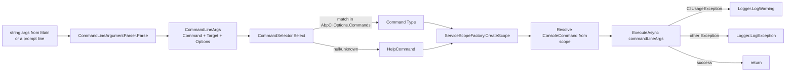

`CliService` does not handle command-line strings itself. It delegates parsing to `ICommandLineArgumentParser`, command resolution to `ICommandSelector`, and execution to whichever `IConsoleCommand` implementation the selector returns. This page walks the pipeline one stage at a time using the real source files, so by the end you should be able to predict the exact `CommandLineArgs` that any input produces and the exact log output for any failure mode.

<Info>
Everything described here lives in `framework/src/Volo.Abp.Cli.Core/Volo/Abp/Cli/Args/` and `framework/src/Volo.Abp.Cli.Core/Volo/Abp/Cli/Commands/`. The parser is `ITransientDependency`, registered automatically by ABP's convention-based registrar.
</Info>

## Pipeline overview



## File inventory

| File | Type | Role |
| --- | --- | --- |
| `Args/ICommandLineArgumentParser.cs` | interface | Two `Parse` overloads — `string[]` and `string`. |
| `Args/CommandLineArgumentParser.cs` | class, `ITransientDependency` | The state machine. Splits args into command/target/options. |
| `Args/CommandLineArgs.cs` | DTO | Immutable record of one parsed invocation. |
| `Args/AbpCommandLineOptions.cs` | `Dictionary<string,string>` | Option bag with a `GetOrNull(name, params altNames)` helper for short/long pairs. |
| `Commands/ICommandSelector.cs` | interface | `Type Select(CommandLineArgs args)`. |
| `Commands/CommandSelector.cs` | class, `ITransientDependency` | Looks up `AbpCliOptions.Commands`; falls back to `HelpCommand`. |
| `Commands/IConsoleCommand.cs` | interface | `ExecuteAsync`, `GetUsageInfo`, `GetShortDescription`. |
| `CliUsageException.cs` | exception | Marker for user-facing errors. |
| `CliService.cs` | service | Wires the three components together. |

## The parser interface

```csharp Volo.Abp.Cli.Core/Volo/Abp/Cli/Args/ICommandLineArgumentParser.cs
public interface ICommandLineArgumentParser
{
    CommandLineArgs Parse(string[] args);

    CommandLineArgs Parse(string lineText);
}
```

The two overloads exist because the CLI accepts input from two sources:

- `Program.Main(string[] args)` — already split by the shell. Calls `Parse(string[])`.
- The `prompt` REPL and the `batch` file runner — raw user lines. Call `Parse(string)`, which tokenises with quote awareness, then delegates to `Parse(string[])`.

## CommandLineArgs

Three fields, all set in the constructor:

```csharp Volo.Abp.Cli.Core/Volo/Abp/Cli/Args/CommandLineArgs.cs
public class CommandLineArgs
{
    [CanBeNull]
    public string Command { get; }

    [CanBeNull]
    public string Target { get; }

    [NotNull]
    public AbpCommandLineOptions Options { get; }

    public CommandLineArgs([CanBeNull] string command = null, [CanBeNull] string target = null)
    {
        Command = command;
        Target = target;
        Options = new AbpCommandLineOptions();
    }

    public static CommandLineArgs Empty()
    {
        return new CommandLineArgs();
    }

    public bool IsCommand(string command)
    {
        return string.Equals(Command, command, StringComparison.OrdinalIgnoreCase);
    }
}
```

| Field | Type | Set when | Example for `abp new Acme.BookStore -u angular --tiered` |
| --- | --- | --- | --- |
| `Command` | `string?` | First positional token. | `"new"` |
| `Target` | `string?` | Second positional token, *only* if it doesn't start with `-`. | `"Acme.BookStore"` |
| `Options` | `AbpCommandLineOptions` | Everything after `Target` (or after `Command` if there is no `Target`). | `{ "u" → "angular", "tiered" → null }` |

`IsCommand(string)` is the case-insensitive verb check that `CliService.RunAsync` uses to special-case `prompt` and `batch`. The `ToString()` override (not shown above) pretty-prints `Command:`, `Target:`, and an `Options:` block — useful when you need to log a parsed args object during debugging.

## AbpCommandLineOptions

A typed dictionary with one helper:

```csharp Volo.Abp.Cli.Core/Volo/Abp/Cli/Args/AbpCommandLineOptions.cs
public class AbpCommandLineOptions : Dictionary<string, string>
{
    [CanBeNull]
    public string GetOrNull([NotNull] string name, params string[] alternativeNames)
    {
        Check.NotNullOrWhiteSpace(name, nameof(name));

        var value = this.GetOrDefault(name);
        if (!value.IsNullOrWhiteSpace())
        {
            return value;
        }

        if (!alternativeNames.IsNullOrEmpty())
        {
            foreach (var alternativeName in alternativeNames)
            {
                value = this.GetOrDefault(alternativeName);
                if (!value.IsNullOrWhiteSpace())
                {
                    return value;
                }
            }
        }

        return null;
    }
}
```

`GetOrNull(name, params alternativeNames)` is *the* idiom for reading short/long pairs. Every command defines `public static class Options { public static class X { public const string Short = "u"; public const string Long = "ui"; } }` and then calls `commandLineArgs.Options.GetOrNull(Options.X.Short, Options.X.Long)`. Order matters: short name first, long name(s) after — first non-blank wins. A bare `--flag` (no value) lives in the dictionary as `flag → null` and is detected with `Options.ContainsKey(Options.X.Long)` instead.

<Tip>
`AbpCommandLineOptions` inherits from `Dictionary<string, string>` and does not normalise keys. Both `-u` and `--ui` write into the dictionary under the *option name without dashes*, but they write under different keys (`"u"` vs `"ui"`). That is why every command lists every alias when calling `GetOrNull`.
</Tip>

## The parser state machine

`CommandLineArgumentParser.Parse(string[] args)` is small enough to walk in one pass:

```csharp Volo.Abp.Cli.Core/Volo/Abp/Cli/Args/CommandLineArgumentParser.cs
public CommandLineArgs Parse(string[] args)
{
    if (args.IsNullOrEmpty())
    {
        return CommandLineArgs.Empty();
    }

    var argumentList = args.ToList();

    //Command

    var command = argumentList[0];
    argumentList.RemoveAt(0);

    if (!argumentList.Any())
    {
        return new CommandLineArgs(command);
    }

    //Target

    var target = argumentList[0];
    if (target.StartsWith("-"))
    {
        target = null;
    }
    else
    {
        argumentList.RemoveAt(0);
    }

    if (!argumentList.Any())
    {
        return new CommandLineArgs(command, target);
    }

    //Options

    var commandLineArgs = new CommandLineArgs(command, target);

    while (argumentList.Any())
    {
        var optionName = ParseOptionName(argumentList[0]);
        argumentList.RemoveAt(0);

        if (!argumentList.Any())
        {
            commandLineArgs.Options[optionName] = null;
            break;
        }

        if (IsOptionName(argumentList[0]))
        {
            commandLineArgs.Options[optionName] = null;
            continue;
        }

        commandLineArgs.Options[optionName] = argumentList[0];
        argumentList.RemoveAt(0);
    }

    return commandLineArgs;
}
```

### Stage 1 — empty input

If no args at all, return `CommandLineArgs.Empty()` — `Command`/`Target` both `null`, empty `Options`. `CommandSelector` will then return `typeof(HelpCommand)`.

### Stage 2 — Command

The first token always becomes `Command`, even if it begins with `-`. There is no validation here, so `abp --help` parses with `Command = "--help"` (which is then unknown and falls back to help). The canonical form is `abp help`.

### Stage 3 — Target

The second token becomes `Target` *only* if it does not start with `-`. If the second token is already an option (`abp new -u angular`), `Target` is `null` and the token is left in the list to be parsed as the first option. This is why `abp new` with no project name reaches `NewCommand.ExecuteAsync` with `Target = null` and a `CliUsageException("Project name is missing! …")` is thrown there.

### Stage 4 — Options loop

For each remaining token:

```csharp Volo.Abp.Cli.Core/Volo/Abp/Cli/Args/CommandLineArgumentParser.cs
private static bool IsOptionName(string argument)
{
    return argument.StartsWith("-") || argument.StartsWith("--");
}

private static string ParseOptionName(string argument)
{
    if (argument.StartsWith("--"))
    {
        if (argument.Length <= 2)
        {
            throw new ArgumentException("Should specify an option name after '--' prefix!");
        }

        return argument.RemovePreFix("--");
    }

    if (argument.StartsWith("-"))
    {
        if (argument.Length <= 1)
        {
            throw new ArgumentException("Should specify an option name after '-' prefix!");
        }

        return argument.RemovePreFix("-");
    }

    throw new ArgumentException("Option names should start with '-' or '--'.");
}
```

The loop's rules:

1. Strip the `-` or `--` prefix from the current token → that's the option name.
2. **No next token** → store the option with value `null`. (Trailing bare flag.)
3. **Next token is also an option** → store the current with value `null`, move on. (Two flags in a row.)
4. **Next token is a value** → consume it as the option's value.

Consequences worth remembering:

- `abp new Acme.X -u angular -d mongodb` ⇒ `Options = { "u": "angular", "d": "mongodb" }`.
- `abp new Acme.X --tiered -u angular` ⇒ `Options = { "tiered": null, "u": "angular" }`.
- `abp new Acme.X -u` (no value at end) ⇒ `Options = { "u": null }` — and `NewCommand` will then ask the UI prompt code for a value (or fall back to template default).
- `abp new Acme.X -- --tiered` ⇒ `ArgumentException` from `ParseOptionName` because `--` alone is rejected.
- The parser is **single-pass**: there is no support for `=` syntax (`--ui=angular` would parse as the *option named* `ui=angular`). Always use space.

### Stage 5 — line tokeniser

When the input is a single string (prompt / batch), `Parse(string)` runs a small tokeniser before delegating:

```csharp Volo.Abp.Cli.Core/Volo/Abp/Cli/Args/CommandLineArgumentParser.cs
private static string[] GetArgsArrayFromLine(string lineText)
{
    var args = new List<string>();
    var currentArgBuilder = new StringBuilder();
    string currentArg = null;
    bool isInQuotes = false;
    for (int i = 0; i < lineText.Length; i++)
    {
        var c = lineText[i];
        if (c == ' ' && !isInQuotes)
        {
            currentArg = currentArgBuilder.ToString();
            if (!currentArg.IsNullOrWhiteSpace())
            {
                args.Add(currentArg);
            }

            currentArgBuilder = new StringBuilder();
        }
        else
        {
            if (c == '\"')
            {
                isInQuotes = !isInQuotes;
            }
            else
            {
                currentArgBuilder.Append(c);
            }
        }
    }

    currentArg = currentArgBuilder.ToString();
    if (!currentArg.IsNullOrWhiteSpace())
    {
        args.Add(currentArg);
    }

    return args.ToArray();
}
```

It splits on spaces but flips an `isInQuotes` flag on each `"`, allowing values like `-cs "Server=…;User Id=…;Password=…"` to survive. Backslashes are not escaped (paths with `\"` inside are not supported); the quote character itself is stripped from the produced token.

## Worked examples

<AccordionGroup>
<Accordion title="abp new Acme.BookStore">
- Step 1: `Command = "new"`, list = `["Acme.BookStore"]`.
- Step 2: `target = "Acme.BookStore"` (does not start with `-`), consumed.
- Step 3: empty list → return `new CommandLineArgs("new", "Acme.BookStore")` with empty `Options`.

`CommandSelector.Select` finds `NewCommand` for `"new"` in `AbpCliOptions.Commands`.
</Accordion>

<Accordion title="abp new Acme.BookStore -u angular --tiered -d mongodb">
- `Command = "new"`, `Target = "Acme.BookStore"`.
- Options loop:
  1. `-u` → `optionName = "u"`. Next is `angular` (not option) → `Options["u"] = "angular"`.
  2. `--tiered` → `optionName = "tiered"`. Next is `-d` (option) → `Options["tiered"] = null`.
  3. `-d` → `optionName = "d"`. Next is `mongodb` → `Options["d"] = "mongodb"`.

Inside `NewCommand.ExecuteAsync`, `commandLineArgs.Options.GetOrNull(Options.UiFramework.Short, Options.UiFramework.Long)` returns `"angular"`, and `commandLineArgs.Options.ContainsKey(Options.Tiered.Long)` is `true`.
</Accordion>

<Accordion title="abp update --npm -sp /repo/src">
- `Command = "update"`, second token `--npm` starts with `-` so `Target = null`.
- Loop:
  1. `--npm` → next is `-sp` (option) → `Options["npm"] = null`.
  2. `-sp` → next is `/repo/src` (not option) → `Options["sp"] = "/repo/src"`.

`UpdateCommand.ExecuteAsync` reads `commandLineArgs.Options.ContainsKey(Options.Packages.Npm)` (true) and `commandLineArgs.Options.GetOrNull(Options.SolutionPath.Short, Options.SolutionPath.Long)` (returns `"/repo/src"`).
</Accordion>

<Accordion title="abp">
- `args.IsNullOrEmpty()` → `CommandLineArgs.Empty()` (`Command = null`).
- `CommandSelector.Select` sees `Command.IsNullOrWhiteSpace()` → returns `typeof(HelpCommand)`.
- `HelpCommand.ExecuteAsync` sees `Target` is also null → prints the full usage block.
</Accordion>
</AccordionGroup>

## CommandSelector

```csharp Volo.Abp.Cli.Core/Volo/Abp/Cli/Commands/CommandSelector.cs
public class CommandSelector : ICommandSelector, ITransientDependency
{
    protected AbpCliOptions Options { get; }

    public CommandSelector(IOptions<AbpCliOptions> options)
    {
        Options = options.Value;
    }

    public Type Select(CommandLineArgs commandLineArgs)
    {
        if (commandLineArgs.Command.IsNullOrWhiteSpace())
        {
            return typeof(HelpCommand);
        }

        return Options.Commands.GetOrDefault(commandLineArgs.Command)
               ?? typeof(HelpCommand);
    }
}
```

| Input | `Command` | Result |
| --- | --- | --- |
| `abp` | `null` | `HelpCommand` |
| `abp help` | `"help"` | `HelpCommand` |
| `abp NEW Foo` | `"NEW"` | `NewCommand` — matched case-insensitively because `AbpCliOptions.Commands` was constructed with `StringComparer.OrdinalIgnoreCase`. |
| `abp doesnotexist` | `"doesnotexist"` | `HelpCommand` (fallback). |

The selector never throws and never logs. The only failure mode is "unknown verb ⇒ silently show help."

## CliService dispatch

`CliService.RunInternalAsync` is the only place that calls `CommandSelector.Select` and turns the returned `Type` into a running command:

```csharp Volo.Abp.Cli.Core/Volo/Abp/Cli/CliService.cs
private async Task RunInternalAsync(CommandLineArgs commandLineArgs)
{
    var commandType = CommandSelector.Select(commandLineArgs);

    using (var scope = ServiceScopeFactory.CreateScope())
    {
        var command = (IConsoleCommand)scope.ServiceProvider.GetRequiredService(commandType);
        await command.ExecuteAsync(commandLineArgs);
    }
}
```

Two things to internalise:

1. **A fresh `IServiceScope` per command.** The CLI is normally a one-shot process where this doesn't matter, but under `prompt` and `batch` it does — each command invocation gets its own `HttpClient`/`DbContext`/`UnitOfWork` lifetimes. Property-injected dependencies in transient commands (like `Logger`) are repopulated for every run.
2. **`GetRequiredService(commandType)` works because the type is `ITransientDependency`.** Every command class in `Commands/*.cs` declares `: IConsoleCommand, ITransientDependency`, so ABP's convention scan registers it under its own type. The selector returns a `Type`, not a service interface, so resolution is `provider.GetRequiredService(theType)`.

## Exception model

`CliService.RunAsync` wraps every command in this `try/catch`:

```csharp Volo.Abp.Cli.Core/Volo/Abp/Cli/CliService.cs
try
{
    if (commandLineArgs.IsCommand("prompt"))
    {
        await RunPromptAsync();
    }
    else if (commandLineArgs.IsCommand("batch"))
    {
        await RunBatchAsync(commandLineArgs);
    }
    else
    {
        await RunInternalAsync(commandLineArgs);
    }
}
catch (CliUsageException usageException)
{
    Logger.LogWarning(usageException.Message);
}
catch (Exception ex)
{
    Logger.LogException(ex);
}
```

`CliUsageException` is the marker for "the user did something wrong":

```csharp Volo.Abp.Cli.Core/Volo/Abp/Cli/CliUsageException.cs
public class CliUsageException : Exception
{
    public CliUsageException(string message)
        : base(message)
    {
    }

    public CliUsageException(string message, Exception innerException)
        : base(message, innerException)
    {
    }
}
```

| Failure | What the user sees |
| --- | --- |
| `CliUsageException` (e.g. `NewCommand` thrown when project name is missing) | A `LogWarning` printing just `.Message`. No stack trace. Messages typically embed the command's `GetUsageInfo()`. |
| Any other `Exception` | `Logger.LogException(ex)` — the extension at `Volo.Abp.Core/Microsoft/Extensions/Logging/AbpLoggerExtensions.cs` writes the message, stack, and recursively the message of `InnerException`. |
| Parser `ArgumentException` (e.g. `--` with no name) | Falls through the `Exception` branch since it is not a `CliUsageException`. |

<Warning>
A `CliUsageException` thrown *inside* `RunPromptAsync` is caught locally too — the prompt has its own `try/catch` so a bad command does not exit the REPL. `RunBatchAsync` has no inner handler, so a thrown command aborts the rest of the batch via the outer `RunAsync` handler.
</Warning>

## Implementing a command

Putting the contract from [the overview](/cli/overview) together with what you have read here, a minimal command looks like:

```csharp Example only — not from the source tree
public class HelloCommand : IConsoleCommand, ITransientDependency
{
    public const string Name = "hello";

    public ILogger<HelloCommand> Logger { get; set; } = NullLogger<HelloCommand>.Instance;

    public Task ExecuteAsync(CommandLineArgs commandLineArgs)
    {
        var name = commandLineArgs.Options.GetOrNull("n", "name");
        if (string.IsNullOrWhiteSpace(name))
        {
            throw new CliUsageException(
                "Missing --name." + Environment.NewLine + Environment.NewLine + GetUsageInfo());
        }

        Logger.LogInformation($"Hello, {name}!");
        return Task.CompletedTask;
    }

    public string GetUsageInfo()  => "Usage: abp hello -n <name>";
    public string GetShortDescription() => "Print a greeting.";
}
```

Register it in your own module:

```csharp Example only
Configure<AbpCliOptions>(o => o.Commands[HelloCommand.Name] = typeof(HelloCommand));
```

Drop the module into the `abp` tool's plug-in path and `abp hello -n World` will route through every stage you just read about: parser → `Command="hello"`, `Options["n"] = "World"` → `CommandSelector` finds `HelloCommand` → resolved in a scope → logs `Hello, World!`.

## See also

<CardGroup cols={2}>
<Card title="CLI Overview" icon="house" href="/cli/overview">
Boot pipeline, module structure, full command inventory.
</Card>
<Card title="Help and version" icon="circle-question" href="/cli/help-and-version">
`HelpCommand.GetUsageInfo` rendering and the `abp cli` self-update path.
</Card>
<Card title="New and Update" icon="wand-magic-sparkles" href="/cli/new-and-update">
Real-world option parsing — `NewCommand`'s 20+ option pairs and `UpdateCommand`'s mutually exclusive `--npm`/`--nuget`.
</Card>
<Card title="Project building and templates" icon="folder-tree" href="/cli/project-building-and-templates">
What `NewCommand.ExecuteAsync` calls once it has parsed args.
</Card>
<Card title="Identity module" icon="user-shield" href="/modules/identity">
The module added by `abp add-module Volo.Abp.Identity`.
</Card>
</CardGroup>
