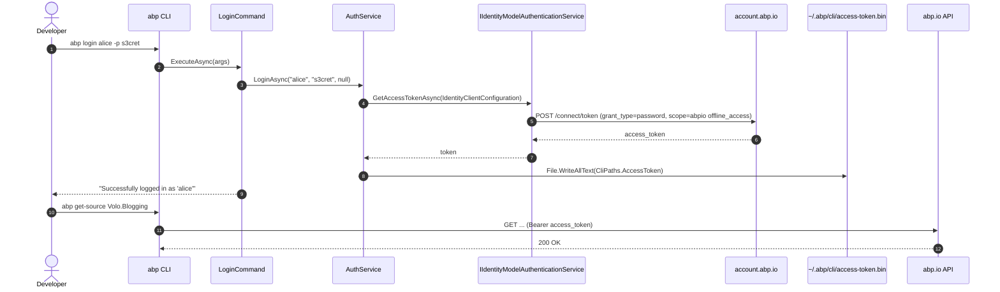
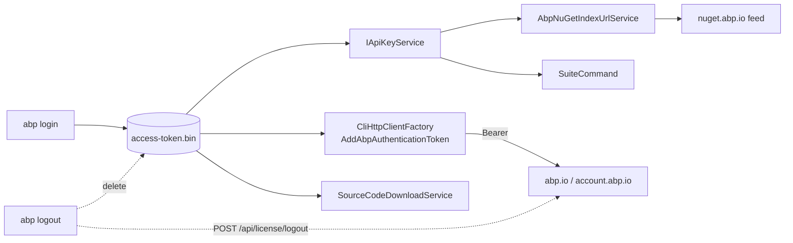

The ABP CLI talks to commercial endpoints on [abp.io](https://abp.io/) to download templates, request a developer NuGet API key, fetch source code, and run ABP Suite. Those endpoints require an OpenID Connect bearer token, so the CLI ships three small commands — `abp login`, `abp logout`, `abp login-info` — that wrap a single `AuthService`. The service uses the framework's `IIdentityModelAuthenticationService` to negotiate either a resource-owner password flow or a device-code flow, persists the resulting access token to a file under `~/.abp/cli/`, and attaches it as a bearer token to every outgoing CLI HTTP request via [`CliHttpClientFactory`](/cli/cli-shared-module). This page walks through each command, the service, the file layout, and the supporting licensing services.

## File inventory

All authentication-related types live in `framework/src/Volo.Abp.Cli.Core/` and share the `Volo.Abp.Cli.Auth` and `Volo.Abp.Cli.Commands` namespaces.

| File | Type | Role |
| --- | --- | --- |
| `Volo/Abp/Cli/Auth/IAuthService.cs` | Interface | Public contract for login / logout / info |
| `Volo/Abp/Cli/Auth/AuthService.cs` | `ITransientDependency` | Concrete implementation, used directly by the commands |
| `Volo/Abp/Cli/Auth/LoginInfo.cs` | DTO | Result of `GET api/license/login-info` |
| `Volo/Abp/Cli/Commands/LoginCommand.cs` | `IConsoleCommand` | `abp login <username>` |
| `Volo/Abp/Cli/Commands/LogoutCommand.cs` | `IConsoleCommand` | `abp logout` |
| `Volo/Abp/Cli/Commands/LoginInfoCommand.cs` | `IConsoleCommand` | `abp login-info` |
| `Volo/Abp/Cli/CliPaths.cs` | Static | Where `access-token.bin` and the license file live on disk |
| `Volo/Abp/Cli/CliUrls.cs` | Static | `account.abp.io`, `abp.io`, NuGet root |
| `Volo/Abp/Cli/CliConsts.cs` | Static | `LogoutUrl`, `HttpClientName`, memory keys |
| `Volo/Abp/Cli/Http/CliHttpClientFactory.cs` | `ISingletonDependency` | Builds `HttpClient` instances with the bearer token attached |
| `Volo/Abp/Cli/Http/CliHttpClientExtensions.cs` | Static | `AddAbpAuthenticationToken()` and retry helpers |
| `Volo/Abp/Cli/Licensing/IApiKeyService.cs` | Interface | Fetches the developer's NuGet API key |
| `Volo/Abp/Cli/Licensing/AbpIoApiKeyService.cs` | `ITransientDependency` | Hits `api/license/api-key`, requires a login |
| `Volo/Abp/Cli/Licensing/DeveloperApiKeyResult.cs` | DTO | API-key payload + license error type |
| `Volo/Abp/Cli/Licensing/LicenseType.cs` | Enum | `Personal`, `Team`, `Business`, `Enterprise`, … |

<Note>
  All three commands are also registered in `AbpCliCoreModule.ConfigureServices` so they are reachable via `abp login`, `abp logout`, `abp login-info` through the [`CommandSelector`](/cli/cli-shared-module#commandselector).
</Note>

## End-to-end auth flow

The interactive `abp login <username> -p <password>` path is a single OIDC password-grant request; `abp login --device` swaps that for the device-code flow so two-factor accounts can sign in via a browser. Everything else (NuGet downloads, source-code retrieval, Suite installation) reads back the same bearer token at request time.



## IAuthService

The interface is intentionally small — four methods, all async — and is consumed both by the user-facing commands and by services like `AbpIoApiKeyService`, `SuiteCommand`, `PackageVersionCheckerService`, and `SourceCodeDownloadService`.

```csharp title="framework/src/Volo.Abp.Cli.Core/Volo/Abp/Cli/Auth/IAuthService.cs"
public interface IAuthService
{
    Task<LoginInfo> GetLoginInfoAsync();

    Task LoginAsync(string userName, string password, string organizationName = null);

    Task LogoutAsync();

    Task<bool> CheckMultipleOrganizationsAsync(string username);
}
```

The implementation `AuthService` adds two more public members that are not on the interface but are widely used by callers:

| Member | Purpose |
| --- | --- |
| `Task DeviceLoginAsync()` | OIDC device-code flow, triggered by `abp login --device` |
| `static bool IsLoggedIn()` | File-existence check on `CliPaths.AccessToken`; used everywhere |

`AuthService` is registered as `ITransientDependency` and resolves through DI into every CLI command and HTTP-related helper.

### Dependencies

```csharp title="framework/src/Volo.Abp.Cli.Core/Volo/Abp/Cli/Auth/AuthService.cs"
public AuthService(
    IIdentityModelAuthenticationService authenticationService,
    ILogger<AuthService> logger,
    ICancellationTokenProvider cancellationTokenProvider,
    CliHttpClientFactory cliHttpClientFactory,
    RemoteServiceExceptionHandler remoteServiceExceptionHandler,
    IJsonSerializer jsonSerializer
)
```

- `IIdentityModelAuthenticationService` is supplied by `AbpIdentityModelModule` and abstracts the OIDC token request.
- `CliHttpClientFactory` is reused for both the `login-info` GET and the server-side logout call.
- `RemoteServiceExceptionHandler` turns ABP `RemoteServiceErrorResponse` payloads into descriptive `AbpRemoteCallException`s.

## LoginCommand

`Volo/Abp/Cli/Commands/LoginCommand.cs` is the entry point. It has two distinct code paths based on whether the caller passed `--device`.

### Interactive password flow

```csharp title="framework/src/Volo.Abp.Cli.Core/Volo/Abp/Cli/Commands/LoginCommand.cs"
if (!commandLineArgs.Options.ContainsKey("device"))
{
    if (commandLineArgs.Target.IsNullOrEmpty())
    {
        throw new CliUsageException(
            "Username name is missing!" + ... + GetUsageInfo()
        );
    }

    var organization = commandLineArgs.Options.GetOrNull(
        Options.Organization.Short, Options.Organization.Long);

    if (await HasMultipleOrganizationAndThisNotSpecified(commandLineArgs, organization))
    {
        return;
    }

    var password = commandLineArgs.Options.GetOrNull(
        Options.Password.Short, Options.Password.Long);
    if (password == null)
    {
        Console.Write("Password: ");
        password = ConsoleHelper.ReadSecret();
        ...
    }

    try
    {
        await AuthService.LoginAsync(commandLineArgs.Target, password, organization);
    }
    catch (Exception ex)
    {
        LogCliError(ex, commandLineArgs);
        return;
    }

    Logger.LogInformation($"Successfully logged in as '{commandLineArgs.Target}'");
}
```

A few subtleties to notice when reading the source:

- The password is read with `ConsoleHelper.ReadSecret()` — a manual key-by-key reader that suppresses echo. It lives in `Volo/Abp/Cli/Utils/ConsoleHelper.cs`.
- If the username belongs to multiple organizations, `AuthService.CheckMultipleOrganizationsAsync` returns `true` and the command prints an error pointing at `--organization`. It calls `GET api/license/check-multiple-organizations?username=…`.
- Server-side errors flow through `LogCliError`, which special-cases `"Invalid username or password"`, the `RequiresTwoFactor` flag (suggests `--device`), and any HTML error page rendered by the identity server (`<h2 class="text-danger…">`).

### Device-code flow

```csharp title="framework/src/Volo.Abp.Cli.Core/Volo/Abp/Cli/Commands/LoginCommand.cs"
else
{
    try
    {
        await AuthService.DeviceLoginAsync();
    }
    catch (Exception ex)
    {
        LogCliError(ex, commandLineArgs);
        return;
    }

    var loginInfo = await AuthService.GetLoginInfoAsync();
    Logger.LogInformation($"Successfully logged in as '{loginInfo.Username}'");
}
```

The device path is the supported way to sign in when the account has two-factor authentication enabled. The identity model service handles polling the `/connect/deviceauthorization` endpoint and opening a browser — `AuthService.DeviceLoginAsync` only wires up the `IdentityClientConfiguration`:

```csharp title="framework/src/Volo.Abp.Cli.Core/Volo/Abp/Cli/Auth/AuthService.cs"
public async Task DeviceLoginAsync()
{
    var configuration = new IdentityClientConfiguration(
        CliUrls.AccountAbpIo,
        "abpio offline_access",
        "abp-cli",
        null,
        OidcConstants.GrantTypes.DeviceCode
    );

    var accessToken = await AuthenticationService.GetAccessTokenAsync(configuration);

    File.WriteAllText(CliPaths.AccessToken, accessToken, Encoding.UTF8);
}
```

### Options

`LoginCommand.Options` is a tiny nested type that codifies the supported switches:

| Short | Long | Required | Meaning |
| --- | --- | --- | --- |
| `-o` | `--organization` | When the account belongs to multiple orgs | Sent as `[o]abp-organization-name` claim during the password grant |
| `-p` | `--password` | No (prompted when missing) | Resource-owner password |
| n/a | `--device` | n/a | Switches to the device-code flow |

The `[o]` prefix is the ABP convention for forwarding an extra claim through `IdentityClientConfiguration` to the token request. You can grep for `"[o]abp-organization-name"` in `AuthService.cs` to confirm.

<Card title="abp login usage" icon="terminal" href="/cli/overview">
```
abp login <username>
abp login <username> -p <password>
abp login <username> --device
abp login alice -o acme
```
The same usage string is returned from `LoginCommand.GetUsageInfo()` and shown by `abp help login`.
</Card>

## Resource-owner password under the hood

```csharp title="framework/src/Volo.Abp.Cli.Core/Volo/Abp/Cli/Auth/AuthService.cs"
public async Task LoginAsync(string userName, string password, string organizationName = null)
{
    var configuration = new IdentityClientConfiguration(
        CliUrls.AccountAbpIo,
        "abpio offline_access",
        "abp-cli",
        null,
        OidcConstants.GrantTypes.Password,
        userName,
        password
    );

    if (!organizationName.IsNullOrWhiteSpace())
    {
        configuration["[o]abp-organization-name"] = organizationName;
    }

    var accessToken = await AuthenticationService.GetAccessTokenAsync(configuration);

    File.WriteAllText(CliPaths.AccessToken, accessToken, Encoding.UTF8);
}
```

Key constants used here:

- **Authority** — `CliUrls.AccountAbpIo` = `https://account.abp.io/`.
- **Scope** — `"abpio offline_access"`. The `offline_access` scope keeps the refresh token alive server-side but the CLI itself does not persist the refresh token; it only stores the access token.
- **Client ID** — `"abp-cli"`. Configured server-side as a public client allowed to use password and device grants.
- **Client secret** — `null`.

## LogoutCommand and server-side revocation

`Volo/Abp/Cli/Commands/LogoutCommand.cs` is a thin wrapper:

```csharp title="framework/src/Volo.Abp.Cli.Core/Volo/Abp/Cli/Commands/LogoutCommand.cs"
public class LogoutCommand : IConsoleCommand, ITransientDependency
{
    public const string Name = "logout";

    public Task ExecuteAsync(CommandLineArgs commandLineArgs)
    {
        return AuthService.LogoutAsync();
    }

    public string GetShortDescription()
    {
        return "Sign out from " + CliUrls.AccountAbpIo + ".";
    }
}
```

The real work happens in `AuthService.LogoutAsync()`:

```csharp title="framework/src/Volo.Abp.Cli.Core/Volo/Abp/Cli/Auth/AuthService.cs"
public async Task LogoutAsync()
{
    string accessToken = null;
    if (File.Exists(CliPaths.AccessToken))
    {
        accessToken = File.ReadAllText(CliPaths.AccessToken);
        File.Delete(CliPaths.AccessToken);
    }

    if (File.Exists(CliPaths.Lic))
    {
        if (!string.IsNullOrWhiteSpace(accessToken))
        {
            await LogoutAsync(accessToken);
        }

        File.Delete(CliPaths.Lic);
    }
}
```

The local token file is deleted unconditionally. If a cached license file (`CliPaths.Lic`, see below) exists, the CLI also POSTs `{ token: "<jwt>" }` to `CliConsts.LogoutUrl` = `https://abp.io/api/license/logout` to revoke the session on the server. Errors during that call are logged as warnings, never thrown — local logout always succeeds.

## LoginInfoCommand

```csharp title="framework/src/Volo.Abp.Cli.Core/Volo/Abp/Cli/Commands/LoginInfoCommand.cs"
public async Task ExecuteAsync(CommandLineArgs commandLineArgs)
{
    if (!AuthService.IsLoggedIn())
    {
        Logger.LogError("You are not logged in.");
        return;
    }

    var loginInfo = await AuthService.GetLoginInfoAsync();

    if (loginInfo == null)
    {
        Logger.LogError("Unable to get login info.");
        return;
    }

    var sb = new StringBuilder();
    sb.AppendLine("");
    sb.AppendLine("Login info:");
    sb.AppendLine($"Name: {loginInfo.Name}");
    sb.AppendLine($"Surname: {loginInfo.Surname}");
    sb.AppendLine($"Username: {loginInfo.Username}");
    sb.AppendLine($"Email Address: {loginInfo.EmailAddress}");
    sb.AppendLine($"Organization: {loginInfo.Organization}");
    Logger.LogInformation(sb.ToString());
}
```

`AuthService.GetLoginInfoAsync()` calls `GET https://abp.io/api/license/login-info` and deserializes the body into the `LoginInfo` DTO:

```csharp title="framework/src/Volo.Abp.Cli.Core/Volo/Abp/Cli/Auth/LoginInfo.cs"
public class LoginInfo
{
    public Guid? Id { get; set; }
    public string Name { get; set; }
    public string Surname { get; set; }
    public string Username { get; set; }
    public string EmailAddress { get; set; }
    public string Organization { get; set; }
    public bool HasSourceCodeAccess { get; set; }
}
```

`HasSourceCodeAccess` is consulted by `SourceCodeDownloadService` (see [Project building & templates](/cli/project-building-and-templates)) to decide whether a `get-source` request is allowed.

## Access-token storage

The CLI deliberately uses plain files in the user profile rather than the OS keychain. All paths are surfaced through `CliPaths`:

```csharp title="framework/src/Volo.Abp.Cli.Core/Volo/Abp/Cli/CliPaths.cs"
public static class CliPaths
{
    public static string TemplateCache => Path.Combine(AbpRootPath, "templates");
    public static string Log         => Path.Combine(AbpRootPath, "cli", "logs");
    public static string Root        => Path.Combine(AbpRootPath, "cli");
    public static string AccessToken => Path.Combine(AbpRootPath, "cli", "access-token.bin");
    public static string ComputerId  => Path.Combine(AbpRootPath, "cli", "computer-id.bin");
    public static string Memory      => Path.Combine(
        Path.GetDirectoryName(System.Reflection.Assembly.GetExecutingAssembly().Location)!,
        "memory.bin");
    public static string Build       => Path.Combine(AbpRootPath, "build");

    public static string Lic => Path.Combine(
        Path.GetTempPath(),
        Encoding.ASCII.GetString(new byte[]
        {
            65, 98, 112, 76, 105, 99, 101, 110, 115, 101, 46, 98, 105, 110
        }));

    public static readonly string AbpRootPath = Path.Combine(
        Environment.GetFolderPath(Environment.SpecialFolder.UserProfile), ".abp");
}
```

| Path | What it contains |
| --- | --- |
| `~/.abp/cli/access-token.bin` | Raw OIDC access token (UTF-8). Presence of this file is the CLI's "logged in" signal. |
| `~/.abp/cli/computer-id.bin` | Per-machine identifier used by license-related calls. |
| `~/.abp/cli/logs/` | Log directory. |
| `~/.abp/templates/` | Cached template zips; cleared by `abp clear-download-cache`. |
| `~/.abp/build/` | Build status store for `abp build`. |
| `<TempPath>/AbpLicense.bin` | Encoded as a byte array to discourage casual searches; cached commercial license file. |
| `<assembly-dir>/memory.bin` | Key/value memory store used by `MemoryService` (e.g. last CLI-version check timestamp). |

<Warning>
  The access-token file is **not** encrypted. Treat it like any other dotfile credential: do not check `~/.abp/cli/` into source control and do not copy it across machines. `abp logout` deletes both this file and the cached license file.
</Warning>

## Attaching the token to outgoing requests

Every CLI HTTP call goes through `CliHttpClientFactory`. When `needsAuthentication` is `true` (the default), the factory calls the extension below, which writes the bearer header if a token file exists.

```csharp title="framework/src/Volo.Abp.Cli.Core/Volo/Abp/Cli/Http/CliHttpClientExtensions.cs"
public static void AddAbpAuthenticationToken(this HttpClient httpClient)
{
    if (!AuthService.IsLoggedIn())
    {
        return;
    }

    var accessToken = File.ReadAllText(CliPaths.AccessToken, Encoding.UTF8);
    if (!accessToken.IsNullOrEmpty())
    {
        httpClient.SetBearerToken(accessToken);
    }
}
```

`SetBearerToken` is an `IdentityModel` helper that sets `Authorization: Bearer …`. The same factory exposes a retry helper (`GetHttpResponseMessageWithRetryAsync<T>`) built on Polly that retries transient failures with a 2 s / 4 s / 7 s back-off — this is why login probes are resilient to short blips.

## Licensing services that depend on a logged-in CLI

A successful login unlocks two follow-on lookups that other commands rely on. Both are in `Volo/Abp/Cli/Licensing/`.

### IApiKeyService

```csharp title="framework/src/Volo.Abp.Cli.Core/Volo/Abp/Cli/Licensing/IApiKeyService.cs"
public interface IApiKeyService
{
    Task<DeveloperApiKeyResult> GetApiKeyOrNullAsync(bool invalidateCache = false);
}
```

`AbpIoApiKeyService` is the only implementation. It calls `GET https://abp.io/api/license/api-key`, caches the result in memory for the lifetime of the CLI process, and returns `null` when the user is not logged in — callers like `AbpNuGetIndexUrlService` interpret that as "show a warning and skip".

```csharp title="framework/src/Volo.Abp.Cli.Core/Volo/Abp/Cli/Licensing/AbpIoApiKeyService.cs"
if (!AuthService.IsLoggedIn())
{
    return null;
}

if (_apiKeyResult != null)
{
    return _apiKeyResult;
}

var url = $"{CliUrls.WwwAbpIo}api/license/api-key";
var client = _cliHttpClientFactory.CreateClient();
```

### DeveloperApiKeyResult and license errors

```csharp title="framework/src/Volo.Abp.Cli.Core/Volo/Abp/Cli/Licensing/DeveloperApiKeyResult.cs"
public class DeveloperApiKeyResult
{
    public bool HasActiveLicense { get; set; }
    public string OrganizationName { get; set; }
    public string ApiKey { get; set; }
    public DateTime? LicenseEndTime { get; set; }
    public bool CanDownloadSourceCode { get; set; }
    public string LicenseCode { get; set; }
    public string ErrorMessage { get; set; }
    public LicenseErrorType? ErrorType { get; set; }
    public LicenseType LicenseType { get; set; }
    public bool IsTrialLicense { get; set; }

    public enum LicenseErrorType
    {
        NotAuthenticated = 1,
        NotMemberOfAnOrganization = 2,
        NoActiveLicense = 3,
        NotDeveloperOfTheOrganization = 4
    }
}
```

`LicenseType` carries the SKU tier:

```csharp title="framework/src/Volo.Abp.Cli.Core/Volo/Abp/Cli/Licensing/LicenseType.cs"
public enum LicenseType : byte
{
    Personal = 1,
    Team = 2,
    Business = 3,
    Enterprise = 4,
    Personal_Discounted = 5,
    Team_Discounted = 6,
    Business_Discounted = 7,
    Enterprise_Discounted = 8,
}
```

### AbpNuGetIndexUrlService

`Commands/Services/AbpNuGetIndexUrlService.cs` consumes the API key and exposes a single async helper that returns the user's private NuGet feed URL:

```csharp title="framework/src/Volo.Abp.Cli.Core/Volo/Abp/Cli/Commands/Services/AbpNuGetIndexUrlService.cs"
public async Task<string> GetAsync()
{
    var apiKeyResult = await _apiKeyService.GetApiKeyOrNullAsync();

    if (apiKeyResult == null)
    {
        Logger.LogWarning("You are not signed in! Use the CLI command \"abp login <username>\" to sign in, then try again.");
        return null;
    }

    if (!string.IsNullOrWhiteSpace(apiKeyResult.ErrorMessage))
    {
        Logger.LogWarning(apiKeyResult.ErrorMessage);
        return null;
    }

    if (string.IsNullOrEmpty(apiKeyResult.ApiKey))
    {
        Logger.LogError(
            "Couldn't retrieve your NuGet API key! You can re-sign in with the CLI command \"abp login <username>\".");
        return null;
    }
    ...
}
```

The resulting URL (`CliUrls.GetNuGetServiceIndexUrl(apiKey)`) is then used by `CliCommand`, `SuiteCommand`, and `PackageVersionCheckerService` to query commercial NuGet packages.

## How other commands consume auth state

Many CLI commands shortcut into the auth subsystem in two ways:

| Command | Auth dependency |
| --- | --- |
| `abp get-source` | Requires a logged-in user with `HasSourceCodeAccess`; resolved via `SourceCodeDownloadService` + `IApiKeyService`. |
| `abp suite` | `SuiteCommand` calls `_authService.GetLoginInfoAsync()` and throws `CliUsageException("Please login with your account.")` if no organization is returned. |
| `abp new`, `abp update` | Pull commercial templates and packages through the API-key-aware NuGet feed when the user is logged in; otherwise fall back to public sources. |
| `PackageVersionCheckerService` | Calls `IApiKeyService` when checking commercial versions of `Volo.Abp.Suite` / LeptonX. |



## Server-side endpoints in one place

| URL constant | Definition | Used by |
| --- | --- | --- |
| `CliUrls.WwwAbpIo` | `https://abp.io/` | License & template APIs |
| `CliUrls.AccountAbpIo` | `https://account.abp.io/` | OIDC authority for login |
| `CliUrls.NuGetRootPath` | `https://nuget.abp.io/` | Private commercial NuGet feed |
| `CliConsts.LogoutUrl` | `${WwwAbpIo}api/license/logout` | `AuthService.LogoutAsync` |
| `${WwwAbpIo}api/license/login-info` | (inline in `AuthService`) | `GetLoginInfoAsync` |
| `${WwwAbpIo}api/license/check-multiple-organizations?username=…` | (inline in `AuthService`) | `CheckMultipleOrganizationsAsync` |
| `${WwwAbpIo}api/license/api-key` | (inline in `AbpIoApiKeyService`) | NuGet API key lookup |
| `CliUrls.GetNuGetServiceIndexUrl(apiKey)` | `${NuGetRootPath}{apiKey}/v3/index.json` | NuGet client setup |

`CliUrls` also exposes `WwwAbpIoDevelopment` / `AccountAbpIoDevelopment` / `NuGetRootPathDevelopment` constants pointing at `https://localhost:443xx/` — those are used during ABP team development and are not toggled by configuration; switching requires editing `CliUrls.cs`.

## Common failure modes and how the CLI signals them

The error branches in `LoginCommand.LogCliError` map server responses to actionable messages:

| Server signal | CLI message |
| --- | --- |
| Identity server returns "Invalid username or password" | `Invalid username or password!` |
| Identity server requires 2FA (`RequiresTwoFactor` in body) | `Two factor authentication is enabled for your account. Please use \`abp login --device\` command to login.` |
| Identity server returns an HTML error page with `class="text-danger"` | The `<h2>` content (HTML-decoded) is shown directly. |
| Anything else | Raw exception message. |

```csharp title="framework/src/Volo.Abp.Cli.Core/Volo/Abp/Cli/Commands/LoginCommand.cs"
private static bool TryGetErrorMessageFromHtmlPage(string htmlPage, out string errorMessage)
{
    if (!htmlPage.Contains("error-page-container"))
    {
        errorMessage = null;
        return false;
    }

    var decodedHtml = HttpUtility.HtmlDecode(htmlPage);

    var error = Regex.Match(decodedHtml,
        @"<h2\ class=""text-danger.*"">(.*?)</h2>",
        RegexOptions.IgnoreCase | RegexOptions.IgnorePatternWhitespace |
        RegexOptions.Singleline  | RegexOptions.Multiline);
    ...
}
```

`AuthService.GetLoginInfoAsync` is also defensive — non-2xx responses are logged and the method returns `null` so callers like `LoginInfoCommand` can render `Unable to get login info.` instead of crashing.

## Related pages

<CardGroup cols={2}>
  <Card title="CLI overview" icon="terminal" href="/cli/overview">
    Program entry point, host configuration, command registration, and how `CliService` dispatches into individual `IConsoleCommand` implementations.
  </Card>
  <Card title="Project building & templates" icon="cube" href="/cli/project-building-and-templates">
    How `abp new`, `abp get-source`, and the source-code download service consume the auth + API-key services described here.
  </Card>
  <Card title="GitHub integration" icon="github" href="/cli/github-integration">
    Companion HTTP client used for release lookups (no auth required).
  </Card>
  <Card title="CLI shared module" icon="cube" href="/cli/cli-shared-module">
    `CliHttpClientFactory`, `CliPaths`, `CliUrls`, `MemoryService`, and the utility helpers reused across all CLI commands.
  </Card>
</CardGroup>
