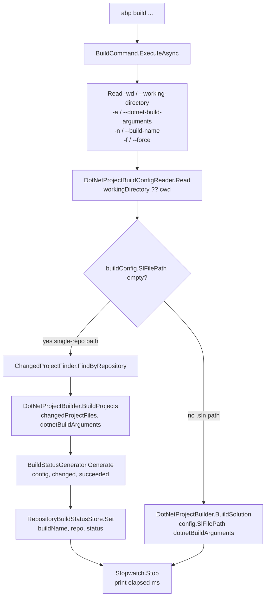
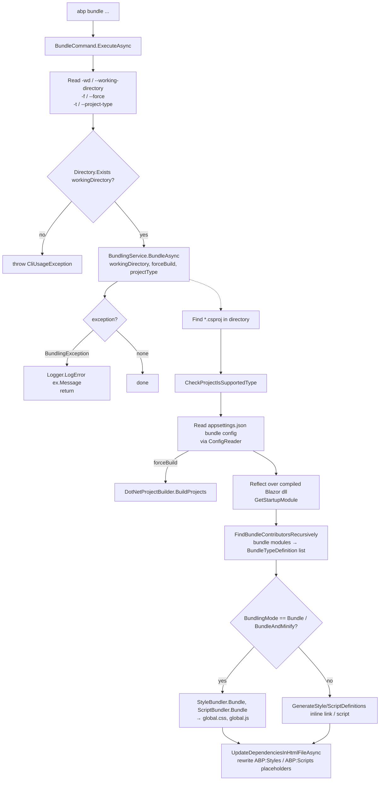

`abp build` and `abp bundle` look like they belong in different worlds — one wraps `dotnet build`, the other rewrites `index.html` — but both are thin `IConsoleCommand` implementations that delegate the work to a richer service layer in `Volo.Abp.Cli.Core`. `BuildCommand` uses `Volo/Abp/Cli/Build/` (project graph, change tracking, repository build status) to drive incremental dotnet builds; `BundleCommand` uses `Volo/Abp/Cli/Bundling/` to invoke `BundlingService.BundleAsync`, which reflects over the compiled Blazor assembly to collect module-defined script and style contributors and stitches them into the `<!--ABP:Styles-->`/`<!--ABP:Scripts-->` placeholders. This page walks both top-to-bottom.

<Info>
Source: `framework/src/Volo.Abp.Cli.Core/Volo/Abp/Cli/Commands/BuildCommand.cs`, `BundleCommand.cs`, plus `Volo/Abp/Cli/Build/*.cs` and `Volo/Abp/Cli/Bundling/*.cs`. There is no `BundleCommandHelper.cs` in the tree — the heavy lifting lives in `BundlingService`.
</Info>

## File inventory

### build/

| File | Type | Role |
| --- | --- | --- |
| `Commands/BuildCommand.cs` | `IConsoleCommand`, transient | `abp build` verb. Parses options, calls services, prints elapsed time. |
| `Build/IDotNetProjectBuildConfigReader.cs` + `FileSystemDotNetProjectBuildConfigReader.cs` | reader | Reads `abp-build-config.json` next to a repo's root and produces a `DotNetProjectBuildConfig`. |
| `Build/DotNetProjectBuildConfig.cs` | DTO | Carries the build name, target sln file (optional), force flag, and the resolved `GitRepository`. |
| `Build/IChangedProjectFinder.cs` + `DefaultChangedProjectFinder.cs` | service | Compares the current repo state to the persisted `GitRepositoryBuildStatus` and returns the `*.csproj` files that need rebuilding. |
| `Build/IDotNetProjectBuilder.cs` + `DefaultDotNetProjectBuilder.cs` | service | Wraps `dotnet build`. Two methods: `BuildProjects(List<DotNetProjectInfo>, string)` and `BuildSolution(string, string)`. |
| `Build/IDotNetProjectDependencyFiller.cs` + `DotNetProjectDependencyFiller.cs` | service | Resolves project-to-project references. |
| `Build/IBuildStatusGenerator.cs` + `DefaultBuildStatusGenerator.cs` | service | Computes a `GitRepositoryBuildStatus` snapshot — which projects built, which failed. |
| `Build/IRepositoryBuildStatusStore.cs` + `FileSystemRepositoryBuildStatusStore.cs` | persistence | Persists the build status under the user profile so the next `abp build` is incremental. |
| `Build/IBuildProjectListSorter.cs` + `DefaultBuildProjectListSorter.cs` | service | Sorts changed projects in dependency order. |
| `Build/GitRepositoryHelper.cs`, `GitRepository.cs`, `GitRepositoryBuildStatus.cs` | helpers | Repo metadata used by the other services. |
| `Build/DotNetProjectInfo.cs`, `DotNetProjectInfoExtensions.cs`, `DotNetProjectInfoEqualityComparer.cs` | DTOs | Project entries used throughout the build subsystem. |

### bundling/

| File | Type | Role |
| --- | --- | --- |
| `Commands/BundleCommand.cs` | `IConsoleCommand`, transient | `abp bundle` verb. Parses options, calls `IBundlingService.BundleAsync`, traps `BundlingException`. |
| `Bundling/IBundlingService.cs` + `BundlingService.cs` | service | The bundler. Reads the csproj, optionally rebuilds it, reflects over the resulting Blazor assembly to collect `IBundleContributor` modules, generates style/script definitions, rewrites `index.html`. |
| `Bundling/BundlingConsts.cs` | constants | Placeholder markers (`<!--ABP:Styles-->` / `<!--/ABP:Styles-->`, scripts equivalents) and project type ids (`webassembly`, `maui-blazor`). |
| `Bundling/BundleConfig.cs`, `BundleOptions.cs`, `BundleTypeDefinition.cs` | DTOs | Read configuration and per-bundle parameters. |
| `Bundling/BundlerBase.cs`, `Scripts/ScriptBundler.cs`, `Styles/StyleBundler.cs` | bundlers | Concatenate + minify the contributor files into a single `global.css` / `global.js`. |
| `Bundling/Styles/CssRelativePathAdjuster.cs` | helper | Rewrites `url(...)` paths so relative URLs survive bundling. |
| `Bundling/BundlingException.cs` | exception | Domain-specific error caught by `BundleCommand.ExecuteAsync` and logged as an error (not rethrown). |
| `Bundling/BundlingMode.cs` | enum | `None`, `Bundle`, `BundleAndMinify`. |
| `Bundling/PathHelper.cs` | helper | Computes `wwwroot/index.html` and the compiled assembly path per project type. |

## abp build — pipeline overview



## BuildCommand declaration

```csharp Volo.Abp.Cli.Core/Volo/Abp/Cli/Commands/BuildCommand.cs
public class BuildCommand : IConsoleCommand, ITransientDependency
{
    public const string Name = "build";

    public IDotNetProjectDependencyFiller DotNetProjectDependencyFiller { get; set; }

    public IChangedProjectFinder ChangedProjectFinder { get; set; }

    public IDotNetProjectBuilder DotNetProjectBuilder { get; set; }

    public IRepositoryBuildStatusStore RepositoryBuildStatusStore { get; set; }

    public IDotNetProjectBuildConfigReader DotNetProjectBuildConfigReader { get; set; }

    public IBuildStatusGenerator BuildStatusGenerator { get; set; }

    public IBuildProjectListSorter BuildProjectListSorter { get; set; }
```

All seven collaborators are public, settable, and **property-injected** rather than constructor-injected. ABP's Autofac module fills them after construction. This is the same pattern `BundleCommand` uses for `Logger` / `BundlingService`, and it keeps the otherwise gigantic constructor list out of the source.

## BuildCommand.ExecuteAsync — two paths

```csharp Volo.Abp.Cli.Core/Volo/Abp/Cli/Commands/BuildCommand.cs
public Task ExecuteAsync(CommandLineArgs commandLineArgs)
{
    var sw = new Stopwatch();
    sw.Start();

    var workingDirectory = commandLineArgs.Options.GetOrNull(
        Options.WorkingDirectory.Short,
        Options.WorkingDirectory.Long
    );

    var dotnetBuildArguments = commandLineArgs.Options.GetOrNull(
        Options.DotnetBuildArguments.Short,
        Options.DotnetBuildArguments.Long
    );

    var buildName = commandLineArgs.Options.GetOrNull(
        Options.BuildName.Short,
        Options.BuildName.Long
    );

    var forceBuild = commandLineArgs.Options.ContainsKey(Options.ForceBuild.Short) ||
                     commandLineArgs.Options.ContainsKey(Options.ForceBuild.Long);

    var buildConfig = DotNetProjectBuildConfigReader.Read(workingDirectory ?? Directory.GetCurrentDirectory());
    buildConfig.BuildName = buildName;
    buildConfig.ForceBuild = forceBuild;

    if (string.IsNullOrEmpty(buildConfig.SlFilePath))
    {
        var changedProjectFiles = ChangedProjectFinder.FindByRepository(buildConfig);

        var buildSucceededProjects = DotNetProjectBuilder.BuildProjects(
            changedProjectFiles,
            dotnetBuildArguments ?? ""
        );

        var buildStatus = BuildStatusGenerator.Generate(
            buildConfig,
            changedProjectFiles,
            buildSucceededProjects
        );

        RepositoryBuildStatusStore.Set(buildName, buildConfig.GitRepository, buildStatus);
    }
    else
    {
        DotNetProjectBuilder.BuildSolution(
            buildConfig.SlFilePath,
            dotnetBuildArguments ?? ""
        );
    }

    sw.Stop();
    Console.WriteLine("Build operation is completed in " + sw.ElapsedMilliseconds + " (ms)");

    return Task.CompletedTask;
}
```

| Branch | Trigger | What runs |
| --- | --- | --- |
| **Repository / incremental** | `buildConfig.SlFilePath` is empty (no `.sln` path in the config) | `ChangedProjectFinder.FindByRepository` walks git status + the last `GitRepositoryBuildStatus` and returns the `*.csproj` files that need rebuilding. `BuildProjects` runs `dotnet build` on each in order. `BuildStatusGenerator.Generate` produces the next status. `RepositoryBuildStatusStore.Set` persists it for the next `abp build`. |
| **Solution / full** | `buildConfig.SlFilePath` is set | `BuildSolution(slnPath, args)` runs `dotnet build <sln> /graphBuild <args>` and throws on non-zero exit. No status is recorded. |

The repository branch is what makes `abp build` worth using over plain `dotnet build` — when you're working in a multi-repo ABP source tree the incremental path skips projects whose timestamps haven't moved since the last successful build name.

## BuildCommand options

```csharp Volo.Abp.Cli.Core/Volo/Abp/Cli/Commands/BuildCommand.cs
public static class Options
{
    public static class WorkingDirectory
    {
        public const string Short = "wd";
        public const string Long = "working-directory";
    }

    public static class DotnetBuildArguments
    {
        public const string Short = "a";
        public const string Long = "dotnet-build-arguments";
    }

    public static class BuildName
    {
        public const string Short = "n";
        public const string Long = "build-name";
    }

    public static class ForceBuild
    {
        public const string Short = "f";
        public const string Long = "force";
    }
}
```

| Long | Short | Effect |
| --- | --- | --- |
| `--working-directory` | `-wd` | Override the directory passed to `DotNetProjectBuildConfigReader.Read`. Defaults to `Directory.GetCurrentDirectory()`. |
| `--dotnet-build-arguments` | `-a` | Verbatim suffix appended after `dotnet build <target>`. Quote the whole string in the shell. |
| `--build-name` | `-n` | Logical name used as the `RepositoryBuildStatusStore` key. Different names produce independent incremental caches — useful for `Debug` vs `Release` matrices. |
| `--force` | `-f` | Skip the incremental check; treat every project as changed. |

Notice that the help text shown by `GetUsageInfo` also advertises `-m|--max-parallel-builds` — but the `Options` static class does not define `MaxParallelBuilds`. The flag is documented but the current `BuildCommand.ExecuteAsync` does not read it, so passing it has no effect today.

## DotNetProjectBuilder — the dotnet shell-out

`DefaultDotNetProjectBuilder.BuildSolution` and `BuildProjects` are the only places `dotnet build` is actually invoked:

```csharp Volo.Abp.Cli.Core/Volo/Abp/Cli/Build/DefaultDotNetProjectBuilder.cs
public void BuildSolution(string slnPath, string arguments)
{
    var buildArguments = "/graphBuild " + arguments.TrimStart('"').TrimEnd('"');
    Console.WriteLine("Executing...: dotnet build " + slnPath + " " + buildArguments);

    var output = CmdHelper.RunCmdAndGetOutput(
        "dotnet build " + slnPath + " " + buildArguments,
        out int buildStatus
    );

    if (buildStatus == 0)
    {
        WriteOutput(output, ConsoleColor.Green);
    }
    else
    {
        WriteOutput(output, ConsoleColor.Red);
        throw new Exception("Build failed!");
    }
}
```

Two behaviours worth noting:

1. **`/graphBuild` is forced** on the solution path. This is MSBuild's project-graph build engine — required for correct ordering when multiple projects reference each other.
2. **Exit code 0 ⇒ green output; otherwise red output and `throw new Exception("Build failed!")`.** That generic exception propagates up to `CliService.RunAsync` and is logged via `Logger.LogException(ex)` — the stack trace will not include `dotnet`'s own error text, but the full stdout was already printed in red above.

`BuildProjects` iterates `List<DotNetProjectInfo>` in order (no parallelism — the `m|max-parallel-builds` flag is not wired), prints `Building....: (i/N) <csproj>`, calls `BuildInternal`, and stores succeeded paths in a `ConcurrentBag<string>` that `BuildStatusGenerator.Generate` reads back.

## BuildCommand.GetUsageInfo

```csharp Volo.Abp.Cli.Core/Volo/Abp/Cli/Commands/BuildCommand.cs
public string GetUsageInfo()
{
    var sb = new StringBuilder();

    sb.AppendLine("");
    sb.AppendLine("Usage:");
    sb.AppendLine("");
    sb.AppendLine("  abp build [options]");
    sb.AppendLine("");
    sb.AppendLine("Options:");
    sb.AppendLine("");
    sb.AppendLine("-wd|--working-directory <directory-path>                (default: empty)");
    sb.AppendLine("-m |--max-parallel-builds <parallel-build-count>        (default: 1)");
    sb.AppendLine("-a |--dotnet-build-arguments <arguments>                (default: empty)");
    sb.AppendLine("-n |--build-name <name>                                 (default: empty)");
    sb.AppendLine("-f | --force                                            (default: false)");
    sb.AppendLine("");
    sb.AppendLine("See the documentation for more info: https://docs.abp.io/en/abp/latest/CLI");

    return sb.ToString();
}

public string GetShortDescription()
{
    return "Builds a dotnet repository and dependent repositories or a solution.";
}
```

## abp bundle — pipeline overview



## BundleCommand declaration

```csharp Volo.Abp.Cli.Core/Volo/Abp/Cli/Commands/BundleCommand.cs
public class BundleCommand : IConsoleCommand, ITransientDependency
{
    public const string Name = "bundle";

    public ILogger<BundleCommand> Logger { get; set; }

    public IBundlingService BundlingService { get; set; }
```

Two property-injected dependencies. `BundleCommand` does not constructor-inject anything because the heavy logic lives in `BundlingService`.

## BundleCommand.ExecuteAsync

```csharp Volo.Abp.Cli.Core/Volo/Abp/Cli/Commands/BundleCommand.cs
public async Task ExecuteAsync(CommandLineArgs commandLineArgs)
{
    var workingDirectoryArg = commandLineArgs.Options.GetOrNull(
        Options.WorkingDirectory.Short,
        Options.WorkingDirectory.Long
    );

    var workingDirectory = workingDirectoryArg ?? Directory.GetCurrentDirectory();

    var forceBuild = commandLineArgs.Options.ContainsKey(Options.ForceBuild.Short) ||
                     commandLineArgs.Options.ContainsKey(Options.ForceBuild.Long);

    var projectType = GetProjectType(commandLineArgs);

    if (!Directory.Exists(workingDirectory))
    {
        throw new CliUsageException(
            "Specified directory does not exist." +
            Environment.NewLine + Environment.NewLine +
            GetUsageInfo()
        );
    }

    try
    {
        await BundlingService.BundleAsync(workingDirectory, forceBuild, projectType);
    }
    catch (BundlingException ex)
    {
        Logger.LogError(ex.Message);
    }
}
```

| Step | Notes |
| --- | --- |
| Resolve `workingDirectory` | `-wd`/`--working-directory`, defaults to the current directory. |
| Resolve `forceBuild` | `-f`/`--force`; when true `BundlingService` runs `dotnet build` on the project before reflection so the bundler always reads a fresh assembly. |
| Resolve `projectType` | `-t`/`--project-type`; see `GetProjectType` below. |
| Directory existence check | Throws `CliUsageException` (caught by `CliService` and logged as warning). |
| `BundlingService.BundleAsync` | Wrapped in a `try/catch (BundlingException)` — domain errors are logged as `LogError`, not rethrown, so the CLI returns success even when the bundle failed. Non-`BundlingException` exceptions propagate to `CliService`. |

### Project type mapping

```csharp Volo.Abp.Cli.Core/Volo/Abp/Cli/Commands/BundleCommand.cs
private string GetProjectType(CommandLineArgs commandLineArgs)
{
    var projectType = commandLineArgs.Options.GetOrNull(Options.ProjectType.Short, Options.ProjectType.Long);
    projectType ??= BundlingConsts.WebAssembly;

    return projectType.ToLower() switch {
        "webassembly" => BundlingConsts.WebAssembly,
        "maui-blazor" => BundlingConsts.MauiBlazor,
        _ => throw new CliUsageException(ExceptionMessageHelper.GetInvalidOptionExceptionMessage("Project Type"))
    };
}
```

The two accepted values are the literal constants from `BundlingConsts`:

```csharp Volo.Abp.Cli.Core/Volo/Abp/Cli/Bundling/BundlingConsts.cs
internal const string WebAssembly = "webassembly";
internal const string MauiBlazor = "maui-blazor";
```

Anything else throws `CliUsageException` — including, importantly, `MauiBlazor` on OSX (rejected later by `BundlingService.BundleAsync` with a warning rather than an exception).

## BundleCommand options

```csharp Volo.Abp.Cli.Core/Volo/Abp/Cli/Commands/BundleCommand.cs
public static class Options
{
    public static class WorkingDirectory
    {
        public const string Short = "wd";
        public const string Long = "working-directory";
    }

    public static class ProjectType
    {
        public const string Short = "t";
        public const string Long = "project-type";
    }

    public static class ForceBuild
    {
        public const string Short = "f";
        public const string Long = "force";
    }
}
```

## BundleCommand.GetUsageInfo

```csharp Volo.Abp.Cli.Core/Volo/Abp/Cli/Commands/BundleCommand.cs
public string GetShortDescription()
{
    return "Bundles all third party styles and scripts required by modules and updates index.html file.";
}

public string GetUsageInfo()
{
    var sb = new StringBuilder();

    sb.AppendLine("");
    sb.AppendLine("Usage:");
    sb.AppendLine("");
    sb.AppendLine("  abp bundle [options]");
    sb.AppendLine("");
    sb.AppendLine("Options:");
    sb.AppendLine("");
    sb.AppendLine("-wd|--working-directory <directory-path>                (default: empty)");
    sb.AppendLine("-f | --force                                            (default: false)");
    sb.AppendLine("-t | --project-type                                     (default: webassembly)");
    sb.AppendLine("");
    sb.AppendLine("See the documentation for more info: https://docs.abp.io/en/abp/latest/CLI");

    return sb.ToString();
}
```

## BundlingService.BundleAsync

The service does more than the command file suggests. The top of the method does the OS check and the project file discovery:

```csharp Volo.Abp.Cli.Core/Volo/Abp/Cli/Bundling/BundlingService.cs
public async Task BundleAsync(string directory, bool forceBuild, string projectType = BundlingConsts.WebAssembly)
{
    if(RuntimeInformation.IsOSPlatform(OSPlatform.OSX) && projectType == BundlingConsts.MauiBlazor)
    {
        Logger.LogWarning("ABP bundle command does not support OSX for MAUI Blazor");
        return;
    }

    var projectFiles = Directory.GetFiles(directory, "*.csproj");
    if (!projectFiles.Any())
    {
        throw new BundlingException(
            "No project file found in the directory. The working directory must have a Blazor project file.");
    }

    var projectFilePath = projectFiles[0];

    CheckProjectIsSupportedType(projectFilePath, projectType);

    var config = projectType == BundlingConsts.WebAssembly? ConfigReader.Read(PathHelper.GetWwwRootPath(directory)): ConfigReader.Read(directory);
    var bundleConfig = config.Bundle;
```

| Failure | What happens |
| --- | --- |
| OSX + MAUI Blazor | `LogWarning` and early return — no exception. |
| No `*.csproj` in directory | `throw new BundlingException` — caught by `BundleCommand` and turned into a `LogError`. |
| Unsupported project SDK | `CheckProjectIsSupportedType` throws `BundlingException` — same handling. |

After config load, the service optionally rebuilds, then locates the produced Blazor assembly via `PathHelper.GetWebAssemblyFilePath` / `GetMauiBlazorAssemblyFilePath`:

```csharp Volo.Abp.Cli.Core/Volo/Abp/Cli/Bundling/BundlingService.cs
    if (forceBuild)
    {
        var projects = new List<DotNetProjectInfo>()
            {
                new DotNetProjectInfo(string.Empty, projectFilePath, true)
            };

        DotNetProjectBuilder.BuildProjects(projects, string.Empty);
    }

    var frameworkVersion = GetTargetFrameworkVersion(projectFilePath, projectType);
    var projectName = Path.GetFileNameWithoutExtension(projectFilePath);
    var assemblyFilePath = projectType == BundlingConsts.WebAssembly? PathHelper.GetWebAssemblyFilePath(directory, frameworkVersion, projectName) : PathHelper.GetMauiBlazorAssemblyFilePath(directory, projectName);
    var startupModule = GetStartupModule(assemblyFilePath);

    var bundleDefinitions = new List<BundleTypeDefinition>();
    FindBundleContributorsRecursively(startupModule, 0, bundleDefinitions);
    bundleDefinitions = bundleDefinitions.OrderByDescending(t => t.Level).ToList();
```

Notice that `BundlingService` reuses the same `IDotNetProjectBuilder` that `BuildCommand` uses — that's how the two verbs share a single shell-out implementation. `GetStartupModule` reflects over the compiled Blazor `.dll`, finds the `AbpModule` decorated with `[DependsOn]`, and `FindBundleContributorsRecursively` walks the dependency tree collecting any module that registers an `IBundleContributor`. The list is then sorted by `Level` descending so leaf modules contribute last (and therefore override).

### Two output modes

```csharp Volo.Abp.Cli.Core/Volo/Abp/Cli/Bundling/BundlingService.cs
    if (bundleConfig.Mode is BundlingMode.Bundle || bundleConfig.Mode is BundlingMode.BundleAndMinify)
    {
        var options = new BundleOptions
        {
            Directory = directory,
            FrameworkVersion = frameworkVersion,
            ProjectFileName = projectName,
            BundleName = bundleConfig.Name.IsNullOrEmpty() ? "global" : bundleConfig.Name,
            Minify = bundleConfig.Mode == BundlingMode.BundleAndMinify,
            ProjectType = projectType
        };

        Logger.LogInformation("Generating style bundle...");
        styleDefinitions = StyleBundler.Bundle(options, styleContext);
        Logger.LogInformation($"Style bundle has been generated successfully.");

        Logger.LogInformation("Generating script bundle...");
        scriptDefinitions = ScriptBundler.Bundle(options, scriptContext);
        Logger.LogInformation($"Script bundle has been generated successfully.");
    }
    else
    {
        Logger.LogInformation("Generating style references...");
        styleDefinitions = GenerateStyleDefinitions(styleContext);
        Logger.LogInformation("Generating script references...");
        scriptDefinitions = GenerateScriptDefinitions(scriptContext);
    }

    await UpdateDependenciesInHtmlFileAsync(directory, styleDefinitions, scriptDefinitions);
    Logger.LogInformation("Script and style references in the index.html file have been updated.");
```

| `BundleConfig.Mode` | Behaviour |
| --- | --- |
| `BundleAndMinify` (default) | `StyleBundler.Bundle` concatenates contributor files into `wwwroot/_content/.../{bundleName}.css`, minified via `ICssMinifier`. Same for JS via `IJavascriptMinifier`. The placeholder is filled with one `<link>` and one `<script>` tag. |
| `Bundle` | Same as above without minification. |
| `None` (`else` branch) | `GenerateStyleDefinitions` / `GenerateScriptDefinitions` emit one `<link>` / `<script>` per contributor file. No concatenation, no `global.css`. Useful for debugging. |

### index.html placeholder rewrite

The last step finds the `wwwroot/index.html` file and rewrites the regions delimited by the constants from `BundlingConsts`:

```csharp Volo.Abp.Cli.Core/Volo/Abp/Cli/Bundling/BundlingConsts.cs
internal const string StylePlaceholderStart = "<!--ABP:Styles-->";
internal const string StylePlaceholderEnd = "<!--/ABP:Styles-->";
internal const string ScriptPlaceholderStart = "<!--ABP:Scripts-->";
internal const string ScriptPlaceholderEnd = "<!--/ABP:Scripts-->";
```

```csharp Volo.Abp.Cli.Core/Volo/Abp/Cli/Bundling/BundlingService.cs
private async Task UpdateDependenciesInHtmlFileAsync(string directory, string styleDefinitions,
    string scriptDefinitions)
{
    var htmlFilePath = Path.Combine(PathHelper.GetWwwRootPath(directory), "index.html");
    if (!File.Exists(htmlFilePath))
    {
        throw new BundlingException($"index.html file could not be found in the following path:{htmlFilePath}");
    }

    Encoding fileEncoding;
    string content;
    using (var reader = new StreamReader(htmlFilePath, true))
    {
        fileEncoding = reader.CurrentEncoding;
        content = await reader.ReadToEndAsync();
    }

    content = UpdatePlaceholders(content, BundlingConsts.StylePlaceholderStart,
        BundlingConsts.StylePlaceholderEnd, styleDefinitions);
    content = UpdatePlaceholders(content, BundlingConsts.ScriptPlaceholderStart,
        BundlingConsts.ScriptPlaceholderEnd, scriptDefinitions);

    using (var writer = new StreamWriter(htmlFilePath, false, fileEncoding))
    {
        await writer.WriteAsync(content);
        await writer.FlushAsync();
    }
}
```

<Warning>
The placeholders must already exist in your `index.html`. `UpdatePlaceholders` does not insert them — it does an `IndexOf` and a `Remove` between them, so a missing placeholder throws an `ArgumentOutOfRangeException` from `string.Remove`. The startup templates ship with the four `<!--ABP:…-->` markers in the right places.
</Warning>

The file encoding detected by `StreamReader` is preserved on write so a UTF-8 BOM file stays UTF-8 BOM after the rewrite.

## Bundling exception model

```csharp Volo.Abp.Cli.Core/Volo/Abp/Cli/Bundling/BundlingException.cs
public class BundlingException : Exception
{
    // ... message/innerException constructors ...
}
```

Three handlers cooperate:

| Layer | Catches | Outcome |
| --- | --- | --- |
| `BundlingService.BundleAsync` | Throws `BundlingException` on missing project file, unsupported SDK type, missing `index.html`. | Propagates. |
| `BundleCommand.ExecuteAsync` | `catch (BundlingException ex)` ⇒ `Logger.LogError(ex.Message)`. | CLI exits 0. The bundling failure is reported but not treated as a fatal program error. |
| `CliService.RunAsync` | Catches anything other than `CliUsageException` ⇒ `Logger.LogException(ex)`. | Used for non-bundling exceptions raised inside the bundler (e.g. assembly-load failures). |

## Worked examples

<AccordionGroup>
<Accordion title="abp build in a single repo">
- `workingDirectory = null` ⇒ defaults to `cwd`.
- `DotNetProjectBuildConfigReader.Read(cwd)` returns a config with an empty `SlFilePath` (no `MyApp.sln` declared in `abp-build-config.json`).
- Branch: repository.
- `ChangedProjectFinder.FindByRepository` returns five changed csproj files.
- `BuildProjects` loops them; output is printed in green if all succeed.
- `BuildStatusGenerator.Generate` records the five successful project paths.
- `RepositoryBuildStatusStore.Set(null, repo, status)` persists state under the user profile.

Next time you run `abp build` in the same repo with no further git changes, `ChangedProjectFinder` returns an empty list and the only output is `Build operation is completed in N (ms)`.
</Accordion>

<Accordion title="abp build -wd /work/my-sln -a -c Release">
- `workingDirectory = /work/my-sln`.
- `dotnetBuildArguments = "-c Release"`.
- `buildConfig.SlFilePath` is `/work/my-sln/My.sln` (declared in `abp-build-config.json`).
- Branch: solution.
- `DotNetProjectBuilder.BuildSolution("/work/my-sln/My.sln", "-c Release")` shells out to `dotnet build /work/my-sln/My.sln /graphBuild -c Release`.
- Exit code 0 ⇒ green output and elapsed-ms line. Non-zero ⇒ red output and a thrown `Exception("Build failed!")` that `CliService` logs.
</Accordion>

<Accordion title="abp bundle -f in a Blazor WASM client folder">
- `workingDirectory` defaults to `cwd` (must contain `*.csproj`).
- `forceBuild = true`, `projectType = "webassembly"`.
- Directory exists ⇒ `BundlingService.BundleAsync(cwd, true, "webassembly")`.
- Service finds the csproj, forces a `dotnet build`, reflects over the resulting assembly, finds every module's `IBundleContributor`, bundles styles + scripts (mode defaults to `BundleAndMinify`), and rewrites `wwwroot/index.html`.
- On success: three `LogInformation` lines and a final "Script and style references in the index.html file have been updated."
</Accordion>

<Accordion title="abp bundle -t maui-blazor on macOS">
- `GetProjectType` accepts `maui-blazor` and returns `BundlingConsts.MauiBlazor`.
- `BundlingService.BundleAsync` immediately logs "ABP bundle command does not support OSX for MAUI Blazor" and returns. No file changes, no exception.
</Accordion>

<Accordion title="abp bundle -t windows-only-thingy">
- `GetProjectType` falls into the default `_` arm of the `switch` and throws `CliUsageException(ExceptionMessageHelper.GetInvalidOptionExceptionMessage("Project Type"))`.
- `CliService.RunAsync` catches the `CliUsageException` and logs the message as a warning.
</Accordion>
</AccordionGroup>

## Related pages

<CardGroup cols={2}>
<Card title="CLI Overview" icon="house" href="/cli/overview">
Where `build` and `bundle` sit in the full command inventory.
</Card>
<Card title="Args & Pipeline" icon="terminal" href="/cli/argument-parsing-and-pipeline">
The parser rules that turn `-wd /repo -a "-c Release"` into `CommandLineArgs`.
</Card>
<Card title="Help & Version" icon="circle-question" href="/cli/help-and-version">
How `BuildCommand.GetUsageInfo` and `BundleCommand.GetUsageInfo` are rendered.
</Card>
<Card title="New and Update" icon="wand-magic-sparkles" href="/cli/new-and-update">
`NewCommand` calls `BundlingService.BundleAsync` indirectly via `RunBundleInternalAsync` after creating a Blazor template.
</Card>
<Card title="Project building and templates" icon="folder-tree" href="/cli/project-building-and-templates">
`TemplateProjectBuilder` and the `ProjectBuilding/` pipeline that produced the csproj `abp build` is now compiling.
</Card>
<Card title="Identity module" icon="user-shield" href="/modules/identity">
A typical contributor of bundle content — the Identity module's styles end up in `global.css` via its `IBundleContributor`.
</Card>
</CardGroup>
