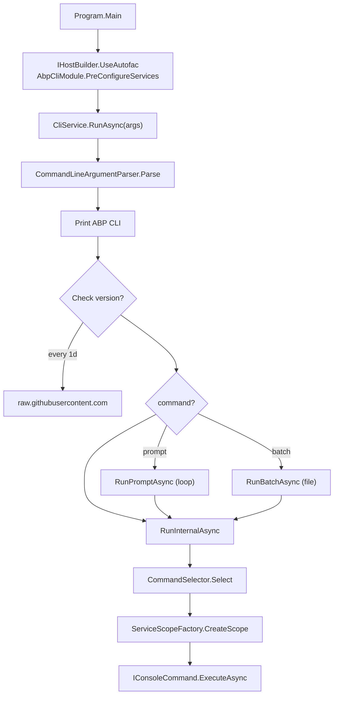
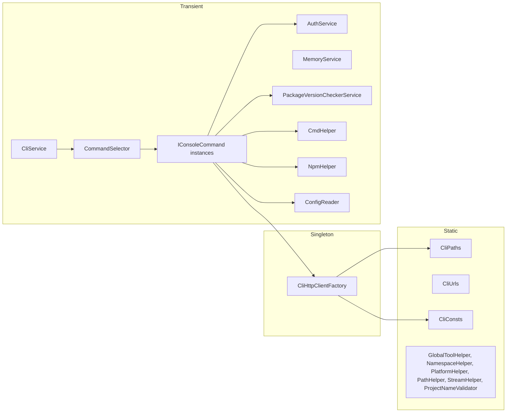

`Volo.Abp.Cli.Core` is the assembly that actually does the work behind the `abp` executable. The thin `Volo.Abp.Cli` project contains nothing but `Program.cs` and the application module that depends on Core; every command, every helper, and every configuration object lives in this assembly. This page is the engineering reference for the **shared** parts — the bits that every command relies on, including the bootstrap module (`AbpCliCoreModule`), the dispatcher (`CliService` + `CommandSelector`), the argument parser, process/HTTP/NPM helpers, the path layout under `~/.abp/`, and the day-rate-limited `MemoryService`. There is no separate `JsonHelper`, `FileWrapper`, or `ResourceWriter` in the CLI — JSON is handled by `IJsonSerializer` from `Volo.Abp.Json`, files use `System.IO` directly, and resource writing for `install-libs` lives inside `InstallLibsService`. This page documents what is actually present.

## Assembly layout

```text
framework/src/Volo.Abp.Cli.Core/Volo/Abp/Cli/
├── AbpCliCoreModule.cs        — Module: HttpClients + command registrations
├── AbpCliOptions.cs           — Options bag (commands map, ToolName, …)
├── CliConsts.cs               — Stable string constants
├── CliPaths.cs                — `~/.abp/cli/access-token.bin` and friends
├── CliService.cs              — Entry-point loop
├── CliUrls.cs                 — abp.io / account.abp.io / nuget.abp.io
├── CliUsageException.cs       — Thrown to surface usage text to the user
├── Args/                      — Command-line tokenization
├── Auth/                      — IAuthService, AuthService, LoginInfo
├── Build/                     — Incremental dotnet build
├── Bundling/                  — `abp bundle`
├── Commands/                  — IConsoleCommand implementations
├── Commands/Services/         — Cross-cutting helpers (NuGet URL, EF tool, …)
├── Commands/Templates/        — TemplateInfo DTO
├── Configuration/             — `appsettings.json` AbpCli reader
├── GitHub/                    — GithubRelease DTO (see GitHub integration page)
├── Http/                      — CliHttpClientFactory, retry helpers
├── LIbs/                      — install-libs implementation
├── Licensing/                 — API-key / license enums
├── Memory/                    — File-backed key/value memory
├── ProjectBuilding/           — Template + module builder pipeline
├── ProjectModification/       — solution / package modifiers
├── ServiceProxying/           — generate-proxy / remove-proxy
├── Utils/                     — CmdHelper, NpmHelper, etc.
└── Version/                   — PackageVersionCheckerService, LatestVersionInfo
```

## The module: AbpCliCoreModule

`AbpCliCoreModule` is the only `AbpModule` in this assembly. It declares dependencies, registers two named `HttpClient`s, and configures the command/proxy options.

```csharp title="framework/src/Volo.Abp.Cli.Core/Volo/Abp/Cli/AbpCliCoreModule.cs"
[DependsOn(
    typeof(AbpDddDomainModule),
    typeof(AbpJsonModule),
    typeof(AbpIdentityModelModule),
    typeof(AbpMinifyModule),
    typeof(AbpHttpModule)
)]
public class AbpCliCoreModule : AbpModule
{
    public override void ConfigureServices(ServiceConfigurationContext context)
    {
        context.Services.AddHttpClient(CliConsts.HttpClientName)
            .ConfigurePrimaryHttpMessageHandler(() => new CliHttpClientHandler());

        context.Services.AddHttpClient(CliConsts.GithubHttpClientName, client =>
        {
            client.DefaultRequestHeaders.UserAgent.ParseAdd("MyAgent/1.0");
        });

        Encoding.RegisterProvider(CodePagesEncodingProvider.Instance);

        Configure<AbpCliOptions>(options =>
        {
            options.Commands[HelpCommand.Name] = typeof(HelpCommand);
            options.Commands[PromptCommand.Name] = typeof(PromptCommand);
            options.Commands[NewCommand.Name] = typeof(NewCommand);
            // … one line per command
        });

        Configure<AbpCliServiceProxyOptions>(options =>
        {
            options.Generators[JavaScriptServiceProxyGenerator.Name] = typeof(JavaScriptServiceProxyGenerator);
            options.Generators[AngularServiceProxyGenerator.Name]    = typeof(AngularServiceProxyGenerator);
            options.Generators[CSharpServiceProxyGenerator.Name]     = typeof(CSharpServiceProxyGenerator);
        });
    }
}
```

Side effects on startup:

| Action | Why |
| --- | --- |
| `AddHttpClient(CliConsts.HttpClientName)` with `CliHttpClientHandler` | Default client for `abp.io` traffic; uses the system proxy + default credentials. |
| `AddHttpClient(CliConsts.GithubHttpClientName)` with `User-Agent: MyAgent/1.0` | GitHub requires a UA. See [GitHub integration](/cli/github-integration). |
| `Encoding.RegisterProvider(CodePagesEncodingProvider.Instance)` | Enables non-UTF code pages (needed when reading legacy resource files). |
| `Configure<AbpCliOptions>(...)` | Builds the command name → type dictionary that `CommandSelector` reads. |
| `Configure<AbpCliServiceProxyOptions>(...)` | Registers proxy generators for `-t ng / js / csharp`. |

### AbpCliOptions

```csharp title="framework/src/Volo.Abp.Cli.Core/Volo/Abp/Cli/AbpCliOptions.cs"
public class AbpCliOptions
{
    public Dictionary<string, Type> Commands { get; }

    public List<string> DisabledModulesToAddToSolution { get; set; }

    /// <summary>Default value: true.</summary>
    public bool CacheTemplates { get; set; } = true;

    /// <summary>Default value: "CLI".</summary>
    public string ToolName { get; set; } = "CLI";

    public bool AlwaysHideExternalCommandOutput { get; set; }

    public AbpCliOptions()
    {
        Commands = new Dictionary<string, Type>(StringComparer.OrdinalIgnoreCase);
        DisabledModulesToAddToSolution = new();
    }
}
```

| Property | Default | What it does |
| --- | --- | --- |
| `Commands` | empty (filled by module) | Case-insensitive map consumed by `CommandSelector` |
| `DisabledModulesToAddToSolution` | empty (module adds `Volo.Abp.LeptonXTheme.Pro`, `…Lite`) | Modules `add-module` will refuse to add |
| `CacheTemplates` | `true` | Whether downloaded templates are cached under `~/.abp/templates/` |
| `ToolName` | `"CLI"` | Branding hook used by log output |
| `AlwaysHideExternalCommandOutput` | `false` | When true, `CmdHelper` hides the child-process window |

## CliService — the dispatcher

`CliService.RunAsync(string[] args)` is the orchestrator: it prints the banner, optionally checks for a new version, dispatches `prompt` / `batch` / regular commands, and translates exceptions to log messages.

```csharp title="framework/src/Volo.Abp.Cli.Core/Volo/Abp/Cli/CliService.cs"
public async Task RunAsync(string[] args)
{
    var currentCliVersion = await GetCurrentCliVersionInternalAsync(typeof(CliService).Assembly);
    Logger.LogInformation($"ABP CLI {currentCliVersion}");

    var commandLineArgs = CommandLineArgumentParser.Parse(args);

#if !DEBUG
    if (!commandLineArgs.Options.ContainsKey("skip-cli-version-check"))
    {
        await CheckCliVersionAsync(currentCliVersion);
    }
#endif

    try
    {
        if (commandLineArgs.IsCommand("prompt"))
        {
            await RunPromptAsync();
        }
        else if (commandLineArgs.IsCommand("batch"))
        {
            await RunBatchAsync(commandLineArgs);
        }
        else
        {
            await RunInternalAsync(commandLineArgs);
        }
    }
    catch (CliUsageException usageException)
    {
        Logger.LogWarning(usageException.Message);
    }
    catch (Exception ex)
    {
        Logger.LogException(ex);
    }
}

private async Task RunInternalAsync(CommandLineArgs commandLineArgs)
{
    var commandType = CommandSelector.Select(commandLineArgs);

    using (var scope = ServiceScopeFactory.CreateScope())
    {
        var command = (IConsoleCommand)scope.ServiceProvider.GetRequiredService(commandType);
        await command.ExecuteAsync(commandLineArgs);
    }
}
```

A few engineering notes worth remembering:

- Each command runs inside a **fresh DI scope**, so transient-per-scope dependencies are isolated even inside the prompt or batch loop.
- `CliUsageException` is shown as `LogWarning`; everything else is `LogException` (which renders the stack trace).
- The version check is wrapped in `#if !DEBUG`, so local debug builds never call out to GitHub.



## IConsoleCommand and CommandSelector

The shape every command implements is intentionally minimal:

```csharp title="framework/src/Volo.Abp.Cli.Core/Volo/Abp/Cli/Commands/IConsoleCommand.cs"
public interface IConsoleCommand
{
    Task ExecuteAsync(CommandLineArgs commandLineArgs);
    string GetUsageInfo();
    string GetShortDescription();
}
```

`CommandSelector` is equally bare:

```csharp title="framework/src/Volo.Abp.Cli.Core/Volo/Abp/Cli/Commands/CommandSelector.cs"
public class CommandSelector : ICommandSelector, ITransientDependency
{
    protected AbpCliOptions Options { get; }

    public CommandSelector(IOptions<AbpCliOptions> options)
    {
        Options = options.Value;
    }

    public Type Select(CommandLineArgs commandLineArgs)
    {
        if (commandLineArgs.Command.IsNullOrWhiteSpace())
        {
            return typeof(HelpCommand);
        }

        return Options.Commands.GetOrDefault(commandLineArgs.Command)
               ?? typeof(HelpCommand);
    }
}
```

Two observations:

- Unknown commands fall back to `HelpCommand`, so `abp nonsense` prints the command list rather than crashing.
- `Options.Commands` uses `StringComparer.OrdinalIgnoreCase`, so `abp New` works the same as `abp new`.

## Argument tokenization (Args/)

The parser converts either `string[] args` (process arguments) or a single `string` (prompt or batch input) into a `CommandLineArgs` triplet.

```csharp title="framework/src/Volo.Abp.Cli.Core/Volo/Abp/Cli/Args/ICommandLineArgumentParser.cs"
public interface ICommandLineArgumentParser
{
    CommandLineArgs Parse(string[] args);
    CommandLineArgs Parse(string lineText);
}
```

The DTO it produces:

```csharp title="framework/src/Volo.Abp.Cli.Core/Volo/Abp/Cli/Args/CommandLineArgs.cs"
public class CommandLineArgs
{
    [CanBeNull] public string Command { get; }
    [CanBeNull] public string Target  { get; }
    [NotNull]   public AbpCommandLineOptions Options { get; }

    public bool IsCommand(string command)
        => string.Equals(Command, command, StringComparison.OrdinalIgnoreCase);
}
```

`AbpCommandLineOptions` is a `Dictionary<string,string>` with a single helper:

```csharp title="framework/src/Volo.Abp.Cli.Core/Volo/Abp/Cli/Args/AbpCommandLineOptions.cs"
public class AbpCommandLineOptions : Dictionary<string, string>
{
    [CanBeNull]
    public string GetOrNull([NotNull] string name, params string[] alternativeNames)
    {
        Check.NotNullOrWhiteSpace(name, nameof(name));

        var value = this.GetOrDefault(name);
        if (!value.IsNullOrWhiteSpace())
        {
            return value;
        }

        if (!alternativeNames.IsNullOrEmpty())
        {
            foreach (var alternativeName in alternativeNames)
            {
                value = this.GetOrDefault(alternativeName);
                if (!value.IsNullOrWhiteSpace())
                {
                    return value;
                }
            }
        }

        return null;
    }
}
```

That helper is the reason every command checks both short and long flag names:

```csharp
commandLineArgs.Options.GetOrNull(Options.WorkingDirectory.Short, Options.WorkingDirectory.Long);
```

### Tokenizer rules

`CommandLineArgumentParser.Parse(string[] args)` walks the arguments and applies four rules in order:

1. The first token is `Command`.
2. The second token, **if it does not start with `-`**, is `Target`; otherwise `Target` is `null`.
3. Subsequent tokens come in `(-name [value])` pairs. `value` is omitted when the next token starts with `-` or the list is exhausted.
4. `--` strips to a long option name; `-` to a short one. Anything else throws `ArgumentException`.

```csharp title="framework/src/Volo.Abp.Cli.Core/Volo/Abp/Cli/Args/CommandLineArgumentParser.cs"
while (argumentList.Any())
{
    var optionName = ParseOptionName(argumentList[0]);
    argumentList.RemoveAt(0);

    if (!argumentList.Any())
    {
        commandLineArgs.Options[optionName] = null;
        break;
    }

    if (IsOptionName(argumentList[0]))
    {
        commandLineArgs.Options[optionName] = null;
        continue;
    }

    commandLineArgs.Options[optionName] = argumentList[0];
    argumentList.RemoveAt(0);
}
```

The string overload (`Parse(string lineText)`) tokenises using a `"…"`-aware splitter that respects spaces inside double quotes — this is what enables `abp switch-to-local --paths "D:\Github\abp|D:\Github\volo"` from the prompt.

## CliPaths — where the CLI keeps state

```csharp title="framework/src/Volo.Abp.Cli.Core/Volo/Abp/Cli/CliPaths.cs"
public static class CliPaths
{
    public static string TemplateCache => Path.Combine(AbpRootPath, "templates");
    public static string Log         => Path.Combine(AbpRootPath, "cli", "logs");
    public static string Root        => Path.Combine(AbpRootPath, "cli");
    public static string AccessToken => Path.Combine(AbpRootPath, "cli", "access-token.bin");
    public static string ComputerId  => Path.Combine(AbpRootPath, "cli", "computer-id.bin");
    public static string Memory      => Path.Combine(
        Path.GetDirectoryName(System.Reflection.Assembly.GetExecutingAssembly().Location)!,
        "memory.bin");
    public static string Build       => Path.Combine(AbpRootPath, "build");

    public static string Lic => Path.Combine(
        Path.GetTempPath(),
        Encoding.ASCII.GetString(new byte[]
        {
            65, 98, 112, 76, 105, 99, 101, 110, 115, 101, 46, 98, 105, 110
        }));

    public static readonly string AbpRootPath = Path.Combine(
        Environment.GetFolderPath(Environment.SpecialFolder.UserProfile), ".abp");
}
```

The encoded license-file name decodes to `AbpLicense.bin` (`A=65, b=98, p=112, …`). It's tucked into the temp directory rather than `~/.abp` so the OS cleans it up if needed.

| Symbol | Path (Linux) | Owner |
| --- | --- | --- |
| `AbpRootPath` | `~/.abp/` | Computed once; rest of class composes against it |
| `Root` | `~/.abp/cli/` | CLI tool data |
| `AccessToken` | `~/.abp/cli/access-token.bin` | `AuthService` |
| `ComputerId` | `~/.abp/cli/computer-id.bin` | License services |
| `Log` | `~/.abp/cli/logs/` | Configured by `Program.cs` |
| `TemplateCache` | `~/.abp/templates/` | `AbpIoSourceCodeStore`, `clear-download-cache` |
| `Build` | `~/.abp/build/` | `FileSystemRepositoryBuildStatusStore` |
| `Memory` | `<assembly-dir>/memory.bin` | `MemoryService` |
| `Lic` | `/tmp/AbpLicense.bin` | Commercial license cache; deleted on `abp logout` |

## CliUrls — server endpoints

```csharp title="framework/src/Volo.Abp.Cli.Core/Volo/Abp/Cli/CliUrls.cs"
public static class CliUrls
{
    public const string WwwAbpIo     = WwwAbpIoProduction;
    public const string AccountAbpIo = AccountAbpIoProduction;
    public const string NuGetRootPath= NuGetRootPathProduction;
    public const string LatestVersionCheckFullPath =
        "https://raw.githubusercontent.com/abpframework/abp/dev/latest-versions.json";

    public const string WwwAbpIoProduction      = "https://abp.io/";
    public const string AccountAbpIoProduction  = "https://account.abp.io/";
    public const string NuGetRootPathProduction = "https://nuget.abp.io/";

    public const string WwwAbpIoDevelopment     = "https://localhost:44328/";
    public const string AccountAbpIoDevelopment = "https://localhost:44333/";
    public const string NuGetRootPathDevelopment= "https://localhost:44373/";

    public static string GetNuGetServiceIndexUrl(string apiKey)
        => $"{NuGetRootPath}{apiKey}/v3/index.json";

    public static string GetNuGetPackageInfoUrl(string apiKey, string packageId)
        => $"{NuGetRootPath}{apiKey}/v3/package/{packageId}/index.json";

    public static string GetNuGetPackageSearchUrl(string apiKey, string packageId)
        => $"{NuGetRootPath}{apiKey}/v3/search?q={packageId}";

    public static string GetApiDefinitionUrl(string url, ApplicationApiDescriptionModelRequestDto model = null)
    {
        url = url.EnsureEndsWith('/');
        return $"{url}api/abp/api-definition{(model != null ? model.IncludeTypes ? "?includeTypes=true" : string.Empty : string.Empty)}";
    }
}
```

| Constant | Used by |
| --- | --- |
| `WwwAbpIo` | License info, template downloads, NuGet package search, login-info |
| `AccountAbpIo` | OIDC authority for login |
| `NuGetRootPath` | Commercial NuGet feed prefix; combined with the per-user API key |
| `LatestVersionCheckFullPath` | `PackageVersionCheckerService` self-update probe |
| `GetApiDefinitionUrl` | `ProxyCommandBase` when contacting an HTTP API for proxy generation |

## CliConsts and CliUsageException

```csharp title="framework/src/Volo.Abp.Cli.Core/Volo/Abp/Cli/CliConsts.cs"
public static class CliConsts
{
    public const string Command            = "AbpCliCommand";
    public const string BranchPrefix       = "branch@";
    public const string DocsLink           = "https://docs.abp.io";
    public const string HttpClientName     = "AbpHttpClient";
    public const string GithubHttpClientName = "GithubHttpClient";
    public const string LogoutUrl          = CliUrls.WwwAbpIo + "api/license/logout";
    public const string LicenseCodePlaceHolder = "<LICENSE_CODE/>";
    public const string AppSettingsJsonFileName        = "appsettings.json";
    public const string AppSettingsSecretJsonFileName  = "appsettings.secrets.json";

    public static class MemoryKeys
    {
        public const string LatestCliVersionCheckDate = "LatestCliVersionCheckDate";
    }
}
```

`CliUsageException` is the exception that gets logged as a *warning* (not an error) and is used to surface usage info to the user:

```csharp title="framework/src/Volo.Abp.Cli.Core/Volo/Abp/Cli/CliUsageException.cs"
public class CliUsageException : Exception
{
    public CliUsageException(string message) : base(message) { }
    public CliUsageException(string message, Exception innerException) : base(message, innerException) { }
}
```

Throwing it inside a command is the standard idiom for "input was wrong, show the help text":

```csharp
throw new CliUsageException(
    "Specified directory does not exist." +
    Environment.NewLine + Environment.NewLine + GetUsageInfo());
```

## CliHttpClientFactory and friends

The HTTP layer is small. Three files, one extension class.

```csharp title="framework/src/Volo.Abp.Cli.Core/Volo/Abp/Cli/Http/CliHttpClientFactory.cs"
public class CliHttpClientFactory : ISingletonDependency
{
    public static readonly TimeSpan DefaultTimeout = TimeSpan.FromMinutes(2);

    public HttpClient CreateClient(
        bool needsAuthentication = true,
        TimeSpan? timeout = null,
        string clientName = null)
    {
        var httpClient = _clientFactory.CreateClient(clientName ?? CliConsts.HttpClientName);
        httpClient.Timeout = timeout ?? DefaultTimeout;

        if (needsAuthentication)
        {
            httpClient.AddAbpAuthenticationToken();
        }

        return httpClient;
    }

    public CancellationToken GetCancellationToken(TimeSpan? timeout = null)
    {
        // returns an ambient or freshly-built CancellationToken
        ...
    }
}
```

`CliHttpClientHandler` exists purely to honor system proxy settings:

```csharp title="framework/src/Volo.Abp.Cli.Core/Volo/Abp/Cli/Http/CliHttpClientHandler.cs"
public class CliHttpClientHandler : HttpClientHandler
{
    public CliHttpClientHandler()
    {
        Proxy = WebRequest.GetSystemWebProxy();
        DefaultProxyCredentials = CredentialCache.DefaultCredentials;
    }
}
```

`CliHttpClientExtensions` adds the bearer header and a Polly-based retry helper:

```csharp title="framework/src/Volo.Abp.Cli.Core/Volo/Abp/Cli/Http/CliHttpClientExtensions.cs"
public static void AddAbpAuthenticationToken(this HttpClient httpClient)
{
    if (!AuthService.IsLoggedIn())
    {
        return;
    }

    var accessToken = File.ReadAllText(CliPaths.AccessToken, Encoding.UTF8);
    if (!accessToken.IsNullOrEmpty())
    {
        httpClient.SetBearerToken(accessToken);
    }
}

public static async Task<HttpResponseMessage> GetHttpResponseMessageWithRetryAsync<T>(
    this HttpClient httpClient,
    string url,
    CancellationToken? cancellationToken = null,
    ILogger<T> logger = null,
    IEnumerable<TimeSpan> sleepDurations = null)
{
    sleepDurations ??= new[]
    {
        TimeSpan.FromSeconds(2),
        TimeSpan.FromSeconds(4),
        TimeSpan.FromSeconds(7)
    };
    ...
}
```

Default retry policy: 2 s / 4 s / 7 s back-off, three attempts, for transient HTTP errors **and** any non-2xx response. The logger writes a warning on every retry so users see why the call is taking so long.

## Utils/ — process and host helpers

This folder has nine static or instance helpers; nothing has UI-state.

| File | Type | One-liner |
| --- | --- | --- |
| `CmdHelper.cs` / `ICmdHelper.cs` | `ITransientDependency` | Cross-platform `Process.Start` for `dotnet`, `git`, `npm`, etc. |
| `ConsoleHelper.cs` | static | `ReadSecret()` — echo-suppressing console reader for password prompts |
| `ExceptionMessageHelper.cs` | static | `GetInvalidOptionExceptionMessage` |
| `GlobalToolHelper.cs` | static | `IsGlobalToolInstalled(string toolCommandName)` |
| `NamespaceHelper.cs` | static | `NormalizeNamespace(string)` — strips invalid identifier chars |
| `NpmHelper.cs` | `ITransientDependency` | `IsNpmInstalled`, `IsYarnAvailable`, `RunNpmInstall`, `InstallYarn`, … |
| `PathHelper.cs` | static | `NormalizePath` |
| `PlatformHelper.cs` | static | `GetOperatingSystem`, `GetPlatform` → `RuntimePlatform` enum |
| `ProjectNameValidator.cs` | static | Validates new project names against `MyCompanyName.MyProjectName`, `CON`, `AUX`, `Blazor`, etc. |
| `StreamHelper.cs` | static | `GenerateStreamFromString` |

### ICmdHelper / CmdHelper

`CmdHelper` abstracts cross-platform shell execution. The interface is wide because different commands need different lifecycle handling (run-and-wait, run-and-exit, run-and-capture):

```csharp title="framework/src/Volo.Abp.Cli.Core/Volo/Abp/Cli/Utils/ICmdHelper.cs"
public interface ICmdHelper
{
    void Open(string pathOrUrl);
    void Run(string file, string arguments);

    string GetArguments(string command, int? delaySeconds = null);
    string GetFileName();

    void RunCmd(string command, string workingDirectory = null);
    Process RunCmdAndGetProcess(string command, string workingDirectory = null);
    void RunCmd(string command, out int exitCode, string workingDirectory = null);
    string RunCmdAndGetOutput(string command, string workingDirectory = null);
    string RunCmdAndGetOutput(string command, out bool isExitCodeSuccessful, string workingDirectory = null);
    string RunCmdAndGetOutput(string command, out int exitCode, string workingDirectory = null);
    void RunCmdAndExit(string command, string workingDirectory = null, int? delaySeconds = null);
}
```

The implementation picks the right shell and quoting style for the host:

```csharp title="framework/src/Volo.Abp.Cli.Core/Volo/Abp/Cli/Utils/CmdHelper.cs"
public string GetArguments(string command, int? delaySeconds = null)
{
    if (RuntimeInformation.IsOSPlatform(OSPlatform.OSX) || RuntimeInformation.IsOSPlatform(OSPlatform.Linux))
    {
        return delaySeconds == null
            ? "-c \"" + command + "\""
            : "-c \"" + $"sleep {delaySeconds} > /dev/null && " + command + "\"";
    }

    return delaySeconds == null
        ? "/C \"" + command + "\""
        : "/C \"" + $"timeout /nobreak /t {delaySeconds} >null && " + command + "\"";
}

public string GetFileName()
{
    if (RuntimeInformation.IsOSPlatform(OSPlatform.Windows))
    {
        return "cmd.exe";
    }

    if (File.Exists("/bin/bash")) return "/bin/bash";
    if (File.Exists("/bin/sh"))   return "/bin/sh";

    throw new AbpException($"Cannot determine shell command for this OS! ...");
}
```

Behavioural notes:

- `Open(pathOrUrl)` shells out to `cmd /c start …` on Windows, `xdg-open` on Linux, `open` on macOS — used by `abp suite` to open the Suite UI.
- `AlwaysHideExternalCommandOutput` (from `AbpCliOptions`) is honored by every `RunCmd*` overload, hiding the child window when running headless.
- `RunCmdAndExit` calls `Environment.Exit(0)` after spawning the child — that is how `abp cli update` replaces itself.

### NpmHelper

```csharp title="framework/src/Volo.Abp.Cli.Core/Volo/Abp/Cli/Utils/NpmHelper.cs"
public bool IsNpmInstalled()
{
    var output = CmdHelper.RunCmdAndGetOutput("npm -v").Trim();
    var outputLines = output.Split(new[] { '\r', '\n' }, StringSplitOptions.RemoveEmptyEntries);
    return outputLines.Any(ol => SemanticVersion.TryParse(ol, out _));
}

public bool IsYarnAvailable()
{
    var output = CmdHelper.RunCmdAndGetOutput("yarn -v").Trim();
    var outputLines = output.Split(new[] { '\r', '\n' }, StringSplitOptions.RemoveEmptyEntries);
    SemanticVersion version = null;

    foreach (var outputLine in outputLines)
    {
        if (SemanticVersion.TryParse(outputLine, out version)) break;
    }

    if (version == null) return false;
    return version > SemanticVersion.Parse("1.20.0");
}
```

`NpmHelper` exposes a handful of higher-level operations on top of those probes — `RunNpmInstall`, `RunYarn`, `NpmInstallPackage`, `YarnAddPackage`, `GetInstalledNpmPackages`, `InstallYarn` — all routed through `ICmdHelper`. `InstallLibsService` is the primary caller.

### ConsoleHelper

```csharp title="framework/src/Volo.Abp.Cli.Core/Volo/Abp/Cli/Utils/ConsoleHelper.cs"
public static string ReadSecret()
{
    var sb = new StringBuilder();

    while (true)
    {
        var keyInfo = Console.ReadKey(true);
        if (keyInfo.Key == ConsoleKey.Enter)
        {
            break;
        }

        sb.Append(keyInfo.KeyChar);
    }

    return sb.ToString();
}
```

`LoginCommand` calls this when the user does not pass `-p`. Note that no `*` is echoed — the helper deliberately stays silent.

### PlatformHelper

```csharp title="framework/src/Volo.Abp.Cli.Core/Volo/Abp/Cli/Utils/PlatformHelper.cs"
public enum RuntimePlatform
{
    Windows = 1,
    LinuxOrMacOs = 2
}

public static RuntimePlatform GetPlatform()
{
    if (RuntimeInformation.IsOSPlatform(OSPlatform.OSX) ||
        RuntimeInformation.IsOSPlatform(OSPlatform.Linux))
    {
        return RuntimePlatform.LinuxOrMacOs;
    }

    if (RuntimeInformation.IsOSPlatform(OSPlatform.Windows))
    {
        return RuntimePlatform.Windows;
    }

    throw new Exception("Cannot determine runtime platform!");
}
```

### ProjectNameValidator

```csharp title="framework/src/Volo.Abp.Cli.Core/Volo/Abp/Cli/Utils/ProjectNameValidator.cs"
private static readonly string[] IllegalProjectNames = new[]
{
    "MyCompanyName.MyProjectName",
    "MyProjectName",
    "CON", "AUX", "PRN", "COM1", "LPT2"
};

private static readonly string[] IllegalKeywords = new[]
{
    "Blazor"
};

public static void Validate(string projectName)
{
    ValidateSurrogateOrControlChar(projectName);
    ValidateParentDirectoryString(projectName);
    ValidateIllegalProjectName(projectName);
    ValidateIllegalKeywords(projectName);
}
```

`NewCommand` calls `ProjectNameValidator.Validate(target)` before doing any I/O. The "Blazor" keyword block is intentional: ABP templates already handle Blazor as a UI option, and a project literally named `Blazor` collides with namespace generation.

## MemoryService — file-backed key/value store

`MemoryService` is the only persistent state mechanism that isn't a typed config file. It stores newline-delimited `key ||| value` rows next to the CLI assembly so they survive across runs.

```csharp title="framework/src/Volo.Abp.Cli.Core/Volo/Abp/Cli/Memory/MemoryService.cs"
public class MemoryService : ITransientDependency
{
    private const string KeyValueSeparator = "|||";

    [ItemCanBeNull]
    public async Task<string> GetAsync(string key)
    {
        if (!File.Exists(CliPaths.Memory)) return null;

        return (await FileHelper.ReadAllTextAsync(CliPaths.Memory))
            .Split(new[] { Environment.NewLine, "\n" }, StringSplitOptions.None)
            .FirstOrDefault(x => x.StartsWith($"{key} "))?
            .Split(KeyValueSeparator).Last().Trim();
    }

    public async Task SetAsync(string key, string value)
    {
        if (!File.Exists(CliPaths.Memory))
        {
            File.WriteAllText(CliPaths.Memory, $"{key} {KeyValueSeparator} {value}");
            return;
        }

        var memoryContentLines = (await FileHelper.ReadAllTextAsync(CliPaths.Memory))
            .Split(new[] { Environment.NewLine, "\n" }, StringSplitOptions.None)
            .ToList();

        memoryContentLines.RemoveAll(x => x.StartsWith(key));
        memoryContentLines.Add($"{key} {KeyValueSeparator} {value}");

        File.WriteAllText(CliPaths.Memory, memoryContentLines.JoinAsString(Environment.NewLine));
    }
}
```

Currently the only key is `CliConsts.MemoryKeys.LatestCliVersionCheckDate`, used to throttle the daily GitHub probe (see [GitHub integration](/cli/github-integration)).

## Configuration/ — `appsettings.json` AbpCli section

When a project includes an `AbpCli` block in its `appsettings.json`, the bundler reads it via `ConfigReader`:

```csharp title="framework/src/Volo.Abp.Cli.Core/Volo/Abp/Cli/Configuration/IConfigReader.cs"
public interface IConfigReader
{
    AbpCliConfig Read(string directory);
}
```

```csharp title="framework/src/Volo.Abp.Cli.Core/Volo/Abp/Cli/Configuration/AbpCliConfig.cs"
public class AbpCliConfig
{
    public BundleConfig Bundle { get; set; } = new();
}
```

```csharp title="framework/src/Volo.Abp.Cli.Core/Volo/Abp/Cli/Configuration/ConfigReader.cs"
public AbpCliConfig Read(string directory)
{
    var settingsFilePath = Path.Combine(directory, appSettingFileName);

    if (!File.Exists(settingsFilePath))
    {
        throw new FileNotFoundException(
            $"appsettings file could not be found. Path:{settingsFilePath}");
    }

    var settingsFileContent = File.ReadAllText(settingsFilePath);

    var documentOptions = new JsonDocumentOptions
    {
        CommentHandling = JsonCommentHandling.Skip
    };

    using (var document = JsonDocument.Parse(settingsFileContent, documentOptions))
    {
        if (document.RootElement.TryGetProperty("AbpCli", out var element))
        {
            var configJson = element.GetRawText();
            var options = new JsonSerializerOptions
            {
                Converters = { new JsonStringEnumConverter() },
                ReadCommentHandling = JsonCommentHandling.Skip
            };

            return JsonSerializer.Deserialize<AbpCliConfig>(configJson, options);
        }
        return new AbpCliConfig();
    }
}
```

- Comments inside `appsettings.json` are tolerated (`JsonCommentHandling.Skip`).
- Missing `AbpCli` block returns a default `AbpCliConfig` rather than throwing.
- The deserializer registers `JsonStringEnumConverter` so `BundlingMode` and friends can be authored as strings.

`BundleConfig` (in `Volo/Abp/Cli/Bundling/`) is the only sub-config today; new shared CLI config can be added by extending `AbpCliConfig`.

## Version checking — PackageVersionCheckerService

A single transient service is responsible for resolving "latest version of X". It is consumed by `CliService`, `CliCommand`, `SuiteCommand`, and `UpdateCommand`.

| Method | Behavior |
| --- | --- |
| `Task<bool> PackageExistAsync(packageId, version)` | NuGet existence check |
| `Task<LatestVersionInfo> GetLatestVersionOrNullAsync(packageId, includeNightly, includeReleaseCandidates)` | Picks the right channel (GitHub stable, MyGet nightly, abp.io commercial, nuget.org OSS) |
| `Task<LatestVersionInfo> GetLatestStableVersionFromGithubAsync()` | Shortcut used by `CliService` to surface the daily update banner |
| `Task<List<string>> GetPackageVersionListAsync(packageId, includeNightly)` | Returns raw version strings |

The supporting DTO:

```csharp title="framework/src/Volo.Abp.Cli.Core/Volo/Abp/Cli/Version/LatestVersionInfo.cs"
public class LatestVersionInfo
{
    public SemanticVersion Version { get; }
    public string Message { get; }

    public LatestVersionInfo(SemanticVersion version, string message = null)
    {
        Version = version;
        Message = message;
    }
}
```

And the small helper that classifies a package as commercial:

```csharp title="framework/src/Volo.Abp.Cli.Core/Volo/Abp/Cli/Version/CommercialPackages.cs"
static internal class CommercialPackages
{
    private readonly static HashSet<string> Packages = new()
    {
        "volo.abp.suite"
        //other PRO packages can be added to this list...
    };

    public static bool IsCommercial(string packageId)
    {
        return Packages.Contains(packageId.ToLowerInvariant())
               || IsLeptonXPackage(packageId);
    }
    ...
}
```

## Lifetime summary



## Related pages

<CardGroup cols={2}>
  <Card title="CLI overview" icon="terminal" href="/cli/overview">
    `Program.Main`, hosting, and how `CliService.RunAsync` is invoked.
  </Card>
  <Card title="Project building & templates" icon="cube" href="/cli/project-building-and-templates">
    How the project-building pipeline under `Volo/Abp/Cli/ProjectBuilding/` uses these shared services.
  </Card>
  <Card title="Auth & account" icon="key" href="/cli/auth-and-account">
    Where `CliHttpClientFactory`, `CliPaths.AccessToken`, and `CliUrls.AccountAbpIo` come together.
  </Card>
  <Card title="GitHub integration" icon="github" href="/cli/github-integration">
    The other named HttpClient (`GithubHttpClient`) and the daily version probe rate-limited by `MemoryService`.
  </Card>
</CardGroup>
