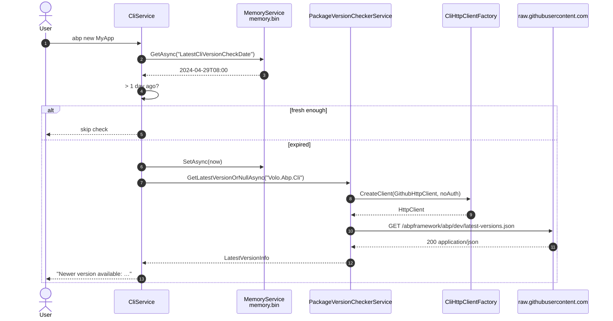

The ABP CLI does not ship a fully featured GitHub SDK. Instead it leans on a single named `HttpClient` (`CliConsts.GithubHttpClientName`) and a tiny DTO (`Volo.Abp.Cli.GitHub.GithubRelease`) to perform two specific tasks: discovering which framework and LeptonX versions exist on GitHub, and pulling the "latest stable" version metadata that the CLI uses to nudge users about updates. A separate value object, `GithubRepositoryInfo`, carries `owner/repo` + access-token state when `get-source` needs to clone a private repository. Together these pieces form the GitHub surface area of `Volo.Abp.Cli.Core` — small but on the hot path of every CLI invocation.

## File inventory

| File | Type | Role |
| --- | --- | --- |
| `framework/src/Volo.Abp.Cli.Core/Volo/Abp/Cli/GitHub/GithubRelease.cs` | DTO | Single release entry returned by GitHub-style version payloads |
| `framework/src/Volo.Abp.Cli.Core/Volo/Abp/Cli/CliConsts.cs` | Static | Holds `GithubHttpClientName = "GithubHttpClient"` |
| `framework/src/Volo.Abp.Cli.Core/Volo/Abp/Cli/CliUrls.cs` | Static | Holds `LatestVersionCheckFullPath` pointing at `raw.githubusercontent.com` |
| `framework/src/Volo.Abp.Cli.Core/Volo/Abp/Cli/AbpCliCoreModule.cs` | Module | Registers the named `HttpClient` with a `User-Agent` header |
| `framework/src/Volo.Abp.Cli.Core/Volo/Abp/Cli/Http/CliHttpClientFactory.cs` | DI service | Resolves the named client via `IHttpClientFactory.CreateClient(name)` |
| `framework/src/Volo.Abp.Cli.Core/Volo/Abp/Cli/Version/PackageVersionCheckerService.cs` | DI service | Owns the only call site that fetches the stable-version JSON |
| `framework/src/Volo.Abp.Cli.Core/Volo/Abp/Cli/Version/LatestVersionInfo.cs` | DTO | Result of a successful version probe |
| `framework/src/Volo.Abp.Cli.Core/Volo/Abp/Cli/ProjectBuilding/AbpIoSourceCodeStore.cs` | DI service | Reuses `GithubRelease` via `GithubReleaseVersions` when validating download requests |
| `framework/src/Volo.Abp.Cli.Core/Volo/Abp/Cli/ProjectBuilding/Building/GithubRepositoryInfo.cs` | Value object | Owner+repo+access-token bag passed into `get-source` for custom templates |

<Note>
  There is **no** `IGithubClient` interface or `GithubClient` class in this repo. The CLI deliberately treats GitHub as just another HTTPS host, configured by name on `IHttpClientFactory`. This page documents what is actually there.
</Note>

## Where GitHub fits in the CLI

```mermaid
flowchart LR
  subgraph CLI["abp CLI"]
    CliService -->|on every run| Checker[PackageVersionCheckerService]
    Checker -->|named client| Factory[CliHttpClientFactory]
    Factory -->|CreateClient&#40;GithubHttpClient&#41;| HC[(HttpClient)]
    HC -->|GET latest-versions.json| GH[(raw.githubusercontent.com)]
    Checker --> Info[LatestVersionInfo]
    Info -->|warn| Logger[ABP CLI logger]
  end

  subgraph SrcStore["AbpIoSourceCodeStore"]
    Versions[GithubReleaseVersions]
    Versions --> Release[GithubRelease]
  end

  GetSource[abp get-source] --> Repo[GithubRepositoryInfo]
```



The same pattern is reused for two different conversations:

1. **Self-update check.** Every CLI invocation asks `raw.githubusercontent.com/abpframework/abp/dev/latest-versions.json` whether a newer stable build exists.
2. **Source-code download validation.** `AbpIoSourceCodeStore.IsVersionExists` calls `abp.io/api/download/all-versions?includePreReleases=true` and deserializes the result into `GithubReleaseVersions` — a payload modeled on the same `GithubRelease` shape.

## GithubRelease — the only DTO in the namespace

```csharp title="framework/src/Volo.Abp.Cli.Core/Volo/Abp/Cli/GitHub/GithubRelease.cs"
using System;
using Newtonsoft.Json;

namespace Volo.Abp.Cli.GitHub;

[JsonObject]
[Serializable]
public class GithubRelease
{
    [JsonProperty("id")]
    public int Id { get; set; }

    [JsonProperty("name")]
    public string Name { get; set; }

    [JsonProperty("prerelease")]
    public bool IsPrerelease { get; set; }

    [JsonProperty("published_at")]
    public DateTime PublishTime { get; set; }
}
```

The JSON property names mirror the GitHub Releases REST schema exactly (`id`, `name`, `prerelease`, `published_at`), so the same DTO can be deserialized from either a raw GitHub response or the `abp.io` proxy.

The DTO is consumed inside `AbpIoSourceCodeStore`, in a private wrapper that splits versions by product line:

```csharp title="framework/src/Volo.Abp.Cli.Core/Volo/Abp/Cli/ProjectBuilding/AbpIoSourceCodeStore.cs"
public class GithubReleaseVersions
{
    public List<GithubRelease> FrameworkAndCommercialVersions { get; set; }

    public List<GithubRelease> LeptonXVersions { get; set; }
}
```

`IsVersionExists` then picks the right collection based on the template name:

```csharp title="framework/src/Volo.Abp.Cli.Core/Volo/Abp/Cli/ProjectBuilding/AbpIoSourceCodeStore.cs"
return templateName.Contains("LeptonX")
    ? versions.LeptonXVersions.Any(v => v.Name == version)
    : versions.FrameworkAndCommercialVersions.Any(v => v.Name == version);
```

This is the gate that prevents `abp get-source <Module> -v 99.x` from making a download POST when the requested version was never published.

## The GithubHttpClient named HttpClient

Two named clients are registered during `AbpCliCoreModule.ConfigureServices`:

```csharp title="framework/src/Volo.Abp.Cli.Core/Volo/Abp/Cli/AbpCliCoreModule.cs"
context.Services.AddHttpClient(CliConsts.HttpClientName)
    .ConfigurePrimaryHttpMessageHandler(() => new CliHttpClientHandler());

context.Services.AddHttpClient(CliConsts.GithubHttpClientName, client =>
{
    client.DefaultRequestHeaders.UserAgent.ParseAdd("MyAgent/1.0");
});
```

The differences are deliberate:

| Aspect | `AbpHttpClient` (default) | `GithubHttpClient` |
| --- | --- | --- |
| Constant | `CliConsts.HttpClientName` | `CliConsts.GithubHttpClientName` |
| Primary handler | `CliHttpClientHandler` (sets `WebRequest.GetSystemWebProxy()` + default credentials) | Default `HttpClientHandler` |
| Default headers | None | `User-Agent: MyAgent/1.0` (GitHub rejects requests without a User-Agent) |
| Auth header | Bearer token from `~/.abp/cli/access-token.bin` when `needsAuthentication: true` | Never auto-attached (callers always pass `needsAuthentication: false`) |

The constants are defined in `CliConsts`:

```csharp title="framework/src/Volo.Abp.Cli.Core/Volo/Abp/Cli/CliConsts.cs"
public const string HttpClientName        = "AbpHttpClient";
public const string GithubHttpClientName  = "GithubHttpClient";
```

### Resolving the named client through CliHttpClientFactory

```csharp title="framework/src/Volo.Abp.Cli.Core/Volo/Abp/Cli/Http/CliHttpClientFactory.cs"
public HttpClient CreateClient(
    bool needsAuthentication = true,
    TimeSpan? timeout = null,
    string clientName = null)
{
    var httpClient = _clientFactory.CreateClient(clientName ?? CliConsts.HttpClientName);
    httpClient.Timeout = timeout ?? DefaultTimeout;

    if (needsAuthentication)
    {
        httpClient.AddAbpAuthenticationToken();
    }

    return httpClient;
}
```

To talk to GitHub, callers pass the GitHub client name and disable auth:

```csharp
var client = _cliHttpClientFactory.CreateClient(
    clientName: CliConsts.GithubHttpClientName,
    needsAuthentication: false);
```

`DefaultTimeout` is two minutes (`TimeSpan.FromMinutes(2)`), which is plenty for a single 200-byte JSON download.

## The "latest stable" version probe

The only production call site that uses `GithubHttpClient` lives in `PackageVersionCheckerService`:

```csharp title="framework/src/Volo.Abp.Cli.Core/Volo/Abp/Cli/Version/PackageVersionCheckerService.cs"
private async Task<LatestStableVersionResult> GetLatestStableVersionOrNullAsync()
{
    try
    {
        var client = _cliHttpClientFactory.CreateClient(
            clientName: CliConsts.GithubHttpClientName,
            needsAuthentication: false);

        using (var responseMessage = await client.GetHttpResponseMessageWithRetryAsync(
                   CliUrls.LatestVersionCheckFullPath,
                   cancellationToken: CancellationTokenProvider.Token,
                   logger: Logger))
        {
            await RemoteServiceExceptionHandler.EnsureSuccessfulHttpResponseAsync(responseMessage);

            var content = await responseMessage.Content.ReadAsStringAsync();
            var result = JsonSerializer.Deserialize<List<LatestStableVersionResult>>(content);

            return result.FirstOrDefault(x => x.Type.ToLowerInvariant() == "stable");
        }
    }
    catch
    {
        return null;
    }
}
```

The URL is hard-coded in `CliUrls`:

```csharp title="framework/src/Volo.Abp.Cli.Core/Volo/Abp/Cli/CliUrls.cs"
public const string LatestVersionCheckFullPath =
    "https://raw.githubusercontent.com/abpframework/abp/dev/latest-versions.json";
```

A few engineering notes worth flagging:

- The method swallows **all** exceptions and returns `null`. That is intentional: a self-update check must never crash an unrelated command (e.g. `abp new`).
- `GetHttpResponseMessageWithRetryAsync` (defined in `CliHttpClientExtensions.cs`) wraps the call in a Polly retry policy of 2 s / 4 s / 7 s back-off, so transient blips on `raw.githubusercontent.com` do not show up as warnings.
- The response shape (`List<LatestStableVersionResult>`) is not the GitHub Releases payload — it is a hand-curated JSON file the ABP team commits to the `dev` branch.

### Calling chain inside CliService

The probe is wired into the CLI bootstrap. Every invocation of `CliService.RunAsync` first prints the CLI banner, then (unless `--skip-cli-version-check` was passed) calls `CheckCliVersionAsync`:

```csharp title="framework/src/Volo.Abp.Cli.Core/Volo/Abp/Cli/CliService.cs"
if(updateChannel == UpdateChannel.Prerelease && !latestVersionInfo.Version.IsPrerelease)
{
    latestVersionInfo = await PackageVersionCheckerService.GetLatestStableVersionFromGithubAsync();

    if(ShouldLogNewVersionInfo(latestVersionInfo, currentCliVersion))
    {
        LogNewVersionInfo(updateChannel, latestVersionInfo.Version, toolPath, latestVersionInfo.Message);
    }

    return;
}
```

The wrapper that lifts the JSON result into a `SemanticVersion` is:

```csharp title="framework/src/Volo.Abp.Cli.Core/Volo/Abp/Cli/Version/PackageVersionCheckerService.cs"
public async Task<LatestVersionInfo> GetLatestStableVersionFromGithubAsync()
{
    var latestStableVersionResult = await GetLatestStableVersionOrNullAsync();
    if (latestStableVersionResult == null)
    {
        return null;
    }

    return SemanticVersion.TryParse(latestStableVersionResult.Version, out var semanticVersion)
        ? new LatestVersionInfo(semanticVersion, latestStableVersionResult.Message)
        : null;
}
```

`LatestVersionInfo` carries both the version and an optional `Message` that lets the ABP team push release notes through the same JSON file:

```csharp title="framework/src/Volo.Abp.Cli.Core/Volo/Abp/Cli/Version/LatestVersionInfo.cs"
public class LatestVersionInfo
{
    public SemanticVersion Version { get; }
    public string Message { get; }

    public LatestVersionInfo(SemanticVersion version, string message = null)
    {
        Version = version;
        Message = message;
    }
}
```

### How often the probe actually runs

`CliService` rate-limits the request via `MemoryService` (see [CLI shared module](/cli/cli-shared-module)):

```csharp title="framework/src/Volo.Abp.Cli.Core/Volo/Abp/Cli/CliService.cs"
private async Task<bool> IsLatestVersionCheckExpiredAsync()
{
    try
    {
        var latestTimeAsString = await _memoryService.GetAsync(
            CliConsts.MemoryKeys.LatestCliVersionCheckDate);
        if (DateTime.TryParse(latestTimeAsString,
                CultureInfo.InvariantCulture,
                DateTimeStyles.None, out var latestTimeParsed))
        {
            if (DateTime.Now.Subtract(latestTimeParsed).TotalDays < 1)
            {
                return false;
            }
        }

        await _memoryService.SetAsync(
            CliConsts.MemoryKeys.LatestCliVersionCheckDate,
            DateTime.Now.ToString(CultureInfo.InvariantCulture));

        return true;
    }
    catch (Exception)
    {
        return true;
    }
}
```

So at most one round-trip per day per machine — the timestamp is persisted to `memory.bin` next to the CLI assembly. To skip the check entirely (CI environments, offline boxes) pass `--skip-cli-version-check`.



## GithubRepositoryInfo — custom source for `abp get-source`

`abp get-source` normally pulls module source from `abp.io`. When `--source <url>` or a GitHub fork is configured, the request needs an `owner/repo` pair and (for private repositories) a personal access token. That data is modeled by `GithubRepositoryInfo`:

```csharp title="framework/src/Volo.Abp.Cli.Core/Volo/Abp/Cli/ProjectBuilding/Building/GithubRepositoryInfo.cs"
public class GithubRepositoryInfo
{
    public string RepositoryNameWithOrganization { get; }
    public string RepositoryName { get; }
    public string AccessToken { get; }

    public GithubRepositoryInfo(string repositoryNameWithOrganization, string accessToken)
    {
        if (!repositoryNameWithOrganization.Contains("/"))
        {
            throw new ApplicationException(
                $"{nameof(repositoryNameWithOrganization)} '{repositoryNameWithOrganization}' is not valid! " +
                "It should be formatted as 'organization-name/repository-name'.");
        }

        RepositoryNameWithOrganization = repositoryNameWithOrganization;
        RepositoryName = repositoryNameWithOrganization.Split('/')[1];
        AccessToken = accessToken;
    }
}
```

Two things to highlight:

- The constructor enforces the `org/repo` shape and throws `ApplicationException` otherwise — there is no silent acceptance of a bare repo name.
- The `AccessToken` is plain text; the CLI never hashes or encrypts it. It is consumed downstream by `ProjectReferenceReplaceStep` and the source-code download services to authenticate against GitHub when cloning private commercial repositories. See [Project building & templates](/cli/project-building-and-templates) for the end-to-end flow.

The class is constructed inside `ProjectBuildArgs.GitHubAbpLocalRepositoryPath` plumbing and is passed through the build pipeline via the same `ProjectBuildArgs` argument that flows into every project-building step.

## "abp cli github subcommands" — what actually exists

There is no `abp github …` group in the CLI today. The command surface that touches GitHub is split across two unrelated commands; both are documented on their primary pages.

| Command | Where it shows up | What GitHub thing it touches |
| --- | --- | --- |
| `abp get-source <Module> --git-hub-abp-local-repository-path …` | [Project building & templates](/cli/project-building-and-templates) | Reads from a local clone of `abpframework/abp` instead of downloading. Optional GitHub-side fallback uses `GithubRepositoryInfo`. |
| `abp <any command>` (implicit) | [CLI overview](/cli/overview) | Triggers the daily version probe described above via `CliService.CheckCliVersionAsync`. |

When a user runs `abp help` there is no sub-tree of github commands rendered — the `HelpCommand` enumerates `AbpCliOptions.Commands` which contains exactly the top-level commands registered in `AbpCliCoreModule`.

## Module registration recap

For completeness, the snippet that turns this on is:

```csharp title="framework/src/Volo.Abp.Cli.Core/Volo/Abp/Cli/AbpCliCoreModule.cs"
[DependsOn(
    typeof(AbpDddDomainModule),
    typeof(AbpJsonModule),
    typeof(AbpIdentityModelModule),
    typeof(AbpMinifyModule),
    typeof(AbpHttpModule)
)]
public class AbpCliCoreModule : AbpModule
{
    public override void ConfigureServices(ServiceConfigurationContext context)
    {
        context.Services.AddHttpClient(CliConsts.HttpClientName)
            .ConfigurePrimaryHttpMessageHandler(() => new CliHttpClientHandler());

        context.Services.AddHttpClient(CliConsts.GithubHttpClientName, client =>
        {
            client.DefaultRequestHeaders.UserAgent.ParseAdd("MyAgent/1.0");
        });
        ...
    }
}
```

The two `AddHttpClient` calls are the **entire** GitHub bootstrap. Anything else you see in `Volo.Abp.Cli.GitHub` is just the DTO.

## Why no `IGithubClient`?

It is tempting to wrap the calls above in an interface, but the CLI keeps the boundary thin for three reasons:

<AccordionGroup>
  <Accordion title="One call site, one JSON shape">
    Only `PackageVersionCheckerService.GetLatestStableVersionOrNullAsync` actually talks to `raw.githubusercontent.com`. Wrapping it in an abstraction would be more code than the call itself.
  </Accordion>
  <Accordion title="The retry, auth, and proxy story already belongs to CliHttpClientFactory">
    Adding a GitHub-specific abstraction would have to re-export `GetHttpResponseMessageWithRetryAsync`, `AddAbpAuthenticationToken`, and `CliHttpClientHandler` — duplicating what's already on the named client.
  </Accordion>
  <Accordion title="The `abp.io` proxy reuses the same shape">
    Because `GithubRelease` is exactly the GitHub Releases REST shape, the server-side proxy at `abp.io/api/download/all-versions` can return a payload that the CLI parses with the same DTO. No GitHub-specific code path is required.
  </Accordion>
</AccordionGroup>

## Testing the GitHub probe locally

You can reproduce what the CLI sees on every cold run:

```bash
# Same URL as CliUrls.LatestVersionCheckFullPath
curl -sH 'User-Agent: MyAgent/1.0' \
  https://raw.githubusercontent.com/abpframework/abp/dev/latest-versions.json | head
```

To skip the probe in scripted environments, pass the universal flag:

```bash
abp new MyCompany.MyApp --skip-cli-version-check
```

`CliService.RunAsync` checks for that option before calling `CheckCliVersionAsync`:

```csharp title="framework/src/Volo.Abp.Cli.Core/Volo/Abp/Cli/CliService.cs"
#if !DEBUG
if (!commandLineArgs.Options.ContainsKey("skip-cli-version-check"))
{
    await CheckCliVersionAsync(currentCliVersion);
}
#endif
```

## Related pages

<CardGroup cols={2}>
  <Card title="CLI overview" icon="terminal" href="/cli/overview">
    Process model, command dispatch, and where the daily GitHub probe sits in the bootstrap.
  </Card>
  <Card title="Auth & account" icon="key" href="/cli/auth-and-account">
    The other named `HttpClient` (`AbpHttpClient`) and the bearer-token plumbing. GitHub calls explicitly opt out of that pipeline.
  </Card>
  <Card title="Project building & templates" icon="cube" href="/cli/project-building-and-templates">
    Where `GithubRepositoryInfo` flows through `ProjectBuildArgs` into source-code download steps.
  </Card>
  <Card title="CLI shared module" icon="cube" href="/cli/cli-shared-module">
    `CliHttpClientFactory`, `CliConsts`, `CliUrls`, and the `MemoryService` that rate-limits the probe.
  </Card>
</CardGroup>
