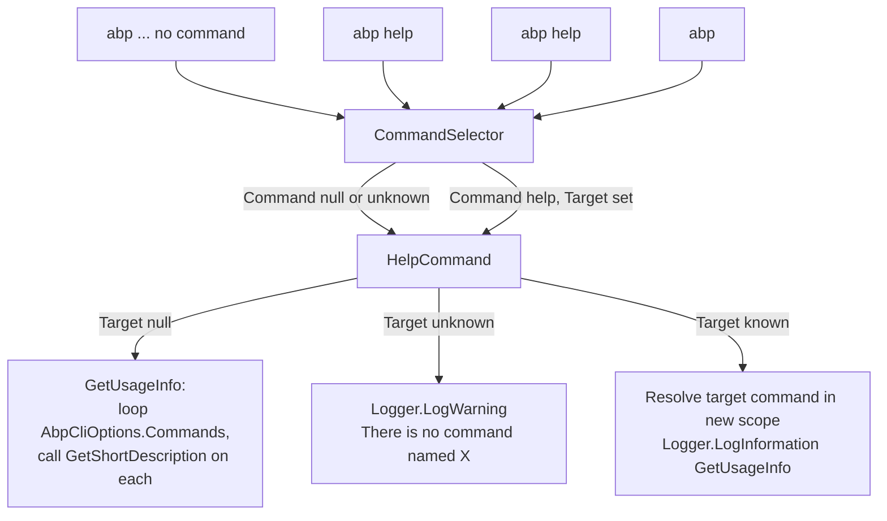

The ABP CLI has no `--help` flag and no `--version` flag. Instead, three pieces of source code cooperate to deliver help and version information: `HelpCommand` renders the documentation that the user sees, `CliService.RunAsync` prints the version banner on every invocation, and `CliCommand` (the verb `abp cli`) lets the user update or uninstall the tool itself. This page covers all three.

<Info>
The relevant files are `framework/src/Volo.Abp.Cli.Core/Volo/Abp/Cli/Commands/HelpCommand.cs`, `framework/src/Volo.Abp.Cli.Core/Volo/Abp/Cli/Commands/CliCommand.cs`, and `framework/src/Volo.Abp.Cli.Core/Volo/Abp/Cli/CliService.cs` (`CheckCliVersionAsync`, `GetCurrentCliVersionInternalAsync`, `GetUpdateChannel`).
</Info>

## File inventory

| File | Verb | Purpose |
| --- | --- | --- |
| `Commands/HelpCommand.cs` | `help` | Render `abp help` (full command list) and `abp help <command>` (single command usage). Also the fallback selected when the verb is missing or unknown. |
| `Commands/CliCommand.cs` | `cli` | `abp cli update` / `abp cli update --preview` / `abp cli update --version X` / `abp cli remove` — manages the global tool itself. |
| `CliService.cs` | n/a | `GetCurrentCliVersionInternalAsync` reads the installed CLI version; `CheckCliVersionAsync` queries the matching feed and logs a "newer version available" warning. |

## Help flow



## HelpCommand

`HelpCommand` is the fallback the selector returns when there is no verb, and the destination when the user runs `abp help`. It registers itself with `public const string Name = "help"` and is added to `AbpCliOptions.Commands` first in `AbpCliCoreModule`.

```csharp Volo.Abp.Cli.Core/Volo/Abp/Cli/Commands/HelpCommand.cs
public class HelpCommand : IConsoleCommand, ITransientDependency
{
    public const string Name = "help";

    public ILogger<HelpCommand> Logger { get; set; }
    protected AbpCliOptions AbpCliOptions { get; }
    protected IServiceScopeFactory ServiceScopeFactory { get; }

    public HelpCommand(IOptions<AbpCliOptions> cliOptions,
        IServiceScopeFactory serviceScopeFactory)
    {
        ServiceScopeFactory = serviceScopeFactory;
        Logger = NullLogger<HelpCommand>.Instance;
        AbpCliOptions = cliOptions.Value;
    }
```

It takes a snapshot of `AbpCliOptions` (read-only access to the command registry) and the `IServiceScopeFactory` it needs to resolve every other command — because `GetShortDescription()` is an *instance* method, not a static one, and each command lives in its own scope.

### ExecuteAsync — two branches

```csharp Volo.Abp.Cli.Core/Volo/Abp/Cli/Commands/HelpCommand.cs
public Task ExecuteAsync(CommandLineArgs commandLineArgs)
{
    if (string.IsNullOrWhiteSpace(commandLineArgs.Target))
    {
        Logger.LogInformation(GetUsageInfo());
        return Task.CompletedTask;
    }

    if (!AbpCliOptions.Commands.ContainsKey(commandLineArgs.Target))
    {
        Logger.LogWarning($"There is no command named {commandLineArgs.Target}.");
        Logger.LogInformation(GetUsageInfo());
        return Task.CompletedTask;
    }

    var commandType = AbpCliOptions.Commands[commandLineArgs.Target];

    using (var scope = ServiceScopeFactory.CreateScope())
    {
        var command = (IConsoleCommand)scope.ServiceProvider.GetRequiredService(commandType);
        Logger.LogInformation(command.GetUsageInfo());
    }

    return Task.CompletedTask;
}
```

| `Target` | Behaviour |
| --- | --- |
| empty / null (`abp help`) | Print the full command list via `GetUsageInfo()`. |
| not in `AbpCliOptions.Commands` (`abp help foo`) | `LogWarning` "There is no command named foo." then print the full command list anyway. |
| in `AbpCliOptions.Commands` (`abp help new`) | Resolve the target type in a fresh scope, call `command.GetUsageInfo()`, log it as Information. |

Note that the *unknown* branch logs as `Warning`, while the *known* branch logs as `Information`. With the default Serilog template (`{Message:lj}{NewLine}{Exception}`) the visual difference is colour only — warnings render yellow on a dark console.

### GetUsageInfo — building the command list

```csharp Volo.Abp.Cli.Core/Volo/Abp/Cli/Commands/HelpCommand.cs
public string GetUsageInfo()
{
    var sb = new StringBuilder();

    sb.AppendLine("");
    sb.AppendLine("Usage:");
    sb.AppendLine("");
    sb.AppendLine("    abp <command> <target> [options]");
    sb.AppendLine("");
    sb.AppendLine("Command List:");
    sb.AppendLine("");

    foreach (var command in AbpCliOptions.Commands.ToArray())
    {
        string shortDescription;

        using (var scope = ServiceScopeFactory.CreateScope())
        {
            shortDescription = ((IConsoleCommand)scope.ServiceProvider
                    .GetRequiredService(command.Value)).GetShortDescription();
        }

        sb.Append("    > ");
        sb.Append(command.Key);
        sb.Append(string.IsNullOrWhiteSpace(shortDescription) ? "" : ":");
        sb.Append(" ");
        sb.AppendLine(shortDescription);
    }

    sb.AppendLine("");
    sb.AppendLine("To get a detailed help for a command:");
    sb.AppendLine("");
    sb.AppendLine("    abp help <command>");
    sb.AppendLine("");
    sb.AppendLine("See the documentation for more info: https://docs.abp.io/en/abp/latest/CLI");

    return sb.ToString();
}
```

A few important properties of this implementation:

1. **Order is dictionary order.** `AbpCliOptions.Commands` is built by sequential assignments in `AbpCliCoreModule.ConfigureServices` — the rendered help list mirrors that registration order.
2. **One scope per command.** The loop opens a new scope, resolves the target type, calls `GetShortDescription()`, then disposes the scope. This is intentional — some commands take *expensive* dependencies (NuGet clients, HTTP factories) in their constructors and we do not want to hold them all alive for the duration of help rendering.
3. **No description ⇒ no colon.** The check `string.IsNullOrWhiteSpace(shortDescription) ? "" : ":"` keeps the formatting clean for commands that returned `""`. None of the in-tree commands do this today; the branch is defensive.

### GetShortDescription

`HelpCommand` itself returns a one-liner for the top-level list:

```csharp Volo.Abp.Cli.Core/Volo/Abp/Cli/Commands/HelpCommand.cs
public string GetShortDescription()
{
    return "Show command line help. Write ` abp help <command> `";
}
```

When the user runs bare `abp`, the `CommandSelector` returns `HelpCommand`, `ExecuteAsync` sees `Target` is null, and the output begins with the `Usage:` block followed by every registered command and its description, ending with the `docs.abp.io` link.

## Per-command usage rendering

Every command's `GetUsageInfo()` is hand-written plain text. There is no help-generation framework — the source of truth for each command's flags is the literal `StringBuilder` chain in that command. As an example, here is `BundleCommand.GetUsageInfo`:

```csharp Volo.Abp.Cli.Core/Volo/Abp/Cli/Commands/BundleCommand.cs
public string GetUsageInfo()
{
    var sb = new StringBuilder();

    sb.AppendLine("");
    sb.AppendLine("Usage:");
    sb.AppendLine("");
    sb.AppendLine("  abp bundle [options]");
    sb.AppendLine("");
    sb.AppendLine("Options:");
    sb.AppendLine("");
    sb.AppendLine("-wd|--working-directory <directory-path>                (default: empty)");
    sb.AppendLine("-f | --force                                            (default: false)");
    sb.AppendLine("-t | --project-type                                     (default: webassembly)");
    sb.AppendLine("");
    sb.AppendLine("See the documentation for more info: https://docs.abp.io/en/abp/latest/CLI");

    return sb.ToString();
}
```

<Tip>
Commands also embed `GetUsageInfo()` into `CliUsageException` messages so the user sees the same help text immediately after a usage error — e.g. `NewCommand` throws `"Project name is missing!" + NewLine + NewLine + GetUsageInfo()` when `Target` is empty. `CliService` then logs that message via `LogWarning`.
</Tip>

## Version banner

`CliService.RunAsync` prints a single line at the very top of every CLI invocation:

```csharp Volo.Abp.Cli.Core/Volo/Abp/Cli/CliService.cs
public async Task RunAsync(string[] args)
{
    var currentCliVersion = await GetCurrentCliVersionInternalAsync(typeof(CliService).Assembly);
    Logger.LogInformation($"ABP CLI {currentCliVersion}");
    // ...
}
```

The version itself is read with a `dotnet` shell-out:

```csharp Volo.Abp.Cli.Core/Volo/Abp/Cli/CliService.cs
private async Task<SemanticVersion> GetCurrentCliVersionInternalAsync(Assembly assembly)
{
    SemanticVersion currentCliVersion = default;

    var consoleOutput = new StringReader(CmdHelper.RunCmdAndGetOutput($"dotnet tool list -g", out int exitCode));
    string line;
    while ((line = await consoleOutput.ReadLineAsync()) != null)
    {
        if (line.StartsWith("volo.abp.cli", StringComparison.InvariantCultureIgnoreCase))
        {
            var version = line.Split(new char[0], StringSplitOptions.RemoveEmptyEntries)[1];

            SemanticVersion.TryParse(version, out currentCliVersion);

            break;
        }
    }


    if (currentCliVersion == null)
    {
        // If not a tool executable, fallback to assembly version and treat as dev without updates
        // Assembly revisions are not supported by SemVer scheme required for NuGet, trim to {major}.{minor}.{patch}
        var assemblyVersion = string.Join(".", assembly.GetFileVersion().Split('.').Take(3));
        return SemanticVersion.Parse(assemblyVersion + "-dev");
    }

    return currentCliVersion;
}
```

| Scenario | Result |
| --- | --- |
| Installed as a global `dotnet tool` | `dotnet tool list -g` reports a line beginning with `volo.abp.cli`; the version column is parsed as `SemanticVersion`. |
| Running from a source build / local debug | No such line is found; fall back to `assembly.GetFileVersion()` truncated to `{major}.{minor}.{patch}` with a `-dev` suffix so the update check treats it as a non-distributable build. |

The `-dev` suffix is significant: `GetUpdateChannel` (below) maps it to `UpdateChannel.Development`, and `GetLatestVersion` returns `default` for that channel — so a developer build will *never* nag about updates.

## Update channel detection

```csharp Volo.Abp.Cli.Core/Volo/Abp/Cli/CliService.cs
private UpdateChannel GetUpdateChannel(SemanticVersion currentCliVersion)
{
    if (!currentCliVersion.IsPrerelease)
    {
        return UpdateChannel.Stable;
    }

    if (currentCliVersion.Release.Contains("preview"))
    {
        return UpdateChannel.Nightly;
    }

    if (currentCliVersion.Release.Contains("dev"))
    {
        return UpdateChannel.Development;
    }

    return UpdateChannel.Prerelease;
}
```

| SemVer tag | Channel |
| --- | --- |
| no prerelease (`8.2.1`) | `Stable` — query the NuGet feed for the latest non-RC version. |
| `8.2.0-preview-2024-…` | `Nightly` — query MyGet nightly feed via `includeNightly: true`. |
| `8.2.0-dev` (from local fallback) | `Development` — never report updates. |
| anything else with a prerelease tag (e.g. `8.2.0-rc.1`) | `Prerelease` — query feed with `includeReleaseCandidates: true`. |

## CheckCliVersionAsync — daily update nag

```csharp Volo.Abp.Cli.Core/Volo/Abp/Cli/CliService.cs
private async Task CheckCliVersionAsync(SemanticVersion currentCliVersion)
{
    if (!await IsLatestVersionCheckExpiredAsync())
    {
        return;
    }

    try
    {
        var assembly = typeof(CliService).Assembly;
        var toolPath = GetToolPath(assembly);
        var updateChannel = GetUpdateChannel(currentCliVersion);

        var latestVersionInfo = await GetLatestVersion(updateChannel);
        if (ShouldLogNewVersionInfo(latestVersionInfo, currentCliVersion))
        {
            if(updateChannel == UpdateChannel.Prerelease && !latestVersionInfo.Version.IsPrerelease)
            {
                latestVersionInfo = await PackageVersionCheckerService.GetLatestStableVersionFromGithubAsync();

                if(ShouldLogNewVersionInfo(latestVersionInfo, currentCliVersion))
                {
                    LogNewVersionInfo(updateChannel, latestVersionInfo.Version, toolPath, latestVersionInfo.Message);
                }

                return;
            }

            LogNewVersionInfo(updateChannel, latestVersionInfo.Version, toolPath, latestVersionInfo.Message);
        }
    }
    catch (Exception e)
    {
        Logger.LogWarning("Unable to retrieve the latest version: " + e.Message);
    }
}
```

The throttle is `IsLatestVersionCheckExpiredAsync`, which uses `MemoryService` (a small JSON state file in `CliPaths.Memory`) to track when the check last ran. If less than 24 hours have elapsed, the call returns false and `CheckCliVersionAsync` exits silently. Otherwise the timestamp is rewritten and the network call runs.

`CheckCliVersionAsync` is wrapped by `RunAsync` like this:

```csharp Volo.Abp.Cli.Core/Volo/Abp/Cli/CliService.cs
#if !DEBUG
        if (!commandLineArgs.Options.ContainsKey("skip-cli-version-check"))
        {
            await CheckCliVersionAsync(currentCliVersion);
        }
#endif
```

<Warning>
The version check is **compiled out in DEBUG builds** and **opt-out** in release. Pass `--skip-cli-version-check` on any command to suppress it in CI pipelines where you do not want the build to make outbound NuGet calls.
</Warning>

### LogNewVersionInfo — channel-aware update command

When a newer version is found, `CliService.LogNewVersionInfo` prints not just the version but the exact `dotnet tool` command you should run:

```csharp Volo.Abp.Cli.Core/Volo/Abp/Cli/CliService.cs
private void LogNewVersionInfo(UpdateChannel updateChannel, SemanticVersion latestVersion, string toolPath, string message = null)
{
    var toolPathArg = IsGlobalTool(toolPath) ? "-g" : $"--tool-path {toolPath}";

    Logger.LogWarning($"A newer {updateChannel.ToString().ToLowerInvariant()} version of the ABP CLI is available: {latestVersion}.");

    if (!string.IsNullOrWhiteSpace(message))
    {
        Logger.LogWarning(message);
    }

    Logger.LogWarning(string.Empty);
    Logger.LogWarning("Update Command: ");

    // Update command doesn't support prerelease versions https://github.com/dotnet/sdk/issues/2551 workaround is to uninstall & install
    switch (updateChannel)
    {
        case UpdateChannel.Stable:
            Logger.LogWarning($"dotnet tool update {toolPathArg} Volo.Abp.Cli");
            break;

        case UpdateChannel.Prerelease:
            Logger.LogWarning($"dotnet tool update {toolPathArg} Volo.Abp.Cli --version {latestVersion}");
            break;

        case UpdateChannel.Nightly:
        case UpdateChannel.Development:
            Logger.LogWarning($"dotnet tool uninstall {toolPathArg} Volo.Abp.Cli");
            Logger.LogWarning($"dotnet tool install {toolPathArg} Volo.Abp.Cli --add-source https://www.myget.org/F/abp-nightly/api/v3/index.json --version {latestVersion}");
            break;
        default:
            throw new ArgumentOutOfRangeException(nameof(updateChannel), updateChannel, null);
    }

    Logger.LogWarning(string.Empty);
}
```

The branches matter because `dotnet tool update` does not respect `--version` for prereleases (linked to dotnet/sdk#2551), so the nightly/development paths emit an explicit `uninstall` + `install --add-source <myget>` pair.

## The `cli` verb — self-update

`CliCommand` registers as `cli` and exposes two targets: `update` and `remove`.

```csharp Volo.Abp.Cli.Core/Volo/Abp/Cli/Commands/CliCommand.cs
public class CliCommand : IConsoleCommand, ITransientDependency
{
    public const string Name = "cli";

    private const string CliPackageName = "Volo.Abp.Cli";

    private readonly ICmdHelper _cmdHelper;
    private readonly PackageVersionCheckerService _packageVersionCheckerService;
    private readonly AbpNuGetIndexUrlService _nuGetIndexUrlService;
    public ILogger<CliCommand> Logger { get; set; }
```

### ExecuteAsync — target dispatch

```csharp Volo.Abp.Cli.Core/Volo/Abp/Cli/Commands/CliCommand.cs
public async Task ExecuteAsync(CommandLineArgs commandLineArgs)
{
    var operationType = NamespaceHelper.NormalizeNamespace(commandLineArgs.Target);

    var preview = commandLineArgs.Options.ContainsKey(Options.Preview.Short) ||
                  commandLineArgs.Options.ContainsKey(Options.Preview.Long);

    var version = commandLineArgs.Options.GetOrNull(Options.Version.Short, Options.Version.Long);

    switch (operationType)
    {
        case "":
        case null:
            _cmdHelper.RunCmd("abp");
            break;

        case "update":
            await UpdateCliAsync(version, preview);
            break;

        case "remove":
            RemoveCli();
            break;
    }
}
```

| Target | Behaviour |
| --- | --- |
| missing (`abp cli`) | Shell out and re-run `abp` — effectively prints help. |
| `update` (`abp cli update`) | Run `UpdateCliAsync` with the parsed `--preview` and `--version` options. |
| `remove` (`abp cli remove`) | `_cmdHelper.RunCmdAndExit("dotnet tool uninstall Volo.Abp.Cli -g", delaySeconds: 2);` |
| anything else | Falls through the `switch` and does nothing. |

The `--preview` (short `-p`) and `--version` (short `-v`) constants live inside `CliCommand.Options`:

```csharp Volo.Abp.Cli.Core/Volo/Abp/Cli/Commands/CliCommand.cs
public static class Options
{
    public static class Preview
    {
        public const string Long = "preview";
        public const string Short = "p";
    }

    public static class Version
    {
        public const string Long = "version";
        public const string Short = "v";
    }
}
```

### UpdateCliAsync — three modes

```csharp Volo.Abp.Cli.Core/Volo/Abp/Cli/Commands/CliCommand.cs
private async Task UpdateCliAsync(string version = null, bool preview = false)
{
    var infoText = "Updating ABP CLI ";
    if (version != null)
    {
        infoText += "to the " + version + "... ";
    }
    else if (preview)
    {
        infoText += "to the latest preview version...";
    }
    else
    {
        infoText += "...";
    }

    Logger.LogInformation(infoText);

    try
    {
        var versionOption = string.Empty;

        if (preview)
        {
            var latestPreviewVersion = await GetLatestPreviewVersion();
            if (latestPreviewVersion != null)
            {
                versionOption = $" --version {latestPreviewVersion}";
                Logger.LogInformation("Latest preview version is " + latestPreviewVersion);
            }
        }
        else if (version != null)
        {
            versionOption = $" --version {version}";
        }

        _cmdHelper.RunCmdAndExit($"dotnet tool update {CliPackageName}{versionOption} -g", delaySeconds: 2);
    }
    catch (Exception ex)
    {
        Logger.LogError("Couldn't update ABP CLI." + ex.Message);
        ShowCliManualUpdateCommand();
    }
}
```

| Invocation | Resolved `dotnet` command |
| --- | --- |
| `abp cli update` | `dotnet tool update Volo.Abp.Cli -g` |
| `abp cli update --preview` | Fetches the latest prerelease via `PackageVersionCheckerService.GetLatestVersionOrNullAsync(packageId, includeReleaseCandidates: true)`, then runs `dotnet tool update Volo.Abp.Cli --version <X> -g`. |
| `abp cli update --version 8.0.0-rc.1` | `dotnet tool update Volo.Abp.Cli --version 8.0.0-rc.1 -g` |
| `abp cli update --version 8.0.0 --preview` | The `if (preview)` branch wins; the preview-resolved version overrides `--version`. |

Failures log the error and fall through to `ShowCliManualUpdateCommand`, which prints `dotnet tool update -g Volo.Abp.Cli` for the user to run by hand.

`_cmdHelper.RunCmdAndExit` (`delaySeconds: 2`) intentionally exits the current process before `dotnet tool update` has a chance to acquire a lock on the running executable — without that, the update would fail on Windows because the file is held open.

### GetUsageInfo — the verb's help

```csharp Volo.Abp.Cli.Core/Volo/Abp/Cli/Commands/CliCommand.cs
public string GetUsageInfo()
{
    var sb = new StringBuilder();

    sb.AppendLine("");
    sb.AppendLine("Usage:");
    sb.AppendLine("");
    sb.AppendLine("  abp cli [options]");
    sb.AppendLine("");
    sb.AppendLine("Options:");
    sb.AppendLine("");
    sb.AppendLine("update                                 (update ABP CLI to the latest)");
    sb.AppendLine("remove                                 (uninstall ABP CLI)");
    sb.AppendLine("");
    sb.AppendLine("Examples:");
    sb.AppendLine("");
    sb.AppendLine("  abp cli update");
    sb.AppendLine("  abp cli update --preview");
    sb.AppendLine("  abp cli update --version 4.2.2");
    sb.AppendLine("  abp cli remove");
    sb.AppendLine("");

    return sb.ToString();
}

public string GetShortDescription()
{
    return "Update or remove ABP CLI. See https://docs.abp.io/en/abp/latest/CLI";
}
```

This is what `abp help cli` prints, and what shows up next to `cli` in the top-level command list when `abp help` calls `GetShortDescription()`.

## Putting it together — a CLI session

```text Example session
$ abp
ABP CLI 8.1.2

Usage:

    abp <command> <target> [options]

Command List:

    > help: Show command line help. Write ` abp help <command> `
    > prompt: ...
    > new: Generate a new solution based on the ABP startup templates.
    > ...

To get a detailed help for a command:

    abp help <command>

See the documentation for more info: https://docs.abp.io/en/abp/latest/CLI

$ abp help new
ABP CLI 8.1.2

Usage:

  abp new <project-name> [options]

Options:

-t|--template <template-name>               (default: app)
-u|--ui <ui-framework>                      (if supported by the template)
...

$ abp cli update --preview
ABP CLI 8.1.2
Updating ABP CLI to the latest preview version...
Latest preview version is 8.2.0-rc.1
```

Each line is produced by exactly one of the three components covered above — `CliService` for `ABP CLI 8.1.2`, `HelpCommand` for the usage blocks, and `CliCommand` (via `_cmdHelper.RunCmdAndExit`) for the `dotnet tool update` invocation.

## Related pages

<CardGroup cols={2}>
<Card title="CLI Overview" icon="house" href="/cli/overview">
Command registry, boot pipeline, full inventory.
</Card>
<Card title="Args & Pipeline" icon="terminal" href="/cli/argument-parsing-and-pipeline">
How `--preview`, `--version`, and `<target>` end up in `CommandLineArgs`.
</Card>
<Card title="New and Update" icon="wand-magic-sparkles" href="/cli/new-and-update">
The two verbs most users run after `abp cli update`.
</Card>
<Card title="Build and bundle" icon="hammer" href="/cli/build-and-bundle">
The remaining "everyday" verbs that share the same usage rendering pattern.
</Card>
<Card title="Project building and templates" icon="folder-tree" href="/cli/project-building-and-templates">
Where `NewCommand` does its real work after parsing.
</Card>
<Card title="Identity module" icon="user-shield" href="/modules/identity">
Default module included in every template that `abp new` produces.
</Card>
</CardGroup>
