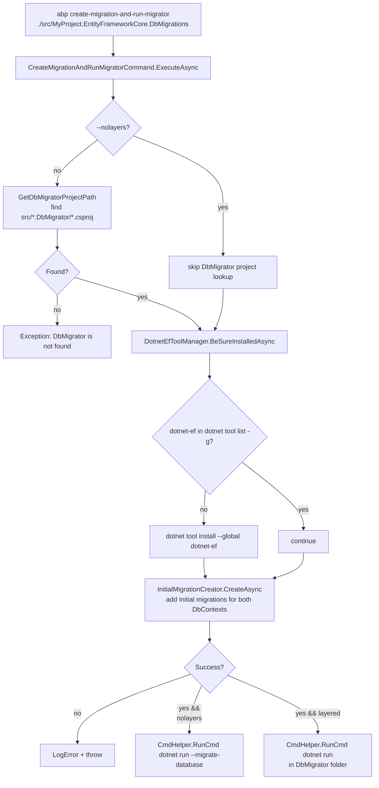

Two of the more pragmatic verbs in the CLI live just outside the project-building world: `abp create-migration-and-run-migrator` and `abp suite`. The first is the "I just added a module — make me a migration, then run the DbMigrator" shortcut. The second is the wrapper around ABP's commercial Blazor-based scaffolding tool (`Volo.Abp.Suite`), installed as a dotnet global tool. Both share the same plumbing — `DotnetEfToolManager` for `dotnet-ef`, `CmdHelper.RunCmd` for spawning external processes, `AbpNuGetIndexUrlService` for the paid feed — and both ship inside `Volo.Abp.Cli.Core` even though the latter only really matters to paying customers. This page covers all of it: the migration trio (`DotnetEfToolManager`, `InitialMigrationCreator`, `EfCoreMigrationManager`), the `create-migration-and-run-migrator` command that strings them together, and the full lifecycle of `SuiteCommand`.

<Info>
There is no command literally named `migrate` in `Volo.Abp.Cli.Core/Commands/`. The closest is `CreateMigrationAndRunMigratorCommand` (`abp create-migration-and-run-migrator`), which combines `dotnet ef migrations add` with `dotnet run` against the `*.DbMigrator` project. The piecewise add-migration support lives in `EfCoreMigrationManager` and is reused by `SolutionModuleAdder` — see [Project modification](/cli/project-modification#efcoremigrationmanager).
</Info>

## Source layout

<Card title="framework/src/Volo.Abp.Cli.Core/Volo/Abp/Cli" icon="folder" horizontal>
The EF-related services sit in `Commands/Services/`. The two commands sit in `Commands/`. `SuiteCommand` is a single ~600-line file; everything else is small and single-purpose.
</Card>

| File | Type | Responsibility |
| --- | --- | --- |
| `Commands/Services/DotnetEfToolManager.cs` | service | Ensures `dotnet-ef` global tool is installed; installs it if missing. |
| `Commands/Services/InitialMigrationCreator.cs` | service | Creates the *initial* `Initial` migration for a freshly scaffolded solution. Detects host + tenant DbContexts. |
| `ProjectModification/EfCoreMigrationManager.cs` | service | Adds *subsequent* migrations after `add-module`. Names them `Added_<Module>_Module_<random>`. |
| `Commands/CreateMigrationAndRunMigratorCommand.cs` | command | The `create-migration-and-run-migrator` verb. Calls `InitialMigrationCreator` then `dotnet run`. |
| `Commands/SuiteCommand.cs` | command | The `suite` verb — install / update / remove / run / generate CRUD against `Volo.Abp.Suite`. |
| `Commands/Services/SuiteAppSettingsService.cs` | service | Reads Suite's `appsettings.json` to discover the configured port. |
| `Commands/Services/AbpNuGetIndexUrlService.cs` | service | Personalised `https://nuget.abp.io/<key>/v3/index.json` URL (Suite is a paid tool, installed from this feed). |
| `Commands/Services/PackageVersionCheckerService.cs` | service | Used by `SuiteCommand` to discover the latest preview/RC of the Suite package. |
| `Utils/CmdHelper.cs` | helper | `RunCmd`, `RunCmdAndGetOutput`, `RunCmdAndGetProcess`, `Open(url)`. The one process-spawning façade. |
| `Utils/GlobalToolHelper.cs` | helper | `IsGlobalToolInstalled(toolName)` — `dotnet tool list -g` parser. |

## End-to-end: `abp create-migration-and-run-migrator`



## `DotnetEfToolManager`

The smallest of the three:

```csharp framework/src/Volo.Abp.Cli.Core/Volo/Abp/Cli/Commands/Services/DotnetEfToolManager.cs
public class DotnetEfToolManager : ISingletonDependency
{
    public ICmdHelper CmdHelper { get; }
    public ILogger<DotnetEfToolManager> Logger { get; set; }

    public DotnetEfToolManager(ICmdHelper cmdHelper)
    {
        CmdHelper = cmdHelper;
        Logger = NullLogger<DotnetEfToolManager>.Instance;
    }

    public async Task BeSureInstalledAsync()
    {
        if (IsDotNetEfToolInstalled())
        {
            return;
        }

        InstallDotnetEfTool();
    }

    private bool IsDotNetEfToolInstalled()
    {
        var output = CmdHelper.RunCmdAndGetOutput("dotnet tool list -g");
        return output.Contains("dotnet-ef");
    }

    private void InstallDotnetEfTool()
    {
        Logger.LogInformation("Installing dotnet-ef tool...");
        CmdHelper.RunCmd("dotnet tool install --global dotnet-ef");
        Logger.LogInformation("dotnet-ef tool is installed.");
    }
}
```

| Detail | Value |
| --- | --- |
| Lifetime | `ISingletonDependency` — one instance per CLI process. |
| Detection | Substring search for `dotnet-ef` in `dotnet tool list -g` output. The version, the install date and the install path are ignored — presence is the only signal. |
| Install | `dotnet tool install --global dotnet-ef`. Latest version, no `--version` pin. |
| Method shape | `BeSureInstalledAsync` returns `Task` but is fully synchronous internally; the `async` is for caller convenience. |

`BeSureInstalledAsync` is called from two places: `CreateMigrationAndRunMigratorCommand.ExecuteAsync` and `InitialMigrationCreator.CreateAsync`. Anywhere that needs `dotnet ef …` gets a one-line precondition check.

## `InitialMigrationCreator`

Used immediately after `abp new` (via `ProjectCreationCommandBase.CreateInitialMigrationsAsync`) and by the `create-migration-and-run-migrator` command.

```csharp framework/src/Volo.Abp.Cli.Core/Volo/Abp/Cli/Commands/Services/InitialMigrationCreator.cs
public async Task<bool> CreateAsync(string targetProjectFolder, bool layeredTemplate = true)
{
    if (targetProjectFolder == null || !Directory.Exists(targetProjectFolder))
    {
        Logger.LogError($"This path doesn't exist: {targetProjectFolder}");
        return false;
    }

    Logger.LogInformation("Creating initial migrations...");

    await DotnetEfToolManager.BeSureInstalledAsync();

    var tenantDbContextName = FindTenantDbContextName(targetProjectFolder);
    var dbContextName = tenantDbContextName != null
        ? FindDbContextName(targetProjectFolder)
        : null;

    var migrationOutput = AddMigrationAndGetOutput(targetProjectFolder, dbContextName, "Migrations");
    var tenantMigrationOutput = tenantDbContextName != null
        ? AddMigrationAndGetOutput(targetProjectFolder, tenantDbContextName, "TenantMigrations")
        : null;

    var migrationSuccess = CheckMigrationOutput(migrationOutput)
                        && CheckMigrationOutput(tenantMigrationOutput);

    if (migrationSuccess)
    {
        Logger.LogInformation("Initial migrations are created.");
    }
    else
    {
        Logger.LogError("Creating initial migrations process is failed! Details:" + Environment.NewLine
            + migrationOutput + Environment.NewLine
            + tenantMigrationOutput + Environment.NewLine);
    }

    return migrationSuccess;
}
```

### DbContext discovery

```csharp framework/src/Volo.Abp.Cli.Core/Volo/Abp/Cli/Commands/Services/InitialMigrationCreator.cs
private string FindTenantDbContextName(string projectFolder)
{
    var tenantDbContext = Directory.GetFiles(projectFolder, "*TenantMigrationsDbContext.cs", SearchOption.AllDirectories)
                              .FirstOrDefault()
                          ?? Directory.GetFiles(projectFolder, "*TenantDbContext.cs", SearchOption.AllDirectories)
                              .FirstOrDefault();
    return tenantDbContext == null ? null : Path.GetFileName(tenantDbContext).RemovePostFix(".cs");
}

private string FindDbContextName(string projectFolder)
{
    var dbContext = Directory.GetFiles(projectFolder, "*MigrationsDbContext.cs", SearchOption.AllDirectories)
                        .FirstOrDefault(fp => !fp.EndsWith("TenantMigrationsDbContext.cs"))
                    ?? Directory.GetFiles(projectFolder, "*DbContext.cs", SearchOption.AllDirectories)
                        .FirstOrDefault(fp => !fp.EndsWith("TenantDbContext.cs"));
    // ...
}
```

The naming convention `<Solution>MigrationsDbContext.cs` and `<Solution>TenantMigrationsDbContext.cs` is enforced by every ABP application template, so the discovery is reliable. Tenant detection only happens for solutions built with the `separate-tenant-schema` option (see [Project building and templates](/cli/project-building-and-templates#templateinfo-what-every-template-family-supplies)).

| File pattern | DbContext role |
| --- | --- |
| `*TenantMigrationsDbContext.cs` | Tenant DbContext for separate-tenant-schema solutions. |
| `*TenantDbContext.cs` | Older tenant DbContext (pre-4.4). |
| `*MigrationsDbContext.cs` | Host (main) DbContext. |
| `*DbContext.cs` | Fallback for very old templates. |

### Add-migration invocation

```csharp framework/src/Volo.Abp.Cli.Core/Volo/Abp/Cli/Commands/Services/InitialMigrationCreator.cs
private string AddMigrationAndGetOutput(string dbMigrationsFolder, string dbContext, string outputDirectory)
{
    var dbContextOption = string.IsNullOrWhiteSpace(dbContext)
        ? string.Empty
        : $"--context {dbContext}";

    var addMigrationCmd = $"dotnet ef migrations add Initial --output-dir {outputDirectory} {dbContextOption}";

    return CmdHelper.RunCmdAndGetOutput(addMigrationCmd, out int exitCode, dbMigrationsFolder);
}
```

A few things flow out of that single line:

| Aspect | Detail |
| --- | --- |
| Migration name | Always `Initial`. There is no parameterisation. |
| Output directory | `Migrations/` for the host DbContext, `TenantMigrations/` for the tenant DbContext. |
| Working directory | `dbMigrationsFolder` — the `.EntityFrameworkCore.DbMigrations` (or `.EntityFrameworkCore` for older / no-layers templates) folder. |
| `--context` | Omitted entirely when there is only one DbContext; otherwise specified so `dotnet ef` does not prompt. |

`CheckMigrationOutput` parses stdout for `"Done."`, `"To undo this action"` and `"ef migrations remove"` substrings. `dotnet ef migrations add` prints exactly those strings on success, so a presence check is sufficient.

## `EfCoreMigrationManager`

The sister type, used by `SolutionModuleAdder.ModifyDbContext` and by anyone adding subsequent migrations:

```csharp framework/src/Volo.Abp.Cli.Core/Volo/Abp/Cli/ProjectModification/EfCoreMigrationManager.cs
public void AddMigration(string dbMigrationsCsprojFile, string module)
{
    var dbMigrationsProjectFolder = Path.GetDirectoryName(dbMigrationsCsprojFile);
    var moduleName = ParseModuleName(module);
    var migrationName = "Added_" + moduleName + "_Module" + GetUniquePostFix();

    var tenantDbContextName = FindTenantDbContextName(dbMigrationsProjectFolder);
    var dbContextName = tenantDbContextName != null
        ? FindDbContextName(dbMigrationsProjectFolder)
        : null;

    if (!string.IsNullOrEmpty(tenantDbContextName))
    {
        RunAddMigrationCommand(dbMigrationsProjectFolder, migrationName, tenantDbContextName, "TenantMigrations");
    }

    RunAddMigrationCommand(dbMigrationsProjectFolder, migrationName, dbContextName, "Migrations");
}

protected virtual void RunAddMigrationCommand(
    string dbMigrationsProjectFolder, string migrationName,
    string dbContext, string outputDirectory)
{
    var dbContextOption = string.IsNullOrWhiteSpace(dbContext)
        ? string.Empty
        : $"--context {dbContext}";

    CmdHelper.RunCmd($"dotnet ef migrations add {migrationName}" +
                     $" --output-dir {outputDirectory}" +
                     $" {dbContextOption}",
        workingDirectory: dbMigrationsProjectFolder);
}

protected virtual string GetUniquePostFix() => "_" + new Random().Next(1, 99999);
```

| Comparison | `InitialMigrationCreator` | `EfCoreMigrationManager` |
| --- | --- | --- |
| Trigger | `abp new` (and `create-migration-and-run-migrator`). | `abp add-module`. |
| Migration name | `Initial`. | `Added_<ModuleName>_Module_<random>`. |
| Outputs parsed? | Yes — checks for `"Done."`. | No — fire-and-forget. |
| Both contexts? | Yes. | Yes. |
| Installs `dotnet-ef`? | Yes (via `BeSureInstalledAsync`). | No (assumes the previous step did it). |

## `CreateMigrationAndRunMigratorCommand`

The verb that bundles InitialMigrationCreator + `dotnet run`:

```csharp framework/src/Volo.Abp.Cli.Core/Volo/Abp/Cli/Commands/CreateMigrationAndRunMigratorCommand.cs
public class CreateMigrationAndRunMigratorCommand : IConsoleCommand, ITransientDependency
{
    private readonly InitialMigrationCreator _initialMigrationCreator;
    public const string Name = "create-migration-and-run-migrator";

    public ICmdHelper CmdHelper { get; }
    public DotnetEfToolManager DotnetEfToolManager { get; }
    public ILogger<CreateMigrationAndRunMigratorCommand> Logger { get; set; }

    public CreateMigrationAndRunMigratorCommand(ICmdHelper cmdHelper,
        InitialMigrationCreator initialMigrationCreator,
        DotnetEfToolManager dotnetEfToolManager)
    { /* ctor */ }

    public virtual async Task ExecuteAsync(CommandLineArgs commandLineArgs)
    {
        if (commandLineArgs.Target.IsNullOrEmpty())
        {
            throw new CliUsageException("DbMigrations folder path is missing!");
        }

        var dbMigrationsFolder = commandLineArgs.Target;

        var nolayers = commandLineArgs.Options.ContainsKey("nolayers");
        var dbMigratorProjectPath = GetDbMigratorProjectPath(dbMigrationsFolder);
        if (!nolayers && dbMigratorProjectPath == null)
        {
            throw new Exception("DbMigrator is not found!");
        }

        await DotnetEfToolManager.BeSureInstalledAsync();

        var migrationsCreatedSuccessfully =
            await _initialMigrationCreator.CreateAsync(commandLineArgs.Target, !nolayers);

        if (migrationsCreatedSuccessfully)
        {
            if (nolayers)
            {
                CmdHelper.RunCmd("dotnet run --migrate-database",
                    Path.GetDirectoryName(Path.Combine(dbMigrationsFolder, "MyCompanyName.MyProjectName")));
            }
            else
            {
                CmdHelper.RunCmd("dotnet run", Path.GetDirectoryName(dbMigratorProjectPath));
            }

            await Task.CompletedTask;
        }
        else
        {
            var exceptionMsg = "Migrations failed! A migration command didn't run successfully.";
            Logger.LogError(exceptionMsg);
            throw new Exception(exceptionMsg);
        }
    }

    private static string GetDbMigratorProjectPath(string dbMigrationsFolderPath)
    {
        var srcFolder = Directory.GetParent(dbMigrationsFolderPath);
        var dbMigratorDirectory = Directory.GetDirectories(srcFolder.FullName)
            .FirstOrDefault(d => d.EndsWith(".DbMigrator"));

        return dbMigratorDirectory == null
            ? null
            : Directory.GetFiles(dbMigratorDirectory).FirstOrDefault(f => f.EndsWith(".csproj"));
    }
}
```

| Option / arg | Meaning |
| --- | --- |
| Positional `Target` | Path to the `*.EntityFrameworkCore.DbMigrations` folder (layered) or the single-project folder (no-layers). |
| `--nolayers` | Switches the runner to `dotnet run --migrate-database` against the application project itself instead of a separate `.DbMigrator` console. |
| Discovery | `GetDbMigratorProjectPath` looks one directory up from the migrations folder for any `*.DbMigrator/` directory containing a `.csproj`. Convention only — there is no config file. |
| Failure mode | If `InitialMigrationCreator` returns `false` (the `"Done."` substring check fails), the command throws and the `DbMigrator` never runs. |
| `GetUsageInfo` / `GetShortDescription` | Both return empty strings — the command is intentionally undocumented for end users and called from `NewCommand` post-extract / `add-module` paths in development. |

<Tip>
`abp create-migration-and-run-migrator` is what `ProjectCreationCommandBase.CreateInitialMigrationsAsync` (called by `NewCommand`) effectively reimplements inline. The two paths exist because `NewCommand` already has the necessary state in memory and skips the directory probing.
</Tip>

## `SuiteCommand`

`abp suite` is a small dispatcher around the `Volo.Abp.Suite` global tool:

```csharp framework/src/Volo.Abp.Cli.Core/Volo/Abp/Cli/Commands/SuiteCommand.cs
public class SuiteCommand : IConsoleCommand, ITransientDependency
{
    public const string Name = "suite";

    public ICmdHelper CmdHelper { get; }
    private readonly AbpNuGetIndexUrlService _nuGetIndexUrlService;
    private readonly PackageVersionCheckerService _packageVersionCheckerService;
    private readonly AuthService _authService;
    private readonly CliHttpClientFactory _cliHttpClientFactory;
    private readonly SuiteAppSettingsService _suiteAppSettingsService;
    private const string SuitePackageName = "Volo.Abp.Suite";

    private int _abpSuitePort = 3000;

    public async Task ExecuteAsync(CommandLineArgs commandLineArgs)
    {
#if !DEBUG
        var loginInfo = await _authService.GetLoginInfoAsync();
        if (string.IsNullOrEmpty(loginInfo?.Organization))
        {
            throw new CliUsageException("Please login with your account.");
        }
#endif

        var operationType = NamespaceHelper.NormalizeNamespace(commandLineArgs.Target);
        var preview = commandLineArgs.Options.ContainsKey(Options.Preview.Short)
                   || commandLineArgs.Options.ContainsKey(Options.Preview.Long);
        var version = commandLineArgs.Options.GetOrNull(Options.Version.Short, Options.Version.Long);
        var currentSuiteVersionAsString = GetCurrentSuiteVersion();

        switch (operationType)
        {
            case "":
            case null:
                await InstallSuiteIfNotInstalledAsync(currentSuiteVersionAsString);
                _abpSuitePort = await _suiteAppSettingsService.GetSuitePortAsync(currentSuiteVersionAsString);
                RunSuite(commandLineArgs);
                break;

            case "generate":
                await InstallSuiteIfNotInstalledAsync(currentSuiteVersionAsString);
                _abpSuitePort = await _suiteAppSettingsService.GetSuitePortAsync(currentSuiteVersionAsString);
                var suiteProcess = StartSuite();
                System.Threading.Thread.Sleep(500);
                await GenerateCrudPageAsync(commandLineArgs);
                if (suiteProcess != null) KillSuite();
                break;

            case "install": await InstallSuiteAsync(version, preview); break;
            case "update":  await UpdateSuiteAsync(version, preview);  break;
            case "remove":
                Logger.LogInformation("Removing ABP Suite...");
                RemoveSuite();
                break;
        }
    }
}
```

### Sub-verbs

| `commandLineArgs.Target` | Behaviour |
| --- | --- |
| (none) | Auto-install if not present, read the configured port, open `http://localhost:<port>/` and run `abp-suite`. |
| `generate` | Start Suite headlessly (`abp-suite --no-browser`), POST a CRUD-generation request, then kill the process. |
| `install` | `dotnet tool install Volo.Abp.Suite --version <X> --add-source <nuget.abp.io> -g`. |
| `update` | `dotnet tool update` against the same paid feed. |
| `remove` | `dotnet tool uninstall Volo.Abp.Suite -g`. |

### Install flow

```csharp framework/src/Volo.Abp.Cli.Core/Volo/Abp/Cli/Commands/SuiteCommand.cs
private async Task InstallSuiteAsync(string version = null, bool preview = false)
{
    // ... log infoText
    var nugetIndexUrl = await _nuGetIndexUrlService.GetAsync();
    if (nugetIndexUrl == null) return;

    try
    {
        var versionOption = string.Empty;

        if (preview)
        {
            var latestPreviewVersion = await GetLatestPreviewVersion();
            if (latestPreviewVersion != null)
            {
                versionOption = $" --version {latestPreviewVersion}";
                Logger.LogInformation("Latest preview version is " + latestPreviewVersion);
            }
        }
        else if (version != null)
        {
            versionOption = $" --version {version}";
        }

        CmdHelper.RunCmd(
            $"dotnet tool install {SuitePackageName}{versionOption} --add-source {nugetIndexUrl} -g",
            out int exitCode);

        if (exitCode == 0)
        {
            Logger.LogInformation("ABP Suite has been successfully installed.");
            Logger.LogInformation("You can run it with the CLI command \"abp suite\"");
        }
        else
        {
            ShowSuiteManualInstallCommand();
        }
    }
    catch (Exception e)
    {
        Logger.LogError("Couldn't install ABP Suite." + e.Message);
        ShowSuiteManualInstallCommand();
    }
}
```

| Step | Detail |
| --- | --- |
| API key | `AbpNuGetIndexUrlService.GetAsync` reads the cached login. If no login: warning + early return. |
| Feed | `https://nuget.abp.io/<api-key>/v3/index.json`. |
| Preview | `PackageVersionCheckerService.GetLatestVersionOrNullAsync(SuitePackageName, includeReleaseCandidates: true)`; only honoured if `IsPrerelease`. |
| Update | Mirrors install — `dotnet tool update` instead of `dotnet tool install`. |
| Remove | `dotnet tool uninstall Volo.Abp.Suite -g`. |

### Port discovery

`SuiteAppSettingsService` reads Suite's own `appsettings.json` (deployed under `~/.dotnet/tools/.store/volo.abp.suite/<version>/.../appsettings.json`) to learn the configured port — Suite versions can run on different ports concurrently:

```csharp framework/src/Volo.Abp.Cli.Core/Volo/Abp/Cli/Commands/Services/SuiteAppSettingsService.cs
public class SuiteAppSettingsService : ITransientDependency
{
    private const int DefaultPort = 3000;

    public async Task<int> GetSuitePortAsync()
        => await GetSuitePortAsync(GetCurrentSuiteVersion());

    public async Task<int> GetSuitePortAsync(string version)
    {
        var filePath = GetFilePathOrNull(version);
        if (filePath == null) return DefaultPort;

        var content = File.ReadAllText(filePath);
        var contentAsJson = JObject.Parse(content);
        var url = contentAsJson["AbpSuite"]?["ApplicationUrl"]?.ToString();
        // ... parse port out of url
    }
}
```

Default port is **3000** if no `appsettings.json` is found or no `AbpSuite:ApplicationUrl` key is present.

### Run flow

```csharp framework/src/Volo.Abp.Cli.Core/Volo/Abp/Cli/Commands/SuiteCommand.cs
private void RunSuite(CommandLineArgs commandLineArgs)
{
    try
    {
        if (!GlobalToolHelper.IsGlobalToolInstalled("abp-suite"))
        {
            Logger.LogWarning(
                "ABP Suite is not installed! To install it you can run the command: \"abp suite install\"");
            return;
        }
    }
    catch (Exception ex)
    {
        Logger.LogWarning("Couldn't check ABP Suite installed status: " + ex.Message);
    }

    var targetSolution = GetTargetSolutionOrNull(commandLineArgs);
    var launchUrl = targetSolution == null
        ? $"http://localhost:{_abpSuitePort}"
        : $"http://localhost:{_abpSuitePort}/CrudPageGenerator/Create?targetSolution={targetSolution}";

    if (IsSuiteAlreadyRunning())
    {
        Logger.LogInformation("Opening suite...");
        CmdHelper.Open(launchUrl);
        return;
    }

    if (IsPortAlreadyInUse())
    {
        Logger.LogError($"Port \"{_abpSuitePort}\" is already in use.");
        return;
    }

    if (targetSolution == null)
    {
        var args = Environment.GetCommandLineArgs();
        var suiteArgs = args.Skip(2).JoinAsString(" ");
        var command = string.Concat("abp-suite ", suiteArgs);
        CmdHelper.RunCmd(command);
    }
    else
    {
        new Thread(OpenSuiteInBrowserWithLaunchUrl).Start();
        CmdHelper.RunCmd("abp-suite --no-browser");

        void OpenSuiteInBrowserWithLaunchUrl()
        {
            Thread.Sleep(2500); // needed for suite to be ready.
            CmdHelper.Open(launchUrl);
        }
    }
}
```

| Branch | When |
| --- | --- |
| Already-running | `GetProcessesRelatedWithSuite` finds any `abp-suite*` process. Just opens the URL via `CmdHelper.Open`. |
| Port-in-use | Different process holds the port. Log error and exit. |
| Target solution given | Start Suite with `--no-browser`, wait 2.5s on a background thread, open the deep-link URL. |
| No target | Forward every CLI arg after `suite` straight to `abp-suite`. |

### CRUD generation

`abp suite generate` boots Suite headlessly and POSTs an entity JSON to Suite's local HTTP API:

```csharp framework/src/Volo.Abp.Cli.Core/Volo/Abp/Cli/Commands/SuiteCommand.cs (excerpt)
private async Task GenerateCrudPageAsync(CommandLineArgs args)
{
    var entityFile = args.Options.GetOrNull(Options.Crud.Entity.Short, Options.Crud.Entity.Long);
    var solutionFile = args.Options.GetOrNull(Options.Crud.Solution.Short, Options.Crud.Solution.Long);

    if (entityFile.IsNullOrEmpty() || !entityFile.EndsWith(".json") || !File.Exists(entityFile) ||
        solutionFile.IsNullOrEmpty() || !solutionFile.EndsWith(".sln"))
    {
        throw new UserFriendlyException("Invalid Arguments!");
    }

    Logger.LogInformation("Generating CRUD Page...");

    var client = _cliHttpClientFactory.CreateClient(false);
    var solutionId = await GetSolutionIdAsync(client, solutionFile);
    if (!solutionId.HasValue) return;

    var IsSolutionBuiltResponse = await client.GetAsync(
        $"http://localhost:{_abpSuitePort}/api/abpSuite/solutions/{solutionId.ToString()}/is-built");
    var IsSolutionBuilt = Convert.ToBoolean(await IsSolutionBuiltResponse.Content.ReadAsStringAsync());

    if (!IsSolutionBuilt)
    {
        Logger.LogInformation("Building the solution...");
        CmdHelper.RunCmd("dotnet build", Path.GetDirectoryName(solutionFile));
    }

    var entityContent = new StringContent(
        File.ReadAllText(entityFile), Encoding.UTF8, MimeTypes.Application.Json);

    var responseMessage = await client.PostAsync(
        $"http://localhost:{_abpSuitePort}/api/abpSuite/crudPageGenerator/{solutionId.ToString()}/save-and-generate-entity",
        entityContent);

    var response = await responseMessage.Content.ReadAsStringAsync();
    if (!response.IsNullOrWhiteSpace()) Logger.LogError(response);
    else Logger.LogInformation("CRUD page generation successfully completed.");
}
```

| Endpoint | Verb | Purpose |
| --- | --- | --- |
| `/api/abpSuite/solutions` | GET | List solutions Suite already knows about. |
| `/api/abpSuite/addSolution` | POST `{Path}` | Register a new solution path. |
| `/api/abpSuite/solutions/{id}/is-built` | GET | Has Suite finished its initial build for this solution? |
| `/api/abpSuite/crudPageGenerator/{id}/save-and-generate-entity` | POST entity JSON | Generate CRUD code for the entity definition. |

`CmdHelper.RunCmd("dotnet build", solutionFolder)` is the fallback when Suite hasn't built yet — Suite needs the contract assemblies on disk to introspect them.

### Process discovery and shutdown

```csharp framework/src/Volo.Abp.Cli.Core/Volo/Abp/Cli/Commands/SuiteCommand.cs
private bool IsPortAlreadyInUse()
{
    var ipGP = IPGlobalProperties.GetIPGlobalProperties();
    var endpoints = ipGP.GetActiveTcpListeners();
    return endpoints.Any(e => e.Port == _abpSuitePort);
}

private void KillSuite()
{
    try
    {
        var suiteProcesses = GetProcessesRelatedWithSuite();
        foreach (var suiteProcess in suiteProcesses)
        {
            suiteProcess.Kill();
            Logger.LogInformation("Suite closed.");
        }
    }
    catch (Exception ex)
    {
        Logger.LogInformation("Cannot close Suite." + ex.Message);
    }
}

private IEnumerable<Process> GetProcessesRelatedWithSuite()
    => from p in Process.GetProcesses()
       where p.ProcessName.ToLower().Contains("abp-suite")
       select p;
```

Suite's process name is `abp-suite` (matching the global-tool wrapper script). The kill is fire-and-forget — no graceful shutdown signal is sent, which is fine because Suite persists its state on every API call.

## Sub-options summary for `abp suite`

```csharp framework/src/Volo.Abp.Cli.Core/Volo/Abp/Cli/Commands/SuiteCommand.cs
public static class Options
{
    public static class Preview { public const string Long = "preview"; public const string Short = "p"; }
    public static class Version { public const string Long = "version"; public const string Short = "v"; }

    public static class Crud
    {
        public static class Solution { public const string Long = "solution"; public const string Short = "s"; }
        public static class Entity   { public const string Long = "entity";   public const string Short = "e"; }
    }
}
```

| Verb | Option | Effect |
| --- | --- | --- |
| `suite install` | `-v / --version` | Pin a specific Suite version. |
| `suite install` | `-p / --preview` | Install the latest pre-release. |
| `suite update` | `-v / --version` | Update to a specific version. |
| `suite update` | `-p / --preview` | Update to the latest pre-release. |
| `suite generate` | `-s / --solution` | Target `.sln` file. |
| `suite generate` | `-e / --entity` | Entity JSON file. |
| `suite` (no arg) | `-s / --solution` | Open the CRUD generator deep-link for this solution. |

## `CmdHelper`: the process façade

Every external command above flows through `CmdHelper`:

```csharp framework/src/Volo.Abp.Cli.Core/Volo/Abp/Cli/Utils/CmdHelper.cs
public class CmdHelper : ICmdHelper, ITransientDependency
{
    public void Open(string pathOrUrl)
    {
        if (RuntimeInformation.IsOSPlatform(OSPlatform.Windows))
        {
            pathOrUrl = pathOrUrl.Replace("&", "^&");
            Process.Start(new ProcessStartInfo("cmd", $"/c start {pathOrUrl}") { CreateNoWindow = true });
        }
        else if (RuntimeInformation.IsOSPlatform(OSPlatform.Linux))
        {
            Process.Start("xdg-open", pathOrUrl);
        }
        else if (RuntimeInformation.IsOSPlatform(OSPlatform.OSX))
        {
            Process.Start("open", pathOrUrl);
        }
    }
    // RunCmd, RunCmdAndGetOutput, RunCmdAndGetProcess ...
}
```

| Method | Used by | Notes |
| --- | --- | --- |
| `RunCmd(command, workingDirectory)` | `EfCoreMigrationManager`, `SuiteCommand`, `CreateMigrationAndRunMigratorCommand` | Inherits parent stdout/stderr. Returns void. |
| `RunCmd(command, out int exitCode)` | `SuiteCommand.InstallSuiteAsync` | Captures exit code for branching. |
| `RunCmdAndGetOutput(command, out int exitCode, ...)` | `InitialMigrationCreator`, `DotnetEfToolManager` | Captures stdout as a string for parsing. |
| `RunCmdAndGetProcess(command)` | `SuiteCommand.StartSuite` | Returns the live `Process` so the caller can `Kill()` later. |
| `Open(pathOrUrl)` | `SuiteCommand`, `SolutionModuleAdder` | Platform-aware default browser/file opener. |

`CliOptions.AlwaysHideExternalCommandOutput` (in `AbpCliOptions`) makes `CmdHelper` redirect stdout/stderr to `Stream.Null` regardless of which method is used.

## Worked examples

<AccordionGroup>
<Accordion title="abp create-migration-and-run-migrator ./src/Acme.BookStore.EntityFrameworkCore.DbMigrations">
1. Validates the path exists.
2. Walks one level up to find `./src/Acme.BookStore.DbMigrator/`. Throws if absent.
3. `DotnetEfToolManager.BeSureInstalledAsync` — installs `dotnet-ef` if needed.
4. `InitialMigrationCreator.CreateAsync` — runs `dotnet ef migrations add Initial --output-dir Migrations --context Acme.BookStore.EntityFrameworkCore.BookStoreMigrationsDbContext`.
5. Parses the output for `"Done."`. On success, `dotnet run` in `./src/Acme.BookStore.DbMigrator/`.
</Accordion>

<Accordion title="abp create-migration-and-run-migrator ./Acme.BookStore --nolayers">
1. Skips DbMigrator lookup.
2. Installs `dotnet-ef` if needed.
3. Calls `InitialMigrationCreator.CreateAsync(target, layeredTemplate: false)`.
4. Runs `dotnet run --migrate-database` in `./Acme.BookStore/` (the single-project no-layers application).
</Accordion>

<Accordion title="abp suite install --preview">
1. Refuses if `AuthService.GetLoginInfoAsync().Organization` is empty (`#if !DEBUG`).
2. Reads cached API key, builds personalised NuGet feed URL.
3. Queries `PackageVersionCheckerService` for the latest Suite version with `IncludeReleaseCandidates = true`. Only `IsPrerelease` versions count.
4. `dotnet tool install Volo.Abp.Suite --version 9.1.0-rc.1 --add-source https://nuget.abp.io/<key>/v3/index.json -g`.
5. On non-zero exit, prints the manual install command for the user to copy-paste.
</Accordion>

<Accordion title="abp suite generate -s Acme.BookStore.sln -e Book.json">
1. Auto-installs Suite if missing.
2. Reads the configured port from Suite's `appsettings.json` (default 3000).
3. `StartSuite()` spawns `abp-suite --no-browser` and returns the `Process`.
4. Sleeps 500 ms (initial bootstrap window).
5. POSTs `Book.json` to `/api/abpSuite/crudPageGenerator/{solutionId}/save-and-generate-entity`. Triggers a `dotnet build` first if Suite reports `is-built == false`.
6. `KillSuite()` terminates every `abp-suite*` process the command started.
</Accordion>
</AccordionGroup>

## Where to go next

<CardGroup cols={2}>
<Card title="Project modification" icon="screwdriver-wrench" href="/cli/project-modification">
`EfCoreMigrationManager` in its primary role — `SolutionModuleAdder.ModifyDbContext` after `abp add-module`.
</Card>
<Card title="New and Update" icon="wand-magic-sparkles" href="/cli/new-and-update">
`ProjectCreationCommandBase.CreateInitialMigrationsAsync` — the inline equivalent of `create-migration-and-run-migrator` triggered by `abp new`.
</Card>
<Card title="Source code store" icon="cloud-arrow-down" href="/cli/source-code-store">
`AbpNuGetIndexUrlService` and the personalised `nuget.abp.io` index URL that `suite install` depends on.
</Card>
<Card title="Login and logout" icon="key" href="/cli/auth-and-account">
The credentials that `AuthService.GetLoginInfoAsync` reads — Suite refuses to install without an organisation.
</Card>
<Card title="Project building and templates" icon="folder-tree" href="/cli/project-building-and-templates">
The DbMigrator project that `create-migration-and-run-migrator` ultimately runs is produced by `AppTemplateBase.DeleteUnrelatedProjects`.
</Card>
<Card title="Application template" icon="layer-group" href="/templates/app-template">
The `*.EntityFrameworkCore.DbMigrations` and `*.DbMigrator` projects whose layout these helpers assume.
</Card>
</CardGroup>
