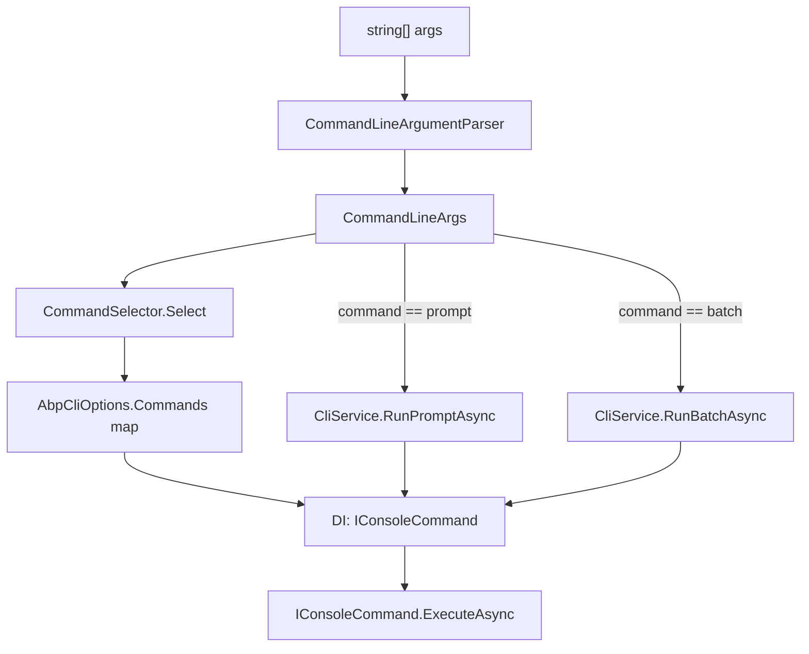

The ABP CLI is a flat list of `IConsoleCommand` implementations under `framework/src/Volo.Abp.Cli.Core/Volo/Abp/Cli/Commands/`. The headline commands — `abp new`, `abp get-source`, `abp login`, `abp add-package`, `abp add-module`, `abp generate-proxy` — are covered on their dedicated pages. This page enumerates everything else: the day-to-day utilities (`clean`, `install-libs`, `clear-download-cache`), the channel switchers (`switch-to-preview`, `switch-to-stable`, `switch-to-nightly`, `switch-to-local`), version-management commands (`update`, `cli`), build/bundle helpers (`build`, `bundle`, `create-migration-and-run-migrator`), and the special `prompt` and `batch` modes implemented directly inside `CliService`. Every entry below is grounded in the source file that owns it.

## Where these commands are registered

Each command exports a `public const string Name` field and is registered in `AbpCliCoreModule.ConfigureServices` via `Configure<AbpCliOptions>`:

```csharp title="framework/src/Volo.Abp.Cli.Core/Volo/Abp/Cli/AbpCliCoreModule.cs"
Configure<AbpCliOptions>(options =>
{
    options.Commands[HelpCommand.Name] = typeof(HelpCommand);
    options.Commands[PromptCommand.Name] = typeof(PromptCommand);
    options.Commands[NewCommand.Name] = typeof(NewCommand);
    options.Commands[GetSourceCommand.Name] = typeof(GetSourceCommand);
    options.Commands[UpdateCommand.Name] = typeof(UpdateCommand);
    options.Commands[AddPackageCommand.Name] = typeof(AddPackageCommand);
    options.Commands[AddModuleCommand.Name] = typeof(AddModuleCommand);
    options.Commands[ListModulesCommand.Name] = typeof(ListModulesCommand);
    options.Commands[ListTemplatesCommand.Name] = typeof(ListTemplatesCommand);
    options.Commands[LoginCommand.Name] = typeof(LoginCommand);
    options.Commands[LoginInfoCommand.Name] = typeof(LoginInfoCommand);
    options.Commands[LogoutCommand.Name] = typeof(LogoutCommand);
    options.Commands[GenerateProxyCommand.Name] = typeof(GenerateProxyCommand);
    options.Commands[RemoveProxyCommand.Name] = typeof(RemoveProxyCommand);
    options.Commands[SuiteCommand.Name] = typeof(SuiteCommand);
    options.Commands[SwitchToPreviewCommand.Name] = typeof(SwitchToPreviewCommand);
    options.Commands[SwitchToStableCommand.Name] = typeof(SwitchToStableCommand);
    options.Commands[SwitchToNightlyCommand.Name] = typeof(SwitchToNightlyCommand);
    options.Commands[SwitchToLocal.Name] = typeof(SwitchToLocal);
    options.Commands[TranslateCommand.Name] = typeof(TranslateCommand);
    options.Commands[BuildCommand.Name] = typeof(BuildCommand);
    options.Commands[BundleCommand.Name] = typeof(BundleCommand);
    options.Commands[CreateMigrationAndRunMigratorCommand.Name] = typeof(CreateMigrationAndRunMigratorCommand);
    options.Commands[InstallLibsCommand.Name] = typeof(InstallLibsCommand);
    options.Commands[CleanCommand.Name] = typeof(CleanCommand);
    options.Commands[CliCommand.Name] = typeof(CliCommand);
    options.Commands[ClearDownloadCacheCommand.Name] = typeof(ClearDownloadCacheCommand);
    ...
});
```

`CommandSelector` reads from that dictionary at runtime and resolves the type from DI:

```csharp title="framework/src/Volo.Abp.Cli.Core/Volo/Abp/Cli/Commands/CommandSelector.cs"
public Type Select(CommandLineArgs commandLineArgs)
{
    if (commandLineArgs.Command.IsNullOrWhiteSpace())
    {
        return typeof(HelpCommand);
    }

    return Options.Commands.GetOrDefault(commandLineArgs.Command)
           ?? typeof(HelpCommand);
}
```

## Full command inventory

| Command | Class | Short description (from `GetShortDescription`) | Page |
| --- | --- | --- | --- |
| `help` | `HelpCommand` | Prints `abp <command> <target> [options]` and the list of registered commands | [overview](/cli/overview) |
| `prompt` | `PromptCommand` | "Starts with prompt mode." Real work lives in `CliService.RunPromptAsync`. | [overview](/cli/overview) |
| `new` | `NewCommand` | Creates an ABP project from a template. | [Project building & templates](/cli/project-building-and-templates) |
| `get-source` | `GetSourceCommand` | Downloads module source code. | [Project building & templates](/cli/project-building-and-templates) |
| `add-package` | `AddPackageCommand` | Adds an ABP package + module dependency to a `.csproj`. | [Project building & templates](/cli/project-building-and-templates) |
| `add-module` | `AddModuleCommand` | Adds an ABP application module to the solution. | [Project building & templates](/cli/project-building-and-templates) |
| `list-modules` | `ListModulesCommand` | "List open source application modules" | this page |
| `list-templates` | `ListTemplatesCommand` | Lists project + module templates. | this page |
| `login` / `logout` / `login-info` | `LoginCommand` etc. | abp.io account session management | [Auth & account](/cli/auth-and-account) |
| `generate-proxy` | `GenerateProxyCommand` | Generates ng/js/csharp client proxies and DTOs. | this page |
| `remove-proxy` | `RemoveProxyCommand` | Removes generated proxies. | this page |
| `suite` | `SuiteCommand` | Installs/updates/starts ABP Suite. | this page |
| `switch-to-preview` | `SwitchToPreviewCommand` | Switches packages to preview ABP version. | this page |
| `switch-to-stable` | `SwitchToStableCommand` | Reverts preview/nightly back to stable. | this page |
| `switch-to-nightly` | `SwitchToNightlyCommand` | Switches packages to nightly preview ABP version. | this page |
| `switch-to-local` | `SwitchToLocal` | Replaces NuGet refs with local project refs. | this page |
| `translate` | `TranslateCommand` | Translates ABP JSON localization resources. | this page |
| `build` | `BuildCommand` | Incremental git-aware build of .NET projects. | this page |
| `bundle` | `BundleCommand` | Bundles 3rd-party CSS/JS for Blazor WASM. | this page |
| `create-migration-and-run-migrator` | `CreateMigrationAndRunMigratorCommand` | Creates EF Core migrations + runs `DbMigrator`. | this page |
| `install-libs` | `InstallLibsCommand` | Installs NPM packages for MVC/Blazor Server. | this page |
| `clean` | `CleanCommand` | Recursively deletes `bin/` and `obj/`. | this page |
| `clear-download-cache` | `ClearDownloadCacheCommand` | Deletes `~/.abp/templates/*.zip`. | this page |
| `cli` | `CliCommand` | Updates/removes the ABP CLI itself. | this page |
| `batch` | (none — handled in `CliService`) | Runs a file of CLI command lines. | this page |

<Note>
  There is no `BatchSubModuleAddCommand` or `AddBundleStep` in this repository. The closest functionality is `BundleCommand` (this page) and the project-building "step" pipeline documented on [Project building & templates](/cli/project-building-and-templates). `batch` is not a registered `IConsoleCommand` — it is special-cased in `CliService.RunAsync` / `RunBatchAsync`.
</Note>

## Filesystem cleanup utilities

### `abp clean`

`CleanCommand` walks the current directory looking for any folder named `bin` or `obj` and deletes them, skipping anything under `node_modules`.

```csharp title="framework/src/Volo.Abp.Cli.Core/Volo/Abp/Cli/Commands/CleanCommand.cs"
public Task ExecuteAsync(CommandLineArgs commandLineArgs)
{
    var binEntries = Directory.EnumerateDirectories(
        Directory.GetCurrentDirectory(), "bin", SearchOption.AllDirectories);
    var objEntries = Directory.EnumerateDirectories(
        Directory.GetCurrentDirectory(), "obj", SearchOption.AllDirectories);

    foreach (var path in binEntries.Concat(objEntries))
    {
        if (path.IndexOf("node_modules", StringComparison.OrdinalIgnoreCase) > 0)
        {
            Logger.LogInformation($"Skipping: {path}");
        }
        else
        {
            Logger.LogInformation($"Deleting: {path}");
            Directory.Delete(path, true);
        }
    }
    ...
}
```

No options, no target. The skip for `node_modules` is the only safeguard against blowing away frontend dependencies that happen to ship sample `bin/` directories.

### `abp clear-download-cache`

`ClearDownloadCacheCommand` removes cached template zips from `CliPaths.TemplateCache` (`~/.abp/templates/`):

```csharp title="framework/src/Volo.Abp.Cli.Core/Volo/Abp/Cli/Commands/ClearDownloadCacheCommand.cs"
public async Task ExecuteAsync(CommandLineArgs commandLineArgs)
{
    Logger.LogInformation("Clearing the templates download cache...");
    foreach (var cacheFile in Directory.GetFiles(CliPaths.TemplateCache, "*.zip"))
    {
        Logger.LogInformation($"Deleting {cacheFile}");
        try
        {
            File.Delete(cacheFile);
        }
        catch (Exception e)
        {
            Logger.LogError(e, $"Could not delete {cacheFile}");
        }
    }
    Logger.LogInformation("Done.");
    await Task.CompletedTask;
}
```

Each delete is wrapped in `try/catch` so a single locked file does not abort the sweep. Useful when a corrupted template download keeps producing the same broken project (see `AbpCliOptions.CacheTemplates`, which defaults to `true`).

## NPM-related utilities

### `abp install-libs`

`InstallLibsCommand` delegates entirely to `IInstallLibsService`. The command parses an optional working directory and hands the rest off to the service:

```csharp title="framework/src/Volo.Abp.Cli.Core/Volo/Abp/Cli/Commands/InstallLibsCommand.cs"
public async Task ExecuteAsync(CommandLineArgs commandLineArgs)
{
    var workingDirectoryArg = commandLineArgs.Options.GetOrNull(
        Options.WorkingDirectory.Short,
        Options.WorkingDirectory.Long
    );

    var workingDirectory = workingDirectoryArg ?? Directory.GetCurrentDirectory();

    if (!Directory.Exists(workingDirectory))
    {
        throw new CliUsageException(
            "Specified directory does not exist." +
            Environment.NewLine + Environment.NewLine +
            GetUsageInfo()
        );
    }

    await InstallLibsService.InstallLibsAsync(workingDirectory);
}
```

The service lives in `Volo/Abp/Cli/LIbs/InstallLibsService.cs` (note the capitalisation — the namespace is `Volo.Abp.Cli.LIbs`, an accident preserved for binary compatibility). Its job is to find every project under the directory, ensure NPM is installed via `NpmHelper.IsNpmInstalled()`, then copy resources from `node_modules` into `wwwroot/libs` based on `abp.resourcemapping.js` files.

| Option | Short | Long | Purpose |
| --- | --- | --- | --- |
| Working directory | `-wd` | `--working-directory` | Defaults to `Directory.GetCurrentDirectory()` |

Supporting types:

| Type | File | Role |
| --- | --- | --- |
| `IInstallLibsService` | `LIbs/IInstallLibsService.cs` | Service contract |
| `InstallLibsService` | `LIbs/InstallLibsService.cs` | Resource-mapping pipeline |
| `ResourceMapping` | `LIbs/ResourceMapping.cs` | Aliases (`@node_modules`, `@libs`), clean list, mappings dictionary |
| `FileMatchResult` | `LIbs/FileMatchResult.cs` | Glob match result |
| `NpmHelper` | `Utils/NpmHelper.cs` | Detects npm/yarn, runs `npm install`, `yarn add`, etc. |

`InstallLibsService` excludes a small list of directories to keep the scan reasonable:

```csharp title="framework/src/Volo.Abp.Cli.Core/Volo/Abp/Cli/LIbs/InstallLibsService.cs"
private readonly static List<string> ExcludeDirectory = new List<string>()
{
    "node_modules",
    ".git",
    ".idea",
    Path.Combine("bin", "debug"),
    Path.Combine("obj", "debug")
};
```

`LibsDirectory` is the destination under each project: `./wwwroot/libs`.

## Translation utilities

### `abp translate`

`TranslateCommand` operates in two modes selected by the `--apply` / `-a` flag:

| Mode | Trigger | What it does |
| --- | --- | --- |
| Export | (default) | Walks JSON localization files under the current directory, builds an `AbpTranslateInfo` containing every untranslated (or all) key, and writes it to `abp-translation.json` (or `--output`). |
| Apply | `--apply` / `-a` | Reads `abp-translation.json` (or `--file`) and writes the translated values back into the matching resource files for the target culture. |

```csharp title="framework/src/Volo.Abp.Cli.Core/Volo/Abp/Cli/Commands/TranslateCommand.cs"
var apply = commandLineArgs.Options.ContainsKey(Options.Apply.Short)
         || commandLineArgs.Options.ContainsKey(Options.Apply.Long);
if (apply)
{
    var inputFile = Path.Combine(currentDirectory,
        commandLineArgs.Options.GetOrNull(Options.File.Short, Options.File.Long)
        ?? "abp-translation.json");

    Logger.LogInformation("Abp translate apply...");
    Logger.LogInformation("Input file: " + inputFile);

    ApplyAbpTranslateInfo(currentDirectory, inputFile);
}
else
{
    var targetCulture = commandLineArgs.Options.GetOrNull(
        Options.Culture.Short, Options.Culture.Long);
    ...
}
```

Public sub-types live on the command itself:

```csharp title="framework/src/Volo.Abp.Cli.Core/Volo/Abp/Cli/Commands/TranslateCommand.cs"
public class AbpTranslateInfo
{
    public string ReferenceCulture { get; set; }
    public string TargetCulture { get; set; }
    public List<AbpTranslateResource> Resources { get; set; }
}
public class AbpTranslateResource
{
    public string ResourcePath { get; set; }
    public List<AbpTranslateResourceText> Texts { get; set; }
}
public class AbpTranslateResourceText
{
    public string LocalizationKey { get; set; }
    public string Reference { get; set; }
    public string Target { get; set; }
}
```

Options (lifted verbatim from `GetUsageInfo()`):

| Short | Long | Default | Notes |
| --- | --- | --- | --- |
| `-c` | `--culture` | required | Target culture, e.g. `zh-Hans` |
| `-r` | `--reference-culture` | `en` | Source-of-truth culture |
| `-o` | `--output` | `abp-translation.json` | Export file path |
| `-all` | `--all-values` | `false` | Include every key, not just missing ones |
| `-a` | `--apply` | n/a | Switches to apply mode |
| `-f` | `--file` | `abp-translation.json` | Apply-mode input file |

`SortLocalizedKeys` re-orders the target file to match the reference culture, which keeps PR diffs minimal when translators only fill in new keys.

## Version and channel switchers

The three "switch-to" commands all delegate to `PackagePreviewSwitcher` (defined under `Volo/Abp/Cli/ProjectModification`). The commands themselves are tiny:

```csharp title="framework/src/Volo.Abp.Cli.Core/Volo/Abp/Cli/Commands/SwitchToPreviewCommand.cs"
public class SwitchToPreviewCommand : IConsoleCommand, ITransientDependency
{
    public const string Name = "switch-to-preview";

    private readonly PackagePreviewSwitcher _packagePreviewSwitcher;

    public SwitchToPreviewCommand(PackagePreviewSwitcher packagePreviewSwitcher)
    {
        _packagePreviewSwitcher = packagePreviewSwitcher;
    }

    public async Task ExecuteAsync(CommandLineArgs commandLineArgs)
    {
        await _packagePreviewSwitcher.SwitchToPreview(commandLineArgs);
    }
    ...
}
```

`SwitchToStableCommand` and `SwitchToNightlyCommand` are structurally identical, calling `SwitchToStable` and `SwitchToNightlyPreview` respectively. All three accept a `-d|--directory` option.

| Command | Channel | Short description |
| --- | --- | --- |
| `switch-to-preview` | preview | "Switches packages to preview ABP version." |
| `switch-to-stable` | stable | "Switches packages to stable ABP version from preview version." |
| `switch-to-nightly` | nightly | "Switches packages to nightly preview ABP version." |

### `abp switch-to-local`

This one is not a channel switcher — it rewrites NuGet `<PackageReference>` entries as `<ProjectReference>` entries pointing at a local clone of the ABP source tree. It is implemented as `SwitchToLocal` (note: the class name has no `Command` suffix, but `Name = "switch-to-local"`):

```csharp title="framework/src/Volo.Abp.Cli.Core/Volo/Abp/Cli/Commands/SwitchToLocalCommand.cs"
public class SwitchToLocal : IConsoleCommand, ITransientDependency
{
    private readonly LocalReferenceConverter _localReferenceConverter;
    public const string Name = "switch-to-local";

    public async Task ExecuteAsync(CommandLineArgs commandLineArgs)
    {
        var workingDirectory = GetWorkingDirectory(commandLineArgs)
                               ?? Directory.GetCurrentDirectory();

        if (!Directory.Exists(workingDirectory))
        {
            throw new CliUsageException(
                "Specified directory does not exist." + ... + GetUsageInfo()
            );
        }

        await _localReferenceConverter.ConvertAsync(workingDirectory, GetPaths(commandLineArgs));
    }
    ...
}
```

Options:

| Short | Long | Required | Purpose |
| --- | --- | --- | --- |
| `-s` | `--solution` | No | `.sln` / `.csproj` / directory. If a file is passed, its directory is used. Defaults to current directory. |
| `-p` | `--paths` | **Yes** | Pipe-delimited list of local repository roots. Example: `D:\Github\abp\|D:\Github\volo` |

Example usage from the source:

```
abp switch-to-local --paths D:\Github\abp
abp switch-to-local --paths D:\Github\abp --solution D:\test\MyProject
abp switch-to-local --paths "D:\Github\abp|D:\Github\volo"
```

## `abp update`

`UpdateCommand` updates **all** Volo NuGet and NPM packages in a solution or single project to the latest (or pinned) version. Behavior depends on `--npm` / `--nuget`:

| Flags | What runs |
| --- | --- |
| neither | both NuGet and NPM update passes |
| `--npm` only | only `NpmPackagesUpdater.Update` |
| `--nuget` only | only `VoloNugetPackagesVersionUpdater` |

```csharp title="framework/src/Volo.Abp.Cli.Core/Volo/Abp/Cli/Commands/UpdateCommand.cs"
public async Task ExecuteAsync(CommandLineArgs commandLineArgs)
{
    var updateNpm = commandLineArgs.Options.ContainsKey(Options.Packages.Npm);
    var updateNuget = commandLineArgs.Options.ContainsKey(Options.Packages.NuGet);

    var directory = commandLineArgs.Options.GetOrNull(Options.SolutionPath.Short, Options.SolutionPath.Long)
                    ?? Directory.GetCurrentDirectory();
    var version = commandLineArgs.Options.GetOrNull(Options.Version.Short, Options.Version.Long);

    if (updateNuget || !updateNpm)
    {
        await UpdateNugetPackages(commandLineArgs, directory, version);
    }

    if (updateNpm || !updateNuget)
    {
        await UpdateNpmPackages(directory, version);
    }
}
```

When no solution is specified, the command searches recursively for any `.sln` and updates each:

```csharp
solutions.AddRange(Directory.GetFiles(directory, "*.sln", SearchOption.AllDirectories));
```

Options:

| Short | Long | Purpose |
| --- | --- | --- |
| `-p` | `--include-previews` | Allow preview versions (if template supports it) |
| n/a | `--npm` | Only update NPM packages |
| n/a | `--nuget` | Only update NuGet packages |
| `-sp` | `--solution-path` | Directory to search for solutions |
| `-sn` | `--solution-name` | Specific `.sln` to update |
| n/a | `--check-all` | Check each package separately (slower but more thorough) |
| `-v` | `--version` | Target version (default: latest) |

## `abp cli` and `abp suite`

These two commands manage the ABP toolchain itself.

### `abp cli`

`CliCommand` updates or removes the ABP CLI dotnet global tool. It dispatches on the target argument:

```csharp title="framework/src/Volo.Abp.Cli.Core/Volo/Abp/Cli/Commands/CliCommand.cs"
public async Task ExecuteAsync(CommandLineArgs commandLineArgs)
{
    var operationType = NamespaceHelper.NormalizeNamespace(commandLineArgs.Target);
    var preview = commandLineArgs.Options.ContainsKey(Options.Preview.Short) ||
                  commandLineArgs.Options.ContainsKey(Options.Preview.Long);

    var version = commandLineArgs.Options.GetOrNull(Options.Version.Short, Options.Version.Long);

    switch (operationType)
    {
        case "":
        case null:
            _cmdHelper.RunCmd("abp");
            break;

        case "update":
            await UpdateCliAsync(version, preview);
            break;

        case "remove":
            RemoveCli();
            break;
    }
}
```

Targets:

| Target | Effect |
| --- | --- |
| _(none)_ | Re-execs `abp` (typically prints help). |
| `update` | Runs `dotnet tool update -g Volo.Abp.Cli [--version X] [--add-source <nightly-feed>]`. |
| `remove` | Uninstalls the global tool. |

`PackageVersionCheckerService` is consulted to resolve "latest" when no `--version` is supplied. `AbpNuGetIndexUrlService` provides the commercial feed URL when needed.

### `abp suite`

`SuiteCommand` installs, updates, removes, or launches ABP Suite as a `dotnet` global tool. It requires the user to be logged in (`AuthService.GetLoginInfoAsync`) and have a non-empty organization.

```csharp title="framework/src/Volo.Abp.Cli.Core/Volo/Abp/Cli/Commands/SuiteCommand.cs"
#if !DEBUG
var loginInfo = await _authService.GetLoginInfoAsync();

if (string.IsNullOrEmpty(loginInfo?.Organization))
{
    throw new CliUsageException("Please login with your account.");
}
#endif

var operationType = NamespaceHelper.NormalizeNamespace(commandLineArgs.Target);

var preview = commandLineArgs.Options.ContainsKey(Options.Preview.Short) ||
              commandLineArgs.Options.ContainsKey(Options.Preview.Long);

var version = commandLineArgs.Options.GetOrNull(Options.Version.Short, Options.Version.Long);
var currentSuiteVersionAsString = GetCurrentSuiteVersion();

switch (operationType)
{
    ...
}
```

Targets, options, and side effects:

| Target | Options | Effect |
| --- | --- | --- |
| _(none)_ | n/a | Starts Suite on port 3000 unless already running. |
| `install` | `-p|--preview`, `-v|--version` | Installs `Volo.Abp.Suite` via the commercial NuGet feed obtained from `AbpNuGetIndexUrlService`. |
| `update` | `-p|--preview` | Updates the installed Suite tool. |
| `remove` | n/a | Uninstalls the Suite tool and kills lingering `abp-suite` processes. |

`SuiteCommand` also has `Crud.Solution` (`-s`) and `Crud.Entity` (`-e`) option groups reserved for CRUD-generation sub-commands.

Supporting services:

| Service | File | Role |
| --- | --- | --- |
| `AbpNuGetIndexUrlService` | `Commands/Services/AbpNuGetIndexUrlService.cs` | Resolves the commercial NuGet feed URL |
| `PackageVersionCheckerService` | `Version/PackageVersionCheckerService.cs` | Looks up the latest Suite version |
| `SuiteAppSettingsService` | `Commands/Services/SuiteAppSettingsService.cs` | Manages Suite's local `appsettings.json` |
| `AuthService` | `Auth/AuthService.cs` | Gating login check |

## Listing helpers

### `abp list-modules`

Reads `ModuleInfoProvider.GetModuleListAsync()` and prints two columns. Pro modules are hidden behind `--include-pro-modules`:

```csharp title="framework/src/Volo.Abp.Cli.Core/Volo/Abp/Cli/Commands/ListModulesCommand.cs"
var modules = await ModuleInfoProvider.GetModuleListAsync();
var freeModules = modules.Where(m => !m.IsPro).ToList();
var proModules  = modules.Where(m => m.IsPro).ToList();

output.AppendLine("Open Source Application Modules");
foreach (var module in freeModules)
{
    output.AppendLine($"> {module.DisplayName.PadRight(50)} ({module.Name})");
}

if (commandLineArgs.Options.ContainsKey("include-pro-modules"))
{
    output.AppendLine("Commercial (Pro) Application Modules");
    foreach (var module in proModules)
    {
        output.AppendLine($"> {module.DisplayName.PadRight(50)} ({module.Name})");
    }
}
```

### `abp list-templates`

Fetches `${CliUrls.WwwAbpIo}api/download/templates/` via `CliHttpClientFactory` and prints a three-column table (`Template`, `Template Name`, `Document Url`). The deserialization target is `TemplateInfo` from `Volo/Abp/Cli/Commands/Templates/TemplateInfo.cs`.

## Service-proxy commands

`GenerateProxyCommand` and `RemoveProxyCommand` both extend `ProxyCommandBase<T>`. The base class accepts a `-t|--type` flag (`ng`, `js`, `csharp`) and dispatches to one of the generators registered in `AbpCliServiceProxyOptions`:

```csharp title="framework/src/Volo.Abp.Cli.Core/Volo/Abp/Cli/AbpCliCoreModule.cs"
Configure<AbpCliServiceProxyOptions>(options =>
{
    options.Generators[JavaScriptServiceProxyGenerator.Name] = typeof(JavaScriptServiceProxyGenerator);
    options.Generators[AngularServiceProxyGenerator.Name] = typeof(AngularServiceProxyGenerator);
    options.Generators[CSharpServiceProxyGenerator.Name] = typeof(CSharpServiceProxyGenerator);
});
```

Concrete subclasses only customise the help text and short description:

```csharp title="framework/src/Volo.Abp.Cli.Core/Volo/Abp/Cli/Commands/GenerateProxyCommand.cs"
public class GenerateProxyCommand : ProxyCommandBase<GenerateProxyCommand>
{
    public const string Name = "generate-proxy";

    public override string GetShortDescription()
    {
        return "Generates client service proxies and DTOs to consume HTTP APIs.";
    }
}
```

Examples printed by `GenerateProxyCommand.GetUsageInfo()`:

```
abp generate-proxy -t ng
abp generate-proxy -t js -m identity -o Pages/Identity/client-proxies.js -url https://localhost:44302/
abp generate-proxy -t csharp --folder MyProxies/InnerFolder -url https://localhost:44302/
abp generate-proxy -t csharp -url https://localhost:44302/ --without-contracts
```

`RemoveProxyCommand` mirrors the same shape but removes the generated files.

## Build and bundle utilities

### `abp build`

`BuildCommand` is the most state-aware of the lot. It implements an incremental, git-diff-driven build that only rebuilds projects whose source has changed since the last green status.

```csharp title="framework/src/Volo.Abp.Cli.Core/Volo/Abp/Cli/Commands/BuildCommand.cs"
var buildConfig = DotNetProjectBuildConfigReader.Read(workingDirectory ?? Directory.GetCurrentDirectory());
buildConfig.BuildName = buildName;
buildConfig.ForceBuild = forceBuild;

if (string.IsNullOrEmpty(buildConfig.SlFilePath))
{
    var changedProjectFiles = ChangedProjectFinder.FindByRepository(buildConfig);

    var buildSucceededProjects = DotNetProjectBuilder.BuildProjects(
        changedProjectFiles,
        dotnetBuildArguments ?? ""
    );

    var buildStatus = BuildStatusGenerator.Generate(
        buildConfig,
        changedProjectFiles,
        buildSucceededProjects
    );

    RepositoryBuildStatusStore.Set(buildName, buildConfig.GitRepository, buildStatus);
}
else
{
    DotNetProjectBuilder.BuildSolution(
        buildConfig.SlFilePath,
        dotnetBuildArguments ?? ""
    );
}
```

The supporting types in `Volo/Abp/Cli/Build/`:

| Type | Role |
| --- | --- |
| `IDotNetProjectBuilder` / `DefaultDotNetProjectBuilder` | Runs `dotnet build` for each project |
| `IChangedProjectFinder` / `DefaultChangedProjectFinder` | Uses git history to find projects touched since the last success |
| `IBuildStatusGenerator` / `DefaultBuildStatusGenerator` | Computes the new build-status record |
| `IRepositoryBuildStatusStore` / `FileSystemRepositoryBuildStatusStore` | Stores status under `CliPaths.Build` (`~/.abp/build`) |
| `IDotNetProjectBuildConfigReader` / `FileSystemDotNetProjectBuildConfigReader` | Reads an `abp-build-config.json`-style file |
| `IBuildProjectListSorter` / `DefaultBuildProjectListSorter` | Sorts by dependency order |
| `IGitRepositoryHelper` / `GitRepositoryHelper` | Wraps git plumbing |

Options:

| Short | Long | Purpose |
| --- | --- | --- |
| `-wd` | `--working-directory` | Override the build root |
| `-dba` | `--dotnet-build-args` | Forwarded to `dotnet build` |
| `-bn` | `--build-name` | Logical build name (keyed inside the status store) |
| `-f` | `--force-build` | Ignore the previous status and rebuild everything |

### `abp bundle`

`BundleCommand` calls `IBundlingService.BundleAsync` to produce the third-party CSS/JS bundles for Blazor WASM and to patch `index.html`:

```csharp title="framework/src/Volo.Abp.Cli.Core/Volo/Abp/Cli/Commands/BundleCommand.cs"
public async Task ExecuteAsync(CommandLineArgs commandLineArgs)
{
    var workingDirectoryArg = commandLineArgs.Options.GetOrNull(
        Options.WorkingDirectory.Short, Options.WorkingDirectory.Long);

    var workingDirectory = workingDirectoryArg ?? Directory.GetCurrentDirectory();

    var forceBuild = commandLineArgs.Options.ContainsKey(Options.ForceBuild.Short) ||
                     commandLineArgs.Options.ContainsKey(Options.ForceBuild.Long);

    var projectType = GetProjectType(commandLineArgs);

    if (!Directory.Exists(workingDirectory))
    {
        throw new CliUsageException(...);
    }

    try
    {
        await BundlingService.BundleAsync(workingDirectory, forceBuild, projectType);
    }
    catch (BundlingException ex)
    {
        Logger.LogError(ex.Message);
    }
}
```

Bundling internals (in `Volo/Abp/Cli/Bundling/`):

| Type | Role |
| --- | --- |
| `IBundlingService` / `BundlingService` | Orchestrates style + script bundling |
| `IStyleBundler` / `StyleBundler` | CSS bundler |
| `IScriptBundler` / `ScriptBundler` | JS bundler |
| `BundlerBase` | Shared concat/minify pipeline |
| `BundleConfig` / `BundleTypeDefinition` / `BundleOptions` | Configuration |
| `BundlingMode` enum | `BundleAndMinify`, `Bundle`, `None` |
| `BundlingConsts` | Path constants |
| `BundlingException` | Bundler-specific exception that the command catches |
| `PathHelper` (in `Bundling/`) | Path normalisation helper |
| `CssRelativePathAdjuster` | Rewrites `url(...)` references during bundling |

Options:

| Short | Long | Default | Purpose |
| --- | --- | --- | --- |
| `-wd` | `--working-directory` | empty | Project root |
| `-f` | `--force` | `false` | Skip up-to-date checks |
| `-t` | `--project-type` | `webassembly` | Bundle profile |

## EF Core migration helper

`abp create-migration-and-run-migrator` chains two side effects: it creates an initial EF Core migration in the target `DbMigrations` folder, then runs the project marked as the `DbMigrator`.

```csharp title="framework/src/Volo.Abp.Cli.Core/Volo/Abp/Cli/Commands/CreateMigrationAndRunMigratorCommand.cs"
public virtual async Task ExecuteAsync(CommandLineArgs commandLineArgs)
{
    if (commandLineArgs.Target.IsNullOrEmpty())
    {
        throw new CliUsageException("DbMigrations folder path is missing!");
    }

    var dbMigrationsFolder = commandLineArgs.Target;

    var nolayers = commandLineArgs.Options.ContainsKey("nolayers");
    var dbMigratorProjectPath = GetDbMigratorProjectPath(dbMigrationsFolder);
    if (!nolayers && dbMigratorProjectPath == null)
    {
        throw new Exception("DbMigrator is not found!");
    }

    await DotnetEfToolManager.BeSureInstalledAsync();

    var migrationsCreatedSuccessfully = await _initialMigrationCreator.CreateAsync(
        commandLineArgs.Target, !nolayers);

    if (migrationsCreatedSuccessfully)
    {
        if (nolayers)
        {
            CmdHelper.RunCmd("dotnet run --migrate-database",
                Path.GetDirectoryName(Path.Combine(dbMigrationsFolder, "MyCompanyName.MyProjectName")));
        }
        else
        {
            CmdHelper.RunCmd("dotnet run", Path.GetDirectoryName(dbMigratorProjectPath));
        }
        await Task.CompletedTask;
    }
    else
    {
        var exceptionMsg = "Migrations failed! A migration command didn't run successfully.";
        Logger.LogError(exceptionMsg);
        throw new Exception(exceptionMsg);
    }
}
```

Supporting services in `Commands/Services/`:

| Service | Role |
| --- | --- |
| `InitialMigrationCreator` | Wraps `dotnet ef migrations add` |
| `DotnetEfToolManager` | Ensures `dotnet-ef` is installed (`BeSureInstalledAsync`) |
| `ConnectionStringProvider` | Reads the migration connection string |

Single positional argument: the `DbMigrations` folder path. Single flag: `--nolayers` (used for single-project layouts).

## `abp prompt` and `abp batch`

Both are wired through `CliService.RunAsync`, not through the standard command pipeline.

### `abp prompt`

`PromptCommand` itself is a no-op; the real loop lives in `CliService.RunPromptAsync`:

```csharp title="framework/src/Volo.Abp.Cli.Core/Volo/Abp/Cli/CliService.cs"
private async Task RunPromptAsync()
{
    string GetPromptInput()
    {
        Console.WriteLine("Enter the command to execute or `exit` to exit the prompt model");
        Console.Write("> ");
        return Console.ReadLine();
    }

    var promptInput = GetPromptInput();
    do
    {
        try
        {
            var commandLineArgs = CommandLineArgumentParser.Parse(
                promptInput.Split(" ").Where(x => !x.IsNullOrWhiteSpace()).ToArray());

            if (commandLineArgs.IsCommand("batch"))
            {
                await RunBatchAsync(commandLineArgs);
            }
            else
            {
                await RunInternalAsync(commandLineArgs);
            }
        }
        ...
        promptInput = GetPromptInput();
    } while (promptInput?.ToLower() != "exit");
}
```

Each iteration parses the input as if it were a fresh CLI invocation and dispatches via `CommandSelector`. Type `exit` to leave.

### `abp batch <file>`

Reads a UTF-8 text file where each line is a separate `abp` command. Lines beginning with `#` and inline comments are stripped. There is no `BatchCommand` class — `CliService.RunAsync` checks the command name directly:

```csharp title="framework/src/Volo.Abp.Cli.Core/Volo/Abp/Cli/CliService.cs"
private async Task RunBatchAsync(CommandLineArgs commandLineArgs)
{
    var targetFile = commandLineArgs.Target;
    if (targetFile.IsNullOrWhiteSpace())
    {
        throw new CliUsageException(
            "Must provide a file name/path that contains a list of commands" +
            Environment.NewLine + Environment.NewLine +
            "Example: " +
            "  abp batch commands.txt");
    }

    var filePath = Path.Combine(Directory.GetCurrentDirectory(), targetFile);
    var fileLines = File.ReadAllLines(filePath);
    foreach (var line in fileLines)
    {
        var lineText = line;
        if (lineText.IsNullOrWhiteSpace() || lineText.StartsWith("#"))
        {
            continue;
        }

        if (lineText.Contains('#'))
        {
            lineText = lineText.Substring(0, lineText.IndexOf('#'));
        }

        var args = CommandLineArgumentParser.Parse(lineText);
        await RunInternalAsync(args);
    }
}
```

Example `commands.txt`:

```bash
# Bootstrap a microservice template
new Acme.Orders -t app-pro -u angular -d ef
add-module Volo.LeptonXTheme.Pro -s Acme.Orders.sln
install-libs -wd src/Acme.Orders.Web
```

`abp batch commands.txt` runs each line in sequence under the same `CliService` process, so they all share the same logging configuration and DI scope behavior.

## Dispatch overview



## Related pages

<CardGroup cols={2}>
  <Card title="CLI overview" icon="terminal" href="/cli/overview">
    Entry point, hosting, DI registration, and how `CliService` dispatches into `IConsoleCommand` instances.
  </Card>
  <Card title="Project building & templates" icon="cube" href="/cli/project-building-and-templates">
    `abp new`, `abp get-source`, `abp add-package`, `abp add-module`, and the project-building step pipeline.
  </Card>
  <Card title="Auth & account" icon="key" href="/cli/auth-and-account">
    Required for `abp suite`, `abp get-source` (private modules), and any commercial NuGet feed lookups.
  </Card>
  <Card title="CLI shared module" icon="cube" href="/cli/cli-shared-module">
    `CmdHelper`, `NpmHelper`, `CliPaths`, and other shared utilities consumed by every command above.
  </Card>
</CardGroup>
