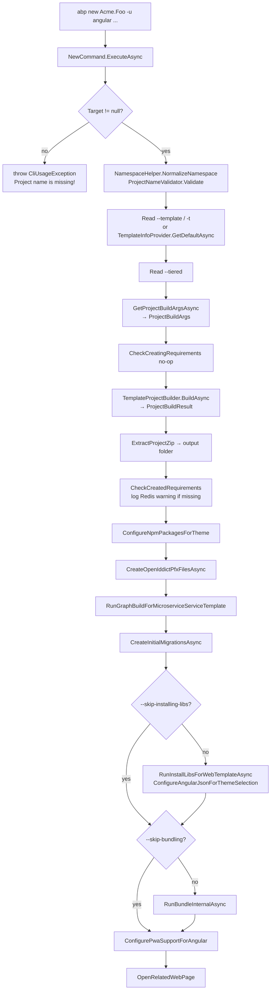
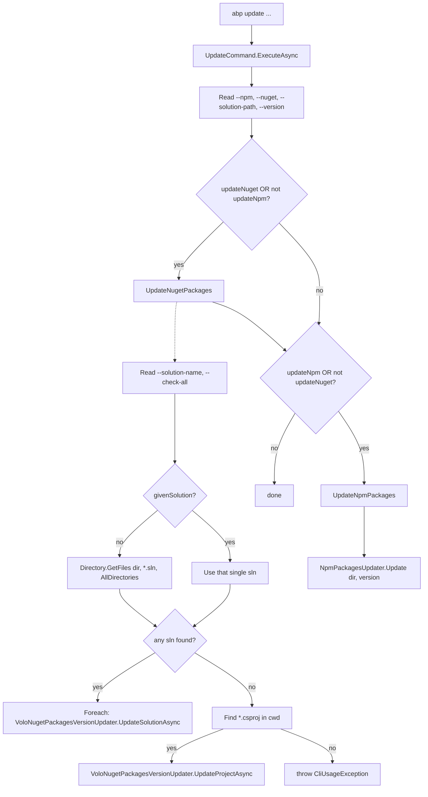

`abp new` and `abp update` are the two verbs that bracket a solution's life: one materialises the project from a startup template, the other walks every `*.sln` / `*.csproj` / `package.json` underneath the working directory and bumps ABP package versions in place. They share the same parser, the same `IConsoleCommand` contract, and the same logging conventions, but their internals diverge sharply — `NewCommand` orchestrates a multi-step build/extract/install/bundle pipeline, while `UpdateCommand` is essentially a thin façade in front of `VoloNugetPackagesVersionUpdater` and `NpmPackagesUpdater`.

<Info>
Sources: `framework/src/Volo.Abp.Cli.Core/Volo/Abp/Cli/Commands/NewCommand.cs`, `ProjectCreationCommandBase.cs`, `UpdateCommand.cs`. The deeper template machinery (`TemplateProjectBuilder`, `ITemplateInfoProvider`, etc.) lives under `Volo/Abp/Cli/ProjectBuilding/` and is the subject of [Project building and templates](/cli/project-building-and-templates).
</Info>

## File inventory

| File | Class | Verb / role |
| --- | --- | --- |
| `Commands/NewCommand.cs` | `NewCommand` | `new`. Top-level orchestrator for project creation. |
| `Commands/ProjectCreationCommandBase.cs` | `ProjectCreationCommandBase` (abstract) | Shared option parsing (`GetProjectBuildArgsAsync`), zip extraction, npm/PWA/bundle post-steps, migration creation. Also defines the canonical `static class Options` for project flags. |
| `Commands/UpdateCommand.cs` | `UpdateCommand` | `update`. Iterates solutions or projects under a directory; delegates to NuGet/npm updater services. |
| `ProjectModification/VoloNugetPackagesVersionUpdater.cs` | `VoloNugetPackagesVersionUpdater` | Rewrites `<PackageReference>` versions for any `Volo.*` package in a `.csproj` or `.sln`. Injected by `UpdateCommand`. |
| `ProjectModification/NpmPackagesUpdater.cs` | `NpmPackagesUpdater` | Walks `package.json` files and rewrites `@abp/*` and `@volo/*` versions. Injected by `UpdateCommand`. |

## abp new — execution flow



## NewCommand declaration

```csharp Volo.Abp.Cli.Core/Volo/Abp/Cli/Commands/NewCommand.cs
public class NewCommand : ProjectCreationCommandBase, IConsoleCommand, ITransientDependency
{
    public const string Name = "new";

    protected TemplateProjectBuilder TemplateProjectBuilder { get; }
    public ITemplateInfoProvider TemplateInfoProvider { get; }

    public NewCommand(
        ConnectionStringProvider connectionStringProvider,
        SolutionPackageVersionFinder solutionPackageVersionFinder,
        ICmdHelper cmdHelper,
        IInstallLibsService installLibsService,
        CliService cliService,
        AngularPwaSupportAdder angularPwaSupportAdder,
        InitialMigrationCreator initialMigrationCreator,
        ThemePackageAdder themePackageAdder,
        ILocalEventBus eventBus,
        IBundlingService bundlingService,
        ITemplateInfoProvider templateInfoProvider,
        TemplateProjectBuilder templateProjectBuilder,
        AngularThemeConfigurer angularThemeConfigurer) :
        base(connectionStringProvider,
            solutionPackageVersionFinder,
            cmdHelper,
            installLibsService,
            cliService,
            angularPwaSupportAdder,
            initialMigrationCreator,
            themePackageAdder,
            eventBus,
            bundlingService,
            angularThemeConfigurer)
    {
        TemplateInfoProvider = templateInfoProvider;
        TemplateProjectBuilder = templateProjectBuilder;
    }
```

The constructor lists every collaborator the orchestration needs, which is essentially the union of "things a real solution touches": NuGet versions, npm libs, theme files, migrations, bundling, the PWA adder for Angular, and an `ILocalEventBus` to publish progress events. All but the last three are forwarded to `ProjectCreationCommandBase` and stored as protected properties so subclasses can reuse them.

## NewCommand.ExecuteAsync

```csharp Volo.Abp.Cli.Core/Volo/Abp/Cli/Commands/NewCommand.cs
public async Task ExecuteAsync(CommandLineArgs commandLineArgs)
{
    var projectName = NamespaceHelper.NormalizeNamespace(commandLineArgs.Target);
    if (string.IsNullOrWhiteSpace(projectName))
    {
        throw new CliUsageException("Project name is missing!" + Environment.NewLine + Environment.NewLine + GetUsageInfo());
    }

    ProjectNameValidator.Validate(projectName);

    Logger.LogInformation("Creating your project...");
    Logger.LogInformation("Project name: " + projectName);

    var template = commandLineArgs.Options.GetOrNull(Options.Template.Short, Options.Template.Long);
    if (template != null)
    {
        Logger.LogInformation("Template: " + template);
    }
    else
    {
        template = (await TemplateInfoProvider.GetDefaultAsync()).Name;
    }

    var isTiered = commandLineArgs.Options.ContainsKey(Options.Tiered.Long);
    if (isTiered)
    {
        Logger.LogInformation("Tiered: yes");
    }

    var projectArgs = await GetProjectBuildArgsAsync(commandLineArgs, template, projectName);

    await CheckCreatingRequirements(projectArgs);

    var result = await TemplateProjectBuilder.BuildAsync(
        projectArgs
    );

    ExtractProjectZip(result, projectArgs.OutputFolder);

    Logger.LogInformation($"'{projectName}' has been successfully created to '{projectArgs.OutputFolder}'");

    await CheckCreatedRequirements(projectArgs);

    ConfigureNpmPackagesForTheme(projectArgs);
    await CreateOpenIddictPfxFilesAsync(projectArgs);
    await RunGraphBuildForMicroserviceServiceTemplate(projectArgs);
    await CreateInitialMigrationsAsync(projectArgs);

    var skipInstallLibs = commandLineArgs.Options.ContainsKey(Options.SkipInstallingLibs.Long) || commandLineArgs.Options.ContainsKey(Options.SkipInstallingLibs.Short);
    if (!skipInstallLibs)
    {
        await RunInstallLibsForWebTemplateAsync(projectArgs);
        ConfigureAngularJsonForThemeSelection(projectArgs);
    }

    var skipBundling = commandLineArgs.Options.ContainsKey(Options.SkipBundling.Long) || commandLineArgs.Options.ContainsKey(Options.SkipBundling.Short);
    if (!skipBundling)
    {
        await RunBundleInternalAsync(projectArgs);
    }

    await ConfigurePwaSupportForAngular(projectArgs);

    OpenRelatedWebPage(projectArgs, template, isTiered, commandLineArgs);
}
```

| Step | What it does | Failure mode |
| --- | --- | --- |
| `NamespaceHelper.NormalizeNamespace(commandLineArgs.Target)` | Returns `null` if `Target` is null/blank; otherwise trims and normalises namespace casing. | Empty result ⇒ `CliUsageException("Project name is missing!" + GetUsageInfo())`. |
| `ProjectNameValidator.Validate` | Rejects names with illegal characters, reserved words, etc. | Throws `CliUsageException` with the rule it broke. |
| Read `-t`/`--template` | If absent, `TemplateInfoProvider.GetDefaultAsync()` returns the canonical default — typically `app`. | If the provider can't resolve a default, propagates as a non-usage exception. |
| Read `--tiered` flag | Sets `isTiered`. | n/a (flag-only). |
| `GetProjectBuildArgsAsync` (base) | Parses everything else into `ProjectBuildArgs`. See below. | Many — see the option table. |
| `TemplateProjectBuilder.BuildAsync(projectArgs)` | Downloads/loads the template zip, applies replacements. | Network / file errors caught by `RunAsync`'s `Exception` handler. |
| `ExtractProjectZip` | Unzips into `OutputFolder`. | IO errors propagate. |
| `CheckCreatedRequirements` | Soft-checks (Redis reachable at 127.0.0.1) and prints warnings. Publishes `ProjectPostRequirementsCheckedEvent`. | Warnings only — never throws. |
| Theme / OpenIddict / Microservice / Migrations | Each is a single method call delegating to a collaborator. | Caught by outer handler. |
| `--skip-installing-libs` / `--skip-bundling` | Each short-circuits the corresponding `Run…` call when present. | n/a. |
| `OpenRelatedWebPage` | Opens the browser to a "what's next?" page tied to the template + UI combo. | Silent if no GUI environment. |

## Option pairs (canonical list)

The option constants live on `ProjectCreationCommandBase.Options` so every project-creation subclass — `NewCommand` and the suite variants — read them through the same names. The full source block is in the file; here is the abridged table that matches the user-facing usage from `NewCommand.GetUsageInfo`:

| Long flag | Short | Where it's read | Notes |
| --- | --- | --- | --- |
| `--template` | `-t` | `NewCommand.ExecuteAsync` | Default comes from `TemplateInfoProvider.GetDefaultAsync()`. |
| `--ui` | `-u` | `GetUiFramework` (base) | Validated against the template's allowed UIs. |
| `--mobile` | `-m` | `GetMobilePreference` (base) | One of `none`, `react-native`, `maui`. |
| `--database-provider` | `-d` | `GetDatabaseProvider` (base) | `ef` or `mongodb`. |
| `--output-folder` | `-o` | `GetProjectBuildArgsAsync` | Falls back to `Directory.GetCurrentDirectory()`. |
| `--version` | `-v` | `GetProjectBuildArgsAsync` | When omitted, the latest template version is used. |
| `--preview` | n/a | `GetProjectBuildArgsAsync` | Requires a prerelease CLI install (checked via `CliService.GetCurrentCliVersionAsync` outside `#if !DEBUG`). |
| `--template-source` | `-ts` | `GetProjectBuildArgsAsync` | Local path or network URL of an alternate template source. |
| `--create-solution-folder` | `-csf` | `GetCreateSolutionFolderPreference` (base) | `true` by default. |
| `--connection-string` | `-cs` | `GetConnectionString` (base) | Passed straight into the generated `appsettings.json`. |
| `--dbms` | n/a (`dbms`) | `GetDatabaseManagementSystem` (base) | One of `sqlserver`, `mysql`, `postgresql`, `oracle`, `oracle-devart`, `sqlite`. |
| `--theme` | n/a | `GetThemeByTemplateOrNull` (base) | `leptonx-lite` default; commercial themes require login. |
| `--tiered` | n/a | `NewCommand.ExecuteAsync` (boolean) | Adds a separate Auth Server project. |
| `--no-ui` | n/a | (base) | Skip UI generation entirely. |
| `--no-random-port` | n/a | (base) | Use the template's static port numbers. |
| `--separate-auth-server` | n/a | (base) | Distinct from `--tiered`; layered AuthServer-on-different-process. |
| `--local-framework-ref --abp-path` | n/a | (base; `Options.GitHubAbpLocalRepositoryPath`) | Replace NuGet references with project references into an on-disk ABP checkout. |
| `--skip-installing-libs` | `-sib` | `NewCommand.ExecuteAsync` | Skip `abp install-libs`. |
| `--skip-bundling` | `-sb` | `NewCommand.ExecuteAsync` | Skip `abp bundle`. |
| `--skip-cache` | `-sc` | `GetProjectBuildArgsAsync` | Always re-download templates. |
| `--main-solution` | `-ms` | `GetProjectBuildArgsAsync` (microservice path) | `.sln` to attach a new microservice service to. |

```csharp Volo.Abp.Cli.Core/Volo/Abp/Cli/Commands/ProjectCreationCommandBase.cs
public static class Template
{
    public const string Short = "t";
    public const string Long = "template";
}

public static class UiFramework
{
    public const string Short = "u";
    public const string Long = "ui";
}

public static class Tiered
{
    public const string Long = "tiered";
}

public static class SkipInstallingLibs
{
    public const string Short = "sib";
    public const string Long = "skip-installing-libs";
}

public static class SkipBundling
{
    public const string Short = "sb";
    public const string Long = "skip-bundling";
}
```

(Each option group is its own nested static class — there are no constructors and no instances. Reading them through `Options.X.Short` / `Options.X.Long` is the only public surface.)

## GetProjectBuildArgsAsync — the option-to-DTO bridge

The base method is the entire reason `NewCommand` stays so short. Its job is to read every option pair from `commandLineArgs.Options`, log what was discovered, and return a `ProjectBuildArgs` DTO that downstream services consume:

```csharp Volo.Abp.Cli.Core/Volo/Abp/Cli/Commands/ProjectCreationCommandBase.cs
protected async Task<ProjectBuildArgs> GetProjectBuildArgsAsync(CommandLineArgs commandLineArgs, string template, string projectName)
{
    var version = commandLineArgs.Options.GetOrNull(Options.Version.Short, Options.Version.Long);

    if (version != null)
    {
        Logger.LogInformation("Version: " + version);
    }

    var preview = commandLineArgs.Options.ContainsKey(Options.Preview.Long);
    if (preview)
    {
        Logger.LogInformation("Preview: yes");

#if !DEBUG
        var cliVersion = await CliService.GetCurrentCliVersionAsync(typeof(CliService).Assembly);

        if (!cliVersion.IsPrerelease)
        {
            throw new CliUsageException(
                "You can only create a new preview solution with preview CLI version." +
                " Update your ABP CLI to the preview version.");
        }
#endif
    }
    // ... more option reads ...

    var outputFolder = commandLineArgs.Options.GetOrNull(Options.OutputFolder.Short, Options.OutputFolder.Long);

    var outputFolderRoot =
        outputFolder != null ? Path.GetFullPath(outputFolder) : Directory.GetCurrentDirectory();
```

Three things to note about this excerpt:

1. **Every option uses `GetOrNull(Short, Long)`** — the helper that walks the alias list (see [Args & pipeline](/cli/argument-parsing-and-pipeline#abpcommandlineoptions)).
2. **Preview is guarded by `#if !DEBUG`** — a debug-build CLI can create a preview solution against any prerelease feed without being itself prerelease.
3. **The microservice branch** rewrites `outputFolder` when `-ms` points at a sibling `.sln` (truncated above; see `NewCommand.cs` lines around `MicroserviceServiceTemplateBase.IsMicroserviceServiceTemplate`).

The returned `ProjectBuildArgs` then flows into `TemplateProjectBuilder.BuildAsync`, which is the entry point into the template pipeline documented at [Project building and templates](/cli/project-building-and-templates).

## Post-creation requirement check

After extraction, `NewCommand` does a soft network probe for any template that flags `PreRequirements:Redis`:

```csharp Volo.Abp.Cli.Core/Volo/Abp/Cli/Commands/NewCommand.cs
private async Task CheckCreatedRequirements(ProjectBuildArgs projectArgs)
{
    var requirementWarningMessages = new List<string>();

    if (projectArgs.ExtraProperties.ContainsKey("PreRequirements:Redis"))
    {
        var isConnected = false;
        try
        {
            var redis = await ConnectionMultiplexer.ConnectAsync("127.0.0.1", options => options.ConnectTimeout = 3000);
            isConnected = redis.IsConnected;
        }
        catch (Exception e)
        {
            // ignored
        }
        finally
        {
            if (!isConnected)
            {
                requirementWarningMessages.Add("\t* Redis is not installed or not running on your computer.");
            }
        }
    }

    if (requirementWarningMessages.Any())
    {
        requirementWarningMessages.AddFirst("NOTICE: The following tools are required to run your solution:");

        await EventBus.PublishAsync(new ProjectPostRequirementsCheckedEvent
        {
            Message = requirementWarningMessages.JoinAsString(Environment.NewLine)
        }, false);

        foreach (var error in requirementWarningMessages)
        {
            Logger.LogWarning(error);
        }
    }
}
```

<Warning>
The Redis check uses a 3-second `ConnectTimeout` and quietly swallows the exception. If `127.0.0.1` is reachable but Redis is listening on a non-default port, you will still see the "Redis is not installed or not running" warning. The check is advisory only.
</Warning>

## NewCommand.GetUsageInfo

```csharp Volo.Abp.Cli.Core/Volo/Abp/Cli/Commands/NewCommand.cs
public string GetUsageInfo()
{
    var sb = new StringBuilder();

    sb.AppendLine("");
    sb.AppendLine("Usage:");
    sb.AppendLine("");
    sb.AppendLine("  abp new <project-name> [options]");
    sb.AppendLine("");
    sb.AppendLine("Options:");
    sb.AppendLine("");
    sb.AppendLine("-t|--template <template-name>               (default: app)");
    sb.AppendLine("-u|--ui <ui-framework>                      (if supported by the template)");
    sb.AppendLine("-m|--mobile <mobile-framework>              (if supported by the template)");
    sb.AppendLine("-d|--database-provider <database-provider>  (if supported by the template)");
    sb.AppendLine("-o|--output-folder <output-folder>          (default: current folder)");
    sb.AppendLine("-v|--version <version>                      (default: latest version)");
    sb.AppendLine("--preview                                   (Use latest pre-release version if there is at least one pre-release after latest stable version)");
    sb.AppendLine("-ts|--template-source <template-source>     (your local or network abp template source)");
    sb.AppendLine("-csf|--create-solution-folder               (default: true)");
    sb.AppendLine("-cs|--connection-string <connection-string> (your database connection string)");
    sb.AppendLine("--dbms <database-management-system>         (your database management system)");
    sb.AppendLine("--theme <theme-name>                        (if supported by the template. default: leptonx-lite)");
    sb.AppendLine("--tiered                                    (if supported by the template)");
    sb.AppendLine("--no-ui                                     (if supported by the template)");
    sb.AppendLine("--no-random-port                            (Use template's default ports)");
    sb.AppendLine("--separate-auth-server                      (if supported by the template)");
    sb.AppendLine("--local-framework-ref --abp-path <your-local-abp-repo-path>  (keeps local references to projects instead of replacing with NuGet package references)");
    sb.AppendLine("-sib|--skip-installing-libs                      (Doesn't run `abp install-libs` command after project creation)");
    sb.AppendLine("-sb|--skip-bundling                             (Doesn't run `abp bundle` command after Blazor Wasm project creation)");
    sb.AppendLine("-sc|--skip-cache                                (Always download the latest from our server and refresh their templates folder cache)");
    // ...examples elided...
    return sb.ToString();
}

public string GetShortDescription()
{
    return "Generate a new solution based on the ABP startup templates.";
}
```

This text is what `abp help new` and `abp new` (with no target) print.

## abp update — execution flow



## UpdateCommand declaration

```csharp Volo.Abp.Cli.Core/Volo/Abp/Cli/Commands/UpdateCommand.cs
public class UpdateCommand : IConsoleCommand, ITransientDependency
{
    public const string Name = "update";

    public ILogger<UpdateCommand> Logger { get; set; }

    private readonly VoloNugetPackagesVersionUpdater _nugetPackagesVersionUpdater;
    private readonly NpmPackagesUpdater _npmPackagesUpdater;

    public UpdateCommand(VoloNugetPackagesVersionUpdater nugetPackagesVersionUpdater,
        NpmPackagesUpdater npmPackagesUpdater)
    {
        _nugetPackagesVersionUpdater = nugetPackagesVersionUpdater;
        _npmPackagesUpdater = npmPackagesUpdater;

        Logger = NullLogger<UpdateCommand>.Instance;
    }
```

Two collaborators only. Unlike `NewCommand`, `UpdateCommand` doesn't extend a shared base class — its behaviour is small enough to fit on one page and the two updater services already encapsulate the per-file logic.

## UpdateCommand.ExecuteAsync

```csharp Volo.Abp.Cli.Core/Volo/Abp/Cli/Commands/UpdateCommand.cs
public async Task ExecuteAsync(CommandLineArgs commandLineArgs)
{
    var updateNpm = commandLineArgs.Options.ContainsKey(Options.Packages.Npm);
    var updateNuget = commandLineArgs.Options.ContainsKey(Options.Packages.NuGet);

    var directory = commandLineArgs.Options.GetOrNull(Options.SolutionPath.Short, Options.SolutionPath.Long) ??
                    Directory.GetCurrentDirectory();
    var version = commandLineArgs.Options.GetOrNull(Options.Version.Short, Options.Version.Long);

    if (updateNuget || !updateNpm)
    {
        await UpdateNugetPackages(commandLineArgs, directory, version);
    }

    if (updateNpm || !updateNuget)
    {
        await UpdateNpmPackages(directory, version);
    }
}
```

The two boolean flags `--npm` and `--nuget` are non-exclusive selectors — the logic boils down to:

| `--npm` | `--nuget` | Updates NuGet? | Updates npm? |
| --- | --- | --- | --- |
| no | no | ✅ | ✅ |
| yes | no | ❌ (`!updateNpm` is false, `updateNuget` is false) | ✅ |
| no | yes | ✅ | ❌ |
| yes | yes | ✅ | ✅ |

`--solution-path` / `-sp` defaults to the current directory; `--version` / `-v` defaults to "latest" (the updater services resolve `null` to the highest available version).

## UpdateNugetPackages — solution discovery

```csharp Volo.Abp.Cli.Core/Volo/Abp/Cli/Commands/UpdateCommand.cs
private async Task UpdateNugetPackages(CommandLineArgs commandLineArgs, string directory, string version)
{
    var solutions = new List<string>();
    var givenSolution = commandLineArgs.Options.GetOrNull(Options.SolutionName.Short, Options.SolutionName.Long);

    if (givenSolution.IsNullOrWhiteSpace())
    {
        solutions.AddRange(Directory.GetFiles(directory, "*.sln", SearchOption.AllDirectories));
    }
    else
    {
        solutions.Add(givenSolution);
    }

    var checkAll = commandLineArgs.Options.ContainsKey(Options.CheckAll.Long);

    if (solutions.Any())
    {
        foreach (var solution in solutions)
        {
            var solutionName = Path.GetFileName(solution).RemovePostFix(".sln");

            await _nugetPackagesVersionUpdater.UpdateSolutionAsync(solution, checkAll: checkAll, version: version);

            Logger.LogInformation("Volo packages are updated in {SolutionName} solution", solutionName);
        }
        return;
    }

    var project = Directory.GetFiles(Directory.GetCurrentDirectory(), "*.csproj").FirstOrDefault();

    if (project != null)
    {
        var projectName = Path.GetFileName(project).RemovePostFix(".csproj");

        await _nugetPackagesVersionUpdater.UpdateProjectAsync(project, checkAll: checkAll, version: version);

        Logger.LogInformation("Volo packages are updated in {ProjectName} project", projectName);
        return;
    }

    throw new CliUsageException(
        "No solution or project found in this directory." +
        Environment.NewLine + Environment.NewLine +
        GetUsageInfo()
    );
}
```

| Branch | Trigger | Action |
| --- | --- | --- |
| Explicit `-sn` / `--solution-name` | `givenSolution` non-empty | Use the single named `.sln`. |
| Recursive scan | otherwise | `Directory.GetFiles(directory, "*.sln", SearchOption.AllDirectories)`. |
| Per-solution | any sln found | Loop, call `VoloNugetPackagesVersionUpdater.UpdateSolutionAsync(sln, checkAll, version)`, then log success per solution. |
| Single project fallback | no sln found | `Directory.GetFiles(cwd, "*.csproj").FirstOrDefault()` → `UpdateProjectAsync`. |
| Empty | no sln *and* no csproj | `CliUsageException("No solution or project found in this directory.")` + usage info. |

`--check-all` / `--check-all` (`Options.CheckAll.Long` only — no short alias) flips the updater into per-package mode: instead of inheriting the solution-level resolved version, every reference is queried individually so older locked packages can still get bumped.

## UpdateNpmPackages — straight passthrough

```csharp Volo.Abp.Cli.Core/Volo/Abp/Cli/Commands/UpdateCommand.cs
private async Task UpdateNpmPackages(string directory, string version)
{
    await _npmPackagesUpdater.Update(directory, version: version);
}
```

`NpmPackagesUpdater.Update` walks every `package.json` under `directory`, rewrites `@abp/*` and `@volo/*` versions, and (depending on its own internal options) runs `npm install` afterwards.

## UpdateCommand option constants

```csharp Volo.Abp.Cli.Core/Volo/Abp/Cli/Commands/UpdateCommand.cs
public static class Options
{
    public static class SolutionPath
    {
        public const string Short = "sp";
        public const string Long = "solution-path";
    }

    public static class SolutionName
    {
        public const string Short = "sn";
        public const string Long = "solution-name";
    }

    public static class Packages
    {
        public const string Npm = "npm";
        public const string NuGet = "nuget";
    }

    public static class CheckAll
    {
        public const string Long = "check-all";
    }

    public static class Version
    {
        public const string Short = "v";
        public const string Long = "version";
    }
}
```

`Packages.Npm` and `Packages.NuGet` are intentionally not paired — they are boolean flags with only a long form. The parser still stores them as `Options["npm"] = null` / `Options["nuget"] = null` and `ContainsKey` reveals the presence.

## UpdateCommand.GetUsageInfo

```csharp Volo.Abp.Cli.Core/Volo/Abp/Cli/Commands/UpdateCommand.cs
public string GetUsageInfo()
{
    var sb = new StringBuilder();

    sb.AppendLine("");
    sb.AppendLine("Usage:");
    sb.AppendLine("");
    sb.AppendLine("  abp update [options]");
    sb.AppendLine("");
    sb.AppendLine("Options:");
    sb.AppendLine("-p|--include-previews                       (if supported by the template)");
    sb.AppendLine("--npm                                       (Only updates NPM packages)");
    sb.AppendLine("--nuget                                     (Only updates Nuget packages)");
    sb.AppendLine("-sp|--solution-path                         (Specify the solution path)");
    sb.AppendLine("-sn|--solution-name                         (Specify the solution name)");
    sb.AppendLine("--check-all                                 (Check the new version of each package separately)");
    sb.AppendLine("-v|--version <version>                      (default: latest version)");
    sb.AppendLine("");
    sb.AppendLine("Some examples:");
    sb.AppendLine("");
    sb.AppendLine("  abp update");
    sb.AppendLine("  abp update -p");
    sb.AppendLine("  abp update -sp \"D:\\projects\\\" -sn Acme.BookStore");
    sb.AppendLine("");
    sb.AppendLine("See the documentation for more info: https://docs.abp.io/en/abp/latest/CLI");

    return sb.ToString();
}

public string GetShortDescription()
{
    return "Update all ABP related NuGet packages and NPM packages in a solution or project to the latest version.";
}
```

## Worked invocations

<AccordionGroup>
<Accordion title="abp new Acme.BookStore">
- `Target = "Acme.BookStore"`. Empty `Options`.
- `template = (await TemplateInfoProvider.GetDefaultAsync()).Name` — the `app` template.
- `isTiered = false`.
- `GetProjectBuildArgsAsync` discovers no UI, DB, etc., so logs "Output folder: …" and returns args with defaults.
- `TemplateProjectBuilder.BuildAsync` produces a `ProjectBuildResult` zip; extracted into `./Acme.BookStore/`.
- `RunInstallLibsForWebTemplateAsync` runs `abp install-libs` programmatically; `RunBundleInternalAsync` runs because Blazor is part of `app` only when `-u blazor-server` etc., but the helpers no-op for unsupported UI.
- `OpenRelatedWebPage` opens the standard "your project is ready" docs page.
</Accordion>

<Accordion title="abp new Acme.BookStore -u angular -d mongodb --tiered">
- `template` defaulted; `UI = Angular`, `Database = MongoDB`, `Tiered = true`.
- `GetProjectBuildArgsAsync` logs each non-default and produces a `ProjectBuildArgs` with `UiFramework = Angular`.
- `ConfigureAngularJsonForThemeSelection` runs after extraction; `ConfigurePwaSupportForAngular` runs at the end (no-op unless `-pwa` was passed).
- `CreateInitialMigrationsAsync` skips because Mongo doesn't use EF migrations.
</Accordion>

<Accordion title="abp update --check-all">
- `--check-all` is the only option; `updateNuget = updateNpm = false`.
- Both `(updateNuget || !updateNpm)` and `(updateNpm || !updateNuget)` evaluate true → both updaters run.
- NuGet path: `Directory.GetFiles(cwd, "*.sln", AllDirectories)` returns the single sln, `UpdateSolutionAsync(checkAll: true)` walks every PackageReference.
- npm path: `_npmPackagesUpdater.Update(cwd, null)` recurses through every `package.json`.
</Accordion>

<Accordion title="abp update --npm -sp D:\projects -sn Acme.BookStore.sln">
- `updateNpm = true`, `updateNuget = false`.
- `(updateNuget || !updateNpm)` = `(false || false)` = false → **NuGet update skipped**.
- `(updateNpm || !updateNuget)` = `(true || true)` = true → npm update runs against `D:\projects`.
- Note `-sn` is ignored because the NuGet path never fires.
</Accordion>
</AccordionGroup>

## Related pages

<CardGroup cols={2}>
<Card title="CLI Overview" icon="house" href="/cli/overview">
Where `new` and `update` live in the full command inventory.
</Card>
<Card title="Args & Pipeline" icon="terminal" href="/cli/argument-parsing-and-pipeline">
The parser rules that turn `abp new Acme.X -u angular --tiered` into `CommandLineArgs`.
</Card>
<Card title="Help & Version" icon="circle-question" href="/cli/help-and-version">
`HelpCommand` calls `GetUsageInfo` / `GetShortDescription` on `NewCommand` and `UpdateCommand`.
</Card>
<Card title="Build & Bundle" icon="hammer" href="/cli/build-and-bundle">
`abp install-libs` / `abp bundle` are the post-creation steps `NewCommand` triggers.
</Card>
<Card title="Project building and templates" icon="folder-tree" href="/cli/project-building-and-templates">
`TemplateProjectBuilder.BuildAsync`, `ITemplateInfoProvider`, source code resolution, and zip generation.
</Card>
<Card title="Identity module" icon="user-shield" href="/modules/identity">
Pre-installed in every `app` template, target of `abp add-module Volo.Abp.Identity`.
</Card>
</CardGroup>
