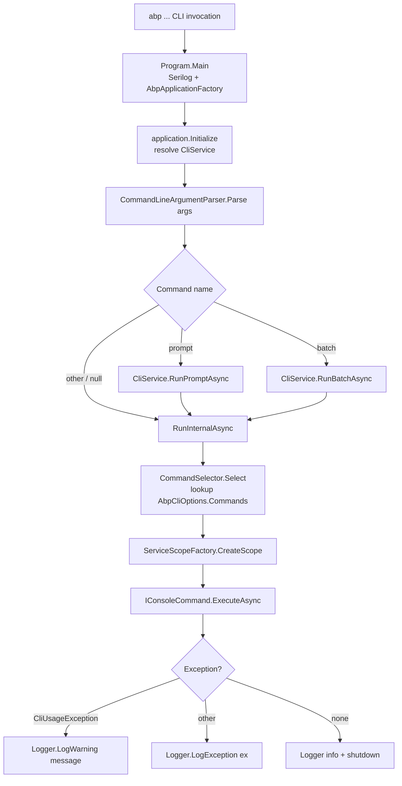

The ABP CLI (`abp`) is a .NET global tool packaged as `Volo.Abp.Cli`. Internally it is a normal ABP application: `Program.Main` boots an `AbpApplicationFactory.Create<AbpCliModule>(...)` host that wires up Autofac and Serilog, then resolves a single entrypoint service — `CliService` — and calls `RunAsync(args)`. Every CLI command is registered into an `AbpCliOptions.Commands` dictionary keyed by its public `Name` constant. The argument parser produces a `CommandLineArgs` value object, `CommandSelector` looks up the matching `IConsoleCommand` type, and the resolved service executes the command inside a dedicated DI scope. This page is the map of that pipeline.

<Info>
The CLI is split into two assemblies. `Volo.Abp.Cli` is the executable shell (`Program.cs`, `AbpCliModule`). `Volo.Abp.Cli.Core` holds every command, option type, parser, and service. Code excerpts cite both.
</Info>

## Source layout

<Card title="framework/src/Volo.Abp.Cli" icon="folder" horizontal>
Shell project: contains only `Program.cs` and `AbpCliModule.cs`. Everything else is pulled in transitively.
</Card>

<Card title="framework/src/Volo.Abp.Cli.Core" icon="folder" horizontal>
All CLI logic: `Args/`, `Commands/`, `Build/`, `Bundling/`, `ProjectBuilding/`, `ProjectModification/`, `Auth/`, plus `CliService.cs`, `AbpCliOptions.cs`, `AbpCliCoreModule.cs`.
</Card>

| File | Type | Responsibility |
| --- | --- | --- |
| `Volo.Abp.Cli/Volo/Abp/Cli/Program.cs` | static | Configures Serilog, builds the ABP application, calls `CliService.RunAsync`. |
| `Volo.Abp.Cli/Volo/Abp/Cli/AbpCliModule.cs` | module | Depends on `AbpCliCoreModule` and `AbpAutofacModule`. No services of its own. |
| `Volo.Abp.Cli.Core/Volo/Abp/Cli/AbpCliCoreModule.cs` | module | Registers every command into `AbpCliOptions.Commands` and the proxy generators into `AbpCliServiceProxyOptions.Generators`. |
| `Volo.Abp.Cli.Core/Volo/Abp/Cli/AbpCliOptions.cs` | options | Holds the `Commands` dictionary and CLI-wide flags. |
| `Volo.Abp.Cli.Core/Volo/Abp/Cli/CliService.cs` | service | Orchestrates parse → select → execute, version check, prompt/batch modes. |
| `Volo.Abp.Cli.Core/Volo/Abp/Cli/Args/CommandLineArgumentParser.cs` | parser | Splits `string[] args` into `CommandLineArgs`. |
| `Volo.Abp.Cli.Core/Volo/Abp/Cli/Commands/CommandSelector.cs` | selector | Resolves the command name to a registered `IConsoleCommand` type. |
| `Volo.Abp.Cli.Core/Volo/Abp/Cli/Commands/IConsoleCommand.cs` | interface | Contract every command implements. |
| `Volo.Abp.Cli.Core/Volo/Abp/Cli/CliUsageException.cs` | exception | Signals a user error; logged as a warning, never a stack trace. |

## Boot pipeline



## Program.cs

`Program.cs` configures Serilog (file sink at `CliPaths.Log/abp-cli-logs.txt` + colored console) and starts the ABP module host.

```csharp Volo.Abp.Cli/Volo/Abp/Cli/Program.cs
public class Program
{
    private static async Task Main(string[] args)
    {
        Console.OutputEncoding = System.Text.Encoding.UTF8;

        var loggerOutputTemplate = "{Message:lj}{NewLine}{Exception}";
        Log.Logger = new LoggerConfiguration()
            .MinimumLevel.Information()
            .MinimumLevel.Override("Microsoft", LogEventLevel.Warning)
            .MinimumLevel.Override("Volo.Abp", LogEventLevel.Warning)
            .MinimumLevel.Override("System.Net.Http.HttpClient", LogEventLevel.Warning)
            .MinimumLevel.Override("Volo.Abp.IdentityModel", LogEventLevel.Information)
#if DEBUG
            .MinimumLevel.Override("Volo.Abp.Cli", LogEventLevel.Debug)
#else
            .MinimumLevel.Override("Volo.Abp.Cli", LogEventLevel.Information)
#endif
            .Enrich.FromLogContext()
            .WriteTo.File(Path.Combine(CliPaths.Log, "abp-cli-logs.txt"), outputTemplate: loggerOutputTemplate)
            .WriteTo.Console(theme: AnsiConsoleTheme.Sixteen, outputTemplate: loggerOutputTemplate)
            .CreateLogger();

        using (var application = AbpApplicationFactory.Create<AbpCliModule>(
            options =>
            {
                options.UseAutofac();
                options.Services.AddLogging(c => c.AddSerilog());
            }))
        {
            application.Initialize();

            await application.ServiceProvider
                .GetRequiredService<CliService>()
                .RunAsync(args);

            application.Shutdown();

            Log.CloseAndFlush();
        }
    }
}
```

Notes worth calling out:

- The CLI uses Autofac (`options.UseAutofac()`) — the same conditional-registration container the rest of ABP uses for property injection.
- Logger overrides demote ABP's own framework noise to `Warning`; only `Volo.Abp.Cli` logs at `Information` (or `Debug` in DEBUG builds). Commands therefore see clean output by default.
- A file sink at `CliPaths.Log` (typically `%USERPROFILE%/.abp/cli/logs/abp-cli-logs.txt`) makes after-the-fact diagnosis possible even when console output is lost.

## AbpCliModule (shell) and AbpCliCoreModule (registry)

`AbpCliModule` is intentionally empty — its sole job is dependency declaration so that the shell pulls Core + Autofac:

```csharp Volo.Abp.Cli/Volo/Abp/Cli/AbpCliModule.cs
[DependsOn(
    typeof(AbpCliCoreModule),
    typeof(AbpAutofacModule)
)]
public class AbpCliModule : AbpModule
{
}
```

The real registration happens in `AbpCliCoreModule.ConfigureServices`, where every command name is bound to its type inside `Configure<AbpCliOptions>`:

```csharp Volo.Abp.Cli.Core/Volo/Abp/Cli/AbpCliCoreModule.cs
Configure<AbpCliOptions>(options =>
{
    options.Commands[HelpCommand.Name] = typeof(HelpCommand);
    options.Commands[PromptCommand.Name] = typeof(PromptCommand);
    options.Commands[NewCommand.Name] = typeof(NewCommand);
    options.Commands[GetSourceCommand.Name] = typeof(GetSourceCommand);
    options.Commands[UpdateCommand.Name] = typeof(UpdateCommand);
    options.Commands[AddPackageCommand.Name] = typeof(AddPackageCommand);
    options.Commands[AddModuleCommand.Name] = typeof(AddModuleCommand);
    options.Commands[ListModulesCommand.Name] = typeof(ListModulesCommand);
    options.Commands[ListTemplatesCommand.Name] = typeof(ListTemplatesCommand);
    options.Commands[LoginCommand.Name] = typeof(LoginCommand);
    options.Commands[LoginInfoCommand.Name] = typeof(LoginInfoCommand);
    options.Commands[LogoutCommand.Name] = typeof(LogoutCommand);
    options.Commands[GenerateProxyCommand.Name] = typeof(GenerateProxyCommand);
    options.Commands[RemoveProxyCommand.Name] = typeof(RemoveProxyCommand);
    options.Commands[SuiteCommand.Name] = typeof(SuiteCommand);
    options.Commands[SwitchToPreviewCommand.Name] = typeof(SwitchToPreviewCommand);
    options.Commands[SwitchToStableCommand.Name] = typeof(SwitchToStableCommand);
    options.Commands[SwitchToNightlyCommand.Name] = typeof(SwitchToNightlyCommand);
    options.Commands[SwitchToLocal.Name] = typeof(SwitchToLocal);
    options.Commands[TranslateCommand.Name] = typeof(TranslateCommand);
    options.Commands[BuildCommand.Name] = typeof(BuildCommand);
    options.Commands[BundleCommand.Name] = typeof(BundleCommand);
    options.Commands[CreateMigrationAndRunMigratorCommand.Name] = typeof(CreateMigrationAndRunMigratorCommand);
    options.Commands[InstallLibsCommand.Name] = typeof(InstallLibsCommand);
    options.Commands[CleanCommand.Name] = typeof(CleanCommand);
    options.Commands[CliCommand.Name] = typeof(CliCommand);
    options.Commands[ClearDownloadCacheCommand.Name] = typeof(ClearDownloadCacheCommand);

    options.DisabledModulesToAddToSolution.Add("Volo.Abp.LeptonXTheme.Pro");
    options.DisabledModulesToAddToSolution.Add("Volo.Abp.LeptonXTheme.Lite");
});
```

The same module also seeds the three built-in proxy generators (`JavaScriptServiceProxyGenerator`, `AngularServiceProxyGenerator`, `CSharpServiceProxyGenerator`) into `AbpCliServiceProxyOptions.Generators`, plus the two named `HttpClient` instances used by the CLI (`CliConsts.HttpClientName`, `CliConsts.GithubHttpClientName`).

## AbpCliOptions

`AbpCliOptions` is the extensibility surface — drop a module into the `abp` tool's plugin path and call `Configure<AbpCliOptions>(o => o.Commands["my-cmd"] = typeof(MyCommand))` and the CLI will dispatch to your type without any further wiring:

```csharp Volo.Abp.Cli.Core/Volo/Abp/Cli/AbpCliOptions.cs
public class AbpCliOptions
{
    public Dictionary<string, Type> Commands { get; }

    public List<string> DisabledModulesToAddToSolution { get; set; }

    /// <summary>
    /// Default value: true.
    /// </summary>
    public bool CacheTemplates { get; set; } = true;

    /// <summary>
    /// Default value: "CLI".
    /// </summary>
    public string ToolName { get; set; } = "CLI";

    public bool AlwaysHideExternalCommandOutput { get; set; }

    public AbpCliOptions()
    {
        Commands = new Dictionary<string, Type>(StringComparer.OrdinalIgnoreCase);
        DisabledModulesToAddToSolution = new();
    }
}
```

<Tip>
The dictionary uses `StringComparer.OrdinalIgnoreCase`, so `abp NEW Acme.Foo` resolves the same `NewCommand` as `abp new Acme.Foo`. The parser performs no case normalisation on its own — case-insensitivity is purely a property of this dictionary.
</Tip>

| Property | Default | Meaning |
| --- | --- | --- |
| `Commands` | populated by `AbpCliCoreModule` | Name → command type registry. The single source of truth for `CommandSelector` and `HelpCommand`. |
| `DisabledModulesToAddToSolution` | `Volo.Abp.LeptonXTheme.Pro`, `Volo.Abp.LeptonXTheme.Lite` | Module IDs that `add-module` will refuse to touch. |
| `CacheTemplates` | `true` | When `false`, template downloads bypass the on-disk cache. Equivalent to passing `--skip-cache` everywhere. |
| `ToolName` | `"CLI"` | Branding used by some console messages. Pro tools (ABP Studio, ABP Suite) override this. |
| `AlwaysHideExternalCommandOutput` | `false` | Suppress stdout/stderr from spawned `dotnet`/`npm`/`git` processes regardless of the verbosity flag. |

## ICommandLineArgumentParser

The parser interface is intentionally tiny and has two overloads — one for `Main`'s `string[]`, one for the interactive prompt's raw line:

```csharp Volo.Abp.Cli.Core/Volo/Abp/Cli/Args/ICommandLineArgumentParser.cs
public interface ICommandLineArgumentParser
{
    CommandLineArgs Parse(string[] args);

    CommandLineArgs Parse(string lineText);
}
```

Its default implementation, `CommandLineArgumentParser`, is registered as `ITransientDependency`. The output is a `CommandLineArgs` record with three fields: `Command` (the verb), `Target` (the optional positional argument — project name, command name for `help`, file path for `batch`), and `Options` (an `AbpCommandLineOptions : Dictionary<string, string>` indexed by long or short flag without the leading dashes). See [Argument parsing and pipeline](/cli/argument-parsing-and-pipeline) for the full state machine.

## ConsoleCommandSelector

`CommandSelector` is the only resolver between the parsed args and a concrete command type:

```csharp Volo.Abp.Cli.Core/Volo/Abp/Cli/Commands/CommandSelector.cs
public class CommandSelector : ICommandSelector, ITransientDependency
{
    protected AbpCliOptions Options { get; }

    public CommandSelector(IOptions<AbpCliOptions> options)
    {
        Options = options.Value;
    }

    public Type Select(CommandLineArgs commandLineArgs)
    {
        if (commandLineArgs.Command.IsNullOrWhiteSpace())
        {
            return typeof(HelpCommand);
        }

        return Options.Commands.GetOrDefault(commandLineArgs.Command)
               ?? typeof(HelpCommand);
    }
}
```

Two behaviours fall out of those four lines:

1. **Empty input** (bare `abp`) prints the command list because `HelpCommand` is selected.
2. **Unknown verb** (`abp do-stuff`) *also* prints help — but `HelpCommand.ExecuteAsync` first checks `commandLineArgs.Target` against the registry and warns `There is no command named …` when the user typed `abp help do-stuff`. Bare `abp do-stuff` silently falls through to the command list.

Because every command type implements `IConsoleCommand` and is registered as `ITransientDependency`, the selector can return only the type and let `CliService` resolve the instance in a child scope.

## IConsoleCommand

Every command — whether it spawns templates, generates proxies, or just prints text — implements this single interface:

```csharp Volo.Abp.Cli.Core/Volo/Abp/Cli/Commands/IConsoleCommand.cs
public interface IConsoleCommand
{
    Task ExecuteAsync(CommandLineArgs commandLineArgs);

    string GetUsageInfo();

    string GetShortDescription();
}
```

| Method | Used by | Notes |
| --- | --- | --- |
| `ExecuteAsync(CommandLineArgs)` | `CliService.RunInternalAsync` | The command's body. Throw `CliUsageException` for user errors; throw anything else for failures. |
| `GetUsageInfo()` | `HelpCommand` (`abp help <cmd>`) and most commands themselves (embedded in `CliUsageException` messages). | Plain text, hand-formatted. |
| `GetShortDescription()` | `HelpCommand` top-level listing. | One sentence, no trailing period. |

The contract is dead simple by design: there is no metadata attribute, no source generator, no reflection magic. Adding a command is "implement the interface, set a `Name` constant, add one line to a `Configure<AbpCliOptions>` block."

## Full command inventory

Every `*Command.cs` file in `Volo.Abp.Cli.Core/Volo/Abp/Cli/Commands/`, the verb it registers, and a one-line description. The verb is the literal value of the `public const string Name` field — that string is what the user types after `abp`.

| File | `Name` | Short description |
| --- | --- | --- |
| `HelpCommand.cs` | `help` | Print the command list, or `abp help <cmd>` for a specific usage block. |
| `PromptCommand.cs` | `prompt` | Enter an interactive `abp> ` REPL that parses each line through `CommandLineArgumentParser.Parse(string)`. |
| `NewCommand.cs` | `new` | Generate a new solution from an ABP startup template. See [New and Update](/cli/new-and-update). |
| `GetSourceCommand.cs` | `get-source` | Download the source code of an ABP module into the current folder. |
| `UpdateCommand.cs` | `update` | Update all ABP-related NuGet **and** npm packages in a solution or single project. |
| `AddPackageCommand.cs` | `add-package` | Add a Volo NuGet package to a project plus its `DependsOn` module attribute. |
| `AddModuleCommand.cs` | `add-module` | Add an ABP module (full set of layered packages) to a solution. Respects `DisabledModulesToAddToSolution`. |
| `ListModulesCommand.cs` | `list-modules` | List the modules available in the ABP module marketplace. |
| `ListTemplatesCommand.cs` | `list-templates` | List the startup templates available to `abp new`. |
| `LoginCommand.cs` | `login` | Authenticate against the ABP commercial API (`abp.io`) and store the token. |
| `LoginInfoCommand.cs` | `login-info` | Print the currently stored login (email, organization). |
| `LogoutCommand.cs` | `logout` | Remove the stored login token. |
| `GenerateProxyCommand.cs` | `generate-proxy` | Generate JavaScript / Angular / C# HTTP proxies via the registered `IServiceProxyGenerator`s. |
| `RemoveProxyCommand.cs` | `remove-proxy` | Delete a previously generated proxy. |
| `SuiteCommand.cs` | `suite` | Manage the ABP Suite installation (install/update/remove). |
| `SwitchToStableCommand.cs` | `switch-to-stable` | Re-pin all ABP packages in a solution to the latest stable release. |
| `SwitchToPreviewCommand.cs` | `switch-to-preview` | Re-pin to the latest preview/RC version. |
| `SwitchToNightlyCommand.cs` | `switch-to-nightly` | Re-pin to the nightly MyGet feed. |
| `SwitchToLocalCommand.cs` (class `SwitchToLocal`) | `switch-to-local` | Re-pin packages to local project references for an in-tree ABP checkout. |
| `TranslateCommand.cs` | `translate` | Aggregate / apply localization JSON files across a solution. |
| `BuildCommand.cs` | `build` | Incremental dotnet build orchestrator. See [Build and bundle](/cli/build-and-bundle). |
| `BundleCommand.cs` | `bundle` | Bundle Blazor WebAssembly / MAUI-Blazor static assets. See [Build and bundle](/cli/build-and-bundle). |
| `CreateMigrationAndRunMigratorCommand.cs` | `create-migration-and-run-migrator` | Create an EF Core migration and run the DbMigrator project. |
| `InstallLibsCommand.cs` | `install-libs` | Restore npm packages and copy `node_modules` content into `wwwroot/libs`. |
| `CleanCommand.cs` | `clean` | Delete `bin/` and `obj/` recursively. |
| `CliCommand.cs` | `cli` | Update or remove the CLI itself (`abp cli update`, `abp cli remove`). |
| `ClearDownloadCacheCommand.cs` | `clear-download-cache` | Empty the on-disk template / module download cache. |

Helper / abstract types alongside the commands (not registered): `CommandSelector.cs`, `ICommandSelector.cs`, `IConsoleCommand.cs`, `ProjectCreationCommandBase.cs` (base class for `NewCommand`), `ProxyCommandBase.cs` (base class for `GenerateProxyCommand` / `RemoveProxyCommand`), `Templates/TemplateInfo.cs`, and the `Services/` folder (`AbpNuGetIndexUrlService`, `ConnectionStringProvider`, `DotnetEfToolManager`, `InitialMigrationCreator`, `SourceCodeDownloadService`, `SuiteAppSettingsService`).

## CliService.RunAsync

`CliService` is what `Program.cs` resolves. It glues parser + selector together and adds three more responsibilities: CLI version checking, the `prompt` REPL, and the `batch` file runner.

```csharp Volo.Abp.Cli.Core/Volo/Abp/Cli/CliService.cs
public async Task RunAsync(string[] args)
{
    var currentCliVersion = await GetCurrentCliVersionInternalAsync(typeof(CliService).Assembly);
    Logger.LogInformation($"ABP CLI {currentCliVersion}");

    var commandLineArgs = CommandLineArgumentParser.Parse(args);

#if !DEBUG
    if (!commandLineArgs.Options.ContainsKey("skip-cli-version-check"))
    {
        await CheckCliVersionAsync(currentCliVersion);
    }
#endif

    try
    {
        if (commandLineArgs.IsCommand("prompt"))
        {
            await RunPromptAsync();
        }
        else if (commandLineArgs.IsCommand("batch"))
        {
            await RunBatchAsync(commandLineArgs);
        }
        else
        {
            await RunInternalAsync(commandLineArgs);
        }
    }
    catch (CliUsageException usageException)
    {
        Logger.LogWarning(usageException.Message);
    }
    catch (Exception ex)
    {
        Logger.LogException(ex);
    }
}
```

The order of concerns matters:

1. **Version line first** — even before parsing, the resolved CLI version (read by shelling out to `dotnet tool list -g` and looking for `volo.abp.cli`) is logged. Anything below in the output is therefore tagged with the build that produced it.
2. **Parse before version check** — so the user can opt out via `--skip-cli-version-check` on any command.
3. **Three top-level branches.** `prompt` and `batch` route back into `RunInternalAsync` per individual command; everything else flows directly.
4. **Two exception filters.** A `CliUsageException` is the user's fault and prints as a `LogWarning` (no stack trace). Anything else is logged via `Logger.LogException(ex)` (extension from `Volo.Abp.Core/Microsoft/Extensions/Logging/AbpLoggerExtensions.cs`), which preserves the stack and any inner exceptions.

`RunInternalAsync` is the actual dispatch:

```csharp Volo.Abp.Cli.Core/Volo/Abp/Cli/CliService.cs
private async Task RunInternalAsync(CommandLineArgs commandLineArgs)
{
    var commandType = CommandSelector.Select(commandLineArgs);

    using (var scope = ServiceScopeFactory.CreateScope())
    {
        var command = (IConsoleCommand)scope.ServiceProvider.GetRequiredService(commandType);
        await command.ExecuteAsync(commandLineArgs);
    }
}
```

The scope-per-command pattern matters because commands like `NewCommand` and `UpdateCommand` resolve many transient services (HTTP clients, file watchers, NuGet package readers) that should not leak into a second invocation under `prompt` or `batch` mode.

## Special verbs: `prompt` and `batch`

```csharp Volo.Abp.Cli.Core/Volo/Abp/Cli/CliService.cs
private async Task RunBatchAsync(CommandLineArgs commandLineArgs)
{
    var targetFile = commandLineArgs.Target;
    if (targetFile.IsNullOrWhiteSpace())
    {
        throw new CliUsageException(
            "Must provide a file name/path that contains a list of commands" +
            Environment.NewLine + Environment.NewLine +
            "Example: " +
            "  abp batch commands.txt"
            );
    }

    var filePath = Path.Combine(Directory.GetCurrentDirectory(), targetFile);
    var fileLines = File.ReadAllLines(filePath);
    foreach (var line in fileLines)
    {
        var lineText = line;
        if (lineText.IsNullOrWhiteSpace() || lineText.StartsWith("#"))
        {
            continue;
        }

        if (lineText.Contains('#'))
        {
            lineText = lineText.Substring(0, lineText.IndexOf('#'));
        }

        var args = CommandLineArgumentParser.Parse(lineText);
        await RunInternalAsync(args);
    }
}
```

<AccordionGroup>
<Accordion title="prompt — interactive REPL">
`PromptCommand` (registered as `prompt`) merely *exists* so `help` can show it; the real loop runs inside `CliService.RunPromptAsync`. Each iteration reads a line, splits it with `CommandLineArgumentParser.Parse(string)`, and dispatches through `RunInternalAsync`. `exit` terminates the loop.
</Accordion>

<Accordion title="batch — script file runner">
`abp batch commands.txt` reads the file line-by-line. Blank lines and `#`-prefixed lines are skipped; trailing `#` comments are stripped. Each remaining line is parsed and dispatched. Failures inside one line bubble up to `RunBatchAsync` and are then caught by the outer `try/catch` in `RunAsync`, so a single bad line aborts the batch.
</Accordion>
</AccordionGroup>

## Version checking

When not running a DEBUG build and the user has not passed `--skip-cli-version-check`, `RunAsync` calls `CheckCliVersionAsync` once every 24 hours (state is persisted via `MemoryService` under `CliConsts.MemoryKeys.LatestCliVersionCheckDate`). The "channel" of the current install is inferred from the SemVer release tag — `preview` ⇒ `Nightly`, `dev` ⇒ `Development`, any other prerelease ⇒ `Prerelease`, no prerelease ⇒ `Stable` — and the matching feed is queried via `PackageVersionCheckerService`. If a newer version exists, `LogNewVersionInfo` prints the appropriate `dotnet tool update` (or `uninstall && install` for prereleases) one-liner.

## Where to go next

<CardGroup cols={2}>
<Card title="Argument parsing and pipeline" icon="terminal" href="/cli/argument-parsing-and-pipeline">
The `CommandLineArgumentParser` state machine, `CommandLineArgs` shape, scope lifecycle, and exception model in detail.
</Card>
<Card title="Help and version" icon="circle-question" href="/cli/help-and-version">
`HelpCommand`, the `abp cli` self-update command, and how `CliService` prints the version banner.
</Card>
<Card title="New and Update" icon="wand-magic-sparkles" href="/cli/new-and-update">
`NewCommand` template dispatch, `ProjectCreationCommandBase` shared options, and `UpdateCommand`'s NuGet + npm updater.
</Card>
<Card title="Build and bundle" icon="hammer" href="/cli/build-and-bundle">
`BuildCommand`'s incremental dotnet build, `BundleCommand` for Blazor WASM / MAUI-Blazor, and `BundlingService`.
</Card>
<Card title="Project building and templates" icon="folder-tree" href="/cli/project-building-and-templates">
The `ProjectBuilding/` pipeline — template providers, source code resolvers, zip extraction — that `NewCommand` depends on.
</Card>
<Card title="Identity module" icon="user-shield" href="/modules/identity">
The module created by `add-module Volo.Abp.Identity` (and pre-installed in every startup template).
</Card>
</CardGroup>
