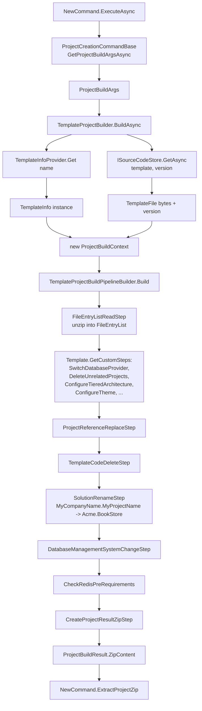

The `Volo.Abp.Cli.ProjectBuilding` namespace is the engine behind `abp new`. When a user types `abp new Acme.BookStore -t app -u angular -d ef --dbms postgresql`, `NewCommand` does almost no work itself — it bundles the command-line options into a `ProjectBuildArgs`, resolves a `TemplateProjectBuilder`, and hands the args over. Everything else — downloading a template zip from `abp.io`, picking which `TemplateInfo` subclass describes that template, building a list of `ProjectBuildPipelineStep`s to run, renaming `MyCompanyName.MyProjectName` placeholders, deleting projects that don't match the chosen UI/DB, randomising ports — happens inside `ProjectBuilding/`. This page walks that pipeline from `ProjectBuildArgs` to the final `byte[] ZipContent` that `NewCommand` then extracts to disk.

<Info>
All code in this page lives under `framework/src/Volo.Abp.Cli.Core/Volo/Abp/Cli/ProjectBuilding/`. The shell command `abp new` is documented separately in [New and Update](/cli/new-and-update); for the end-user description of the templates themselves see [Application template](/templates/app-template).
</Info>

## Source layout

<Card title="framework/src/Volo.Abp.Cli.Core/Volo/Abp/Cli/ProjectBuilding" icon="folder" horizontal>
The whole project-building subsystem. Three top-level concerns: `Building/` (pipeline + step base classes + `Steps/`), `Templates/` (one folder per template family — `App/`, `Module/`, `Console/`, `Maui/`, `Wpf/`, `Microservice/`), and `Files/` (in-memory file/entry abstraction).
</Card>

### File inventory — top level

| File | Type | Responsibility |
| --- | --- | --- |
| `IProjectBuilder.cs` | interface | One method: `Task<ProjectBuildResult> BuildAsync(ProjectBuildArgs args)`. Implemented by template / module / nuget / npm builders. |
| `ProjectBuildArgs.cs` | DTO | Everything `NewCommand` knows: solution name, template name, version, DB, UI, mobile app, theme, output folder, extra dictionary. |
| `ProjectBuildResult.cs` | DTO | `byte[] ZipContent` + project name returned by every `IProjectBuilder`. |
| `ITemplateInfoProvider.cs` / `TemplateInfoProvider.cs` | provider | Switch on a template `Name` string to `new` the matching `TemplateInfo` subclass. |
| `ISourceCodeStore.cs` / `AbpIoSourceCodeStore.cs` | store | Resolves a `TemplateFile` (the raw zip bytes + version). See [Source code store](/cli/source-code-store). |
| `TemplateFile.cs` | DTO | `byte[] FileBytes`, `string Version`, `string LatestVersion`, `string RepositoryNugetVersion`. |
| `SourceCodeTypes.cs` | const class | `"template"`, `"module"`, `"nugetPackage"`, `"npmPackage"` — used as the type segment in `abp.io` download URLs. |
| `SolutionName.cs` | value object | Parses `Acme.BookStore` into `CompanyName="Acme"`, `ProjectName="BookStore"`. Has a microservice overload. |
| `TemplateProjectBuilder.cs` | builder | The `IProjectBuilder` for solution templates — the focus of this page. |
| `ModuleProjectBuilder.cs` | builder | Same for `get-source <module-name>`. |
| `NugetPackageProjectBuilder.cs` / `NpmPackageProjectBuilder.cs` | builders | Used by `add-package` when source code is requested. |
| `TemplateInfoProvider.cs` | service | Returns `AppProTemplate` for logged-in commercial users, `AppTemplate` otherwise (`GetDefaultAsync`). |
| `NugetPackageInfoProvider.cs` / `NpmPackageInfoProvider.cs` / `ModuleInfoProvider.cs` | providers | Fetch the JSON manifest that lists modules / npm / NuGet packages available on the marketplace. |

### File inventory — `Building/`

| File | Type | Responsibility |
| --- | --- | --- |
| `ProjectBuildPipeline.cs` | pipeline | Holds a `ProjectBuildContext` and a mutable `List<ProjectBuildPipelineStep>`. `Execute()` runs them in order. |
| `ProjectBuildPipelineStep.cs` | abstract | Single abstract method: `void Execute(ProjectBuildContext context)`. |
| `ProjectBuildContext.cs` | context | Carries `TemplateFile`, `TemplateInfo`, `BuildArgs`, `FileEntryList Files`, `ProjectResult Result` and a `Symbols` list. |
| `TemplateProjectBuildPipelineBuilder.cs` | static | Builds the **template** pipeline (read zip → custom steps → reference replace → rename → DB switch → cleanup → zip). |
| `ModuleProjectBuildPipelineBuilder.cs` / `NugetPackageProjectBuildPipelineBuilder.cs` / `NpmPackageProjectBuildPipelineBuilder.cs` | statics | Smaller pipelines used by `get-source`, `add-package`. |
| `TemplateInfo.cs` | abstract | Base class for every template family. Holds `Name`, default DB/UI, `DocumentUrl`. `virtual GetCustomSteps(...)` adds template-specific steps. |
| `DatabaseProvider.cs` / `DatabaseManagementSystem.cs` | enums | `EntityFrameworkCore`, `MongoDb`; `SQLServer`, `MySQL`, `PostgreSQL`, `Oracle`, `Sqlite`. |
| `UiFramework.cs` | enum | `None`, `Mvc`, `Angular`, `Blazor`, `BlazorServer`, `MauiBlazor`. |
| `MobileApp.cs` | enum | `None`, `ReactNative`, `Maui`. |
| `Theme.cs` / `ThemeStyle.cs` | enums | `Basic`, `Lepton`, `LeptonXLite`, `LeptonX`. |
| `Steps/` | folder | ~40 concrete `ProjectBuildPipelineStep` implementations. |

### File inventory — `Templates/`

| Template folder | Key files | `TemplateName` |
| --- | --- | --- |
| `Templates/App/` | `AppTemplate.cs`, `AppTemplateBase.cs`, `AppProTemplate.cs`, `AppNoLayersTemplate.cs`, `AppNoLayersTemplateBase.cs`, `AppNoLayersProTemplate.cs` | `app`, `app-pro`, `app-nolayers`, `app-nolayers-pro` |
| `Templates/Module/` | `ModuleTemplate.cs`, `ModuleTemplateBase.cs`, `ModuleProTemplate.cs` | `module`, `module-pro` |
| `Templates/Console/` | `ConsoleTemplate.cs`, `ConsoleTemplateBase.cs` | `console` |
| `Templates/Maui/` | `MauiTemplate.cs`, `MauiTemplateBase.cs` | `maui` |
| `Templates/Wpf/` | `WpfTemplate.cs`, `WpfTemplateBase.cs` | `wpf` |
| `Templates/Microservice/` | `MicroserviceProTemplate.cs`, `MicroserviceServiceProTemplate.cs`, `MicroserviceTemplateBase.cs`, `MicroserviceServiceTemplateBase.cs` | `microservice-pro`, `microservice-service-pro` |

## End-to-end pipeline



## `ProjectBuildArgs` — the input contract

`NewCommand` constructs a `ProjectBuildArgs` instance from the parsed `CommandLineArgs` (via `ProjectCreationCommandBase.GetProjectBuildArgsAsync`). It is the single typed object that flows through every builder.

```csharp framework/src/Volo.Abp.Cli.Core/Volo/Abp/Cli/ProjectBuilding/ProjectBuildArgs.cs
public class ProjectBuildArgs
{
    [NotNull]  public SolutionName SolutionName { get; }
    [CanBeNull] public string TemplateName { get; set; }
    [CanBeNull] public string Version { get; set; }

    public DatabaseProvider DatabaseProvider { get; set; }
    public DatabaseManagementSystem DatabaseManagementSystem { get; set; }
    public UiFramework UiFramework { get; set; }
    public MobileApp? MobileApp { get; set; }
    public bool PublicWebSite { get; set; }

    [CanBeNull] public string AbpGitHubLocalRepositoryPath { get; set; }
    [CanBeNull] public string VoloGitHubLocalRepositoryPath { get; set; }
    [CanBeNull] public string TemplateSource { get; set; }
    [CanBeNull] public string ConnectionString { get; set; }
    [NotNull]   public string OutputFolder { get; set; }

    public bool Pwa { get; set; }
    public Theme? Theme { get; set; }
    public ThemeStyle? ThemeStyle { get; set; }
    public bool SkipCache { get; set; }

    [NotNull] public Dictionary<string, string> ExtraProperties { get; set; }
    // ... ctor sets every field
}
```

| Field | Source of value (`NewCommand`) | Used by |
| --- | --- | --- |
| `SolutionName` | `SolutionName.Parse(commandLineArgs.Target)` | `SolutionRenameStep`, every step that needs the new namespace. |
| `TemplateName` | `-t / --template` option, defaulted by `TemplateInfoProvider.GetDefaultAsync`. | `TemplateInfoProvider.Get` plus pipeline-building conditionals. |
| `Version` | `-v / --version` option. If null, `ISourceCodeStore` queries `abp.io` for the latest. | `AbpIoSourceCodeStore.GetAsync`. |
| `DatabaseProvider` | `-d / --database-provider`. Normalised against `TemplateInfo.DefaultDatabaseProvider`. | `SwitchDatabaseProvider`, `AppTemplateSwitchEntityFrameworkCoreToMongoDbStep`. |
| `DatabaseManagementSystem` | `--dbms`. | `DatabaseManagementSystemChangeStep`, `AppNoLayersDatabaseManagementSystemChangeStep`. |
| `UiFramework` | `-u / --ui`. | `DeleteUnrelatedProjects`, `ConfigureWith*Ui` per template. |
| `MobileApp` | `-m / --mobile` (`maui`, `react-native`). | `ConfigureWith*Ui` (mobile project deletion). |
| `Theme` / `ThemeStyle` | `--theme`, `--theme-style`. Only honoured for template versions ≥ `6.0.0-rc.1`. | `ChangeThemeStep`, `ChangeThemeStyleStep`. |
| `ConnectionString` | `-cs / --connection-string`. | `ConnectionStringChangeStep`. |
| `Pwa` | `--pwa`. | Angular-specific PWA support (post-extract). |
| `AbpGitHubLocalRepositoryPath` / `VoloGitHubLocalRepositoryPath` | `--abp-path`, `--volo-path`. Enables the `local-framework-ref` switch in `ProjectReferenceReplaceStep`. | `ProjectReferenceReplaceStep`. |
| `TemplateSource` | `-ts / --template-source`. | `AbpIoSourceCodeStore` (skip remote download). |
| `SkipCache` | `--skip-cache`. | `AbpIoSourceCodeStore` (skip on-disk cache). |
| `ExtraProperties` | The full `commandLineArgs.Options` dictionary. | Templates check this for flags like `tiered`, `separate-tenant-schema`, `preview`, `local-framework-ref`. |

The companion `ProjectBuildResult` is dramatically simpler:

```csharp framework/src/Volo.Abp.Cli.Core/Volo/Abp/Cli/ProjectBuilding/ProjectBuildResult.cs
public class ProjectBuildResult
{
    public string AppName { get; }
    public byte[] ZipContent { get; }
    // ctor
}
```

## `IProjectBuilder`

```csharp framework/src/Volo.Abp.Cli.Core/Volo/Abp/Cli/ProjectBuilding/IProjectBuilder.cs
public interface IProjectBuilder
{
    Task<ProjectBuildResult> BuildAsync(ProjectBuildArgs args);
}
```

Four concrete implementations sit beside it:

| Implementation | Source code type | Used by |
| --- | --- | --- |
| `TemplateProjectBuilder` | `SourceCodeTypes.Template` | `NewCommand` (creating new solutions). |
| `ModuleProjectBuilder` | `SourceCodeTypes.Module` | `GetSourceCommand`, `SolutionModuleAdder` (downloading a module's source). |
| `NugetPackageProjectBuilder` | `SourceCodeTypes.NugetPackage` | `add-package --with-source-code`. |
| `NpmPackageProjectBuilder` | `SourceCodeTypes.NpmPackage` | `add-package` for Angular packages. |

All four share the same shape: resolve a `*InfoProvider`, ask `ISourceCodeStore` for the zip, build a `ProjectBuildContext`, dispatch a `*PipelineBuilder.Build(context).Execute()`.

## `TemplateProjectBuilder.BuildAsync`

The body of `TemplateProjectBuilder` is the canonical illustration of how a builder works:

```csharp framework/src/Volo.Abp.Cli.Core/Volo/Abp/Cli/ProjectBuilding/TemplateProjectBuilder.cs
public async Task<ProjectBuildResult> BuildAsync(ProjectBuildArgs args)
{
    var templateInfo = await GetTemplateInfoAsync(args);

    NormalizeArgs(args, templateInfo);

    await EventBus.PublishAsync(new ProjectCreationProgressEvent {
        Message = "Downloading the solution template"
    }, false);

    var templateFile = await SourceCodeStore.GetAsync(
        args.TemplateName,
        SourceCodeTypes.Template,
        args.Version,
        args.TemplateSource,
        args.ExtraProperties.ContainsKey(NewCommand.Options.Preview.Long)
    );

    ConfigureThemeOptions(args, templateFile.Version);

    // ... api key + license code lookup (omitted) ...

    var context = new ProjectBuildContext(
        templateInfo,
        null,
        null,
        null,
        templateFile,
        args
    );

    if (context.Template is AppTemplateBase appTemplateBase)
    {
        appTemplateBase.HasDbMigrations =
            SemanticVersion.Parse(templateFile.Version)
                < new SemanticVersion(4, 3, 99);
    }

    await EventBus.PublishAsync(new ProjectCreationProgressEvent {
        Message = "Customizing the solution template"
    }, false);

    TemplateProjectBuildPipelineBuilder.Build(context).Execute();

    if (!templateInfo.DocumentUrl.IsNullOrEmpty())
    {
        Logger.LogInformation("Check out the documents at " + templateInfo.DocumentUrl);
    }

    // ... analytics collection (omitted) ...

    return new ProjectBuildResult(context.Result.ZipContent, args.SolutionName.ProjectName);
}
```

Five things to notice:

1. **`NormalizeArgs`** fills in `DatabaseProvider` / `UiFramework` from the template's defaults if the caller left them unspecified — e.g. `AppTemplateBase` defaults to `EntityFrameworkCore` + `Mvc`.
2. **`Preview`** is detected by the *presence* of the `--preview` flag (`ContainsKey`), not its value. `AbpIoSourceCodeStore` then passes that boolean to the `abp.io` API to include pre-releases when resolving "latest".
3. **Theme options only count from 6.0.0-rc.1.** Older template versions get `Theme = null` / `ThemeStyle = null` injected back into the args so that `ChangeThemeStep` becomes a no-op.
4. **`HasDbMigrations`** is a temporal flag — older templates (`< 4.4`) keep migrations inside `EntityFrameworkCore`, newer ones split them into `EntityFrameworkCore.DbMigrations`. `AppTemplateBase` consults this flag to remove the right project.
5. **Two `ProjectCreationProgressEvent`s** are published on `ILocalEventBus`. These power ABP Studio / Suite progress UIs; the CLI itself ignores them.

## `TemplateInfoProvider` — string → typed template

```csharp framework/src/Volo.Abp.Cli.Core/Volo/Abp/Cli/ProjectBuilding/TemplateInfoProvider.cs
public TemplateInfo Get(string name)
{
    switch (name)
    {
        case AppTemplate.TemplateName:                  return new AppTemplate();
        case AppNoLayersTemplate.TemplateName:          return new AppNoLayersTemplate();
        case AppNoLayersProTemplate.TemplateName:       return new AppNoLayersProTemplate();
        case AppProTemplate.TemplateName:               return new AppProTemplate();
        case MicroserviceProTemplate.TemplateName:      return new MicroserviceProTemplate();
        case MicroserviceServiceProTemplate.TemplateName: return new MicroserviceServiceProTemplate();
        case ModuleTemplate.TemplateName:               return new ModuleTemplate();
        case ModuleProTemplate.TemplateName:            return new ModuleProTemplate();
        case ConsoleTemplate.TemplateName:              return new ConsoleTemplate();
        case WpfTemplate.TemplateName:                  return new WpfTemplate();
        case MauiTemplate.TemplateName:                 return new MauiTemplate();
        default:
            throw new Exception("There is no template found with given name: " + name);
    }
}
```

`GetDefaultAsync` calls a small commercial-license check (`AuthService.IsLoggedIn()` + a `GET https://abp.io/api/license/check-user` request); if it succeeds with `true`, the default becomes `app-pro`, otherwise `app`.

<Tip>
The switch is **the** registration point for new templates. Adding a new template family requires three things: a class deriving from `TemplateInfo`, a `const string TemplateName`, and a new `case` here.
</Tip>

## `TemplateInfo` — what every template family supplies

```csharp framework/src/Volo.Abp.Cli.Core/Volo/Abp/Cli/ProjectBuilding/Building/TemplateInfo.cs
public abstract class TemplateInfo
{
    [NotNull] public string Name { get; }
    public DatabaseProvider DefaultDatabaseProvider { get; }
    public UiFramework DefaultUiFramework { get; }
    [CanBeNull] public string DocumentUrl { get; set; }

    protected TemplateInfo(
        [NotNull] string name,
        DatabaseProvider defaultDatabaseProvider = DatabaseProvider.NotSpecified,
        UiFramework defaultUiFramework = UiFramework.NotSpecified)
    { /* ... */ }

    public virtual IEnumerable<ProjectBuildPipelineStep> GetCustomSteps(ProjectBuildContext context)
    {
        return new List<ProjectBuildPipelineStep>();
    }

    public bool IsPro() => Name.EndsWith("-pro", StringComparison.OrdinalIgnoreCase);
    public bool IsNoLayer() =>
        Name is AppNoLayersTemplate.TemplateName or AppNoLayersProTemplate.TemplateName;
}
```

The contract is intentionally minimal. The interesting work happens in **`GetCustomSteps`**, which each family overrides to add the steps it needs. The plain `app` template, for example, derives from `AppTemplateBase`, whose override is a long sequence of calls:

```csharp framework/src/Volo.Abp.Cli.Core/Volo/Abp/Cli/ProjectBuilding/Templates/App/AppTemplateBase.cs
public override IEnumerable<ProjectBuildPipelineStep> GetCustomSteps(ProjectBuildContext context)
{
    var steps = base.GetCustomSteps(context).ToList();

    ConfigureTenantSchema(context, steps);
    SwitchDatabaseProvider(context, steps);
    DeleteUnrelatedProjects(context, steps);
    RemoveMigrations(context, steps);
    ConfigureTieredArchitecture(context, steps);
    ConfigurePublicWebSite(context, steps);
    ConfigureTheme(context, steps);
    ConfigureVersion(context, steps);
    RemoveUnnecessaryPorts(context, steps);
    RandomizeSslPorts(context, steps);
    RandomizeStringEncryption(context, steps);
    RandomizeAuthServerPassPhrase(context, steps);
    UpdateNuGetConfig(context, steps);
    ConfigureDockerFiles(context, steps);
    ChangeConnectionString(context, steps);
    CleanupFolderHierarchy(context, steps);

    return steps;
}
```

Each helper inspects `context.BuildArgs` and conditionally appends `RemoveProjectFromSolutionStep`, `MoveFolderStep`, `ChangeThemeStep`, etc. The simpler templates supply much shorter lists — `AppNoLayersTemplateBase` runs about half of the above, `ConsoleTemplateBase` runs none.

## The template family inventory

### `AppTemplate` / `AppProTemplate`

```csharp framework/src/Volo.Abp.Cli.Core/Volo/Abp/Cli/ProjectBuilding/Templates/App/AppTemplate.cs
public class AppTemplate : AppTemplateBase
{
    /// <summary>
    /// "app".
    /// </summary>
    public const string TemplateName = "app";

    public const Theme DefaultTheme = Theme.LeptonXLite;

    public AppTemplate() : base(TemplateName)
    {
        DocumentUrl = CliConsts.DocsLink + "/en/abp/latest/Startup-Templates/Application";
    }
}
```

`AppTemplateBase` constructor pins `DefaultDatabaseProvider = EntityFrameworkCore`, `DefaultUiFramework = Mvc`. The `-pro` variant overrides `DefaultTheme = Theme.LeptonX` and triggers `LicenseCodeReplaceStep`.

<Note>
`AppTemplateBase.HasDbMigrations` is mutated by `TemplateProjectBuilder.BuildAsync` based on the resolved template version. Custom steps inside `AppTemplateBase` then branch on this flag.
</Note>

### `AppNoLayersTemplate`

A single-project version of the application template introduced in 8.x. Override is shorter — no tenant schema, no tiered architecture, no public web site:

```csharp framework/src/Volo.Abp.Cli.Core/Volo/Abp/Cli/ProjectBuilding/Templates/App/AppNoLayersTemplateBase.cs
public override IEnumerable<ProjectBuildPipelineStep> GetCustomSteps(ProjectBuildContext context)
{
    var steps = base.GetCustomSteps(context).ToList();

    SwitchDatabaseProvider(context, steps);
    DeleteUnrelatedProjects(context, steps);
    RemoveMigrations(context, steps);
    RandomizeSslPorts(context, steps);
    RandomizeStringEncryption(context, steps);
    RandomizeAuthServerPassPhrase(context, steps);
    UpdateNuGetConfig(context, steps);
    ChangeConnectionString(context, steps);
    ConfigureDockerFiles(context, steps);
    ConfigureTheme(context, steps);
    CleanupFolderHierarchy(context, steps);

    return steps;
}
```

The pipeline builder also swaps in `AppNoLayersDatabaseManagementSystemChangeStep` and the no-layers project-move step.

### `ModuleTemplate` / `ModuleProTemplate`

```csharp framework/src/Volo.Abp.Cli.Core/Volo/Abp/Cli/ProjectBuilding/Templates/Module/ModuleTemplate.cs
public class ModuleTemplate : ModuleTemplateBase
{
    /// <summary>
    /// "module".
    /// </summary>
    public const string TemplateName = "module";

    public ModuleTemplate() : base(TemplateName)
    {
        DocumentUrl = "https://docs.abp.io/en/abp/latest/Startup-Templates/Module";
    }
}
```

`ModuleProjectBuildPipelineBuilder` is the smaller pipeline used here — it skips DB switching and project deletion (a module ships every flavour pre-multiplied).

### `ConsoleTemplate`, `MauiTemplate`, `WpfTemplate`

```csharp framework/src/Volo.Abp.Cli.Core/Volo/Abp/Cli/ProjectBuilding/Templates/Console/ConsoleTemplate.cs
public class ConsoleTemplate : ConsoleTemplateBase
{
    /// <summary>
    /// "console".
    /// </summary>
    public const string TemplateName = "console";

    public ConsoleTemplate() : base(TemplateName)
    {
        DocumentUrl = CliConsts.DocsLink + "/en/abp/latest/Startup-Templates/Console";
    }
}
```

```csharp framework/src/Volo.Abp.Cli.Core/Volo/Abp/Cli/ProjectBuilding/Templates/Maui/MauiTemplate.cs
public class MauiTemplate : MauiTemplateBase
{
    /// <summary>
    /// "maui".
    /// </summary>
    public const string TemplateName = "maui";

    public MauiTemplate() : base(TemplateName)
    {
        DocumentUrl = CliConsts.DocsLink + "/en/abp/latest/Startup-Templates/MAUI";
    }
}
```

```csharp framework/src/Volo.Abp.Cli.Core/Volo/Abp/Cli/ProjectBuilding/Templates/Wpf/WpfTemplate.cs
public class WpfTemplate : WpfTemplateBase
{
    /// <summary>
    /// "wpf".
    /// </summary>
    public const string TemplateName = "wpf";

    public WpfTemplate() : base(TemplateName)
    {
        DocumentUrl = CliConsts.DocsLink + "/en/abp/latest/Startup-Templates/WPF";
    }
}
```

`MauiTemplateBase` adds `MauiChangeApplicationIdGuidStep` and `MauiChangePortStep` to the steps list; `ConsoleTemplateBase` and `WpfTemplateBase` add nothing — the standard rename + reference replace is enough.

### Microservice templates

`microservice-pro` and `microservice-service-pro` ride on the same pipeline but trigger a few extra steps (Tye / Docker / Prometheus file rewrites under `Steps/RemoveProjectFromPrometheusStep.cs`, `RemoveProjectFromTyeStep.cs`, `RenameProjectInTyeStep.cs`, `UpdateDockerImagesStep.cs`). `MicroserviceServiceTemplateBase.IsMicroserviceServiceTemplate(name)` is what `SolutionRenameStep` consults to use the special three-segment rename (`MyCompanyName.MyProjectName.MicroserviceName`).

## `ProjectBuildPipeline` and the step base class

The pipeline is a passive list:

```csharp framework/src/Volo.Abp.Cli.Core/Volo/Abp/Cli/ProjectBuilding/Building/ProjectBuildPipeline.cs
public class ProjectBuildPipeline
{
    public ProjectBuildContext Context { get; }
    public List<ProjectBuildPipelineStep> Steps { get; }

    public ProjectBuildPipeline(ProjectBuildContext context)
    {
        Context = context;
        Steps = new List<ProjectBuildPipelineStep>();
    }

    public void Execute()
    {
        foreach (var step in Steps)
        {
            step.Execute(Context);
        }
    }
}
```

```csharp framework/src/Volo.Abp.Cli.Core/Volo/Abp/Cli/ProjectBuilding/Building/ProjectBuildPipelineStep.cs
public abstract class ProjectBuildPipelineStep
{
    public abstract void Execute(ProjectBuildContext context);
}
```

Steps are **not** DI-resolved; they are plain `new`-able objects, often parameterised by constructor (`new RemoveProjectFromSolutionStep("MyCompanyName.MyProjectName.MongoDB")`). State flows only through `ProjectBuildContext` — there is no return value.

## `TemplateProjectBuildPipelineBuilder.Build`

The actual order of steps for the solution-template pipeline:

```csharp framework/src/Volo.Abp.Cli.Core/Volo/Abp/Cli/ProjectBuilding/Building/TemplateProjectBuildPipelineBuilder.cs
public static ProjectBuildPipeline Build(ProjectBuildContext context)
{
    var pipeline = new ProjectBuildPipeline(context);

    pipeline.Steps.Add(new FileEntryListReadStep());

    if (SemanticVersion.Parse(context.TemplateFile.Version) > new SemanticVersion(4, 3, 99))
    {
        pipeline.Steps.Add(new CreateAppSettingsSecretsStep());
    }

    pipeline.Steps.AddRange(context.Template.GetCustomSteps(context));

    pipeline.Steps.Add(new ProjectReferenceReplaceStep());
    pipeline.Steps.Add(new TemplateCodeDeleteStep());
    pipeline.Steps.Add(new SolutionRenameStep());

    if (context.Template.IsPro())
    {
        pipeline.Steps.Add(new LicenseCodeReplaceStep());
    }

    if (context.Template.Name == AppTemplate.TemplateName ||
        context.Template.Name == AppProTemplate.TemplateName)
    {
        pipeline.Steps.Add(new DatabaseManagementSystemChangeStep(
            context.Template.As<AppTemplateBase>().HasDbMigrations));
    }

    if (context.Template.Name == AppNoLayersTemplate.TemplateName ||
        context.Template.Name == AppNoLayersProTemplate.TemplateName)
    {
        pipeline.Steps.Add(new AppNoLayersDatabaseManagementSystemChangeStep());
    }

    if (context.Template.Name == ModuleTemplate.TemplateName ||
        context.Template.Name == ModuleProTemplate.TemplateName)
    {
        pipeline.Steps.Add(new AppModuleDatabaseManagementSystemChangeStep());
    }

    if ((context.BuildArgs.UiFramework == UiFramework.Mvc
            || context.BuildArgs.UiFramework == UiFramework.Blazor
            || context.BuildArgs.UiFramework == UiFramework.BlazorServer)
        && context.BuildArgs.MobileApp == MobileApp.None
        && context.Template.Name != MicroserviceProTemplate.TemplateName
        && context.Template.Name != MicroserviceServiceProTemplate.TemplateName)
    {
        pipeline.Steps.Add(new RemoveRootFolderStep());
    }

    pipeline.Steps.Add(new CheckRedisPreRequirements());

    pipeline.Steps.Add(new CreateProjectResultZipStep());

    return pipeline;
}
```

Read top to bottom this is the entire transformation:

| Phase | Step(s) | Effect |
| --- | --- | --- |
| Read | `FileEntryListReadStep` | Unzip `TemplateFile.FileBytes` into `context.Files`. |
| App settings (v4.4+) | `CreateAppSettingsSecretsStep` | Add `appsettings.secrets.json` placeholders. |
| Template family | `context.Template.GetCustomSteps(...)` | Switch DB provider, delete unrelated UI projects, configure tiered/public-website, randomise ports, etc. |
| Local refs | `ProjectReferenceReplaceStep` | If `--local-framework-ref`, rewrite `<PackageReference>` to `<ProjectReference>`. Otherwise inject NuGet version. |
| Template scaffolding | `TemplateCodeDeleteStep` | Strip `//<TEMPLATE-REMOVE>` blocks and stub `// to-be-deleted` files. |
| Rename | `SolutionRenameStep` | `MyCompanyName.MyProjectName` → user's solution name everywhere. |
| Pro only | `LicenseCodeReplaceStep` | Substitute the developer's license key into config files. |
| DBMS | `DatabaseManagementSystemChangeStep` (or no-layers / module variant) | Swap EF Core provider package + `UseSqlServer`/`UseMySQL`/… call. |
| Root cleanup | `RemoveRootFolderStep` | For pure MVC/Blazor (no mobile, no microservice) flatten away the `aspnet-core/` root folder. |
| Pre-req | `CheckRedisPreRequirements` | Record `PreRequirements:Redis` in `ExtraProperties` if the template needs Redis. |
| Zip | `CreateProjectResultZipStep` | Rezip `context.Files` into `context.Result.ZipContent`. |

## The `Steps/` library

Every concrete `ProjectBuildPipelineStep` lives in `ProjectBuilding/Building/Steps/`. Picking the highlights:

| Step file | What it does |
| --- | --- |
| `FileEntryListReadStep.cs` | Reads the zip bytes into a `FileEntryList` of `FileEntry` objects. |
| `CreateProjectResultZipStep.cs` | Rezips the (mutated) `FileEntryList` into `context.Result.ZipContent`. |
| `SolutionRenameStep.cs` / `SolutionRenamer.cs` | Renames `MyCompanyName`, `MyProjectName`, plus camelCase, kebab-case and lowercase variants. |
| `ProjectRenameStep.cs` | A targeted rename of a single project (used by `ConfigureTenantSchema`). |
| `ProjectReferenceReplaceStep.cs` | Switches `<PackageReference>` ↔ `<ProjectReference>` depending on `--local-framework-ref`. |
| `RemoveProjectFromSolutionStep.cs` | Removes a `.csproj` block from the `.sln` and deletes the project folder. |
| `RemoveFileStep.cs` / `RemoveFilesStep.cs` / `RemoveFolderStep.cs` / `RemoveRootFolderStep.cs` | Filesystem-level deletes against `context.Files`. |
| `MoveFileStep.cs` / `MoveFolderStep.cs` | Renames within `FileEntryList`. |
| `DatabaseManagementSystemChangeStep.cs` | Swaps EF Core provider package and DI registration. Supports MySQL, PostgreSQL, Oracle, SQLite, SQL Server. |
| `AppNoLayersDatabaseManagementSystemChangeStep.cs` | The same idea adapted to the single-project no-layers template. |
| `AppModuleDatabaseManagementSystemChangeStep.cs` | Same for the `module` template. |
| `AppTemplateSwitchEntityFrameworkCoreToMongoDbStep.cs` | The MongoDb branch (different from changing the EF Core DBMS). |
| `ConnectionStringChangeStep.cs` | Writes the user-supplied `--connection-string` into every `appsettings.json` under `ConnectionStrings:Default`. |
| `ConnectionStringRenameStep.cs` | Used by tenant-schema separation to rename `Default` → tenant DB key. |
| `LicenseCodeReplaceStep.cs` | Replaces `<api-key>` and `<license-code>` placeholders for `-pro` templates. |
| `CreateAppSettingsSecretsStep.cs` | Adds the `appsettings.secrets.json` introduced in 4.4. |
| `ChangeThemeStep.cs` / `ChangeThemeStyleStep.cs` | Swap the bundled theme NuGet packages and CSS variables. |
| `ChangeLocalhostPortStep.cs` / `ChangeDbMigratorPublicPortStep.cs` / `ChangePublicAuthPortStep.cs` / `AppTemplateChangeConsoleTestClientPortSettingsStep.cs` / `AppTemplateChangeDbMigratorPortSettingsStep.cs` / `MauiChangePortStep.cs` | Randomise / re-allocate localhost ports so two solutions can run side by side. |
| `MicroserviceServiceRandomPortStep.cs` | Same idea for service projects inside a microservice solution. |
| `RemoveProjectFromTyeStep.cs` / `RenameProjectInTyeStep.cs` / `RemoveProjectFromPrometheusStep.cs` | Keep Tye and Prometheus manifests consistent after project removals. |
| `MakeProxyJsonFileEmbeddedStep.cs` | For module templates: turns generated `*.json` proxy descriptors into embedded resources. |
| `CheckRedisPreRequirements.cs` | If any `docker-compose.yml` references Redis, sets `ExtraProperties["PreRequirements:Redis"]` so `NewCommand` can warn the user. |
| `ReplaceCommonPropsStep.cs` / `ReplaceConfigureAwaitPropsStep.cs` | Inline `<Import>` of `common.props` and disable `ConfigureAwait` rewriting in modules. |
| `TemplateCodeDeleteStep.cs` | Strips the `<TEMPLATE-REMOVE>` / `<TEMPLATE-REMOVE-END>` markers used in the source repo. |
| `MakeProxyJsonFileEmbeddedStep.cs` | Marks `*-generate-proxy.json` files as embedded resources for module packing. |

### Worked example: `SolutionRenameStep`

```csharp framework/src/Volo.Abp.Cli.Core/Volo/Abp/Cli/ProjectBuilding/Building/Steps/SolutionRenameStep.cs
public class SolutionRenameStep : ProjectBuildPipelineStep
{
    public override void Execute(ProjectBuildContext context)
    {
        if (MicroserviceServiceTemplateBase.IsMicroserviceServiceTemplate(context.BuildArgs.TemplateName))
        {
            new SolutionRenamer(
                context.Files,
                "MyCompanyName.MyProjectName",
                "MicroserviceName",
                context.BuildArgs.SolutionName.CompanyName,
                context.BuildArgs.SolutionName.ProjectName
            ).Run();
            // ... two more SolutionRenamer.Run() passes ...
        }
        else
        {
            new SolutionRenamer(
                context.Files,
                "MyCompanyName",
                "MyProjectName",
                // ...
            ).Run();
        }
    }
}
```

`SolutionRenamer.Run` walks every `FileEntry`, replacing the placeholders not just in their original `PascalCase` form but also in `camelCase`, `kebab-case`, and `lowercase`. That is why an `app` template's `package.json` (`"my-project-name"`), `appsettings.json` (`"MyProjectName"`), and `MyProjectName.json` localisation file all come out renamed consistently.

### Worked example: `DatabaseManagementSystemChangeStep`

```csharp framework/src/Volo.Abp.Cli.Core/Volo/Abp/Cli/ProjectBuilding/Building/Steps/DatabaseManagementSystemChangeStep.cs
switch (context.BuildArgs.DatabaseManagementSystem)
{
    case DatabaseManagementSystem.MySQL:
        ChangeEntityFrameworkCoreDependency(context, "Volo.Abp.EntityFrameworkCore.MySQL",
            "Volo.Abp.EntityFrameworkCore.MySQL",
            "AbpEntityFrameworkCoreMySQLModule");
        AddMySqlServerVersion(context);
        ChangeUseSqlServer(context, "UseMySQL", "UseMySql");
        break;

    case DatabaseManagementSystem.PostgreSQL:
        ChangeEntityFrameworkCoreDependency(context, "Volo.Abp.EntityFrameworkCore.PostgreSql",
            "Volo.Abp.EntityFrameworkCore.PostgreSql",
            "AbpEntityFrameworkCorePostgreSqlModule");
        ChangeUseSqlServer(context, "UseNpgsql");
        break;

    case DatabaseManagementSystem.Oracle: /* ... */
}
```

Each branch does three things: rewrite the `<PackageReference>` in the `EntityFrameworkCore` csproj, rewrite the `using` + `[DependsOn(typeof(...))]` attribute in the module class, and rewrite the `UseSqlServer(...)` call inside `Configure<AbpDbContextOptions>(...)`. The default branch (`SqlServer`) is a no-op.

## `FileEntryList` and `FileEntry`

```csharp framework/src/Volo.Abp.Cli.Core/Volo/Abp/Cli/ProjectBuilding/Files/FileEntry.cs
public class FileEntry
{
    public string Name { get; private set; }
    public bool IsDirectory { get; }
    public Encoding Encoding { get; }
    public byte[] Bytes { get; private set; }
    public string Content { get; private set; }
    public bool IsBinaryFile { get; private set; }
    // SetName, SetContent, SetLines, GetLines, NormalizeLineEndings
}
```

`FileEntryList` is a `List<FileEntry>` with helpers like `Find(name)` and `GetFile(path)`. The list is the **single source of truth** during the pipeline — `RemoveFileStep` just calls `context.Files.Remove(...)`, and the rezip step at the end reads from the same list.

`FileEntry.Encoding` auto-detects between UTF-8, UTF-8-BOM and the system default. `IsBinaryFile` is a fixed extension list — `.exe`, `.dll`, `.bin`, `.suo`, `.obj`, `.pdb`, `.png`, `.jpg`, `.jpeg`, `.ico`, `.woff`, `.woff2`, `.eot`, `.svg`, `.ttf` — so that string-based steps know to leave images and assemblies alone.

## `ProjectBuildContext`

```csharp framework/src/Volo.Abp.Cli.Core/Volo/Abp/Cli/ProjectBuilding/Building/ProjectBuildContext.cs
public class ProjectBuildContext
{
    [NotNull] public TemplateFile TemplateFile { get; }
    [NotNull] public ProjectBuildArgs BuildArgs { get; }
    public TemplateInfo Template { get; }
    public ModuleInfo Module { get; }
    public NugetPackageInfo NugetPackage { get; }
    public NpmPackageInfo NpmPackage { get; }
    public FileEntryList Files { get; set; }
    public ProjectResult Result { get; set; }
    public List<string> Symbols { get; }
    // ctor
}
```

The `Symbols` list is used by `AppTemplateBase.SwitchDatabaseProvider` to record `"EFCORE"`, `"dbms:PostgreSQL"`, etc., for downstream conditional code (Razor templates inside the zip can grep for `@*[SYMBOL:EFCORE]*@` markers).

`ProjectResult` is just a holder for `byte[] ZipContent` that `CreateProjectResultZipStep` writes and `TemplateProjectBuilder.BuildAsync` reads.

## After the pipeline: what `NewCommand` does next

The byte array that comes back from `TemplateProjectBuilder.BuildAsync` is still in memory. `NewCommand.ExtractProjectZip` writes it to disk under `OutputFolder`, then `NewCommand` proceeds with the post-extraction work:

1. **Open-iddict PFX** creation (`CreateOpenIddictPfxFilesAsync`).
2. **Graph build** (`dotnet build`) for microservice templates so the contract assemblies exist.
3. **Initial migrations** via `InitialMigrationCreator` — see [Migrate and Suite](/cli/migrate-and-suite).
4. **`abp install-libs`** to copy npm assets into `wwwroot/libs`.
5. **`abp bundle`** to produce the initial Blazor bundle (only for Blazor templates).
6. **PWA configuration** for Angular (`AngularPwaSupportAdder`) if `--pwa` was passed.

All of those happen in `ProjectCreationCommandBase`, not inside `ProjectBuilding`.

## Extensibility — adding a new step or template

<AccordionGroup>
<Accordion title="Adding a new step">
1. Create a class deriving from `ProjectBuildPipelineStep` in `ProjectBuilding/Building/Steps/`.
2. Override `void Execute(ProjectBuildContext context)`. Mutate `context.Files` and (optionally) `context.Symbols` / `context.BuildArgs.ExtraProperties`.
3. Add a `pipeline.Steps.Add(new MyStep())` call to either `TemplateProjectBuildPipelineBuilder.Build` (for *every* template) or inside the relevant template's `GetCustomSteps` override (for one family).

There is no DI — instantiate the step with `new`. Steps cannot depend on services.
</Accordion>

<Accordion title="Adding a new template family">
1. Create `Templates/MyKind/MyKindTemplateBase.cs : TemplateInfo` (set `DefaultDatabaseProvider` / `DefaultUiFramework` if applicable) plus a concrete `MyKindTemplate.cs` with a `public const string TemplateName = "mykind"`.
2. Override `GetCustomSteps(ProjectBuildContext)` if the template needs anything beyond the standard rename + reference replace.
3. Add a `case MyKindTemplate.TemplateName: return new MyKindTemplate();` to `TemplateInfoProvider.Get`.
4. Publish the `mykind-X.Y.Z.zip` to whatever `ISourceCodeStore` points at — by default that is `abp.io/api/download/template/`. Local development can side-load via `-ts ./my-folder`.
</Accordion>

<Accordion title="Overriding the default template">
The default returned by `TemplateInfoProvider.GetDefaultAsync` is `app` (or `app-pro` if a Pro license is detected). To force a different default you would replace `ITemplateInfoProvider` in DI: `services.Replace(ServiceDescriptor.Transient<ITemplateInfoProvider, MyProvider>())`. Because `Volo.Abp.Cli.Core` uses `ITransientDependency` interface-based registration, your replacement automatically wins.
</Accordion>
</AccordionGroup>

## Cross-references

<CardGroup cols={2}>
<Card title="Source code store" icon="cloud-arrow-down" href="/cli/source-code-store">
The `ISourceCodeStore` + `AbpIoSourceCodeStore` half of the pipeline — how `TemplateFile` bytes actually get from `abp.io` to the in-memory `FileEntryList`.
</Card>
<Card title="Project modification" icon="screwdriver-wrench" href="/cli/project-modification">
The companion subsystem for `add-package`, `add-module`, `update` — mutating an already-on-disk solution rather than building one from a zip.
</Card>
<Card title="New and Update" icon="wand-magic-sparkles" href="/cli/new-and-update">
The `NewCommand` shell that drives this pipeline plus the post-extraction work (install-libs, bundle, initial migrations).
</Card>
<Card title="Application template" icon="layer-group" href="/templates/app-template">
The end-user description of what comes out of the `app` template — modules included, layered architecture, projects per UI/DB combination.
</Card>
<Card title="Service proxy generation" icon="bolt" href="/cli/service-proxy-generation">
The other "CLI generates code" subsystem — `abp generate-proxy` for HTTP client proxies.
</Card>
<Card title="Migrate and Suite" icon="database" href="/cli/migrate-and-suite">
What runs after the zip is extracted — initial EF Core migrations and the ABP Suite installer.
</Card>
</CardGroup>
