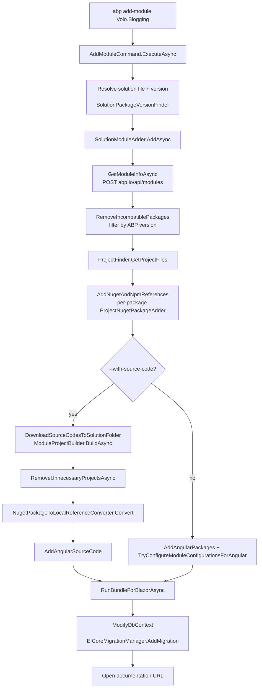

`ProjectBuilding/` is for creating new solutions from a zip. `ProjectModification/` is the opposite half — taking an **existing** solution on disk and editing it. Adding a NuGet package and the matching `DependsOn(typeof(...))` attribute, splicing every `.csproj` of a multi-package ABP module into the right layered project, downloading a module's source code into `./modules/`, swapping package references for project references, regenerating EF Core migrations, walking every `package.json` to update npm versions — those are all `ProjectModification/` responsibilities. This page tours that subsystem and the four commands that drive it: `add-package`, `add-module`, `get-source`, and the listing helpers.

<Info>
The companion pages cover the read-only side: [Project building and templates](/cli/project-building-and-templates) for the `abp new` pipeline, [Source code store](/cli/source-code-store) for `abp.io` downloads. `update` (NuGet + npm version bump) and `switch-to-*` are documented in [Update command](/cli/new-and-update) — this page focuses on add / get-source / list.
</Info>

## Source layout

<Card title="framework/src/Volo.Abp.Cli.Core/Volo/Abp/Cli/ProjectModification" icon="folder" horizontal>
30+ services covering NuGet/npm packaging, csproj/sln XML editing, EF Core migration orchestration, Angular schematic configuration and module catalogue lookups. Every type is `ITransientDependency` so they're hot-resolved per command invocation.
</Card>

### File inventory — modifiers

| File | Type | Responsibility |
| --- | --- | --- |
| `SolutionModuleAdder.cs` | service | The orchestrator behind `add-module`. Fetches the module manifest, adds NuGet refs project-by-project, optionally downloads source code into `./modules/<Module.Name>/`. |
| `ProjectNugetPackageAdder.cs` | service | Adds a single `<PackageReference>` to a chosen `.csproj` plus the `DependsOn(typeof(XxxModule))` attribute in the project's module class. |
| `ProjectNpmPackageAdder.cs` | service | Adds an `@abp/ng.*` dependency to `package.json` (Angular) and, when requested, downloads its source under `angular/projects/`. |
| `NugetPackageToLocalReferenceConverter.cs` | service | After `--with-source-code`, rewrites every solution `<PackageReference>` for the module to `<ProjectReference>` pointing at the freshly-extracted folder. |
| `LocalReferenceConverter.cs` | service | The lower-level XML rewriter used by both `--with-source-code` and `switch-to-local`. |
| `SolutionFileModifier.cs` | service | Reads/writes raw `.sln` text. `AddModuleToSolutionFileAsync`, `AddPackageToSolutionFileAsync`, `RemoveProjectFromSolutionFileAsync`. |
| `NpmPackagesUpdater.cs` | service | Walks every `package.json` under a folder and bumps `@abp/*` and `@volo/*` dependencies. Used by `update` and `switch-to-*`. |
| `VoloNugetPackagesVersionUpdater.cs` | service | The NuGet counterpart of `NpmPackagesUpdater`. |
| `SolutionPackageVersionFinder.cs` | service | Sniffs the current ABP version from the solution (csproj `<PackageReference>` versions, or `Volo.Abp*.dll` `FileVersionInfo`). Drives default `-v` resolution everywhere. |

### File inventory — code rewriters

| File | Responsibility |
| --- | --- |
| `EfCoreMigrationManager.cs` | Adds and applies EF Core migrations (`dotnet ef migrations add ...`, `dotnet ef database update ...`). Detects the `*MigrationsDbContext` and separate-tenant `*TenantMigrationsDbContext`. |
| `DbContextFileBuilderConfigureAdder.cs` | Inserts `builder.ConfigureXxx();` calls into a module's `OnModelCreating`. |
| `DerivedClassFinder.cs` | Locates the project's `AbpModule` class so `ModuleClassDependcyAdder` can patch it. |
| `ModuleClassDependcyAdder.cs` | Adds `[DependsOn(typeof(MyModule))]` and the matching `using`. |
| `UsingStatementAdder.cs` | Inserts a `using X;` line into a C# file, sorted, idempotent. |
| `AngularSourceCodeAdder.cs` | Copies an Angular module from the downloaded source into `angular/projects/`. |
| `AngularThemeConfigurer.cs` | Rewrites `angular.json` for the chosen `--theme`. |
| `AngularPwaSupportAdder.cs` | Adds Angular PWA scaffolding when `--pwa` was passed to `new`. |
| `BlazorProjectTypeChecker.cs` | Discriminates server vs WebAssembly vs MauiBlazor projects (used by bundling and theme switching). |
| `ThemePackageAdder.cs` | Adds the per-UI theme NuGet packages (Volo.Abp.AspNetCore.Mvc.UI.Theme.LeptonXLite, etc.) for `new` and `add-module`. |

### File inventory — catalogues and DTOs

| File | Responsibility |
| --- | --- |
| `ModuleInfo.cs` | The shape of a single module manifest entry returned by `abp.io`. |
| `ModuleWithMastersInfo.cs` | `ModuleInfo` + dependent ("master") modules. The full graph used by `SolutionModuleAdder`. |
| `NuGetPackageInfo.cs` | Single NuGet package descriptor — name, target project type, tiered target. |
| `NuGetPackageTarget.cs` | Enum of layered project hooks: `Web`, `Domain`, `Application`, `EntityFrameworkCore`, `MongoDB`, `IdentityServer`, etc. |
| `NpmPackageInfo.cs` | Single npm package descriptor with `NpmApplicationType` flag (`Angular`, `React`, `Mvc`). |
| `ProjectFinder.cs` | `FindNuGetTargetProjectFile(projectFiles, target)` — maps a `NuGetPackageTarget` to the `*.csproj` that matches by name suffix. |
| `MyGetPackageListFinder.cs` / `MyGetPackage.cs` / `MyGetApiResponse.cs` | Queries the `dev` / nightly MyGet feed (used by `switch-to-nightly`). |
| `PackagePreviewSwitcher.cs` | Swaps stable and preview package versions for `switch-to-preview` / `switch-to-stable`. |
| `PackageSourceManager.cs` | Adds/removes feeds in `NuGet.Config`. |
| `AddModuleInfoOutput.cs` | The DTO returned to `AddModuleCommand.LastAddedModuleInfo` (used by ABP Studio). |
| `Events/ModuleInstallingProgressEvent.cs` | `ILocalEventBus` event published as each step of `SolutionModuleAdder.AddAsync` finishes. |

### Commands that drive `ProjectModification/`

| Command file | Verb | What it triggers |
| --- | --- | --- |
| `Commands/AddPackageCommand.cs` | `add-package` | `ProjectNugetPackageAdder.AddAsync` or `ProjectNpmPackageAdder.AddAngularPackageAsync`. |
| `Commands/AddModuleCommand.cs` | `add-module` | `SolutionModuleAdder.AddAsync`. |
| `Commands/GetSourceCommand.cs` | `get-source` | `SourceCodeDownloadService.DownloadModuleAsync` → `ModuleProjectBuilder.BuildAsync`. |
| `Commands/ListModulesCommand.cs` | `list-modules` | Prints the marketplace module catalogue. |
| `Commands/ListTemplatesCommand.cs` | `list-templates` | Prints the available `-t` template names. |

<Warning>
There is **no** `RemovePackageCommand`, `RemoveModuleCommand` or `ListPackagesCommand` in `Volo.Abp.Cli.Core/Commands/`. Removal is done by hand (delete `<PackageReference>`, delete `DependsOn(...)`); listing is restricted to templates and modules. The only `Remove*Command` registered is `RemoveProxyCommand` (see [Service proxy generation](/cli/service-proxy-generation)).
</Warning>

## `add-module` end-to-end



## `AddPackageCommand`

```csharp framework/src/Volo.Abp.Cli.Core/Volo/Abp/Cli/Commands/AddPackageCommand.cs
public class AddPackageCommand : IConsoleCommand, ITransientDependency
{
    public const string Name = "add-package";

    protected ProjectNugetPackageAdder ProjectNugetPackageAdder { get; }
    public ProjectNpmPackageAdder ProjectNpmPackageAdder { get; }
    // ctor

    public virtual async Task ExecuteAsync(CommandLineArgs commandLineArgs)
    {
        if (commandLineArgs.Target == null)
        {
            throw new CliUsageException(
                "Package name is missing!" +
                Environment.NewLine + Environment.NewLine +
                GetUsageInfo()
            );
        }

        var isAngularPackage = false;
        var isNugetPackage = true;

        if (commandLineArgs.Target.StartsWith("@"))
        {
            isAngularPackage = true;
            isNugetPackage = false;
        }

        var version = commandLineArgs.Options.GetOrNull(Options.Version.Short, Options.Version.Long);
        var withSourceCode = commandLineArgs.Options.ContainsKey(Options.SourceCode.Long);

        if (isNugetPackage)
        {
            var addSourceCodeToSolutionFile =
                withSourceCode && commandLineArgs.Options.ContainsKey("add-to-solution-file");

            await ProjectNugetPackageAdder.AddAsync(
                GetSolutionFile(commandLineArgs),
                GetProjectFile(commandLineArgs),
                commandLineArgs.Target,
                version,
                true,
                withSourceCode,
                addSourceCodeToSolutionFile
            );
        }
        else if (isAngularPackage)
        {
            await ProjectNpmPackageAdder.AddAngularPackageAsync(
                GetAngularDirectory(commandLineArgs),
                commandLineArgs.Target,
                version,
                withSourceCode
            );
        }
    }
    // ...
}
```

The branch is based purely on whether the package name starts with `@` — Angular scoped packages route to npm, everything else to NuGet.

| Option | Long | Short | Behaviour |
| --- | --- | --- | --- |
| Project file | `--project` | `-p` | Forces a specific csproj. If omitted, `ProjectFinder.FindNuGetTargetProjectFile` infers the right one from `NugetPackageInfo.Target`. |
| Solution file | `--solution` | `-s` | Forces a specific .sln (otherwise the `.sln` in the current directory). |
| With source code | `--with-source-code` | — | Triggers the source-code download + project-reference conversion. |
| Add to solution file | `--add-to-solution-file` | — | When source code is downloaded, also adds the new csproj entries to `.sln`. NuGet packages only. |
| Angular directory | `--angular-directory` | `-ad` | The folder that contains `angular.json`. Angular packages only. |
| Version | `--version` | `-v` | If null, inherits from `SolutionPackageVersionFinder`. |

## `ProjectNugetPackageAdder`

```csharp framework/src/Volo.Abp.Cli.Core/Volo/Abp/Cli/ProjectModification/ProjectNugetPackageAdder.cs
public async Task AddAsync(
    string solutionFile,
    string projectFile,
    NugetPackageInfo package,
    string version = null,
    bool useDotnetCliToInstall = true,
    bool withSourceCode = false,
    bool addSourceCodeToSolutionFile = false)
{
    if (projectFile == null)
    {
        if (solutionFile == null)
        {
            throw new CliUsageException("Couldn't find any project/solution.");
        }

        projectFile = GetProjectFile(solutionFile, package);

        if (projectFile == null)
        {
            throw new CliUsageException("Couldn't find any project/solution.");
        }
    }

    solutionFile ??= FindSolutionFile(projectFile);

    if (version == null)
    {
        version = GetAbpVersionOrNull(projectFile);
    }

    await AddAsPackageReference(projectFile, package, version, useDotnetCliToInstall);

    if (withSourceCode)
    {
        await AddSourceCode(projectFile, solutionFile, package, version);

        var projectFilesInSolution = Directory.GetFiles(Path.GetDirectoryName(solutionFile),
            "*.csproj", SearchOption.AllDirectories);
        foreach (var projectFileInSolution in projectFilesInSolution)
        {
            await ConvertPackageReferenceToProjectReference(projectFileInSolution, solutionFile, package);
        }

        if (addSourceCodeToSolutionFile)
        {
            await SolutionFileModifier.AddPackageToSolutionFileAsync(package, solutionFile);
        }
    }
}
```

Three core operations:

1. **`AddAsPackageReference`** runs `dotnet add <csproj> package <name> -v <version>` via `ICmdHelper`. The `useDotnetCliToInstall` parameter exists because `SolutionModuleAdder` sometimes prefers to do the XML edit directly (parallel installs) — but the default path goes through `dotnet add`.
2. **`AddSourceCode`** invokes `SourceCodeDownloadService.DownloadNugetPackageAsync` to fetch and unzip the package's source under `./packages/<Package.Name>/`.
3. **`ConvertPackageReferenceToProjectReference`** is the XmlDocument rewriter that swaps `<PackageReference Include="X" Version="Y" />` for `<ProjectReference Include="..\packages\X\X.csproj" />` in every solution csproj that referenced the package. The XPath is `/Project/ItemGroup/PackageReference[starts-with(@Include, '{package.Name}')]`.

`GetAbpVersionOrNull` delegates to `SolutionPackageVersionFinder.FindByCsprojVersion` so that the new package picks the same `Version="…"` already used by sibling `Volo.Abp.*` packages in the project.

### `ProjectFinder.FindNuGetTargetProjectFile`

```csharp framework/src/Volo.Abp.Cli.Core/Volo/Abp/Cli/ProjectModification/ProjectFinder.cs
public static string FindNuGetTargetProjectFile(string[] projectFiles, NuGetPackageTarget target)
{
    if (!projectFiles.Any()) return null;
    var assemblyNames = GetAssemblyNames(projectFiles);

    switch (target)
    {
        case NuGetPackageTarget.Web:
            return FindProjectEndsWith(projectFiles, assemblyNames, ".Web");
        case NuGetPackageTarget.IdentityServer:
            return FindProjectEndsWith(projectFiles, assemblyNames, ".IdentityServer")
                ?? FindProjectEndsWith(projectFiles, assemblyNames, ".AuthServer");
        case NuGetPackageTarget.EntityFrameworkCore:
            return FindProjectEndsWith(projectFiles, assemblyNames, ".EntityFrameworkCore");
        case NuGetPackageTarget.MongoDB:
            return FindProjectEndsWith(projectFiles, assemblyNames, ".MongoDB");
        case NuGetPackageTarget.Application:
            return FindProjectEndsWith(projectFiles, assemblyNames, ".Application")
                ?? FindProjectEndsWith(projectFiles, assemblyNames, ".Web");
        case NuGetPackageTarget.ApplicationContracts:
            return FindProjectEndsWith(projectFiles, assemblyNames, ".Application.Contracts");
        // ... Domain, Domain.Shared, HttpApi, HttpApi.Client, ...
    }
}
```

The convention-based mapping is what lets `abp add-module Volo.Saas` figure out — without any user input — that `Volo.Saas.Domain` belongs to `*.Domain`, `Volo.Saas.EntityFrameworkCore` to `*.EntityFrameworkCore`, etc.

## `AddModuleCommand` and `SolutionModuleAdder`

```csharp framework/src/Volo.Abp.Cli.Core/Volo/Abp/Cli/Commands/AddModuleCommand.cs
public async Task ExecuteAsync(CommandLineArgs commandLineArgs)
{
    if (commandLineArgs.Target == null) { /* usage exception */ }

    if (_options.DisabledModulesToAddToSolution.Contains(commandLineArgs.Target))
    {
        throw new CliUsageException(
            $"{commandLineArgs.Target} Module is not available for this command! " +
            "You can check the module's documentation for more info.");
    }

    var newTemplate = commandLineArgs.Options.ContainsKey(Options.NewTemplate.Long);
    var template = commandLineArgs.Options.GetOrNull(Options.Template.Short, Options.Template.Long);
    var newProTemplate = !string.IsNullOrEmpty(template) && template == ModuleProTemplate.TemplateName;
    var withSourceCode = newTemplate || newProTemplate ||
                         commandLineArgs.Options.ContainsKey(Options.SourceCode.Long);
    var addSourceCodeToSolutionFile = withSourceCode &&
        commandLineArgs.Options.ContainsKey("add-to-solution-file");
    var skipDbMigrations = newTemplate || newProTemplate ||
        commandLineArgs.Options.ContainsKey(Options.DbMigrations.Skip);
    var solutionFile = GetSolutionFile(commandLineArgs);

    var version = commandLineArgs.Options.GetOrNull(Options.Version.Short, Options.Version.Long);
    if (version == null)
    {
        if (commandLineArgs.Target.Contains("LeptonX"))
        {
            version = SolutionPackageVersionFinder.FindByCsprojVersion(
                solutionFile, excludedKeywords: null, includedKeyword: "LeptonX");

            if (version.Contains("*"))
            {
                version = SolutionPackageVersionFinder.FindByDllVersion(
                    solutionFile, "Volo.Abp.*LeptonX*");
            }
        }
        else
        {
            version = SolutionPackageVersionFinder.FindByCsprojVersion(solutionFile);
        }
    }

    var moduleInfo = await SolutionModuleAdder.AddAsync(
        solutionFile, commandLineArgs.Target, version,
        skipDbMigrations, withSourceCode, addSourceCodeToSolutionFile,
        newTemplate, newProTemplate);

    _lastAddedModuleInfo = new AddModuleInfoOutput { /* ... */ };
}
```

| Flag | Purpose |
| --- | --- |
| `--new` | Create a *fresh* module from the `module` template specialised to your namespace and drop it under `./modules/`. Implies `--with-source-code` and `--skip-db-migrations`. |
| `--template module-pro` | Same as `--new` but uses the Pro template. |
| `--with-source-code` | Download the existing module's source into `./modules/` and convert references. |
| `--add-to-solution-file` | Add the new csproj entries to the .sln file. Requires `--with-source-code`. |
| `--skip-db-migrations` / `true|false` | Skip running `dotnet ef migrations add ...` after splicing the EF Core module reference. |
| `-sp / --startup-project` | The csproj to use as `--startup-project` when running `dotnet ef`. |

### `SolutionModuleAdder.AddAsync` step-by-step

```csharp framework/src/Volo.Abp.Cli.Core/Volo/Abp/Cli/ProjectModification/SolutionModuleAdder.cs
public virtual async Task<ModuleWithMastersInfo> AddAsync(
    [NotNull] string solutionFile,
    [NotNull] string moduleName,
    string version,
    bool skipDbMigrations = false,
    bool withSourceCode = false,
    bool addSourceCodeToSolutionFile = false,
    bool newTemplate = false,
    bool newProTemplate = false)
{
    await PublishEventAsync(1, "Retrieving module info...");
    var module = await GetModuleInfoAsync(moduleName, newTemplate, newProTemplate);

    await PublishEventAsync(2, "Removing incompatible packages from module...");
    module = RemoveIncompatiblePackages(module, version);

    var projectFiles = ProjectFinder.GetProjectFiles(solutionFile);
    await AddNugetAndNpmReferences(module, projectFiles, !(newTemplate || newProTemplate));

    var modulesFolderInSolution = Path.Combine(Path.GetDirectoryName(solutionFile), "modules");

    if (withSourceCode || newTemplate || newProTemplate)
    {
        await PublishEventAsync(5, $"Downloading source code of {moduleName}");
        await DownloadSourceCodesToSolutionFolder(module, modulesFolderInSolution, version, newTemplate, newProTemplate);

        await PublishEventAsync(6, $"Deleting incompatible projects from the module source code");
        await RemoveUnnecessaryProjectsAsync(Path.GetDirectoryName(solutionFile), module, projectFiles);

        if (addSourceCodeToSolutionFile)
        {
            await PublishEventAsync(7, $"Adding module to solution file");
            await SolutionFileModifier.AddModuleToSolutionFileAsync(module, solutionFile);
        }

        await PublishEventAsync(8, $"Changing nuget references to local references");
        if (newTemplate || newProTemplate)
        {
            await NugetPackageToLocalReferenceConverter.Convert(module, solutionFile, $"{module.Name}.");
        }
        else
        {
            await NugetPackageToLocalReferenceConverter.Convert(module, solutionFile);
        }

        await AddAngularSourceCode(modulesFolderInSolution, solutionFile, module.Name, newTemplate || newProTemplate);
    }
    else
    {
        await AddAngularPackages(solutionFile, module);
        await TryConfigureModuleConfigurationsForAngular(solutionFile, module);
    }

    await RunBundleForBlazorAsync(projectFiles, module);
    await ModifyDbContext(projectFiles, module, skipDbMigrations);

    if (module.Name.Contains("LeptonX"))
    {
        await SetLeptonXAbpVersionsAsync(solutionFile, Path.Combine(modulesFolderInSolution, module.Name));
    }

    var documentationLink = module.GetFirstDocumentationLinkOrNull();
    if (documentationLink != null)
    {
        CmdHelper.Open(documentationLink);
    }

    return module;
}
```

Notable details:

- **Progress events** — each call to `PublishEventAsync(step, message)` raises a `ModuleInstallingProgressEvent` on `ILocalEventBus`. ABP Studio renders these as a progress bar; the bare CLI logs them.
- **`AddNugetAndNpmReferences`** iterates the module's `NugetPackages` list. For each package, `ProjectFinder.FindNuGetTargetProjectFile(projectFiles, package.Target)` picks the right `.csproj` and `ProjectNugetPackageAdder.AddAsync(null, targetProjectFile, nugetPackage, null, useDotnetCliToInstall)` installs it.
- **`ModifyDbContext`** runs `EfCoreMigrationManager.AddMigration` on the module's `*EntityFrameworkCore.DbMigrations` project (only when `skipDbMigrations == false`). It also calls `DbContextFileBuilderConfigureAdder` to insert the new `builder.ConfigureXxx();` line in `OnModelCreating`.
- **Documentation auto-open** — `CmdHelper.Open(documentationLink)` shells out to the platform-default browser via `start` / `xdg-open` / `open`.

## `get-source` and `SourceCodeDownloadService`

```csharp framework/src/Volo.Abp.Cli.Core/Volo/Abp/Cli/Commands/GetSourceCommand.cs
public class GetSourceCommand : IConsoleCommand, ITransientDependency
{
    public const string Name = "get-source";

    private readonly SourceCodeDownloadService _sourceCodeDownloadService;
    public ModuleProjectBuilder ModuleProjectBuilder { get; }

    public async Task ExecuteAsync(CommandLineArgs commandLineArgs)
    {
        if (commandLineArgs.Target == null)
        {
            throw new CliUsageException(
                "Module name is missing!" +
                Environment.NewLine + Environment.NewLine +
                GetUsageInfo());
        }

        var version = commandLineArgs.Options.GetOrNull(Options.Version.Short, Options.Version.Long);
        var outputFolder = GetOutPutFolder(commandLineArgs);

        var gitHubAbpLocalRepositoryPath = commandLineArgs.Options.GetOrNull(
            Options.GitHubAbpLocalRepositoryPath.Long);
        var gitHubVoloLocalRepositoryPath = commandLineArgs.Options.GetOrNull(
            Options.GitHubVoloLocalRepositoryPath.Long);

        commandLineArgs.Options.Add(CliConsts.Command, commandLineArgs.Command);

        await _sourceCodeDownloadService.DownloadModuleAsync(
            commandLineArgs.Target, outputFolder, version,
            gitHubAbpLocalRepositoryPath, gitHubVoloLocalRepositoryPath,
            commandLineArgs.Options);
    }
    // ...
}
```

`SourceCodeDownloadService` is a thin wrapper that builds a `ProjectBuildArgs` and calls the right `IProjectBuilder`:

```csharp framework/src/Volo.Abp.Cli.Core/Volo/Abp/Cli/Commands/Services/SourceCodeDownloadService.cs
public async Task DownloadModuleAsync(string moduleName, string outputFolder, string version,
    string gitHubAbpLocalRepositoryPath, string gitHubVoloLocalRepositoryPath, AbpCommandLineOptions options)
{
    Logger.LogInformation($"Downloading source code of {moduleName} ({(version != null ? "v" + version : "Latest")})");
    Logger.LogInformation("Output folder: " + outputFolder);

    var result = await ModuleProjectBuilder.BuildAsync(
        new ProjectBuildArgs(
            SolutionName.Parse(moduleName),
            moduleName,
            version,
            outputFolder,
            DatabaseProvider.NotSpecified,
            DatabaseManagementSystem.NotSpecified,
            UiFramework.NotSpecified,
            null, false,
            gitHubAbpLocalRepositoryPath,
            gitHubVoloLocalRepositoryPath,
            null, options));

    using (var templateFileStream = new MemoryStream(result.ZipContent))
    using (var zipInputStream = new ZipInputStream(templateFileStream))
    {
        var zipEntry = zipInputStream.GetNextEntry();
        while (zipEntry != null)
        {
            // ... extract each entry to outputFolder
            zipEntry = zipInputStream.GetNextEntry();
        }
    }
}
```

So `abp get-source Volo.Blogging` flows through the *exact same* `ProjectBuildPipeline` as `abp new`, just with the much smaller `ModuleProjectBuildPipelineBuilder` set of steps and `SourceCodeTypes.Module` as the download `type`. See [Project building and templates](/cli/project-building-and-templates#after-the-pipeline-what-newcommand-does-next) for the pipeline body.

## `SolutionPackageVersionFinder`

Almost every command in this subsystem calls `SolutionPackageVersionFinder` to figure out *what version of ABP this solution is on* so it can install matching packages.

```csharp framework/src/Volo.Abp.Cli.Core/Volo/Abp/Cli/ProjectModification/SolutionPackageVersionFinder.cs
public class SolutionPackageVersionFinder : ITransientDependency
{
    public string FindByDllVersion(string solutionFile, string dllName = "Volo.Abp*")
    {
        var projectFilesUnderSrc = GetProjectFilesOfSolution(solutionFile);
        foreach (var projectFile in projectFilesUnderSrc)
        {
            var dllFiles = Directory.GetFiles(Path.GetDirectoryName(projectFile)!,
                $"{dllName}.dll", SearchOption.AllDirectories);
            if (dllFiles.Any())
            {
                var version = FileVersionInfo.GetVersionInfo(dllFiles.First());
                return $"{version.FileMajorPart}.{version.FileMinorPart}.{version.FileBuildPart}";
            }
        }
        return null;
    }

    public string FindByCsprojVersion(string solutionFile, string packagePrefix = "Volo.Abp",
        string excludedKeywords = "LeptonX", string includedKeyword = null)
    { /* XmlDocument over each csproj, returns the first matching <PackageReference> Version */ }
}
```

| Source | When it's used |
| --- | --- |
| `FindByCsprojVersion` | First choice — picks the literal `Version="…"` of a `Volo.Abp.*` `<PackageReference>` in any solution csproj. |
| `FindByDllVersion` | Fallback when csproj versions are wildcards (`8.*`) — reads the `Volo.Abp*.dll` from `bin/`. |

`AddModuleCommand` has the LeptonX special case shown above: LeptonX has its own version cadence, so `includedKeyword: "LeptonX"` narrows the search to LeptonX-prefixed packages.

## `SolutionFileModifier`

```csharp framework/src/Volo.Abp.Cli.Core/Volo/Abp/Cli/ProjectModification/SolutionFileModifier.cs
public class SolutionFileModifier : ITransientDependency
{
    public static Encoding DefaultEncoding = Encoding.UTF8;

    public async Task RemoveProjectFromSolutionFileAsync(string solutionFile, string projectName)
    {
        using (var fileStream = File.Open(solutionFile, FileMode.Open, FileAccess.ReadWrite, FileShare.None))
        using (var sr = new StreamReader(fileStream, Encoding.Default, true))
        {
            var solutionFileContent = await sr.ReadToEndAsync();
            solutionFileContent.NormalizeLineEndings();

            var lines = solutionFileContent.Split(new[] { Environment.NewLine, "\n" }, StringSplitOptions.None);
            var updatedContent = RemoveProject(lines.ToList(), projectName).JoinAsString(Environment.NewLine);

            fileStream.Seek(0, SeekOrigin.Begin);
            fileStream.SetLength(0);

            using (var sw = new StreamWriter(fileStream, DefaultEncoding))
            {
                await sw.WriteAsync(updatedContent);
                await sw.FlushAsync();
            }
        }
    }

    public async Task AddModuleToSolutionFileAsync(ModuleWithMastersInfo module, string solutionFile) { /* ... */ }
    public async Task AddPackageToSolutionFileAsync(NugetPackageInfo package, string solutionFile) { /* ... */ }
}
```

The .sln format is plain text with `Project("{guid}") = "Name", "path\to.csproj", "{guid}"` lines. `SolutionFileModifier` works at that line level — no MSBuild SDK, no `dotnet sln add`. The output encoding is always UTF-8 (regardless of the input encoding), which matches what Visual Studio writes.

## `NpmPackagesUpdater`

`abp update` (and the `switch-to-*` family) calls `NpmPackagesUpdater.Update(rootDirectory, ...)` after the NuGet half is done:

```csharp framework/src/Volo.Abp.Cli.Core/Volo/Abp/Cli/ProjectModification/NpmPackagesUpdater.cs
public async Task Update(string rootDirectory, bool includePreviews = false,
    bool includeReleaseCandidates = false,
    bool switchToStable = false, string version = null)
{
    var fileList = _packageJsonFileFinder.Find(rootDirectory);

    if (!fileList.Any())
    {
        // nothing to do
    }
    // ... iterates each package.json and updates @abp/* and @volo/* dependencies
}
```

It uses `PackageJsonFileFinder` to discover every `package.json` (skipping `node_modules`), then for each one reads the dependencies dictionary, queries npm for the matching version, and rewrites the JSON in-place. The "matching version" rules differ:

| Mode | Resolves to |
| --- | --- |
| `version != null` | Exactly that version. |
| `includePreviews` | Latest preview tag. |
| `includeReleaseCandidates` | Latest `rc.X`. |
| `switchToStable` | Latest stable, used by `switch-to-stable`. |
| Default | Latest stable that matches the local NuGet major.minor. |

After rewriting, `NpmPackagesUpdater` invokes `InstallLibsService.InstallLibsAsync` to run `npm install` and refresh `wwwroot/libs`.

## `EfCoreMigrationManager`

```csharp framework/src/Volo.Abp.Cli.Core/Volo/Abp/Cli/ProjectModification/EfCoreMigrationManager.cs
public void AddMigration(string dbMigrationsCsprojFile, string module)
{
    var dbMigrationsProjectFolder = Path.GetDirectoryName(dbMigrationsCsprojFile);
    var moduleName = ParseModuleName(module);
    var migrationName = "Added_" + moduleName + "_Module" + GetUniquePostFix();

    var tenantDbContextName = FindTenantDbContextName(dbMigrationsProjectFolder);
    var dbContextName = tenantDbContextName != null
        ? FindDbContextName(dbMigrationsProjectFolder)
        : null;

    if (!string.IsNullOrEmpty(tenantDbContextName))
    {
        RunAddMigrationCommand(dbMigrationsProjectFolder, migrationName, tenantDbContextName, "TenantMigrations");
    }

    RunAddMigrationCommand(dbMigrationsProjectFolder, migrationName, dbContextName, "Migrations");
}
```

Migration names are deterministic: `Added_<ModuleName>_Module_<random5>`. The dual-context path exists for solutions using the separate-tenant-schema option — the helper invokes `dotnet ef migrations add ... --context <Name>` once for the tenant DbContext and once for the host DbContext. See [Migrate and Suite](/cli/migrate-and-suite) for the related `InitialMigrationCreator` used after `abp new`.

## `ModuleClassDependcyAdder` and `UsingStatementAdder`

After a NuGet package is added the module's `AbpModule` class still needs `[DependsOn(typeof(XxxModule))]`:

```csharp framework/src/Volo.Abp.Cli.Core/Volo/Abp/Cli/ProjectModification/ModuleClassDependcyAdder.cs
public virtual void Add(string path, string module)
{
    ParseModuleNameAndNameSpace(module, out var nameSpace, out var moduleName);

    var file = File.ReadAllText(path);
    file = UsingStatementAdder.Add(file, nameSpace);

    if (!file.Contains(moduleName))
    {
        file = InsertDependsOnAttribute(file, moduleName);
    }

    File.WriteAllText(path, file);
}
```

`UsingStatementAdder` finds the right alphabetical insertion point for the `using`. `InsertDependsOnAttribute` reads the existing `[DependsOn(...)]` block and appends `typeof(XxxModule)` to it (creating the attribute if missing). It is **string-level** parsing, not Roslyn — fast, lossy on weird formatting, and intentional.

## `list-modules` and `list-templates`

```csharp framework/src/Volo.Abp.Cli.Core/Volo/Abp/Cli/Commands/ListModulesCommand.cs (excerpt)
public async Task ExecuteAsync(CommandLineArgs commandLineArgs)
{
    Logger.LogInformation("Modules:" + Environment.NewLine);

    var modules = await _moduleInfoProvider.GetModulesAsync();

    foreach (var module in modules)
    {
        Logger.LogInformation($"> {module.Name}: {module.DisplayName}");
    }
}
```

`ListModulesCommand` calls `IModuleInfoProvider.GetModulesAsync()` (which POSTs to `https://abp.io/api/modules/`) and prints the manifest. `ListTemplatesCommand` is the same idea against `/api/download/template/...`.

| Command | Talks to | Lists |
| --- | --- | --- |
| `abp list-modules` | `IModuleInfoProvider` | Marketplace modules (e.g. `Volo.Blogging`, `Volo.Saas`, `Volo.CmsKit.Pro`). |
| `abp list-templates` | hard-coded | Template names: `app`, `app-pro`, `app-nolayers`, `module`, `console`, `wpf`, `maui`, etc. |

There is no `list-packages` — the modules list already enumerates everything that can be installed.

## Extending the subsystem

<AccordionGroup>
<Accordion title="Adding a new NuGet target">
1. Add a value to `NuGetPackageTarget`.
2. Add a `case` in `ProjectFinder.FindNuGetTargetProjectFile` mapping it to a project name suffix.
3. Update the `abp.io` module manifests to use the new target — `ProjectNugetPackageAdder` will route packages accordingly without further changes.
</Accordion>

<Accordion title="Custom module installer">
`SolutionModuleAdder` is `virtual`. Subclass it and replace the registration:
```csharp
services.Replace(ServiceDescriptor.Transient<SolutionModuleAdder, MyModuleAdder>());
```
Override `AddNugetAndNpmReferences` or `DownloadSourceCodesToSolutionFolder` to inject custom behaviour. `AddModuleCommand` resolves `SolutionModuleAdder` from DI, so your subclass will be picked up.
</Accordion>

<Accordion title="Skipping documentation auto-open">
`SolutionModuleAdder.AddAsync` calls `CmdHelper.Open(documentationLink)` at the end. Replace `ICmdHelper` (or wrap the registered `CmdHelper`) to no-op `Open(url)` when running in CI.
</Accordion>
</AccordionGroup>

## Where to go next

<CardGroup cols={2}>
<Card title="Project building and templates" icon="folder-tree" href="/cli/project-building-and-templates">
The new-solution side. `ModuleProjectBuilder` (used by `get-source`) shares the same pipeline base classes.
</Card>
<Card title="Source code store" icon="cloud-arrow-down" href="/cli/source-code-store">
What `SourceCodeDownloadService` ultimately calls when it needs module zip bytes from `abp.io`.
</Card>
<Card title="Update command" icon="rotate" href="/cli/new-and-update">
`abp update`, `switch-to-stable`, `switch-to-preview`, `switch-to-nightly`, `switch-to-local` — all driven by `VoloNugetPackagesVersionUpdater` and `NpmPackagesUpdater`.
</Card>
<Card title="Migrate and Suite" icon="database" href="/cli/migrate-and-suite">
The post-`add-module` EF Core orchestration — `EfCoreMigrationManager`, `DotnetEfToolManager`, `InitialMigrationCreator`.
</Card>
<Card title="Application template" icon="layer-group" href="/templates/app-template">
The layered project layout that `ProjectFinder.FindNuGetTargetProjectFile` relies on.
</Card>
<Card title="Service proxy generation" icon="bolt" href="/cli/service-proxy-generation">
The other CLI subsystem that edits source code in place — generating C#, JS and Angular HTTP proxies.
</Card>
</CardGroup>
