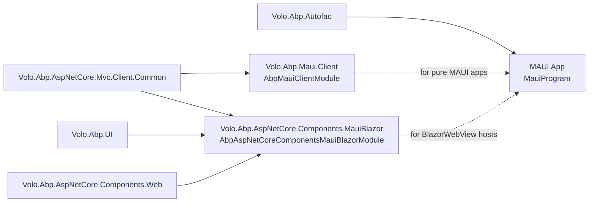

ABP ships two complementary packages for .NET MAUI clients: `Volo.Abp.Maui.Client` (a thin MAUI-side client wrapper around the standard MVC client-common stack) and `Volo.Abp.AspNetCore.Components.MauiBlazor` (the Blazor Hybrid integration that hosts an ABP Blazor app inside a MAUI shell). Together they let a MAUI application call HTTP APIs through ABP's dynamic proxy infrastructure with the same `ICachedApplicationConfigurationClient` contract used by the Blazor WebAssembly host. This page maps the two packages to their source and shows how the pieces compose in a real MAUI startup.

## File inventory

`framework/src/Volo.Abp.Maui.Client/`:

| File                                          | Purpose                                                                                                |
| --------------------------------------------- | ------------------------------------------------------------------------------------------------------ |
| `AbpMauiClientModule.cs`                      | `AbpModule` that depends on `AbpAspNetCoreMvcClientCommonModule` and initialises the configuration cache on app start. |
| `MauiCachedApplicationConfigurationClient.cs` | `ICachedApplicationConfigurationClient` implementation that fetches `ApplicationConfigurationDto` once and serves it from a local cache. |
| `ApplicationConfigurationCache.cs`            | Singleton cache plus a change event used to notify UI when configuration is reloaded.                  |
| `Volo.Abp.Maui.Client.csproj`                 | `net8.0` TFM, references `Volo.Abp.AspNetCore.Mvc.Client.Common`.                                      |

`framework/src/Volo.Abp.AspNetCore.Components.MauiBlazor/`:

| File                                                | Purpose                                                                                                |
| --------------------------------------------------- | ------------------------------------------------------------------------------------------------------ |
| `AbpAspNetCoreComponentsMauiBlazorModule.cs`        | Wires the BlazorWebView host: depends on the MVC client-common module, the AbpUi module, and AspNetCore Components. |
| `AbpMauiBlazorClientHttpMessageHandler.cs`          | Outgoing HTTP message handler attached to every dynamic proxy `HttpClient`.                            |
| `ApplicationConfigurationCache.cs`                  | MauiBlazor-side configuration cache (separate from the Maui.Client one, scoped per Blazor host).       |
| `MauiBlazorCachedApplicationConfigurationClient.cs` | `ICachedApplicationConfigurationClient` for the BlazorWebView host.                                    |
| `MauiBlazorCurrentPrincipalAccessor.cs`             | `ICurrentPrincipalAccessor` backed by the MAUI auth flow.                                              |
| `MauiBlazorCurrentTenantAccessor.cs`                | `ICurrentTenantAccessor` for the BlazorWebView host.                                                   |
| `MauiBlazorRemoteTenantStore.cs`                    | Tenant resolution against the remote application configuration.                                        |
| `MauiBlazorServerUrlProvider.cs`                    | Resolves the base API URL the BlazorWebView talks to.                                                  |
| `IMauiBlazorSelectedLanguageProvider.cs` + `Null*`  | Selected-language abstraction (returns null in the default install).                                   |

<Info>
Two packages, two caches, one contract. The `Volo.Abp.Maui.Client` package is for "pure" MAUI apps (XAML Pages, no Blazor). The `Volo.Abp.AspNetCore.Components.MauiBlazor` package is for MAUI hosts that embed a `BlazorWebView`. They live side-by-side because the Blazor host re-uses MVC client infrastructure (`AbpAspNetCoreMvcClientCommonModule`) but adds Razor component plumbing on top.
</Info>

## `AbpMauiClientModule` — the entry point

```csharp framework/src/Volo.Abp.Maui.Client/Volo/Abp/Maui/Client/AbpMauiClientModule.cs
[DependsOn(
    typeof(AbpAspNetCoreMvcClientCommonModule)
)]
public class AbpMauiClientModule : AbpModule
{
    public async Task OnApplicationInitializationAsync(ApplicationInitializationContext context)
    {
        await context.ServiceProvider
            .GetRequiredService<IClientScopeServiceProviderAccessor>()
            .ServiceProvider
            .GetRequiredService<MauiCachedApplicationConfigurationClient>()
            .InitializeAsync();
    }
}
```

The module is trivial — its job is to ensure that the first time the application initialises, the cached configuration client is primed by calling `InitializeAsync()` against the remote API. Everything else (HTTP client construction, dynamic proxy generation, JSON serialisation) comes through the `AbpAspNetCoreMvcClientCommonModule` dependency.

Two subtleties:

- **`IClientScopeServiceProviderAccessor`** — `Volo.Abp.AspNetCore.Mvc.Client` provides a dedicated scope for client services (separate from the root SP) so that scoped lifetimes work cleanly in long-running clients. The Maui module resolves through that accessor rather than the root SP.
- **`OnApplicationInitializationAsync` runs once** — the cache is populated before any UI component renders, so `IRepository`-style proxy calls don't race against an uninitialised cache.

## `MauiCachedApplicationConfigurationClient`

This is the `ICachedApplicationConfigurationClient` the rest of the MVC client stack consumes. It wraps two remote client proxies — the application configuration endpoint and the localisation endpoint — and caches their merged result:

```csharp framework/src/Volo.Abp.Maui.Client/Volo/Abp/Maui/Client/MauiCachedApplicationConfigurationClient.cs
public class MauiCachedApplicationConfigurationClient :
    ICachedApplicationConfigurationClient,
    ISingletonDependency
{
    protected AbpApplicationConfigurationClientProxy ApplicationConfigurationClientProxy { get; }
    protected AbpApplicationLocalizationClientProxy ApplicationLocalizationClientProxy { get; }
    protected ApplicationConfigurationCache Cache { get; }
    protected ICurrentTenantAccessor CurrentTenantAccessor { get; }

    public virtual async Task<ApplicationConfigurationDto> InitializeAsync()
    {
        var configurationDto = await ApplicationConfigurationClientProxy.GetAsync(
            new ApplicationConfigurationRequestOptions
            {
                IncludeLocalizationResources = false,
            });

        var localizationDto = await ApplicationLocalizationClientProxy.GetAsync(
            new ApplicationLocalizationRequestDto
            {
                CultureName = configurationDto.Localization.CurrentCulture.Name,
                OnlyDynamics = true
            }
        );

        configurationDto.Localization.Resources = localizationDto.Resources;

        CurrentTenantAccessor.Current = new BasicTenantInfo(
            configurationDto.CurrentTenant.Id,
            configurationDto.CurrentTenant.Name);

        Cache.Set(configurationDto);

        return configurationDto;
    }

    public virtual ApplicationConfigurationDto Get()
    {
        return AsyncHelper.RunSync(GetAsync);
    }

    public virtual async Task<ApplicationConfigurationDto> GetAsync()
    {
        var configurationDto = Cache.Get();
        if (configurationDto is null)
        {
            return await InitializeAsync();
        }
        return configurationDto;
    }
}
```

What this does in plain terms:

1. **Two trips, one merge.** Configuration is fetched without localisation resources (`IncludeLocalizationResources = false`), then a focused localisation call retrieves only the current culture's dynamic strings (`OnlyDynamics = true`). The DTOs are merged before being cached, so downstream code sees a single `ApplicationConfigurationDto`.
2. **Tenant pin.** `CurrentTenantAccessor.Current` is set from `configurationDto.CurrentTenant`, so any code running on the MAUI thread sees the correct tenant context without a per-request resolver.
3. **Sync/async coexistence.** `Get()` falls back to `AsyncHelper.RunSync(GetAsync)` so XAML bindings can call into the cache synchronously, while async code paths use `GetAsync()` directly.
4. **`ISingletonDependency`.** A single cache lives for the lifetime of the MAUI process; refreshes happen via `InitializeAsync()` (e.g. after a tenant switch or relogin).

### The cache itself

```csharp framework/src/Volo.Abp.Maui.Client/Volo/Abp/Maui/Client/ApplicationConfigurationCache.cs
public class ApplicationConfigurationCache : ISingletonDependency
{
    protected ApplicationConfigurationDto? Configuration { get; set; }
    public event Action? ApplicationConfigurationChanged;

    public virtual ApplicationConfigurationDto? Get() => Configuration;

    public void Set(ApplicationConfigurationDto configuration)
    {
        Configuration = configuration;
        ApplicationConfigurationChanged?.Invoke();
    }
}
```

A backing field plus an event. UI code can subscribe to `ApplicationConfigurationChanged` to react to refreshes — typically by rerunning permission queries or rebinding menus.

## Composing the MAUI startup

The MAUI template under `templates/maui/` wires the ABP application via `MauiAppBuilder`:

```csharp templates/maui/src/MyCompanyName.MyProjectName/MauiProgram.cs
public static MauiApp CreateMauiApp()
{
    var builder = MauiApp.CreateBuilder();
    builder
        .UseMauiApp<App>()
        .ConfigureFonts(fonts =>
        {
            fonts.AddFont("OpenSans-Regular.ttf", "OpenSansRegular");
            fonts.AddFont("OpenSans-Semibold.ttf", "OpenSansSemibold");
        })
        .ConfigureContainer(new AbpAutofacServiceProviderFactory(new Autofac.ContainerBuilder()));

    ConfigureConfiguration(builder);

    builder.Services.AddApplication<MyProjectNameModule>(options =>
    {
        options.Services.ReplaceConfiguration(builder.Configuration);
    });

    var app = builder.Build();

    app.Services.GetRequiredService<IAbpApplicationWithExternalServiceProvider>().Initialize(app.Services);

    return app;
}
```

The flow is:

```mermaid
sequenceDiagram
    participant Plat as Platform Entry (iOS/Android)
    participant Prog as MauiProgram
    participant Auto as Autofac
    participant ABP as IAbpApplicationWithExternalServiceProvider
    participant Cfg as MauiCachedApplicationConfigurationClient

    Plat->>Prog: CreateMauiApp()
    Prog->>Auto: ConfigureContainer(AbpAutofacServiceProviderFactory)
    Prog->>ABP: builder.Services.AddApplication<MyProjectNameModule>()
    Note over ABP: ConfigureServices runs; modules register
    Prog->>Prog: builder.Build()
    Prog->>ABP: Initialize(app.Services)
    ABP->>Cfg: AbpMauiClientModule.OnApplicationInitializationAsync<br/>→ InitializeAsync()
    Cfg-->>ABP: ApplicationConfigurationDto cached
    Prog-->>Plat: MauiApp ready
```

Key API choices:

- **`AbpAutofacServiceProviderFactory`** wires Autofac as MAUI's DI container; this is the standard ABP integration and is why `AbpAutofacModule` shows up in the template module's `[DependsOn]`.
- **`AddApplication<TModule>()`** is the ABP extension that registers every dependent module's services into the host's `IServiceCollection`.
- **`Initialize(app.Services)`** runs all `OnApplicationInitialization[Async]` hooks. For `Volo.Abp.Maui.Client`, that triggers the configuration cache load.

The template's module is intentionally bare — it depends on `AbpAutofacModule` only:

```csharp templates/maui/src/MyCompanyName.MyProjectName/MyProjectNameModule.cs
[DependsOn(typeof(AbpAutofacModule))]
public class MyProjectNameModule : AbpModule
{
}
```

To talk to an ABP backend, add `[DependsOn(typeof(AbpMauiClientModule))]` and reference your application contracts assembly so the dynamic proxies can be generated.

## MauiBlazor — embedding Blazor in a MAUI shell

If your MAUI app uses a `BlazorWebView`, you depend on the MauiBlazor module instead (or in addition):

```csharp framework/src/Volo.Abp.AspNetCore.Components.MauiBlazor/Volo/Abp/AspNetCore/Components/MauiBlazor/AbpAspNetCoreComponentsMauiBlazorModule.cs
[DependsOn(
    typeof(AbpAspNetCoreMvcClientCommonModule),
    typeof(AbpUiModule),
    typeof(AbpAspNetCoreComponentsWebModule)
)]
public class AbpAspNetCoreComponentsMauiBlazorModule : AbpModule
{
    public override void PreConfigureServices(ServiceConfigurationContext context)
    {
        PreConfigure<AbpHttpClientBuilderOptions>(options =>
        {
            options.ProxyClientBuildActions.Add((_, builder) =>
            {
                builder.AddHttpMessageHandler<AbpMauiBlazorClientHttpMessageHandler>();
            });
        });
    }

    public override void OnApplicationInitialization(ApplicationInitializationContext context)
    {
        AsyncHelper.RunSync(() => OnApplicationInitializationAsync(context));
    }

    public async override Task OnApplicationInitializationAsync(ApplicationInitializationContext context)
    {
        await context.ServiceProvider.GetRequiredService<IClientScopeServiceProviderAccessor>()
            .ServiceProvider.GetRequiredService<MauiBlazorCachedApplicationConfigurationClient>()
            .InitializeAsync();
        await context.ServiceProvider.GetRequiredService<IClientScopeServiceProviderAccessor>()
            .ServiceProvider.GetRequiredService<AbpComponentsClaimsCache>()
            .InitializeAsync();
        await SetCurrentLanguageAsync(context.ServiceProvider);
    }

    private async static Task SetCurrentLanguageAsync(IServiceProvider serviceProvider)
    {
        var configurationClient = serviceProvider.GetRequiredService<ICachedApplicationConfigurationClient>();
        var utilsService = serviceProvider.GetRequiredService<IAbpUtilsService>();
        var configuration = await configurationClient.GetAsync();
        var cultureName = configuration.Localization?.CurrentCulture?.CultureName;
        if (!cultureName.IsNullOrEmpty())
        {
            var culture = new CultureInfo(cultureName!);
            CultureInfo.DefaultThreadCurrentCulture = culture;
            CultureInfo.DefaultThreadCurrentUICulture = culture;
        }

        if (CultureInfo.CurrentUICulture.TextInfo.IsRightToLeft)
        {
            await utilsService.AddClassToTagAsync("body", "rtl");
        }
    }
}
```

What this module adds over `AbpMauiClientModule`:

| Concern                | What happens                                                                                                                              |
| ---------------------- | ----------------------------------------------------------------------------------------------------------------------------------------- |
| HTTP message handler   | `AbpMauiBlazorClientHttpMessageHandler` is attached to every dynamic proxy HTTP client through `AbpHttpClientBuilderOptions.ProxyClientBuildActions`. |
| Configuration cache    | Same merge pattern as the pure MAUI client, but stored in the MauiBlazor-scoped `ApplicationConfigurationCache`.                          |
| Claims cache           | `AbpComponentsClaimsCache.InitializeAsync()` warms claims so `[Authorize]` and `AuthorizeView` work without an extra round-trip.          |
| Culture pinning        | The host's `CurrentCulture`/`CurrentUICulture` are set from configuration; RTL languages get an `rtl` class injected on `<body>` via `IAbpUtilsService.AddClassToTagAsync`. |

The module sets up two layers of caching that downstream Razor components see as plain services — `ICachedApplicationConfigurationClient` and `AbpComponentsClaimsCache`. See [Blazor overview](/blazor/overview) for how these flow into `CascadingAuthenticationState`.

## Module dependency snapshot



A "pure MAUI" host depends on `AbpMauiClientModule` plus `AbpAutofacModule`. A MauiBlazor (hybrid) host adds `AbpAspNetCoreComponentsMauiBlazorModule` on top.

## Consuming dynamic proxies from MAUI

Because `AbpAspNetCoreMvcClientCommonModule` is in the dependency chain, you can register application-service proxies the standard way:

```csharp
Configure<AbpHttpClientBuilderOptions>(options =>
{
    options.ProxyClientBuildActions.Add((_, builder) =>
    {
        // additional handlers per project
    });
});

context.Services.AddHttpClientProxies(
    typeof(IMyAppApplicationContractsModule).Assembly,
    remoteServiceConfigurationName: "Default");
```

The proxies obey `RemoteServiceOptions` configured from `appsettings.json` (which the MAUI template embeds via `EmbeddedFileProvider`):

```csharp templates/maui/src/MyCompanyName.MyProjectName/MauiProgram.cs
private static void ConfigureConfiguration(MauiAppBuilder builder)
{
    var assembly = typeof(App).GetTypeInfo().Assembly;
    builder.Configuration.AddJsonFile(new EmbeddedFileProvider(assembly), "appsettings.json", optional: false, false);
}
```

See [HTTP client overview](/http/overview) for the proxy infrastructure and authentication-token plumbing.

## Application initialisation order

When the MAUI app launches:

1. **MauiProgram.CreateMauiApp()** wires Autofac, loads `appsettings.json`, calls `AddApplication<TModule>()`.
2. **`builder.Build()`** finalises the DI container.
3. **`Initialize(app.Services)`** triggers every module's `OnApplicationInitialization[Async]` hook in dependency order.
4. **`AbpMauiClientModule.OnApplicationInitializationAsync`** runs and calls `MauiCachedApplicationConfigurationClient.InitializeAsync()`.
5. If MauiBlazor is referenced, **`AbpAspNetCoreComponentsMauiBlazorModule.OnApplicationInitializationAsync`** also runs and primes the claims cache + sets culture.
6. The platform-specific entry point returns the `MauiApp` and the OS shows the first page.

By the time the first XAML page or Razor component renders, the application configuration is in the cache and `ICurrentTenant`, `ICurrentPrincipalAccessor`, and culture are all set.

## Identity flow notes

For sign-in, MAUI apps typically pair `Volo.Abp.Maui.Client` with `Volo.Abp.Http.Client.IdentityModel.MauiBlazor` (in the `framework/src/` tree) for OpenID Connect via embedded WebView. The exact identity-package wiring is out of scope for this page — see [HTTP client overview](/http/overview), [IdentityModel token handling](/http/identity-model-token-handling) and [Authorization overview](/authz/overview) for token handling, current-user accessors, and dynamic proxy authentication. The Maui client packages do not re-implement identity; they consume whatever `IAccessTokenProvider`-equivalent your host registers.

## Practical checklists

<AccordionGroup>
  <Accordion title="A pure MAUI client minimum">
    - `[DependsOn(typeof(AbpAutofacModule), typeof(AbpMauiClientModule))]` on your module.
    - `ConfigureContainer(new AbpAutofacServiceProviderFactory(...))` in `MauiProgram`.
    - `AddApplication<TModule>()` followed by `Initialize(app.Services)` after `builder.Build()`.
    - `appsettings.json` embedded via `EmbeddedFileProvider`.
  </Accordion>
  <Accordion title="A MauiBlazor hybrid client minimum">
    - Add `[DependsOn(typeof(AbpAspNetCoreComponentsMauiBlazorModule))]`.
    - Register your Razor root component via `MauiAppBuilder.UseBlazorWebView()`/`<BlazorWebView>` markup.
    - The module's `OnApplicationInitializationAsync` will load configuration, prime the claims cache, and set culture — you don't write this code.
  </Accordion>
  <Accordion title="Refreshing configuration after a tenant switch">
    Call `MauiCachedApplicationConfigurationClient.InitializeAsync()` again. The cache fires `ApplicationConfigurationChanged`; subscribe in your UI to rebind menus, branding, and permissions.
  </Accordion>
</AccordionGroup>

## See also

- [HTTP client overview](/http/overview) — dynamic proxies, `RemoteServiceOptions`, `AbpHttpClientBuilderOptions`, authentication plumbing.
- [Authorization overview](/authz/overview) — `ICurrentUser`, claims caches, permission checks behind the proxy calls.
- [WPF template](/clients/wpf-template) — the parallel desktop story, for comparison.
- [Themes overview](/themes/overview) — the BasicTheme used inside the BlazorWebView when MauiBlazor is in play.
- [Navigation overview](/navigation/overview) — `IMenuManager` and how menu data is delivered to clients.
