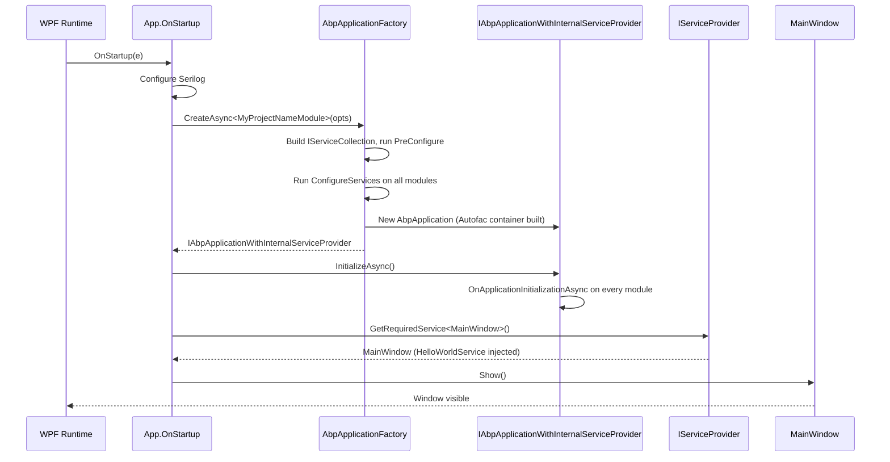
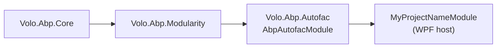

The WPF startup template under `templates/wpf/` is the smallest non-web ABP application in the repository. It demonstrates how to host the full ABP runtime — modules, DI, options, virtual file system — inside a `System.Windows.Application` whose `OnStartup` constructs an `IAbpApplicationWithInternalServiceProvider`, resolves the main window from DI, and shows it. This page is a source-level tour of every file in the template and the integration points worth knowing when adapting it for a real desktop app.

## Project layout

```text templates/wpf/
.gitattributes
.gitignore
common.props                                ← shared LangVersion / Version / NoWarn
MyCompanyName.MyProjectName.sln
src/
  MyCompanyName.MyProjectName/
    App.xaml                                ← System.Windows.Application markup
    App.xaml.cs                             ← ABP bootstrap (OnStartup / OnExit)
    AssemblyInfo.cs                         ← WPF theme resource dictionary attribute
    HelloWorldService.cs                    ← Sample ITransientDependency
    MainWindow.xaml                         ← XAML for the main window
    MainWindow.xaml.cs                      ← DI-constructed Window
    MyCompanyName.MyProjectName.csproj      ← WinExe, net8.0-windows, UseWPF
    MyProjectNameModule.cs                  ← AbpModule, depends on AbpAutofacModule
    appsettings.json                        ← Empty JSON; copied to output
```

## File inventory

| File                          | Role                                                                                                                  |
| ----------------------------- | --------------------------------------------------------------------------------------------------------------------- |
| `*.csproj`                    | `<OutputType>WinExe</OutputType>`, `<TargetFramework>net8.0-windows</TargetFramework>`, `<UseWPF>true</UseWPF>`, references `Volo.Abp.Autofac`. |
| `App.xaml` / `App.xaml.cs`    | Custom `System.Windows.Application` whose `OnStartup` boots ABP and shows the main window.                            |
| `AssemblyInfo.cs`             | `[ThemeInfo(...)]` for WPF resource dictionary lookup; not ABP-specific.                                              |
| `MainWindow.xaml(.cs)`        | DI-constructed `Window` with a single `Label`; uses `HelloWorldService`.                                              |
| `MyProjectNameModule.cs`      | `AbpModule` that depends on `AbpAutofacModule` and registers `MainWindow` as a singleton.                             |
| `HelloWorldService.cs`        | `ITransientDependency` returning `"Hello world!"` — illustrates conventional registration.                            |
| `appsettings.json`            | Empty JSON object copied to output; the template doesn't load it explicitly but downstream apps will.                 |

## Csproj details

```xml templates/wpf/src/MyCompanyName.MyProjectName/MyCompanyName.MyProjectName.csproj
<Project Sdk="Microsoft.NET.Sdk">

    <Import Project="..\..\common.props" />

    <PropertyGroup>
        <OutputType>WinExe</OutputType>
        <TargetFramework>net8.0-windows</TargetFramework>
        <Nullable>enable</Nullable>
        <UseWPF>true</UseWPF>
    </PropertyGroup>

    <ItemGroup>
        <ProjectReference Include="..\..\..\..\framework\src\Volo.Abp.Autofac\Volo.Abp.Autofac.csproj" />
    </ItemGroup>

    <ItemGroup>
        <PackageReference Include="Microsoft.Extensions.Hosting" Version="8.0.0" />
        <PackageReference Include="Serilog.Extensions.Hosting" Version="8.0.0" />
        <PackageReference Include="Serilog.Extensions.Logging" Version="8.0.0" />
        <PackageReference Include="Serilog.Sinks.Async" Version="1.5.0" />
        <PackageReference Include="Serilog.Sinks.File" Version="5.0.0" />
    </ItemGroup>

    <ItemGroup>
      <None Remove="appsettings.json" />
      <Content Include="appsettings.json">
        <CopyToOutputDirectory>Always</CopyToOutputDirectory>
      </Content>
    </ItemGroup>

</Project>
```

Why these choices matter:

- **`OutputType=WinExe`** — produces a Windows executable without a console window. WPF requires this; if you change it to `Exe` the app still runs but a console flashes on launch.
- **`TargetFramework=net8.0-windows`** — WPF requires the `-windows` TFM, which adds the WPF reference assemblies.
- **`UseWPF=true`** — enables the WPF SDK target so `*.xaml` files compile into `BAML` and partial classes are generated.
- **Single ABP reference: `Volo.Abp.Autofac`** — pulled in as a project reference (the template lives in-repo). It transitively brings `Volo.Abp.Core`, `Volo.Abp.Modularity`, and the DI conventions. A real app would replace this with a NuGet `<PackageReference>`.
- **Serilog packages** — the template wires Serilog directly in `App.xaml.cs` (file sink + async sink). `Microsoft.Extensions.Hosting` is referenced for `LoggerConfiguration` consumers, even though the template doesn't run a `Host`.

## The module

```csharp templates/wpf/src/MyCompanyName.MyProjectName/MyProjectNameModule.cs
[DependsOn(typeof(AbpAutofacModule))]
public class MyProjectNameModule : AbpModule
{
    public override void ConfigureServices(ServiceConfigurationContext context)
    {
        context.Services.AddSingleton<MainWindow>();
    }
}
```

Two registrations are happening here that matter:

1. **`[DependsOn(typeof(AbpAutofacModule))]`** — even though we'll call `options.UseAutofac()` in `OnStartup`, the dependency on `AbpAutofacModule` ensures the Autofac integration's services are registered at module-load time, not on-demand later.
2. **`AddSingleton<MainWindow>`** — `MainWindow` has constructor parameters (it injects `HelloWorldService`), so it cannot be `new`'d by WPF's parameterless `new MainWindow()` convention. Registering it explicitly lets `App.OnStartup` resolve it via `services.GetRequiredService<MainWindow>()`.

Conventional registration covers everything else: `HelloWorldService : ITransientDependency` is automatically registered by ABP's convention scanner without needing an explicit `Add*<>()` call.

## The bootstrap: `App.xaml.cs`

This is the most important file in the template. The whole desktop integration lives here:

```csharp templates/wpf/src/MyCompanyName.MyProjectName/App.xaml.cs
public partial class App : Application
{
    private IAbpApplicationWithInternalServiceProvider? _abpApplication;

    protected override async void OnStartup(StartupEventArgs e)
    {
        Log.Logger = new LoggerConfiguration()
#if DEBUG
            .MinimumLevel.Debug()
#else
            .MinimumLevel.Information()
#endif
            .MinimumLevel.Override("Microsoft", LogEventLevel.Information)
            .Enrich.FromLogContext()
            .WriteTo.Async(c => c.File("Logs/logs.txt"))
            .CreateLogger();

        try
        {
            Log.Information("Starting WPF host.");

            _abpApplication =  await AbpApplicationFactory.CreateAsync<MyProjectNameModule>(options =>
            {
                options.UseAutofac();
                options.Services.AddLogging(loggingBuilder => loggingBuilder.AddSerilog(dispose: true));
            });

            await _abpApplication.InitializeAsync();

            _abpApplication.Services.GetRequiredService<MainWindow>()?.Show();

        }
        catch (Exception ex)
        {
            Log.Fatal(ex, "Host terminated unexpectedly!");
        }
    }

    protected override async void OnExit(ExitEventArgs e)
    {
        if (_abpApplication != null)
        {
            await _abpApplication.ShutdownAsync();
        }
        Log.CloseAndFlush();
    }
}
```

### The launch sequence



### Things that often confuse people

<AccordionGroup>
  <Accordion title="async void OnStartup — is that safe?">
    `OnStartup` is a `void` virtual override; WPF doesn't await it. Marking it `async void` is the pragmatic choice — exceptions are caught by the surrounding `try`/`catch` and logged through Serilog. For more deterministic shutdown semantics in production, gate the `Show()` call on a `TaskCompletionSource` or move bootstrapping to a synchronous wrapper that blocks via `Task.GetAwaiter().GetResult()`.
  </Accordion>
  <Accordion title="IAbpApplicationWithInternalServiceProvider vs IAbpApplicationWithExternalServiceProvider">
    The WPF template uses the *internal* variant — `AbpApplicationFactory` owns the `IServiceProvider` and disposes it on shutdown. The MAUI template (see [MAUI client](/clients/maui)) uses the *external* variant because `MauiAppBuilder` owns the container. For a WPF app that wants to share the SP with a `Microsoft.Extensions.Hosting.IHost`, switch to `WithExternalServiceProvider` and call `Initialize(serviceProvider)`.
  </Accordion>
  <Accordion title="Where does appsettings.json get read?">
    The template's `appsettings.json` is empty and is only copied to the output via `<Content>`. ABP does not auto-load it in the WPF template; you can add a `ConfigurationBuilder` before `CreateAsync` and pass it via `options.Services.ReplaceConfiguration(config)`. The MAUI template does this with `EmbeddedFileProvider`; the WPF template leaves it as an exercise so you can choose your config source.
  </Accordion>
</AccordionGroup>

### Shutdown

`OnExit` awaits `ShutdownAsync()` so every module's `OnApplicationShutdown` hook runs (releasing background workers, flushing distributed-event publishers, etc.). `Log.CloseAndFlush()` then drains the async file sink so the last log lines hit disk before the process exits.

## `MainWindow` — DI-constructed `Window`

```csharp templates/wpf/src/MyCompanyName.MyProjectName/MainWindow.xaml.cs
public partial class MainWindow : Window
{
    private readonly HelloWorldService _helloWorldService;

    public MainWindow(HelloWorldService helloWorldService)
    {
        _helloWorldService = helloWorldService;
        InitializeComponent();
    }

    protected override void OnContentRendered(EventArgs e)
    {
        HelloLabel.Content = _helloWorldService.SayHello();
    }
}
```

```xml templates/wpf/src/MyCompanyName.MyProjectName/MainWindow.xaml
<Window x:Class="MyCompanyName.MyProjectName.MainWindow"
        xmlns="http://schemas.microsoft.com/winfx/2006/xaml/presentation"
        xmlns:x="http://schemas.microsoft.com/winfx/2006/xaml"
        ...
        Title="MainWindow" Height="450" Width="800">
    <Grid>
        <Label Name="HelloLabel" FontSize="90" Margin="58,129,-58,-129"/>
    </Grid>
</Window>
```

Important rule: because we register `MainWindow` in DI and resolve it from there, the parameterless XAML pattern `<Application StartupUri="MainWindow.xaml" />` **does not work**. The template leaves `Application.Resources` empty in `App.xaml` and shows the window programmatically from `OnStartup`. If you add a `StartupUri`, WPF will try to `new MainWindow()` with the parameterless constructor (which doesn't exist) and throw.

### The sample service

```csharp templates/wpf/src/MyCompanyName.MyProjectName/HelloWorldService.cs
public class HelloWorldService : ITransientDependency
{
    public ILogger<HelloWorldService> Logger { get; set; }

    public HelloWorldService()
    {
        Logger = NullLogger<HelloWorldService>.Instance;
    }

    public string SayHello()
    {
        Logger.LogInformation("Call SayHello");
        return "Hello world!";
    }
}
```

Three standard ABP patterns in one class:

- **`ITransientDependency`** — picked up by conventional registration, no explicit `Add*<>()`.
- **Property-injected logger** — `public ILogger<T> Logger { get; set; }`. ABP's logger property injection sets this after construction so unit tests can `new HelloWorldService()` directly.
- **`NullLogger<T>.Instance` default** — keeps the property non-null even when DI hasn't injected, so test code doesn't need to mock it.

## Module dependency snapshot



The template's module graph is minimal — pulling in `AbpAutofacModule` transitively gives you everything from the core framework: DI conventions, options, logging integration, and the modularity pipeline. To add HTTP API clients, take a dependency on `AbpHttpClientModule` and register dynamic proxies as shown in [HTTP client overview](/http/overview).

## Adapting the template for a real app

<Steps>
  <Step title="Add configuration">
    Build an `IConfiguration` (JSON files, env vars, user secrets) before `CreateAsync` and pass it via `options.Services.ReplaceConfiguration(config)`. Then `IOptions<>` bindings work as in ASP.NET.
  </Step>
  <Step title="Register API client proxies">
    `[DependsOn(typeof(AbpHttpClientModule))]`, configure `RemoteServiceOptions` from your `appsettings.json`, then `AddHttpClientProxies(typeof(IMyAppApplicationContractsModule).Assembly, remoteServiceConfigurationName: "Default")`.
  </Step>
  <Step title="Wire up authentication">
    For interactive desktop apps, plug in `Microsoft.Identity.Client` or `IdentityModel.OidcClient` and supply an `HttpMessageHandler` that attaches access tokens — see [Authorization overview](/authz/overview).
  </Step>
  <Step title="Register your XAML windows">
    Every `Window` or `Page` that has constructor dependencies must be added to DI (transient or singleton depending on lifetime). Resolve them via `_abpApplication.Services.GetRequiredService<TWindow>()`.
  </Step>
  <Step title="Use IUiMessageService / IUiNotificationService analogs">
    The framework provides UI-service abstractions in `Volo.Abp.Ui`. They are stack-agnostic; implement them against MessageBox/dialogs for WPF.
  </Step>
  <Step title="Background workers">
    Implement `IBackgroundWorker` for things like polling — ABP's worker host runs them automatically after `InitializeAsync()`. They will be shut down cleanly in `OnExit` via `ShutdownAsync()`.
  </Step>
</Steps>

## Common pitfalls

<Warning>
**Don't set `StartupUri` in `App.xaml`.** WPF will try to construct your window with the parameterless ctor (which doesn't exist when DI is in play). Either remove the constructor parameters (and use a service locator anti-pattern — discouraged) or keep `OnStartup` as the orchestrator and `Show()` the window manually.
</Warning>

<Warning>
**Don't forget `await _abpApplication.ShutdownAsync()`.** Modules with background workers or open HTTP connections rely on this hook to drain. Skipping it on `OnExit` will leak resources and may leave Serilog log lines unflushed.
</Warning>

<Tip>
For multi-window apps, register each window as transient (`AddTransient<TWindow>()`) so each call to `GetRequiredService<TWindow>()` returns a fresh instance. Singleton is correct only for the main shell.
</Tip>

## Comparing WPF vs MAUI hosting

| Concern               | WPF template                                              | MAUI template (`/clients/maui`)                                              |
| --------------------- | --------------------------------------------------------- | ---------------------------------------------------------------------------- |
| Host builder          | `AbpApplicationFactory.CreateAsync<TModule>`              | `MauiAppBuilder.Services.AddApplication<TModule>` + `Initialize(app.Services)` |
| Service-provider role | Internal — ABP owns the SP                                | External — `MauiAppBuilder` owns the SP                                      |
| Autofac integration   | `options.UseAutofac()`                                    | `ConfigureContainer(new AbpAutofacServiceProviderFactory(...))`              |
| Startup logging       | Serilog wired in `App.OnStartup`                          | App-author's choice; not in the bare template                                |
| Window/page DI        | `services.AddSingleton<MainWindow>()`                     | Pages registered via MAUI conventions or `services.Add*<>()`                 |
| Shutdown hook         | `await _abpApplication.ShutdownAsync()` in `OnExit`       | MAUI lifecycle events; or rely on process termination                        |

Both share the same module graph and DI conventions — only the host glue is different.

## See also

- [MAUI client](/clients/maui) — the mobile/desktop sibling, with cached application configuration and BlazorWebView hosting.
- [HTTP client overview](/http/overview) — dynamic proxies and `RemoteServiceOptions` you'll bolt onto the WPF template.
- [Authorization overview](/authz/overview) — `ICurrentUser`, claims, and how to feed access tokens through the proxy pipeline.
- [Themes overview](/themes/overview) and [Navigation overview](/navigation/overview) — most desktop apps re-implement their own shell, but the menu abstractions are stack-agnostic and reusable.
