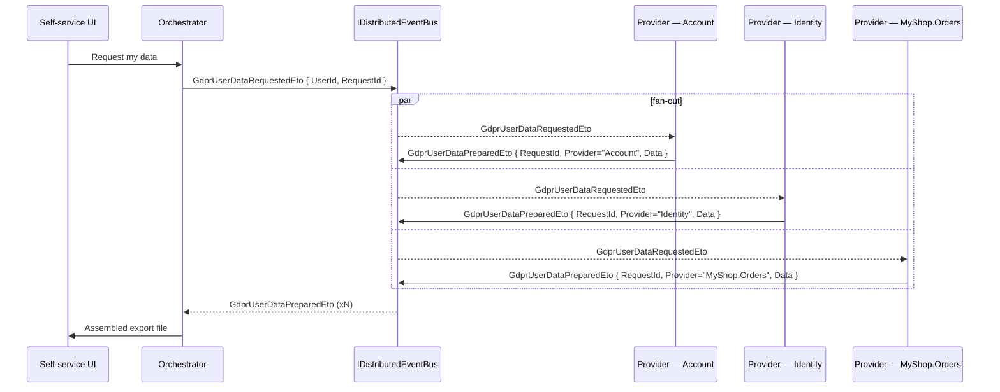
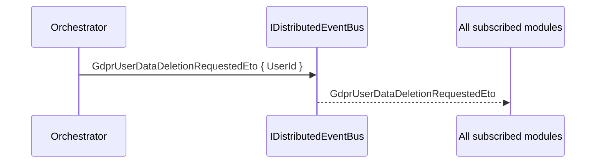

`Volo.Abp.Gdpr.Abstractions` is the small contract package that lets a downstream "personal data" workflow (export, anonymise, delete) be triggered without coupling the trigger to a specific identity module or storage backend. Concrete request orchestration and per-module data providers ship in the framework's commercial Account / Identity modules; this abstractions package is the bridge — distributed-event types and a context object — that any module can plug into. This page enumerates everything in `Volo.Abp.Gdpr.Abstractions/Volo/Abp/Gdpr` and shows how the pieces compose at the message-bus layer.

<Warning>
This page documents the framework-side abstractions only. The commercial Account / Identity Pro modules host the orchestration that emits and consumes these events. If you are looking for end-user export buttons or identity-data providers shipped by ABP, they live outside this open-source package — but they conform to the contracts described below.
</Warning>

## File inventory

Every file is in `framework/src/Volo.Abp.Gdpr.Abstractions/Volo/Abp/Gdpr`.

| File | Role |
| --- | --- |
| `AbpGdprAbstractionsModule.cs` | The (empty) module that anchors the assembly into the dependency graph. |
| `GdprDataInfo.cs` | The personal-data payload — a `Dictionary<string, string>` subtype that subsystems fill. |
| `GdprUserDataProviderContext.cs` | The context passed to data providers — currently `Guid UserId`. |
| `GdprUserDataRequestedEto.cs` | Distributed event: "please collect personal data for this user". |
| `GdprUserDataPreparedEto.cs` | Distributed event: "personal data is ready" — one per provider. |
| `GdprUserDataDeletionRequestedEto.cs` | Distributed event: "please erase personal data for this user". |

## AbpGdprAbstractionsModule

The module file is intentionally empty:

```csharp framework/src/Volo.Abp.Gdpr.Abstractions/Volo/Abp/Gdpr/AbpGdprAbstractionsModule.cs
public class AbpGdprAbstractionsModule : AbpModule
{
}
```

There is nothing to register because every public type in the package is either an `[Serializable]` POCO (the ETOs and `GdprDataInfo`) or a plain class with no DI behaviour (`GdprUserDataProviderContext`). Downstream modules add this assembly via `[DependsOn(typeof(AbpGdprAbstractionsModule))]` so they can publish and subscribe to the ETOs without depending on a concrete implementation package.

## GdprDataInfo — the personal-data payload

```csharp framework/src/Volo.Abp.Gdpr.Abstractions/Volo/Abp/Gdpr/GdprDataInfo.cs
[Serializable]
public class GdprDataInfo : Dictionary<string, string>
{
}
```

It deliberately is a typed `Dictionary<string, string>` — a free-form key/value bag that serializes cleanly through every distributed-event broker ABP supports (RabbitMQ, Kafka, Azure Service Bus, in-process). The keys are the field names a particular module exposes; the values are stringified representations of the field contents (a JSON document for nested data, an ISO-8601 string for dates, plain text for simple fields). Modules consuming the resulting export decide how to format the dictionary into a human-readable artefact (CSV, JSON, PDF).

`[Serializable]` is required so older serializers (e.g. `BinaryFormatter`-style remoting) still work; modern transports use the dictionary serialization paths.

## GdprUserDataProviderContext — the data-collection input

```csharp framework/src/Volo.Abp.Gdpr.Abstractions/Volo/Abp/Gdpr/GdprUserDataProviderContext.cs
public class GdprUserDataProviderContext
{
    public Guid UserId { get; set; }
}
```

The class exists so a "data provider" — any service that knows how to extract personal data for a given user — receives a stable context object instead of a bare `Guid`. As ABP adds more inputs in future versions (correlation ids, request metadata, locale), they will be properties on this class.

| Property | Meaning |
| --- | --- |
| `UserId` | The Guid of the user whose data is to be collected. Matches the value on the corresponding `GdprUserDataRequestedEto`. |

## The three distributed events

The whole GDPR flow is event-driven. The abstractions package defines the message types; orchestration on top decides who publishes and who subscribes.

### GdprUserDataRequestedEto

```csharp framework/src/Volo.Abp.Gdpr.Abstractions/Volo/Abp/Gdpr/GdprUserDataRequestedEto.cs
[Serializable]
public class GdprUserDataRequestedEto
{
    public Guid UserId { get; set; }

    public Guid RequestId { get; set; }
}
```

Published when a user (or an admin acting on their behalf) requests an export. `RequestId` is the correlation id that every downstream `GdprUserDataPreparedEto` reply carries — that is how the orchestrator can collate replies from multiple providers without race-conditions.

### GdprUserDataPreparedEto

```csharp framework/src/Volo.Abp.Gdpr.Abstractions/Volo/Abp/Gdpr/GdprUserDataPreparedEto.cs
[Serializable]
public class GdprUserDataPreparedEto
{
    public Guid RequestId { get; set; }

    public string Provider { get; set; } = default!;

    public GdprDataInfo Data { get; set; } = default!;
}
```

Published by each data provider once it has gathered its slice of the user's data.

| Property | Meaning |
| --- | --- |
| `RequestId` | Correlation id from the original `GdprUserDataRequestedEto`. |
| `Provider` | A free-form identifier for the publishing module (e.g. `"Volo.Account"`, `"Volo.Identity"`, `"MyShop.Orders"`). Lets the consumer label each section of the export. |
| `Data` | The `GdprDataInfo` dictionary populated by the provider. |

### GdprUserDataDeletionRequestedEto

```csharp framework/src/Volo.Abp.Gdpr.Abstractions/Volo/Abp/Gdpr/GdprUserDataDeletionRequestedEto.cs
[Serializable]
public class GdprUserDataDeletionRequestedEto
{
    public Guid UserId { get; set; }
}
```

Published when a user requests erasure ("right to be forgotten"). There is no per-provider acknowledgement type defined in this package — deletion is intended to be fire-and-forget at the abstractions layer; downstream modules either delete synchronously or queue their own bookkeeping events.

## The end-to-end flow

The three events together describe a scatter-gather pattern for export and a broadcast for deletion. The arrows below are distributed-event publications (`IDistributedEventBus.PublishAsync`).



Deletion is the same pattern minus the reply leg:



## Writing a provider for your own module

Any module that stores user-attributable data should subscribe to `GdprUserDataRequestedEto` and publish a `GdprUserDataPreparedEto` in response.

```csharp Example — provider handler
public class OrdersGdprProvider :
    IDistributedEventHandler<GdprUserDataRequestedEto>,
    ITransientDependency
{
    private readonly IRepository<Order, Guid> _orders;
    private readonly IDistributedEventBus _eventBus;

    public OrdersGdprProvider(
        IRepository<Order, Guid> orders,
        IDistributedEventBus eventBus)
    {
        _orders = orders;
        _eventBus = eventBus;
    }

    public async Task HandleEventAsync(GdprUserDataRequestedEto eventData)
    {
        var orders = await _orders.GetListAsync(o => o.CustomerId == eventData.UserId);
        var info = new GdprDataInfo();
        foreach (var order in orders)
        {
            info[$"Order:{order.Id}"] = JsonSerializer.Serialize(new
            {
                order.OrderNumber,
                order.PlacedAt,
                order.TotalAmount,
                order.ShippingAddress
            });
        }

        await _eventBus.PublishAsync(new GdprUserDataPreparedEto
        {
            RequestId = eventData.RequestId,
            Provider = "MyShop.Orders",
            Data = info
        });
    }
}
```

The deletion handler is the symmetric case:

```csharp Example — deletion handler
public class OrdersGdprEraser :
    IDistributedEventHandler<GdprUserDataDeletionRequestedEto>,
    ITransientDependency
{
    private readonly IRepository<Order, Guid> _orders;

    public OrdersGdprEraser(IRepository<Order, Guid> orders) => _orders = orders;

    public async Task HandleEventAsync(GdprUserDataDeletionRequestedEto eventData)
    {
        var orders = await _orders.GetListAsync(o => o.CustomerId == eventData.UserId);
        foreach (var order in orders)
        {
            order.AnonymizeCustomer();  // or _orders.DeleteAsync depending on retention policy
        }
        await _orders.UpdateManyAsync(orders);
    }
}
```

<Tip>
"Deletion" in GDPR terms does not always mean a row delete. For invoicing and tax law you typically have to retain the record but strip personally-identifying fields (anonymise). The handler is the natural place to make that policy decision — and to record an audit event so the erasure is provable later.
</Tip>

## Design notes

A handful of properties of this design are worth calling out:

<CardGroup cols={2}>
  <Card title="No interface for providers">
    There is intentionally no `IGdprUserDataProvider` in the abstractions package. The contract is the event, not a method signature — that way a provider can be in another process / another microservice and the orchestration still works.
  </Card>
  <Card title="Stringly typed payload">
    `GdprDataInfo` is `Dictionary<string, string>` rather than a typed schema. That keeps the contract version-stable as modules add or remove fields, at the cost of structured-querying convenience.
  </Card>
  <Card title="RequestId, not user-scoped collation">
    Replies are correlated by `RequestId`, not by `UserId`. A single user can have multiple in-flight export requests (e.g. one auto-scheduled and one ad-hoc) without their replies getting mixed up.
  </Card>
  <Card title="Empty AbpModule">
    `AbpGdprAbstractionsModule` registers nothing. The only reason to depend on it is to gain access to the event types and the context class — exactly the right footprint for a pure-contract assembly.
  </Card>
</CardGroup>

## What lives elsewhere

The framework's commercial Identity, Account, and Identity-Pro packages provide the in-process orchestrator, the user-facing export/delete UI, and the providers for identity, login-attempt, and security-log data. Those are not part of `Volo.Abp.Gdpr.Abstractions` — they consume it. If you are integrating a non-ABP commercial module into a GDPR workflow, the right move is to publish/subscribe to these ETOs on your own.

## Wiring a subscriber the conventional way

ABP's distributed event bus discovers `IDistributedEventHandler<T>` implementations automatically through the conventional registrar. The fact that the events live in the abstractions assembly is what lets your handler avoid pulling in any commercial dependency:

```csharp Example — handler registration
[DependsOn(
    typeof(AbpEventBusAbstractionsModule),
    typeof(AbpGdprAbstractionsModule)
)]
public class MyShopGdprModule : AbpModule
{
    public override void ConfigureServices(ServiceConfigurationContext context)
    {
        // No explicit registration needed — handlers are picked up via
        // conventional DI as long as they implement IDistributedEventHandler<TEto>
        // and are decorated with ITransientDependency.
    }
}
```

Two characteristics fall out of this:

<CardGroup cols={2}>
  <Card title="Handlers can ship in any project">
    Domain modules, microservices, or background-job hosts can all subscribe — the only assembly dependency is `Volo.Abp.Gdpr.Abstractions`.
  </Card>
  <Card title="Replies are also events">
    A provider does not return a `Task<GdprDataInfo>` — it *publishes* a `GdprUserDataPreparedEto`. Producer and consumer can therefore live in different processes without an RPC channel.
  </Card>
</CardGroup>

## Implementation tips

A handful of operational notes worth keeping in mind when you build providers:

| Concern | Recommendation |
| --- | --- |
| Idempotency | The bus may redeliver. Use `RequestId` as a dedup key on the consumer side. |
| Tenant scoping | If a user belongs to a tenant, set `ICurrentTenant` before querying — see [multitenancy](/multitenancy). |
| Large payloads | `GdprDataInfo` is in-memory. For large object collections, persist the chunk to a `IBlobContainer` and put only the blob reference in the dictionary. |
| Authorization | Publishing the request ETO should require an authenticated user or an explicit admin permission. The bus does not enforce this — the publishing app service must. |
| Auditing | Wrap publish and handle in audit-log scopes so the export and deletion actions remain provable for later regulator review. |

## See also

<CardGroup cols={2}>
  <Card title="Global features" href="/compliance/global-features">
    Companion compliance / governance facility for switching modules on per deployment.
  </Card>
  <Card title="Modularity" href="/modularity">
    Where the empty `AbpGdprAbstractionsModule` slots in.
  </Card>
  <Card title="Multitenancy" href="/multitenancy">
    Per-tenant data layouts a GDPR provider must respect when scoping queries.
  </Card>
  <Card title="Current user" href="/utilities/security-and-current-user">
    The `Guid` user-id source that flows into `GdprUserDataProviderContext.UserId`.
  </Card>
</CardGroup>
