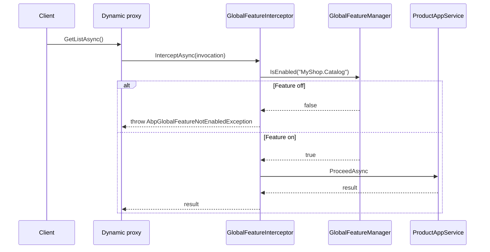

Global features are ABP's mechanism for turning entire slices of functionality on or off **at application bootstrap**, before any user ever signs in. They are deliberately different from per-tenant features (which can change at runtime) and from per-user permissions (which are evaluated per call): a global feature is a compile-time + startup-time decision that the rest of the system can rely on, including the data model. The classic use case is a multi-product code base that ships the same binary as different SKUs ("Community edition without the auditing UI", "Pro edition with all modules"). This page walks the whole `Volo.Abp.GlobalFeatures` package: the manager, the attributes, the interceptor that enforces the contract, and the `SimpleStateChecker` that integrates with the authorization layer.

## File inventory

Everything below lives in `framework/src/Volo.Abp.GlobalFeatures/Volo/Abp/GlobalFeatures`.

| File | Role |
| --- | --- |
| `GlobalFeatureManager.cs` | The central singleton — enabled-feature set + module dictionary. |
| `GlobalFeature.cs` | Abstract base for a typed feature (gives it a manager and a name). |
| `GlobalFeatureNameAttribute.cs` | Marker that names a feature class. |
| `GlobalFeatureDictionary.cs` | `Dictionary<string, GlobalFeature>` helper. |
| `GlobalModuleFeatures.cs` | Abstract base for a logical group of related features. |
| `GlobalModuleFeaturesDictionary.cs` | Manager's module registry. |
| `RequiresGlobalFeatureAttribute.cs` | Decoration that gates a class behind a feature. |
| `IGlobalFeatureCheckingEnabled.cs` | Marker interface — opt-in to interception. |
| `GlobalFeatureInterceptor.cs` | The interceptor — throws if the feature is off. |
| `GlobalFeatureInterceptorRegistrar.cs` | Wires the interceptor at registration time. |
| `GlobalFeatureHelper.cs` | Static `IsGlobalFeatureEnabled(Type, out attribute)`. |
| `RequireGlobalFeaturesSimpleStateChecker.cs` | `ISimpleStateChecker` integration. |
| `GlobalFeaturesSimpleStateCheckerSerializerContributor.cs` | Serializer integration for state checkers. |
| `GlobalFeatureSimpleStateCheckerExtensions.cs` | Fluent `RequireGlobalFeatures(...)` helpers. |
| `AbpGlobalFeatureNotEnabledException.cs` | The exception thrown when a gated service is called with the feature off. |
| `AbpGlobalFeatureErrorCodes.cs` | Error-code constants (used for localized messages). |
| `AbpGlobalFeaturesModule.cs` | Module wiring. |

## GlobalFeatureManager — the central store

```csharp framework/src/Volo.Abp.GlobalFeatures/Volo/Abp/GlobalFeatures/GlobalFeatureManager.cs
public class GlobalFeatureManager
{
    public static GlobalFeatureManager Instance { get; protected set; } = new GlobalFeatureManager();

    /// <summary>A common dictionary to store arbitrary configurations.</summary>
    [NotNull]
    public Dictionary<object, object> Configuration { get; }

    public GlobalModuleFeaturesDictionary Modules { get; }

    protected HashSet<string> EnabledFeatures { get; }

    protected internal GlobalFeatureManager()
    {
        EnabledFeatures = new HashSet<string>();
        Configuration = new Dictionary<object, object>();
        Modules = new GlobalModuleFeaturesDictionary(this);
    }

    public virtual bool IsEnabled<TFeature>()       => IsEnabled(typeof(TFeature));
    public virtual bool IsEnabled([NotNull] Type featureType)
        => IsEnabled(GlobalFeatureNameAttribute.GetName(featureType));
    public virtual bool IsEnabled(string featureName)
        => EnabledFeatures.Contains(featureName);

    public virtual void Enable<TFeature>()  => Enable(typeof(TFeature));
    public virtual void Enable([NotNull] Type featureType)
        => Enable(GlobalFeatureNameAttribute.GetName(featureType));
    public virtual void Enable(string featureName) => EnabledFeatures.AddIfNotContains(featureName);

    public virtual void Disable<TFeature>() => Disable(typeof(TFeature));
    public virtual void Disable([NotNull] Type featureType)
        => Disable(GlobalFeatureNameAttribute.GetName(featureType));
    public virtual void Disable(string featureName) => EnabledFeatures.Remove(featureName);

    public virtual IEnumerable<string> GetEnabledFeatureNames() => EnabledFeatures;
}
```

A few specifics that the API hides at first glance:

<Note>
`GlobalFeatureManager.Instance` is a **static singleton**. This is the only place in the framework where a major piece of configuration is intentionally outside DI. The reason is bootstrap ordering: feature decisions need to be made *before* DI is built, so that EF Core conventions, conventional DI scans, and module dependency resolution can see them. A DI-resolved manager would be too late.
</Note>

| Member | What it does |
| --- | --- |
| `Instance` | Static accessor. Used during `PreConfigureServices`, `ConfigureServices`, and from inside the interceptor. |
| `Configuration` | Free-form dictionary — for ad-hoc extension points that need to coordinate state across modules without inventing a typed options bag. |
| `Modules` | Typed access to `GlobalModuleFeatures` subclasses (see below). |
| `EnabledFeatures` | A `HashSet<string>` keyed by feature name. Empty by default — features are opt-in. |
| `IsEnabled<TFeature>()` | Generic overload that flows through `GlobalFeatureNameAttribute.GetName`. |
| `Enable<TFeature>()` / `Disable<TFeature>()` | Toggles by type. |
| `GetEnabledFeatureNames()` | Mostly used for diagnostics and for the state-checker serializer. |

## GlobalFeatureNameAttribute

Every feature class must carry a name attribute. The static `GetName` looks it up reflectively:

```csharp framework/src/Volo.Abp.GlobalFeatures/Volo/Abp/GlobalFeatures/GlobalFeatureNameAttribute.cs
[AttributeUsage(AttributeTargets.Class)]
public class GlobalFeatureNameAttribute : Attribute
{
    [NotNull]
    public string Name { get; }

    public GlobalFeatureNameAttribute([NotNull] string name)
    {
        Name = Check.NotNullOrWhiteSpace(name, nameof(name));
    }

    public static string GetName<TFeature>() => GetName(typeof(TFeature));

    [NotNull]
    public static string GetName([NotNull] Type type)
    {
        Check.NotNull(type, nameof(type));

        var attribute = type.GetCustomAttributes<GlobalFeatureNameAttribute>().FirstOrDefault();
        if (attribute == null)
        {
            throw new AbpException($"{type.AssemblyQualifiedName} should define the {typeof(GlobalFeatureNameAttribute).FullName} atttribute!");
        }
        return attribute.As<GlobalFeatureNameAttribute>().Name;
    }
}
```

<Warning>
Naming a feature *only* by its CLR type would couple the persisted setting state to the assembly-qualified name of the type — a refactor would orphan the toggle. The attribute decouples the name from the type, which is why ABP requires it. Forgetting it produces a clear `AbpException` at startup.
</Warning>

## GlobalFeature — a typed feature class

The recommended pattern is to declare one class per feature, extending `GlobalFeature`:

```csharp framework/src/Volo.Abp.GlobalFeatures/Volo/Abp/GlobalFeatures/GlobalFeature.cs
public abstract class GlobalFeature
{
    [NotNull] public GlobalModuleFeatures Module { get; }
    [NotNull] public GlobalFeatureManager FeatureManager { get; }
    [NotNull] public string FeatureName { get; }

    public bool IsEnabled {
        get => FeatureManager.IsEnabled(FeatureName);
        set => SetEnabled(value);
    }

    protected GlobalFeature([NotNull] GlobalModuleFeatures module)
    {
        Module = Check.NotNull(module, nameof(module));
        FeatureManager = Module.FeatureManager;
        FeatureName = GlobalFeatureNameAttribute.GetName(GetType());
    }

    public virtual void Enable()  => FeatureManager.Enable(FeatureName);
    public virtual void Disable() => FeatureManager.Disable(FeatureName);

    public void SetEnabled(bool isEnabled)
    {
        if (isEnabled) Enable();
        else Disable();
    }
}
```

The feature class is both a strongly-typed handle (`MyModuleFeatures.SocialLogin.Enable()`) and the carrier of its name. `IsEnabled` is settable, which makes binding to a configuration source — `appsettings.json`, a CLI flag, an environment variable — trivial.

### GlobalModuleFeatures — a group of features

For larger codebases, related features are grouped under a `GlobalModuleFeatures`:

```csharp framework/src/Volo.Abp.GlobalFeatures/Volo/Abp/GlobalFeatures/GlobalModuleFeatures.cs
public abstract class GlobalModuleFeatures
{
    [NotNull] public GlobalFeatureManager FeatureManager { get; }
    [NotNull] protected GlobalFeatureDictionary AllFeatures { get; }

    protected GlobalModuleFeatures([NotNull] GlobalFeatureManager featureManager)
    {
        FeatureManager = Check.NotNull(featureManager, nameof(featureManager));
        AllFeatures = new GlobalFeatureDictionary();
    }

    public virtual void Enable<TFeature>()  where TFeature : GlobalFeature
        => GetFeature<TFeature>().Enable();
    public virtual void Disable<TFeature>() where TFeature : GlobalFeature
        => GetFeature<TFeature>().Disable();

    public virtual void EnableAll()  { foreach (var f in AllFeatures.Values) f.Enable(); }
    public virtual void DisableAll() { foreach (var f in AllFeatures.Values) f.Disable(); }

    public virtual GlobalFeature GetFeature(string featureName)
    {
        var feature = AllFeatures.GetOrDefault(featureName);
        if (feature == null)
            throw new AbpException($"There is no feature defined by name '{featureName}'.");
        return feature;
    }

    public virtual TFeature GetFeature<TFeature>() where TFeature : GlobalFeature
        => (TFeature)GetFeature(GlobalFeatureNameAttribute.GetName<TFeature>());

    public virtual IReadOnlyList<GlobalFeature> GetFeatures()
        => AllFeatures.Values.ToImmutableList();

    protected void AddFeature(GlobalFeature feature) => AllFeatures[feature.FeatureName] = feature;
}
```

Use `EnableAll()` / `DisableAll()` to make "Community edition", "Standard", "Enterprise" choices in one line.

```csharp Example — declaring features
[GlobalFeatureName("MyShop.Catalog")]
public class CatalogFeature : GlobalFeature
{
    public CatalogFeature(MyShopGlobalFeatures module) : base(module) {}
}

[GlobalFeatureName("MyShop.SocialLogin")]
public class SocialLoginFeature : GlobalFeature
{
    public SocialLoginFeature(MyShopGlobalFeatures module) : base(module) {}
}

public class MyShopGlobalFeatures : GlobalModuleFeatures
{
    public CatalogFeature Catalog { get; }
    public SocialLoginFeature SocialLogin { get; }

    public MyShopGlobalFeatures(GlobalFeatureManager manager) : base(manager)
    {
        AddFeature(Catalog     = new CatalogFeature(this));
        AddFeature(SocialLogin = new SocialLoginFeature(this));
    }
}
```

By convention each module ships a small `GlobalModuleFeaturesDictionary` extension that registers the typed feature group lazily (the same pattern `Volo.CmsKit` uses with its `CmsKit()` extension):

```csharp Example — accessor extension
public static class GlobalModuleFeaturesDictionaryMyShopExtensions
{
    public const string ModuleName = "MyShop";

    public static MyShopGlobalFeatures MyShop(this GlobalModuleFeaturesDictionary modules)
    {
        Check.NotNull(modules, nameof(modules));

        return (modules.GetOrAdd(
                    ModuleName,
                    _ => new MyShopGlobalFeatures(modules.FeatureManager))
                as MyShopGlobalFeatures)!;
    }
}
```

And the SKU-style decision at startup:

```csharp Example — Pro SKU
public override void PreConfigureServices(ServiceConfigurationContext context)
{
    GlobalFeatureManager.Instance.Modules
        .MyShop()
        .EnableAll();
}
```

## [RequiresGlobalFeature] — gating a service

```csharp framework/src/Volo.Abp.GlobalFeatures/Volo/Abp/GlobalFeatures/RequiresGlobalFeatureAttribute.cs
[AttributeUsage(AttributeTargets.Class)]
public class RequiresGlobalFeatureAttribute : Attribute
{
    public Type? Type { get; }
    public string? Name { get; }

    public RequiresGlobalFeatureAttribute([NotNull] Type type)
    {
        Type = Check.NotNull(type, nameof(type));
    }

    public RequiresGlobalFeatureAttribute([NotNull] string name)
    {
        Name = Check.NotNullOrWhiteSpace(name, nameof(name));
    }

    public virtual string GetFeatureName()
        => Name ?? GlobalFeatureNameAttribute.GetName(Type!);
}
```

Two overloads — pass the feature type (compile-checked, refactoring-safe) or the bare string name (useful when the feature class lives in a downstream module you do not reference).

## IGlobalFeatureCheckingEnabled — the marker interface

Decorating a class with `[RequiresGlobalFeature]` is not enough on its own. The class also has to opt in to interception by implementing `IGlobalFeatureCheckingEnabled`:

```csharp framework/src/Volo.Abp.GlobalFeatures/Volo/Abp/GlobalFeatures/IGlobalFeatureCheckingEnabled.cs
public interface IGlobalFeatureCheckingEnabled
{
}
```

The marker is empty. It exists so the interception registrar can find candidates cheaply:

```csharp framework/src/Volo.Abp.GlobalFeatures/Volo/Abp/GlobalFeatures/GlobalFeatureInterceptorRegistrar.cs
public static class GlobalFeatureInterceptorRegistrar
{
    public static void RegisterIfNeeded(IOnServiceRegistredContext context)
    {
        if (ShouldIntercept(context.ImplementationType))
        {
            context.Interceptors.TryAdd<GlobalFeatureInterceptor>();
        }
    }

    private static bool ShouldIntercept(Type type)
    {
        return !DynamicProxyIgnoreTypes.Contains(type)
            && typeof(IGlobalFeatureCheckingEnabled).IsAssignableFrom(type);
    }
}
```

…and the module wires it during `PreConfigureServices`:

```csharp framework/src/Volo.Abp.GlobalFeatures/Volo/Abp/GlobalFeatures/AbpGlobalFeaturesModule.cs
public override void PreConfigureServices(ServiceConfigurationContext context)
{
    context.Services.OnRegistered(GlobalFeatureInterceptorRegistrar.RegisterIfNeeded);
}
```

<Tip>
`IGlobalFeatureCheckingEnabled` is the same opt-in pattern other ABP cross-cutting concerns use (`IUnitOfWorkEnabled`, `IAuditingEnabled`). It avoids paying interception cost on classes that have no `[RequiresGlobalFeature]` attribute.
</Tip>

## GlobalFeatureInterceptor — the enforcement

```csharp framework/src/Volo.Abp.GlobalFeatures/Volo/Abp/GlobalFeatures/GlobalFeatureInterceptor.cs
public class GlobalFeatureInterceptor : AbpInterceptor, ITransientDependency
{
    public override async Task InterceptAsync(IAbpMethodInvocation invocation)
    {
        if (AbpCrossCuttingConcerns.IsApplied(invocation.TargetObject, AbpCrossCuttingConcerns.GlobalFeatureChecking))
        {
            await invocation.ProceedAsync();
            return;
        }

        if (!GlobalFeatureHelper.IsGlobalFeatureEnabled(invocation.TargetObject.GetType(), out var attribute))
        {
            throw new AbpGlobalFeatureNotEnabledException(code: AbpGlobalFeatureErrorCodes.GlobalFeatureIsNotEnabled)
                .WithData("ServiceName", invocation.TargetObject.GetType().FullName!)
                .WithData("GlobalFeatureName", attribute!.Name!);
        }

        await invocation.ProceedAsync();
    }
}
```

Flow:

<Steps>
  <Step title="Short-circuit on already-applied concern">
    `AbpCrossCuttingConcerns.IsApplied` checks whether the call is happening *inside* a region that has already declared "skip global-feature checks". This is the escape hatch for trusted infrastructure code.
  </Step>
  <Step title="Lookup attribute via helper">
    `GlobalFeatureHelper.IsGlobalFeatureEnabled(type, out attribute)` finds the attribute reflectively and checks the static manager.
  </Step>
  <Step title="Throw or proceed">
    If the feature is off, throw a domain-friendly exception carrying the service name and the feature name as data. If it is on, just `ProceedAsync()` and the call runs as normal.
  </Step>
</Steps>

```csharp framework/src/Volo.Abp.GlobalFeatures/Volo/Abp/GlobalFeatures/GlobalFeatureHelper.cs
public static class GlobalFeatureHelper
{
    public static bool IsGlobalFeatureEnabled(Type type, out RequiresGlobalFeatureAttribute? attribute)
    {
        attribute = ReflectionHelper.GetSingleAttributeOrDefault<RequiresGlobalFeatureAttribute>(type);
        return attribute == null || GlobalFeatureManager.Instance.IsEnabled(attribute.GetFeatureName());
    }
}
```

If the type has no attribute, the helper returns `true` — the interceptor only gates services that explicitly opted in.

The exception is purpose-built so the exception-handling layer can localize the message:

```csharp framework/src/Volo.Abp.GlobalFeatures/Volo/Abp/GlobalFeatures/AbpGlobalFeatureNotEnabledException.cs
[Serializable]
public class AbpGlobalFeatureNotEnabledException : AbpException, IHasErrorCode
{
    public string? Code { get; }

    public AbpGlobalFeatureNotEnabledException(string? message = null, string? code = null, Exception? innerException = null)
        : base(message, innerException) => Code = code;

    public AbpGlobalFeatureNotEnabledException WithData(string name, object value)
    {
        Data[name] = value;
        return this;
    }
}
```

The module registers a code-namespace mapping so the converter looks up `Volo.GlobalFeature:*` codes in the `AbpGlobalFeatureResource`:

```csharp framework/src/Volo.Abp.GlobalFeatures/Volo/Abp/GlobalFeatures/AbpGlobalFeaturesModule.cs
Configure<AbpExceptionLocalizationOptions>(options =>
{
    options.MapCodeNamespace("Volo.GlobalFeature", typeof(AbpGlobalFeatureResource));
});
```

See [exception handling](/utilities/exception-handling) for the wider pipeline and [web exception handling](/web/exception-handling) for how the converted result reaches the client.

## Usage on a service

```csharp Example
[RequiresGlobalFeature(typeof(CatalogFeature))]
public class ProductAppService : ApplicationService, IGlobalFeatureCheckingEnabled
{
    private readonly IRepository<Product, Guid> _products;
    public ProductAppService(IRepository<Product, Guid> products) => _products = products;

    public async Task<List<ProductDto>> GetListAsync()
    {
        var products = await _products.GetListAsync();
        return ObjectMapper.Map<List<Product>, List<ProductDto>>(products);
    }
}
```

What happens at runtime:



## RequireGlobalFeaturesSimpleStateChecker — integrating with authorization

Some downstream services use the `SimpleStateChecker` infrastructure (permissions, features, settings combined). Global features can participate via `RequireGlobalFeaturesSimpleStateChecker<TState>`:

```csharp framework/src/Volo.Abp.GlobalFeatures/Volo/Abp/GlobalFeatures/RequireGlobalFeaturesSimpleStateChecker.cs
public class RequireGlobalFeaturesSimpleStateChecker<TState> : ISimpleStateChecker<TState>
    where TState : IHasSimpleStateCheckers<TState>
{
    public string[] GlobalFeatureNames { get; }
    public bool RequiresAll { get; }

    public RequireGlobalFeaturesSimpleStateChecker(params string[] globalFeatureNames)
        : this(true, globalFeatureNames) { }

    public RequireGlobalFeaturesSimpleStateChecker(bool requiresAll, params string[] globalFeatureNames)
    {
        Check.NotNullOrEmpty(globalFeatureNames, nameof(globalFeatureNames));
        RequiresAll = requiresAll;
        GlobalFeatureNames = globalFeatureNames;
    }

    public RequireGlobalFeaturesSimpleStateChecker(bool requiresAll, params Type[] globalFeatureNames)
    {
        Check.NotNullOrEmpty(globalFeatureNames, nameof(globalFeatureNames));
        RequiresAll = requiresAll;
        GlobalFeatureNames = globalFeatureNames.Select(GlobalFeatureNameAttribute.GetName).ToArray();
    }

    public Task<bool> IsEnabledAsync(SimpleStateCheckerContext<TState> context)
    {
        var isEnabled = RequiresAll
            ? GlobalFeatureNames.All(x => GlobalFeatureManager.Instance.IsEnabled(x))
            : GlobalFeatureNames.Any(x => GlobalFeatureManager.Instance.IsEnabled(x));

        return Task.FromResult(isEnabled);
    }
}
```

This lets permission definitions, feature definitions, and setting definitions be made conditional on global features being on. See [authorization](/authz) for the wider state-checker model.

## Module wiring

```csharp framework/src/Volo.Abp.GlobalFeatures/Volo/Abp/GlobalFeatures/AbpGlobalFeaturesModule.cs
[DependsOn(
    typeof(AbpLocalizationModule),
    typeof(AbpVirtualFileSystemModule),
    typeof(AbpAuthorizationAbstractionsModule)
)]
public class AbpGlobalFeaturesModule : AbpModule
{
    public override void PreConfigureServices(ServiceConfigurationContext context)
    {
        context.Services.OnRegistered(GlobalFeatureInterceptorRegistrar.RegisterIfNeeded);
    }

    public override void ConfigureServices(ServiceConfigurationContext context)
    {
        Configure<AbpVirtualFileSystemOptions>(options =>
        {
            options.FileSets.AddEmbedded<AbpGlobalFeatureResource>();
        });

        Configure<AbpLocalizationOptions>(options =>
        {
            options.Resources
                .Add<AbpGlobalFeatureResource>("en")
                .AddVirtualJson("/Volo/Abp/GlobalFeatures/Localization");
        });

        Configure<AbpExceptionLocalizationOptions>(options =>
        {
            options.MapCodeNamespace("Volo.GlobalFeature", typeof(AbpGlobalFeatureResource));
        });
    }
}
```

The interceptor registration happens in `PreConfigureServices` — early enough that every later `OnRegistered` event still sees it.

## Practical patterns

<CardGroup cols={2}>
  <Card title="Decide once at PreConfigureServices">
    `GlobalFeatureManager.Instance.Enable<T>()` belongs in `PreConfigureServices`. Conventional DI registration happens after, so the interceptor decision is correct from the first request.
  </Card>
  <Card title="Bind to configuration">
    Read `appsettings.json` in `PreConfigureServices` and toggle features accordingly. The static singleton makes this straightforward.
  </Card>
  <Card title="Test by toggling">
    In integration tests, call `GlobalFeatureManager.Instance.Enable<MyFeature>()` in your test base class to exercise the gated code paths without an SKU flag.
  </Card>
  <Card title="Combine with permissions">
    Use `RequireGlobalFeaturesSimpleStateChecker` so an admin permission is unavailable when the feature is off — without leaking the existence of the admin surface to lower SKUs.
  </Card>
</CardGroup>

## See also

<CardGroup cols={2}>
  <Card title="Exception handling" href="/utilities/exception-handling">
    Where `AbpGlobalFeatureNotEnabledException` is converted to a localized response.
  </Card>
  <Card title="Web exception handling" href="/web/exception-handling">
    How the converted response reaches the client.
  </Card>
  <Card title="Authorization" href="/authz">
    The `ISimpleStateChecker` model `RequireGlobalFeaturesSimpleStateChecker` plugs into.
  </Card>
  <Card title="Modularity" href="/modularity">
    Where global features fit into module lifecycle and SKU composition.
  </Card>
</CardGroup>
