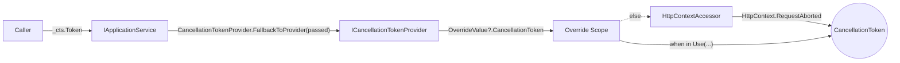

ABP services rarely accept a `CancellationToken` parameter through every method. Forcing one would mean threading the token through repository interfaces, app services, domain services, and cross-cutting interceptors — most of which never need to look at it. Instead ABP exposes a single ambient handle, `ICancellationTokenProvider`, and lets each layer ask the provider for the current token when it needs to call into something cancellable (a database driver, an HTTP client, a Redis cache). This page enumerates that abstraction and the two implementations that ship in the framework.

If you have not already read [threading](/concurrency/threading), do so first — the override mechanism here is just a `BeginScope` on the `IAmbientScopeProvider<T>` documented there.

## File inventory

All files live in `framework/src/Volo.Abp.Threading/Volo/Abp/Threading` except the HTTP-aware replacement, which lives in `framework/src/Volo.Abp.AspNetCore`.

| File | Purpose |
| --- | --- |
| `ICancellationTokenProvider.cs` | The two-member contract: `Token` and `Use(CancellationToken)`. |
| `CancellationTokenProviderBase.cs` | Abstract base — holds the override scope provider and the context key constant. |
| `NullCancellationTokenProvider.cs` | Default singleton — returns `CancellationToken.None` unless overridden. |
| `CancellationTokenOverride.cs` | One-property wrapper used as the scope value. |
| `CancellationTokenProviderExtensions.cs` | `FallbackToProvider(token)` — pick caller token if non-default, else ambient. |
| `Volo.Abp.AspNetCore/Volo/Abp/AspNetCore/Threading/HttpContextCancellationTokenProvider.cs` | Replacement that returns `HttpContext.RequestAborted` when nothing has been overridden. |

## ICancellationTokenProvider

The interface is two members and nothing else.

```csharp framework/src/Volo.Abp.Threading/Volo/Abp/Threading/ICancellationTokenProvider.cs
public interface ICancellationTokenProvider
{
    CancellationToken Token { get; }

    IDisposable Use(CancellationToken cancellationToken);
}
```

| Member | Meaning |
| --- | --- |
| `Token` | The "current" `CancellationToken` for this logical call. If a `Use` scope is active anywhere up the async call chain, returns the overridden token. Otherwise returns whatever the concrete implementation deems the default — `None` for the null provider, `HttpContext.RequestAborted` for the web provider. |
| `Use(token)` | Pushes `token` onto an ambient stack and returns an `IDisposable`. When you dispose, the next-outer token becomes current again. |

The "push and dispose to pop" semantic is implemented once in the base class, so every provider that derives from it gets correct nesting for free.

## CancellationTokenProviderBase

The base class is small enough to read in full:

```csharp framework/src/Volo.Abp.Threading/Volo/Abp/Threading/CancellationTokenProviderBase.cs
public abstract class CancellationTokenProviderBase : ICancellationTokenProvider
{
    public const string CancellationTokenOverrideContextKey
        = "Volo.Abp.Threading.CancellationToken.Override";

    public abstract CancellationToken Token { get; }

    protected IAmbientScopeProvider<CancellationTokenOverride> CancellationTokenOverrideScopeProvider { get; }

    protected CancellationTokenOverride? OverrideValue
        => CancellationTokenOverrideScopeProvider.GetValue(CancellationTokenOverrideContextKey);

    protected CancellationTokenProviderBase(
        IAmbientScopeProvider<CancellationTokenOverride> cancellationTokenOverrideScopeProvider)
    {
        CancellationTokenOverrideScopeProvider = cancellationTokenOverrideScopeProvider;
    }

    public IDisposable Use(CancellationToken cancellationToken)
    {
        return CancellationTokenOverrideScopeProvider.BeginScope(
            CancellationTokenOverrideContextKey,
            new CancellationTokenOverride(cancellationToken));
    }
}
```

Three things to take away:

<Steps>
  <Step title="One global key">
    `CancellationTokenOverrideContextKey` is a string constant — `"Volo.Abp.Threading.CancellationToken.Override"`. Every provider (null, HTTP context, your own) reads and writes the same key, so a `Use` call made through one provider is visible to any other provider asked for `Token` later in the same logical flow.
  </Step>
  <Step title="Token resolution is per-implementation">
    `Token` is abstract. The base class only knows how to *override*; how to compute the **fallback** is the concrete class's job.
  </Step>
  <Step title="The override value is a tiny wrapper">
    `CancellationTokenOverride` exists so the generic parameter on `IAmbientScopeProvider<T>` is a concrete class, not a struct. That avoids any boxing surprises when the scope provider stores it through an `object?` ambient slot.
  </Step>
</Steps>

```csharp framework/src/Volo.Abp.Threading/Volo/Abp/Threading/CancellationTokenOverride.cs
public class CancellationTokenOverride
{
    public CancellationToken CancellationToken { get; }

    public CancellationTokenOverride(CancellationToken cancellationToken)
    {
        CancellationToken = cancellationToken;
    }
}
```

## NullCancellationTokenProvider

This is the implementation registered by `AbpThreadingModule` — it is what you get in a console host, a worker service, a test harness, or any non-web context.

```csharp framework/src/Volo.Abp.Threading/Volo/Abp/Threading/NullCancellationTokenProvider.cs
public class NullCancellationTokenProvider : CancellationTokenProviderBase
{
    public static NullCancellationTokenProvider Instance { get; } = new();

    public override CancellationToken Token
        => OverrideValue?.CancellationToken ?? CancellationToken.None;

    private NullCancellationTokenProvider()
        : base(new AmbientDataContextAmbientScopeProvider<CancellationTokenOverride>(
            new AsyncLocalAmbientDataContext()))
    {
    }
}
```

Two details worth highlighting:

<Note>
The constructor is **private**, and the class exposes a single static `Instance`. `AbpThreadingModule` registers that instance directly: `AddSingleton<ICancellationTokenProvider>(NullCancellationTokenProvider.Instance)`. Because the instance is created outside the DI container, it has to construct its own `IAmbientScopeProvider<CancellationTokenOverride>` — which it does, with a freshly-allocated `AsyncLocalAmbientDataContext`.
</Note>

That last point matters: `NullCancellationTokenProvider.Instance` does **not** share its ambient context with services that resolve `IAmbientDataContext` from DI. If you want overrides to be observable from both the null provider and (say) a custom data filter that also reads `IAmbientDataContext` directly, replace the provider before relying on cross-visibility.

When `Token` is asked:

| State of ambient scope | `Token` returns |
| --- | --- |
| No active `Use(...)` scope | `CancellationToken.None` |
| Inside a `Use(t)` scope | `t` |
| Inside nested `Use(a)` → `Use(b)` | `b` until the inner scope is disposed, then `a` |

## HttpContextCancellationTokenProvider

In an ASP.NET Core host you want database calls, cache reads, and HTTP outbound calls to be cancelled when the browser closes the connection. That signal is `HttpContext.RequestAborted`. ABP exposes it through an alternative provider:

```csharp framework/src/Volo.Abp.AspNetCore/Volo/Abp/AspNetCore/Threading/HttpContextCancellationTokenProvider.cs
[Dependency(ReplaceServices = true)]
public class HttpContextCancellationTokenProvider : CancellationTokenProviderBase, ITransientDependency
{
    private readonly IHttpContextAccessor _httpContextAccessor;

    public override CancellationToken Token {
        get {
            if (OverrideValue != null)
            {
                return OverrideValue.CancellationToken;
            }
            return _httpContextAccessor.HttpContext?.RequestAborted ?? CancellationToken.None;
        }
    }

    public HttpContextCancellationTokenProvider(
        IAmbientScopeProvider<CancellationTokenOverride> cancellationTokenOverrideScopeProvider,
        IHttpContextAccessor httpContextAccessor)
        : base(cancellationTokenOverrideScopeProvider)
    {
        _httpContextAccessor = httpContextAccessor;
    }
}
```

A few specifics:

- `[Dependency(ReplaceServices = true)]` causes ABP's conventional DI to *replace* the previously registered `ICancellationTokenProvider` with this one. There is no need to do `ReplaceServices` yourself — referencing `AbpAspNetCoreModule` is enough.
- `ITransientDependency` makes the provider transient. That is safe because the only mutable state is in `IAmbientScopeProvider<CancellationTokenOverride>`, which is a singleton holding an `AsyncLocal`.
- The constructor takes `IAmbientScopeProvider<CancellationTokenOverride>` from DI — so unlike the null provider, this one **does** share its override stack with anything else that resolves the same scope provider type.
- `Token` honours the override first, then falls back to `HttpContext.RequestAborted`, then to `CancellationToken.None` if there is no active HTTP context (e.g. inside an in-process background job that runs on a thread without an `HttpContext`).



## FallbackToProvider — the bridge for accepted-token APIs

Some ABP services *do* accept a `CancellationToken` argument, because their public surface should match their backing store. `IDistributedCache`, `IBlobContainer`, several store interfaces — they all let callers pass a token. The convention is "if the caller passed something, use it; otherwise fall back to whatever the provider says is current". That convention is implemented once:

```csharp framework/src/Volo.Abp.Threading/Volo/Abp/Threading/CancellationTokenProviderExtensions.cs
public static class CancellationTokenProviderExtensions
{
    public static CancellationToken FallbackToProvider(
        this ICancellationTokenProvider provider,
        CancellationToken prefferedValue = default)
    {
        return prefferedValue == default || prefferedValue == CancellationToken.None
            ? provider.Token
            : prefferedValue;
    }
}
```

Real-world usage from `Volo.Abp.Caching.DistributedCache`:

```csharp framework/src/Volo.Abp.Caching/Volo/Abp/Caching/DistributedCache.cs
await Cache.SetAsync(
    NormalizeKey(key),
    Serializer.Serialize(cacheValue),
    Options.AbsoluteExpiration,
    CancellationTokenProvider.FallbackToProvider(token)
);
```

`token` is the optional parameter on the public `IDistributedCache<>` method. If the caller passed one, that wins. If they passed `default`, the ambient `ICancellationTokenProvider` decides — which means in a web host the token is `HttpContext.RequestAborted` automatically.

<Tip>
When you write your own cancellable infrastructure, follow this convention. Take a `CancellationToken cancellationToken = default` argument, inject `ICancellationTokenProvider`, and pass `CancellationTokenProvider.FallbackToProvider(cancellationToken)` to the underlying API. Existing callers that ignore cancellation still get correct behaviour for free.
</Tip>

## Use scopes in practice

The `Use(token)` call is most common in two situations.

### 1. Background jobs that originated from a web request

A background job started from a controller should not be cancelled when the originating HTTP request ends. The controller code can push `CancellationToken.None`:

```csharp Example
using (cancellationTokenProvider.Use(CancellationToken.None))
{
    await backgroundJobManager.EnqueueAsync(...);
}
```

This shields the enqueue call (and any work it does before the actual job is detached) from the ambient `HttpContext.RequestAborted`.

### 2. Bounded operations with their own deadline

```csharp Example
using var cts = new CancellationTokenSource(TimeSpan.FromSeconds(2));
using (cancellationTokenProvider.Use(cts.Token))
{
    var data = await repository.GetListAsync(); // honours the 2s deadline
}
```

Every downstream service that asks the provider for `Token` will see your `cts.Token`. When you exit the `using`, the previous token (typically `HttpContext.RequestAborted` or `None`) becomes current again.

## Replacing the provider

If neither the null provider nor the HTTP context provider fits — for example, you want to honour a `Quartz.IJobExecutionContext.CancellationToken` inside a Quartz job — derive from `CancellationTokenProviderBase` and register your class with `[Dependency(ReplaceServices = true)]`:

```csharp Example
[Dependency(ReplaceServices = true)]
public class QuartzCancellationTokenProvider : CancellationTokenProviderBase, ITransientDependency
{
    private readonly IJobExecutionContextAccessor _accessor;

    public QuartzCancellationTokenProvider(
        IAmbientScopeProvider<CancellationTokenOverride> scopeProvider,
        IJobExecutionContextAccessor accessor) : base(scopeProvider)
    {
        _accessor = accessor;
    }

    public override CancellationToken Token
        => OverrideValue?.CancellationToken
           ?? _accessor.Current?.CancellationToken
           ?? CancellationToken.None;
}
```

Because the override stack is keyed by a constant string and shared through the singleton `IAmbientScopeProvider<CancellationTokenOverride>`, `Use(token)` calls made by ABP infrastructure still work.

## Putting it together

```mermaid
graph TD
  DI["AbpThreadingModule.ConfigureServices"] --> NullReg["AddSingleton&lt;ICancellationTokenProvider&gt;(NullCancellationTokenProvider.Instance)"]
  DI --> ScopeReg["AddSingleton(typeof(IAmbientScopeProvider&lt;&gt;), typeof(AmbientDataContextAmbientScopeProvider&lt;&gt;))"]
  Web["AbpAspNetCoreModule"] -->|"[Dependency(ReplaceServices = true)]"| Replace["HttpContextCancellationTokenProvider"]
  Replace -.replaces.- NullReg

  Caller["Application code"] -->|Token| Provider["ICancellationTokenProvider"]
  Caller -->|Use(token)| Provider
  Provider -->|"GetValue(key)"| Stack["AmbientDataContextAmbientScopeProvider&lt;CancellationTokenOverride&gt;"]
  Provider -->|fallback| Host["HttpContext.RequestAborted / None"]
```

## See also

<CardGroup cols={2}>
  <Card title="Threading" href="/concurrency/threading">
    The `IAmbientScopeProvider<T>` machinery this builds on.
  </Card>
  <Card title="Timing and clock" href="/concurrency/timing-and-clock">
    Companion ambient services in the timing layer.
  </Card>
  <Card title="Exception handling" href="/utilities/exception-handling">
    How `OperationCanceledException` flows through `IExceptionNotifier`.
  </Card>
  <Card title="Web exception handling" href="/web/exception-handling">
    How cancelled requests appear in the MVC exception filter.
  </Card>
</CardGroup>
